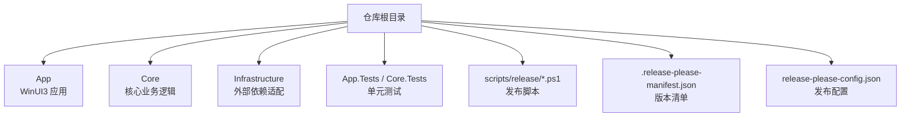
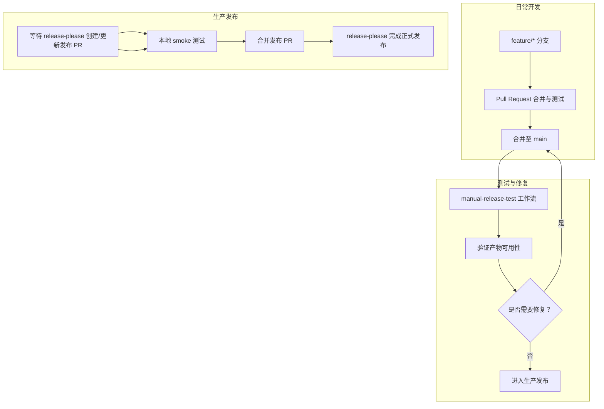
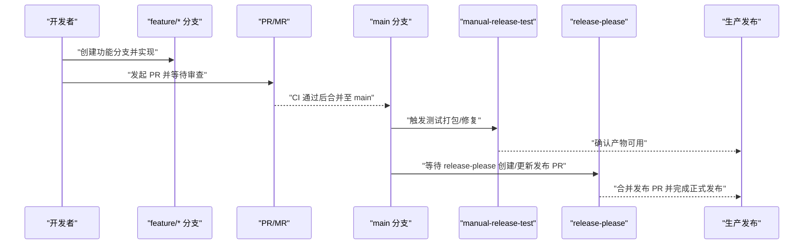
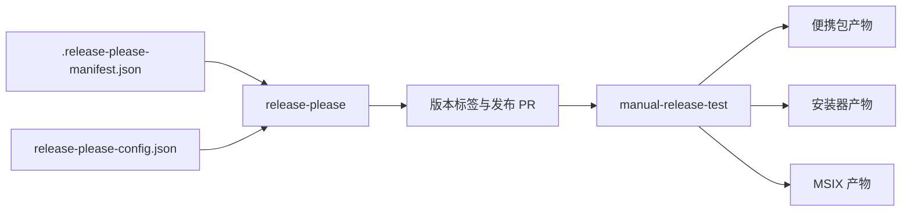

# 分支管理策略

<cite>
**本文引用的文件**
- [README.md](file://README.md)
- [DEVELOPMENT.md](file://DEVELOPMENT.md)
- [.release-please-manifest.json](file://.release-please-manifest.json)
- [release-please-config.json](file://release-please-config.json)
- [scripts/release/Build-PortablePackage.ps1](file://scripts/release/Build-PortablePackage.ps1)
- [scripts/release/Build-InnoInstaller.ps1](file://scripts/release/Build-InnoInstaller.ps1)
- [scripts/release/Build-MsixPackage.ps1](file://scripts/release/Build-MsixPackage.ps1)
</cite>

## 目录
1. [简介](#简介)
2. [项目结构](#项目结构)
3. [核心组件](#核心组件)
4. [架构总览](#架构总览)
5. [详细组件分析](#详细组件分析)
6. [依赖分析](#依赖分析)
7. [性能考虑](#性能考虑)
8. [故障排查指南](#故障排查指南)
9. [结论](#结论)
10. [附录](#附录)

## 简介
本策略文档面向 AutoJS6 开发工具团队，旨在建立统一、高效且可追溯的 Git 分支管理与版本发布流程。结合仓库现有开发与发布实践，明确分支命名规范、创建/合并/删除流程、分支保护与权限控制、语义化版本与标签管理、发布周期与回滚策略，并总结最佳实践与常见问题处理方案，以提升团队协作效率与代码质量。

## 项目结构
仓库采用多模块解决方案组织，包含桌面应用、核心业务层、基础设施适配层及测试工程；同时具备完善的发布自动化脚本与配置，支持便携包、安装器与 MSIX 多产物打包。

图表来源
- [README.md:230-260](file://README.md#L230-L260)
- [DEVELOPMENT.md:252-276](file://DEVELOPMENT.md#L252-L276)

章节来源
- [README.md:230-260](file://README.md#L230-L260)
- [DEVELOPMENT.md:252-276](file://DEVELOPMENT.md#L252-L276)

## 核心组件
- 分支管理与协作
  - 基于功能与修复的分支命名约定，遵循 Conventional Commits 与语义化版本。
  - 通过 Pull Request/Merge Request 进行变更评审与集成，避免直接推送主分支。
- 版本发布与自动化
  - 使用 release-please 自动化发布 PR 与标签，配合手动测试工作流进行质量把关。
  - 本地与 CI 双层验证，确保产物可用性与一致性。
- 产物与元数据
  - 便携包、安装器与 MSIX 三类产物，版本号与元数据由脚本集中注入与校验。

章节来源
- [README.md:376-389](file://README.md#L376-L389)
- [DEVELOPMENT.md:5-16](file://DEVELOPMENT.md#L5-L16)
- [DEVELOPMENT.md:135-161](file://DEVELOPMENT.md#L135-L161)

## 架构总览
下图展示了从日常开发到正式发布的整体流程，强调两条并行路径：常规开发与测试修复路径，以及生产发布路径。release-please 与 manual-release-test 协同工作，确保版本稳定与可追溯。

图表来源
- [DEVELOPMENT.md:5-16](file://DEVELOPMENT.md#L5-L16)
- [DEVELOPMENT.md:135-161](file://DEVELOPMENT.md#L135-L161)

章节来源
- [DEVELOPMENT.md:5-16](file://DEVELOPMENT.md#L5-L16)
- [DEVELOPMENT.md:135-161](file://DEVELOPMENT.md#L135-L161)

## 详细组件分析

### 分支命名规范
- main 主分支
  - 角色：稳定基线，仅接收经评审与测试的变更。
  - 保护：禁止直接推送，必须通过 PR 合并。
- feature 功能分支
  - 命名：feature/<主题>，例如 feature/image-template-cropping。
  - 用途：承载新功能开发，保持与 main 同步，避免长期偏离。
- hotfix 修复分支
  - 命名：hotfix/<问题简述>，例如 hotfix/adb-device-discovery。
  - 用途：紧急修复线上问题，快速回归到 main 与 release 标签。
- release 发布分支
  - 命名：release/<语义化版本>，例如 release/1.2.3。
  - 用途：在发布前进行最终验证与微调，确保版本一致性。

章节来源
- [README.md:376-389](file://README.md#L376-L389)

### 分支创建、合并与删除流程
- 创建
  - 从 main 派生新分支，保持命名规范一致。
  - 在本地完成初步自测与单元测试。
- 合并与保护
  - 提交 PR/MR，至少一名维护者批准。
  - 合并前确保 CI 通过、无冲突、无破坏性变更。
  - main 分支启用保护规则：禁止强制推送、禁止直接推送、要求状态检查通过。
- 删除
  - 合并后及时删除已合并的 feature/hotfix 分支，保持仓库整洁。

章节来源
- [README.md:376-389](file://README.md#L376-L389)
- [DEVELOPMENT.md:135-161](file://DEVELOPMENT.md#L135-L161)

### 分支保护规则与权限控制
- main
  - 禁止推送、强制推送、删除
  - 要求至少一个审查者批准
  - 要求所有 CI 任务通过
- release/*
  - 仅允许维护者合并
  - 合并前需通过 smoke 测试
- feature/* 与 hotfix/*
  - 允许开发者推送，但需 PR 审查与 CI 通过

章节来源
- [DEVELOPMENT.md:135-161](file://DEVELOPMENT.md#L135-L161)

### 版本发布策略
- 语义化版本控制
  - 遵循 MAJOR.MINOR.PATCH 语义化版本。
  - 通过 release-please 自动维护版本号与变更日志。
- 标签管理
  - 生产发布使用 vX.Y.Z 格式标签，与 release-please 输出一致。
  - 修复缺失产物时，基于已有标签重建并重新上传资产。
- 发布周期
  - 常规开发：不触发全量打包，降低资源消耗。
  - 测试打包/修复：使用 manual-release-test 对现有版本进行验证与补救。
  - 生产发布：release-please 创建/更新发布 PR，经本地 smoke 测试后再合并与发布。

章节来源
- [DEVELOPMENT.md:5-16](file://DEVELOPMENT.md#L5-L16)
- [DEVELOPMENT.md:135-161](file://DEVELOPMENT.md#L135-L161)
- [.release-please-manifest.json:1-4](file://.release-please-manifest.json#L1-L4)
- [release-please-config.json:1-11](file://release-please-config.json#L1-L11)

### 产物与元数据注入
- 便携包（ZIP）
  - 由 Build-PortablePackage.ps1 负责发布与打包，注入版本号与四段版本号。
- 安装器（EXE）
  - 由 Build-InnoInstaller.ps1 负责编译与校验，自动解析 Inno Setup 路径。
- MSIX
  - 由 Build-MsixPackage.ps1 负责构建、签名与校验，自动解析 MSBuild 与 SignTool。

章节来源
- [scripts/release/Build-PortablePackage.ps1:1-58](file://scripts/release/Build-PortablePackage.ps1#L1-L58)
- [scripts/release/Build-InnoInstaller.ps1:1-121](file://scripts/release/Build-InnoInstaller.ps1#L1-L121)
- [scripts/release/Build-MsixPackage.ps1:1-201](file://scripts/release/Build-MsixPackage.ps1#L1-L201)

### 发布流程时序图

图表来源
- [DEVELOPMENT.md:5-16](file://DEVELOPMENT.md#L5-L16)
- [DEVELOPMENT.md:135-161](file://DEVELOPMENT.md#L135-L161)

## 依赖分析
- 版本与发布配置
  - .release-please-manifest.json 与 release-please-config.json 共同定义版本类型、变更日志路径与标签行为。
- 打包脚本
  - 三个 PowerShell 脚本分别负责便携包、安装器与 MSIX 的构建、签名与校验，形成稳定的发布流水线。

图表来源
- [.release-please-manifest.json:1-4](file://.release-please-manifest.json#L1-L4)
- [release-please-config.json:1-11](file://release-please-config.json#L1-L11)
- [DEVELOPMENT.md:135-161](file://DEVELOPMENT.md#L135-L161)

章节来源
- [.release-please-manifest.json:1-4](file://.release-please-manifest.json#L1-L4)
- [release-please-config.json:1-11](file://release-please-config.json#L1-L11)
- [DEVELOPMENT.md:135-161](file://DEVELOPMENT.md#L135-L161)

## 性能考虑
- 日常开发阶段避免不必要的全量打包，减少 CI 资源占用。
- 优先验证对用户最友好的产物（EXE 与 ZIP），再扩展到 MSIX。
- 本地先行 smoke 测试，降低 CI 失败率与回滚成本。

章节来源
- [DEVELOPMENT.md:19-32](file://DEVELOPMENT.md#L19-L32)
- [DEVELOPMENT.md:164-179](file://DEVELOPMENT.md#L164-L179)

## 故障排查指南
- 测试打包失败
  - 优先检查代码、打包脚本与工作流配置，修复后再继续生产发布。
- 生产发布页面缺少文件
  - 基于既有标签重新运行测试打包，将缺失产物重新上传至同一 Release。
- 生产包已发布但用户无法使用
  - 在 main 上修复问题并发布下一个补丁版本，避免修改已发布标签。
- 本地 dotnet build 失败
  - 检查平台目标、裁剪与 ReadyToRun 设置，确保构建基线稳定。
- MSIX 构建/签名失败
  - 校验证书 Subject 与 Publisher 一致性、Signtool 可用性与证书导入状态。
- EXE 安装器构建失败
  - 检查 Inno Setup 路径、源发布目录与输出路径可写性。

章节来源
- [DEVELOPMENT.md:182-250](file://DEVELOPMENT.md#L182-L250)

## 结论
通过明确的分支命名与保护规则、严格的 PR 审查流程、release-please 与 manual-release-test 的双轨发布机制，以及统一的版本与标签策略，AutoJS6 开发工具项目能够在保证质量的前提下高效推进迭代。建议团队在实践中持续优化脚本与配置，确保发布流程稳定、可追溯、可回滚。

## 附录
- 关键文件索引
  - README.md：贡献流程与分支命名示例
  - DEVELOPMENT.md：发布路径与排障指引
  - .release-please-manifest.json：当前版本清单
  - release-please-config.json：发布配置
  - scripts/release/*.ps1：发布脚本与产物构建

章节来源
- [README.md:376-389](file://README.md#L376-L389)
- [DEVELOPMENT.md:252-276](file://DEVELOPMENT.md#L252-L276)
- [.release-please-manifest.json:1-4](file://.release-please-manifest.json#L1-L4)
- [release-please-config.json:1-11](file://release-please-config.json#L1-L11)
- [scripts/release/Build-PortablePackage.ps1:1-58](file://scripts/release/Build-PortablePackage.ps1#L1-L58)
- [scripts/release/Build-InnoInstaller.ps1:1-121](file://scripts/release/Build-InnoInstaller.ps1#L1-L121)
- [scripts/release/Build-MsixPackage.ps1:1-201](file://scripts/release/Build-MsixPackage.ps1#L1-L201)