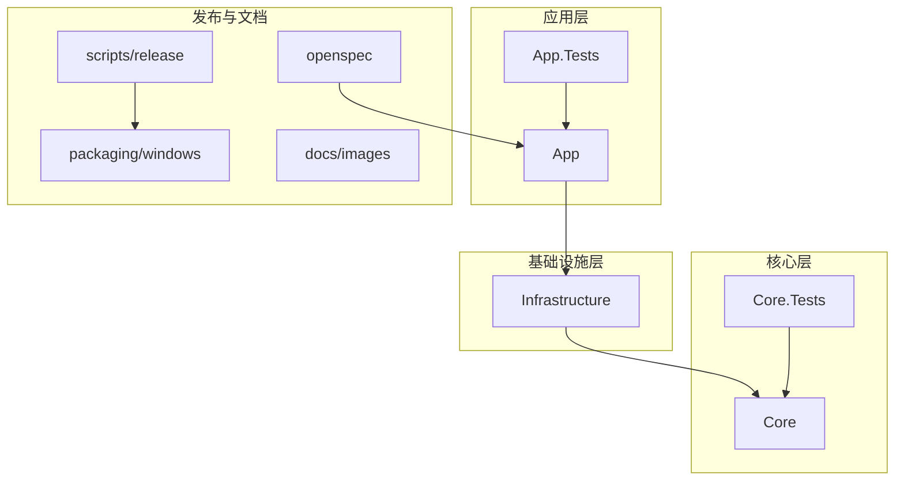
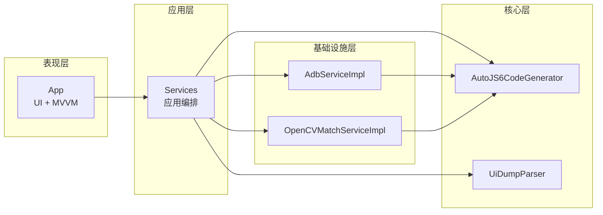
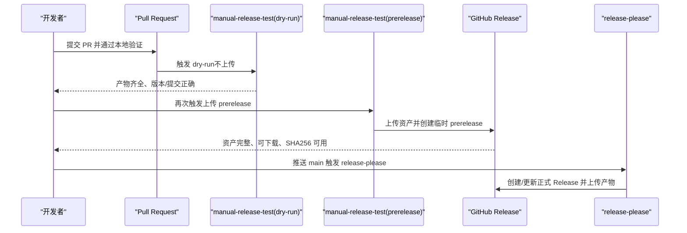
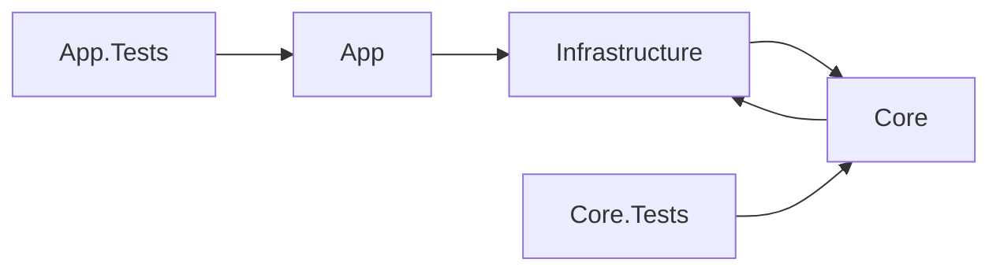

# 开发流程与代码审查

<cite>
**本文引用的文件**
- [DEVELOPMENT.md](file://DEVELOPMENT.md)
- [README.md](file://README.md)
- [README_zh_CN.md](file://README_zh_CN.md)
- [.release-please-manifest.json](file://.release-please-manifest.json)
- [release-please-config.json](file://release-please-config.json)
- [manual.md](file://manual.md)
- [checklist.md](file://checklist.md)
- [AGENTS.md](file://AGENTS.md)
- [openspec/config.yaml](file://openspec/config.yaml)
- [App.Tests/UnitTests.cs](file://App.Tests/UnitTests.cs)
- [Core.Tests/AutoJS6CodeGeneratorTests.cs](file://Core.Tests/AutoJS6CodeGeneratorTests.cs)
- [Core.Tests/UiDumpParserTests.cs](file://Core.Tests/UiDumpParserTests.cs)
</cite>

## 目录
1. [简介](#简介)
2. [项目结构](#项目结构)
3. [核心组件](#核心组件)
4. [架构总览](#架构总览)
5. [详细组件分析](#详细组件分析)
6. [依赖分析](#依赖分析)
7. [性能考量](#性能考量)
8. [故障排查指南](#故障排查指南)
9. [结论](#结论)
10. [附录](#附录)

## 简介
本规范文档面向 AutoJS6 开发工具的团队与贡献者，系统化定义开发流程、Git 分支管理策略、代码审查流程、持续集成与部署流程、质量门禁与检查清单，以及常见问题的解决方案与最佳实践。目标是确保代码质量、发布稳定性与团队协作效率。

## 项目结构
项目采用多项目解决方案，分为应用层、核心业务层与基础设施层，配套测试项目与发布脚本。关键目录与职责概览：
- App：WinUI 3 桌面应用，MVVM 架构，承载 UI 与视图模型
- Core：纯业务逻辑，不含 UI 依赖，独立可测试
- Infrastructure：外部依赖适配层（ADB、OpenCV 等）
- App.Tests/Core.Tests：应用与核心单元测试
- packaging/scripts：Windows 平台打包与发布脚本
- docs/images：README 演示资源
- openspec：OpenSpec 变更提案与配置

图表来源
- [README.md:230-260](file://README.md#L230-L260)
- [README_zh_CN.md:230-260](file://README_zh_CN.md#L230-L260)

章节来源
- [README.md:230-260](file://README.md#L230-L260)
- [README_zh_CN.md:230-260](file://README_zh_CN.md#L230-L260)

## 核心组件
- 应用层（App）：负责 UI 与 MVVM，不直接依赖外部库，通过 Core 与 Infrastructure 访问业务能力
- 核心层（Core）：纯业务逻辑，包含服务接口、领域模型与业务服务，独立可测试
- 基础设施层（Infrastructure）：封装外部依赖（ADB、OpenCV），隔离技术细节
- 测试层（App.Tests/Core.Tests）：覆盖 UI 合同与核心业务逻辑，保障质量门禁
- 发布与打包（packaging/scripts）：提供 ZIP、EXE 安装器与 MSIX 产物，配合 CI/CD

章节来源
- [README.md:264-287](file://README.md#L264-L287)
- [README_zh_CN.md:264-287](file://README_zh_CN.md#L264-L287)
- [App.Tests/UnitTests.cs:1-91](file://App.Tests/UnitTests.cs#L1-L91)
- [Core.Tests/AutoJS6CodeGeneratorTests.cs:1-80](file://Core.Tests/AutoJS6CodeGeneratorTests.cs#L1-L80)
- [Core.Tests/UiDumpParserTests.cs:1-74](file://Core.Tests/UiDumpParserTests.cs#L1-L74)

## 架构总览
项目采用 Clean Architecture 分层，强调双引擎独立（图像引擎与 UI 引擎）、单向依赖（App → Infrastructure → Core ← Infrastructure）与异步优先，确保 UI 流畅、业务可测与外部依赖隔离。

图表来源
- [README.md:264-287](file://README.md#L264-L287)
- [README_zh_CN.md:264-287](file://README_zh_CN.md#L264-L287)

章节来源
- [README.md:264-287](file://README.md#L264-L287)
- [README_zh_CN.md:264-287](file://README_zh_CN.md#L264-L287)

## 详细组件分析

### Git 分支管理策略
- 分支命名规范
  - 功能分支：feature/<功能主题>
  - 修复分支：fix/<问题编号或简述>
  - 发布分支：release/<版本号>
  - 热修复分支：hotfix/<版本号>/<问题简述>
- 合并与保护
  - main 为主保护分支，通过 Pull Request 合并
  - 合并前必须通过本地构建、测试与功能验证清单
  - release 分支用于发布前最终验证，合并后删除
- 版本发布策略
  - 使用 release-please 自动化创建/更新发布 PR
  - 生产发布前先执行 manual-release-test，确认产物可用后再合并发布 PR
  - 若发布后资产缺失，使用 manual-release-test 重新构建并补传资产，避免修改已发布 tag

章节来源
- [DEVELOPMENT.md:135-161](file://DEVELOPMENT.md#L135-L161)
- [manual.md:257-306](file://manual.md#L257-L306)
- [README.md:376-388](file://README.md#L376-L388)

### 代码审查流程
- 审查标准
  - 架构一致性：双引擎独立、单向依赖、异步优先
  - 质量门禁：通过本地构建、测试与 checklist 验证
  - 代码生成约束：遵循 AutoJS6 运行时约束（Rhino 引擎、OOM 预防、模板裁剪规则）
  - 输出与路径：代码格式化、路径分隔符统一、注释完整
- 参与人员
  - 代码作者：完成本地验证与单元测试
  - 审查者：至少一名维护者，优先由架构负责人或领域专家审查
- 审查工具
  - GitHub Pull Request：触发 CI，审查者关注构建、测试与产物完整性
  - 本地验证：使用 checklist 与 manual-release-test 预演
- 决策机制
  - 通过：修复所有 P0 问题，确保功能闭环与稳定性
  - 需要修改：提出具体修改意见，作者修订后复审
  - 拒绝：重大架构违规或安全风险，退回修改

章节来源
- [AGENTS.md:152-226](file://AGENTS.md#L152-L226)
- [AGENTS.md:308-331](file://AGENTS.md#L308-L331)
- [checklist.md:1-186](file://checklist.md#L1-L186)
- [manual.md:447-522](file://manual.md#L447-L522)

### 持续集成与部署流程
- 工作流概览
  - manual-release-test：手动触发，验证打包链与上传链（可选上传至 Release）
  - release-please：推送 main 后自动创建/更新发布 PR，并在满足条件时构建与上传正式产物
- 发布前验证顺序
  1) checklist.md P0 项通过
  2) manual-release-test dry-run 通过
  3) manual-release-test prerelease 上传并通过
  4) 正式发版前候选提交未变化
  5) release-please 正式执行成功
- 产物与校验
  - 产物：win-x64/win-arm64 便携包、安装器、MSIX、签名证书、SHA256SUMS、BUILD-INFO
  - 校验：下载抽检、SHA256 校验、版本与提交号核对

图表来源
- [manual.md:17-40](file://manual.md#L17-L40)
- [manual.md:111-177](file://manual.md#L111-L177)
- [manual.md:180-241](file://manual.md#L180-L241)
- [manual.md:257-306](file://manual.md#L257-L306)

章节来源
- [DEVELOPMENT.md:64-132](file://DEVELOPMENT.md#L64-L132)
- [manual.md:17-40](file://manual.md#L17-L40)
- [manual.md:111-177](file://manual.md#L111-L177)
- [manual.md:180-241](file://manual.md#L180-L241)
- [manual.md:257-306](file://manual.md#L257-L306)

### 质量门禁与检查清单
- P0 必过项：安装与启动、ADB 与设备连接、截图与画布基础能力、图像/控件模式主闭环、基础稳定性
- P1 建议通过项：组合路径验证、反馈与可用性、体验底线
- 条件项：ARM64 产物、MSIX 产物（仅本次发布包含时执行）
- 已知重点风险：ADB 冷启动、分辨率对齐、状态串线、内存增长、失败重试后按钮状态卡死
- 默认假设：v1 首发至少包含 x64 便携包 + x64 安装包；ARM64/MSIX 默认为条件项

章节来源
- [checklist.md:1-186](file://checklist.md#L1-L186)

### 测试与验证
- 单元测试
  - App.Tests：MainPage XAML 合同与关键控件存在性验证
  - Core.Tests：代码生成器与 UI 解析器的关键行为验证
- 集成与端到端
  - manual-release-test：验证打包链与上传链
  - checklist.md：功能闭环与稳定性验证

章节来源
- [App.Tests/UnitTests.cs:1-91](file://App.Tests/UnitTests.cs#L1-L91)
- [Core.Tests/AutoJS6CodeGeneratorTests.cs:1-80](file://Core.Tests/AutoJS6CodeGeneratorTests.cs#L1-L80)
- [Core.Tests/UiDumpParserTests.cs:1-74](file://Core.Tests/UiDumpParserTests.cs#L1-L74)
- [manual.md:111-177](file://manual.md#L111-L177)

## 依赖分析
- 项目层依赖关系：App → Infrastructure → Core ← Infrastructure，确保 Core 无 UI 依赖、无外部库直连
- 外部依赖封装：ADB、OpenCV、ImageSharp 通过 Infrastructure 封装，Core 仅消费抽象接口
- 测试依赖：Core.Tests 依赖 Core；App.Tests 依赖 App，二者相互独立

图表来源
- [README.md:264-287](file://README.md#L264-L287)
- [README_zh_CN.md:264-287](file://README_zh_CN.md#L264-L287)

章节来源
- [README.md:264-287](file://README.md#L264-L287)
- [README_zh_CN.md:264-287](file://README_zh_CN.md#L264-L287)

## 性能考量
- 异步优先：所有 I/O 操作（ADB、OpenCV、XML 解析、纹理上传）使用 async/await，UI 线程永不阻塞
- 渲染性能：Win2D GPU 加速、分层渲染、60 FPS 流畅渲染
- 内存优化：CanvasBitmap 缓存池、阈值滑动仅重算匹配层、控件树虚拟化
- 模块规模：运行时/功能/动作模块上限 255 行，硬上限 512 行，超限必须拆分

章节来源
- [AGENTS.md:229-253](file://AGENTS.md#L229-L253)
- [README.md:282-287](file://README.md#L282-L287)
- [README_zh_CN.md:282-287](file://README_zh_CN.md#L282-L287)

## 故障排查指南
- test packaging 失败
  - 优先修复代码问题、打包脚本问题、工作流配置问题
- 生产 Release 缺失文件
  - 使用 manual-release-test 重新构建并补传资产，避免修改已发布 tag
- 生产包不可用
  - 在 main 修复后发布下一个补丁版本，避免回滚生产 tag
- 本地 dotnet build 失败
  - 检查 Release 构建配置、RID 与平台设置
- MSIX 构建证书/签名错误
  - 校验证书 Subject 与 Publisher、Signtool 可用性、证书导入状态
- EXE 安装器构建失败
  - 检查 Inno Setup、源发布目录与输出路径可写性

章节来源
- [DEVELOPMENT.md:182-250](file://DEVELOPMENT.md#L182-L250)
- [manual.md:330-407](file://manual.md#L330-L407)

## 结论
本规范以“先功能验证、后 Actions 验证、再正式发布”的三段式流程为核心，结合严格的架构约束与质量门禁，确保发布产物稳定可靠。通过 manual-release-test 与 checklist 的双重验证，以及 release-please 的自动化发布，形成从开发到发布的完整闭环。

## 附录

### 发布配置与元数据
- release-please 配置：simple release-type，包含 changelog 路径
- 版本清单：根版本号与发布标识

章节来源
- [release-please-config.json:1-11](file://release-please-config.json#L1-L11)
- [.release-please-manifest.json:1-4](file://.release-please-manifest.json#L1-L4)

### OpenSpec 与变更治理
- OpenSpec 配置：spec-driven 模式，支持为特定制品添加自定义规则
- 变更提案：通过 openspec/changes 目录管理，遵循项目上下文与约束

章节来源
- [openspec/config.yaml:1-21](file://openspec/config.yaml#L1-L21)