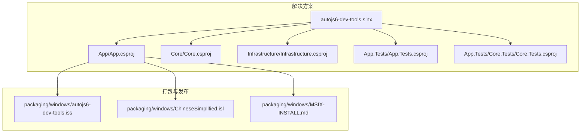
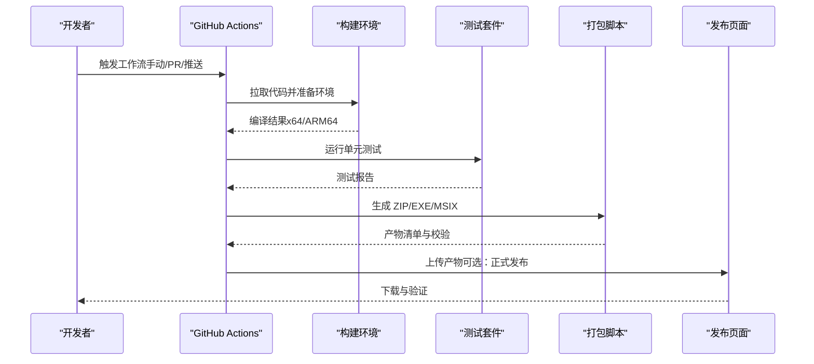
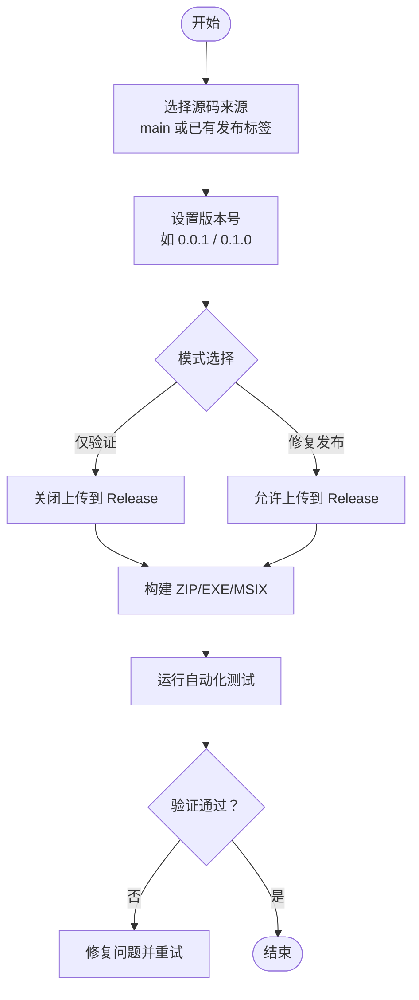
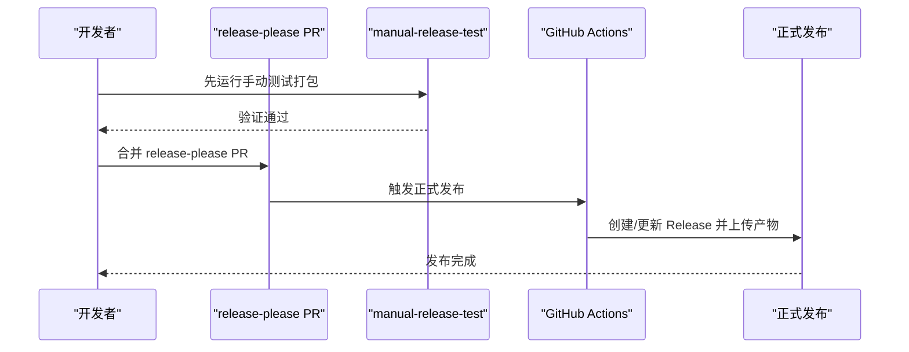
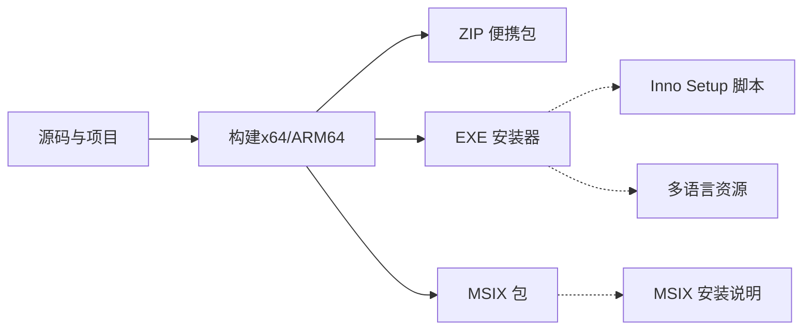
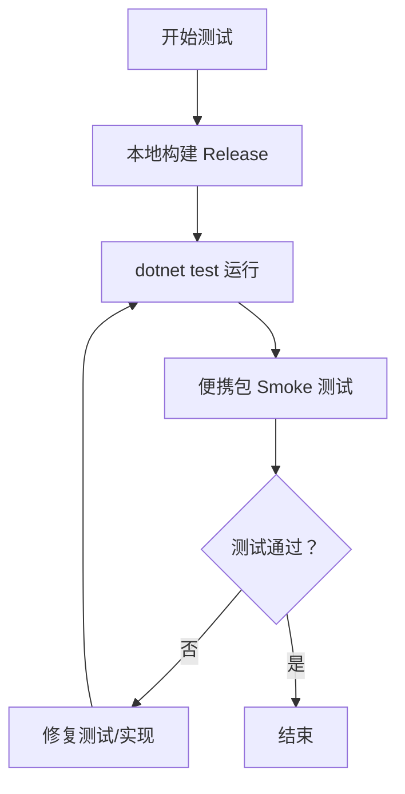
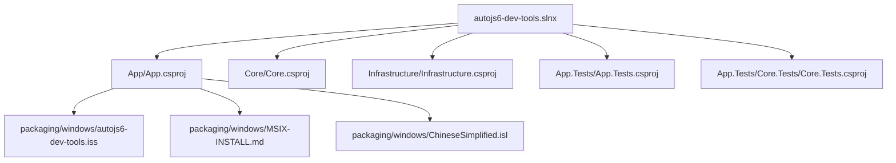

# 持续集成与部署

<cite>
**本文引用的文件**
- [DEVELOPMENT.md](file://DEVELOPMENT.md)
- [DEVELOPMENT_zh_CN.md](file://DEVELOPMENT_zh_CN.md)
- [manual.md](file://manual.md)
- [autojs6-dev-tools.slnx](file://autojs6-dev-tools.slnx)
- [openspec/config.yaml](file://openspec/config.yaml)
- [packaging/windows/autojs6-dev-tools.iss](file://packaging/windows/autojs6-dev-tools.iss)
- [packaging/windows/MSIX-INSTALL.md](file://packaging/windows/MSIX-INSTALL.md)
- [packaging/windows/ChineseSimplified.isl](file://packaging/windows/ChineseSimplified.isl)
- [App/App.csproj](file://App/App.csproj)
- [App.Tests/App.Tests.csproj](file://App.Tests/App.Tests.csproj)
- [Core/Core.csproj](file://Core/Core.csproj)
- [Infrastructure/Infrastructure.csproj](file://Infrastructure/Infrastructure.csproj)
- [App.Tests/Core.Tests/Core.Tests.csproj](file://App.Tests/Core.Tests/Core.Tests.csproj)
- [App.Tests/UnitTests.cs](file://App.Tests/UnitTests.cs)
- [Core.Tests/AutoJS6CodeGeneratorTests.cs](file://Core.Tests/AutoJS6CodeGeneratorTests.cs)
- [Core.Tests/UiDumpParserTests.cs](file://Core.Tests/UiDumpParserTests.cs)
- [Core.Tests/ImageMatchRegionCalculatorTests.cs](file://Core.Tests/ImageMatchRegionCalculatorTests.cs)
</cite>

## 目录
1. [简介](#简介)
2. [项目结构](#项目结构)
3. [核心组件](#核心组件)
4. [架构总览](#架构总览)
5. [详细组件分析](#详细组件分析)
6. [依赖关系分析](#依赖关系分析)
7. [性能考虑](#性能考虑)
8. [故障排查指南](#故障排查指南)
9. [结论](#结论)
10. [附录](#附录)

## 简介
本文件面向 AutoJS6 开发工具的持续集成与持续部署（CI/CD）流程，系统梳理 GitHub Actions 工作流配置与多平台打包策略。重点覆盖以下方面：
- 手动发布测试流程与自动化测试并行推进
- 多平台构建（x64、ARM64）与多种安装包格式（ZIP、MSIX、Inno Setup）
- 部署配置与证书管理，确保安全可靠的自动化发布
- CI/CD 管道各阶段职责划分：代码检出、环境准备、构建、测试、打包与发布

## 项目结构
仓库采用多项目解决方案组织，包含应用主体、核心库、基础设施层、以及测试项目；Windows 平台的打包脚本与安装器配置位于 packaging/windows 目录；CI/CD 相关工作流在 .github/workflows 中定义并通过 DEVELOPMENT 文档进行说明。

图表来源
- [autojs6-dev-tools.slnx](file://autojs6-dev-tools.slnx)
- [App/App.csproj](file://App/App.csproj)
- [Core/Core.csproj](file://Core/Core.csproj)
- [Infrastructure/Infrastructure.csproj](file://Infrastructure/Infrastructure.csproj)
- [App.Tests/App.Tests.csproj](file://App.Tests/App.Tests.csproj)
- [App.Tests/Core.Tests/Core.Tests.csproj](file://App.Tests/Core.Tests/Core.Tests.csproj)
- [packaging/windows/autojs6-dev-tools.iss](file://packaging/windows/autojs6-dev-tools.iss)
- [packaging/windows/ChineseSimplified.isl](file://packaging/windows/ChineseSimplified.isl)
- [packaging/windows/MSIX-INSTALL.md](file://packaging/windows/MSIX-INSTALL.md)

章节来源
- [DEVELOPMENT.md:1-276](file://DEVELOPMENT.md#L1-L276)
- [DEVELOPMENT_zh_CN.md:1-276](file://DEVELOPMENT_zh_CN.md#L1-L276)
- [manual.md:1-520](file://manual.md#L1-L520)
- [autojs6-dev-tools.slnx:1-20](file://autojs6-dev-tools.slnx#L1-L20)

## 核心组件
- GitHub Actions 工作流
  - release-please：自动创建/更新发布 PR，并在确认后完成正式发布
  - manual-release-test：按需触发的手动测试打包流程，用于验证与修复现有发布
- 打包与安装器
  - Inno Setup 安装器：生成 EXE 安装包
  - MSIX 包：Windows 应用商店兼容包
  - ZIP 便携包：直接解压运行
- 测试体系
  - 单元测试：App.Tests、Core.Tests、App.Tests/Core.Tests
  - 自动化测试：配合打包流程进行端到端验证

章节来源
- [DEVELOPMENT.md:64-161](file://DEVELOPMENT.md#L64-L161)
- [DEVELOPMENT.md:164-178](file://DEVELOPMENT.md#L164-L178)
- [manual.md:20-32](file://manual.md#L20-L32)
- [manual.md:258-260](file://manual.md#L258-L260)

## 架构总览
下图展示 CI/CD 管道的整体交互：开发者通过 GitHub Actions 触发工作流，工作流驱动本地或云端构建环境，执行构建、测试与打包，最终产出多平台安装包并上传至发布页或进行签名与分发。

图表来源
- [DEVELOPMENT.md:64-161](file://DEVELOPMENT.md#L64-L161)
- [manual.md:20-32](file://manual.md#L20-L32)
- [manual.md:258-260](file://manual.md#L258-L260)

## 详细组件分析

### 手动发布测试流程（manual-release-test）
该流程用于：
- 对主分支或已发布标签进行快速验证
- 仅在需要时生成完整安装包，避免资源浪费
- 支持“仅验证”与“修复现有发布”的两种模式

关键行为
- 选择源码分支/标签
- 选择版本号（建议使用非正式语义化版本）
- 控制是否上传到 GitHub Release
- 产出 ZIP、EXE、MSIX 三类安装包

图表来源
- [DEVELOPMENT.md:64-132](file://DEVELOPMENT.md#L64-L132)
- [manual.md:20-32](file://manual.md#L20-L32)

章节来源
- [DEVELOPMENT.md:64-132](file://DEVELOPMENT.md#L64-L132)
- [manual.md:20-32](file://manual.md#L20-L32)

### 生产发布流程（release-please）
该流程负责：
- 基于提交历史自动生成/更新发布 PR
- 在 PR 被合并后，自动完成正式版本发布
- 与 manual-release-test 协同：先手动验证，再由 release-please 正式发布

图表来源
- [DEVELOPMENT.md:135-161](file://DEVELOPMENT.md#L135-L161)
- [manual.md:258-260](file://manual.md#L258-L260)

章节来源
- [DEVELOPMENT.md:135-161](file://DEVELOPMENT.md#L135-L161)
- [manual.md:258-260](file://manual.md#L258-L260)

### 多平台构建与打包策略
- 平台与架构
  - win-x64：x64 架构
  - win-arm64：ARM64 架构
- 安装包格式
  - ZIP：便携包，适合直接解压运行
  - EXE：Inno Setup 安装器，提供标准 Windows 安装体验
  - MSIX：现代 Windows 应用包，便于分发与更新
- 打包脚本与配置
  - Inno Setup 脚本：定义安装器界面与安装行为
  - MSIX 安装说明：描述证书与信任流程
  - 语言资源：Inno Setup 多语言脚本

图表来源
- [DEVELOPMENT.md:164-178](file://DEVELOPMENT.md#L164-L178)
- [packaging/windows/autojs6-dev-tools.iss](file://packaging/windows/autojs6-dev-tools.iss)
- [packaging/windows/MSIX-INSTALL.md](file://packaging/windows/MSIX-INSTALL.md)
- [packaging/windows/ChineseSimplified.isl](file://packaging/windows/ChineseSimplified.isl)

章节来源
- [DEVELOPMENT.md:164-178](file://DEVELOPMENT.md#L164-L178)
- [packaging/windows/autojs6-dev-tools.iss](file://packaging/windows/autojs6-dev-tools.iss)
- [packaging/windows/MSIX-INSTALL.md](file://packaging/windows/MSIX-INSTALL.md)
- [packaging/windows/ChineseSimplified.isl](file://packaging/windows/ChineseSimplified.isl)

### 测试执行与质量门禁
- 测试范围
  - App.Tests：应用层单元测试
  - Core.Tests：核心算法与服务测试
  - App.Tests/Core.Tests：组合与集成测试
- 测试建议
  - 在本地先执行 dotnet test，确保构建与测试通过后再进入打包阶段
  - 使用 smoke 测试脚本对便携包进行快速验证

图表来源
- [DEVELOPMENT.md:47-61](file://DEVELOPMENT.md#L47-L61)
- [App.Tests/UnitTests.cs](file://App.Tests/UnitTests.cs)
- [Core.Tests/AutoJS6CodeGeneratorTests.cs](file://Core.Tests/AutoJS6CodeGeneratorTests.cs)
- [Core.Tests/UiDumpParserTests.cs](file://Core.Tests/UiDumpParserTests.cs)
- [Core.Tests/ImageMatchRegionCalculatorTests.cs](file://Core.Tests/ImageMatchRegionCalculatorTests.cs)

章节来源
- [DEVELOPMENT.md:47-61](file://DEVELOPMENT.md#L47-L61)
- [App.Tests/UnitTests.cs](file://App.Tests/UnitTests.cs)
- [Core.Tests/AutoJS6CodeGeneratorTests.cs](file://Core.Tests/AutoJS6CodeGeneratorTests.cs)
- [Core.Tests/UiDumpParserTests.cs](file://Core.Tests/UiDumpParserTests.cs)
- [Core.Tests/ImageMatchRegionCalculatorTests.cs](file://Core.Tests/ImageMatchRegionCalculatorTests.cs)

### 部署配置与证书管理
- 发布身份与命名
  - 产品名、包标识、发布者等信息需保持一致，避免安装器标题或包名异常
- 证书与签名
  - MSIX 签名需满足证书主题与发布者匹配
  - 本地验证需导入证书到受信存储
- 安装器与语言
  - Inno Setup 安装器与多语言脚本需正确配置
  - MSIX 安装说明需明确信任流程

章节来源
- [DEVELOPMENT.md:252-276](file://DEVELOPMENT.md#L252-L276)
- [packaging/windows/MSIX-INSTALL.md](file://packaging/windows/MSIX-INSTALL.md)
- [packaging/windows/ChineseSimplified.isl](file://packaging/windows/ChineseSimplified.isl)

## 依赖关系分析
- 解决方案与项目
  - autojs6-dev-tools.slnx 统一编排 App、Core、Infrastructure 与测试项目
- 打包依赖
  - App 项目与打包脚本（ISS、MSIX-INSTALL、ISL）存在直接关联
- 工作流依赖
  - DEVELOPMENT/manual 文档列出工作流文件路径，表明工作流与项目结构的耦合关系

图表来源
- [autojs6-dev-tools.slnx](file://autojs6-dev-tools.slnx)
- [App/App.csproj](file://App/App.csproj)
- [Core/Core.csproj](file://Core/Core.csproj)
- [Infrastructure/Infrastructure.csproj](file://Infrastructure/Infrastructure.csproj)
- [App.Tests/App.Tests.csproj](file://App.Tests/App.Tests.csproj)
- [App.Tests/Core.Tests/Core.Tests.csproj](file://App.Tests/Core.Tests/Core.Tests.csproj)
- [packaging/windows/autojs6-dev-tools.iss](file://packaging/windows/autojs6-dev-tools.iss)
- [packaging/windows/MSIX-INSTALL.md](file://packaging/windows/MSIX-INSTALL.md)
- [packaging/windows/ChineseSimplified.isl](file://packaging/windows/ChineseSimplified.isl)

章节来源
- [autojs6-dev-tools.slnx:1-20](file://autojs6-dev-tools.slnx#L1-L20)
- [DEVELOPMENT.md:264-276](file://DEVELOPMENT.md#L264-L276)

## 性能考虑
- 资源优化
  - 日常开发不触发全量打包，减少不必要的计算与存储消耗
  - 仅在需要时运行 manual-release-test，避免污染公共发布页
- 构建基线
  - 优先保证 Release 构建可稳定通过，再进行签名与发布相关任务
- 产物优先级
  - 以 EXE 与 ZIP 为主要验证对象，确保用户第一触达体验

章节来源
- [DEVELOPMENT.md:19-31](file://DEVELOPMENT.md#L19-L31)
- [DEVELOPMENT.md:164-178](file://DEVELOPMENT.md#L164-L178)
- [DEVELOPMENT.md:224-231](file://DEVELOPMENT.md#L224-L231)

## 故障排查指南
- 手动测试失败
  - 优先修复代码、打包脚本与工作流配置问题
- 生产发布缺失文件
  - 修复现有发布而非新建版本，重新针对同一标签运行 manual-release-test 并回传缺失资产
- 生产包可用性问题
  - 修复主分支问题并发布补丁版本，避免重写已发布标签
- 本地 dotnet 构建失败
  - 检查平台目标、裁剪与 ReadyToRun 设置
- 本地 MSIX 签名错误
  - 核对证书主题与发布者、Signtool 可用性与本地证书导入状态
- 本地 EXE 安装器失败
  - 检查 Inno Setup 与输出路径权限

章节来源
- [DEVELOPMENT.md:182-250](file://DEVELOPMENT.md#L182-L250)

## 结论
通过 manual-release-test 与 release-please 的双轨流程，AutoJS6 开发工具实现了“先验证、后发布”的稳健 CI/CD 实践。结合多平台与多格式打包策略，配合严格的证书与签名管理，确保了从开发到发布的全流程可控、可追溯与可复现。

## 附录
- 相关文件索引
  - 工作流文件：release-please.yml、manual-release-test.yml
  - 打包脚本：Set-AppReleaseMetadata.ps1、New-CodeSigningCertificate.ps1、Build-PortablePackage.ps1、Build-InnoInstaller.ps1、Build-MsixPackage.ps1
  - 安装器与说明：autojs6-dev-tools.iss、ChineseSimplified.isl、MSIX-INSTALL.md
  - 开发与操作手册：DEVELOPMENT.md、DEVELOPMENT_zh_CN.md、manual.md

章节来源
- [DEVELOPMENT.md:264-276](file://DEVELOPMENT.md#L264-L276)
- [manual.md:20-32](file://manual.md#L20-L32)
- [manual.md:258-260](file://manual.md#L258-L260)
- [openspec/config.yaml:1-21](file://openspec/config.yaml#L1-L21)