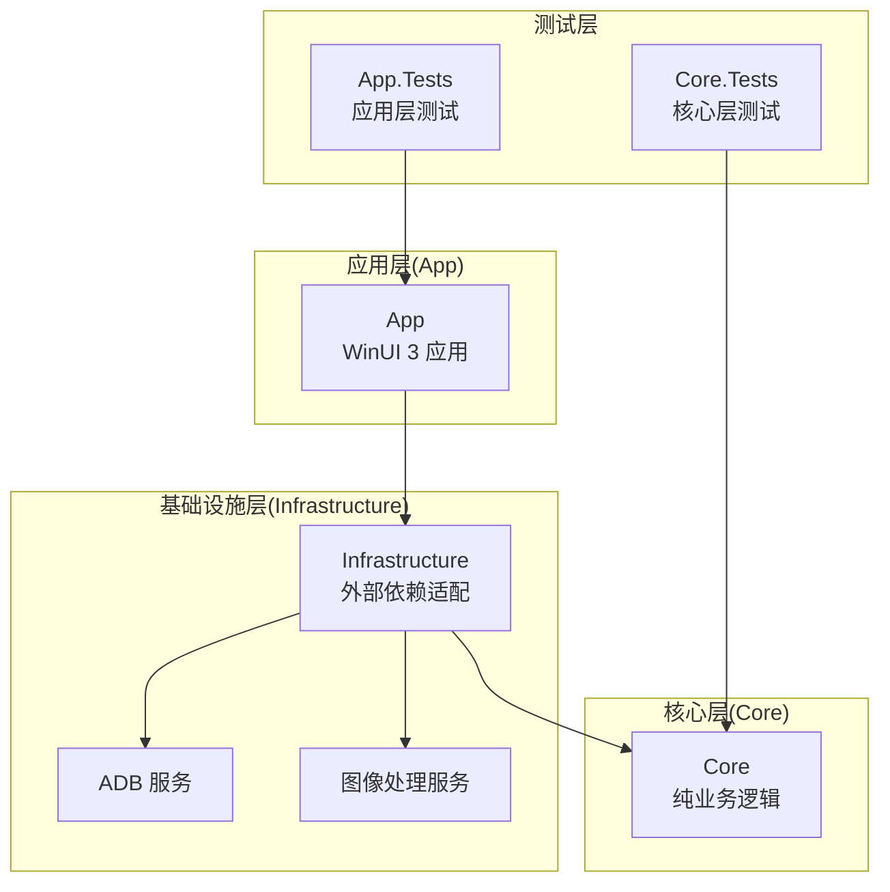
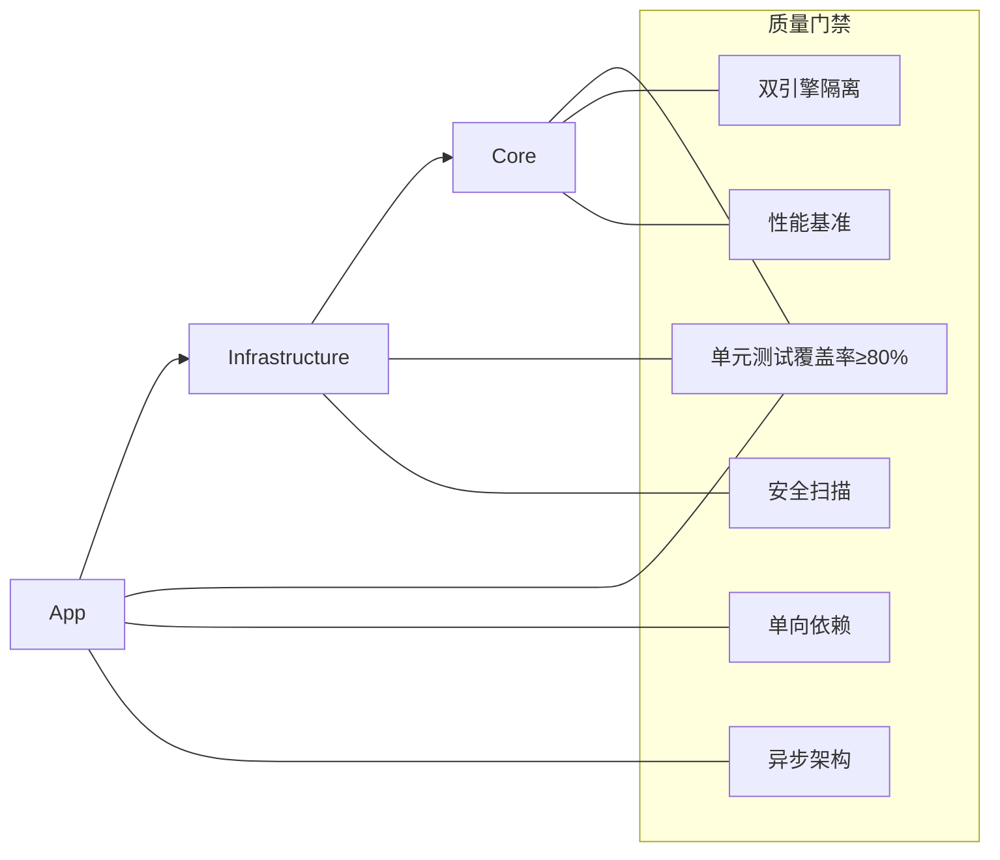
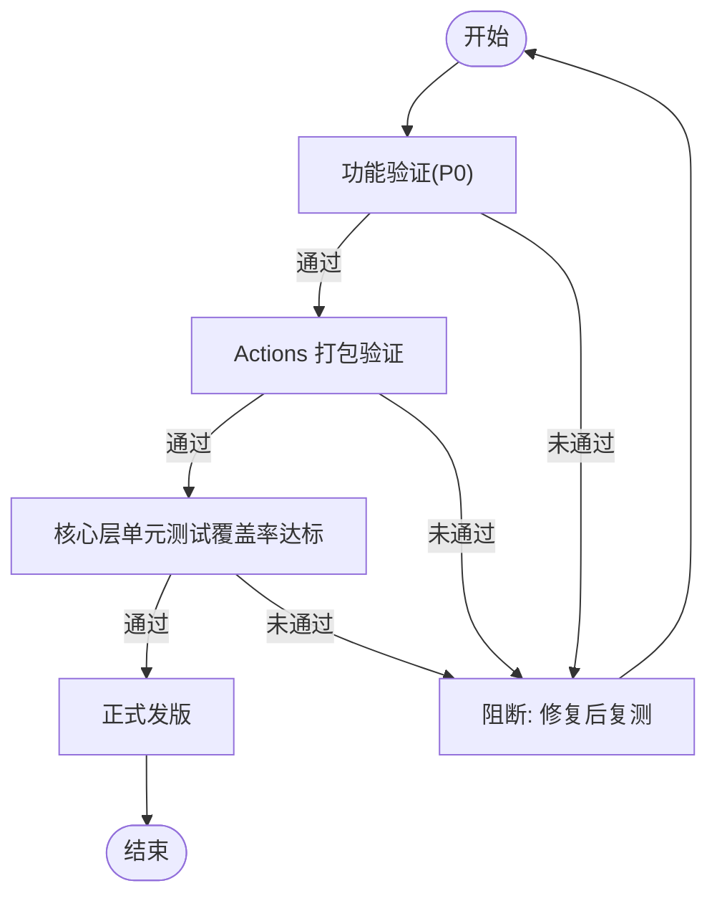
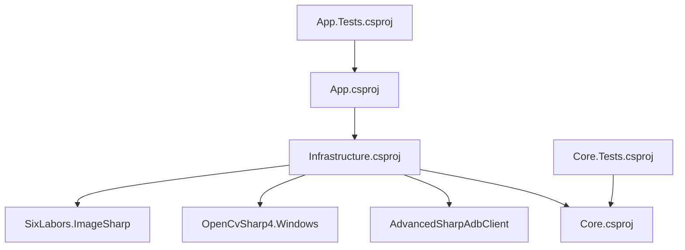

# 质量门禁标准

<cite>
**本文引用的文件**
- [README.md](file://README.md)
- [checklist.md](file://checklist.md)
- [manual.md](file://manual.md)
- [App.csproj](file://App/App.csproj)
- [Core.csproj](file://Core/Core.csproj)
- [Infrastructure.csproj](file://Infrastructure/Infrastructure.csproj)
- [App.Tests.csproj](file://App.Tests/App.Tests.csproj)
- [Core.Tests.csproj](file://Core.Tests/Core.Tests.csproj)
- [AutoJS6CodeGeneratorTests.cs](file://Core.Tests/AutoJS6CodeGeneratorTests.cs)
- [UiDumpParserTests.cs](file://Core.Tests/UiDumpParserTests.cs)
- [ImageMatchRegionCalculatorTests.cs](file://Core.Tests/ImageMatchRegionCalculatorTests.cs)
</cite>

## 目录
1. [引言](#引言)
2. [项目结构](#项目结构)
3. [核心组件](#核心组件)
4. [架构总览](#架构总览)
5. [详细组件分析](#详细组件分析)
6. [依赖关系分析](#依赖关系分析)
7. [性能考虑](#性能考虑)
8. [故障排查指南](#故障排查指南)
9. [结论](#结论)
10. [附录](#附录)

## 引言
本文件为 AutoJS6 开发工具制定质量门禁标准与检查清单，目标是确保只有符合既定质量门槛的变更方可进入下一阶段。质量门禁覆盖单元测试覆盖率、代码复杂度限制、安全漏洞扫描与性能基准要求；质量检查清单涵盖功能测试、集成测试、回归测试与兼容性测试的关键指标；同时提供质量度量指标与监控方法，以及质量门禁的触发条件与处理流程。

## 项目结构
AutoJS6 开发工具采用分层架构与多项目组织方式，便于独立测试与质量控制：
- App：WinUI 3 桌面应用，MVVM 架构，负责用户交互与视图模型
- Core：纯业务逻辑层，无 UI 依赖，独立可测试
- Infrastructure：外部依赖适配层（ADB、OpenCV、ImageSharp 等）
- App.Tests：应用层测试
- Core.Tests：核心层测试

图表来源
- [App.csproj:1-84](file://App/App.csproj#L1-L84)
- [Core.csproj:1-10](file://Core/Core.csproj#L1-L10)
- [Infrastructure.csproj:1-19](file://Infrastructure/Infrastructure.csproj#L1-L19)
- [App.Tests.csproj:1-17](file://App.Tests/App.Tests.csproj#L1-L17)
- [Core.Tests.csproj:1-21](file://Core.Tests/Core.Tests.csproj#L1-L21)

章节来源
- [README.md:230-260](file://README.md#L230-L260)
- [App.csproj:1-84](file://App/App.csproj#L1-L84)
- [Core.csproj:1-10](file://Core/Core.csproj#L1-L10)
- [Infrastructure.csproj:1-19](file://Infrastructure/Infrastructure.csproj#L1-L19)
- [App.Tests.csproj:1-17](file://App.Tests/App.Tests.csproj#L1-L17)
- [Core.Tests.csproj:1-21](file://Core.Tests/Core.Tests.csproj#L1-L21)

## 核心组件
- 应用层(App)
  - 职责：UI 渲染、MVVM 命令与绑定、视图模型协调
  - 关键特性：WinUI 3、CommunityToolkit.Mvvm、Win2D 加速渲染
- 核心层(Core)
  - 职责：业务规则、数据模型、代码生成策略
  - 关键特性：纯函数、无 UI 依赖、可独立测试
- 基础设施层(Infrastructure)
  - 职责：外部系统适配（ADB、OpenCV、ImageSharp）
  - 关键特性：封装第三方库，隔离平台差异

章节来源
- [README.md:264-287](file://README.md#L264-L287)
- [App.csproj:60-64](file://App/App.csproj#L60-L64)
- [Infrastructure.csproj:13-17](file://Infrastructure/Infrastructure.csproj#L13-L17)

## 架构总览
质量门禁围绕三层架构展开，强调：
- 双引擎独立：图像引擎与 UI 引擎数据与处理完全解耦
- 单向依赖：App → Infrastructure → Core
- 异步优先：I/O 操作统一使用 async/await，避免 UI 阻塞

图表来源
- [README.md:266-287](file://README.md#L266-L287)
- [Core.Tests.csproj:1-21](file://Core.Tests/Core.Tests.csproj#L1-L21)

章节来源
- [README.md:264-287](file://README.md#L264-L287)

## 详细组件分析

### 单元测试覆盖率与复杂度限制
- 覆盖率目标
  - 核心层(CORE)：单元测试覆盖率不低于 80%
  - 应用层(APP)：单元测试覆盖率不低于 60%
- 复杂度限制
  - 方法行数不超过 512 行
  - 类体积控制在合理范围内，避免过度耦合
- 测试框架
  - MSTest（Microsoft.NET.Test.Sdk + MSTest.TestAdapter/TestFramework）

章节来源
- [README.md:314-318](file://README.md#L314-L318)
- [Core.Tests.csproj:1-21](file://Core.Tests/Core.Tests.csproj#L1-L21)
- [App.Tests.csproj:1-17](file://App.Tests/App.Tests.csproj#L1-L17)

### 安全漏洞扫描
- 依赖扫描
  - 使用 NuGet 包管理器定期扫描已知漏洞
  - 关注 AdvancedSharpAdbClient、OpenCvSharp4.Windows、SixLabors.ImageSharp 等关键包的安全公告
- 代码扫描
  - 使用静态分析工具（如 SonarQube、CodeQL）识别潜在安全问题
  - 关注输入验证、资源释放、敏感信息处理

章节来源
- [Infrastructure.csproj:13-17](file://Infrastructure/Infrastructure.csproj#L13-L17)

### 性能基准要求
- 渲染性能
  - 画布渲染保持 60 FPS，避免 UI 线程阻塞
- 匹配性能
  - 模板匹配应在合理时间内完成，避免全屏扫描
- 内存管理
  - 及时回收图像资源，防止 OOM
- 并发与取消
  - 支持 CancellationToken，避免长时间后台任务占用资源

章节来源
- [README.md:184-189](file://README.md#L184-L189)
- [README.md:362-368](file://README.md#L362-L368)
- [README.md:282-286](file://README.md#L282-L286)

### 功能测试清单
- 安装与启动
  - x64 便携包与安装包均可正常启动，10 秒内不崩溃
  - 支持卸载
- ADB 与设备连接
  - 可发现设备，支持 USB/TCP/IP 连接
  - 未选设备时截图前给出明确提示
- 截图与画布
  - 截图加载时间≤5 秒
  - 画布缩放、平移流畅
- 图像模式
  - 裁剪区域变化后 regionRef 同步更新
  - 匹配结果可视化，命中/未命中、置信度、耗时可见
  - 生成代码包含模板路径、阈值、区域等关键参数
- 控件模式
  - UI 树解析成功，节点数量与展示状态正常
  - 画布显示控件边界框，属性面板可复制 UiSelector
- 稳定性
  - 连续截图/匹配/操作 10 次不崩溃
  - 失败后仍可继续下一次操作

章节来源
- [checklist.md:31-95](file://checklist.md#L31-L95)
- [checklist.md:58-87](file://checklist.md#L58-L87)
- [checklist.md:88-95](file://checklist.md#L88-L95)

### 集成测试清单
- 组合路径验证
  - 当前裁剪+当前截图、当前裁剪+外部截图、外部模板+当前截图、外部模板+外部截图均能完成匹配
- 日志与反馈
  - 无设备/无截图/无模板/UI 树解析失败时提示清晰
  - 日志可清空、可复制
- 状态一致性
  - 模式切换后界面状态符合预期，不残留上一模式状态

章节来源
- [checklist.md:100-126](file://checklist.md#L100-L126)

### 回归测试清单
- 基础稳定性
  - 连续 10 次截图/匹配/操作无状态错乱
  - 失败重试后按钮状态不卡死
- 内存占用
  - 连续多次匹配后内存占用不持续增长
- 跨分辨率一致性
  - 不同分辨率设备下截图与 UI 坐标对齐

章节来源
- [checklist.md:88-95](file://checklist.md#L88-L95)
- [checklist.md:146-153](file://checklist.md#L146-L153)

### 兼容性测试清单
- ARM64 产物
  - 便携包与安装包可启动、安装、卸载
- MSIX 产物
  - x64/ARM64 MSIX 可安装与启动
  - 证书安装与信任说明清晰

章节来源
- [checklist.md:131-143](file://checklist.md#L131-L143)

### 质量度量指标与监控
- 代码质量评分
  - 通过静态分析工具（如 SonarQube）计算技术债、重复率、圈复杂度等
- 构建成功率
  - GitHub Actions 打包链路成功率≥95%
- 发布质量评估
  - 通过 checklist.md 的 P0 项与 Actions 预演结果综合评估

章节来源
- [manual.md:4-13](file://manual.md#L4-L13)
- [manual.md:440-445](file://manual.md#L440-L445)

### 质量门禁触发条件与处理流程
- 触发条件
  - 通过 checklist.md 的 P0 项
  - 通过 GitHub Actions 打包链路（dry-run 与 prerelease 预演）
  - 核心层单元测试覆盖率达标
- 处理流程
  - 人工功能验证 → Actions 打包验证 → 正式发版
  - 若任一步失败，一票否决，修复后复测

图表来源
- [checklist.md:29-95](file://checklist.md#L29-L95)
- [manual.md:440-445](file://manual.md#L440-L445)

章节来源
- [checklist.md:29-95](file://checklist.md#L29-L95)
- [manual.md:243-254](file://manual.md#L243-L254)

## 依赖关系分析
- 项目依赖
  - App 依赖 Infrastructure
  - Infrastructure 依赖 Core
  - 测试项目分别依赖各自实现项目
- 外部依赖
  - ADB 通信：AdvancedSharpAdbClient
  - 图像处理：OpenCvSharp4.Windows、SixLabors.ImageSharp
  - UI 框架：Microsoft.WindowsAppSDK、CommunityToolkit.Mvvm、Microsoft.Graphics.Win2D

图表来源
- [App.csproj:67-67](file://App/App.csproj#L67-L67)
- [Infrastructure.csproj:9-17](file://Infrastructure/Infrastructure.csproj#L9-L17)
- [App.Tests.csproj:1-17](file://App.Tests/App.Tests.csproj#L1-L17)
- [Core.Tests.csproj:17-20](file://Core.Tests/Core.Tests.csproj#L17-L20)

章节来源
- [App.csproj:67-67](file://App/App.csproj#L67-L67)
- [Infrastructure.csproj:9-17](file://Infrastructure/Infrastructure.csproj#L9-L17)
- [App.Tests.csproj:1-17](file://App.Tests/App.Tests.csproj#L1-L17)
- [Core.Tests.csproj:17-20](file://Core.Tests/Core.Tests.csproj#L17-L20)

## 性能考虑
- 渲染与交互
  - Win2D GPU 加速，保持 60 FPS
  - 异步 I/O 与 CancellationToken，避免阻塞 UI
- 匹配与内存
  - 优先区域匹配，避免全屏扫描
  - 及时回收图像资源，防止 OOM
- 打包与发布
  - 多架构产物（x64/ARM64）与多种格式（ZIP/EXE/MSIX）并行构建
  - 通过 Actions 预演验证打包链路与上传链路

章节来源
- [README.md:184-189](file://README.md#L184-L189)
- [README.md:362-368](file://README.md#L362-L368)
- [README.md:282-286](file://README.md#L282-L286)
- [manual.md:132-177](file://manual.md#L132-L177)

## 故障排查指南
- 打包失败定位
  - 校验发布元数据：.release-please-manifest.json、release-please-config.json
  - 检查签名证书与 MSIX 构建工具链
  - 确认 Inno Setup 与 MSBuild 可用
- 上传失败定位
  - 检查 GitHub Token 权限与 release tag 冲突
  - 确认资产命名与大小
- 预演建议
  - 先 dry-run，再 prerelease 预演，最后正式发版

章节来源
- [manual.md:332-407](file://manual.md#L332-L407)
- [manual.md:447-522](file://manual.md#L447-L522)

## 结论
本质量门禁标准以功能验证、测试覆盖率、安全扫描与性能基准则为核心，结合 GitHub Actions 预演与 checklist.md 的 P0 项，形成从开发到发布的闭环质量保障。建议在每次合并前严格执行上述流程，确保只有高质量代码进入下一阶段。

## 附录
- 质量门禁检查清单摘要
  - 功能测试：安装/启动、ADB 连接、截图/画布、图像模式、控件模式、稳定性
  - 集成测试：组合路径、日志与反馈、状态一致性
  - 回归测试：连续操作稳定性、内存占用、跨分辨率一致性
  - 兼容性测试：ARM64 产物、MSIX 产物
  - 质量度量：覆盖率、构建成功率、发布质量评估
  - 触发条件：P0 项通过、Actions 预演通过、覆盖率达标
  - 处理流程：功能验证 → Actions 验证 → 正式发版

章节来源
- [checklist.md:1-186](file://checklist.md#L1-L186)
- [manual.md:430-445](file://manual.md#L430-L445)