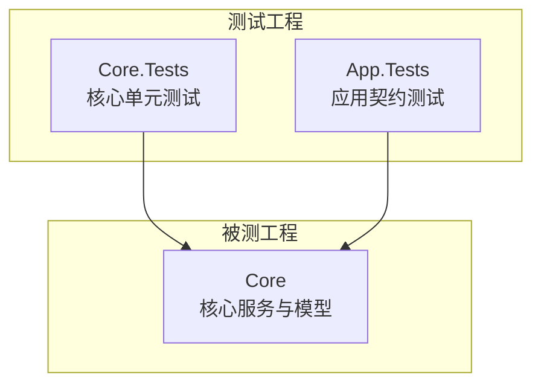
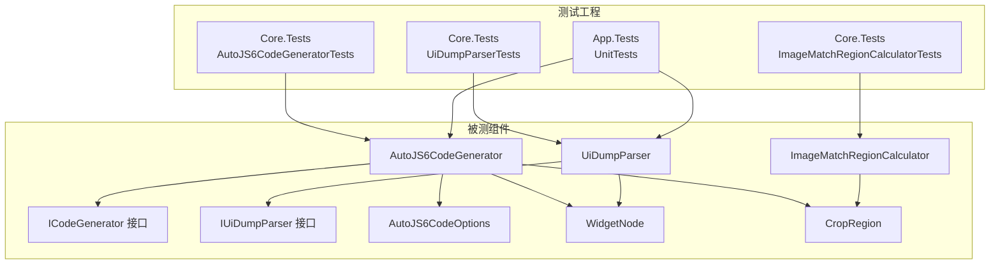
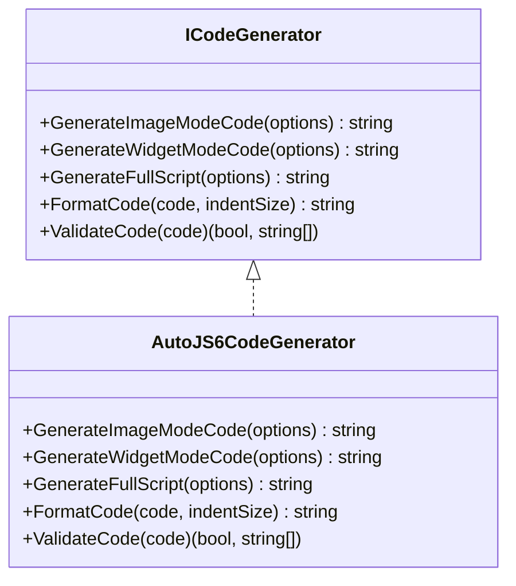
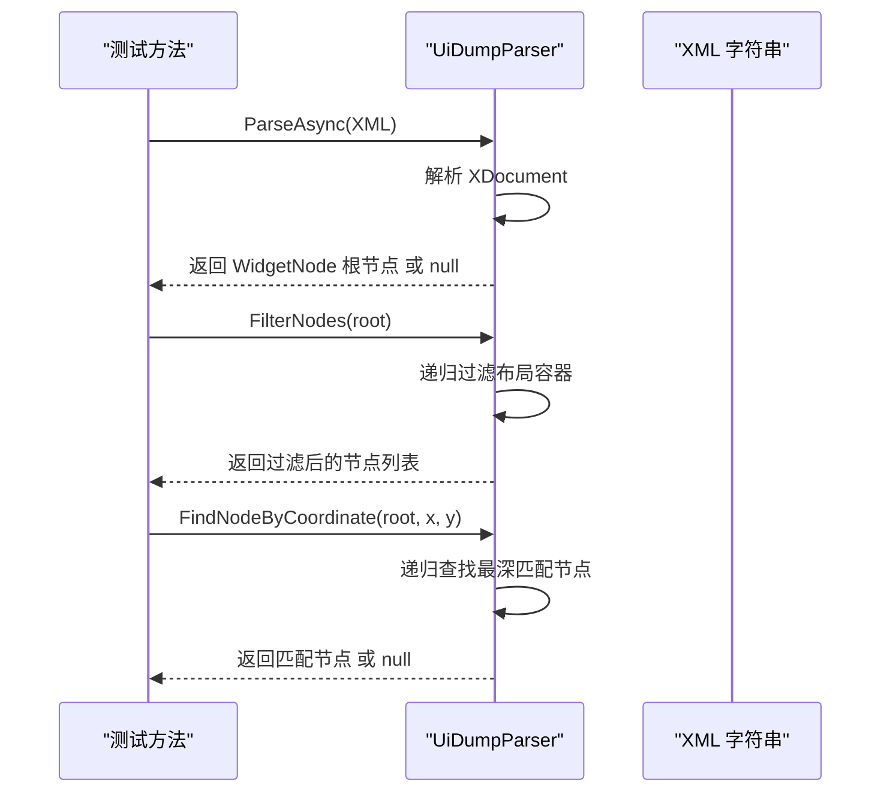
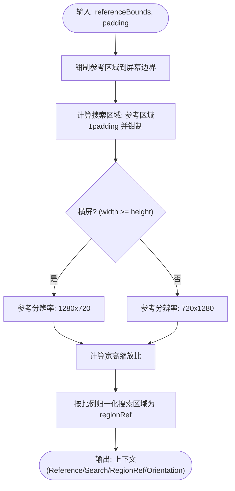
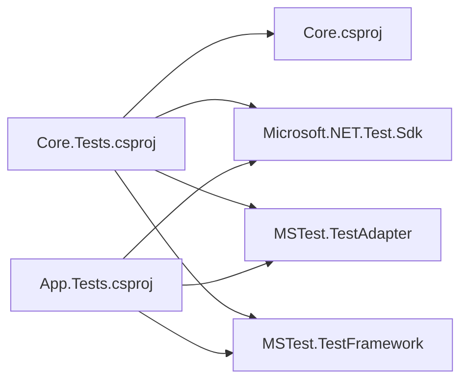

# 单元测试规范

<cite>
**本文引用的文件**
- [Core.Tests/Core.Tests.csproj](file://Core.Tests/Core.Tests.csproj)
- [App.Tests/App.Tests.csproj](file://App.Tests/App.Tests.csproj)
- [Core.Tests/AutoJS6CodeGeneratorTests.cs](file://Core.Tests/AutoJS6CodeGeneratorTests.cs)
- [Core.Tests/UiDumpParserTests.cs](file://Core.Tests/UiDumpParserTests.cs)
- [Core.Tests/ImageMatchRegionCalculatorTests.cs](file://Core.Tests/ImageMatchRegionCalculatorTests.cs)
- [App.Tests/UnitTests.cs](file://App.Tests/UnitTests.cs)
- [Core/Services/AutoJS6CodeGenerator.cs](file://Core/Services/AutoJS6CodeGenerator.cs)
- [Core/Services/UiDumpParser.cs](file://Core/Services/UiDumpParser.cs)
- [Core/Helpers/ImageMatchRegionCalculator.cs](file://Core/Helpers/ImageMatchRegionCalculator.cs)
- [Core/Abstractions/ICodeGenerator.cs](file://Core/Abstractions/ICodeGenerator.cs)
- [Core/Abstractions/IUiDumpParser.cs](file://Core/Abstractions/IUiDumpParser.cs)
- [Core/Models/AutoJS6CodeOptions.cs](file://Core/Models/AutoJS6CodeOptions.cs)
- [Core/Models/WidgetNode.cs](file://Core/Models/WidgetNode.cs)
- [Core/Models/CropRegion.cs](file://Core/Models/CropRegion.cs)
- [Core/Models/MatchResult.cs](file://Core/Models/MatchResult.cs)
</cite>

## 目录
1. [引言](#引言)
2. [项目结构](#项目结构)
3. [核心组件](#核心组件)
4. [架构总览](#架构总览)
5. [详细组件分析](#详细组件分析)
6. [依赖关系分析](#依赖关系分析)
7. [性能考虑](#性能考虑)
8. [故障排查指南](#故障排查指南)
9. [结论](#结论)
10. [附录](#附录)

## 引言
本规范面向 AutoJS6 开发工具的单元测试编写，旨在统一测试风格、提升测试质量与可维护性。文档覆盖 MSTest 框架使用、测试用例设计原则、命名约定、组织结构、隔离与依赖注入策略，并对核心业务组件（AutoJS6CodeGenerator、UiDumpParser、ImageMatchRegionCalculator）给出具体测试策略与示例路径。

## 项目结构
- 测试工程采用分层组织：
  - Core.Tests：核心业务逻辑单元测试（代码生成、UI 解析、图像处理）
  - App.Tests：应用层集成/契约测试（XAML 控件存在性、主页面契约等）
- MSTest 依赖通过 NuGet 包引入，测试项目引用被测项目以进行编译期耦合与运行期调用。

**图表来源**
- [Core.Tests/Core.Tests.csproj:1-21](file://Core.Tests/Core.Tests.csproj#L1-L21)
- [App.Tests/App.Tests.csproj:1-17](file://App.Tests/App.Tests.csproj#L1-L17)

**章节来源**
- [Core.Tests/Core.Tests.csproj:1-21](file://Core.Tests/Core.Tests.csproj#L1-L21)
- [App.Tests/App.Tests.csproj:1-17](file://App.Tests/App.Tests.csproj#L1-L17)

## 核心组件
- AutoJS6CodeGenerator：负责根据配置生成 AutoJS6 脚本，支持图像模式与控件模式，包含重试、超时、日志、图像回收等可选逻辑，并提供代码验证与格式化能力。
- UiDumpParser：解析 Android UI Dump XML，构建 WidgetNode 树，提供节点过滤、坐标定位、UiSelector 代码生成等能力。
- ImageMatchRegionCalculator：根据参考区域计算搜索区域与 regionRef，适配横竖屏与分辨率差异。

**章节来源**
- [Core/Services/AutoJS6CodeGenerator.cs:1-357](file://Core/Services/AutoJS6CodeGenerator.cs#L1-L357)
- [Core/Services/UiDumpParser.cs:1-263](file://Core/Services/UiDumpParser.cs#L1-L263)
- [Core/Helpers/ImageMatchRegionCalculator.cs:1-99](file://Core/Helpers/ImageMatchRegionCalculator.cs#L1-L99)

## 架构总览
下图展示了测试工程与被测组件之间的依赖关系及测试入口。

**图表来源**
- [Core.Tests/AutoJS6CodeGeneratorTests.cs:1-80](file://Core.Tests/AutoJS6CodeGeneratorTests.cs#L1-L80)
- [Core.Tests/UiDumpParserTests.cs:1-74](file://Core.Tests/UiDumpParserTests.cs#L1-L74)
- [Core.Tests/ImageMatchRegionCalculatorTests.cs:1-60](file://Core.Tests/ImageMatchRegionCalculatorTests.cs#L1-L60)
- [App.Tests/UnitTests.cs:1-91](file://App.Tests/UnitTests.cs#L1-L91)
- [Core/Services/AutoJS6CodeGenerator.cs:1-357](file://Core/Services/AutoJS6CodeGenerator.cs#L1-L357)
- [Core/Services/UiDumpParser.cs:1-263](file://Core/Services/UiDumpParser.cs#L1-L263)
- [Core/Helpers/ImageMatchRegionCalculator.cs:1-99](file://Core/Helpers/ImageMatchRegionCalculator.cs#L1-L99)
- [Core/Abstractions/ICodeGenerator.cs:1-46](file://Core/Abstractions/ICodeGenerator.cs#L1-L46)
- [Core/Abstractions/IUiDumpParser.cs:1-56](file://Core/Abstractions/IUiDumpParser.cs#L1-L56)
- [Core/Models/AutoJS6CodeOptions.cs:1-89](file://Core/Models/AutoJS6CodeOptions.cs#L1-L89)
- [Core/Models/WidgetNode.cs:1-93](file://Core/Models/WidgetNode.cs#L1-L93)
- [Core/Models/CropRegion.cs:1-53](file://Core/Models/CropRegion.cs#L1-L53)

## 详细组件分析

### MSTest 框架使用规范
- 测试类装饰器：使用 [TestClass] 标注测试类。
- 测试方法装饰器：使用 [TestMethod] 标注测试方法。
- 断言方法：
  - 布尔断言：Assert.IsTrue / Assert.IsFalse
  - 空值断言：Assert.IsNotNull / Assert.IsNull
  - 数值/集合断言：Assert.AreEqual / CollectionAssert.AreEqual
  - 字符串断言：StringAssert.Contains
  - 异步断言：await 后直接使用同步断言；避免在异步方法中遗漏 await 导致的假阳性
- 测试数据准备：
  - 使用内联数据或私有构造数据的方法，确保测试独立性
  - 对于 XML 输入，使用三引号字符串字面量保持可读性
- 测试命名约定：
  - 方法名采用动宾结构，清晰表达“行为+条件+期望”
  - 示例：GenerateImageModeCode_ShouldUseVarRegionAndTemplateRecycle

**章节来源**
- [Core.Tests/AutoJS6CodeGeneratorTests.cs:1-80](file://Core.Tests/AutoJS6CodeGeneratorTests.cs#L1-L80)
- [Core.Tests/UiDumpParserTests.cs:1-74](file://Core.Tests/UiDumpParserTests.cs#L1-L74)
- [Core.Tests/ImageMatchRegionCalculatorTests.cs:1-60](file://Core.Tests/ImageMatchRegionCalculatorTests.cs#L1-L60)

### AutoJS6CodeGenerator 测试策略
- 测试要点
  - 图像模式：校验模板加载、region 参数、阈值、重试逻辑、图像回收、循环体内变量声明约束
  - 控件模式：校验主选择器优先级（id > text > desc > className）、降级选择器顺序、坐标范围限定、点击行为
  - 全脚本生成：校验头部注释、模式标识
  - 代码验证：校验 Rhino 引擎约束（循环体内禁止 const/let）
- 测试隔离
  - 不依赖外部文件系统，使用内存中的配置对象
  - 通过构造最小化 AutoJS6CodeOptions 与 WidgetNode
- 依赖注入
  - 当前实现为具体类，建议通过接口 ICodeGenerator 进行抽象，便于替换为模拟实现
- 示例路径
  - [生成图像模式代码并断言模板与区域:10-39](file://Core.Tests/AutoJS6CodeGeneratorTests.cs#L10-L39)
  - [生成控件模式代码并断言选择器顺序:41-78](file://Core.Tests/AutoJS6CodeGeneratorTests.cs#L41-L78)

**图表来源**
- [Core/Abstractions/ICodeGenerator.cs:1-46](file://Core/Abstractions/ICodeGenerator.cs#L1-L46)
- [Core/Services/AutoJS6CodeGenerator.cs:1-357](file://Core/Services/AutoJS6CodeGenerator.cs#L1-L357)

**章节来源**
- [Core.Tests/AutoJS6CodeGeneratorTests.cs:1-80](file://Core.Tests/AutoJS6CodeGeneratorTests.cs#L1-L80)
- [Core/Services/AutoJS6CodeGenerator.cs:1-357](file://Core/Services/AutoJS6CodeGenerator.cs#L1-L357)
- [Core/Abstractions/ICodeGenerator.cs:1-46](file://Core/Abstractions/ICodeGenerator.cs#L1-L46)

### UiDumpParser 测试策略
- 测试要点
  - 解析：校验根节点属性、边界解析、深度递归
  - 过滤：排除冗余布局容器（仅含布局类名且无标识/可点击）
  - 查找：按 resourceId/text/contentDesc/className 组合过滤
  - 坐标定位：返回最深匹配节点
  - 无效 XML：返回空值
- 测试隔离
  - 使用三引号 XML 字符串，避免转义与格式问题
  - 通过构造 WidgetNode 树进行断言
- 示例路径
  - [解析并过滤节点:9-36](file://Core.Tests/UiDumpParserTests.cs#L9-L36)
  - [坐标定位最深节点:38-62](file://Core.Tests/UiDumpParserTests.cs#L38-L62)
  - [无效 XML 返回空值:64-72](file://Core.Tests/UiDumpParserTests.cs#L64-L72)

**图表来源**
- [Core.Tests/UiDumpParserTests.cs:1-74](file://Core.Tests/UiDumpParserTests.cs#L1-L74)
- [Core/Services/UiDumpParser.cs:1-263](file://Core/Services/UiDumpParser.cs#L1-L263)

**章节来源**
- [Core.Tests/UiDumpParserTests.cs:1-74](file://Core.Tests/UiDumpParserTests.cs#L1-L74)
- [Core/Services/UiDumpParser.cs:1-263](file://Core/Services/UiDumpParser.cs#L1-L263)
- [Core/Abstractions/IUiDumpParser.cs:1-56](file://Core/Abstractions/IUiDumpParser.cs#L1-L56)

### ImageMatchRegionCalculator 测试策略
- 测试要点
  - 横屏/竖屏：根据屏幕尺寸确定方向与参考分辨率
  - 区域钳制：防止越界，保证最小宽高
  - 搜索区域：在参考区域基础上增加 padding 并钳制
  - regionRef 归一化：按参考分辨率比例换算
- 测试隔离
  - 使用 CropRegion 构造输入，断言上下文字段
- 示例路径
  - [横屏参考与区域钳制:10-35](file://Core.Tests/ImageMatchRegionCalculatorTests.cs#L10-L35)
  - [竖屏参考与缩放:37-58](file://Core.Tests/ImageMatchRegionCalculatorTests.cs#L37-L58)

**图表来源**
- [Core.Tests/ImageMatchRegionCalculatorTests.cs:1-60](file://Core.Tests/ImageMatchRegionCalculatorTests.cs#L1-L60)
- [Core/Helpers/ImageMatchRegionCalculator.cs:1-99](file://Core/Helpers/ImageMatchRegionCalculator.cs#L1-L99)

**章节来源**
- [Core.Tests/ImageMatchRegionCalculatorTests.cs:1-60](file://Core.Tests/ImageMatchRegionCalculatorTests.cs#L1-L60)
- [Core/Helpers/ImageMatchRegionCalculator.cs:1-99](file://Core/Helpers/ImageMatchRegionCalculator.cs#L1-L99)

### 应用层契约测试（App.Tests）
- 测试要点
  - 主页面契约：检查 MainPage 类型存在、无参构造、关键 XAML 控件名称集合
  - 程序集解析：从构建产物中定位 Release 版本程序集
- 测试隔离
  - 通过反射加载已构建程序集，避免运行时依赖
- 示例路径
  - [主页面契约与 XAML 控件检查:10-40](file://App.Tests/UnitTests.cs#L10-L40)

**章节来源**
- [App.Tests/UnitTests.cs:1-91](file://App.Tests/UnitTests.cs#L1-L91)

## 依赖关系分析
- 测试工程 Core.Tests 与 App.Tests 均引用 MSTest 相关包，Core.Tests 还显式引用 Core 工程以便直接调用被测类型。
- 被测组件通过接口 ICodeGenerator 与 IUiDumpParser 提供抽象，利于在测试中注入模拟实现。

**图表来源**
- [Core.Tests/Core.Tests.csproj:1-21](file://Core.Tests/Core.Tests.csproj#L1-L21)
- [App.Tests/App.Tests.csproj:1-17](file://App.Tests/App.Tests.csproj#L1-L17)

**章节来源**
- [Core.Tests/Core.Tests.csproj:1-21](file://Core.Tests/Core.Tests.csproj#L1-L21)
- [App.Tests/App.Tests.csproj:1-17](file://App.Tests/App.Tests.csproj#L1-L17)

## 性能考虑
- 测试执行时间
  - 避免在单元测试中进行网络或磁盘 IO；如需，使用内存数据或模拟
  - 异步方法务必 await，避免虚假通过
- 断言粒度
  - 将复杂断言拆分为多个小断言，便于定位失败原因
- 数据驱动
  - 对相似场景使用参数化测试（若需要）减少重复代码

## 故障排查指南
- 常见问题
  - MSTest 无法发现测试方法：检查 [TestClass]/[TestMethod] 装饰器是否正确
  - 断言失败但难以定位：使用更细粒度断言与中间变量输出
  - 异常捕获：UiDumpParser 在解析异常时返回空值，测试中应断言空值而非抛出异常
- 建议流程
  - 先写失败用例，再实现代码
  - 逐步细化断言，确保覆盖边界条件
  - 对关键分支绘制流程图辅助设计用例

**章节来源**
- [Core.Tests/UiDumpParserTests.cs:64-72](file://Core.Tests/UiDumpParserTests.cs#L64-L72)
- [Core/Services/UiDumpParser.cs:14-35](file://Core/Services/UiDumpParser.cs#L14-L35)

## 结论
本规范提供了 AutoJS6 开发工具单元测试的编写标准与最佳实践，明确了 MSTest 使用方式、测试设计原则、隔离与依赖注入策略，并针对核心组件给出了可操作的测试策略与示例路径。建议在后续迭代中逐步引入接口抽象与模拟对象，进一步增强测试稳定性与可维护性。

## 附录

### 测试用例设计原则
- 单一职责：每个测试只验证一个行为或场景
- 可重复：不依赖外部环境，使用固定输入与断言
- 可读：命名清晰、断言明确、步骤分层
- 边界覆盖：空值、越界、异常、特殊格式

### 命名约定
- 测试类：被测类型 + Tests
- 测试方法：行为_条件_期望 或 场景_预期结果

### 组织结构建议
- Core.Tests 下按被测类型分组：Services、Helpers、Models
- App.Tests 下按测试层次分组：契约测试、界面交互测试

### 依赖注入与模拟对象
- 建议将 AutoJS6CodeGenerator 与 UiDumpParser 的依赖通过接口注入，便于在测试中替换为模拟实现
- 对于 I/O 与外部服务，使用接口抽象并在测试中注入模拟对象