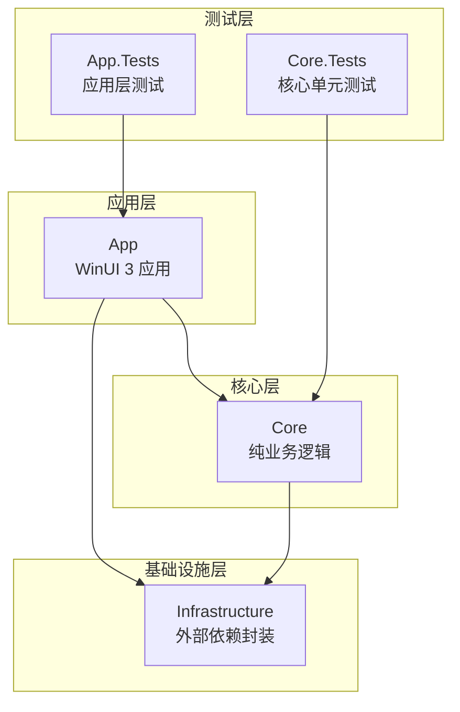
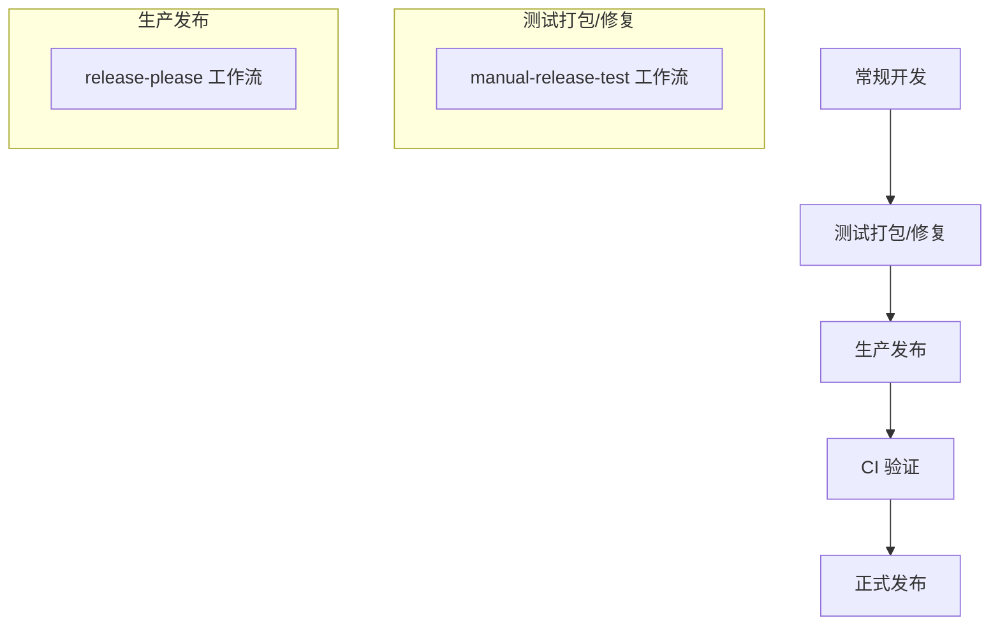
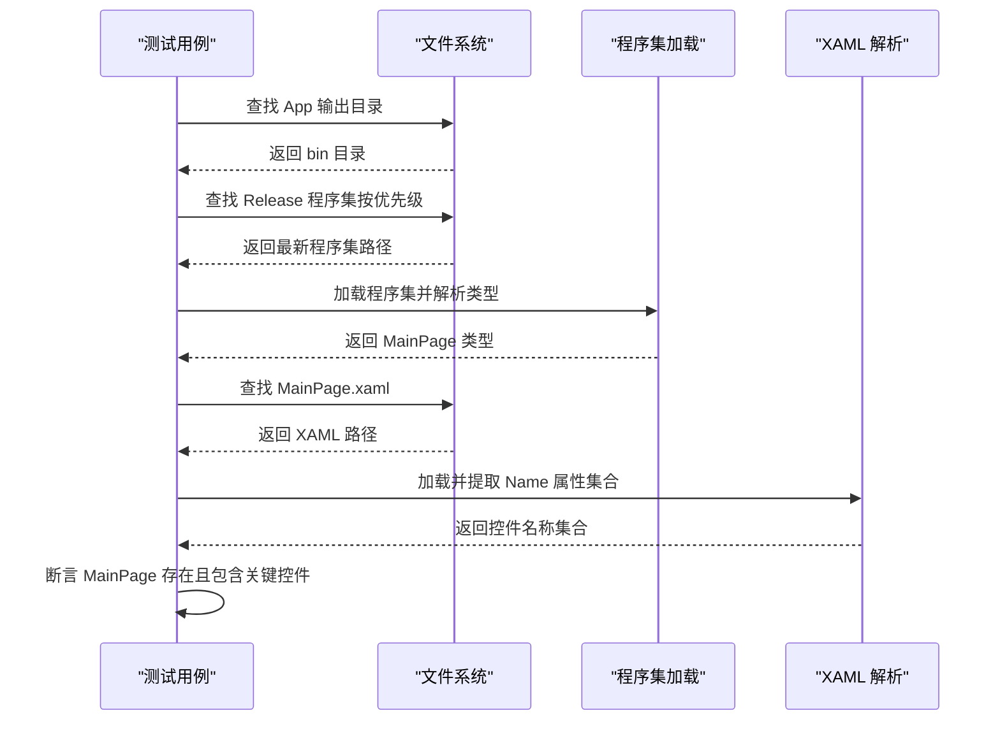
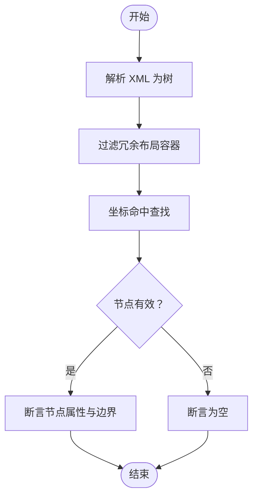
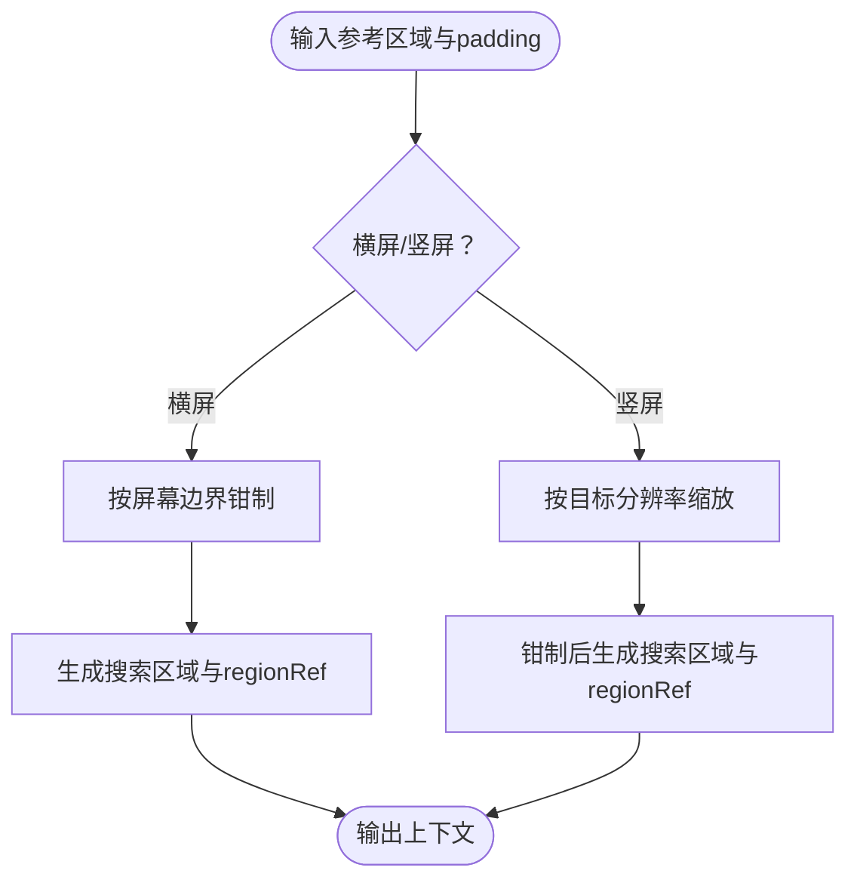
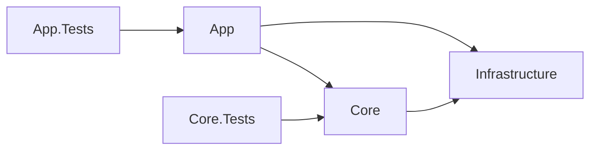

# 测试维护策略

<cite>
**本文引用的文件**
- [UnitTests.cs](file://App.Tests/UnitTests.cs)
- [AutoJS6CodeGeneratorTests.cs](file://Core.Tests/AutoJS6CodeGeneratorTests.cs)
- [UiDumpParserTests.cs](file://Core.Tests/UiDumpParserTests.cs)
- [ImageMatchRegionCalculatorTests.cs](file://Core.Tests/ImageMatchRegionCalculatorTests.cs)
- [App.Tests.csproj](file://App.Tests/App.Tests.csproj)
- [Core.Tests.csproj](file://Core.Tests/Core.Tests.csproj)
- [App.csproj](file://App/App.csproj)
- [Core.csproj](file://Core/Core.csproj)
- [Infrastructure.csproj](file://Infrastructure/Infrastructure.csproj)
- [LogService.cs](file://App/Services/LogService.cs)
- [DEVELOPMENT.md](file://DEVELOPMENT.md)
- [README.md](file://README.md)
- [manual.md](file://manual.md)
- [checklist.md](file://checklist.md)
- [AGENTS.md](file://AGENTS.md)
</cite>

## 目录
1. [引言](#引言)
2. [项目结构](#项目结构)
3. [核心组件](#核心组件)
4. [架构总览](#架构总览)
5. [详细组件分析](#详细组件分析)
6. [依赖分析](#依赖分析)
7. [性能考虑](#性能考虑)
8. [故障排查指南](#故障排查指南)
9. [结论](#结论)
10. [附录](#附录)

## 引言
本策略文档面向 AutoJS6 开发工具的测试体系，旨在建立可持续的测试维护机制，覆盖测试用例的版本管理、重构与废弃流程、测试环境维护、测试故障排查方法、测试团队协作规范以及测试效率优化与自动化测试实施策略。文档结合项目现有的单元测试、测试项目配置、开发与发布流程文档，形成可执行、可追溯、可扩展的测试维护蓝图。

## 项目结构
项目采用分层架构与测试分离的设计：
- App：WinUI 3 桌面应用，负责 UI 与 MVVM。
- Core：纯业务逻辑层，独立可测试。
- Infrastructure：封装外部依赖（ADB、OpenCV、ImageSharp）。
- App.Tests：应用层契约与集成测试（如 XAML 合约测试）。
- Core.Tests：核心业务逻辑单元测试（代码生成、UI 解析、区域计算器等）。



图表来源
- [App.csproj:67-68](file://App/App.csproj#L67-L68)
- [Core.csproj:1-10](file://Core/Core.csproj#L1-L10)
- [Infrastructure.csproj:9-11](file://Infrastructure/Infrastructure.csproj#L9-L11)
- [App.Tests.csproj:17-17](file://App.Tests/App.Tests.csproj#L17-L17)
- [Core.Tests.csproj:19-19](file://Core.Tests/Core.Tests.csproj#L19-L19)

章节来源
- [README.md:230-287](file://README.md#L230-L287)
- [App.csproj:67-68](file://App/App.csproj#L67-L68)
- [Core.csproj:1-10](file://Core/Core.csproj#L1-L10)
- [Infrastructure.csproj:9-11](file://Infrastructure/Infrastructure.csproj#L9-L11)
- [App.Tests.csproj:17-17](file://App.Tests/App.Tests.csproj#L17-L17)
- [Core.Tests.csproj:19-19](file://Core.Tests/Core.Tests.csproj#L19-L19)

## 核心组件
- 应用层契约测试：验证 MainPage 构造与 XAML 控件契约，确保 UI 结构变更不会破坏关键交互入口。
- 核心单元测试：覆盖代码生成器、UI Dump 解析器、图像匹配区域计算器等关键逻辑，保障业务规则与边界条件。
- 测试项目配置：统一 MSTest 适配器与 SDK 版本，确保跨平台测试一致性。
- 日志服务：集中日志入口，便于测试与排障时统一采集与分析。

章节来源
- [UnitTests.cs:10-40](file://App.Tests/UnitTests.cs#L10-L40)
- [AutoJS6CodeGeneratorTests.cs:10-39](file://Core.Tests/AutoJS6CodeGeneratorTests.cs#L10-L39)
- [UiDumpParserTests.cs:9-36](file://Core.Tests/UiDumpParserTests.cs#L9-L36)
- [ImageMatchRegionCalculatorTests.cs:10-35](file://Core.Tests/ImageMatchRegionCalculatorTests.cs#L10-L35)
- [App.Tests.csproj:12-14](file://App.Tests/App.Tests.csproj#L12-L14)
- [Core.Tests.csproj:12-14](file://Core.Tests/Core.Tests.csproj#L12-L14)
- [LogService.cs:39-49](file://App/Services/LogService.cs#L39-L49)

## 架构总览
测试体系与开发/发布流程协同：
- 开发阶段：常规开发不触发全量打包，减少资源浪费。
- 测试打包/修复：通过手动触发工作流进行验证或修复缺失资产。
- 生产发布：由自动化工作流负责版本号与发布，测试打包先行验证。



图表来源
- [DEVELOPMENT.md:64-131](file://DEVELOPMENT.md#L64-L131)
- [manual.md:19-39](file://manual.md#L19-L39)
- [manual.md:259-261](file://manual.md#L259-L261)

章节来源
- [DEVELOPMENT.md:19-161](file://DEVELOPMENT.md#L19-L161)
- [manual.md:1-522](file://manual.md#L1-L522)

## 详细组件分析

### 应用层契约测试（MainPage 合约）
目标：确保 MainPage 的类型与 XAML 控件契约稳定，避免 UI 结构变更导致的功能回归。
- 关键断言：MainPage 类型存在、保留无参构造；XAML 中关键控件名称集合包含预期项。
- 路径解析：自动解析已构建的应用程序程序集与 MainPage.xaml 路径，支持多平台 RID 优先级排序与时间回退。



图表来源
- [UnitTests.cs:13-59](file://App.Tests/UnitTests.cs#L13-L59)
- [UnitTests.cs:61-69](file://App.Tests/UnitTests.cs#L61-L69)
- [UnitTests.cs:71-89](file://App.Tests/UnitTests.cs#L71-L89)

章节来源
- [UnitTests.cs:10-40](file://App.Tests/UnitTests.cs#L10-L40)

### 核心单元测试（代码生成器）
目标：验证 AutoJS6 代码生成器在图像模式与控件模式下的行为，确保生成代码符合 Rhino 引擎约束与 OOM 预防规则。
- 图像模式：模板读取、region 参数、阈值、模板回收等。
- 控件模式：id/text/desc 降级顺序、边界框查找、重试逻辑开关。

```mermaid
sequenceDiagram
participant T as "测试用例"
participant G as "AutoJS6CodeGenerator"
participant OPT as "生成选项"
participant CODE as "生成代码"
T->>OPT : 构造图像/控件模式选项
T->>G : 调用生成方法
G-->>CODE : 返回代码字符串
T->>T : 断言包含预期片段/顺序/禁用片段
```

图表来源
- [AutoJS6CodeGeneratorTests.cs:13-31](file://Core.Tests/AutoJS6CodeGeneratorTests.cs#L13-L31)
- [AutoJS6CodeGeneratorTests.cs:44-66](file://Core.Tests/AutoJS6CodeGeneratorTests.cs#L44-L66)

章节来源
- [AutoJS6CodeGeneratorTests.cs:10-79](file://Core.Tests/AutoJS6CodeGeneratorTests.cs#L10-L79)

### 核心单元测试（UI Dump 解析器）
目标：验证 UI Dump 解析、节点过滤与坐标命中查找的正确性，覆盖无效 XML 场景。
- 解析：XML 字符串解析为树结构。
- 过滤：跳过冗余布局容器，保留可交互控件。
- 命中：坐标命中最深节点。



图表来源
- [UiDumpParserTests.cs:23-36](file://Core.Tests/UiDumpParserTests.cs#L23-L36)
- [UiDumpParserTests.cs:52-62](file://Core.Tests/UiDumpParserTests.cs#L52-L62)
- [UiDumpParserTests.cs:67-72](file://Core.Tests/UiDumpParserTests.cs#L67-L72)

章节来源
- [UiDumpParserTests.cs:9-73](file://Core.Tests/UiDumpParserTests.cs#L9-L73)

### 核心单元测试（图像匹配区域计算器）
目标：验证参考区域在横屏/竖屏场景下的裁剪、边界扩展与 regionRef 生成。
- 横屏：按参考区域与 padding 计算搜索区域与 regionRef。
- 竖屏：按原始宽高缩放到目标分辨率后计算。



图表来源
- [ImageMatchRegionCalculatorTests.cs:23-35](file://Core.Tests/ImageMatchRegionCalculatorTests.cs#L23-L35)
- [ImageMatchRegionCalculatorTests.cs:50-58](file://Core.Tests/ImageMatchRegionCalculatorTests.cs#L50-L58)

章节来源
- [ImageMatchRegionCalculatorTests.cs:10-59](file://Core.Tests/ImageMatchRegionCalculatorTests.cs#L10-L59)

### 测试项目配置与依赖
- MSTest 适配器与框架版本统一，确保测试运行器与断言库一致。
- Core.Tests 显式引用 Core.csproj，保证测试与被测代码在同一依赖树下。
- App.Tests 与 Core.Tests 分别独立，避免相互污染。

章节来源
- [App.Tests.csproj:12-14](file://App.Tests/App.Tests.csproj#L12-L14)
- [Core.Tests.csproj:12-14](file://Core.Tests/Core.Tests.csproj#L12-L14)
- [Core.Tests.csproj:18-19](file://Core.Tests/Core.Tests.csproj#L18-L19)

## 依赖分析
测试层与业务层的依赖关系清晰，遵循单向依赖与隔离原则：
- App 依赖 Core 与 Infrastructure。
- Core 依赖 Infrastructure。
- 测试层分别依赖被测项目，避免反向依赖。



图表来源
- [App.csproj:67-68](file://App/App.csproj#L67-L68)
- [Core.csproj:1-10](file://Core/Core.csproj#L1-L10)
- [Infrastructure.csproj:9-11](file://Infrastructure/Infrastructure.csproj#L9-L11)
- [App.Tests.csproj:17-17](file://App.Tests/App.Tests.csproj#L17-L17)
- [Core.Tests.csproj:19-19](file://Core.Tests/Core.Tests.csproj#L19-L19)

章节来源
- [README.md:272-287](file://README.md#L272-L287)
- [App.csproj:67-68](file://App/App.csproj#L67-L68)
- [Core.csproj:1-10](file://Core/Core.csproj#L1-L10)
- [Infrastructure.csproj:9-11](file://Infrastructure/Infrastructure.csproj#L9-L11)
- [App.Tests.csproj:17-17](file://App.Tests/App.Tests.csproj#L17-L17)
- [Core.Tests.csproj:19-19](file://Core.Tests/Core.Tests.csproj#L19-L19)

## 性能考虑
- 测试执行性能：优先运行核心单元测试，减少 UI 相关测试对 CI 的压力；在本地进行 UI 集成验证后再上 CI。
- 测试覆盖率：围绕关键路径（代码生成、UI 解析、区域计算）建立高覆盖率用例，逐步扩展至边缘场景。
- 并发与稳定性：通过 checklist 的稳定性项（连续截图/匹配/操作）验证系统在高负载下的鲁棒性。

章节来源
- [checklist.md:88-95](file://checklist.md#L88-L95)
- [README.md:320-339](file://README.md#L320-L339)

## 故障排查指南

### 测试日志分析
- 日志入口：统一通过日志服务输出，包含时间戳，便于定位问题发生时刻。
- 排查要点：关注 UI 初始化、ADB 截图、OpenCV 匹配、UI 树解析等关键阶段的日志。

章节来源
- [LogService.cs:39-49](file://App/Services/LogService.cs#L39-L49)

### 性能测试与并发测试
- 性能测试：在本地或 CI 中执行连续截图/匹配/操作，观察 UI 卡顿与内存占用趋势。
- 并发测试：模拟多设备/多模板场景，验证 UI 解析与图像匹配的稳定性。

章节来源
- [checklist.md:88-95](file://checklist.md#L88-L95)

### 测试环境维护
- 测试数据：定期更新测试截图与模板，确保匹配结果与 UI 解析的时效性。
- 依赖版本：锁定 MSTest 适配器与框架版本，避免测试运行器差异导致的失败。
- 工具升级：遵循开发与发布流程文档中的工具要求，确保本地与 CI 环境一致。

章节来源
- [App.Tests.csproj:12-14](file://App.Tests/App.Tests.csproj#L12-L14)
- [Core.Tests.csproj:12-14](file://Core.Tests/Core.Tests.csproj#L12-L14)
- [DEVELOPMENT.md:35-44](file://DEVELOPMENT.md#L35-L44)

### 测试打包与发布链路验证
- 手动测试打包：先不上传 Release，验证打包链路；再上传到临时 prerelease，验证上传链路。
- 正式发布：通过 release-please 创建/更新发布 PR，本地 smoke test 通过后再合并。

章节来源
- [manual.md:109-178](file://manual.md#L109-L178)
- [manual.md:180-241](file://manual.md#L180-L241)
- [DEVELOPMENT.md:135-161](file://DEVELOPMENT.md#L135-L161)

## 结论
本策略文档建立了 AutoJS6 开发工具测试体系的维护框架：以单元测试为核心、以契约测试为边界、以日志与流程文档为支撑，结合测试打包与发布链路验证，确保测试体系在功能演进与版本发布中的可持续性。建议团队在日常开发中坚持“先本地验证，再 CI 验证，最后发布验证”的原则，持续优化测试效率与质量。

## 附录

### 测试用例维护周期与更新策略
- 版本管理：随功能版本同步更新测试用例，确保与发布清单一致。
- 重构原则：保持测试用例的稳定性与可读性，优先重构边界与异常场景。
- 废弃处理：对不再适用的测试用例进行归档或删除，避免历史用例干扰新功能验证。

章节来源
- [checklist.md:1-186](file://checklist.md#L1-L186)

### 测试团队协作规范
- 评审：测试用例变更纳入代码评审，确保覆盖关键路径与边界。
- 文档：测试用例与被测模块的约束（如 Rhino 引擎限制、OOM 预防）需在文档中明确。
- 协作：测试与发布流程文档共同维护，确保测试环境与发布工具链一致。

章节来源
- [AGENTS.md:152-227](file://AGENTS.md#L152-L227)
- [DEVELOPMENT.md:182-276](file://DEVELOPMENT.md#L182-L276)

### 测试效率优化与自动化测试实施
- 本地优先：遵循推荐的本地验证顺序，减少 CI 资源消耗。
- 自动化：利用手动测试打包工作流与 release-please 工作流，将测试验证前置到发布流程中。
- 质量门禁：以 checklist 的 P0 项为发布质量门禁，确保正式发布前的最低可用性。

章节来源
- [DEVELOPMENT.md:47-61](file://DEVELOPMENT.md#L47-L61)
- [manual.md:308-327](file://manual.md#L308-L327)
- [checklist.md:29-95](file://checklist.md#L29-L95)