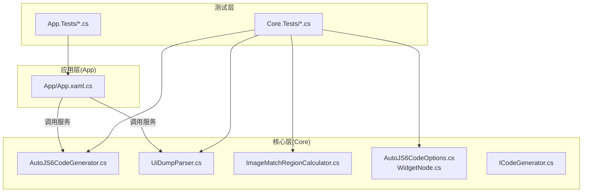
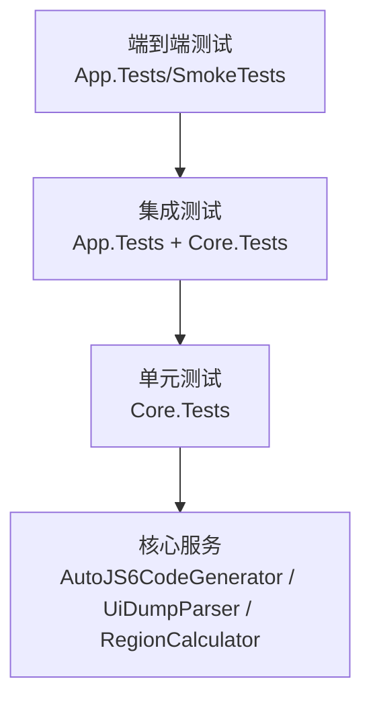
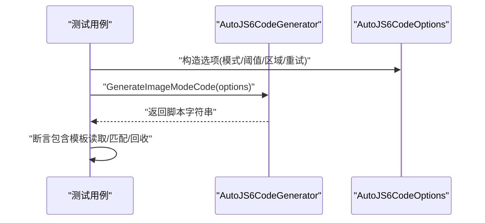
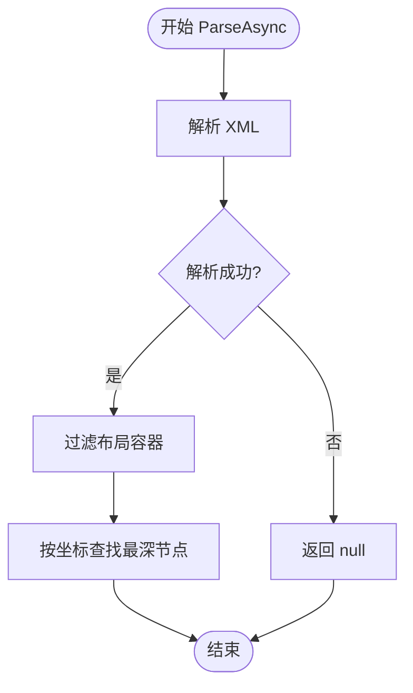
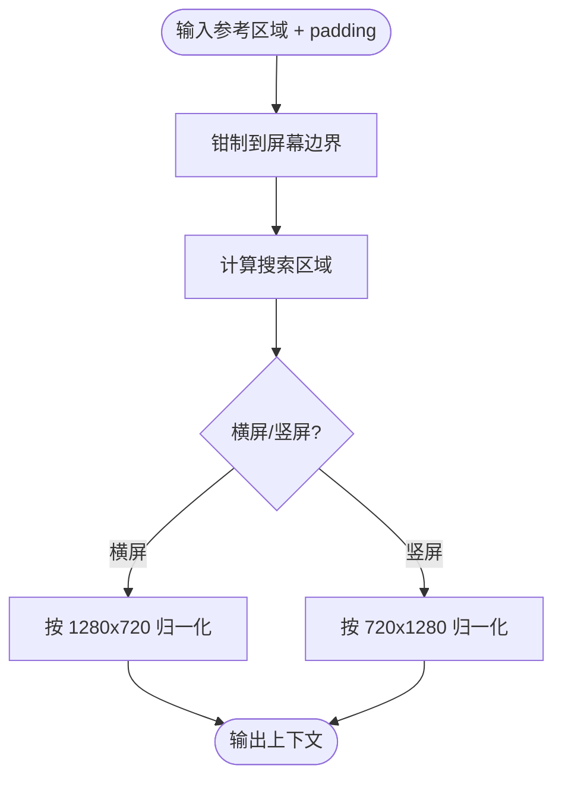
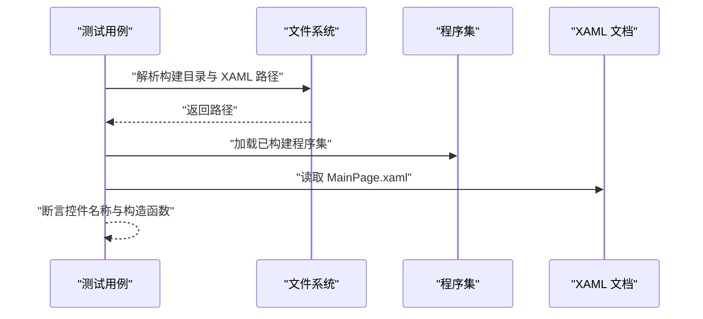
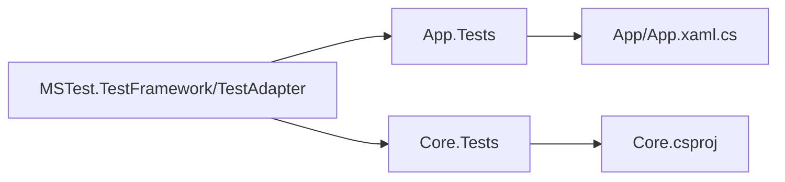

# 测试要求与规范

<cite>
**本文引用的文件**
- [App.Tests/App.Tests.csproj](file://App.Tests/App.Tests.csproj)
- [Core.Tests/Core.Tests.csproj](file://Core.Tests/Core.Tests.csproj)
- [App.Tests/UnitTests.cs](file://App.Tests/UnitTests.cs)
- [Core.Tests/AutoJS6CodeGeneratorTests.cs](file://Core.Tests/AutoJS6CodeGeneratorTests.cs)
- [Core.Tests/UiDumpParserTests.cs](file://Core.Tests/UiDumpParserTests.cs)
- [Core.Tests/ImageMatchRegionCalculatorTests.cs](file://Core.Tests/ImageMatchRegionCalculatorTests.cs)
- [Core/Services/AutoJS6CodeGenerator.cs](file://Core/Services/AutoJS6CodeGenerator.cs)
- [Core/Services/UiDumpParser.cs](file://Core/Services/UiDumpParser.cs)
- [Core/Helpers/ImageMatchRegionCalculator.cs](file://Core/Helpers/ImageMatchRegionCalculator.cs)
- [Core/Models/AutoJS6CodeOptions.cs](file://Core/Models/AutoJS6CodeOptions.cs)
- [Core/Models/WidgetNode.cs](file://Core/Models/WidgetNode.cs)
- [Core/Abstractions/ICodeGenerator.cs](file://Core/Abstractions/ICodeGenerator.cs)
- [App/App.xaml.cs](file://App/App.xaml.cs)
- [README.md](file://README.md)
- [DEVELOPMENT.md](file://DEVELOPMENT.md)
</cite>

## 目录
1. [引言](#引言)
2. [项目结构](#项目结构)
3. [核心组件](#核心组件)
4. [架构总览](#架构总览)
5. [详细组件分析](#详细组件分析)
6. [依赖分析](#依赖分析)
7. [性能考虑](#性能考虑)
8. [故障排查指南](#故障排查指南)
9. [结论](#结论)
10. [附录](#附录)

## 引言
本文件面向 AutoJS6 开发工具的测试体系，系统性地定义单元测试与集成测试的编写标准、断言规范、测试数据准备、覆盖率目标、测试金字塔与隔离策略，并结合现有测试样例给出可操作的最佳实践与工具使用指南，确保新功能的可靠性与稳定性。

## 项目结构
项目采用分层架构，测试覆盖三层：
- Core 层：纯业务逻辑，独立可测试，包含代码生成器、UI 树解析器、区域计算器等。
- App 层：WinUI 3 应用层，负责视图与交互，包含 MainPage 等页面。
- 测试层：App.Tests 与 Core.Tests，分别覆盖应用契约与核心业务逻辑。

图表来源
- [App/App.xaml.cs:1-57](file://App/App.xaml.cs#L1-57)
- [Core/Services/AutoJS6CodeGenerator.cs:1-357](file://Core/Services/AutoJS6CodeGenerator.cs#L1-357)
- [Core/Services/UiDumpParser.cs:1-263](file://Core/Services/UiDumpParser.cs#L1-263)
- [Core/Helpers/ImageMatchRegionCalculator.cs:1-99](file://Core/Helpers/ImageMatchRegionCalculator.cs#L1-99)
- [Core/Models/AutoJS6CodeOptions.cs:1-89](file://Core/Models/AutoJS6CodeOptions.cs#L1-89)
- [Core/Models/WidgetNode.cs:1-93](file://Core/Models/WidgetNode.cs#L1-93)
- [Core/Abstractions/ICodeGenerator.cs:1-46](file://Core/Abstractions/ICodeGenerator.cs#L1-46)
- [Core.Tests/Core.Tests.csproj:1-21](file://Core.Tests/Core.Tests.csproj#L1-21)
- [App.Tests/App.Tests.csproj:1-17](file://App.Tests/App.Tests.csproj#L1-17)

章节来源
- [README.md: 项目结构与架构原则:230-287](file://README.md#L230-L287)
- [Core.Tests/Core.Tests.csproj: 测试项目配置:1-21](file://Core.Tests/Core.Tests.csproj#L1-21)
- [App.Tests/App.Tests.csproj: 测试项目配置:1-17](file://App.Tests/App.Tests.csproj#L1-17)

## 核心组件
- 代码生成器：根据图像模板或控件节点生成 AutoJS6 脚本，支持重试、超时、日志、图像回收与 Rhino 引擎约束校验。
- UI 树解析器：解析 Android UI Dump XML，过滤冗余布局容器，支持坐标命中查询与 UiSelector 生成。
- 区域计算器：基于参考区域计算搜索区域与归一化 regionRef，适配横竖屏。
- 模型与接口：定义代码生成选项、控件节点属性与生成器接口契约。

章节来源
- [Core/Services/AutoJS6CodeGenerator.cs: 代码生成与验证:1-357](file://Core/Services/AutoJS6CodeGenerator.cs#L1-357)
- [Core/Services/UiDumpParser.cs: 解析与筛选:1-263](file://Core/Services/UiDumpParser.cs#L1-263)
- [Core/Helpers/ImageMatchRegionCalculator.cs: 区域计算:1-99](file://Core/Helpers/ImageMatchRegionCalculator.cs#L1-99)
- [Core/Models/AutoJS6CodeOptions.cs: 生成选项:1-89](file://Core/Models/AutoJS6CodeOptions.cs#L1-89)
- [Core/Models/WidgetNode.cs: 控件节点:1-93](file://Core/Models/WidgetNode.cs#L1-93)
- [Core/Abstractions/ICodeGenerator.cs: 接口契约:1-46](file://Core/Abstractions/ICodeGenerator.cs#L1-46)

## 架构总览
测试金字塔建议：
- 单元测试（Core.Tests）：占 70%，覆盖核心算法与业务逻辑，快速反馈。
- 集成测试（App.Tests + Core.Tests）：占 20%，验证组件间协作与外部依赖行为。
- 端到端测试：占 10%，验证真实用户场景与发布包可用性。

图表来源
- [App.Tests/UnitTests.cs:1-91](file://App.Tests/UnitTests.cs#L1-91)
- [Core.Tests/AutoJS6CodeGeneratorTests.cs:1-80](file://Core.Tests/AutoJS6CodeGeneratorTests.cs#L1-80)
- [Core.Tests/UiDumpParserTests.cs:1-74](file://Core.Tests/UiDumpParserTests.cs#L1-74)
- [Core.Tests/ImageMatchRegionCalculatorTests.cs:1-60](file://Core.Tests/ImageMatchRegionCalculatorTests.cs#L1-60)

## 详细组件分析

### 代码生成器测试规范
- 测试目标
  - 图像模式：模板读取、阈值与区域参数传递、重试逻辑、图像回收、Rhino 约束校验。
  - 控件模式：主降级选择器顺序、边界限定、重试与点击行为。
- 断言规范
  - 使用字符串包含断言验证关键代码片段。
  - 使用布尔索引关系断言选择器顺序。
  - 使用无效输入抛出异常的断言验证健壮性。
- 测试数据准备
  - 构造 AutoJS6CodeOptions 与 WidgetNode，设置变量前缀、模板路径、区域、重试次数等。
  - 准备不同分辨率与横竖屏场景的输入数据。
- 示例参考
  - [图像模式用例:10-39](file://Core.Tests/AutoJS6CodeGeneratorTests.cs#L10-L39)
  - [控件模式用例:41-78](file://Core.Tests/AutoJS6CodeGeneratorTests.cs#L41-L78)

图表来源
- [Core.Tests/AutoJS6CodeGeneratorTests.cs:10-39](file://Core.Tests/AutoJS6CodeGeneratorTests.cs#L10-L39)
- [Core/Services/AutoJS6CodeGenerator.cs:13-102](file://Core/Services/AutoJS6CodeGenerator.cs#L13-L102)
- [Core/Models/AutoJS6CodeOptions.cs:6-72](file://Core/Models/AutoJS6CodeOptions.cs#L6-L72)

章节来源
- [Core.Tests/AutoJS6CodeGeneratorTests.cs: 图像/控件模式测试:1-80](file://Core.Tests/AutoJS6CodeGeneratorTests.cs#L1-80)
- [Core/Services/AutoJS6CodeGenerator.cs: 生成与验证实现:13-357](file://Core/Services/AutoJS6CodeGenerator.cs#L13-L357)

### UI 树解析器测试规范
- 测试目标
  - 解析有效/无效 XML，过滤布局容器，按坐标命中最深节点，按条件查找节点。
- 断言规范
  - 使用空值/非空断言验证解析结果。
  - 使用计数断言验证过滤后节点数量。
  - 使用坐标命中断言验证递归查找逻辑。
- 测试数据准备
  - 提供嵌套布局与控件混合的 XML 片段。
  - 准备边界坐标与点击坐标的测试用例。
- 示例参考
  - [解析与过滤用例:9-36](file://Core.Tests/UiDumpParserTests.cs#L9-L36)
  - [坐标命中用例:38-62](file://Core.Tests/UiDumpParserTests.cs#L38-L62)

图表来源
- [Core.Tests/UiDumpParserTests.cs:9-62](file://Core.Tests/UiDumpParserTests.cs#L9-L62)
- [Core/Services/UiDumpParser.cs:14-35](file://Core/Services/UiDumpParser.cs#L14-L35)

章节来源
- [Core.Tests/UiDumpParserTests.cs: 解析/过滤/命中测试:1-74](file://Core.Tests/UiDumpParserTests.cs#L1-74)
- [Core/Services/UiDumpParser.cs: 解析与筛选实现:14-263](file://Core/Services/UiDumpParser.cs#L14-L263)

### 区域计算器测试规范
- 测试目标
  - 横屏/竖屏参考与搜索区域计算、边界钳制、regionRef 归一化。
- 断言规范
  - 使用坐标断言验证搜索区域边界。
  - 使用数组断言验证 regionRef。
- 测试数据准备
  - 提供越界与正常参考区域，设置不同 padding。
- 示例参考
  - [横屏用例:10-35](file://Core.Tests/ImageMatchRegionCalculatorTests.cs#L10-L35)
  - [竖屏用例:37-58](file://Core.Tests/ImageMatchRegionCalculatorTests.cs#L37-L58)

图表来源
- [Core.Tests/ImageMatchRegionCalculatorTests.cs:10-58](file://Core.Tests/ImageMatchRegionCalculatorTests.cs#L10-L58)
- [Core/Helpers/ImageMatchRegionCalculator.cs:40-97](file://Core/Helpers/ImageMatchRegionCalculator.cs#L40-L97)

章节来源
- [Core.Tests/ImageMatchRegionCalculatorTests.cs: 区域计算测试:1-60](file://Core.Tests/ImageMatchRegionCalculatorTests.cs#L1-60)
- [Core/Helpers/ImageMatchRegionCalculator.cs: 区域计算实现:35-99](file://Core/Helpers/ImageMatchRegionCalculator.cs#L35-L99)

### 应用契约测试规范（App.Tests）
- 测试目标
  - MainPage 构建产物与 XAML 合约一致性：关键控件名称存在、无参构造保留。
- 断言规范
  - 使用集合断言验证控件名称子集。
  - 使用文件/目录存在断言确保构建产物与资源路径正确。
- 测试数据准备
  - 解析解决方案根目录，定位 Release 构建产物与 MainPage.xaml。
- 示例参考
  - [MainPage 契约测试:10-40](file://App.Tests/UnitTests.cs#L10-L40)

图表来源
- [App.Tests/UnitTests.cs:10-90](file://App.Tests/UnitTests.cs#L10-L90)
- [App/App.xaml.cs:49-54](file://App/App.xaml.cs#L49-L54)

章节来源
- [App.Tests/UnitTests.cs: 应用契约测试:1-91](file://App.Tests/UnitTests.cs#L1-91)
- [App/App.xaml.cs: 应用入口:1-57](file://App/App.xaml.cs#L1-57)

## 依赖分析
- 测试项目依赖
  - Core.Tests 依赖 Core.csproj，确保对核心服务的直接测试。
  - App.Tests 依赖 MSTest 套件，用于应用层契约测试。
- 组件耦合
  - App 通过服务接口调用 Core；测试通过直接实例化核心类进行单元测试，避免 UI 干扰。
- 外部依赖
  - MSTest 测试框架；.NET 8 SDK；WinUI 3 运行时。

图表来源
- [App.Tests/App.Tests.csproj:11-15](file://App.Tests/App.Tests.csproj#L11-L15)
- [Core.Tests/Core.Tests.csproj:11-15](file://Core.Tests/Core.Tests.csproj#L11-L15)
- [Core.Tests/Core.Tests.csproj:18-19](file://Core.Tests/Core.Tests.csproj#L18-L19)
- [App/App.xaml.cs:1-57](file://App/App.xaml.cs#L1-57)

章节来源
- [App.Tests/App.Tests.csproj: MSTest 依赖:11-15](file://App.Tests/App.Tests.csproj#L11-L15)
- [Core.Tests/Core.Tests.csproj: MSTest 依赖与项目引用:11-19](file://Core.Tests/Core.Tests.csproj#L11-L19)

## 性能考虑
- 测试执行性能
  - 单元测试应避免 I/O 与外部依赖，必要时使用轻量级内存数据。
  - 集成测试控制并发与超时，避免长时间阻塞。
- 代码生成性能
  - 限制每轮只抓取一次屏幕，减少模板读取与回收频率。
  - 使用 region 限定匹配范围，降低 CPU/GPU 压力。
- 测试覆盖率
  - 建议核心模块（代码生成器、UI 解析器、区域计算器）达到 80%+ 行覆盖率与 70%+ 分支覆盖率。
  - 关键路径：错误输入处理、边界条件、异常分支、重试与超时逻辑。

## 故障排查指南
- 常见问题
  - 测试找不到构建产物：检查 Release 目录与平台架构优先级。
  - XAML 控件缺失：确认 MainPage.xaml 中控件命名一致。
  - UI 解析失败：检查 XML 结构完整性与异常捕获逻辑。
  - 生成脚本不符合 Rhino 约束：检查循环体内是否使用 var。
- 定位步骤
  - 使用断言失败信息定位具体断言点。
  - 在本地执行 dotnet test -c Release 验证构建链路。
  - 参考发布验证流程进行端到端回归。

章节来源
- [App.Tests/UnitTests.cs: 路径解析与断言:42-89](file://App.Tests/UnitTests.cs#L42-L89)
- [Core.Tests/UiDumpParserTests.cs: 无效 XML 处理:65-72](file://Core.Tests/UiDumpParserTests.cs#L65-L72)
- [Core/Services/AutoJS6CodeGenerator.cs: Rhino 约束校验:226-258](file://Core/Services/AutoJS6CodeGenerator.cs#L226-L258)
- [DEVELOPMENT.md: 本地验证序列:47-61](file://DEVELOPMENT.md#L47-L61)

## 结论
通过以 Core 为核心、App 为契约的测试策略，配合清晰的断言规范与测试数据准备，可在保证质量的同时提升开发效率。建议持续完善单元测试覆盖关键路径，结合集成与端到端测试保障发布质量。

## 附录

### 单元测试编写标准
- 设计原则
  - 一个测试一个关注点；使用 AAA 模式组织（Arrange-Act-Assert）。
  - 使用最小可变数据驱动测试；避免外部状态依赖。
- 断言规范
  - 明确断言意图，提供失败消息；优先使用强类型断言。
  - 对字符串片段使用包含断言，对数值使用范围断言。
- 测试数据准备
  - 使用构造函数/工厂方法创建模型对象；设置合理默认值与边界值。
  - 为异常路径准备无效输入与边界输入。

### 集成测试要求
- 环境配置
  - 使用 Release 构建产物与真实资源路径；确保 MSTest 适配器可用。
- 依赖模拟
  - 对外部 I/O 使用轻量级替身或内存数据；避免真实设备依赖。
- 端到端流程
  - 主要场景：MainPage 初始化、控件渲染、事件触发、脚本生成与导出。
  - 通过断言验证 UI 契约与生成脚本的可运行性。

### 测试覆盖率标准
- 目标
  - 核心服务：行覆盖率 ≥ 80%，分支覆盖率 ≥ 70%。
  - 关键路径：异常处理、边界条件、重试/超时、Rhino 约束校验。
- 工具建议
  - 使用 .NET Coverlet 或其它覆盖率工具在 CI 中统计并报告。

### 测试最佳实践
- 测试金字塔
  - 70% 单元测试、20% 集成测试、10% 端到端测试。
- 测试隔离
  - 每个测试独立运行；避免共享状态；使用轻量级替身。
- 维护策略
  - 随重构同步更新测试；保持测试命名与注释清晰；定期审查过时测试。

### 测试工具使用指南
- 运行命令
  - 恢复包与构建：dotnet restore && dotnet build -c Release
  - 运行测试：dotnet test -c Release
- 发布验证
  - 参考本地验证序列与手动测试打包流程，确保 EXE/ZIP/MSIX 可用。

章节来源
- [DEVELOPMENT.md: 本地验证与发布流程:47-61](file://DEVELOPMENT.md#L47-L61)
- [README.md: 测试与发布相关约束:342-374](file://README.md#L342-L374)