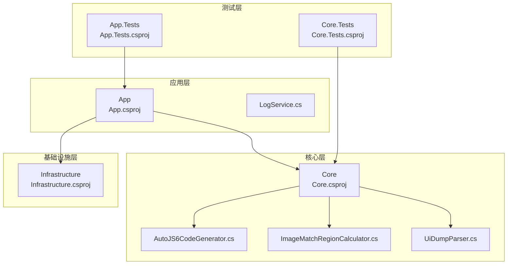
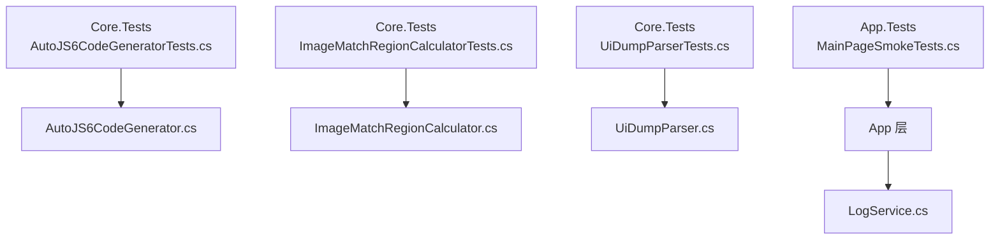
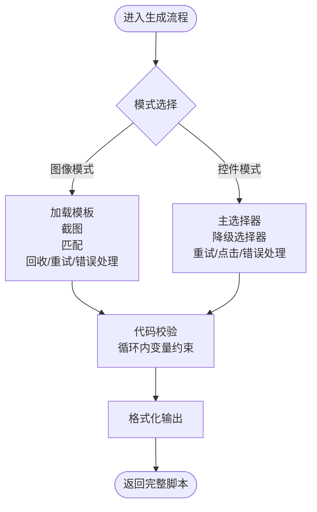
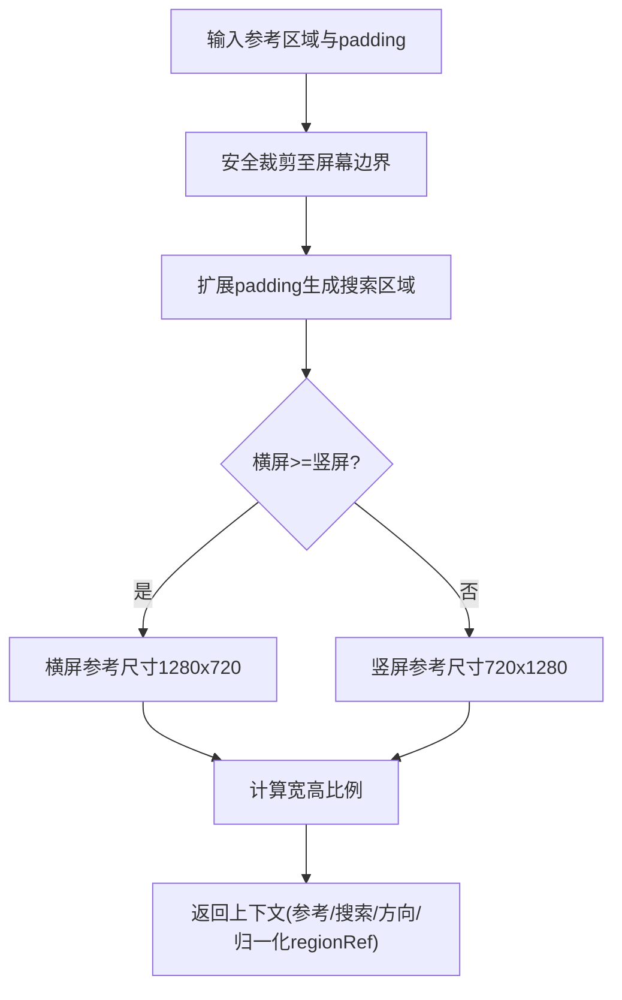
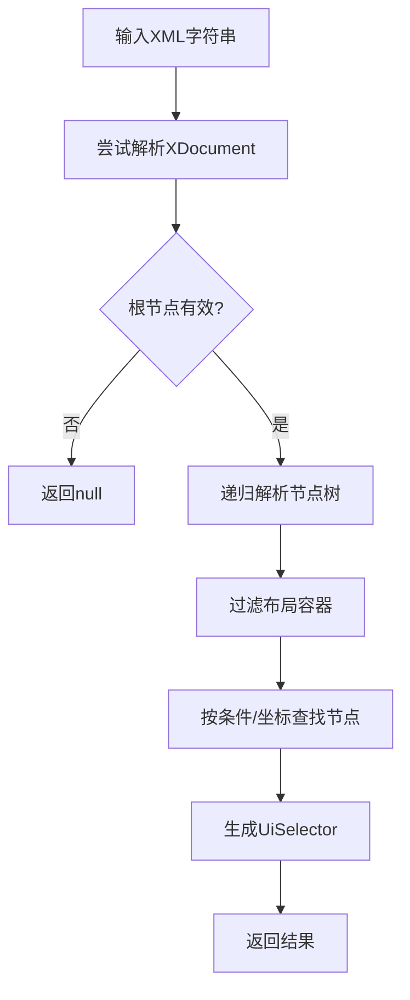
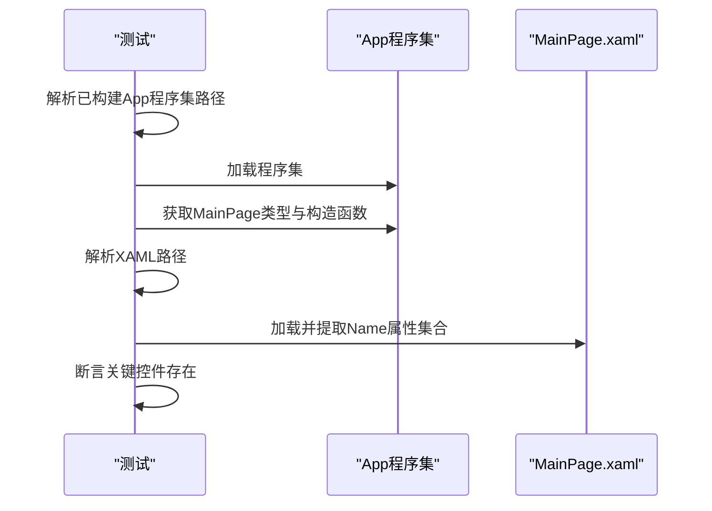
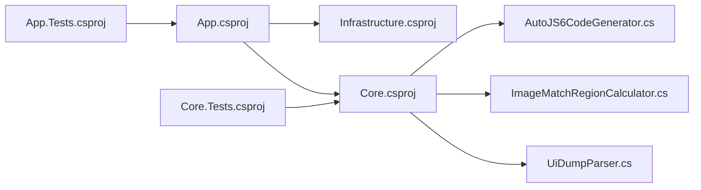

# 测试覆盖率标准

<cite>
**本文引用的文件**
- [App.Tests.csproj](file://App.Tests/App.Tests.csproj)
- [Core.Tests.csproj](file://Core.Tests/Core.Tests.csproj)
- [Infrastructure.csproj](file://Infrastructure/Infrastructure.csproj)
- [App.csproj](file://App/App.csproj)
- [Core.csproj](file://Core/Core.csproj)
- [UnitTests.cs](file://App.Tests/UnitTests.cs)
- [AutoJS6CodeGeneratorTests.cs](file://Core.Tests/AutoJS6CodeGeneratorTests.cs)
- [ImageMatchRegionCalculatorTests.cs](file://Core.Tests/ImageMatchRegionCalculatorTests.cs)
- [UiDumpParserTests.cs](file://Core.Tests/UiDumpParserTests.cs)
- [AutoJS6CodeGenerator.cs](file://Core/Services/AutoJS6CodeGenerator.cs)
- [ImageMatchRegionCalculator.cs](file://Core/Helpers/ImageMatchRegionCalculator.cs)
- [UiDumpParser.cs](file://Core/Services/UiDumpParser.cs)
- [LogService.cs](file://App/Services/LogService.cs)
</cite>

## 目录
1. [引言](#引言)
2. [项目结构](#项目结构)
3. [核心组件](#核心组件)
4. [架构总览](#架构总览)
5. [详细组件分析](#详细组件分析)
6. [依赖关系分析](#依赖关系分析)
7. [性能考量](#性能考量)
8. [故障排查指南](#故障排查指南)
9. [结论](#结论)
10. [附录](#附录)

## 引言
本文件为 AutoJS6 开发工具制定系统化的测试覆盖率标准，旨在通过明确的覆盖率目标与评估准则，确保核心算法、业务规则与错误处理路径得到充分验证。同时提供覆盖率工具使用指南、报告解读方法与持续改进策略，以保障代码质量的持续提升。

## 项目结构
项目采用多项目分层组织，核心模块位于 Core，应用层位于 App，基础设施位于 Infrastructure，测试项目分别覆盖 App 与 Core。测试项目使用 MSTest 框架进行单元测试与集成测试。

图表来源
- [App.csproj:1-84](file://App/App.csproj#L1-L84)
- [Core.csproj:1-10](file://Core/Core.csproj#L1-L10)
- [Infrastructure.csproj:1-19](file://Infrastructure/Infrastructure.csproj#L1-L19)
- [App.Tests.csproj:1-17](file://App.Tests/App.Tests.csproj#L1-L17)
- [Core.Tests.csproj:1-21](file://Core.Tests/Core.Tests.csproj#L1-L21)

章节来源
- [App.csproj:1-84](file://App/App.csproj#L1-L84)
- [Core.csproj:1-10](file://Core/Core.csproj#L1-L10)
- [Infrastructure.csproj:1-19](file://Infrastructure/Infrastructure.csproj#L1-L19)
- [App.Tests.csproj:1-17](file://App.Tests/App.Tests.csproj#L1-L17)
- [Core.Tests.csproj:1-21](file://Core.Tests/Core.Tests.csproj#L1-L21)

## 核心组件
- 代码生成器：负责图像模式与控件模式的代码生成、校验与格式化。
- 匹配区域计算器：根据参考区域与屏幕尺寸计算搜索区域与归一化参数。
- UI Dump 解析器：解析 Android UI Dump XML，过滤冗余布局容器，支持坐标定位与选择器生成。
- 日志服务：统一日志入口，供应用层调用。

章节来源
- [AutoJS6CodeGenerator.cs:1-357](file://Core/Services/AutoJS6CodeGenerator.cs#L1-L357)
- [ImageMatchRegionCalculator.cs:1-99](file://Core/Helpers/ImageMatchRegionCalculator.cs#L1-L99)
- [UiDumpParser.cs:1-263](file://Core/Services/UiDumpParser.cs#L1-L263)
- [LogService.cs:1-51](file://App/Services/LogService.cs#L1-L51)

## 架构总览
下图展示测试覆盖范围与关键业务逻辑的对应关系，帮助识别需要重点覆盖的分支与路径。

图表来源
- [UnitTests.cs:1-91](file://App.Tests/UnitTests.cs#L1-L91)
- [AutoJS6CodeGeneratorTests.cs:1-80](file://Core.Tests/AutoJS6CodeGeneratorTests.cs#L1-L80)
- [ImageMatchRegionCalculatorTests.cs:1-60](file://Core.Tests/ImageMatchRegionCalculatorTests.cs#L1-L60)
- [UiDumpParserTests.cs:1-74](file://Core.Tests/UiDumpParserTests.cs#L1-L74)
- [AutoJS6CodeGenerator.cs:1-357](file://Core/Services/AutoJS6CodeGenerator.cs#L1-L357)
- [ImageMatchRegionCalculator.cs:1-99](file://Core/Helpers/ImageMatchRegionCalculator.cs#L1-L99)
- [UiDumpParser.cs:1-263](file://Core/Services/UiDumpParser.cs#L1-L263)
- [LogService.cs:1-51](file://App/Services/LogService.cs#L1-L51)

## 详细组件分析

### 代码生成器覆盖率标准
- 目标：语句覆盖率≥90%，分支覆盖率≥80%，函数覆盖率≥95%
- 关键路径
  - 图像模式：权限检查、模板加载、截图、匹配、回收、重试逻辑、错误处理
  - 控件模式：主选择器构建、降级选择器顺序、重试与点击、错误处理
  - 校验与格式化：Rhino 引擎约束检查、缩进与结构化输出
- 阈值建议
  - 语句覆盖率：≥90%
  - 分支覆盖率：≥80%
  - 函数覆盖率：≥95%
- 回归策略
  - 新增/修改功能后，针对新增分支补充测试用例
  - 对异常路径（模板加载失败、截图失败、未找到目标/控件）进行覆盖

图表来源
- [AutoJS6CodeGenerator.cs:13-102](file://Core/Services/AutoJS6CodeGenerator.cs#L13-L102)
- [AutoJS6CodeGenerator.cs:104-164](file://Core/Services/AutoJS6CodeGenerator.cs#L104-L164)
- [AutoJS6CodeGenerator.cs:226-258](file://Core/Services/AutoJS6CodeGenerator.cs#L226-L258)
- [AutoJS6CodeGenerator.cs:191-224](file://Core/Services/AutoJS6CodeGenerator.cs#L191-L224)

章节来源
- [AutoJS6CodeGenerator.cs:1-357](file://Core/Services/AutoJS6CodeGenerator.cs#L1-L357)
- [AutoJS6CodeGeneratorTests.cs:1-80](file://Core.Tests/AutoJS6CodeGeneratorTests.cs#L1-L80)

### 匹配区域计算器覆盖率标准
- 目标：语句覆盖率≥95%，分支覆盖率≥90%，函数覆盖率≥100%
- 关键路径
  - 宽高比判断（横屏/竖屏）、安全裁剪、搜索区域扩展、比例换算、返回上下文
- 阈值建议
  - 语句覆盖率：≥95%
  - 分支覆盖率：≥90%
  - 函数覆盖率：≥100%
- 回归策略
  - 边界条件（原宽高为 0、padding 超出屏幕）与方向切换场景

图表来源
- [ImageMatchRegionCalculator.cs:40-97](file://Core/Helpers/ImageMatchRegionCalculator.cs#L40-L97)

章节来源
- [ImageMatchRegionCalculator.cs:1-99](file://Core/Helpers/ImageMatchRegionCalculator.cs#L1-L99)
- [ImageMatchRegionCalculatorTests.cs:1-60](file://Core.Tests/ImageMatchRegionCalculatorTests.cs#L1-L60)

### UI Dump 解析器覆盖率标准
- 目标：语句覆盖率≥90%，分支覆盖率≥85%，函数覆盖率≥95%
- 关键路径
  - XML 解析异常处理、节点解析与递归、布局容器过滤、坐标定位（深度优先）、选择器生成
- 阈值建议
  - 语句覆盖率：≥90%
  - 分支覆盖率：≥85%
  - 函数覆盖率：≥95%
- 回归策略
  - 非法 XML、空根节点、坐标不在任何节点内等异常路径

图表来源
- [UiDumpParser.cs:14-35](file://Core/Services/UiDumpParser.cs#L14-L35)
- [UiDumpParser.cs:37-59](file://Core/Services/UiDumpParser.cs#L37-L59)
- [UiDumpParser.cs:103-154](file://Core/Services/UiDumpParser.cs#L103-L154)
- [UiDumpParser.cs:178-197](file://Core/Services/UiDumpParser.cs#L178-L197)
- [UiDumpParser.cs:229-251](file://Core/Services/UiDumpParser.cs#L229-L251)
- [UiDumpParser.cs:61-97](file://Core/Services/UiDumpParser.cs#L61-L97)

章节来源
- [UiDumpParser.cs:1-263](file://Core/Services/UiDumpParser.cs#L1-L263)
- [UiDumpParserTests.cs:1-74](file://Core.Tests/UiDumpParserTests.cs#L1-L74)

### 应用层契约测试覆盖率标准
- 目标：语句覆盖率≥85%，分支覆盖率≥80%，函数覆盖率≥90%
- 关键路径
  - MainPage 构造与 XAML 控件契约检查、程序集加载、XAML 合同验证
- 阈值建议
  - 语句覆盖率：≥85%
  - 分支覆盖率：≥80%
  - 函数覆盖率：≥90%
- 回归策略
  - XAML 结构变更时同步更新契约测试

图表来源
- [UnitTests.cs:10-40](file://App.Tests/UnitTests.cs#L10-L40)

章节来源
- [UnitTests.cs:1-91](file://App.Tests/UnitTests.cs#L1-L91)

## 依赖关系分析
- App 依赖 Core 与 Infrastructure；Core 内部包含服务与辅助类；测试项目分别依赖被测项目。
- 依赖链路清晰，测试项目通过 MSTest 进行断言，便于覆盖率工具集成。

图表来源
- [App.csproj:67-68](file://App/App.csproj#L67-L68)
- [Infrastructure.csproj:9-11](file://Infrastructure/Infrastructure.csproj#L9-L11)
- [Core.csproj:1-10](file://Core/Core.csproj#L1-L10)
- [App.Tests.csproj:17-19](file://App.Tests/App.Tests.csproj#L17-L19)
- [Core.Tests.csproj:17-19](file://Core.Tests/Core.Tests.csproj#L17-L19)

章节来源
- [App.csproj:1-84](file://App/App.csproj#L1-L84)
- [Infrastructure.csproj:1-19](file://Infrastructure/Infrastructure.csproj#L1-L19)
- [Core.csproj:1-10](file://Core/Core.csproj#L1-L10)
- [App.Tests.csproj:1-17](file://App.Tests/App.Tests.csproj#L1-L17)
- [Core.Tests.csproj:1-21](file://Core.Tests/Core.Tests.csproj#L1-L21)

## 性能考量
- 覆盖率工具在 CI 中启用，避免阻塞流水线；建议仅对关键模块设置较高阈值，非关键模块可适当放宽。
- 使用增量覆盖率报告，聚焦新增/修改代码的覆盖率变化，减少全量扫描成本。
- 将覆盖率阈值与 PR 校验结合，防止覆盖率回退。

## 故障排查指南
- 测试失败定位
  - 查看测试输出与断言信息，确认输入数据与期望结果。
  - 对异常路径（如 XML 解析失败、模板加载失败）进行单独复现与断言。
- 覆盖率报告解读
  - 关注未覆盖的分支与条件，补充边界与异常场景测试。
  - 对热点函数（如选择器构建、区域计算）优先补齐覆盖。
- 持续改进
  - 设定月度覆盖率回顾会议，统计趋势与瓶颈模块。
  - 引入“覆盖率回归”规则，禁止降低整体覆盖率的提交。

## 结论
通过明确的覆盖率目标与评估标准，结合关键业务逻辑的重点覆盖与回归策略，可显著提升 AutoJS6 开发工具的稳定性与可维护性。建议在 CI 中强制执行覆盖率阈值，并持续优化测试用例以达到更高的质量目标。

## 附录

### 覆盖率工具使用指南（基于现有项目结构）
- 工具选择
  - Coverlet（推荐）：与 MSTest 配合良好，支持多项目聚合与报告导出。
  - dotCover（商业工具）：适合本地深度分析与可视化。
- 配置步骤（以 Coverlet 为例）
  - 在测试项目中安装 Coverlet 报告包与通用覆盖收集器。
  - 在命令行运行测试并生成覆盖率报告（支持 Cobertura、JSON、XML 等格式）。
  - 在 CI 中将报告上传并设置阈值检查（语句/分支/函数覆盖率）。
- 报告解读
  - 关注未覆盖的分支与条件，补充测试用例。
  - 对热点函数与核心算法优先补齐覆盖。
- 最佳实践
  - 为每个关键模块设定差异化阈值（核心模块更高）。
  - 将覆盖率阈值纳入 PR 规则，防止覆盖率回退。
  - 定期进行覆盖率趋势分析，识别长期未覆盖区域。

### 关键业务逻辑覆盖率要求清单
- 代码生成器
  - 图像模式：权限检查、模板加载、截图、匹配、回收、重试、错误处理
  - 控件模式：主/降级选择器、重试、点击、错误处理
  - 校验与格式化：循环内变量约束、缩进与结构化输出
- 匹配区域计算器
  - 安全裁剪、搜索区域扩展、横/竖屏比例换算、返回上下文
- UI Dump 解析器
  - XML 解析异常、节点解析与递归、布局容器过滤、坐标定位、选择器生成
- 应用层契约
  - MainPage 类型与构造函数、XAML 控件契约