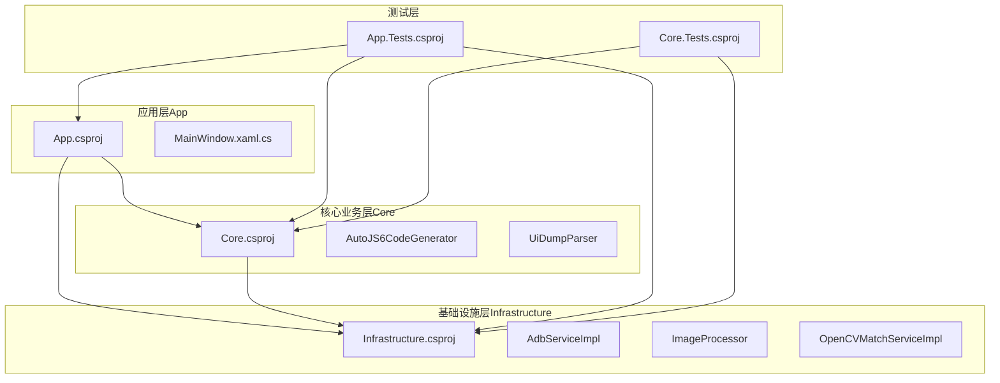
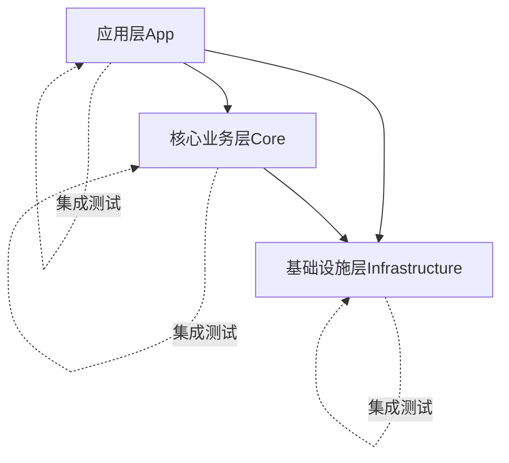
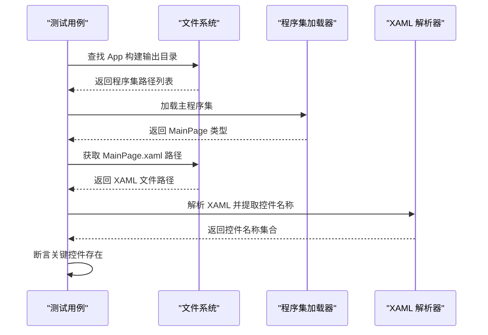
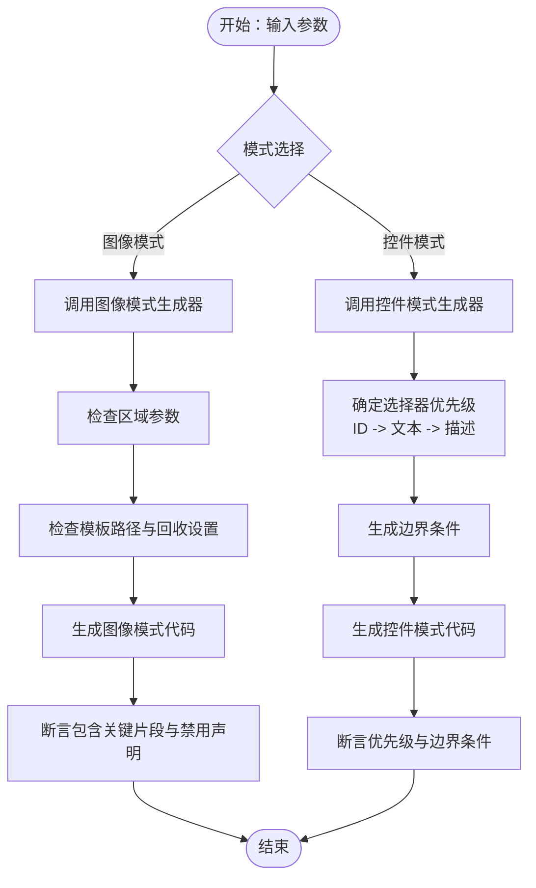
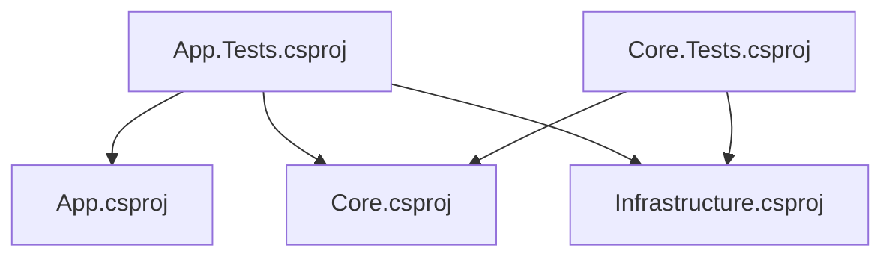

# 集成测试规范

<cite>
**本文档引用的文件**
- [App.Tests.csproj](file://App.Tests/App.Tests.csproj)
- [Core.Tests.csproj](file://Core.Tests/Core.Tests.csproj)
- [UnitTests.cs](file://App.Tests/UnitTests.cs)
- [AutoJS6CodeGeneratorTests.cs](file://Core.Tests/AutoJS6CodeGeneratorTests.cs)
- [UiDumpParserTests.cs](file://Core.Tests/UiDumpParserTests.cs)
- [App.csproj](file://App/App.csproj)
- [Infrastructure.csproj](file://Infrastructure/Infrastructure.csproj)
- [MainWindow.xaml.cs](file://App/MainWindow.xaml.cs)
</cite>

## 目录
1. [引言](#引言)
2. [项目结构](#项目结构)
3. [核心组件](#核心组件)
4. [架构概览](#架构概览)
5. [详细组件分析](#详细组件分析)
6. [依赖关系分析](#依赖关系分析)
7. [性能考虑](#性能考虑)
8. [故障排除指南](#故障排除指南)
9. [结论](#结论)
10. [附录](#附录)

## 引言
本文件为 AutoJS6 开发工具创建全面的集成测试规范文档，旨在为 WinUI 3 应用层及其核心业务逻辑提供系统化的集成测试设计与实施策略。文档覆盖以下方面：
- 组件间交互测试：验证应用层与基础设施层（ADB、图像处理、UI 抽取）的协同工作能力
- 外部依赖测试：验证对 OpenCV、ImageSharp、ADB 客户端等第三方库的集成稳定性
- 端到端工作流测试：从 UI 操作到代码生成与匹配的完整链路验证
- 测试环境配置：测试数据准备、模拟设备环境与依赖服务配置
- WinUI 3 应用层集成测试：视图模型测试、服务集成测试与用户界面交互测试
- 测试数据管理与资源组织：确保测试的可重复性与可靠性
- 具体测试场景与用例设计：覆盖主要功能模块的集成验证

## 项目结构
AutoJS6 开发工具采用分层架构，测试覆盖应用层、核心业务层与基础设施层：
- 应用层（App）：基于 WinUI 3 的桌面应用，负责用户界面与交互
- 核心业务层（Core）：提供代码生成、UI 抽取解析等核心算法
- 基础设施层（Infrastructure）：封装 ADB、图像处理与 OpenCV 等外部依赖
- 测试层（App.Tests、Core.Tests）：分别针对应用层与核心层进行集成测试

**图表来源**
- [App.csproj:1-84](file://App/App.csproj#L1-L84)
- [Core.csproj:1-10](file://Core/Core.csproj#L1-L10)
- [Infrastructure.csproj:1-19](file://Infrastructure/Infrastructure.csproj#L1-L19)
- [App.Tests.csproj:1-17](file://App.Tests/App.Tests.csproj#L1-L17)
- [Core.Tests.csproj:1-21](file://Core.Tests/Core.Tests.csproj#L1-L21)

**章节来源**
- [App.csproj:1-84](file://App/App.csproj#L1-L84)
- [Core.csproj:1-10](file://Core/Core.csproj#L1-L10)
- [Infrastructure.csproj:1-19](file://Infrastructure/Infrastructure.csproj#L1-L19)
- [App.Tests.csproj:1-17](file://App.Tests/App.Tests.csproj#L1-L17)
- [Core.Tests.csproj:1-21](file://Core.Tests/Core.Tests.csproj#L1-L21)

## 核心组件
本节概述参与集成测试的关键组件及其职责：
- 应用层组件
  - 主窗口与界面初始化：负责 WinUI 窗口的启动与最大化行为
  - 视图与视图模型：承载 UI 控件与业务逻辑绑定
- 核心业务组件
  - AutoJS6 代码生成器：根据图像或控件信息生成自动化脚本
  - UI 抽取解析器：解析 Android UI Dump XML，提取节点并支持坐标定位
- 基础设施组件
  - ADB 服务实现：提供设备连接与命令执行能力
  - 图像处理与匹配服务：封装 OpenCV 与 ImageSharp 进行图像识别与模板匹配

**章节来源**
- [MainWindow.xaml.cs:1-53](file://App/MainWindow.xaml.cs#L1-L53)
- [AutoJS6CodeGeneratorTests.cs:1-80](file://Core.Tests/AutoJS6CodeGeneratorTests.cs#L1-L80)
- [UiDumpParserTests.cs:1-74](file://Core.Tests/UiDumpParserTests.cs#L1-L74)

## 架构概览
下图展示了应用层、核心层与基础设施层之间的依赖关系及测试覆盖范围：

**图表来源**
- [App.csproj:67-68](file://App/App.csproj#L67-L68)
- [Infrastructure.csproj:9-11](file://Infrastructure/Infrastructure.csproj#L9-L11)
- [Core.csproj:1-10](file://Core/Core.csproj#L1-L10)

## 详细组件分析

### 应用层集成测试
应用层集成测试关注 WinUI 3 应用的构建输出契约与 XAML 控件契约，确保界面元素在构建后仍保持一致。

- 测试目标
  - 验证构建输出中包含关键页面类型
  - 验证 MainPage 的 XAML 中包含关键控件名称
  - 确保应用装配路径解析与 XAML 路径解析正确

- 关键测试点
  - 构建输出解析：按优先级与时间排序选择合适的程序集
  - XAML 解析与控件名称集合比对
  - 断言失败时的错误信息定位

**图表来源**
- [UnitTests.cs:10-40](file://App.Tests/UnitTests.cs#L10-L40)

**章节来源**
- [UnitTests.cs:1-91](file://App.Tests/UnitTests.cs#L1-L91)

### 核心业务层集成测试
核心业务层集成测试覆盖代码生成与 UI 抽取解析两个关键流程，验证输入参数与输出结果的一致性。

- AutoJS6 代码生成器测试
  - 图像模式代码生成：验证变量区域与模板回收逻辑
  - 控件模式代码生成：验证 ID/文本/描述的选择器优先级与降级顺序
  - 生成选项对输出的影响：如阈值、区域、重试逻辑与模板回收开关

- UI 抽取解析器测试
  - 解析有效 XML：验证根节点与边界矩形提取
  - 过滤冗余布局容器：验证节点过滤逻辑
  - 坐标定位：验证最深匹配节点查找
  - 无效 XML：验证解析失败返回空值

**图表来源**
- [AutoJS6CodeGeneratorTests.cs:10-39](file://Core.Tests/AutoJS6CodeGeneratorTests.cs#L10-L39)
- [AutoJS6CodeGeneratorTests.cs:41-78](file://Core.Tests/AutoJS6CodeGeneratorTests.cs#L41-L78)

**章节来源**
- [AutoJS6CodeGeneratorTests.cs:1-80](file://Core.Tests/AutoJS6CodeGeneratorTests.cs#L1-L80)
- [UiDumpParserTests.cs:1-74](file://Core.Tests/UiDumpParserTests.cs#L1-L74)

### 基础设施层集成测试
基础设施层集成测试关注外部依赖的可用性与稳定性，包括 ADB 服务与图像处理服务。

- 测试策略
  - 依赖服务可用性：验证 OpenCV、ImageSharp、ADB 客户端是否正确引用与编译
  - 服务接口契约：验证服务实现满足抽象接口定义
  - 端到端链路：结合核心层与应用层，验证从设备抓取到图像识别再到代码生成的完整流程

- 关键测试点
  - 项目引用与包依赖：确保 Infrastructure 正确引用 Core，并引入必要的第三方包
  - 服务实现一致性：确保 ADB 服务与图像处理服务符合各自抽象接口

**章节来源**
- [Infrastructure.csproj:9-17](file://Infrastructure/Infrastructure.csproj#L9-L17)

## 依赖关系分析
下图展示测试项目与被测项目的依赖关系，以及测试项目间的相互依赖：

**图表来源**
- [App.Tests.csproj:1-17](file://App.Tests/App.Tests.csproj#L1-L17)
- [Core.Tests.csproj:1-21](file://Core.Tests/Core.Tests.csproj#L1-L21)
- [App.csproj:67-68](file://App/App.csproj#L67-L68)
- [Infrastructure.csproj:9-11](file://Infrastructure/Infrastructure.csproj#L9-L11)
- [Core.csproj:1-10](file://Core/Core.csproj#L1-L10)

**章节来源**
- [App.Tests.csproj:1-17](file://App.Tests/App.Tests.csproj#L1-L17)
- [Core.Tests.csproj:1-21](file://Core.Tests/Core.Tests.csproj#L1-L21)

## 性能考虑
- 测试执行效率
  - 使用 MSTest 并行执行测试，减少总执行时间
  - 将大型测试数据（如图像模板）缓存至内存或本地磁盘，避免重复 IO
- 资源管理
  - 在测试结束后释放图像模板与程序集句柄，防止内存泄漏
  - 对外部依赖（ADB、OpenCV）进行连接池化与超时控制
- 可重复性保障
  - 固定随机种子与时间戳，确保测试结果可复现
  - 使用只读测试数据副本，避免测试间相互影响

## 故障排除指南
- 构建输出路径解析失败
  - 现象：无法找到已构建的应用程序集
  - 排查：确认 App 项目已成功构建，输出目录存在且包含 Release 版本
  - 参考路径：[ResolveBuiltAppAssemblyPath:42-59](file://App.Tests/UnitTests.cs#L42-L59)
- XAML 控件缺失
  - 现象：MainPage.xaml 中缺少关键控件名称
  - 排查：核对 XAML 文件路径与控件命名，确保控件名称存在于 XAML 中
  - 参考路径：[ResolveMainPageXamlPath:61-69](file://App.Tests/UnitTests.cs#L61-L69)
- 代码生成结果不符合预期
  - 现象：生成的代码不包含期望的模板回收或选择器优先级
  - 排查：检查输入参数（阈值、区域、模板路径），确认生成选项设置正确
  - 参考路径：[AutoJS6CodeGeneratorTests:10-39](file://Core.Tests/AutoJS6CodeGeneratorTests.cs#L10-L39)
- UI 抽取解析异常
  - 现象：解析无效 XML 返回空值或坐标定位错误
  - 排查：验证输入 XML 结构完整性，确认边界矩形与坐标计算逻辑
  - 参考路径：[UiDumpParserTests:65-72](file://Core.Tests/UiDumpParserTests.cs#L65-L72)

**章节来源**
- [UnitTests.cs:42-69](file://App.Tests/UnitTests.cs#L42-L69)
- [AutoJS6CodeGeneratorTests.cs:10-39](file://Core.Tests/AutoJS6CodeGeneratorTests.cs#L10-L39)
- [UiDumpParserTests.cs:65-72](file://Core.Tests/UiDumpParserTests.cs#L65-L72)

## 结论
本集成测试规范为 AutoJS6 开发工具提供了系统化的测试设计与实施策略，覆盖应用层、核心业务层与基础设施层的集成验证。通过构建输出契约测试、核心算法测试与外部依赖测试，确保系统在真实使用场景下的稳定性与可靠性。建议在持续集成流水线中运行这些测试，以尽早发现集成问题并保证发布质量。

## 附录

### 测试环境配置要求
- 测试数据准备
  - 准备用于图像匹配的模板图片与 UI Dump XML 示例
  - 准备不同分辨率与布局的测试页面快照，覆盖典型控件组合
- 模拟设备环境
  - 配置 ADB 服务，确保设备连接与权限校验通过
  - 提供稳定的网络与 USB 连接，避免测试中断
- 依赖服务配置
  - 确保 OpenCV 与 ImageSharp 的动态库正确部署
  - 验证 ADB 客户端版本兼容性与命令可用性

### WinUI 3 应用层集成测试方法
- 视图模型测试
  - 使用 MSTest 验证视图模型属性变更通知与命令绑定
  - 通过 Mock 服务对象隔离外部依赖，专注于业务逻辑验证
- 服务集成测试
  - 验证服务接口契约与实现一致性，确保跨模块协作稳定
  - 对关键服务（如 ADB、图像处理）进行端到端链路测试
- 用户界面交互测试
  - 使用 UI 自动化框架（如 WinAppDriver）验证控件点击、输入与状态变化
  - 结合构建输出契约测试，确保 UI 控件在不同平台与架构下一致

### 测试数据管理与资源组织
- 测试数据组织
  - 将测试图像与 XML 数据置于独立目录，便于版本控制与更新
  - 使用数据驱动测试，通过参数化输入覆盖多种场景
- 资源生命周期管理
  - 在测试类构造函数中初始化资源，在清理方法中释放资源
  - 对共享资源（如模板图片）进行并发访问控制，避免竞态条件