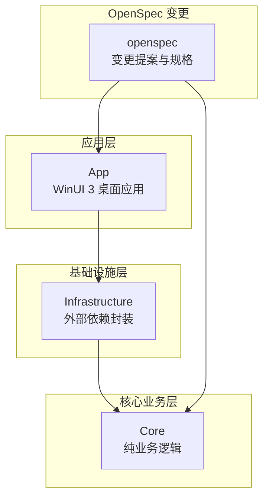
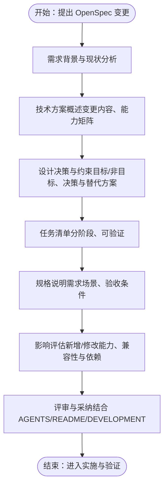
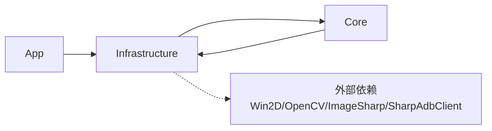

# 功能提案编写指南

<cite>
**本文引用的文件**   
- [README.md](file://README.md)
- [AGENTS.md](file://AGENTS.md)
- [DEVELOPMENT.md](file://DEVELOPMENT.md)
- [checklist.md](file://checklist.md)
- [openspec/config.yaml](file://openspec/config.yaml)
- [openspec/changes/winui3-visual-dev-toolkit/proposal.md](file://openspec/changes/winui3-visual-dev-toolkit/proposal.md)
- [openspec/changes/winui3-visual-dev-toolkit/design.md](file://openspec/changes/winui3-visual-dev-toolkit/design.md)
- [openspec/changes/winui3-visual-dev-toolkit/tasks.md](file://openspec/changes/winui3-visual-dev-toolkit/tasks.md)
- [openspec/changes/winui3-visual-dev-toolkit/specs/autojs6-code-generator/spec.md](file://openspec/changes/winui3-visual-dev-toolkit/specs/autojs6-code-generator/spec.md)
</cite>

## 目录
1. [引言](#引言)
2. [项目结构](#项目结构)
3. [核心组件](#核心组件)
4. [架构总览](#架构总览)
5. [详细组件分析](#详细组件分析)
6. [依赖分析](#依赖分析)
7. [性能考虑](#性能考虑)
8. [故障排查指南](#故障排查指南)
9. [结论](#结论)
10. [附录](#附录)

## 引言
本指南面向 AutoJS6 开发工具的贡献者与维护者，提供 OpenSpec 功能提案的标准化编写方法。通过参考项目现有的 OpenSpec 变更文档与开发规范，帮助开发者快速产出高质量、可落地、可评审的功能提案，确保变更与项目约束、技术架构、用户体验目标保持一致。

## 项目结构
AutoJS6 开发工具采用分层架构与 OpenSpec 变更管理流程，核心结构如下：
- App：WinUI 3 桌面应用，负责 UI 与 MVVM
- Core：纯业务逻辑层，包含服务接口、模型与核心算法
- Infrastructure：外部依赖封装层，屏蔽 ADB、OpenCV、ImageSharp 等第三方细节
- openspec：OpenSpec 变更提案与规格说明集合
- AGENTS.md：项目上下文、约束与工作准则
- README.md：项目说明、特性与开发流程
- DEVELOPMENT.md：开发与发布流程指南
- checklist.md：V1 发布验证清单

图表来源
- [README.md:230-260](file://README.md#L230-L260)
- [openspec/changes/winui3-visual-dev-toolkit/proposal.md:31-36](file://openspec/changes/winui3-visual-dev-toolkit/proposal.md#L31-L36)

章节来源
- [README.md:230-260](file://README.md#L230-L260)
- [AGENTS.md:69-95](file://AGENTS.md#L69-L95)

## 核心组件
- 双引擎独立架构：图像处理引擎（像素级）与 UI 图层分析引擎（控件级）完全解耦，数据源、处理管线、渲染逻辑与代码生成路径互不耦合。
- 分层渲染管线：Win2D 双图层（图像层 + 叠加层），确保缩放/平移不影响 Overlay，提升交互流畅度。
- 异步非阻塞：所有 I/O（ADB、OpenCV、XML 解析、纹理上传）采用异步，UI 线程不阻塞。
- 代码生成双路径：图像模式（images.findImage）与控件模式（UiSelector）独立生成，严格遵循 AutoJS6 约束。
- 项目依赖单向：App → Infrastructure → Core ← Infrastructure，Core 为纯类库，可独立测试。

章节来源
- [AGENTS.md:40-66](file://AGENTS.md#L40-L66)
- [AGENTS.md:69-95](file://AGENTS.md#L69-L95)
- [AGENTS.md:229-253](file://AGENTS.md#L229-L253)
- [openspec/changes/winui3-visual-dev-toolkit/design.md:30-50](file://openspec/changes/winui3-visual-dev-toolkit/design.md#L30-L50)

## 架构总览
OpenSpec 变更从“需求背景”出发，形成“技术方案”与“影响评估”，并通过“任务清单”推进落地。整体流程如下：

图表来源
- [openspec/changes/winui3-visual-dev-toolkit/proposal.md:1-70](file://openspec/changes/winui3-visual-dev-toolkit/proposal.md#L1-L70)
- [openspec/changes/winui3-visual-dev-toolkit/design.md:36-153](file://openspec/changes/winui3-visual-dev-toolkit/design.md#L36-L153)
- [openspec/changes/winui3-visual-dev-toolkit/tasks.md:1-260](file://openspec/changes/winui3-visual-dev-toolkit/tasks.md#L1-L260)

## 详细组件分析

### OpenSpec 提案结构规范
OpenSpec 提案应包含以下结构化章节，确保评审与实施的一致性与可追溯性：
- 标题：简洁明确地表达变更主题
- 摘要：一句话概述背景、目标与收益
- 背景：现状痛点、影响范围与关键参考资源
- 目标：明确达成的目标与验收标准
- 范围：功能边界、非目标与约束
- 技术方案：变更内容、能力矩阵、关键设计决策
- 影响评估：新增/修改能力、项目结构与依赖、兼容性要求
- 风险评估：潜在风险与缓解措施
- 任务清单：可验证的阶段性任务与里程碑
- 规格说明：需求场景、验收条件与一致性要求
- 审核与采纳：评审依据与采纳标准

章节来源
- [openspec/changes/winui3-visual-dev-toolkit/proposal.md:1-70](file://openspec/changes/winui3-visual-dev-toolkit/proposal.md#L1-L70)
- [openspec/changes/winui3-visual-dev-toolkit/design.md:36-153](file://openspec/changes/winui3-visual-dev-toolkit/design.md#L36-L153)
- [openspec/changes/winui3-visual-dev-toolkit/tasks.md:1-260](file://openspec/changes/winui3-visual-dev-toolkit/tasks.md#L1-L260)
- [openspec/changes/winui3-visual-dev-toolkit/specs/autojs6-code-generator/spec.md:1-136](file://openspec/changes/winui3-visual-dev-toolkit/specs/autojs6-code-generator/spec.md#L1-L136)

### 需求背景描述
- 从“痛点”入手：描述现有工作流低效、调试成本高、跨设备一致性差等问题
- 明确目标用户场景与参考资源：指向 AutoJS6 自动化项目 等目标用户场景与 AutoJS6 文档/源码
- 量化影响：如截图/匹配/调试效率、跨设备适配成本、开发时间节省等

章节来源
- [openspec/changes/winui3-visual-dev-toolkit/proposal.md:1-70](file://openspec/changes/winui3-visual-dev-toolkit/proposal.md#L1-L70)
- [AGENTS.md:28-37](file://AGENTS.md#L28-L37)

### 技术方案概述
- 变更内容：新增/修改的能力清单与模块边界
- 能力矩阵：新能力与修改能力的分类与说明
- 设计约束：双引擎独立、分层渲染、异步架构、坐标系对齐等

章节来源
- [openspec/changes/winui3-visual-dev-toolkit/proposal.md:7-28](file://openspec/changes/winui3-visual-dev-toolkit/proposal.md#L7-L28)
- [openspec/changes/winui3-visual-dev-toolkit/design.md:30-50](file://openspec/changes/winui3-visual-dev-toolkit/design.md#L30-L50)

### 预期收益分析
- 效率提升：减少“试错-运行-调整”循环次数
- 成本降低：跨设备适配、模板管理、坐标调试成本下降
- 质量保障：实时匹配预览、阈值调节、选择器验证等提升成功率
- 用户体验：可视化操作、一键复制/导出、代码预览与手动编辑

章节来源
- [README.md:67-92](file://README.md#L67-L92)
- [README.md:166-228](file://README.md#L166-L228)

### 风险评估
- ADB 连接不稳定：重试机制、超时控制、Toast 提示
- OpenCV 匹配误报/漏报：阈值滑块、置信度可视化、多模板匹配
- UI 树解析失败：容错解析器、日志记录、原始 Dump 查看
- 渲染性能不足：降采样、分层渲染、GPU 加速
- 生成代码与现有脚本不一致：严格复用现有逻辑、代码预览与手动编辑

章节来源
- [openspec/changes/winui3-visual-dev-toolkit/design.md:131-153](file://openspec/changes/winui3-visual-dev-toolkit/design.md#L131-L153)

### 影响评估
- 新增/修改能力：App/Infrastructure/Core 层的模块与依赖变化
- 项目结构：新增目录、NuGet 依赖、兼容性要求
- 外部工具：ADB 环境变量、Windows/VS 版本要求

章节来源
- [openspec/changes/winui3-visual-dev-toolkit/proposal.md:29-43](file://openspec/changes/winui3-visual-dev-toolkit/proposal.md#L29-L43)

### 任务清单与实施节奏
- 前置准备：理解现有项目与 AutoJS6 生态、MVP 验证、API 权威参考
- 项目结构与依赖：创建 Core/Infrastructure/App、配置依赖关系
- 核心模块：数据模型、服务接口、实现与测试
- UI 与交互：画布控件、交互实现、属性面板、代码预览
- 性能与异步：异步架构、缓存池、虚拟化、分层渲染
- 错误处理与日志：异常捕获、重试、超时、日志输出
- 测试与验证：单元测试、真机联调、性能测试
- 文档与部署：环境配置、编译运行、打包发布

章节来源
- [openspec/changes/winui3-visual-dev-toolkit/tasks.md:1-260](file://openspec/changes/winui3-visual-dev-toolkit/tasks.md#L1-L260)

### 规格说明与验收条件
- 图像模式代码生成：请求截图、读取模板、findImage、点击、重试/超时、路径兼容、格式化、预览与导出
- 控件模式代码生成：UiSelector 优先级、boundsInside、操作方法、路径兼容、格式化、预览与导出
- 一致性要求：严格复用现有 cmd 脚本的坐标计算、匹配算法、路径处理逻辑

章节来源
- [openspec/changes/winui3-visual-dev-toolkit/specs/autojs6-code-generator/spec.md:1-136](file://openspec/changes/winui3-visual-dev-toolkit/specs/autojs6-code-generator/spec.md#L1-L136)

### 审核与采纳标准
- 评审依据：AGENTS.md 的用户体验优先规则、双核独立架构、异步非阻塞、60FPS 流畅、严格遵循 AutoJS6 约束
- 采纳流程：OpenSpec 提案经评审后进入任务清单，按阶段推进与验证，结合 checklist.md 的 V1 发布验证

章节来源
- [AGENTS.md:3-27](file://AGENTS.md#L3-L27)
- [AGENTS.md:40-66](file://AGENTS.md#L40-L66)
- [AGENTS.md:229-253](file://AGENTS.md#L229-L253)
- [checklist.md:1-186](file://checklist.md#L1-L186)

## 依赖分析
OpenSpec 变更的依赖关系体现在：
- 项目层依赖单向：App → Infrastructure → Core ← Infrastructure
- 服务接口与实现：IAdbService、IUiDumpParser、IOpenCVMatchService、ICodeGenerator
- 外部依赖：Win2D、OpenCvSharp4、ImageSharp、SharpAdbClient、CommunityToolkit.Mvvm
- 内部模块：Core 为纯类库，Infrastructure 封装外部依赖，App 仅负责 UI 与 MVVM

图表来源
- [openspec/changes/winui3-visual-dev-toolkit/proposal.md:31-36](file://openspec/changes/winui3-visual-dev-toolkit/proposal.md#L31-L36)
- [openspec/changes/winui3-visual-dev-toolkit/tasks.md:48-56](file://openspec/changes/winui3-visual-dev-toolkit/tasks.md#L48-L56)

章节来源
- [openspec/changes/winui3-visual-dev-toolkit/proposal.md:31-36](file://openspec/changes/winui3-visual-dev-toolkit/proposal.md#L31-L36)
- [openspec/changes/winui3-visual-dev-toolkit/tasks.md:48-56](file://openspec/changes/winui3-visual-dev-toolkit/tasks.md#L48-L56)

## 性能考虑
- 异步架构：所有 I/O 操作异步，避免 UI 阻塞
- 渲染优化：Win2D 双图层、分层渲染仅重绘变化图层、GPU 加速
- 内存优化：CanvasBitmap 缓存池、阈值滑动仅重算匹配层、控件树虚拟化
- 性能目标：60FPS 流畅渲染、支持 5000+ 节点控件树

章节来源
- [AGENTS.md:229-253](file://AGENTS.md#L229-L253)
- [openspec/changes/winui3-visual-dev-toolkit/design.md:109-119](file://openspec/changes/winui3-visual-dev-toolkit/design.md#L109-L119)

## 故障排查指南
- ADB 连接不稳定：重试机制（最多 3 次）、超时设置（5 秒）、异常捕获与 Toast 提示
- OpenCV 匹配误报/漏报：阈值滑块（0.50~0.95）、置信度可视化、多模板匹配
- UI 树解析失败：容错解析器、日志记录、原始 Dump 文本查看面板
- 渲染性能不足：图像降采样（最大 1920x1080）、分层渲染、GPU 加速
- 生成代码不一致：严格复用现有脚本逻辑、代码预览与手动编辑、实施前完整理解 AutoJS6 自动化项目 与 AutoJS6 约束

章节来源
- [openspec/changes/winui3-visual-dev-toolkit/design.md:131-153](file://openspec/changes/winui3-visual-dev-toolkit/design.md#L131-L153)

## 结论
通过遵循 OpenSpec 的结构化流程与项目约束，功能提案可以有效降低沟通成本、提升实施质量与可验证性。建议在撰写提案时始终以用户体验优先、双核独立、异步非阻塞、60FPS 流畅为核心原则，并严格复用现有脚本逻辑与 AutoJS6 约束，确保变更与项目目标一致。

## 附录

### OpenSpec 提案模板（结构化）
- 标题：简洁明确的主题
- 摘要：一句话概述背景、目标与收益
- 背景
  - 现状痛点与影响范围
  - 目标用户场景与参考资源
- 目标
  - 明确达成的目标与验收标准
- 范围
  - 功能边界与非目标
  - 关键约束与限制
- 技术方案
  - 变更内容与能力矩阵
  - 关键设计决策与替代方案
- 影响评估
  - 新增/修改能力
  - 项目结构与依赖
  - 兼容性与外部工具要求
- 风险评估
  - 潜在风险与缓解措施
- 任务清单
  - 分阶段、可验证的任务与里程碑
- 规格说明
  - 需求场景与验收条件
  - 与现有实现的一致性要求
- 审核与采纳
  - 评审依据与采纳标准

章节来源
- [openspec/changes/winui3-visual-dev-toolkit/proposal.md:1-70](file://openspec/changes/winui3-visual-dev-toolkit/proposal.md#L1-L70)
- [openspec/changes/winui3-visual-dev-toolkit/design.md:36-153](file://openspec/changes/winui3-visual-dev-toolkit/design.md#L36-L153)
- [openspec/changes/winui3-visual-dev-toolkit/tasks.md:1-260](file://openspec/changes/winui3-visual-dev-toolkit/tasks.md#L1-L260)
- [openspec/changes/winui3-visual-dev-toolkit/specs/autojs6-code-generator/spec.md:1-136](file://openspec/changes/winui3-visual-dev-toolkit/specs/autojs6-code-generator/spec.md#L1-L136)

### 字数限制与格式要求
- 字数限制：提案建议控制在合理范围内，便于评审与传播
- 格式要求：结构化章节、清晰标题、要点化表述、可追溯的参考资源
- 审核标准：以 AGENTS.md 的用户体验优先规则、双核独立架构、异步非阻塞、60FPS 流畅、严格遵循 AutoJS6 约束为依据

章节来源
- [openspec/config.yaml:12-21](file://openspec/config.yaml#L12-L21)
- [AGENTS.md:3-27](file://AGENTS.md#L3-L27)
- [AGENTS.md:40-66](file://AGENTS.md#L40-L66)
- [AGENTS.md:229-253](file://AGENTS.md#L229-L253)

### 实施与验证流程
- 前置准备：理解现有项目与 AutoJS6 生态、MVP 验证、API 权威参考
- 项目结构与依赖：创建 Core/Infrastructure/App、配置依赖关系
- 核心模块：数据模型、服务接口、实现与测试
- UI 与交互：画布控件、交互实现、属性面板、代码预览
- 性能与异步：异步架构、缓存池、虚拟化、分层渲染
- 错误处理与日志：异常捕获、重试、超时、日志输出
- 测试与验证：单元测试、真机联调、性能测试
- 文档与部署：环境配置、编译运行、打包发布

章节来源
- [openspec/changes/winui3-visual-dev-toolkit/tasks.md:1-260](file://openspec/changes/winui3-visual-dev-toolkit/tasks.md#L1-L260)
- [checklist.md:1-186](file://checklist.md#L1-L186)
- [DEVELOPMENT.md:1-276](file://DEVELOPMENT.md#L1-L276)