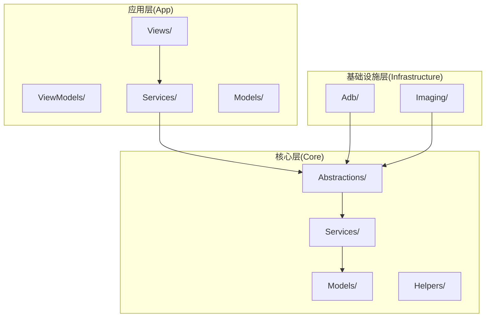
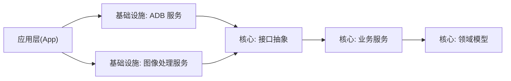
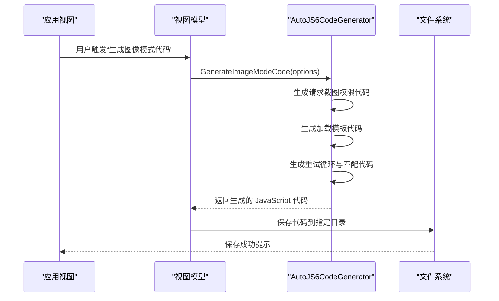
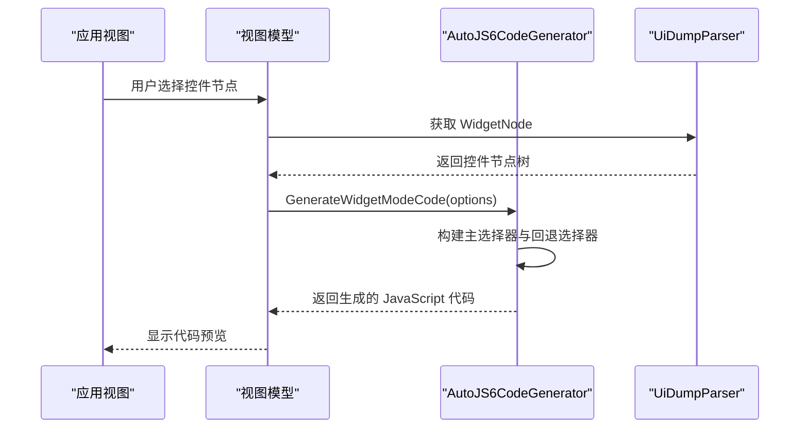
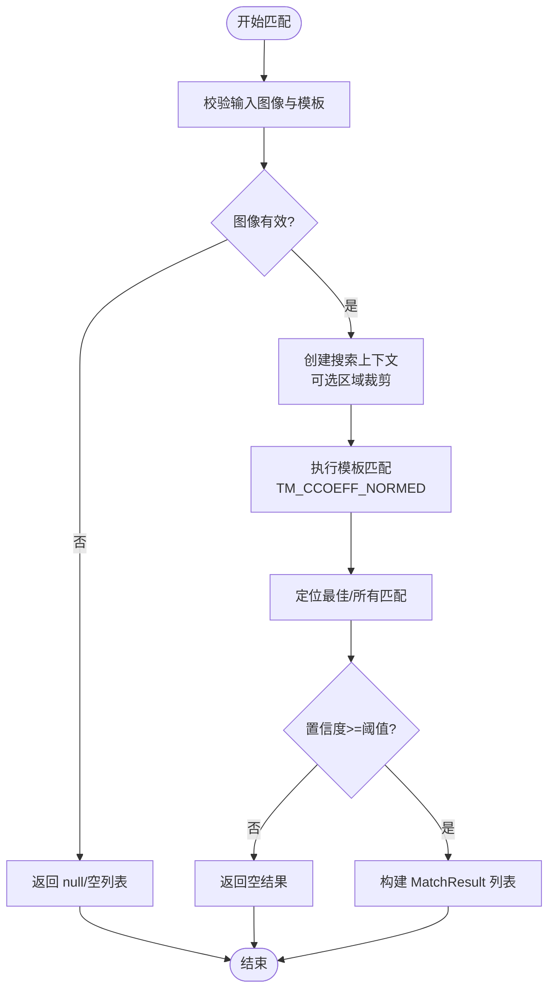
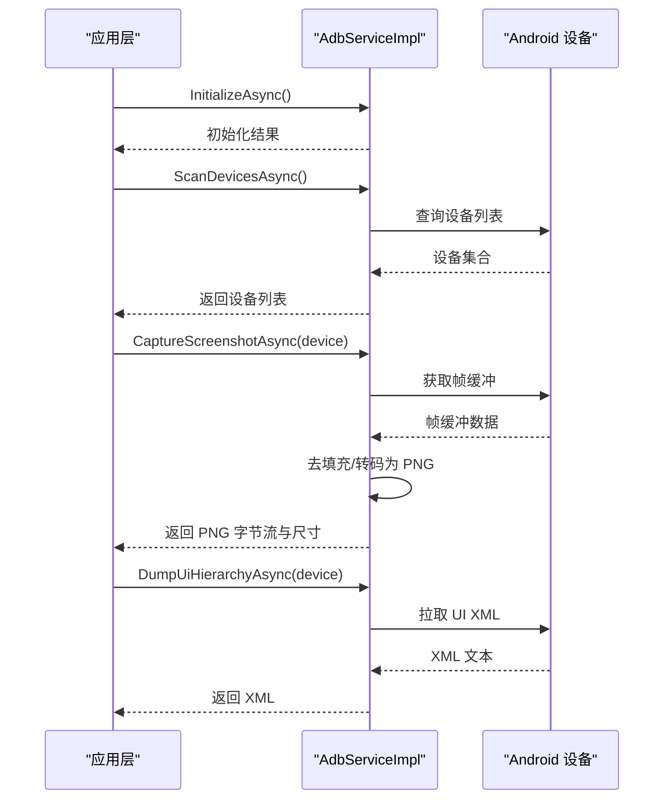
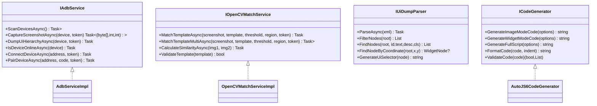
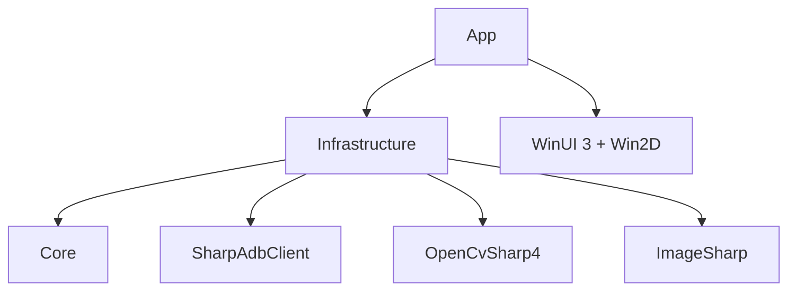

# 功能设计文档编写指南

<cite>
**本文档引用的文件**
- [README.md](file://README.md)
- [manual.md](file://manual.md)
- [checklist.md](file://checklist.md)
- [openspec/config.yaml](file://openspec/config.yaml)
- [App/App.csproj](file://App/App.csproj)
- [Core/Abstractions/IAdbService.cs](file://Core/Abstractions/IAdbService.cs)
- [Core/Abstractions/ICodeGenerator.cs](file://Core/Abstractions/ICodeGenerator.cs)
- [Core/Abstractions/IOpenCVMatchService.cs](file://Core/Abstractions/IOpenCVMatchService.cs)
- [Core/Abstractions/IUiDumpParser.cs](file://Core/Abstractions/IUiDumpParser.cs)
- [Core/Services/AutoJS6CodeGenerator.cs](file://Core/Services/AutoJS6CodeGenerator.cs)
- [Core/Models/AutoJS6CodeOptions.cs](file://Core/Models/AutoJS6CodeOptions.cs)
- [Core/Models/WidgetNode.cs](file://Core/Models/WidgetNode.cs)
- [Core/Models/MatchResult.cs](file://Core/Models/MatchResult.cs)
- [Infrastructure/Adb/AdbServiceImpl.cs](file://Infrastructure/Adb/AdbServiceImpl.cs)
- [Infrastructure/Imaging/OpenCVMatchServiceImpl.cs](file://Infrastructure/Imaging/OpenCVMatchServiceImpl.cs)
</cite>

## 目录
1. [引言](#引言)
2. [项目结构](#项目结构)
3. [核心组件](#核心组件)
4. [架构总览](#架构总览)
5. [详细组件分析](#详细组件分析)
6. [依赖分析](#依赖分析)
7. [性能考虑](#性能考虑)
8. [故障排除指南](#故障排除指南)
9. [结论](#结论)
10. [附录](#附录)

## 引言
本指南面向 AutoJS6 开发工具的功能设计文档编写，旨在统一设计文档的结构、技术规范与评审标准，确保跨模块协作、可追溯性与可维护性。文档覆盖系统架构设计、接口定义、数据模型设计与组件交互关系，并提供 UML 图表、序列图、类图的使用标准，以及设计变更的影响分析、兼容性考虑、版本管理与更新流程，最后提供设计文档模板与检查清单。

## 项目结构
AutoJS6 开发工具采用 Clean Architecture 分层组织，分为应用层（App）、基础设施层（Infrastructure）与核心业务层（Core）。应用层负责 UI 与 MVVM；基础设施层封装外部依赖（ADB、OpenCV、Win2D 等）；核心层包含纯业务逻辑与领域模型，独立于 UI，便于测试与复用。

图表来源
- [App/App.csproj:67-68](file://App/App.csproj#L67-L68)
- [Infrastructure/Adb/AdbServiceImpl.cs:17-28](file://Infrastructure/Adb/AdbServiceImpl.cs#L17-L28)
- [Infrastructure/Imaging/OpenCVMatchServiceImpl.cs:11-11](file://Infrastructure/Imaging/OpenCVMatchServiceImpl.cs#L11-L11)
- [Core/Abstractions/IAdbService.cs:8-56](file://Core/Abstractions/IAdbService.cs#L8-L56)
- [Core/Abstractions/IOpenCVMatchService.cs:8-56](file://Core/Abstractions/IOpenCVMatchService.cs#L8-L56)
- [Core/Abstractions/IUiDumpParser.cs:8-55](file://Core/Abstractions/IUiDumpParser.cs#L8-L55)
- [Core/Services/AutoJS6CodeGenerator.cs:11-11](file://Core/Services/AutoJS6CodeGenerator.cs#L11-L11)

章节来源
- [README.md: 230-280:230-280](file://README.md#L230-L280)
- [App/App.csproj: 67-68:67-68](file://App/App.csproj#L67-L68)

## 核心组件
- 应用层组件
  - 视图与视图模型：负责用户交互与状态管理（WinUI 3 + MVVM）
  - 应用服务：编排业务流程（如截图捕获、UI 树解析、代码生成）
- 基础设施层组件
  - ADB 服务：设备扫描、截图捕获、UI 层次结构拉取、网络连接与配对
  - 图像处理服务：OpenCV 模板匹配、相似度计算、模板有效性校验
- 核心层组件
  - 接口抽象：IAdbService、IOpenCVMatchService、IUiDumpParser、ICodeGenerator
  - 业务服务：AutoJS6CodeGenerator（图像/控件模式代码生成与验证）
  - 领域模型：AutoJS6CodeOptions、WidgetNode、MatchResult、CropRegion、AdbDevice

章节来源
- [Core/Abstractions/IAdbService.cs: 8-56:8-56](file://Core/Abstractions/IAdbService.cs#L8-L56)
- [Core/Abstractions/IOpenCVMatchService.cs: 8-56:8-56](file://Core/Abstractions/IOpenCVMatchService.cs#L8-L56)
- [Core/Abstractions/IUiDumpParser.cs: 8-55:8-55](file://Core/Abstractions/IUiDumpParser.cs#L8-L55)
- [Core/Abstractions/ICodeGenerator.cs: 8-45:8-45](file://Core/Abstractions/ICodeGenerator.cs#L8-L45)
- [Core/Services/AutoJS6CodeGenerator.cs: 11-357:11-357](file://Core/Services/AutoJS6CodeGenerator.cs#L11-L357)
- [Core/Models/AutoJS6CodeOptions.cs: 6-89:6-89](file://Core/Models/AutoJS6CodeOptions.cs#L6-L89)
- [Core/Models/WidgetNode.cs: 6-93:6-93](file://Core/Models/WidgetNode.cs#L6-L93)
- [Core/Models/MatchResult.cs: 6-63:6-63](file://Core/Models/MatchResult.cs#L6-L63)
- [Infrastructure/Adb/AdbServiceImpl.cs: 17-238:17-238](file://Infrastructure/Adb/AdbServiceImpl.cs#L17-L238)
- [Infrastructure/Imaging/OpenCVMatchServiceImpl.cs: 11-204:11-204](file://Infrastructure/Imaging/OpenCVMatchServiceImpl.cs#L11-L204)

## 架构总览
系统采用异步优先、单向依赖的 Clean Architecture：
- 应用层仅依赖基础设施层接口（通过 Core 抽象）
- 基础设施层实现具体适配器（ADB、OpenCV）
- 核心层保持纯业务逻辑，独立于 UI，支持单元测试

图表来源
- [README.md: 272-287:272-287](file://README.md#L272-L287)
- [App/App.csproj: 67-68:67-68](file://App/App.csproj#L67-L68)
- [Infrastructure/Adb/AdbServiceImpl.cs:17-28](file://Infrastructure/Adb/AdbServiceImpl.cs#L17-L28)
- [Infrastructure/Imaging/OpenCVMatchServiceImpl.cs:11-11](file://Infrastructure/Imaging/OpenCVMatchServiceImpl.cs#L11-L11)
- [Core/Abstractions/IAdbService.cs:8-56](file://Core/Abstractions/IAdbService.cs#L8-L56)
- [Core/Abstractions/IOpenCVMatchService.cs:8-56](file://Core/Abstractions/IOpenCVMatchService.cs#L8-L56)
- [Core/Abstractions/IUiDumpParser.cs:8-55](file://Core/Abstractions/IUiDumpParser.cs#L8-L55)
- [Core/Services/AutoJS6CodeGenerator.cs:11-11](file://Core/Services/AutoJS6CodeGenerator.cs#L11-L11)

## 详细组件分析

### 组件一：AutoJS6 代码生成器（图像模式）
- 功能概述：根据模板与区域参数生成 AutoJS6 图像模式代码，支持重试、超时、日志与图像回收
- 关键接口：ICodeGenerator.GenerateImageModeCode
- 数据模型：AutoJS6CodeOptions（阈值、区域、重试次数、变量前缀等）
- 生成策略：请求截图权限 → 加载模板 → 截图匹配 → 计算点击坐标 → 点击/日志/回收
- AutoJS6 约束：循环体内使用 var 替代 const/let；单次循环内仅一次截图；模板回收

图表来源
- [Core/Services/AutoJS6CodeGenerator.cs: 13-102:13-102](file://Core/Services/AutoJS6CodeGenerator.cs#L13-L102)
- [Core/Abstractions/ICodeGenerator.cs: 14-15:14-15](file://Core/Abstractions/ICodeGenerator.cs#L14-L15)
- [Core/Models/AutoJS6CodeOptions.cs: 14-46:14-46](file://Core/Models/AutoJS6CodeOptions.cs#L14-L46)

章节来源
- [Core/Services/AutoJS6CodeGenerator.cs: 11-357:11-357](file://Core/Services/AutoJS6CodeGenerator.cs#L11-L357)
- [Core/Abstractions/ICodeGenerator.cs: 8-45:8-45](file://Core/Abstractions/ICodeGenerator.cs#L8-L45)
- [Core/Models/AutoJS6CodeOptions.cs: 6-89:6-89](file://Core/Models/AutoJS6CodeOptions.cs#L6-L89)

### 组件二：AutoJS6 代码生成器（控件模式）
- 功能概述：根据 WidgetNode 生成 UiSelector 代码，支持主选择器与回退选择器链
- 关键接口：ICodeGenerator.GenerateWidgetModeCode
- 生成策略：优先 id()，其次 text()/desc()，最后 className()；可附加 boundsInside 限定区域；支持重试与点击

图表来源
- [Core/Services/AutoJS6CodeGenerator.cs: 104-164:104-164](file://Core/Services/AutoJS6CodeGenerator.cs#L104-L164)
- [Core/Abstractions/IUiDumpParser.cs: 54-54:54-54](file://Core/Abstractions/IUiDumpParser.cs#L54-L54)
- [Core/Models/WidgetNode.cs: 6-93:6-93](file://Core/Models/WidgetNode.cs#L6-L93)

章节来源
- [Core/Services/AutoJS6CodeGenerator.cs: 11-357:11-357](file://Core/Services/AutoJS6CodeGenerator.cs#L11-L357)
- [Core/Abstractions/IUiDumpParser.cs: 8-55:8-55](file://Core/Abstractions/IUiDumpParser.cs#L8-L55)
- [Core/Models/WidgetNode.cs: 6-93:6-93](file://Core/Models/WidgetNode.cs#L6-L93)

### 组件三：OpenCV 模板匹配服务
- 功能概述：执行 TM_CCOEFF_NORMED 模板匹配，支持单次最佳匹配与多结果匹配，支持区域搜索与相似度计算
- 关键接口：IOpenCVMatchService.MatchTemplateAsync/MatchTemplateMultiAsync
- 性能特性：异步执行、计时统计、区域裁剪、阈值过滤

图表来源
- [Infrastructure/Imaging/OpenCVMatchServiceImpl.cs: 13-122:13-122](file://Infrastructure/Imaging/OpenCVMatchServiceImpl.cs#L13-L122)
- [Core/Abstractions/IOpenCVMatchService.cs: 19-40:19-40](file://Core/Abstractions/IOpenCVMatchService.cs#L19-L40)
- [Core/Models/MatchResult.cs: 6-63:6-63](file://Core/Models/MatchResult.cs#L6-L63)

章节来源
- [Infrastructure/Imaging/OpenCVMatchServiceImpl.cs: 11-204:11-204](file://Infrastructure/Imaging/OpenCVMatchServiceImpl.cs#L11-L204)
- [Core/Abstractions/IOpenCVMatchService.cs: 8-56:8-56](file://Core/Abstractions/IOpenCVMatchService.cs#L8-L56)
- [Core/Models/MatchResult.cs: 6-63:6-63](file://Core/Models/MatchResult.cs#L6-L63)

### 组件四：ADB 服务
- 功能概述：设备扫描、截图捕获（帧缓冲解析与 PNG 编码）、UI 层次结构拉取、网络连接与配对
- 关键接口：IAdbService.ScanDevicesAsync/CaptureScreenshotAsync/DumpUiHierarchyAsync
- 实现要点：ADB 服务器初始化、设备查找、帧缓冲去填充、SixLabors.ImageSharp 转码

图表来源
- [Infrastructure/Adb/AdbServiceImpl.cs: 33-138:33-138](file://Infrastructure/Adb/AdbServiceImpl.cs#L33-L138)
- [Core/Abstractions/IAdbService.cs: 14-30:14-30](file://Core/Abstractions/IAdbService.cs#L14-L30)

章节来源
- [Infrastructure/Adb/AdbServiceImpl.cs: 17-238:17-238](file://Infrastructure/Adb/AdbServiceImpl.cs#L17-L238)
- [Core/Abstractions/IAdbService.cs: 8-56:8-56](file://Core/Abstractions/IAdbService.cs#L8-L56)

### 组件五：类图（核心接口与实现）

图表来源
- [Core/Abstractions/IAdbService.cs:8-56](file://Core/Abstractions/IAdbService.cs#L8-L56)
- [Core/Abstractions/IOpenCVMatchService.cs:8-56](file://Core/Abstractions/IOpenCVMatchService.cs#L8-L56)
- [Core/Abstractions/IUiDumpParser.cs:8-55](file://Core/Abstractions/IUiDumpParser.cs#L8-L55)
- [Core/Abstractions/ICodeGenerator.cs:8-45](file://Core/Abstractions/ICodeGenerator.cs#L8-L45)
- [Infrastructure/Adb/AdbServiceImpl.cs:17-28](file://Infrastructure/Adb/AdbServiceImpl.cs#L17-L28)
- [Infrastructure/Imaging/OpenCVMatchServiceImpl.cs:11-11](file://Infrastructure/Imaging/OpenCVMatchServiceImpl.cs#L11-L11)
- [Core/Services/AutoJS6CodeGenerator.cs:11-11](file://Core/Services/AutoJS6CodeGenerator.cs#L11-L11)

## 依赖分析
- 层间依赖：App → Infrastructure → Core（单向依赖）
- 模块内聚：核心层保持高内聚（纯业务），低耦合（通过接口抽象）
- 外部依赖：ADB（SharpAdbClient）、OpenCV（OpenCvSharp4）、图像处理（SixLabors.ImageSharp）、WinUI 3、Win2D

图表来源
- [README.md: 272-287:272-287](file://README.md#L272-L287)
- [App/App.csproj: 60-64:60-64](file://App/App.csproj#L60-L64)

章节来源
- [README.md: 272-287:272-287](file://README.md#L272-L287)
- [App/App.csproj: 60-64:60-64](file://App/App.csproj#L60-L64)

## 性能考虑
- 异步优先：所有 I/O 操作（ADB、OpenCV、XML 解析、纹理上传）均采用 async/await，避免阻塞 UI 线程
- 渲染性能：Win2D GPU 加速双层渲染，支持 60 FPS，缩放与平移具备惯性
- 匹配性能：OpenCV 模板匹配在区域裁剪与阈值过滤下显著减少搜索空间
- 资源管理：模板图像及时回收（recycle），避免 OOM；循环内避免重复截图

章节来源
- [README.md: 282-287:282-287](file://README.md#L282-L287)
- [README.md: 184-189:184-189](file://README.md#L184-L189)
- [README.md: 362-368:362-368](file://README.md#L362-L368)
- [Infrastructure/Imaging/OpenCVMatchServiceImpl.cs: 163-177:163-177](file://Infrastructure/Imaging/OpenCVMatchServiceImpl.cs#L163-L177)
- [Core/Services/AutoJS6CodeGenerator.cs: 63-68:63-68](file://Core/Services/AutoJS6CodeGenerator.cs#L63-L68)

## 故障排除指南
- ADB 相关
  - 设备未发现：检查 ADB 服务器初始化与 PATH；确认设备连接类型（USB/TCP/IP）
  - 截图失败：检查帧缓冲数据长度与行填充，确保转码成功
- OpenCV 匹配
  - 匹配结果为空：调整阈值、缩小区域、检查模板有效性
  - 性能异常：启用区域裁剪、减少模板数量、避免全屏扫描
- 代码生成
  - Rhino 引擎约束：循环体内使用 var；避免 const/let
  - OOM 风险：单次循环仅一次截图；模板使用后立即回收

章节来源
- [Infrastructure/Adb/AdbServiceImpl.cs: 33-118:33-118](file://Infrastructure/Adb/AdbServiceImpl.cs#L33-L118)
- [Infrastructure/Imaging/OpenCVMatchServiceImpl.cs: 13-122:13-122](file://Infrastructure/Imaging/OpenCVMatchServiceImpl.cs#L13-L122)
- [Core/Services/AutoJS6CodeGenerator.cs: 226-258:226-258](file://Core/Services/AutoJS6CodeGenerator.cs#L226-L258)
- [README.md: 342-374:342-374](file://README.md#L342-L374)

## 结论
本指南提供了 AutoJS6 开发工具功能设计文档的统一范式，涵盖架构、接口、模型与组件交互，并明确了 UML 图表规范、审查要点、变更影响分析与版本管理流程。遵循该指南可显著提升设计一致性、可追溯性与可维护性，降低集成与回归风险。

## 附录

### A. 设计文档技术规范
- UML 图表规范
  - 类图：展示接口与实现、聚合/组合关系；标注方法签名与职责
  - 序列图：描述跨组件交互流程（如代码生成、模板匹配、ADB 截图）
  - 流程图：描述算法与决策分支（如模板匹配、区域裁剪）
- 图表命名与标注
  - 图表标题简洁明确，图例与来源标注清晰
  - 涉及具体文件时，提供“图表来源”与“章节来源”

### B. 设计文档审查要点
- 架构一致性：是否遵循 Clean Architecture 与单向依赖
- 接口契约：接口定义是否完整、参数与返回值清晰
- 数据模型：字段含义明确、边界条件覆盖
- 组件交互：时序与职责划分清晰，异常路径完备
- 性能与约束：是否满足异步优先、渲染性能、AutoJS6 运行时约束

### C. 设计变更影响分析与兼容性
- 影响分析
  - 接口变更：评估对实现类与调用方的影响范围
  - 数据模型变更：评估对序列化、持久化与 UI 绑定的影响
  - 外部依赖变更：评估第三方库升级的兼容性与迁移成本
- 兼容性考虑
  - 保持向后兼容的 API；新增功能通过可选参数或新接口扩展
  - 对 AutoJS6 运行时约束（如 Rhino）保持严格遵守

### D. 版本管理与更新流程
- 版本策略
  - 采用语义化版本（x.y.z），变更记录在 release-please 配置中
- 更新流程
  - 本地功能验证（checklist.md P0 项）
  - GitHub Actions 预演（manual-release-test），先 dry-run 再 prerelease
  - 正式发版（release-please），观察 tag 与 Release 页面资产完整性
- 变更追踪
  - openspec/change 提供变更提案与设计文档链接，便于追溯

章节来源
- [manual.md: 17-42:17-42](file://manual.md#L17-L42)
- [manual.md: 111-178:111-178](file://manual.md#L111-L178)
- [manual.md: 180-241:180-241](file://manual.md#L180-L241)
- [manual.md: 257-306:257-306](file://manual.md#L257-L306)
- [checklist.md: 1-186:1-186](file://checklist.md#L1-L186)
- [openspec/config.yaml: 1-21:1-21](file://openspec/config.yaml#L1-L21)

### E. 设计文档模板与检查清单
- 设计文档模板（建议结构）
  - 概述与目标：解决的问题、收益与范围
  - 架构设计：分层与依赖、关键组件职责
  - 接口定义：接口契约、参数与返回值、异常处理
  - 数据模型：实体与关系、字段说明、约束条件
  - 组件交互：序列图与流程图、关键路径与边界条件
  - 性能与约束：性能指标、资源管理、运行时限制
  - 兼容性与变更：向后兼容策略、影响分析
  - 版本与发布：版本号、发布流程、验收标准
- 检查清单（示例）
  - 架构一致性：✓
  - 接口完整性：✓
  - 数据模型边界：✓
  - 异常路径覆盖：✓
  - 性能与约束满足：✓
  - 发布前验证通过：✓

章节来源
- [checklist.md: 29-186:29-186](file://checklist.md#L29-L186)