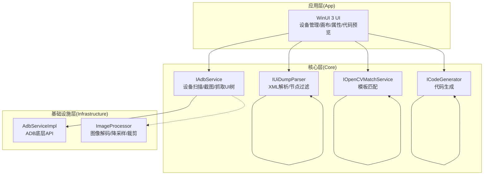
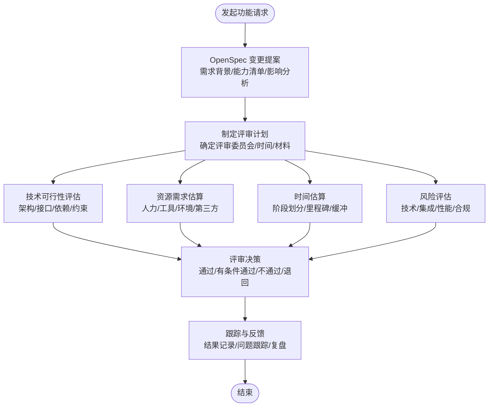
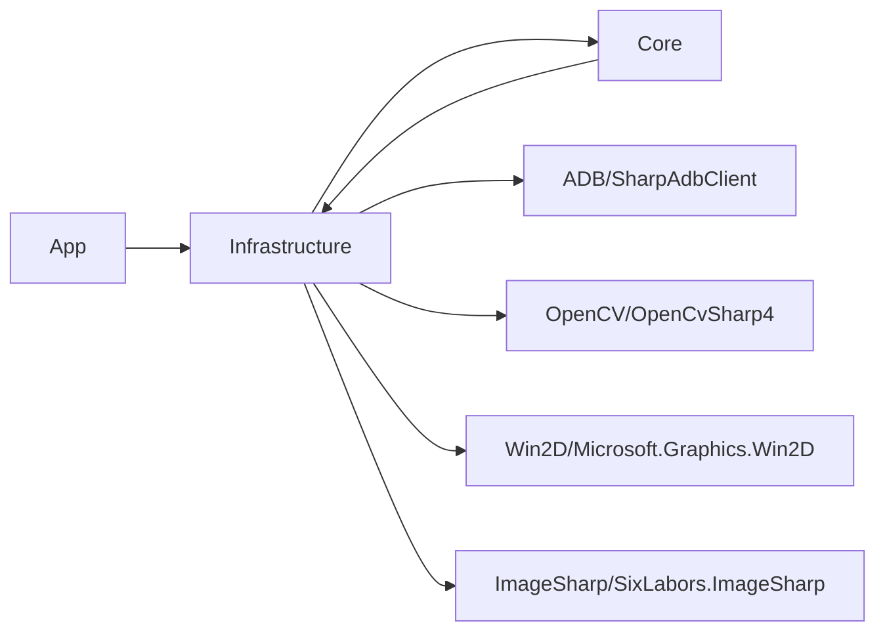

# 功能评审流程

<cite>
**本文引用的文件**
- [README.md](file://README.md)
- [README_zh_CN.md](file://README_zh_CN.md)
- [checklist.md](file://checklist.md)
- [manual.md](file://manual.md)
- [DEVELOPMENT.md](file://DEVELOPMENT.md)
- [openspec/config.yaml](file://openspec/config.yaml)
- [openspec/changes/winui3-visual-dev-toolkit/proposal.md](file://openspec/changes/winui3-visual-dev-toolkit/proposal.md)
- [openspec/changes/winui3-visual-dev-toolkit/design.md](file://openspec/changes/winui3-visual-dev-toolkit/design.md)
- [openspec/changes/winui3-visual-dev-toolkit/tasks.md](file://openspec/changes/winui3-visual-dev-toolkit/tasks.md)
- [openspec/changes/winui3-visual-dev-toolkit/specs/autojs6-code-generator/spec.md](file://openspec/changes/winui3-visual-dev-toolkit/specs/autojs6-code-generator/spec.md)
- [App/Services/LogService.cs](file://App/Services/LogService.cs)
- [Core/Services/AutoJS6CodeGenerator.cs](file://Core/Services/AutoJS6CodeGenerator.cs)
- [Core/Services/UiDumpParser.cs](file://Core/Services/UiDumpParser.cs)
- [Infrastructure/Adb/AdbServiceImpl.cs](file://Infrastructure/Adb/AdbServiceImpl.cs)
- [Infrastructure/Imaging/ImageProcessor.cs](file://Infrastructure/Imaging/ImageProcessor.cs)
</cite>

## 目录
1. [引言](#引言)
2. [项目结构](#项目结构)
3. [核心组件](#核心组件)
4. [架构总览](#架构总览)
5. [详细组件分析](#详细组件分析)
6. [依赖分析](#依赖分析)
7. [性能考量](#性能考量)
8. [故障排查指南](#故障排查指南)
9. [结论](#结论)
10. [附录](#附录)

## 引言
本文件为 AutoJS6 开发工具的功能评审流程文档，面向功能请求的评审与决策，覆盖技术可行性、资源需求、时间估算与风险评估四个维度；明确评审委员会组成与职责分工；规范评审会议组织流程与决策机制；制定功能优先级确定与资源分配原则；建立评审结果跟踪与反馈闭环，并提供评审检查清单与评分标准，确保评审过程的客观性与一致性。

## 项目结构
AutoJS6 可视化开发工具采用分层架构与双引擎并行设计：
- 应用层（App）：WinUI 3 桌面应用，负责 UI 与 MVVM，提供设备管理、画布交互、属性面板与代码预览等功能。
- 核心层（Core）：纯业务逻辑，包含 AdbService、UiDumpParser、OpenCVMatchService、CodeGenerator 等服务接口与实现，强调可测试性与无 UI 依赖。
- 基础设施层（Infrastructure）：封装外部依赖，如 ADB 通信与图像处理，隔离技术细节。

图表来源
- [README.md:230-280](file://README.md#L230-L280)
- [openspec/changes/winui3-visual-dev-toolkit/design.md:120-130](file://openspec/changes/winui3-visual-dev-toolkit/design.md#L120-L130)

章节来源
- [README.md:230-280](file://README.md#L230-L280)
- [openspec/changes/winui3-visual-dev-toolkit/design.md:120-130](file://openspec/changes/winui3-visual-dev-toolkit/design.md#L120-L130)

## 核心组件
- 日志服务（LogService）：统一日志入口，支持 UI 订阅与调试输出，便于评审期间问题定位与追踪。
- 代码生成器（AutoJS6CodeGenerator）：严格遵循 AutoJS6 API 约束，生成图像模式与控件模式代码，支持重试、超时、路径兼容与格式化。
- UI 树解析器（UiDumpParser）：解析 uiautomator dump，过滤布局容器，构建控件树，支持坐标映射与选择器生成。
- ADB 服务（AdbServiceImpl）：基于 AdvancedSharpAdbClient 底层 API，提供设备扫描、截图拉取、UI 树抓取与网络连接。
- 图像处理器（ImageProcessor）：提供 PNG 解码、降采样、裁剪与元数据生成，支撑模板管理与匹配测试。

章节来源
- [App/Services/LogService.cs:1-51](file://App/Services/LogService.cs#L1-L51)
- [Core/Services/AutoJS6CodeGenerator.cs:1-357](file://Core/Services/AutoJS6CodeGenerator.cs#L1-L357)
- [Core/Services/UiDumpParser.cs:1-263](file://Core/Services/UiDumpParser.cs#L1-L263)
- [Infrastructure/Adb/AdbServiceImpl.cs:1-238](file://Infrastructure/Adb/AdbServiceImpl.cs#L1-L238)
- [Infrastructure/Imaging/ImageProcessor.cs:1-162](file://Infrastructure/Imaging/ImageProcessor.cs#L1-L162)

## 架构总览
评审流程围绕“变更提案—技术评估—资源与时间估算—风险评估—决策—跟踪反馈”闭环展开，结合现有 OpenSpec 变更管理与发布验证体系，确保评审结果可追溯、可执行、可复盘。

图表来源
- [openspec/config.yaml:1-21](file://openspec/config.yaml#L1-L21)
- [openspec/changes/winui3-visual-dev-toolkit/proposal.md:1-70](file://openspec/changes/winui3-visual-dev-toolkit/proposal.md#L1-L70)
- [openspec/changes/winui3-visual-dev-toolkit/tasks.md:1-260](file://openspec/changes/winui3-visual-dev-toolkit/tasks.md#L1-L260)

## 详细组件分析

### 评审委员会组成与职责分工
- 技术负责人（架构与实现）：负责技术可行性评估、接口设计一致性、核心组件复用与约束遵循（如 AutoJS6 API 约束、Rhino 引擎限制、OOM 预防）。
- 产品经理（需求与收益）：负责需求背景、用户价值、竞品对标、收益量化与优先级排序。
- 开发团队代表（实现与交付）：负责资源需求、时间估算、依赖与集成点、CI/CD 与发布链路、质量基线与回归风险。
- 质量保障代表（测试与验收）：负责测试策略、验收标准、回归风险与发布验证清单（如 checklist.md）。

章节来源
- [checklist.md:1-186](file://checklist.md#L1-L186)
- [manual.md:1-522](file://manual.md#L1-L522)
- [DEVELOPMENT.md:1-276](file://DEVELOPMENT.md#L1-L276)

### 评审会议组织流程与决策机制
- 会前准备：评审委员会审阅 OpenSpec 提案、设计文档与任务分解，准备评估材料与问题清单。
- 会议流程：
  - 需求陈述与背景介绍（产品经理）
  - 技术方案与架构评审（技术负责人）
  - 资源与时间估算（开发团队代表）
  - 风险与合规评估（全体）
  - 交叉提问与澄清
  - 评审决策与决议
- 决策机制：采用“通过/有条件通过/不通过/退回”四分类；有条件通过需明确问题清单与关闭条件；退回需明确补充材料与重评时限。

章节来源
- [openspec/changes/winui3-visual-dev-toolkit/proposal.md:1-70](file://openspec/changes/winui3-visual-dev-toolkit/proposal.md#L1-L70)
- [openspec/changes/winui3-visual-dev-toolkit/design.md:131-153](file://openspec/changes/winui3-visual-dev-toolkit/design.md#L131-L153)
- [openspec/changes/winui3-visual-dev-toolkit/tasks.md:1-260](file://openspec/changes/winui3-visual-dev-toolkit/tasks.md#L1-L260)

### 功能优先级确定与资源分配原则
- 优先级确定方法：
  - 价值权重：用户收益、效率提升、问题缓解程度
  - 技术权重：实现难度、依赖复杂度、与现有能力耦合度
  - 资源权重：所需人员、工具、时间与预算
  - 风险权重：技术风险、集成风险、合规风险
- 资源分配原则：
  - 优先保障核心闭环（截图/匹配/代码生成/UI 树解析）
  - 与现有 OpenSpec 任务分解对齐，避免重复与割裂
  - CI/CD 与发布验证前置，降低后期返工风险

章节来源
- [openspec/changes/winui3-visual-dev-toolkit/tasks.md:1-260](file://openspec/changes/winui3-visual-dev-toolkit/tasks.md#L1-L260)
- [manual.md:430-445](file://manual.md#L430-L445)

### 评审结果跟踪与反馈机制
- 结果记录：在评审决议中明确结论、阻塞问题、责任人与关闭时限。
- 问题跟踪：建立问题清单与跟踪表，定期复盘与更新状态。
- 发布验证：结合 checklist.md 与 manual.md 的验证流程，确保评审通过的功能在发布前得到充分验证。
- 复盘改进：对评审偏差与执行偏差进行复盘，优化评审标准与流程。

章节来源
- [checklist.md:156-186](file://checklist.md#L156-L186)
- [manual.md:430-522](file://manual.md#L430-L522)

### 评审检查清单与评分标准
- 技术可行性（权重：30%）
  - 是否遵循 AutoJS6 API 约束（如 Rhino 引擎限制、图像识别 OOM 预防）
  - 是否与现有核心组件（代码生成器、UI 解析器、ADB 服务、图像处理）兼容
  - 是否满足异步架构与 60FPS 渲染要求
- 资源需求（权重：25%）
  - 人员：开发、测试、文档与运维
  - 工具：开发环境、测试设备、CI/CD 与打包工具
  - 时间：需求分析、设计、实现、测试、发布验证
- 时间估算（权重：20%）
  - 分阶段里程碑与缓冲系数
  - 关键路径与依赖关系
- 风险评估（权重：25%）
  - 技术风险：算法稳定性、性能瓶颈、兼容性
  - 集成风险：模块间耦合、接口变更、第三方依赖
  - 发布风险：CI/CD 链路、证书与签名、用户接受度

章节来源
- [README.md:342-374](file://README.md#L342-L374)
- [openspec/changes/winui3-visual-dev-toolkit/design.md:131-153](file://openspec/changes/winui3-visual-dev-toolkit/design.md#L131-L153)
- [checklist.md:146-153](file://checklist.md#L146-L153)

## 依赖分析
评审需关注以下关键依赖与耦合关系：
- 双引擎独立：图像引擎与 UI 引擎严格解耦，避免数据与处理路径耦合。
- 单向依赖：App → Infrastructure → Core ← Infrastructure，Core 为纯业务逻辑。
- 外部依赖：ADB、OpenCV、Win2D、ImageSharp 等第三方库与工具链。
- 发布链路：GitHub Actions 工作流与本地打包脚本，需与功能变更保持一致。

图表来源
- [README.md:272-280](file://README.md#L272-L280)
- [openspec/changes/winui3-visual-dev-toolkit/design.md:30-35](file://openspec/changes/winui3-visual-dev-toolkit/design.md#L30-L35)

章节来源
- [README.md:272-280](file://README.md#L272-L280)
- [openspec/changes/winui3-visual-dev-toolkit/design.md:30-35](file://openspec/changes/winui3-visual-dev-toolkit/design.md#L30-L35)

## 性能考量
- 渲染性能：Win2D 双图层渲染、CanvasBitmap 缓存池、阈值滑动仅重绘匹配层。
- 计算性能：OpenCV 模板匹配后台线程计算、ADB 操作异步化、UI 树解析容错与虚拟化。
- 内存与稳定性：模板图像及时回收、降采样与区域限制、连续操作稳定性验证。

章节来源
- [openspec/changes/winui3-visual-dev-toolkit/design.md:64-119](file://openspec/changes/winui3-visual-dev-toolkit/design.md#L64-L119)
- [checklist.md:88-95](file://checklist.md#L88-L95)

## 故障排查指南
- 日志定位：通过 LogService 统一输出日志，订阅 UI 实时查看；异常捕获与 Toast 提示。
- ADB 连接：检查 ADB 服务器状态、设备在线状态、TCP/IP 连接与配对码。
- 匹配与解析：验证阈值范围、模板路径与区域参数、UI 树解析容错与坐标映射。
- 发布链路：对照 manual.md 的 Actions 验证步骤，逐项检查打包与上传链路。

章节来源
- [App/Services/LogService.cs:1-51](file://App/Services/LogService.cs#L1-L51)
- [Infrastructure/Adb/AdbServiceImpl.cs:33-49](file://Infrastructure/Adb/AdbServiceImpl.cs#L33-L49)
- [manual.md:330-407](file://manual.md#L330-L407)

## 结论
本评审流程以 OpenSpec 变更管理为基础，结合现有架构与发布验证体系，形成“需求—技术—资源—风险—决策—跟踪”的闭环。通过明确评审委员会职责、标准化评审流程与决策机制、建立优先级与资源分配原则以及跟踪反馈机制，确保功能评审的客观性、一致性与可执行性，为 AutoJS6 开发工具的持续演进提供稳定支撑。

## 附录

### 评审检查清单（示例）
- 需求与背景
  - 是否明确用户痛点与收益？
  - 是否与现有能力互补而非重复？
- 技术可行性
  - 是否遵循 AutoJS6 API 约束？
  - 是否与现有核心组件兼容？
  - 是否满足异步与性能要求？
- 资源与时间
  - 人员、工具、时间是否明确？
  - 是否与现有任务分解对齐？
- 风险评估
  - 技术、集成、合规风险是否识别并有缓解措施？
- 决策与跟踪
  - 是否形成明确结论与问题清单？
  - 是否建立跟踪与复盘机制？

章节来源
- [openspec/changes/winui3-visual-dev-toolkit/specs/autojs6-code-generator/spec.md:1-136](file://openspec/changes/winui3-visual-dev-toolkit/specs/autojs6-code-generator/spec.md#L1-L136)
- [README.md:342-374](file://README.md#L342-L374)