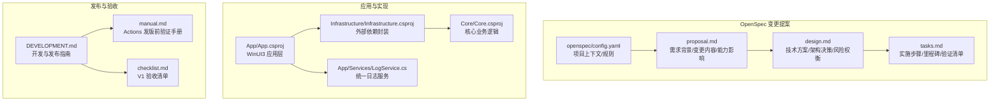
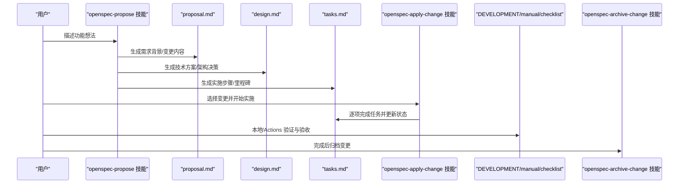
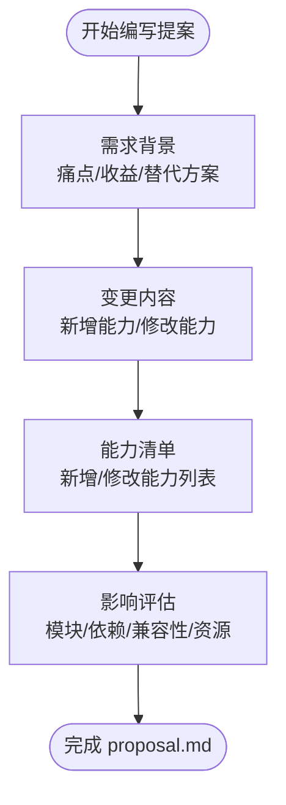
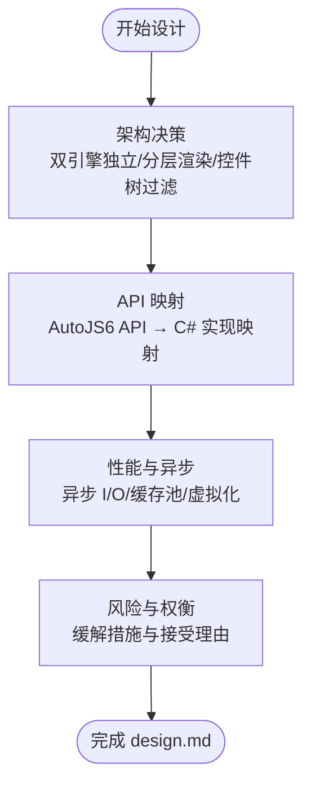
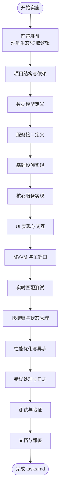
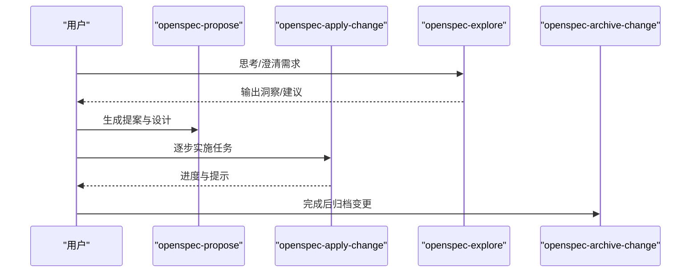
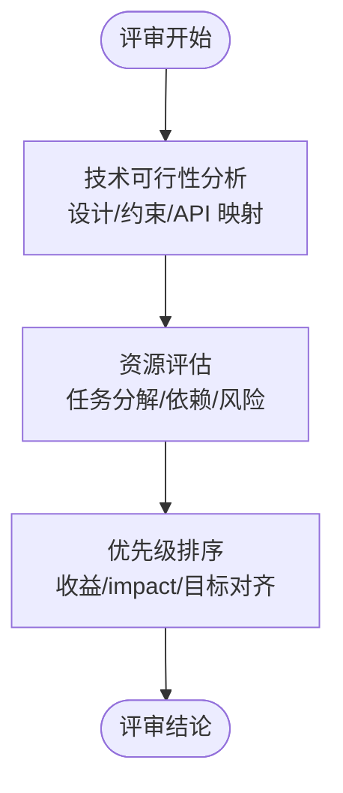
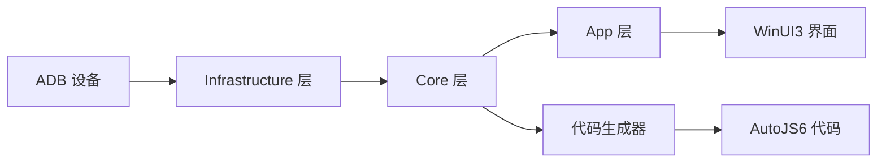
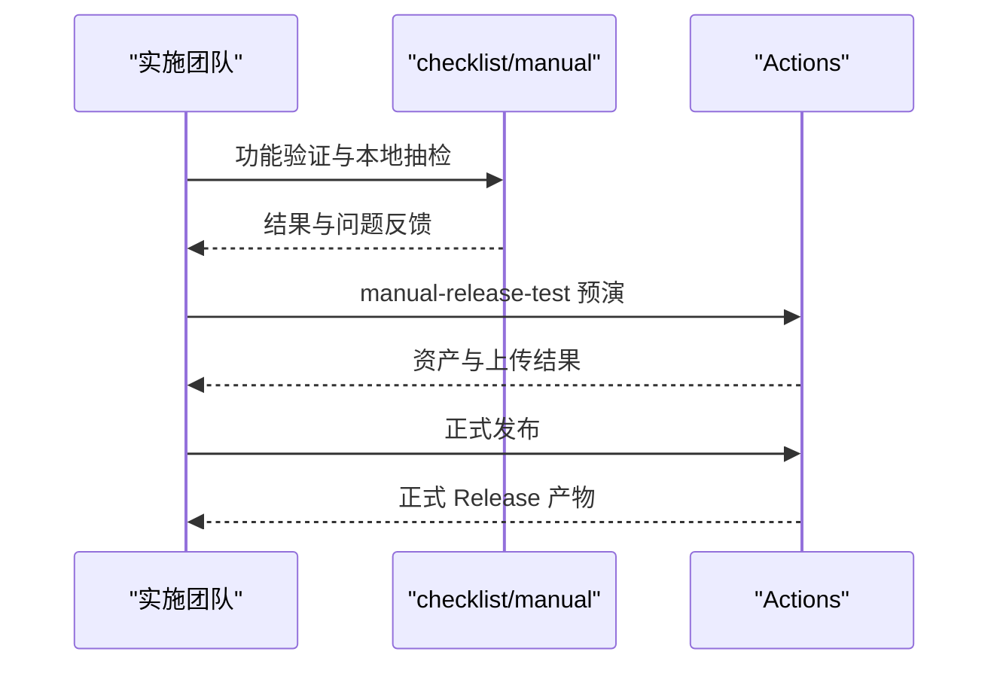
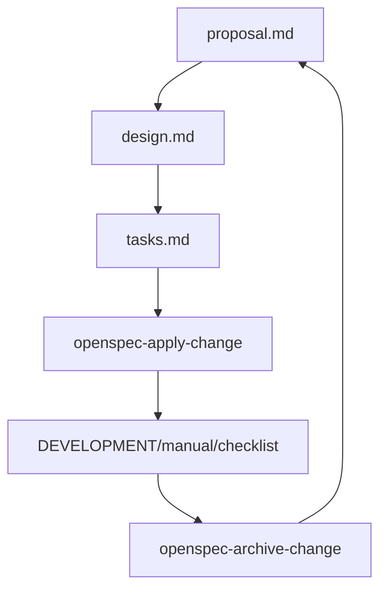

# 功能请求流程

<cite>
**本文引用的文件**
- [README.md](file://README.md)
- [DEVELOPMENT.md](file://DEVELOPMENT.md)
- [checklist.md](file://checklist.md)
- [manual.md](file://manual.md)
- [openspec/config.yaml](file://openspec/config.yaml)
- [openspec/changes/winui3-visual-dev-toolkit/proposal.md](file://openspec/changes/winui3-visual-dev-toolkit/proposal.md)
- [openspec/changes/winui3-visual-dev-toolkit/design.md](file://openspec/changes/winui3-visual-dev-toolkit/design.md)
- [openspec/changes/winui3-visual-dev-toolkit/tasks.md](file://openspec/changes/winui3-visual-dev-toolkit/tasks.md)
- [.agents/skills/openspec-propose/SKILL.md](file://.agents/skills/openspec-propose/SKILL.md)
- [.agents/skills/openspec-apply-change/SKILL.md](file://.agents/skills/openspec-apply-change/SKILL.md)
- [.agents/skills/openspec-archive-change/SKILL.md](file://.agents/skills/openspec-archive-change/SKILL.md)
- [.agents/skills/openspec-explore/SKILL.md](file://.agents/skills/openspec-explore/SKILL.md)
- [App/App.csproj](file://App/App.csproj)
- [Core/Core.csproj](file://Core/Core.csproj)
- [Infrastructure/Infrastructure.csproj](file://Infrastructure/Infrastructure.csproj)
- [App/Services/LogService.cs](file://App/Services/LogService.cs)
</cite>

## 目录
1. [简介](#简介)
2. [项目结构](#项目结构)
3. [核心组件](#核心组件)
4. [架构总览](#架构总览)
5. [详细组件分析](#详细组件分析)
6. [依赖分析](#依赖分析)
7. [性能考量](#性能考量)
8. [故障排查指南](#故障排查指南)
9. [结论](#结论)
10. [附录](#附录)

## 简介
本文件面向 AutoJS6 开发工具的“功能请求流程”，系统化梳理从 OpenSpec 变更提案到实现、评审、验收与归档的全流程规范。文档结合仓库中的 OpenSpec 变更提案样例与技能说明，给出可操作的编写模板、评审要点、设计指南、跟踪与验收方法、向后兼容与迁移策略，以及状态管理与进度跟踪方法。

## 项目结构
AutoJS6 开发工具采用分层架构与可视化工作流，核心围绕“OpenSpec 变更提案”与“发布与验收流程”两条主线组织：
- OpenSpec 变更提案位于 openspec/changes/<变更名>/，包含 proposal.md、design.md、tasks.md 等标准化文档。
- 发布与验收流程由 DEVELOPMENT.md、manual.md、checklist.md 提供，覆盖本地验证、CI 预演、正式发布与回退策略。
- 应用层 App、核心层 Core、基础设施层 Infrastructure 三者职责清晰，依赖方向明确。

**图表来源**
- [openspec/changes/winui3-visual-dev-toolkit/proposal.md:1-70](file://openspec/changes/winui3-visual-dev-toolkit/proposal.md#L1-L70)
- [openspec/changes/winui3-visual-dev-toolkit/design.md:1-153](file://openspec/changes/winui3-visual-dev-toolkit/design.md#L1-L153)
- [openspec/changes/winui3-visual-dev-toolkit/tasks.md:1-260](file://openspec/changes/winui3-visual-dev-toolkit/tasks.md#L1-L260)
- [openspec/config.yaml:1-21](file://openspec/config.yaml#L1-L21)
- [App/App.csproj:1-84](file://App/App.csproj#L1-L84)
- [Core/Core.csproj:1-10](file://Core/Core.csproj#L1-L10)
- [Infrastructure/Infrastructure.csproj:1-19](file://Infrastructure/Infrastructure.csproj#L1-L19)
- [App/Services/LogService.cs:1-51](file://App/Services/LogService.cs#L1-L51)
- [DEVELOPMENT.md:1-276](file://DEVELOPMENT.md#L1-L276)
- [manual.md:1-522](file://manual.md#L1-L522)
- [checklist.md:1-186](file://checklist.md#L1-L186)

**章节来源**
- [README.md:230-260](file://README.md#L230-L260)
- [openspec/config.yaml:1-21](file://openspec/config.yaml#L1-L21)
- [App/App.csproj:1-84](file://App/App.csproj#L1-L84)
- [Core/Core.csproj:1-10](file://Core/Core.csproj#L1-L10)
- [Infrastructure/Infrastructure.csproj:1-19](file://Infrastructure/Infrastructure.csproj#L1-L19)

## 核心组件
- OpenSpec 变更提案三件套：需求背景（Why）、技术方案（How）、实施任务（Tasks）。三者共同构成评审与实施的依据。
- 技能体系：openspec-propose、openspec-apply-change、openspec-archive-change、openspec-explore 四类技能分别覆盖“提出—实施—归档—探索”的闭环。
- 发布与验收：DEVELOPMENT.md 提供开发与发布路径；manual.md 提供 Actions 验证手册；checklist.md 提供 V1 验收清单。

**章节来源**
- [.agents/skills/openspec-propose/SKILL.md:1-111](file://.agents/skills/openspec-propose/SKILL.md#L1-L111)
- [.agents/skills/openspec-apply-change/SKILL.md:1-157](file://.agents/skills/openspec-apply-change/SKILL.md#L1-L157)
- [.agents/skills/openspec-archive-change/SKILL.md:1-115](file://.agents/skills/openspec-archive-change/SKILL.md#L1-L115)
- [.agents/skills/openspec-explore/SKILL.md:1-289](file://.agents/skills/openspec-explore/SKILL.md#L1-L289)
- [DEVELOPMENT.md:1-276](file://DEVELOPMENT.md#L1-L276)
- [manual.md:1-522](file://manual.md#L1-L522)
- [checklist.md:1-186](file://checklist.md#L1-L186)

## 架构总览
OpenSpec 变更提案与发布流程的总体交互如下：

**图表来源**
- [.agents/skills/openspec-propose/SKILL.md:25-86](file://.agents/skills/openspec-propose/SKILL.md#L25-L86)
- [.agents/skills/openspec-apply-change/SKILL.md:35-89](file://.agents/skills/openspec-apply-change/SKILL.md#L35-L89)
- [.agents/skills/openspec-archive-change/SKILL.md:68-83](file://.agents/skills/openspec-archive-change/SKILL.md#L68-L83)
- [DEVELOPMENT.md:1-276](file://DEVELOPMENT.md#L1-L276)
- [manual.md:1-522](file://manual.md#L1-L522)
- [checklist.md:1-186](file://checklist.md#L1-L186)

## 详细组件分析

### OpenSpec 变更提案编写规范与标准模板
- 需求背景（Why）：说明痛点、收益项目、替代方案与必要性，体现对现有工作流的改进价值。
- 技术方案（How）：明确新增/修改的能力、模块划分、依赖与约束、API/数据模型映射、冲突处理原则。
- 影响评估（Impact）：列出新增/修改的模块、依赖、兼容性要求与参考资源，形成可追踪的实施清单。

**图表来源**
- [openspec/changes/winui3-visual-dev-toolkit/proposal.md:1-70](file://openspec/changes/winui3-visual-dev-toolkit/proposal.md#L1-L70)

**章节来源**
- [openspec/changes/winui3-visual-dev-toolkit/proposal.md:1-70](file://openspec/changes/winui3-visual-dev-toolkit/proposal.md#L1-L70)

### 技术方案与设计文档（design.md）
- 设计文档用于沉淀技术方案与架构决策，包括双引擎独立架构、分层渲染管线、控件树过滤规则、坐标系对齐策略、双路径代码生成参数映射、异步架构与内存优化、项目层依赖关系等。
- 风险与权衡：针对 ADB 连接不稳定、OpenCV 误报/漏报、控件树解析失败、渲染性能不足、生成代码一致性等风险提出缓解措施。

**图表来源**
- [openspec/changes/winui3-visual-dev-toolkit/design.md:51-153](file://openspec/changes/winui3-visual-dev-toolkit/design.md#L51-L153)

**章节来源**
- [openspec/changes/winui3-visual-dev-toolkit/design.md:1-153](file://openspec/changes/winui3-visual-dev-toolkit/design.md#L1-L153)

### 实施任务与里程碑（tasks.md）
- 任务清单覆盖前置准备、项目结构与依赖配置、数据模型与服务接口、基础设施实现、核心服务实现、UI 实现、交互与联动、MVVM 与主窗口、实时匹配测试、全局快捷键与状态管理、性能优化与异步架构、错误处理与日志、测试与验证、文档与部署等。
- 任务以“完成/未完成”状态跟踪，便于评审与进度管理。

**图表来源**
- [openspec/changes/winui3-visual-dev-toolkit/tasks.md:1-260](file://openspec/changes/winui3-visual-dev-toolkit/tasks.md#L1-L260)

**章节来源**
- [openspec/changes/winui3-visual-dev-toolkit/tasks.md:1-260](file://openspec/changes/winui3-visual-dev-toolkit/tasks.md#L1-L260)

### OpenSpec 技能与工作流
- openspec-propose：一次性生成 proposal、design、tasks，便于快速落地。
- openspec-apply-change：按任务逐步实施，动态提示当前状态与剩余任务。
- openspec-archive-change：完成实施后归档变更，支持 delta 规范同步。
- openspec-explore：在提出/实施前进行探索与澄清，不直接编码。

**图表来源**
- [.agents/skills/openspec-propose/SKILL.md:25-86](file://.agents/skills/openspec-propose/SKILL.md#L25-L86)
- [.agents/skills/openspec-apply-change/SKILL.md:35-89](file://.agents/skills/openspec-apply-change/SKILL.md#L35-L89)
- [.agents/skills/openspec-archive-change/SKILL.md:68-83](file://.agents/skills/openspec-archive-change/SKILL.md#L68-L83)
- [.agents/skills/openspec-explore/SKILL.md:105-131](file://.agents/skills/openspec-explore/SKILL.md#L105-L131)

**章节来源**
- [.agents/skills/openspec-propose/SKILL.md:1-111](file://.agents/skills/openspec-propose/SKILL.md#L1-L111)
- [.agents/skills/openspec-apply-change/SKILL.md:1-157](file://.agents/skills/openspec-apply-change/SKILL.md#L1-L157)
- [.agents/skills/openspec-archive-change/SKILL.md:1-115](file://.agents/skills/openspec-archive-change/SKILL.md#L1-L115)
- [.agents/skills/openspec-explore/SKILL.md:1-289](file://.agents/skills/openspec-explore/SKILL.md#L1-L289)

### 功能请求评审流程
- 技术可行性分析：基于 design.md 的架构决策与 API 映射，确认实现路径与约束。
- 资源评估：基于 tasks.md 的任务分解与依赖，估算工时与风险。
- 优先级排序：结合 proposal.md 的收益与 impact，与项目整体目标对齐。

**图表来源**
- [openspec/changes/winui3-visual-dev-toolkit/proposal.md:1-70](file://openspec/changes/winui3-visual-dev-toolkit/proposal.md#L1-L70)
- [openspec/changes/winui3-visual-dev-toolkit/design.md:51-153](file://openspec/changes/winui3-visual-dev-toolkit/design.md#L51-L153)
- [openspec/changes/winui3-visual-dev-toolkit/tasks.md:1-260](file://openspec/changes/winui3-visual-dev-toolkit/tasks.md#L1-L260)

**章节来源**
- [openspec/changes/winui3-visual-dev-toolkit/proposal.md:1-70](file://openspec/changes/winui3-visual-dev-toolkit/proposal.md#L1-L70)
- [openspec/changes/winui3-visual-dev-toolkit/design.md:1-153](file://openspec/changes/winui3-visual-dev-toolkit/design.md#L1-L153)
- [openspec/changes/winui3-visual-dev-toolkit/tasks.md:1-260](file://openspec/changes/winui3-visual-dev-toolkit/tasks.md#L1-L260)

### 功能设计文档编写指南
- 用例设计：从用户视角描述主流程与异常流程，结合 checklist.md 的 P0/P1 项与 manual.md 的 Actions 验证点。
- 接口定义：基于 design.md 的服务接口与数据模型，确保 Core 层无 UI 依赖、Infrastructure 层封装外部依赖。
- 数据流图：结合 App/Infrastructure/Core 的三层依赖，展示从 ADB/UI Dump/OpenCV 到 UI 渲染与代码生成的数据通路。

**图表来源**
- [openspec/changes/winui3-visual-dev-toolkit/design.md:120-129](file://openspec/changes/winui3-visual-dev-toolkit/design.md#L120-L129)
- [App/App.csproj:67-68](file://App/App.csproj#L67-L68)
- [Infrastructure/Infrastructure.csproj:9-11](file://Infrastructure/Infrastructure.csproj#L9-L11)
- [Core/Core.csproj:1-10](file://Core/Core.csproj#L1-L10)

**章节来源**
- [openspec/changes/winui3-visual-dev-toolkit/design.md:1-153](file://openspec/changes/winui3-visual-dev-toolkit/design.md#L1-L153)
- [App/App.csproj:1-84](file://App/App.csproj#L1-L84)
- [Infrastructure/Infrastructure.csproj:1-19](file://Infrastructure/Infrastructure.csproj#L1-L19)
- [Core/Core.csproj:1-10](file://Core/Core.csproj#L1-L10)

### 实现跟踪与验收标准
- 实现跟踪：通过 tasks.md 的任务状态与 openspec-apply-change 的动态提示，持续更新进度。
- 验收标准：
  - checklist.md 的 P0 必过项与 P1 建议通过项；
  - manual.md 的 Actions 验证手册，包括 dry-run 与 prerelease 预演；
  - DEVELOPMENT.md 的本地验证顺序与生产发布流程。

**图表来源**
- [checklist.md:29-186](file://checklist.md#L29-L186)
- [manual.md:111-327](file://manual.md#L111-L327)
- [DEVELOPMENT.md:135-162](file://DEVELOPMENT.md#L135-L162)

**章节来源**
- [checklist.md:1-186](file://checklist.md#L1-L186)
- [manual.md:1-522](file://manual.md#L1-L522)
- [DEVELOPMENT.md:1-276](file://DEVELOPMENT.md#L1-L276)

### 向后兼容性考虑与迁移策略
- API 约束优先：以 AutoJS6 源码与官方文档为准，确保代码生成与坐标计算符合技术边界（如 Rhino 引擎限制、图像对象回收规则、坐标系统约定）。
- 迁移策略：复用现有 cmd 脚本的核心业务逻辑与算法流程，确保生成代码与现有工作流一致；对不兼容的 API 调整以设计文档为准。

**章节来源**
- [openspec/changes/winui3-visual-dev-toolkit/proposal.md:38-70](file://openspec/changes/winui3-visual-dev-toolkit/proposal.md#L38-L70)
- [openspec/changes/winui3-visual-dev-toolkit/design.md:16-28](file://openspec/changes/winui3-visual-dev-toolkit/design.md#L16-L28)

### 状态管理与进度跟踪方法
- OpenSpec 技能：通过 openspec-apply-change 的 apply 指令动态获取当前状态、剩余任务与进度提示。
- 任务状态：在 tasks.md 中以勾选形式记录完成情况，便于评审与回顾。
- 日志与可观测性：App 层统一日志服务，便于问题定位与进度追踪。

**图表来源**
- [.agents/skills/openspec-apply-change/SKILL.md:59-66](file://.agents/skills/openspec-apply-change/SKILL.md#L59-L66)
- [App/Services/LogService.cs:1-51](file://App/Services/LogService.cs#L1-L51)

**章节来源**
- [.agents/skills/openspec-apply-change/SKILL.md:1-157](file://.agents/skills/openspec-apply-change/SKILL.md#L1-L157)
- [App/Services/LogService.cs:1-51](file://App/Services/LogService.cs#L1-L51)

## 依赖分析
OpenSpec 变更提案与发布流程的依赖关系如下：

**图表来源**
- [openspec/changes/winui3-visual-dev-toolkit/proposal.md:1-70](file://openspec/changes/winui3-visual-dev-toolkit/proposal.md#L1-L70)
- [openspec/changes/winui3-visual-dev-toolkit/design.md:1-153](file://openspec/changes/winui3-visual-dev-toolkit/design.md#L1-L153)
- [openspec/changes/winui3-visual-dev-toolkit/tasks.md:1-260](file://openspec/changes/winui3-visual-dev-toolkit/tasks.md#L1-L260)
- [.agents/skills/openspec-apply-change/SKILL.md:35-89](file://.agents/skills/openspec-apply-change/SKILL.md#L35-L89)
- [DEVELOPMENT.md:1-276](file://DEVELOPMENT.md#L1-L276)
- [manual.md:1-522](file://manual.md#L1-L522)
- [checklist.md:1-186](file://checklist.md#L1-L186)
- [.agents/skills/openspec-archive-change/SKILL.md:68-83](file://.agents/skills/openspec-archive-change/SKILL.md#L68-L83)

**章节来源**
- [openspec/changes/winui3-visual-dev-toolkit/proposal.md:1-70](file://openspec/changes/winui3-visual-dev-toolkit/proposal.md#L1-L70)
- [openspec/changes/winui3-visual-dev-toolkit/design.md:1-153](file://openspec/changes/winui3-visual-dev-toolkit/design.md#L1-L153)
- [openspec/changes/winui3-visual-dev-toolkit/tasks.md:1-260](file://openspec/changes/winui3-visual-dev-toolkit/tasks.md#L1-L260)
- [.agents/skills/openspec-apply-change/SKILL.md:1-157](file://.agents/skills/openspec-apply-change/SKILL.md#L1-L157)
- [DEVELOPMENT.md:1-276](file://DEVELOPMENT.md#L1-L276)
- [manual.md:1-522](file://manual.md#L1-L522)
- [checklist.md:1-186](file://checklist.md#L1-L186)
- [.agents/skills/openspec-archive-change/SKILL.md:1-115](file://.agents/skills/openspec-archive-change/SKILL.md#L1-L115)

## 性能考量
- 异步架构与非阻塞 UI：所有 I/O 操作（ADB、OpenCV、XML 解析、纹理上传）采用 async/await，避免 UI 线程阻塞。
- 渲染性能：Win2D 分层渲染（图像层 + 叠加层），仅重绘变化图层，确保 60FPS。
- 内存优化：CanvasBitmap 缓存池、图像降采样、模板导出元数据记录，降低内存压力。
- 控件树解析：布局容器过滤规则减少冗余节点，提升 TreeView 渲染与交互性能。

**章节来源**
- [openspec/changes/winui3-visual-dev-toolkit/design.md:64-119](file://openspec/changes/winui3-visual-dev-toolkit/design.md#L64-L119)
- [openspec/changes/winui3-visual-dev-toolkit/tasks.md:124-153](file://openspec/changes/winui3-visual-dev-toolkit/tasks.md#L124-L153)

## 故障排查指南
- 发布前验证：
  - 先过功能验证（checklist.md），再验 Actions（manual.md）。
  - 两次 manual-release-test：先 dry-run，再 prerelease 预演。
- 常见失败点：
  - release metadata 校验失败：检查 .release-please-manifest.json 与 release-please-config.json。
  - 打包脚本失败：检查 Set-AppReleaseMetadata.ps1、Package.appxmanifest、app.manifest。
  - Portable/Installer/MSIX 失败：检查 dotnet publish、Inno Setup、MSBuild 与签名工具。
- 生产发布回退：
  - 若发布页缺少文件，优先修复现有 Release，避免版本号污染。
  - 若发布包不可用，采用“前向修复 + 补丁版本”策略，不重写已发布标签。

**章节来源**
- [manual.md:332-406](file://manual.md#L332-L406)
- [DEVELOPMENT.md:182-241](file://DEVELOPMENT.md#L182-L241)

## 结论
通过 OpenSpec 变更提案的标准化文档与技能工作流，结合 DEVELOPMENT/manual/checklist 的发布与验收体系，AutoJS6 开发工具实现了从需求到交付的闭环管理。建议在实施过程中始终以 design.md 的约束为先，以 tasks.md 的任务为纲，以 checklist/manual 为尺，确保质量与一致性。

## 附录
- OpenSpec 项目上下文与规则：在 openspec/config.yaml 中集中配置，便于 AI 与人类作者在生成文档时遵循统一约束。
- 三层依赖关系：App → Infrastructure → Core，Core 为纯业务逻辑，便于测试与维护。

**章节来源**
- [openspec/config.yaml:1-21](file://openspec/config.yaml#L1-L21)
- [App/App.csproj:67-68](file://App/App.csproj#L67-L68)
- [Infrastructure/Infrastructure.csproj:9-11](file://Infrastructure/Infrastructure.csproj#L9-L11)
- [Core/Core.csproj:1-10](file://Core/Core.csproj#L1-L10)