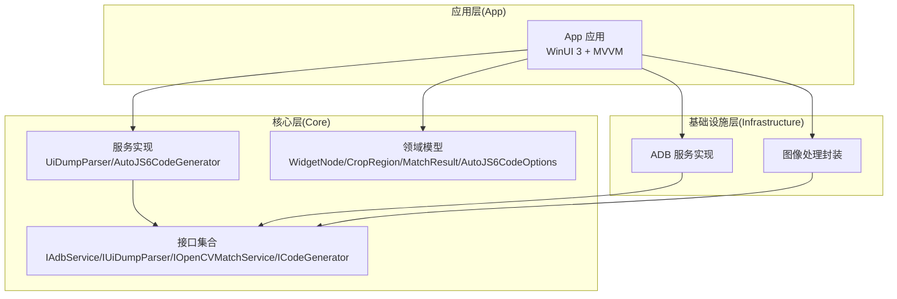
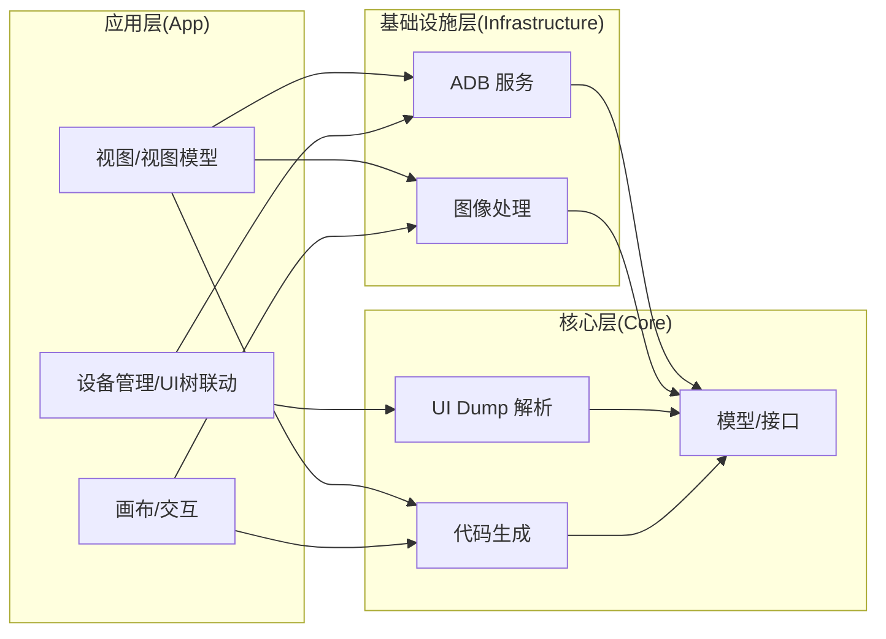
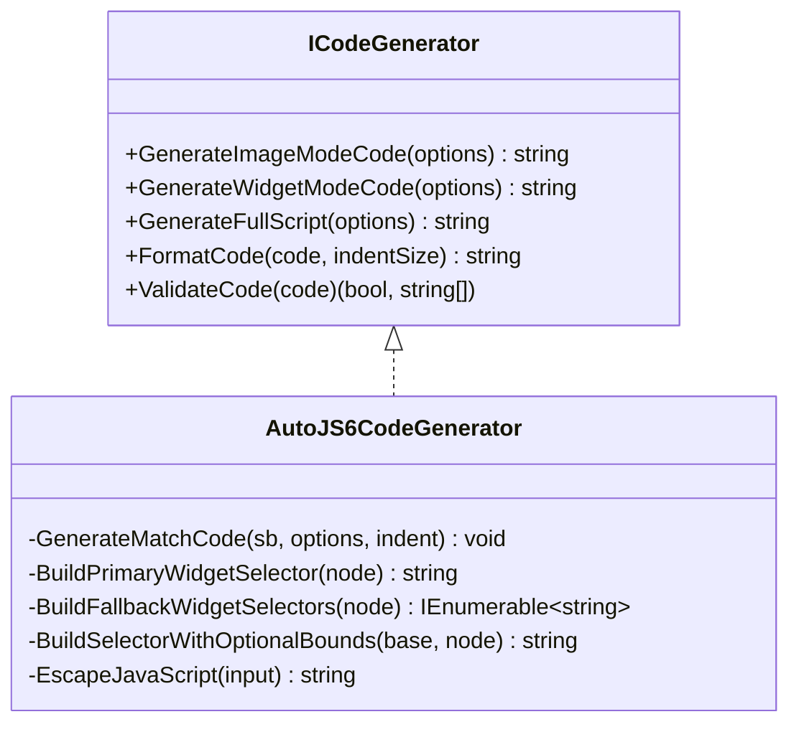
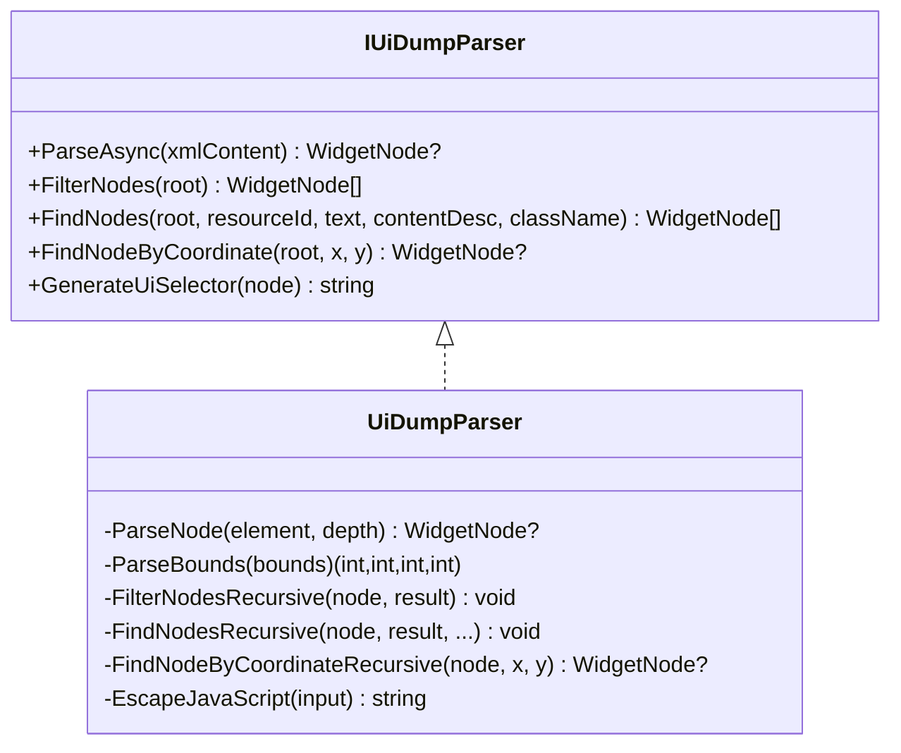
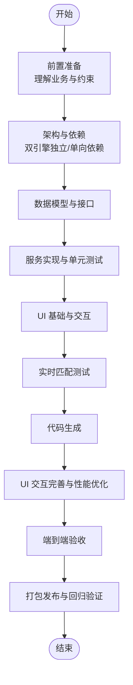
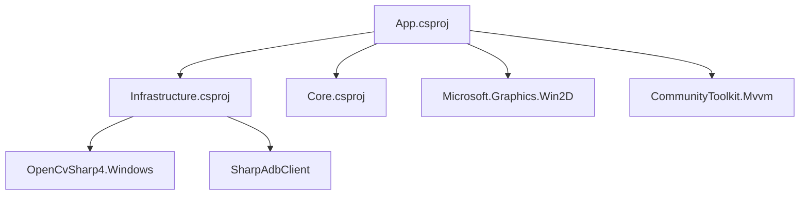

# 实现跟踪与验收

<cite>
**本文引用的文件**
- [README.md](file://README.md)
- [DEVELOPMENT.md](file://DEVELOPMENT.md)
- [checklist.md](file://checklist.md)
- [manual.md](file://manual.md)
- [openspec/config.yaml](file://openspec/config.yaml)
- [openspec/changes/winui3-visual-dev-toolkit/proposal.md](file://openspec/changes/winui3-visual-dev-toolkit/proposal.md)
- [openspec/changes/winui3-visual-dev-toolkit/tasks.md](file://openspec/changes/winui3-visual-dev-toolkit/tasks.md)
- [openspec/changes/winui3-visual-dev-toolkit/design.md](file://openspec/changes/winui3-visual-dev-toolkit/design.md)
- [App/App.csproj](file://App/App.csproj)
- [Core/Core.csproj](file://Core/Core.csproj)
- [Core.Tests/AutoJS6CodeGeneratorTests.cs](file://Core.Tests/AutoJS6CodeGeneratorTests.cs)
- [Core.Tests/UiDumpParserTests.cs](file://Core.Tests/UiDumpParserTests.cs)
- [Core.Tests/ImageMatchRegionCalculatorTests.cs](file://Core.Tests/ImageMatchRegionCalculatorTests.cs)
- [Core/Services/AutoJS6CodeGenerator.cs](file://Core/Services/AutoJS6CodeGenerator.cs)
- [Core/Services/UiDumpParser.cs](file://Core/Services/UiDumpParser.cs)
</cite>

## 目录
1. [引言](#引言)
2. [项目结构](#项目结构)
3. [核心组件](#核心组件)
4. [架构总览](#架构总览)
5. [详细组件分析](#详细组件分析)
6. [依赖分析](#依赖分析)
7. [性能考虑](#性能考虑)
8. [故障排查指南](#故障排查指南)
9. [结论](#结论)
10. [附录](#附录)

## 引言
本文件面向 AutoJS6 开发工具的功能实现跟踪与验收，提供从任务分解、里程碑设置、关键节点监控，到验收标准、测试要求、变更管理与版本控制策略、上线前准备与部署流程、质量保证与问题反馈渠道，以及跟踪工具使用与报告模板的全流程指导。目标是确保功能开发过程透明、可控、可追溯，并以可发布的质量交付。

## 项目结构
项目采用分层架构与功能域划分：
- App：WinUI 3 桌面应用，负责 UI 与 MVVM，引用 Infrastructure
- Core：纯业务逻辑层，无 UI 依赖，包含服务接口与实现
- Infrastructure：外部依赖适配层，封装 ADB、OpenCV 等
- Core.Tests：核心单元测试
- App.Tests：应用层测试（预留）
- openspec：OpenSpec 变更提案与任务分解
- packaging/scripts：打包与发布脚本
- docs/images：文档配套图片

图表来源
- [App/App.csproj:60-68](file://App/App.csproj#L60-L68)
- [Core/Core.csproj:1-10](file://Core/Core.csproj#L1-L10)
- [openspec/changes/winui3-visual-dev-toolkit/design.md:120-129](file://openspec/changes/winui3-visual-dev-toolkit/design.md#L120-L129)

章节来源
- [README.md:230-260](file://README.md#L230-L260)
- [openspec/changes/winui3-visual-dev-toolkit/design.md:120-129](file://openspec/changes/winui3-visual-dev-toolkit/design.md#L120-L129)

## 核心组件
- 代码生成器：支持图像模式与控件模式，生成 AutoJS6 可运行脚本，内置 Rhino 引擎约束校验与格式化
- UI Dump 解析器：解析 uiautomator dump，过滤布局容器，构建控件树，支持坐标命中查询与 UiSelector 生成
- 任务分解与设计：OpenSpec 提案、设计与任务清单明确了功能边界、技术约束与实施优先级

章节来源
- [Core/Services/AutoJS6CodeGenerator.cs:1-357](file://Core/Services/AutoJS6CodeGenerator.cs#L1-L357)
- [Core/Services/UiDumpParser.cs:1-263](file://Core/Services/UiDumpParser.cs#L1-L263)
- [openspec/changes/winui3-visual-dev-toolkit/proposal.md:16-28](file://openspec/changes/winui3-visual-dev-toolkit/proposal.md#L16-L28)
- [openspec/changes/winui3-visual-dev-toolkit/design.md:36-50](file://openspec/changes/winui3-visual-dev-toolkit/design.md#L36-L50)

## 架构总览
系统采用“双引擎独立、单向依赖”的 Clean Architecture：
- 双引擎：图像处理引擎（像素/位图）与 UI 分析引擎（控件树）完全解耦
- 依赖方向：App → Infrastructure → Core，Core 为纯业务逻辑
- 异步优先：所有 I/O 操作采用 async/await，UI 线程不阻塞

图表来源
- [README.md:264-287](file://README.md#L264-L287)
- [openspec/changes/winui3-visual-dev-toolkit/design.md:52-63](file://openspec/changes/winui3-visual-dev-toolkit/design.md#L52-L63)

## 详细组件分析

### 代码生成器（AutoJS6CodeGenerator）
- 功能要点
  - 图像模式：生成 requestScreenCapture + images.findImage + click 流水线
  - 控件模式：生成 id()/text()/desc() 降级链 + boundsInside 限定
  - 重试与超时：可选 for 循环 + sleep，可选模板回收
  - 约束校验：检测 Rhino 循环体内 const/let，格式化输出
- 关键接口与实现
  - 接口：ICodeGenerator
  - 实现：AutoJS6CodeGenerator
- 测试覆盖
  - 图像模式代码生成与模板回收
  - 控件模式降级顺序与 boundsInside 生成
  - Rhino 约束校验

图表来源
- [Core/Services/AutoJS6CodeGenerator.cs:11-19](file://Core/Services/AutoJS6CodeGenerator.cs#L11-L19)
- [Core/Services/AutoJS6CodeGenerator.cs:13-102](file://Core/Services/AutoJS6CodeGenerator.cs#L13-L102)
- [Core/Services/AutoJS6CodeGenerator.cs:104-164](file://Core/Services/AutoJS6CodeGenerator.cs#L104-L164)

章节来源
- [Core/Services/AutoJS6CodeGenerator.cs:13-102](file://Core/Services/AutoJS6CodeGenerator.cs#L13-L102)
- [Core/Services/AutoJS6CodeGenerator.cs:104-164](file://Core/Services/AutoJS6CodeGenerator.cs#L104-L164)
- [Core.Tests/AutoJS6CodeGeneratorTests.cs:10-39](file://Core.Tests/AutoJS6CodeGeneratorTests.cs#L10-L39)
- [Core.Tests/AutoJS6CodeGeneratorTests.cs:41-79](file://Core.Tests/AutoJS6CodeGeneratorTests.cs#L41-L79)

### UI Dump 解析器（UiDumpParser）
- 功能要点
  - 异步解析 uiautomator dump XML
  - 布局容器过滤规则：class 包含 Layout 且无 clickable/text/content-desc → 跳过
  - 坐标解析与命中查询：支持按坐标查找最深节点
  - UiSelector 生成：优先 id，降级 text/desc，补充 boundsInside
- 关键接口与实现
  - 接口：IUiDumpParser
  - 实现：UiDumpParser
- 测试覆盖
  - 过滤布局容器与节点计数
  - 坐标命中与边界矩形
  - 无效 XML 容错

图表来源
- [Core/Services/UiDumpParser.cs:12-13](file://Core/Services/UiDumpParser.cs#L12-L13)
- [Core/Services/UiDumpParser.cs:14-35](file://Core/Services/UiDumpParser.cs#L14-L35)
- [Core/Services/UiDumpParser.cs:61-97](file://Core/Services/UiDumpParser.cs#L61-L97)

章节来源
- [Core/Services/UiDumpParser.cs:14-35](file://Core/Services/UiDumpParser.cs#L14-L35)
- [Core/Services/UiDumpParser.cs:178-197](file://Core/Services/UiDumpParser.cs#L178-L197)
- [Core/Services/UiDumpParser.cs:229-251](file://Core/Services/UiDumpParser.cs#L229-L251)
- [Core.Tests/UiDumpParserTests.cs:9-36](file://Core.Tests/UiDumpParserTests.cs#L9-L36)
- [Core.Tests/UiDumpParserTests.cs:38-62](file://Core.Tests/UiDumpParserTests.cs#L38-L62)
- [Core.Tests/UiDumpParserTests.cs:64-72](file://Core.Tests/UiDumpParserTests.cs#L64-L72)

### 任务分解与里程碑（OpenSpec）
- 前置准备：理解 AutoJS6 自动化项目 业务与 AutoJS6 API 约束，完成 MVP 验证
- 架构与依赖：确立双引擎独立、单向依赖、异步架构
- 核心任务：数据模型、服务接口、实现、UI 与交互、实时匹配测试、MVVM、测试与验证、文档与部署
- 里程碑建议
  - 阶段 1：基础工程与依赖、核心模型与接口
  - 阶段 2：服务实现与单元测试、UI 基础控件
  - 阶段 3：双引擎并行、实时匹配测试、代码生成
  - 阶段 4：UI 交互完善、性能优化、端到端验收
  - 阶段 5：打包发布、回归验证、上线

图表来源
- [openspec/changes/winui3-visual-dev-toolkit/tasks.md:1-260](file://openspec/changes/winui3-visual-dev-toolkit/tasks.md#L1-L260)

章节来源
- [openspec/changes/winui3-visual-dev-toolkit/proposal.md:1-70](file://openspec/changes/winui3-visual-dev-toolkit/proposal.md#L1-L70)
- [openspec/changes/winui3-visual-dev-toolkit/design.md:36-50](file://openspec/changes/winui3-visual-dev-toolkit/design.md#L36-L50)
- [openspec/changes/winui3-visual-dev-toolkit/tasks.md:1-260](file://openspec/changes/winui3-visual-dev-toolkit/tasks.md#L1-L260)

## 依赖分析
- 项目依赖关系：App → Infrastructure → Core，Core 为纯业务逻辑
- 外部依赖：WinUI 3、Win2D、OpenCvSharp4、SharpAdbClient、CommunityToolkit.Mvvm
- 运行时标识：win-x64/win-arm64，MSIX 打包与签名

图表来源
- [App/App.csproj:60-68](file://App/App.csproj#L60-L68)
- [App/App.csproj:60-64](file://App/App.csproj#L60-L64)
- [Core/Core.csproj:1-10](file://Core/Core.csproj#L1-L10)

章节来源
- [README.md:290-300](file://README.md#L290-L300)
- [App/App.csproj:1-84](file://App/App.csproj#L1-L84)
- [Core/Core.csproj:1-10](file://Core/Core.csproj#L1-L10)

## 性能考虑
- 渲染性能：Win2D 双图层渲染、CanvasBitmap 缓存池、仅重绘变化图层
- 异步架构：ADB 截图、OpenCV 匹配、UI Dump 解析均异步执行，避免 UI 卡顿
- 数据过滤：UI Dump 解析阶段过滤冗余布局容器，减少 TreeView 渲染与交互压力
- 生成代码约束：遵循 AutoJS6 运行时约束，避免 OOM 与 Rhino 循环体内变量问题

章节来源
- [README.md:184-190](file://README.md#L184-L190)
- [README.md:342-374](file://README.md#L342-L374)
- [openspec/changes/winui3-visual-dev-toolkit/design.md:64-74](file://openspec/changes/winui3-visual-dev-toolkit/design.md#L64-L74)
- [openspec/changes/winui3-visual-dev-toolkit/design.md:75-85](file://openspec/changes/winui3-visual-dev-toolkit/design.md#L75-L85)
- [openspec/changes/winui3-visual-dev-toolkit/design.md:109-119](file://openspec/changes/winui3-visual-dev-toolkit/design.md#L109-L119)

## 故障排查指南
- 本地打包失败
  - .NET 8 SDK、MSBuild、SignTool、Inno Setup 6 缺失或版本不匹配
  - MSIX 证书 Subject 与 Publisher 不一致，或证书未导入本地信任
  - EXE 安装器输出路径不可写或源发布目录文件缺失
- Actions 发布失败
  - release metadata 校验失败（JSON 合法性、版本格式、根版本）
  - Manifest 节点缺失或写入失败
  - Portable/Installer/MSIX 构建脚本失败（dotnet publish、ISCC、SignTool、MSBuild）
  - Release 上传失败（token 权限、tag 冲突、资产重名）
- 验收测试失败
  - P0 项未通过（安装/启动、ADB 连接、截图/画布、图像/控件主闭环、稳定性）
  - 交互体验问题（提示不清、状态错乱、日志异常）

章节来源
- [DEVELOPMENT.md:224-250](file://DEVELOPMENT.md#L224-L250)
- [DEVELOPMENT.md:232-241](file://DEVELOPMENT.md#L232-L241)
- [DEVELOPMENT.md:242-249](file://DEVELOPMENT.md#L242-L249)
- [manual.md:332-406](file://manual.md#L332-L406)
- [checklist.md:29-95](file://checklist.md#L29-L95)

## 结论
通过 OpenSpec 的任务分解与设计约束，结合严格的分层架构与异步优先策略，项目在功能实现与质量保障方面具备清晰的路线图。验收阶段以 checklist 为核心，配合 Actions 预演与正式发布流程，确保发布前的可追溯与可验证。建议在每个里程碑结束后进行阶段性验收与回归测试，确保功能闭环与用户体验稳定。

## 附录

### 功能实现跟踪与验收流程
- 任务拆分
  - 基于 OpenSpec 任务清单，按阶段拆分为模型、接口、实现、UI、测试、文档与部署
  - 每个任务设定负责人、截止时间、验收标准与风险点
- 里程碑设置
  - 阶段 1：工程与依赖、模型与接口
  - 阶段 2：服务实现与单元测试
  - 阶段 3：双引擎并行与实时匹配
  - 阶段 4：UI 交互与性能优化
  - 阶段 5：打包与回归验收
- 关键节点监控
  - 每周评审：任务进展、阻塞问题、风险升级
  - 阶段末验收：checklist P0 项通过、核心功能闭环验证
  - Actions 预演：dry-run 与 prerelease 验证

章节来源
- [openspec/changes/winui3-visual-dev-toolkit/tasks.md:1-260](file://openspec/changes/winui3-visual-dev-toolkit/tasks.md#L1-L260)
- [checklist.md:1-186](file://checklist.md#L1-L186)
- [manual.md:111-178](file://manual.md#L111-L178)

### 功能验收标准与测试要求
- 单元测试
  - Core 层：UiDumpParser、AutoJS6CodeGenerator、ImageMatchRegionCalculator
  - 覆盖：布局容器过滤、坐标命中、降级选择器、Rhino 约束校验、区域生成
- 集成测试
  - 端到端主闭环：图像模式（截图→裁剪→匹配→生成代码）、控件模式（拉取 UI 树→选控件→生成代码）
  - 真机联调：ADB 连接、截图拉取、UI Dump 解析、匹配测试
- 用户验收测试（UAT）
  - checklist P0 项逐条验证
  - 交互体验与稳定性：连续操作不崩溃、状态不串线、提示清晰

章节来源
- [Core.Tests/UiDumpParserTests.cs:9-36](file://Core.Tests/UiDumpParserTests.cs#L9-L36)
- [Core.Tests/UiDumpParserTests.cs:38-62](file://Core.Tests/UiDumpParserTests.cs#L38-L62)
- [Core.Tests/AutoJS6CodeGeneratorTests.cs:10-39](file://Core.Tests/AutoJS6CodeGeneratorTests.cs#L10-L39)
- [Core.Tests/AutoJS6CodeGeneratorTests.cs:41-79](file://Core.Tests/AutoJS6CodeGeneratorTests.cs#L41-L79)
- [Core.Tests/ImageMatchRegionCalculatorTests.cs:10-35](file://Core.Tests/ImageMatchRegionCalculatorTests.cs#L10-L35)
- [Core.Tests/ImageMatchRegionCalculatorTests.cs:37-58](file://Core.Tests/ImageMatchRegionCalculatorTests.cs#L37-L58)
- [checklist.md:29-95](file://checklist.md#L29-L95)

### 变更管理与版本控制策略
- 分支策略
  - feature/*：功能开发分支
  - main：受控合并入口，触发 release-please
- 提交规范
  - 使用约定式提交，配合 OpenSpec 变更提案
- 版本发布
  - release-please：自动创建/更新 Release PR
  - manual-release-test：预演打包与上传链路
  - 正式发布：在 Actions 验证通过后合并 Release PR

章节来源
- [DEVELOPMENT.md:1-16](file://DEVELOPMENT.md#L1-L16)
- [manual.md:257-278](file://manual.md#L257-L278)

### 上线前准备与部署流程
- 本地验证
  - dotnet restore/build/test
  - 便携包与安装包 smoke test
  - MSIX 证书与签名验证
- Actions 验证
  - dry-run：仅打包不上传
  - prerelease：上传到临时 Release
- 正式发布
  - 推送 main，等待 release-please 创建/更新 Release
  - 下载正式包进行最终确认

章节来源
- [DEVELOPMENT.md:47-62](file://DEVELOPMENT.md#L47-L62)
- [manual.md:111-178](file://manual.md#L111-L178)
- [manual.md:180-241](file://manual.md#L180-L241)
- [manual.md:257-306](file://manual.md#L257-L306)

### 质量保证与问题反馈渠道
- 质量保证
  - 代码生成约束校验（Rhino 循环体内禁止 const/let）
  - UI Dump 容错解析与日志输出
  - 性能基线：60FPS 渲染、异步非阻塞
- 问题反馈
  - Issues：缺陷与问题追踪
  - Discussions：需求与设计讨论
  - 文档与脚本：AGENTS.md、DEVELOPMENT.md、manual.md

章节来源
- [README.md:342-374](file://README.md#L342-L374)
- [README.md:424-429](file://README.md#L424-L429)
- [manual.md:1-14](file://manual.md#L1-L14)

### 跟踪工具使用指南与报告模板
- 跟踪工具
  - GitHub Issues：任务与缺陷跟踪
  - GitHub Projects：看板与迭代规划
  - GitHub Actions：CI/CD 与发布预演
- 报告模板
  - 验收结论与阻塞问题记录
  - 验收结果记录模板（结论、阻塞问题、备注）

章节来源
- [checklist.md:156-186](file://checklist.md#L156-L186)
- [manual.md:447-522](file://manual.md#L447-L522)