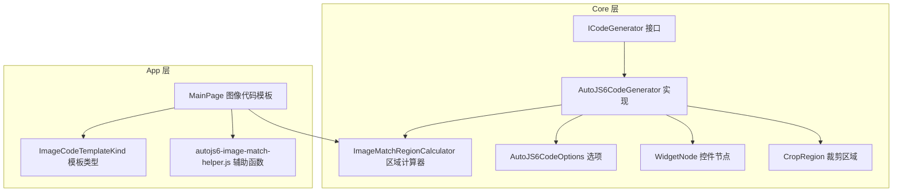
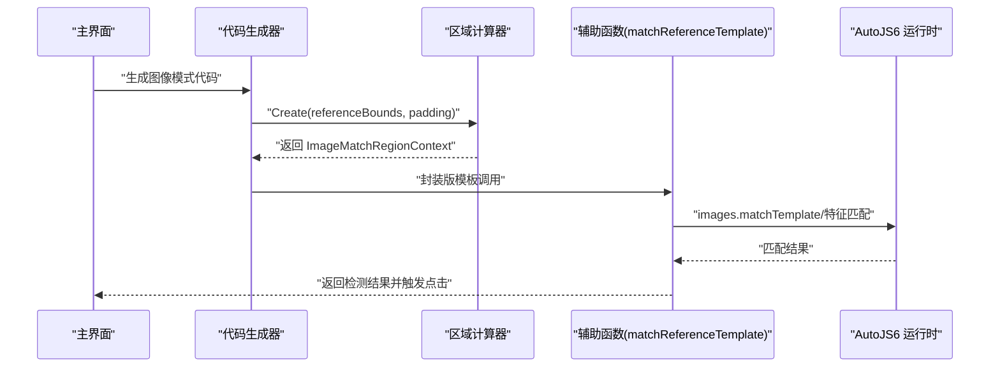
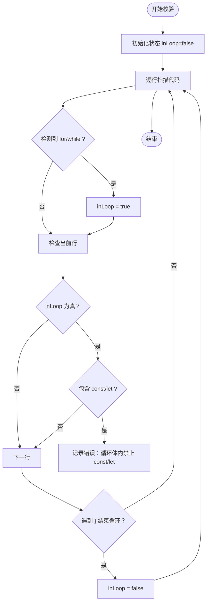
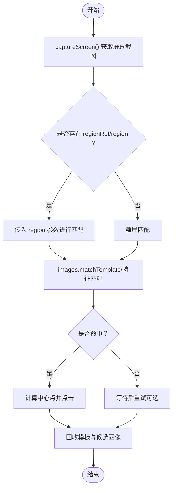
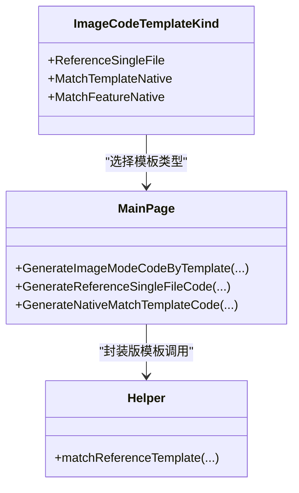
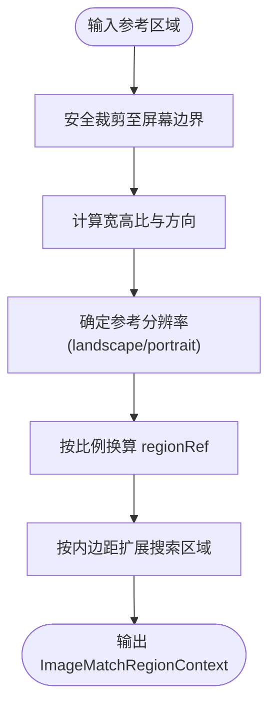
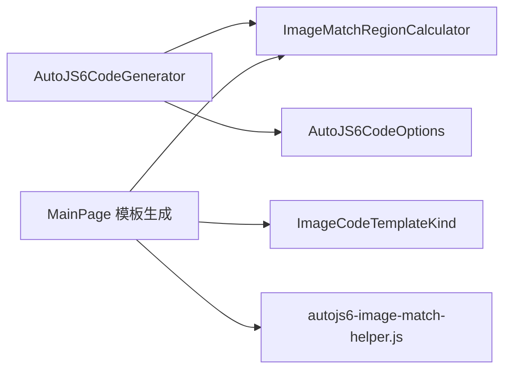

# 代码生成约束

<cite>
**本文引用的文件**
- [Core\Services\AutoJS6CodeGenerator.cs](file://Core/Services/AutoJS6CodeGenerator.cs)
- [Core\Abstractions\ICodeGenerator.cs](file://Core/Abstractions/ICodeGenerator.cs)
- [Core\Models\AutoJS6CodeOptions.cs](file://Core/Models/AutoJS6CodeOptions.cs)
- [Core\Models\WidgetNode.cs](file://Core/Models/WidgetNode.cs)
- [Core\Models\CropRegion.cs](file://Core/Models/CropRegion.cs)
- [Core\Helpers\ImageMatchRegionCalculator.cs](file://Core/Helpers/ImageMatchRegionCalculator.cs)
- [App\Views\MainPage.ImageCodeTemplates.cs](file://App/Views/MainPage.ImageCodeTemplates.cs)
- [App\Views\MainPage.ImageCodeTemplates.ReferenceSingle.cs](file://App/Views/MainPage.ImageCodeTemplates.ReferenceSingle.cs)
- [App\Views\MainPage.ImageCodeTemplates.NativeMatchTemplate.cs](file://App\Views\MainPage.ImageCodeTemplates.NativeMatchTemplate.cs)
- [App\Views\MainPage.ImageCodeTemplates.Shared.cs](file://App/Views/MainPage.ImageCodeTemplates.Shared.cs)
- [App\Models\ImageCodeTemplateKind.cs](file://App/Models/ImageCodeTemplateKind.cs)
- [App\CodeTemplates\image\autojs6-image-match-helper.js](file://App/CodeTemplates/image/autojs6-image-match-helper.js)
</cite>

## 目录
1. [引言](#引言)
2. [项目结构](#项目结构)
3. [核心组件](#核心组件)
4. [架构总览](#架构总览)
5. [详细组件分析](#详细组件分析)
6. [依赖关系分析](#依赖关系分析)
7. [性能考虑](#性能考虑)
8. [故障排查指南](#故障排查指南)
9. [结论](#结论)
10. [附录](#附录)

## 引言
本文件面向 AutoJS6 开发工具的“代码生成约束”，系统性阐述以下三类约束与实施方法：
- Rhino 引擎 const/let 必坑规则：循环体内禁止使用 const/let，函数顶层可使用。
- 图像识别 OOM 预防规则：单轮仅允许一张截图对象、场景识别按目标最小化、模板匹配优先 region 等。
- 模板裁剪规则：优先保留文字主体、图标主体、固定边框主体，动态元素（红点、数字、倒计时）默认排除；横竖屏处理与 regionRef 生成规则。

上述约束均以代码实现为依据，结合生成器、区域计算器与模板辅助函数进行落地，并提供可视化流程图帮助理解。

## 项目结构
AutoJS6 开发工具采用分层设计：
- Core 层：抽象接口、模型与服务（代码生成器、区域计算器、UI 解析等）
- App 层：视图与模板（主界面、代码模板、辅助 JS）
- Infrastructure 层：ADB 与图像处理服务（此处不涉及具体约束，故略）

图表来源
- [Core\Services\AutoJS6CodeGenerator.cs:11-102](file://Core/Services/AutoJS6CodeGenerator.cs#L11-L102)
- [Core\Abstractions\ICodeGenerator.cs:8-45](file://Core/Abstractions/ICodeGenerator.cs#L8-L45)
- [Core\Helpers\ImageMatchRegionCalculator.cs:35-97](file://Core/Helpers/ImageMatchRegionCalculator.cs#L35-L97)
- [Core\Models\AutoJS6CodeOptions.cs:6-89](file://Core/Models/AutoJS6CodeOptions.cs#L6-L89)
- [Core\Models\WidgetNode.cs:6-93](file://Core/Models/WidgetNode.cs#L6-L93)
- [Core\Models\CropRegion.cs:6-53](file://Core/Models/CropRegion.cs#L6-L53)
- [App\Views\MainPage.ImageCodeTemplates.cs:200-240](file://App/Views/MainPage.ImageCodeTemplates.cs#L200-L240)
- [App\Models\ImageCodeTemplateKind.cs:3-8](file://App/Models/ImageCodeTemplateKind.cs#L3-L8)
- [App\CodeTemplates\image\autojs6-image-match-helper.js:18-160](file://App/CodeTemplates/image/autojs6-image-match-helper.js#L18-L160)

章节来源
- [Core\Services\AutoJS6CodeGenerator.cs:11-102](file://Core/Services/AutoJS6CodeGenerator.cs#L11-L102)
- [Core\Abstractions\ICodeGenerator.cs:8-45](file://Core/Abstractions/ICodeGenerator.cs#L8-L45)
- [Core\Helpers\ImageMatchRegionCalculator.cs:35-97](file://Core/Helpers/ImageMatchRegionCalculator.cs#L35-L97)
- [App\Views\MainPage.ImageCodeTemplates.cs:200-240](file://App/Views/MainPage.ImageCodeTemplates.cs#L200-L240)

## 核心组件
- 代码生成器：负责生成图像/控件模式代码、重试逻辑、回收策略与 Rhino 约束校验。
- 区域计算器：基于参考区域生成搜索区域与 regionRef，并推导横竖屏方向。
- 主界面模板生成：根据模板类型生成不同风格的代码片段（封装版、图像匹配、特征匹配）。
- 辅助函数：封装版模板依赖的 matchReferenceTemplate，支持多候选缩放、区域映射与特征回退。

章节来源
- [Core\Services\AutoJS6CodeGenerator.cs:11-102](file://Core/Services/AutoJS6CodeGenerator.cs#L11-L102)
- [Core\Helpers\ImageMatchRegionCalculator.cs:35-97](file://Core/Helpers/ImageMatchRegionCalculator.cs#L35-L97)
- [App\Views\MainPage.ImageCodeTemplates.cs:200-240](file://App/Views/MainPage.ImageCodeTemplates.cs#L200-L240)
- [App\CodeTemplates\image\autojs6-image-match-helper.js:18-160](file://App/CodeTemplates/image/autojs6-image-match-helper.js#L18-L160)

## 架构总览
下图展示从 UI 交互到代码生成与执行的关键流程，涵盖模板选择、区域计算、代码生成与运行时调用。

图表来源
- [App\Views\MainPage.ImageCodeTemplates.cs:200-240](file://App/Views/MainPage.ImageCodeTemplates.cs#L200-L240)
- [Core\Helpers\ImageMatchRegionCalculator.cs:40-97](file://Core/Helpers/ImageMatchRegionCalculator.cs#L40-L97)
- [App\Views\MainPage.ImageCodeTemplates.ReferenceSingle.cs:25-53](file://App/Views/MainPage.ImageCodeTemplates.ReferenceSingle.cs#L25-L53)
- [App\CodeTemplates\image\autojs6-image-match-helper.js:18-160](file://App/CodeTemplates/image/autojs6-image-match-helper.js#L18-L160)

## 详细组件分析

### Rhino 引擎 const/let 必坑规则
- 循环体内禁止使用 const/let，应使用 var；函数顶层可使用 const/let。
- 代码生成器内置校验：扫描生成代码中的循环体，若发现 const/let 则记录错误。
- 该规则由生成器 ValidateCode 方法实现，确保生成的脚本能在 AutoJS6 的 Rhino 引擎中稳定运行。

图表来源
- [Core\Services\AutoJS6CodeGenerator.cs:226-258](file://Core/Services/AutoJS6CodeGenerator.cs#L226-L258)

章节来源
- [Core\Services\AutoJS6CodeGenerator.cs:226-258](file://Core/Services/AutoJS6CodeGenerator.cs#L226-L258)

### 图像识别 OOM 预防规则
- 单轮仅允许一张截图对象：生成器在单次匹配与重试循环中，均仅持有一个屏幕截图对象，避免累积内存占用。
- 场景识别按目标最小化：通过 regionRef 将搜索区域限制在参考区域周围，减少无关区域匹配开销。
- 模板匹配优先 region：当存在区域上下文时，模板匹配传入 region 参数，缩小搜索范围，降低匹配复杂度与内存压力。

图表来源
- [Core\Services\AutoJS6CodeGenerator.cs:38-102](file://Core/Services/AutoJS6CodeGenerator.cs#L38-L102)
- [App\Views\MainPage.ImageCodeTemplates.NativeMatchTemplate.cs:7-33](file://App/Views/MainPage.ImageCodeTemplates.NativeMatchTemplate.cs#L7-L33)
- [App\Views\MainPage.ImageCodeTemplates.ReferenceSingle.cs:25-53](file://App/Views/MainPage.ImageCodeTemplates.ReferenceSingle.cs#L25-L53)
- [App\CodeTemplates\image\autojs6-image-match-helper.js:90-130](file://App/CodeTemplates/image/autojs6-image-match-helper.js#L90-L130)

章节来源
- [Core\Services\AutoJS6CodeGenerator.cs:38-102](file://Core/Services/AutoJS6CodeGenerator.cs#L38-L102)
- [App\Views\MainPage.ImageCodeTemplates.NativeMatchTemplate.cs:7-33](file://App/Views/MainPage.ImageCodeTemplates.NativeMatchTemplate.cs#L7-L33)
- [App\Views\MainPage.ImageCodeTemplates.ReferenceSingle.cs:25-53](file://App/Views/MainPage.ImageCodeTemplates.ReferenceSingle.cs#L25-L53)
- [App\CodeTemplates\image\autojs6-image-match-helper.js:90-130](file://App/CodeTemplates/image/autojs6-image-match-helper.js#L90-L130)

### 模板裁剪规则
- 优先保留主体类型：文字主体、图标主体、固定边框主体，确保模板稳定性与跨设备兼容性。
- 默认排除动态元素：红点、数字、倒计时等易变元素，避免模板随界面更新频繁失效。
- 生成策略：主界面根据模板类型生成不同代码片段，封装版模板依赖辅助函数，自动进行区域映射与缩放候选计算。

图表来源
- [App\Models\ImageCodeTemplateKind.cs:3-8](file://App/Models/ImageCodeTemplateKind.cs#L3-L8)
- [App\Views\MainPage.ImageCodeTemplates.cs:200-240](file://App/Views/MainPage.ImageCodeTemplates.cs#L200-L240)
- [App\Views\MainPage.ImageCodeTemplates.ReferenceSingle.cs:25-53](file://App/Views/MainPage.ImageCodeTemplates.ReferenceSingle.cs#L25-L53)
- [App\Views\MainPage.ImageCodeTemplates.NativeMatchTemplate.cs:7-33](file://App/Views/MainPage.ImageCodeTemplates.NativeMatchTemplate.cs#L7-L33)
- [App\CodeTemplates\image\autojs6-image-match-helper.js:18-160](file://App/CodeTemplates/image/autojs6-image-match-helper.js#L18-L160)

章节来源
- [App\Models\ImageCodeTemplateKind.cs:3-8](file://App/Models/ImageCodeTemplateKind.cs#L3-L8)
- [App\Views\MainPage.ImageCodeTemplates.cs:200-240](file://App/Views/MainPage.ImageCodeTemplates.cs#L200-L240)
- [App\Views\MainPage.ImageCodeTemplates.ReferenceSingle.cs:25-53](file://App/Views/MainPage.ImageCodeTemplates.ReferenceSingle.cs#L25-L53)
- [App\Views\MainPage.ImageCodeTemplates.NativeMatchTemplate.cs:7-33](file://App/Views/MainPage.ImageCodeTemplates.NativeMatchTemplate.cs#L7-L33)
- [App\CodeTemplates\image\autojs6-image-match-helper.js:18-160](file://App/CodeTemplates/image/autojs6-image-match-helper.js#L18-L160)

### 横竖屏处理与 regionRef 生成规则
- 横竖屏方向推导：根据屏幕宽高比判断 landscape/portrait，并据此确定参考分辨率（1280x720 或 720x1280）。
- regionRef 生成：将参考区域按实际屏幕宽高比换算为当前分辨率下的像素坐标，形成 [x, y, width, height] 数组。
- 区域扩展：在参考区域基础上增加内边距，扩大搜索区域，提升匹配鲁棒性。
- 旋转适配：辅助函数会尝试对屏幕图像进行旋转以适配目标方向，保证匹配一致性。

图表来源
- [Core\Helpers\ImageMatchRegionCalculator.cs:40-97](file://Core/Helpers/ImageMatchRegionCalculator.cs#L40-L97)
- [App\Views\MainPage.ImageCodeTemplates.Shared.cs:81-84](file://App/Views/MainPage.ImageCodeTemplates.Shared.cs#L81-L84)
- [App\CodeTemplates\image\autojs6-image-match-helper.js:23-31](file://App/CodeTemplates/image/autojs6-image-match-helper.js#L23-L31)
- [App\CodeTemplates\image\autojs6-image-match-helper.js:257-305](file://App/CodeTemplates/image/autojs6-image-match-helper.js#L257-L305)

章节来源
- [Core\Helpers\ImageMatchRegionCalculator.cs:40-97](file://Core/Helpers/ImageMatchRegionCalculator.cs#L40-L97)
- [App\Views\MainPage.ImageCodeTemplates.Shared.cs:81-84](file://App/Views/MainPage.ImageCodeTemplates.Shared.cs#L81-L84)
- [App\CodeTemplates\image\autojs6-image-match-helper.js:23-31](file://App/CodeTemplates/image/autojs6-image-match-helper.js#L23-L31)
- [App\CodeTemplates\image\autojs6-image-match-helper.js:257-305](file://App/CodeTemplates/image/autojs6-image-match-helper.js#L257-L305)

## 依赖关系分析
- 代码生成器依赖区域计算器与选项模型，生成不同模式的代码。
- 主界面模板生成依赖区域上下文与模板类型枚举，最终调用辅助函数。
- 辅助函数负责多尺度候选、区域映射与特征回退，是封装版模板的核心。

图表来源
- [Core\Services\AutoJS6CodeGenerator.cs:11-102](file://Core/Services/AutoJS6CodeGenerator.cs#L11-L102)
- [Core\Helpers\ImageMatchRegionCalculator.cs:35-97](file://Core/Helpers/ImageMatchRegionCalculator.cs#L35-L97)
- [App\Views\MainPage.ImageCodeTemplates.cs:200-240](file://App/Views/MainPage.ImageCodeTemplates.cs#L200-L240)
- [App\Models\ImageCodeTemplateKind.cs:3-8](file://App/Models/ImageCodeTemplateKind.cs#L3-L8)
- [App\CodeTemplates\image\autojs6-image-match-helper.js:18-160](file://App/CodeTemplates/image/autojs6-image-match-helper.js#L18-L160)

章节来源
- [Core\Services\AutoJS6CodeGenerator.cs:11-102](file://Core/Services/AutoJS6CodeGenerator.cs#L11-L102)
- [Core\Helpers\ImageMatchRegionCalculator.cs:35-97](file://Core/Helpers/ImageMatchRegionCalculator.cs#L35-L97)
- [App\Views\MainPage.ImageCodeTemplates.cs:200-240](file://App/Views/MainPage.ImageCodeTemplates.cs#L200-L240)
- [App\Models\ImageCodeTemplateKind.cs:3-8](file://App/Models/ImageCodeTemplateKind.cs#L3-L8)
- [App\CodeTemplates\image\autojs6-image-match-helper.js:18-160](file://App/CodeTemplates/image/autojs6-image-match-helper.js#L18-L160)

## 性能考虑
- 减少内存占用：单轮仅持有一个截图对象，匹配完成后及时回收模板与候选图像。
- 缩小搜索空间：通过 regionRef 限制匹配区域，降低模板匹配与特征匹配的计算量。
- 多尺度候选控制：辅助函数按宽高比生成有限的缩放候选，避免过度重试导致的性能损耗。
- 旋转适配：仅在方向不一致时进行旋转，减少不必要的图像变换。

## 故障排查指南
- Rhino 约束错误：若提示循环体内使用了 const/let，请改为 var；检查生成器 ValidateCode 的错误列表定位问题行。
- 匹配失败：确认 regionRef 是否合理，阈值是否过低；必要时切换到特征匹配模板。
- OOM 异常：确保单轮仅有一张截图对象，避免在循环中重复创建；使用封装版模板时注意模板与图像的回收。
- 横竖屏不一致：检查 orientation 设置与参考区域的宽高比，确保 regionRef 换算正确。

章节来源
- [Core\Services\AutoJS6CodeGenerator.cs:226-258](file://Core/Services/AutoJS6CodeGenerator.cs#L226-L258)
- [App\CodeTemplates\image\autojs6-image-match-helper.js:501-523](file://App/CodeTemplates/image/autojs6-image-match-helper.js#L501-L523)

## 结论
本文件系统梳理了 AutoJS6 开发工具在代码生成层面的三大约束：Rhino 引擎 const/let 使用限制、图像识别 OOM 预防策略与模板裁剪原则，并给出了横竖屏处理与 regionRef 生成的实施细节。通过区域计算器与封装版辅助函数，开发者可在保证稳定性的同时获得更高的匹配成功率与更低的内存占用。

## 附录
- 关键实现参考路径
  - Rhino 约束校验：[Core\Services\AutoJS6CodeGenerator.cs:226-258](file://Core/Services/AutoJS6CodeGenerator.cs#L226-L258)
  - 图像匹配与回收：[Core\Services\AutoJS6CodeGenerator.cs:38-102](file://Core/Services/AutoJS6CodeGenerator.cs#L38-L102)、[App\Views\MainPage.ImageCodeTemplates.NativeMatchTemplate.cs:7-33](file://App/Views/MainPage.ImageCodeTemplates.NativeMatchTemplate.cs#L7-L33)
  - 封装版模板与辅助函数：[App\Views\MainPage.ImageCodeTemplates.ReferenceSingle.cs:25-53](file://App/Views/MainPage.ImageCodeTemplates.ReferenceSingle.cs#L25-L53)、[App\CodeTemplates\image\autojs6-image-match-helper.js:18-160](file://App/CodeTemplates/image/autojs6-image-match-helper.js#L18-L160)
  - 区域上下文与 regionRef：[Core\Helpers\ImageMatchRegionCalculator.cs:40-97](file://Core/Helpers/ImageMatchRegionCalculator.cs#L40-L97)、[App\Views\MainPage.ImageCodeTemplates.Shared.cs:81-84](file://App/Views/MainPage.ImageCodeTemplates.Shared.cs#L81-L84)