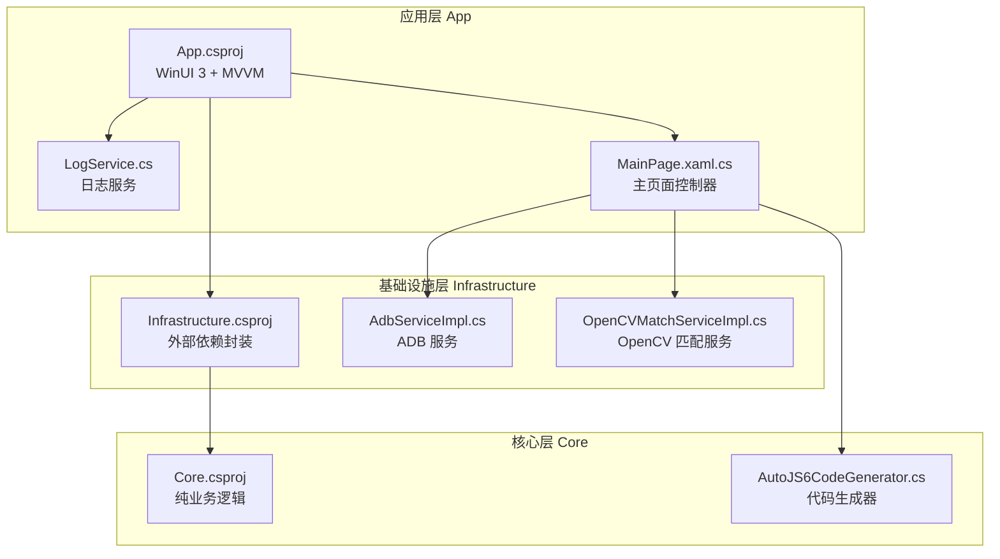
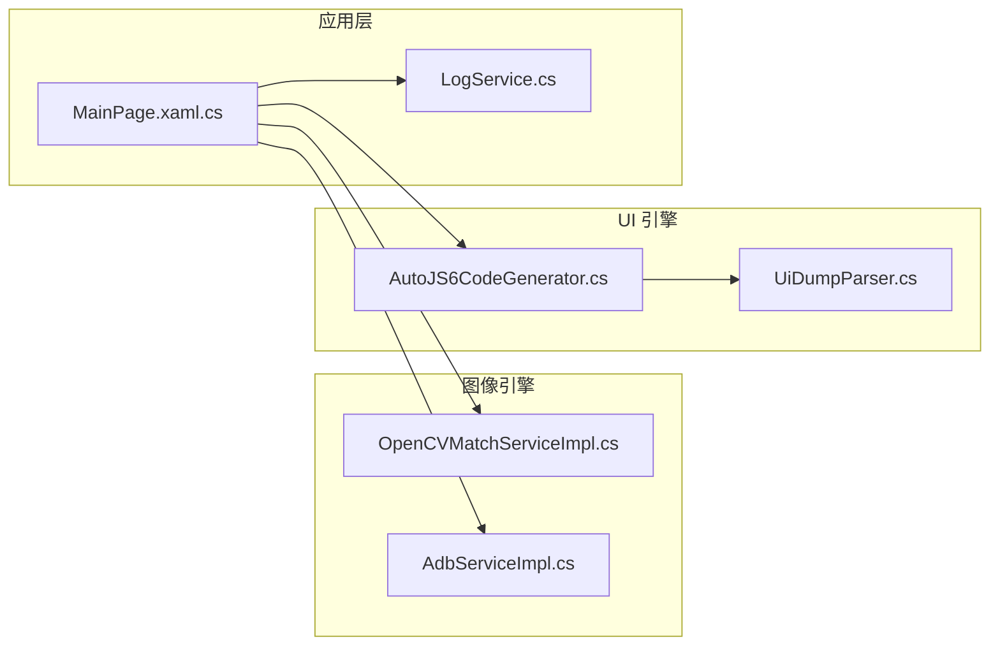
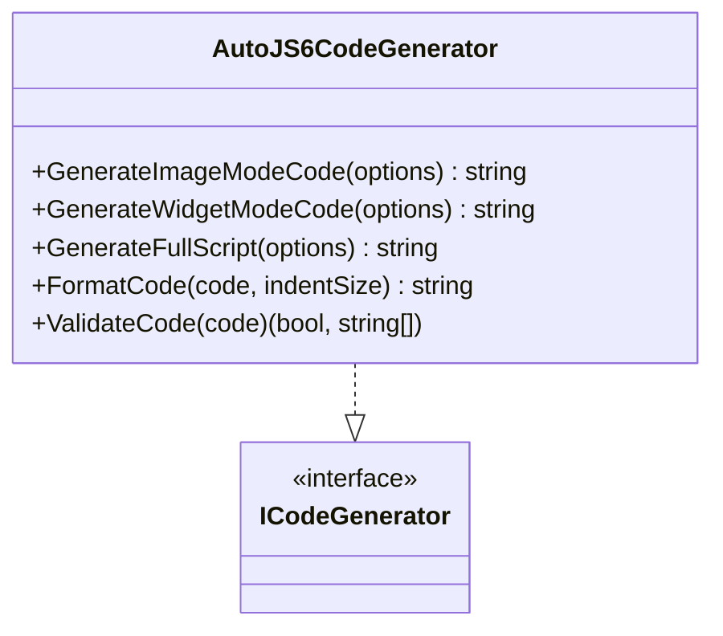
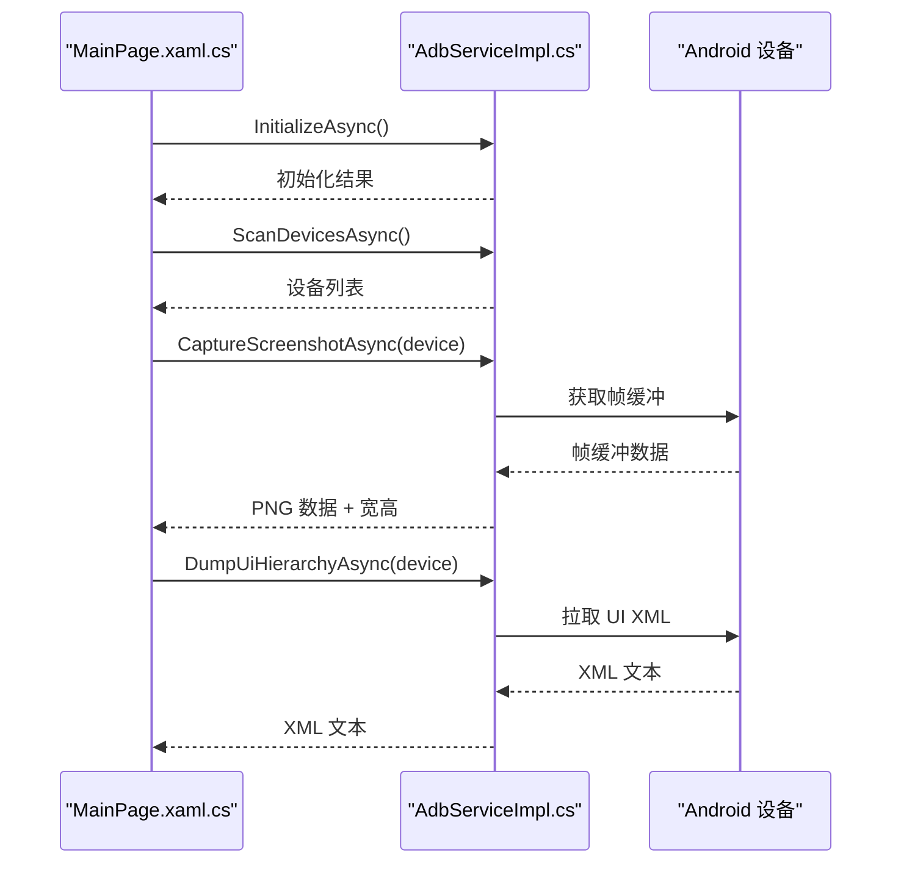
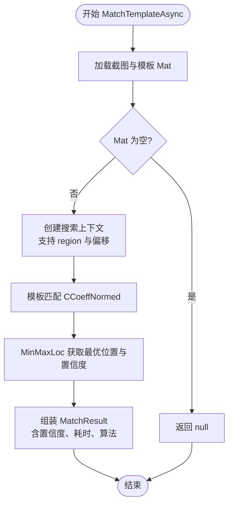
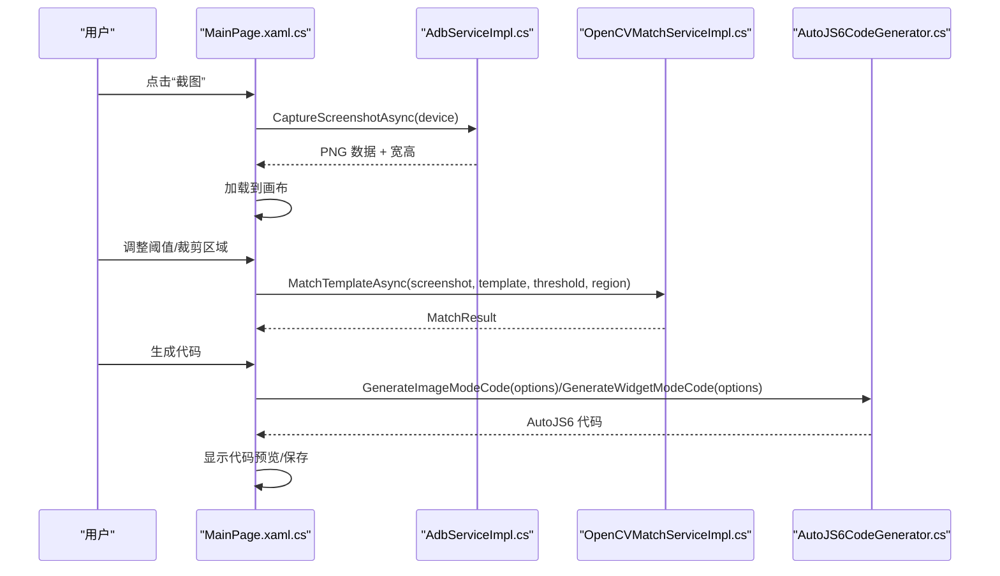
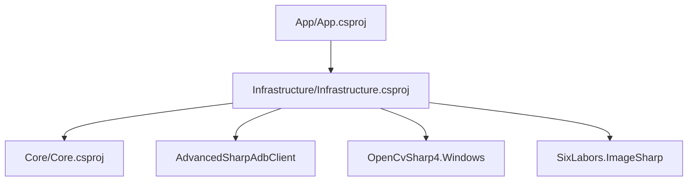

# 开发工作流程

<cite>
**本文引用的文件**
- [README.md](file://README.md)
- [DEVELOPMENT.md](file://DEVELOPMENT.md)
- [checklist.md](file://checklist.md)
- [manual.md](file://manual.md)
- [AGENTS.md](file://AGENTS.md)
- [openspec/config.yaml](file://openspec/config.yaml)
- [App/App.csproj](file://App/App.csproj)
- [Core/Core.csproj](file://Core/Core.csproj)
- [Infrastructure/Infrastructure.csproj](file://Infrastructure/Infrastructure.csproj)
- [App/Services/LogService.cs](file://App/Services/LogService.cs)
- [Core/Services/AutoJS6CodeGenerator.cs](file://Core/Services/AutoJS6CodeGenerator.cs)
- [Infrastructure/Adb/AdbServiceImpl.cs](file://Infrastructure/Adb/AdbServiceImpl.cs)
- [Infrastructure/Imaging/OpenCVMatchServiceImpl.cs](file://Infrastructure/Imaging/OpenCVMatchServiceImpl.cs)
- [App/Views/MainPage.xaml.cs](file://App/Views/MainPage.xaml.cs)
- [App.Tests/UnitTests.cs](file://App.Tests/UnitTests.cs)
- [Core.Tests/AutoJS6CodeGeneratorTests.cs](file://Core.Tests/AutoJS6CodeGeneratorTests.cs)
</cite>

## 目录
1. [引言](#引言)
2. [项目结构](#项目结构)
3. [核心组件](#核心组件)
4. [架构总览](#架构总览)
5. [详细组件分析](#详细组件分析)
6. [依赖分析](#依赖分析)
7. [性能考虑](#性能考虑)
8. [故障排查指南](#故障排查指南)
9. [结论](#结论)
10. [附录](#附录)

## 引言
本文件面向 AutoJS6 开发工具的贡献者与维护者，系统化梳理从需求分析、设计评审、编码实现、测试验证到发布上线的全流程规范，强调“用户体验优先”的设计原则与“双核独立架构”的强制约束，明确异步架构、内存优化与渲染性能的工程要求，并提供开发检查清单、质量控制标准与最佳实践。

## 项目结构
项目采用 Clean Architecture 分层与 WinUI 3 桌面应用架构，分为三层：
- Core：纯业务逻辑层，无 UI 与外部依赖，独立可测试
- Infrastructure：封装外部依赖（ADB、OpenCV、ImageSharp），供 Core 使用
- App：WinUI 3 UI 层，负责 MVVM 与用户交互

图表来源
- [App/App.csproj:1-84](file://App/App.csproj#L1-L84)
- [Infrastructure/Infrastructure.csproj:1-19](file://Infrastructure/Infrastructure.csproj#L1-L19)
- [Core/Core.csproj:1-10](file://Core/Core.csproj#L1-L10)
- [App/Services/LogService.cs:1-51](file://App/Services/LogService.cs#L1-L51)
- [App/Views/MainPage.xaml.cs:1-409](file://App/Views/MainPage.xaml.cs#L1-L409)
- [Infrastructure/Adb/AdbServiceImpl.cs:1-238](file://Infrastructure/Adb/AdbServiceImpl.cs#L1-L238)
- [Infrastructure/Imaging/OpenCVMatchServiceImpl.cs:1-204](file://Infrastructure/Imaging/OpenCVMatchServiceImpl.cs#L1-L204)
- [Core/Services/AutoJS6CodeGenerator.cs:1-357](file://Core/Services/AutoJS6CodeGenerator.cs#L1-L357)

章节来源
- [README.md: 项目结构与架构原则:230-288](file://README.md#L230-L288)
- [App/App.csproj: 项目配置与依赖:1-84](file://App/App.csproj#L1-L84)
- [Infrastructure/Infrastructure.csproj: 外部依赖封装:1-19](file://Infrastructure/Infrastructure.csproj#L1-L19)
- [Core/Core.csproj: 核心业务逻辑:1-10](file://Core/Core.csproj#L1-L10)

## 核心组件
- 日志服务（App/Services/LogService.cs）：全局日志入口，统一事件通知 UI
- ADB 服务（Infrastructure/Adb/AdbServiceImpl.cs）：设备发现、截图、UI 层次结构拉取、配对与连接
- OpenCV 匹配服务（Infrastructure/Imaging/OpenCVMatchServiceImpl.cs）：模板匹配、相似度计算、区域搜索
- 代码生成器（Core/Services/AutoJS6CodeGenerator.cs）：图像模式与控件模式的 AutoJS6 代码生成与校验
- 主页面控制器（App/Views/MainPage.xaml.cs）：工作台主流程编排、事件绑定与状态管理

章节来源
- [App/Services/LogService.cs: 日志服务实现:1-51](file://App/Services/LogService.cs#L1-L51)
- [Infrastructure/Adb/AdbServiceImpl.cs: ADB 服务实现:1-238](file://Infrastructure/Adb/AdbServiceImpl.cs#L1-L238)
- [Infrastructure/Imaging/OpenCVMatchServiceImpl.cs: OpenCV 匹配实现:1-204](file://Infrastructure/Imaging/OpenCVMatchServiceImpl.cs#L1-L204)
- [Core/Services/AutoJS6CodeGenerator.cs: 代码生成器实现:1-357](file://Core/Services/AutoJS6CodeGenerator.cs#L1-L357)
- [App/Views/MainPage.xaml.cs: 主页面控制器:1-409](file://App/Views/MainPage.xaml.cs#L1-L409)

## 架构总览
双核独立架构与单向依赖是本项目的核心约束：
- 双核独立：图像引擎（像素/位图 + OpenCV）与 UI 引擎（控件树 + UiSelector）完全解耦
- 单向依赖：App → Infrastructure → Core ← Infrastructure
- 异步优先：所有 I/O 操作（ADB、OpenCV、XML 解析、纹理上传）使用 async/await，UI 线程永不阻塞

图表来源
- [Infrastructure/Imaging/OpenCVMatchServiceImpl.cs:1-204](file://Infrastructure/Imaging/OpenCVMatchServiceImpl.cs#L1-L204)
- [Infrastructure/Adb/AdbServiceImpl.cs:1-238](file://Infrastructure/Adb/AdbServiceImpl.cs#L1-L238)
- [Core/Services/AutoJS6CodeGenerator.cs:1-357](file://Core/Services/AutoJS6CodeGenerator.cs#L1-L357)
- [App/Views/MainPage.xaml.cs:1-409](file://App/Views/MainPage.xaml.cs#L1-L409)
- [App/Services/LogService.cs:1-51](file://App/Services/LogService.cs#L1-L51)

章节来源
- [AGENTS.md: 双核独立与单向依赖规则:40-95](file://AGENTS.md#L40-L95)
- [README.md: 架构原则与异步规则:264-288](file://README.md#L264-L288)

## 详细组件分析

### 组件 A：代码生成器（Core/Services/AutoJS6CodeGenerator.cs）
- 功能职责：根据选项生成 AutoJS6 图像模式与控件模式代码，支持重试逻辑、模板回收、代码格式化与 Rhino 引擎约束校验
- 关键特性：
  - 图像模式：生成 images.findImage + click，支持 region 与阈值
  - 控件模式：生成 id()/text()/desc() 降级链，支持 boundsInside 限定
  - 代码校验：检测循环体内 const/let 使用，确保 Rhino 兼容
- 性能与工程要求：
  - 严格遵循 OOM 预防规则（单轮单截图、region 优先、及时回收）

图表来源
- [Core/Services/AutoJS6CodeGenerator.cs:1-357](file://Core/Services/AutoJS6CodeGenerator.cs#L1-L357)

章节来源
- [Core/Services/AutoJS6CodeGenerator.cs: 代码生成与校验:1-357](file://Core/Services/AutoJS6CodeGenerator.cs#L1-L357)
- [AGENTS.md: 代码生成约束与 OOM 预防:152-226](file://AGENTS.md#L152-L226)

### 组件 B：ADB 服务（Infrastructure/Adb/AdbServiceImpl.cs）
- 功能职责：ADB 服务器初始化、设备扫描、截图帧缓冲解析、UI 层次结构拉取、TCP/IP 连接与配对
- 关键特性：
  - 帧缓冲去填充、PNG 编码、宽高信息提取
  - 异步 UI Dump，XML 文本输出
  - 设备在线状态检测、连接/配对错误包装
- 性能与工程要求：
  - 异步 I/O，避免阻塞 UI；设备路径探测与容错

图表来源
- [App/Views/MainPage.xaml.cs:147-248](file://App/Views/MainPage.xaml.cs#L147-L248)
- [Infrastructure/Adb/AdbServiceImpl.cs:33-138](file://Infrastructure/Adb/AdbServiceImpl.cs#L33-L138)

章节来源
- [Infrastructure/Adb/AdbServiceImpl.cs: ADB 服务实现:1-238](file://Infrastructure/Adb/AdbServiceImpl.cs#L1-L238)
- [App/Views/MainPage.xaml.cs: 主页面调用 ADB:147-248](file://App/Views/MainPage.xaml.cs#L147-L248)

### 组件 C：OpenCV 匹配服务（Infrastructure/Imaging/OpenCVMatchServiceImpl.cs）
- 功能职责：模板匹配、多点匹配、相似度计算、区域搜索上下文
- 关键特性：
  - TM_CCOEFF_NORMED 算法，支持阈值与区域限制
  - 搜索上下文偏移与内存释放
- 性能与工程要求：
  - 后台线程执行，避免 UI 卡顿；区域裁剪减少计算量

图表来源
- [Infrastructure/Imaging/OpenCVMatchServiceImpl.cs:13-60](file://Infrastructure/Imaging/OpenCVMatchServiceImpl.cs#L13-L60)

章节来源
- [Infrastructure/Imaging/OpenCVMatchServiceImpl.cs: OpenCV 匹配实现:1-204](file://Infrastructure/Imaging/OpenCVMatchServiceImpl.cs#L1-L204)

### 组件 D：主页面控制器（App/Views/MainPage.xaml.cs）
- 功能职责：设备选择、截图、UI 树拉取、裁剪模式、阈值调节、代码生成与日志输出
- 关键特性：
  - 事件驱动的状态更新与 UI 响应
  - 日志服务订阅与状态提示
  - 与 ADB、OpenCV、代码生成器协作

图表来源
- [App/Views/MainPage.xaml.cs:147-248](file://App/Views/MainPage.xaml.cs#L147-L248)
- [Infrastructure/Adb/AdbServiceImpl.cs:72-118](file://Infrastructure/Adb/AdbServiceImpl.cs#L72-L118)
- [Infrastructure/Imaging/OpenCVMatchServiceImpl.cs:13-60](file://Infrastructure/Imaging/OpenCVMatchServiceImpl.cs#L13-L60)
- [Core/Services/AutoJS6CodeGenerator.cs:13-102](file://Core/Services/AutoJS6CodeGenerator.cs#L13-L102)

章节来源
- [App/Views/MainPage.xaml.cs: 主页面控制器:1-409](file://App/Views/MainPage.xaml.cs#L1-L409)

## 依赖分析
- 项目层依赖关系：App → Infrastructure → Core ← Infrastructure
- 外部依赖封装：ADB（AdvancedSharpAdbClient）、OpenCV（OpenCvSharp4）、图像处理（SixLabors.ImageSharp）
- 核心业务依赖：Core 仅依赖 Infrastructure，App 仅依赖 Core 与 Infrastructure

图表来源
- [App/App.csproj:67-68](file://App/App.csproj#L67-L68)
- [Infrastructure/Infrastructure.csproj:9-17](file://Infrastructure/Infrastructure.csproj#L9-L17)
- [Core/Core.csproj:1-10](file://Core/Core.csproj#L1-L10)

章节来源
- [AGENTS.md: 项目层依赖硬规则:69-95](file://AGENTS.md#L69-L95)
- [App/App.csproj: 项目引用:67-68](file://App/App.csproj#L67-L68)
- [Infrastructure/Infrastructure.csproj: 外部包引用:13-17](file://Infrastructure/Infrastructure.csproj#L13-L17)

## 性能考虑
- 异步架构：所有 I/O 操作使用 async/await，UI 线程永不阻塞
- 内存优化：Win2D CanvasBitmap 缓存池、阈值滑动仅重算匹配层、控件树虚拟化
- 渲染性能：Win2D GPU 加速、分层渲染仅重绘变化图层、目标 60FPS
- 模块规模：运行时/feature/action 模块行数上限与拆分规则

章节来源
- [AGENTS.md: 异步、内存与渲染性能要求:229-253](file://AGENTS.md#L229-L253)
- [README.md: 性能与工程要求:184-190](file://README.md#L184-L190)

## 故障排查指南
- 本地构建失败：检查平台目标、MSBuild 与签名工具、Windows SDK
- MSIX 签名失败：证书 Subject 与 Publisher 必须一致，导入到受信任存储
- EXE 安装器失败：确认 Inno Setup 6 存在、输出目录可写
- 测试打包失败：优先修复代码、打包脚本与工作流配置
- 生产包不可用：优先发布补丁版本而非改写已发布标签

章节来源
- [DEVELOPMENT.md: 故障排查与恢复策略:182-250](file://DEVELOPMENT.md#L182-L250)

## 结论
本开发工作流程以用户体验优先为核心，严格遵循双核独立与单向依赖的架构约束，结合异步、内存与渲染性能要求，形成从需求到发布的闭环。通过开发检查清单与测试要求，确保质量可控、风险可降、发布可追溯。

## 附录

### 开发检查清单（P0/P1）
- 安装与启动：便携包/安装包可启动，10 秒内不崩溃
- ADB 与设备：冷启动可发现设备，USB/TCP/IP 连接可用
- 截图与画布：加载截图、缩放/平移、清屏功能正常
- 图像模式闭环：裁剪、匹配、生成代码、保存
- 控件模式闭环：拉取 UI 树、边界框、选择器复制、点击代码
- 基础稳定性：连续操作不崩溃、状态不串线
- ARM64/MSIX（条件项）：产物可安装/启动、证书说明清晰

章节来源
- [checklist.md: V1 验证清单:1-186](file://checklist.md#L1-L186)

### 质量控制标准与测试要求
- 单元测试：Core 层必须覆盖核心逻辑（如代码生成器）
- UI 测试：App 层契约测试（XAML 控件名称、程序集加载）
- 功能验证：以 checklist.md 为准，先功能后 Actions
- 代码审查要点：
  - 是否满足用户体验优先
  - 是否遵守双核独立与单向依赖
  - 是否使用 async/await 且无阻塞
  - 是否符合 AutoJS6 代码生成约束
  - 是否遵循内存与渲染性能要求

章节来源
- [Core.Tests/AutoJS6CodeGeneratorTests.cs: 单元测试示例:1-80](file://Core.Tests/AutoJS6CodeGeneratorTests.cs#L1-L80)
- [App.Tests/UnitTests.cs: UI 契约测试示例:1-91](file://App.Tests/UnitTests.cs#L1-L91)
- [README.md: 开发流程与质量要求:303-340](file://README.md#L303-L340)

### 发布流程与验证手册
- 本地验证顺序：restore → build → test → 产物打包 → smoke 检查 → 上传验证
- GitHub Actions 验证：dry-run → prerelease 上传 → 正式发版
- 一票否决项：任一步失败、资产不完整、版本/提交不一致、下载损坏

章节来源
- [DEVELOPMENT.md: 本地与 CI 验证:47-178](file://DEVELOPMENT.md#L47-L178)
- [manual.md: Actions 发版前验证手册:1-522](file://manual.md#L1-L522)

### 开发工作流程（从需求到发布）
- 需求分析：参考 AGENTS.md 与 openspec 项目文档，明确用户体验目标与约束
- 设计评审：确认双核独立与单向依赖，制定接口契约与数据模型
- 编码实现：遵循异步、内存与渲染性能要求，保持模块规模与职责单一
- 测试验证：单元测试 + UI 契约测试 + checklist 验证
- 发布准备：本地打包验证 → prerelease 验证 → 正式发版
- 回归与恢复：生产问题优先补丁版本，避免改写已发布标签

章节来源
- [AGENTS.md: 开发流程真实资源规则:289-307](file://AGENTS.md#L289-L307)
- [openspec/config.yaml: OpenSpec 配置上下文:1-21](file://openspec/config.yaml#L1-L21)
- [README.md: 开发流程与发布前检查:303-340](file://README.md#L303-L340)