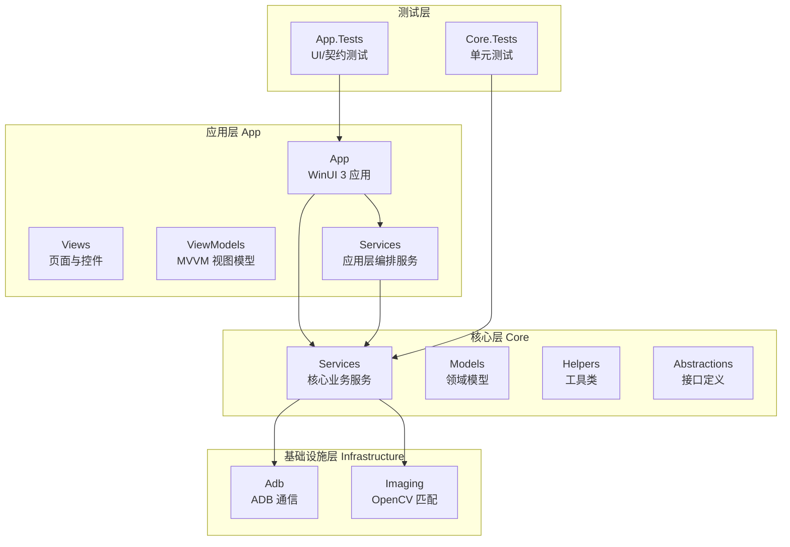
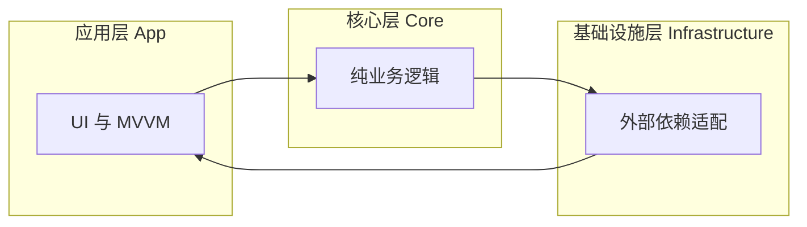
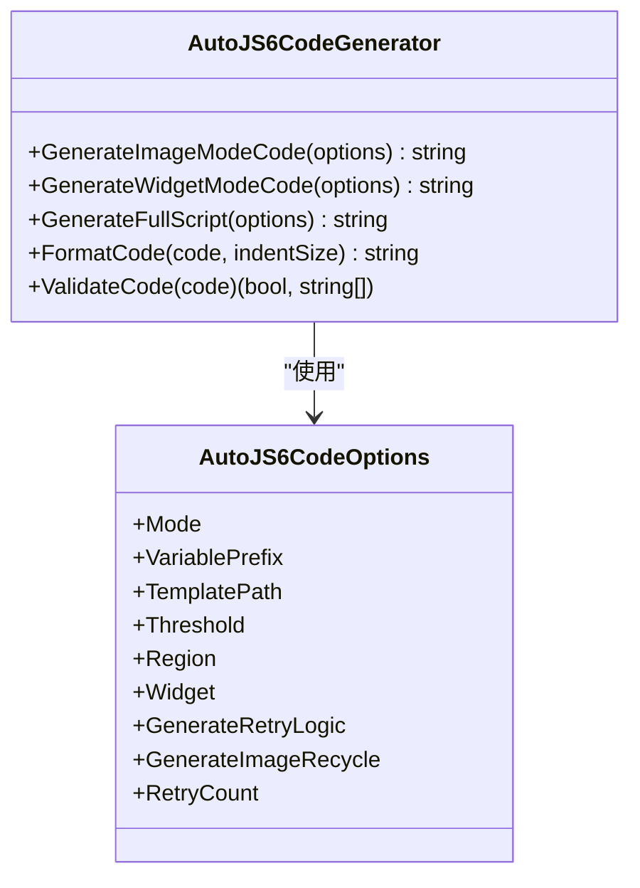
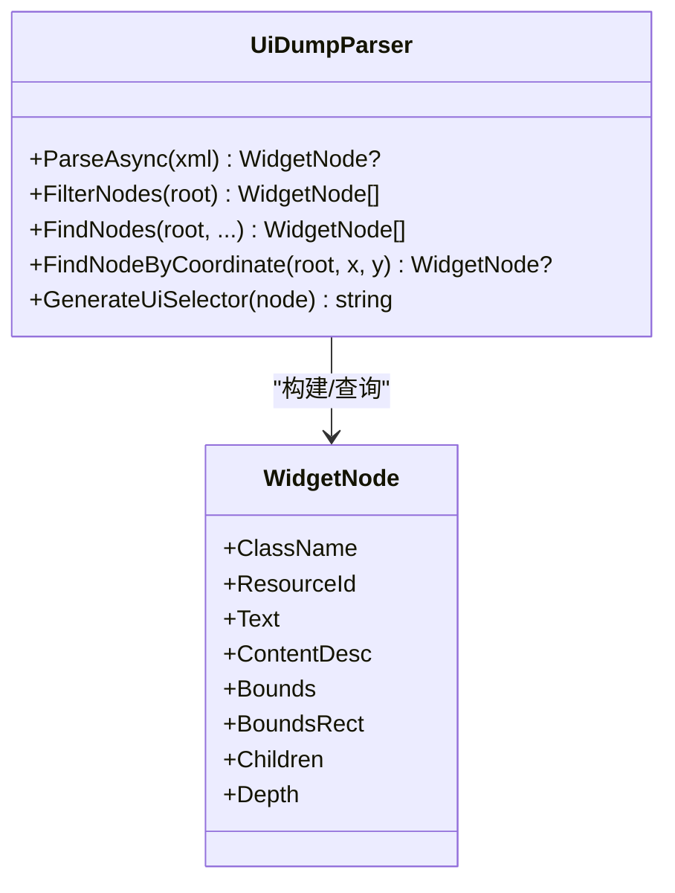
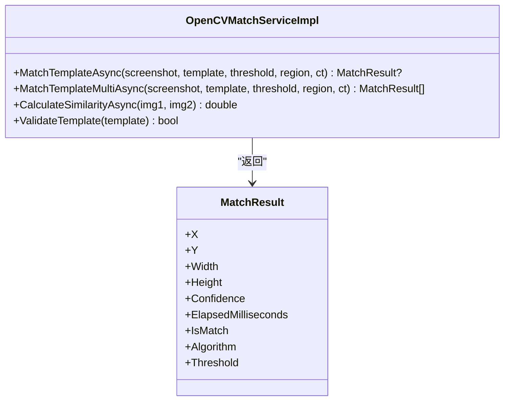
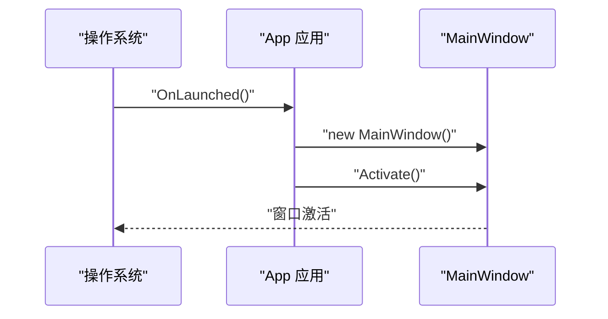
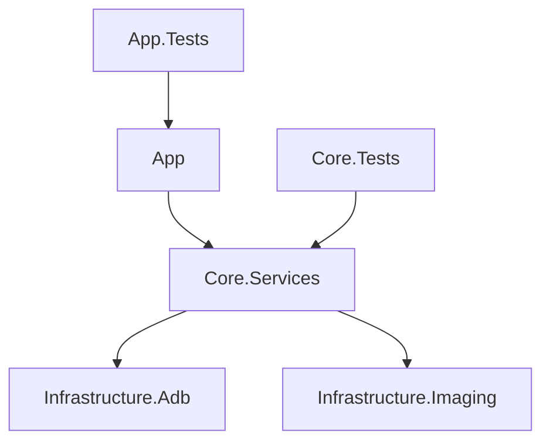

# 开发检查清单

<cite>
**本文引用的文件**
- [checklist.md](file://checklist.md)
- [DEVELOPMENT.md](file://DEVELOPMENT.md)
- [manual.md](file://manual.md)
- [README.md](file://README.md)
- [App/App.xaml.cs](file://App/App.xaml.cs)
- [App.Tests/UnitTests.cs](file://App.Tests/UnitTests.cs)
- [Core.Tests/AutoJS6CodeGeneratorTests.cs](file://Core.Tests/AutoJS6CodeGeneratorTests.cs)
- [Core.Tests/UiDumpParserTests.cs](file://Core.Tests/UiDumpParserTests.cs)
- [Core.Tests/ImageMatchRegionCalculatorTests.cs](file://Core.Tests/ImageMatchRegionCalculatorTests.cs)
- [Core/Services/AutoJS6CodeGenerator.cs](file://Core/Services/AutoJS6CodeGenerator.cs)
- [Core/Services/UiDumpParser.cs](file://Core/Services/UiDumpParser.cs)
- [Infrastructure/Imaging/OpenCVMatchServiceImpl.cs](file://Infrastructure/Imaging/OpenCVMatchServiceImpl.cs)
- [openspec/config.yaml](file://openspec/config.yaml)
</cite>

## 目录
1. [简介](#简介)
2. [项目结构](#项目结构)
3. [核心组件](#核心组件)
4. [架构总览](#架构总览)
5. [详细组件分析](#详细组件分析)
6. [依赖关系分析](#依赖关系分析)
7. [性能考虑](#性能考虑)
8. [故障排查指南](#故障排查指南)
9. [结论](#结论)
10. [附录](#附录)

## 简介
本文件基于仓库现有检查清单与设计原则，为 AutoJS6 开发工具制定完整的开发质量控制标准。内容覆盖代码审查要点、测试要求、性能验证、用户体验评估等检查项目，并提供具体检查表单与评分建议，确保每个功能实现均经过充分验证。同时明确关键里程碑检查点（设计评审、代码审查、单元测试、集成测试、性能测试），并给出常见问题的预防与解决策略。

## 项目结构
项目采用 Clean Architecture 分层组织，分为应用层（App）、核心业务层（Core）、基础设施层（Infrastructure），并配有独立的测试工程（App.Tests、Core.Tests）。整体结构清晰，职责分离，便于质量控制与回归验证。

图表来源
- [README.md:230-288](file://README.md#L230-L288)

章节来源
- [README.md:230-288](file://README.md#L230-L288)

## 核心组件
- 应用层（App）
  - 负责 UI 与 MVVM，承载用户交互与视图模型绑定。
  - 关键入口：应用启动与主窗口激活。
- 核心层（Core）
  - 纯业务逻辑，不含 UI 依赖，独立可测试。
  - 包含代码生成器、UI 树解析器、辅助计算工具等。
- 基础设施层（Infrastructure）
  - 对外设与第三方库的适配封装，如 ADB 通信、OpenCV 匹配。
- 测试层（App.Tests、Core.Tests）
  - App.Tests：契约测试（XAML 控件命名、MainPage 构造等）。
  - Core.Tests：核心算法与业务逻辑的单元测试。

章节来源
- [README.md:230-288](file://README.md#L230-L288)
- [App/App.xaml.cs:49-54](file://App/App.xaml.cs#L49-L54)
- [App.Tests/UnitTests.cs:10-40](file://App.Tests/UnitTests.cs#L10-L40)
- [Core.Tests/AutoJS6CodeGeneratorTests.cs:10-79](file://Core.Tests/AutoJS6CodeGeneratorTests.cs#L10-L79)
- [Core.Tests/UiDumpParserTests.cs:9-73](file://Core.Tests/UiDumpParserTests.cs#L9-L73)
- [Core.Tests/ImageMatchRegionCalculatorTests.cs:10-59](file://Core.Tests/ImageMatchRegionCalculatorTests.cs#L10-L59)

## 架构总览
系统遵循 Clean Architecture 与异步优先的设计原则，数据与处理管道严格隔离，渲染与引擎解耦，确保可维护性与可扩展性。

图表来源
- [README.md:264-288](file://README.md#L264-L288)

章节来源
- [README.md:264-288](file://README.md#L264-L288)

## 详细组件分析

### 代码生成器（AutoJS6CodeGenerator）
- 功能职责
  - 图像模式：生成基于 images.findImage 的脚本，支持阈值、区域、重试与回收。
  - 控件模式：生成基于 UiSelector 的脚本，支持资源 ID、文本、描述的降级顺序与边界限定。
  - 代码格式化与 Rhino 引擎约束校验。
- 关键质量控制点
  - 循环体内禁用 const/let；模板回收；region 参数正确注入；重试逻辑可配置。
- 测试覆盖
  - 图像模式：变量前缀、模板路径、区域、回收、Rhino 约束。
  - 控件模式：优先级顺序（id/text/desc）、降级选择器、boundsInside。

图表来源
- [Core/Services/AutoJS6CodeGenerator.cs:11-357](file://Core/Services/AutoJS6CodeGenerator.cs#L11-L357)

章节来源
- [Core/Services/AutoJS6CodeGenerator.cs:11-357](file://Core/Services/AutoJS6CodeGenerator.cs#L11-L357)
- [Core.Tests/AutoJS6CodeGeneratorTests.cs:10-79](file://Core.Tests/AutoJS6CodeGeneratorTests.cs#L10-L79)

### UI 树解析器（UiDumpParser）
- 功能职责
  - 解析 Android uiautomator dump XML，构建 WidgetNode 树。
  - 布局容器智能过滤，坐标命中查询，UiSelector 生成。
- 关键质量控制点
  - XML 解析健壮性（异常保护）；布局容器过滤规则；坐标命中深度优先；UiSelector 降级顺序。
- 测试覆盖
  - 有效 XML 解析与过滤；坐标命中；无效 XML 返回空。

图表来源
- [Core/Services/UiDumpParser.cs:12-263](file://Core/Services/UiDumpParser.cs#L12-L263)

章节来源
- [Core/Services/UiDumpParser.cs:12-263](file://Core/Services/UiDumpParser.cs#L12-L263)
- [Core.Tests/UiDumpParserTests.cs:9-73](file://Core.Tests/UiDumpParserTests.cs#L9-L73)

### OpenCV 模板匹配服务（OpenCVMatchServiceImpl）
- 功能职责
  - 基于 TM_CCOEFF_NORMED 的模板匹配，支持单点与多点匹配、相似度计算、模板有效性校验。
  - 支持区域搜索与取消令牌。
- 关键质量控制点
  - 输入图像有效性检查；区域安全裁剪；异常捕获与空结果返回；性能计时。
- 测试覆盖
  - 单点匹配阈值与置信度；多点匹配；相似度计算；模板有效性；区域上下文。

图表来源
- [Infrastructure/Imaging/OpenCVMatchServiceImpl.cs:11-204](file://Infrastructure/Imaging/OpenCVMatchServiceImpl.cs#L11-L204)

章节来源
- [Infrastructure/Imaging/OpenCVMatchServiceImpl.cs:11-204](file://Infrastructure/Imaging/OpenCVMatchServiceImpl.cs#L11-L204)
- [Core.Tests/ImageMatchRegionCalculatorTests.cs:10-59](file://Core.Tests/ImageMatchRegionCalculatorTests.cs#L10-L59)

### 应用启动与契约测试
- 应用启动
  - OnLaunched 创建并激活主窗口，确保 UI 可用。
- 契约测试
  - MainPage 构造契约；XAML 关键控件命名存在性校验；构建产物契约。

图表来源
- [App/App.xaml.cs:49-54](file://App/App.xaml.cs#L49-L54)

章节来源
- [App/App.xaml.cs:49-54](file://App/App.xaml.cs#L49-L54)
- [App.Tests/UnitTests.cs:10-40](file://App.Tests/UnitTests.cs#L10-L40)

## 依赖关系分析
- 层间依赖
  - App → Core：应用层依赖核心业务服务。
  - Core → Infrastructure：核心层依赖基础设施适配（ADB、OpenCV）。
- 内聚与解耦
  - 双引擎（图像/控件）完全解耦，数据与渲染分离。
  - 接口抽象（Abstractions）隔离外部依赖。
- 测试耦合
  - Core.Tests 直接依赖 Core 层实现，App.Tests 依赖 App 构建产物与 XAML。

图表来源
- [README.md:264-288](file://README.md#L264-L288)

章节来源
- [README.md:264-288](file://README.md#L264-L288)

## 性能考虑
- 渲染性能
  - Win2D GPU 加速双层画布，目标 60 FPS；缩放、平移、旋转保持流畅。
- 匹配性能
  - OpenCV 模板匹配使用 CCORR_NORMED，支持区域裁剪与阈值控制；多点匹配与相似度计算需注意内存与时间复杂度。
- I/O 与异步
  - 所有 I/O（ADB、OpenCV、XML 解析、纹理上传）采用 async/await，UI 线程不阻塞。
- 资源管理
  - 图像对象及时回收（recycle），避免 OOM；模板有效性校验前置。

章节来源
- [README.md:184-190](file://README.md#L184-L190)
- [README.md:282-287](file://README.md#L282-L287)
- [Infrastructure/Imaging/OpenCVMatchServiceImpl.cs:13-60](file://Infrastructure/Imaging/OpenCVMatchServiceImpl.cs#L13-L60)
- [Core/Services/AutoJS6CodeGenerator.cs:226-258](file://Core/Services/AutoJS6CodeGenerator.cs#L226-L258)

## 故障排查指南
- 打包与发布
  - 本地先验证 ZIP/EXE/MSIX 产物完整性与可启动性；再进行 GitHub Actions 预演与上传验证。
  - 若签名或证书问题导致 MSIX 失败，检查证书主题与发布者一致性、Signtool 可用性与本地信任导入。
- 构建失败
  - Release 构建基线：避免默认启用裁剪/ReadyToRun；确保 MSBuild 解析具体平台而非 AnyCPU。
- 测试失败
  - App.Tests：确认构建产物存在、XAML 关键控件命名正确。
  - Core.Tests：关注 XML 解析异常、区域越界、循环体内 const/let 使用。
- 常见阻断项
  - ADB 冷启动影响设备发现；多分辨率坐标对齐；连续匹配内存增长；失败重试后按钮状态卡死。

章节来源
- [DEVELOPMENT.md:182-250](file://DEVELOPMENT.md#L182-L250)
- [manual.md:330-407](file://manual.md#L330-L407)
- [checklist.md:146-153](file://checklist.md#L146-L153)

## 结论
本检查清单将仓库既有验证规则与设计原则系统化，形成从功能闭环到发布链路的全流程质量保障方案。建议在每次迭代中严格执行“功能验证 + 单元测试 + 构建验证 + 预演发布”的四步法，确保发布质量与可追溯性。

## 附录

### 开发质量控制检查表（通用模板）
- 设计评审
  - 是否遵循 Clean Architecture 与双引擎解耦原则
  - 是否定义清晰的接口契约与异常处理策略
- 代码审查
  - 是否使用 async/await；UI 线程不阻塞
  - 是否存在循环体内 const/let；模板/图像对象是否及时回收
  - 是否通过 App.Tests 契约测试（MainPage 构造、XAML 控件命名）
- 单元测试
  - Core.Tests：覆盖关键算法与业务逻辑（解析、匹配、选择器生成）
  - App.Tests：契约与构建产物校验
- 集成测试
  - 端到端主闭环：截图 → 裁剪/拉取 UI 树 → 匹配 → 生成代码 → 保存
  - 多分辨率与多模板组合路径验证
- 性能测试
  - 连续截图/匹配 10 次不崩溃；内存增长稳定；UI 响应流畅
- 用户体验
  - 明确的错误提示；日志可读可导出；默认保存目录可用；中文路径支持

章节来源
- [checklist.md:29-153](file://checklist.md#L29-L153)
- [App.Tests/UnitTests.cs:10-40](file://App.Tests/UnitTests.cs#L10-L40)
- [Core.Tests/AutoJS6CodeGeneratorTests.cs:10-79](file://Core.Tests/AutoJS6CodeGeneratorTests.cs#L10-L79)
- [Core.Tests/UiDumpParserTests.cs:9-73](file://Core.Tests/UiDumpParserTests.cs#L9-L73)
- [Core.Tests/ImageMatchRegionCalculatorTests.cs:10-59](file://Core.Tests/ImageMatchRegionCalculatorTests.cs#L10-L59)

### 关键里程碑检查点
- 设计评审：Clean Architecture、接口契约、异常策略
- 代码审查：异步架构、Rhino 约束、资源回收、XAML 契约
- 单元测试：Core.Tests 全量通过；App.Tests 契约通过
- 集成测试：checklist.md P0 项通过；组合路径验证
- 性能测试：连续操作稳定性；内存与 UI 响应
- 发布预演：manual.md 预演流程；artifact 完整性；下载校验

章节来源
- [DEVELOPMENT.md:47-61](file://DEVELOPMENT.md#L47-L61)
- [manual.md:111-178](file://manual.md#L111-L178)
- [manual.md:180-241](file://manual.md#L180-L241)
- [checklist.md:29-153](file://checklist.md#L29-L153)

### 常见问题与预防
- ADB 冷启动：提前启动 ADB server 并明确前置条件
- 分辨率对齐：统一坐标系与区域参数，避免跨设备漂移
- 状态串线：切换画布/模板时清理缓存与中间态
- 内存增长：及时回收图像对象；限制扫描范围；避免重复加载
- 按钮卡死：失败重试后恢复按钮状态；提供重试上限与反馈

章节来源
- [checklist.md:146-153](file://checklist.md#L146-L153)
- [README.md:342-374](file://README.md#L342-L374)