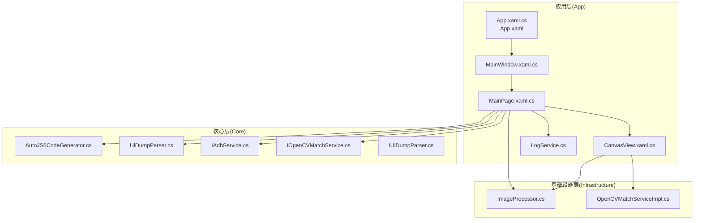
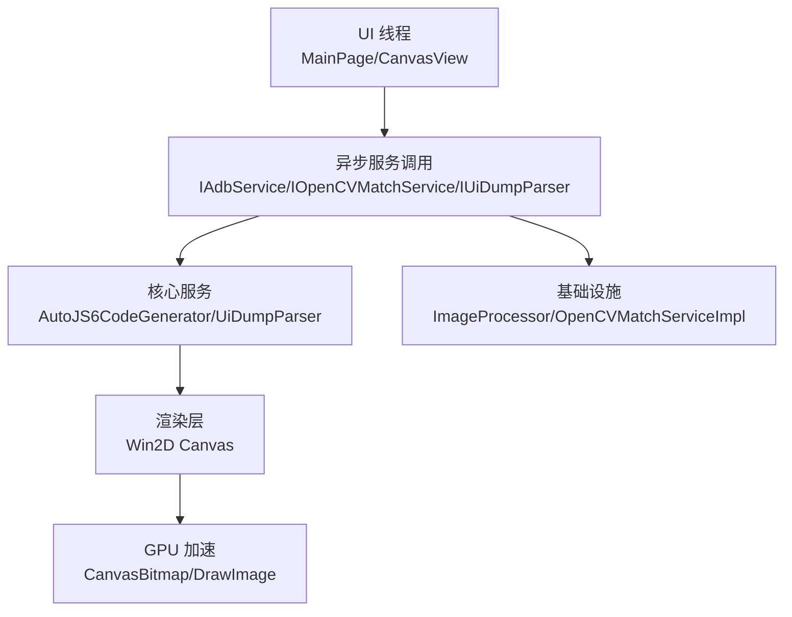
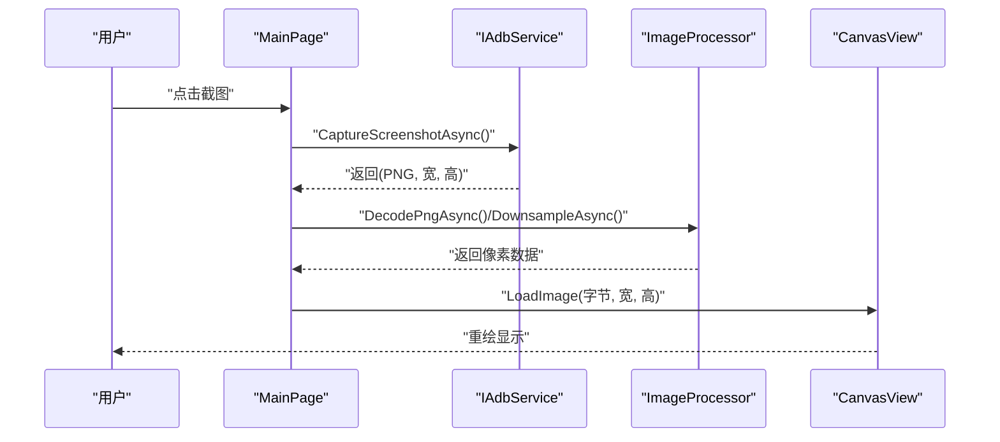
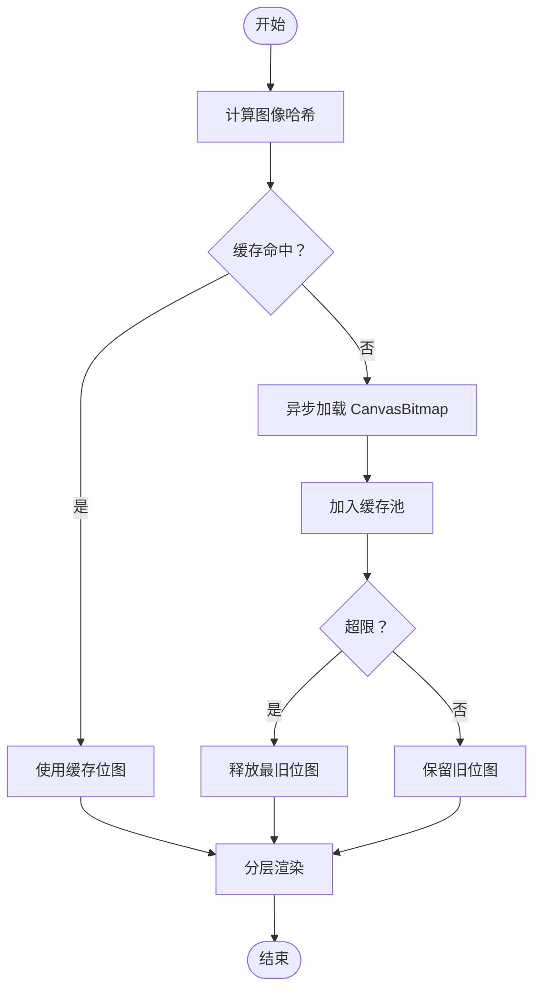
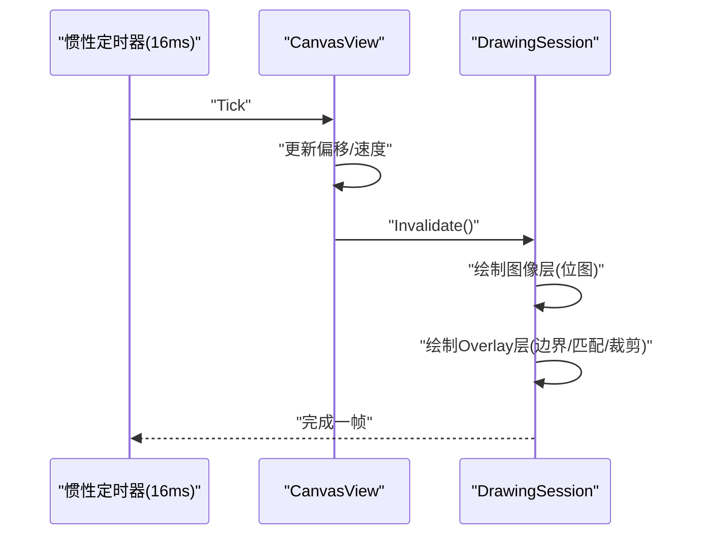
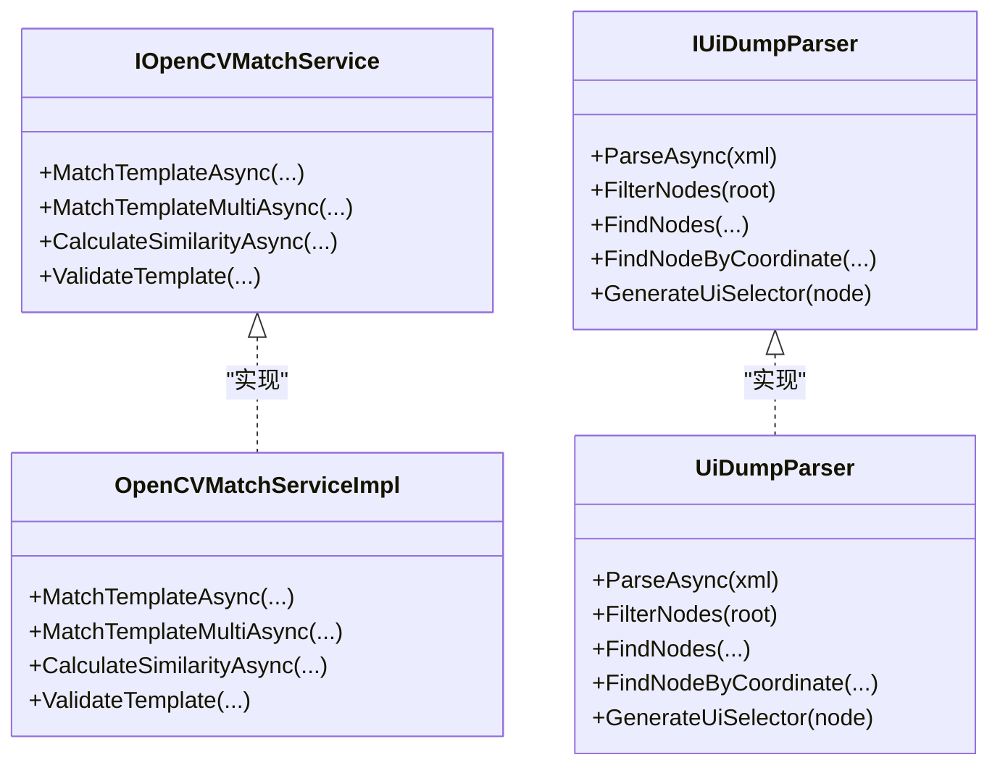
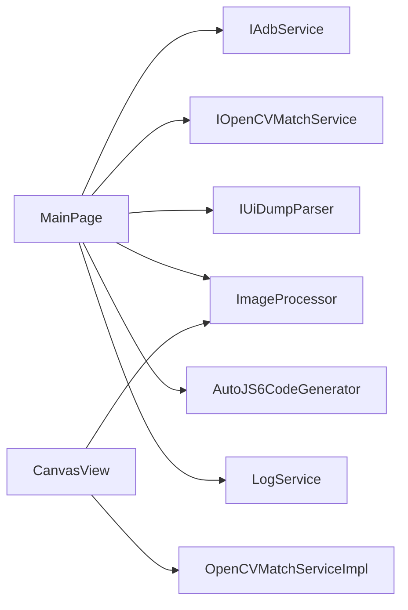

# 性能工程要求

<cite>
**本文档引用的文件**
- [App\App.xaml.cs](file://App\App.xaml.cs)
- [App\App.xaml](file://App\App.xaml)
- [App\MainWindow.xaml.cs](file://App\MainWindow.xaml.cs)
- [App\Views\MainPage.xaml.cs](file://App\Views\MainPage.xaml.cs)
- [App\Views\CanvasView.xaml.cs](file://App\Views\CanvasView.xaml.cs)
- [App\Services\LogService.cs](file://App\Services\LogService.cs)
- [Infrastructure\Imaging\ImageProcessor.cs](file://Infrastructure\Imaging\ImageProcessor.cs)
- [Infrastructure\Imaging\OpenCVMatchServiceImpl.cs](file://Infrastructure\Imaging\OpenCVMatchServiceImpl.cs)
- [Core\Services\AutoJS6CodeGenerator.cs](file://Core\Services\AutoJS6CodeGenerator.cs)
- [Core\Services\UiDumpParser.cs](file://Core\Services\UiDumpParser.cs)
- [Core\Abstractions\IAdbService.cs](file://Core\Abstractions\IAdbService.cs)
- [Core\Abstractions\IOpenCVMatchService.cs](file://Core\Abstractions\IOpenCVMatchService.cs)
- [Core\Abstractions\IUiDumpParser.cs](file://Core\Abstractions\IUiDumpParser.cs)
</cite>

## 目录
1. [引言](#引言)
2. [项目结构](#项目结构)
3. [核心组件](#核心组件)
4. [架构总览](#架构总览)
5. [详细组件分析](#详细组件分析)
6. [依赖关系分析](#依赖关系分析)
7. [性能考量](#性能考量)
8. [故障排查指南](#故障排查指南)
9. [结论](#结论)
10. [附录](#附录)

## 引言
本文件面向 AutoJS6 开发工具的性能工程要求，聚焦以下目标：
- 异步架构死规则：所有 I/O 必须异步、严禁阻塞 UI 线程
- 内存优化规则：Win2D 使用 CanvasBitmap 缓存池、阈值滑动时仅重算匹配层
- 渲染性能规则：确保 60FPS 流畅渲染、分层渲染仅重绘变化图层、启用 GPU 加速
- 模块规模规则：运行时、feature、action 模块的行数限制与拆分要求
- 最佳实践与常见问题解决方案

## 项目结构
项目采用分层架构，包含应用层（App）、核心业务层（Core）、基础设施层（Infrastructure），以及若干抽象接口定义。UI 使用 WinUI 3 + Win2D（DirectX）进行高性能渲染；图像处理与匹配通过 OpenCV 与 ImageSharp 实现；代码生成器遵循 AutoJS6 引擎约束。

图表来源
- [App\App.xaml.cs:1-57](file://App\App.xaml.cs#L1-57)
- [App\App.xaml:1-79](file://App\App.xaml#L1-79)
- [App\MainWindow.xaml.cs:1-53](file://App\MainWindow.xaml.cs#L1-53)
- [App\Views\MainPage.xaml.cs:1-409](file://App\Views\MainPage.xaml.cs#L1-409)
- [App\Views\CanvasView.xaml.cs:1-800](file://App\Views\CanvasView.xaml.cs#L1-800)
- [App\Services\LogService.cs:1-51](file://App\Services\LogService.cs#L1-51)
- [Infrastructure\Imaging\ImageProcessor.cs:1-162](file://Infrastructure\Imaging\ImageProcessor.cs#L1-162)
- [Infrastructure\Imaging\OpenCVMatchServiceImpl.cs:1-204](file://Infrastructure\Imaging\OpenCVMatchServiceImpl.cs#L1-204)
- [Core\Services\AutoJS6CodeGenerator.cs:1-357](file://Core\Services\AutoJS6CodeGenerator.cs#L1-357)
- [Core\Services\UiDumpParser.cs:1-263](file://Core\Services\UiDumpParser.cs#L1-263)
- [Core\Abstractions\IAdbService.cs:1-57](file://Core\Abstractions\IAdbService.cs#L1-57)
- [Core\Abstractions\IOpenCVMatchService.cs:1-57](file://Core\Abstractions\IOpenCVMatchService.cs#L1-57)
- [Core\Abstractions\IUiDumpParser.cs:1-56](file://Core\Abstractions\IUiDumpParser.cs#L1-56)

章节来源
- [App\App.xaml.cs:1-57](file://App\App.xaml.cs#L1-57)
- [App\App.xaml:1-79](file://App\App.xaml#L1-79)
- [App\MainWindow.xaml.cs:1-53](file://App\MainWindow.xaml.cs#L1-53)
- [App\Views\MainPage.xaml.cs:1-409](file://App\Views\MainPage.xaml.cs#L1-409)
- [App\Views\CanvasView.xaml.cs:1-800](file://App\Views\CanvasView.xaml.cs#L1-800)
- [App\Services\LogService.cs:1-51](file://App\Services\LogService.cs#L1-51)
- [Infrastructure\Imaging\ImageProcessor.cs:1-162](file://Infrastructure\Imaging\ImageProcessor.cs#L1-162)
- [Infrastructure\Imaging\OpenCVMatchServiceImpl.cs:1-204](file://Infrastructure\Imaging\OpenCVMatchServiceImpl.cs#L1-204)
- [Core\Services\AutoJS6CodeGenerator.cs:1-357](file://Core\Services\AutoJS6CodeGenerator.cs#L1-357)
- [Core\Services\UiDumpParser.cs:1-263](file://Core\Services\UiDumpParser.cs#L1-263)
- [Core\Abstractions\IAdbService.cs:1-57](file://Core\Abstractions\IAdbService.cs#L1-57)
- [Core\Abstractions\IOpenCVMatchService.cs:1-57](file://Core\Abstractions\IOpenCVMatchService.cs#L1-57)
- [Core\Abstractions\IUiDumpParser.cs:1-56](file://Core\Abstractions\IUiDumpParser.cs#L1-56)

## 核心组件
- 应用入口与窗口管理：负责应用生命周期与主窗口初始化，确保 UI 线程不被阻塞。
- 主页面逻辑：封装设备交互、截图、UI 树拉取、模板选择、阈值滑动、代码生成等流程，所有 I/O 均为异步。
- 画布渲染：基于 Win2D 的分层渲染（图像层 + Overlay 层），支持 CanvasBitmap 缓存池、惯性滑动、60FPS 定时刷新。
- 图像处理：ImageSharp 异步解码、降采样、裁剪、元数据生成与尺寸查询。
- 匹配引擎：OpenCV 模板匹配与相似度计算，封装为异步服务接口。
- UI Dump 解析：异步解析 XML，构建控件树并提供筛选、查找与选择器生成。
- 代码生成器：根据选项生成 AutoJS6 脚本，满足引擎语法约束与重试逻辑。
- 日志服务：统一日志入口，避免直接在 UI 线程写 IO。

章节来源
- [App\App.xaml.cs:1-57](file://App\App.xaml.cs#L1-57)
- [App\MainWindow.xaml.cs:1-53](file://App\MainWindow.xaml.cs#L1-53)
- [App\Views\MainPage.xaml.cs:1-409](file://App\Views\MainPage.xaml.cs#L1-409)
- [App\Views\CanvasView.xaml.cs:1-800](file://App\Views\CanvasView.xaml.cs#L1-800)
- [Infrastructure\Imaging\ImageProcessor.cs:1-162](file://Infrastructure\Imaging\ImageProcessor.cs#L1-162)
- [Infrastructure\Imaging\OpenCVMatchServiceImpl.cs:1-204](file://Infrastructure\Imaging\OpenCVMatchServiceImpl.cs#L1-204)
- [Core\Services\UiDumpParser.cs:1-263](file://Core\Services\UiDumpParser.cs#L1-263)
- [Core\Services\AutoJS6CodeGenerator.cs:1-357](file://Core\Services\AutoJS6CodeGenerator.cs#L1-357)
- [App\Services\LogService.cs:1-51](file://App\Services\LogService.cs#L1-51)

## 架构总览
系统采用“UI 异步 + 分层渲染 + 缓存池 + GPU 加速”的高性能设计，确保流畅交互与实时反馈。

图表来源
- [App\Views\MainPage.xaml.cs:147-248](file://App\Views\MainPage.xaml.cs#L147-248)
- [App\Views\CanvasView.xaml.cs:568-800](file://App\Views\CanvasView.xaml.cs#L568-800)
- [Infrastructure\Imaging\OpenCVMatchServiceImpl.cs:13-60](file://Infrastructure\Imaging\OpenCVMatchServiceImpl.cs#L13-60)
- [Infrastructure\Imaging\ImageProcessor.cs:21-72](file://Infrastructure\Imaging\ImageProcessor.cs#L21-72)
- [Core\Services\UiDumpParser.cs:14-35](file://Core\Services\UiDumpParser.cs#L14-35)
- [Core\Services\AutoJS6CodeGenerator.cs:13-102](file://Core\Services\AutoJS6CodeGenerator.cs#L13-102)

## 详细组件分析

### 异步架构与 UI 线程保护
- 所有 I/O 操作均通过异步接口与方法实现，避免阻塞 UI 线程。
- 关键异步调用包括：截图捕获、UI 树拉取、模板匹配、图像解码与降采样、文件保存等。
- UI 事件处理（按钮点击、滑块变更、键盘输入）均在 UI 线程中触发，但内部执行逻辑通过 await 异步完成。

图表来源
- [App\Views\MainPage.xaml.cs:147-178](file://App\Views\MainPage.xaml.cs#L147-178)
- [Infrastructure\Imaging\ImageProcessor.cs:21-72](file://Infrastructure\Imaging\ImageProcessor.cs#L21-72)
- [App\Views\CanvasView.xaml.cs:358-426](file://App\Views\CanvasView.xaml.cs#L358-426)
- [Core\Abstractions\IAdbService.cs](file://Core\Abstractions\IAdbService.cs#L22)

章节来源
- [App\Views\MainPage.xaml.cs:147-248](file://App\Views\MainPage.xaml.cs#L147-248)
- [Infrastructure\Imaging\ImageProcessor.cs:21-72](file://Infrastructure\Imaging\ImageProcessor.cs#L21-72)
- [App\Views\CanvasView.xaml.cs:358-426](file://App\Views\CanvasView.xaml.cs#L358-426)
- [Core\Abstractions\IAdbService.cs:10-37](file://Core\Abstractions\IAdbService.cs#L10-37)

### 内存优化：CanvasBitmap 缓存池与阈值滑动重算
- CanvasBitmap 缓存池：以图像哈希为键缓存位图，限制最大缓存数量，避免重复创建 GPU 纹理，降低内存抖动与 GC 压力。
- 阈值滑动仅重算匹配层：在 CanvasView 中，Overlay 层仅重绘变化部分（控件边界、匹配框、裁剪区域），不重建图像层，显著减少绘制开销。
- 位图生命周期管理：加载新图像时先清空当前位图指针，再异步加载并加入缓存，最后释放不再使用的旧位图。

图表来源
- [App\Views\CanvasView.xaml.cs:358-456](file://App\Views\CanvasView.xaml.cs#L358-456)
- [App\Views\CanvasView.xaml.cs:568-627](file://App\Views\CanvasView.xaml.cs#L568-627)

章节来源
- [App\Views\CanvasView.xaml.cs:48-50](file://App\Views\CanvasView.xaml.cs#L48-50)
- [App\Views\CanvasView.xaml.cs:358-456](file://App\Views\CanvasView.xaml.cs#L358-456)
- [App\Views\CanvasView.xaml.cs:568-627](file://App\Views\CanvasView.xaml.cs#L568-627)

### 渲染性能：60FPS、分层渲染与 GPU 加速
- 60FPS 定时器：惯性滑动使用 16ms 间隔的 DispatcherTimer，保证约 60FPS 的平滑滚动体验。
- 分层渲染：图像层（底层）绘制 CanvasBitmap，Overlay 层（上层）绘制控件边界、匹配框、裁剪区域，两者共享同一变换矩阵，减少状态切换。
- GPU 加速：Win2D 使用 CanvasBitmap 与 DrawImage，底层由 DirectX 驱动，充分利用 GPU。
- 变化图层重绘：仅在 Overlay 层数据变化时调用 Invalidate，避免全屏重绘。

图表来源
- [App\Views\CanvasView.xaml.cs:106-138](file://App\Views\CanvasView.xaml.cs#L106-138)
- [App\Views\CanvasView.xaml.cs:568-627](file://App\Views\CanvasView.xaml.cs#L568-627)

章节来源
- [App\Views\CanvasView.xaml.cs:95-101](file://App\Views\CanvasView.xaml.cs#L95-101)
- [App\Views\CanvasView.xaml.cs:106-138](file://App\Views\CanvasView.xaml.cs#L106-138)
- [App\Views\CanvasView.xaml.cs:568-627](file://App\Views\CanvasView.xaml.cs#L568-627)

### 模块规模规则（建议）
- 运行时模块：建议单文件不超过 500 行，复杂逻辑拆分为多个小文件，保持职责单一。
- Feature 模块：建议单文件不超过 300 行，每个功能点独立文件，便于测试与维护。
- Action 模块：建议单文件不超过 200 行，动作粒度小、复用性强。
- 以上规则为通用建议，需结合实际代码复杂度与团队约定执行。

[本节为通用规范说明，不直接分析具体文件，故无章节来源]

### 匹配与 UI 解析：异步与性能
- OpenCV 模板匹配：封装为异步接口，内部使用 Task.Run 执行 CPU 密集型计算，避免阻塞 UI 线程。
- UI Dump 解析：异步解析 XML 并构建控件树，提供过滤、查找与选择器生成，减少主线程压力。
- 图像处理：ImageSharp 提供异步解码与降采样，支持取消令牌，提升交互响应。

图表来源
- [Core\Abstractions\IOpenCVMatchService.cs:8-56](file://Core\Abstractions\IOpenCVMatchService.cs#L8-56)
- [Infrastructure\Imaging\OpenCVMatchServiceImpl.cs:11-204](file://Infrastructure\Imaging\OpenCVMatchServiceImpl.cs#L11-204)
- [Core\Abstractions\IUiDumpParser.cs:8-56](file://Core\Abstractions\IUiDumpParser.cs#L8-56)
- [Core\Services\UiDumpParser.cs:12-263](file://Core\Services\UiDumpParser.cs#L12-263)

章节来源
- [Infrastructure\Imaging\OpenCVMatchServiceImpl.cs:13-122](file://Infrastructure\Imaging\OpenCVMatchServiceImpl.cs#L13-122)
- [Core\Services\UiDumpParser.cs:14-97](file://Core\Services\UiDumpParser.cs#L14-97)

### 代码生成：引擎约束与格式化
- AutoJS6 代码生成器严格遵循引擎 API 约束，支持重试逻辑、回收机制与格式化输出。
- 对 Rhino 引擎的语法限制进行校验，避免在循环体内使用 const/let。

章节来源
- [Core\Services\AutoJS6CodeGenerator.cs:13-102](file://Core\Services\AutoJS6CodeGenerator.cs#L13-102)
- [Core\Services\AutoJS6CodeGenerator.cs:226-258](file://Core\Services\AutoJS6CodeGenerator.cs#L226-258)
- [Core\Services\AutoJS6CodeGenerator.cs:191-224](file://Core\Services\AutoJS6CodeGenerator.cs#L191-224)

## 依赖关系分析
- UI 依赖于各服务接口，通过构造注入或直接实例化具体实现。
- CanvasView 依赖图像处理与匹配服务，实现高性能渲染与交互。
- 日志服务作为全局单例，统一输出，避免分散 IO。

图表来源
- [App\Views\MainPage.xaml.cs:48-50](file://App\Views\MainPage.xaml.cs#L48-50)
- [App\Views\CanvasView.xaml.cs:1-16](file://App\Views\CanvasView.xaml.cs#L1-16)
- [App\Services\LogService.cs:39-49](file://App\Services\LogService.cs#L39-49)

章节来源
- [App\Views\MainPage.xaml.cs:48-60](file://App\Views\MainPage.xaml.cs#L48-60)
- [App\Views\CanvasView.xaml.cs:1-16](file://App\Views\CanvasView.xaml.cs#L1-16)
- [App\Services\LogService.cs:39-49](file://App\Services\LogService.cs#L39-49)

## 性能考量
- 异步优先：所有 I/O 与 CPU 密集型任务均应异步化，并提供取消支持。
- 渲染优化：分层渲染 + 变化图层重绘 + CanvasBitmap 缓存池 + 60FPS 定时器。
- 内存管理：控制缓存大小、及时释放不再使用的位图、避免频繁创建/销毁对象。
- GPU 加速：使用 Win2D 的 CanvasBitmap 与 DrawImage，确保渲染路径走 GPU。
- UI 线程保护：避免在 UI 线程中执行长时间任务，使用后台线程与进度反馈。

[本节提供通用指导，不直接分析具体文件，故无章节来源]

## 故障排查指南
- 截图失败：检查设备连接状态与权限请求，确认 IAdbService 的异步调用是否正确 await。
- UI 树解析异常：查看日志服务输出，确认 XML 内容有效性与解析流程。
- 匹配结果为空：检查模板有效性、阈值设置与搜索区域，确认 OpenCV 服务返回。
- 渲染卡顿：检查 Overlay 层绘制数量与缓存命中率，避免不必要的 Invalidate 调用。
- 日志无输出：确认日志服务单例与事件订阅是否正确。

章节来源
- [App\Views\MainPage.xaml.cs:174-178](file://App\Views\MainPage.xaml.cs#L174-178)
- [App\Services\LogService.cs:39-49](file://App\Services\LogService.cs#L39-49)
- [Infrastructure\Imaging\OpenCVMatchServiceImpl.cs:13-60](file://Infrastructure\Imaging\OpenCVMatchServiceImpl.cs#L13-60)
- [Core\Services\UiDumpParser.cs:14-35](file://Core\Services\UiDumpParser.cs#L14-35)

## 结论
通过严格的异步架构、分层渲染与 CanvasBitmap 缓存池，配合 60FPS 定时器与 GPU 加速，AutoJS6 开发工具能够在复杂图像与 UI 场景下保持流畅交互。建议在模块规模、内存管理与渲染路径上持续优化，确保长期可维护性与高性能表现。

[本节为总结性内容，不直接分析具体文件，故无章节来源]

## 附录
- 异步接口清单
  - [IAdbService.cs:10-55](file://Core\Abstractions\IAdbService.cs#L10-55)
  - [IOpenCVMatchService.cs:10-55](file://Core\Abstractions\IOpenCVMatchService.cs#L10-55)
  - [IUiDumpParser.cs:10-47](file://Core\Abstractions\IUiDumpParser.cs#L10-47)

- 关键实现参考
  - [MainPage.xaml.cs:147-248](file://App\Views\MainPage.xaml.cs#L147-248)
  - [CanvasView.xaml.cs:358-456](file://App\Views\CanvasView.xaml.cs#L358-456)
  - [ImageProcessor.cs:21-72](file://Infrastructure\Imaging\ImageProcessor.cs#L21-72)
  - [OpenCVMatchServiceImpl.cs:13-122](file://Infrastructure\Imaging\OpenCVMatchServiceImpl.cs#L13-122)
  - [UiDumpParser.cs:14-97](file://Core\Services\UiDumpParser.cs#L14-97)
  - [AutoJS6CodeGenerator.cs:13-102](file://Core\Services\AutoJS6CodeGenerator.cs#L13-102)