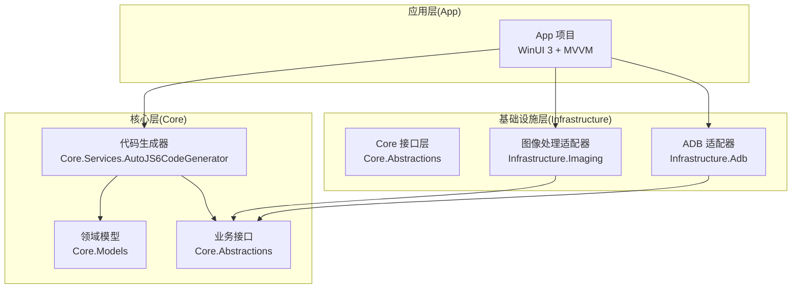
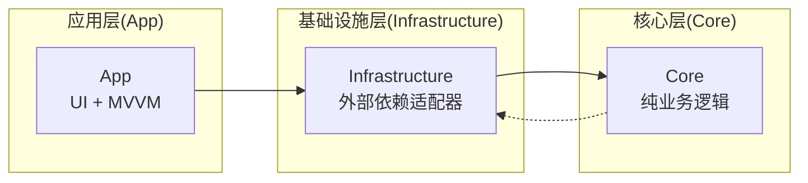
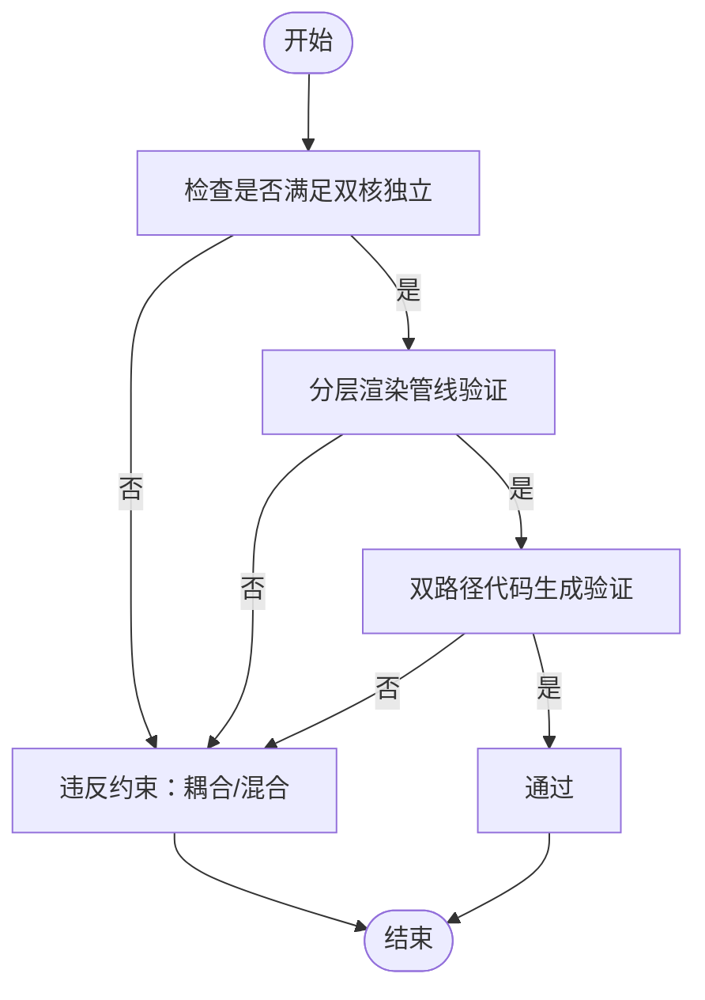
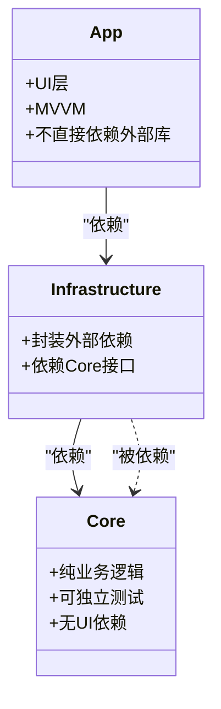
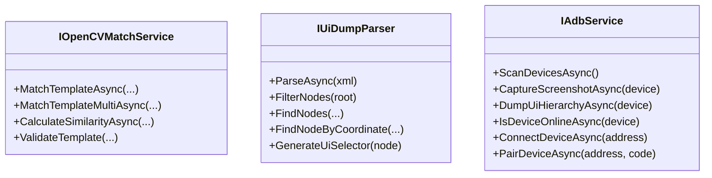
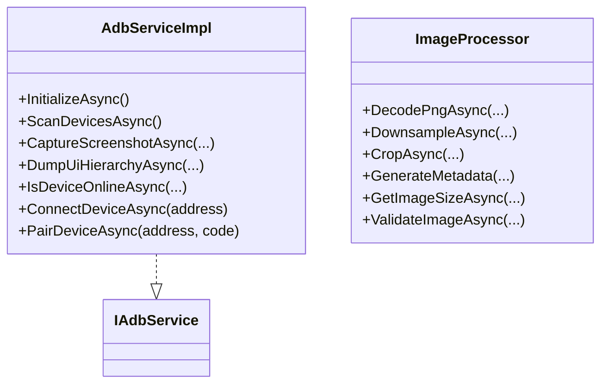

# 架构约束规则

<cite>
**本文引用的文件**   
- [README.md](file://README.md)
- [AGENTS.md](file://AGENTS.md)
- [DEVELOPMENT.md](file://DEVELOPMENT.md)
- [Core/Core.csproj](file://Core/Core.csproj)
- [Infrastructure/Infrastructure.csproj](file://Infrastructure/Infrastructure.csproj)
- [App/App.csproj](file://App/App.csproj)
- [Core/Services/AutoJS6CodeGenerator.cs](file://Core/Services/AutoJS6CodeGenerator.cs)
- [Core/Abstractions/IAdbService.cs](file://Core/Abstractions/IAdbService.cs)
- [Core/Abstractions/IOpenCVMatchService.cs](file://Core/Abstractions/IOpenCVMatchService.cs)
- [Core/Abstractions/IUiDumpParser.cs](file://Core/Abstractions/IUiDumpParser.cs)
- [Infrastructure/Adb/AdbServiceImpl.cs](file://Infrastructure/Adb/AdbServiceImpl.cs)
- [Infrastructure/Imaging/ImageProcessor.cs](file://Infrastructure/Imaging/ImageProcessor.cs)
</cite>

## 目录
1. [引言](#引言)
2. [项目结构](#项目结构)
3. [核心组件](#核心组件)
4. [架构总览](#架构总览)
5. [详细组件分析](#详细组件分析)
6. [依赖分析](#依赖分析)
7. [性能考量](#性能考量)
8. [故障排查指南](#故障排查指南)
9. [结论](#结论)
10. [附录](#附录)

## 引言
本文件系统性阐述 AutoJS6 开发工具的架构约束规则，聚焦“双核独立架构”的强制要求：图像处理引擎与 UI 图层分析引擎完全解耦；分层渲染管线的实现要求；双路径代码生成严格独立；以及项目层依赖关系硬规则（Core 为纯类库、Infrastructure 封装外部依赖、App 仅负责 UI 与 MVVM）。文档还提供禁止事项清单、违反约束的严重后果与正确的实施方法，帮助开发者在实现中严格遵守这些不可逾越的规则。

## 项目结构
项目采用 Clean Architecture 分层组织，三层职责清晰：
- Core：纯业务逻辑层，不含 UI 与外部依赖，可独立测试
- Infrastructure：封装外部依赖（ADB、OpenCV、ImageSharp 等），为 Core 提供适配器
- App：WinUI 3 应用层，仅负责 UI 与 MVVM，通过 Core/Infrastructure 访问业务能力



图表来源
- [App/App.csproj:67-67](file://App/App.csproj#L67-L67)
- [Infrastructure/Infrastructure.csproj:10-11](file://Infrastructure/Infrastructure.csproj#L10-L11)
- [Core/Core.csproj:1-10](file://Core/Core.csproj#L1-L10)

章节来源
- [README.md:230-280](file://README.md#L230-L280)
- [AGENTS.md:69-95](file://AGENTS.md#L69-L95)

## 核心组件
- 图像处理引擎（像素级）：负责截图捕获、模板匹配、区域裁剪与元数据生成，输出绝对像素坐标
- UI 图层分析引擎（控件级）：负责 UI Dump 解析、控件过滤与 UiSelector 生成，输出选择器链
- 分层渲染管线（Win2D）：CanvasImageLayer（底层位图）+ CanvasOverlayLayer（上层控件边界框），二者独立变换与渲染
- 双路径代码生成：图像模式生成 images.findImage(...) + click()；控件模式生成 UiSelector 链 + click()

章节来源
- [README.md:168-227](file://README.md#L168-L227)
- [AGENTS.md:40-66](file://AGENTS.md#L40-L66)

## 架构总览
双核独立架构的强制规则与项目层依赖关系如下：



图表来源
- [AGENTS.md:69-95](file://AGENTS.md#L69-L95)
- [App/App.csproj:67-67](file://App/App.csproj#L67-L67)
- [Infrastructure/Infrastructure.csproj:10-11](file://Infrastructure/Infrastructure.csproj#L10-L11)

章节来源
- [AGENTS.md:69-95](file://AGENTS.md#L69-L95)

## 详细组件分析

### 组件一：双核独立架构（强制规则）
- 图像引擎与 UI 引擎完全解耦：数据源、处理管线、渲染逻辑、代码生成路径严格分离
- 分层渲染管线：CanvasImageLayer 与 CanvasOverlayLayer 独立管理，缩放/平移/旋转仅影响图像层，控件边界框独立绘制
- 双路径代码生成：图像模式与控件模式互斥，禁止混合使用



图表来源
- [AGENTS.md:40-66](file://AGENTS.md#L40-L66)
- [README.md:184-189](file://README.md#L184-L189)

章节来源
- [AGENTS.md:40-66](file://AGENTS.md#L40-L66)
- [README.md:184-189](file://README.md#L184-L189)

### 组件二：项目层依赖关系硬规则
- Core 为纯类库：无项目内部依赖，可独立测试，禁止依赖 UI 框架与外部库
- Infrastructure 封装外部依赖：隔离技术细节，仅依赖 Core 接口
- App 仅负责 UI 与 MVVM：不直接依赖外部库，通过 Core/Infrastructure 访问业务能力



图表来源
- [AGENTS.md:69-95](file://AGENTS.md#L69-L95)
- [App/App.csproj:67-67](file://App/App.csproj#L67-L67)
- [Infrastructure/Infrastructure.csproj:10-11](file://Infrastructure/Infrastructure.csproj#L10-L11)
- [Core/Core.csproj:1-10](file://Core/Core.csproj#L1-L10)

章节来源
- [AGENTS.md:69-95](file://AGENTS.md#L69-L95)

### 组件三：图像处理引擎与 UI 引擎接口契约
- 图像引擎接口：模板匹配、相似度计算、区域匹配等
- UI 引擎接口：UI Dump 解析、节点过滤、坐标查询、UiSelector 生成
- ADB 服务接口：设备扫描、截图捕获、UI Dump、设备状态



图表来源
- [Core/Abstractions/IOpenCVMatchService.cs:1-57](file://Core/Abstractions/IOpenCVMatchService.cs#L1-L57)
- [Core/Abstractions/IUiDumpParser.cs:1-56](file://Core/Abstractions/IUiDumpParser.cs#L1-L56)
- [Core/Abstractions/IAdbService.cs:1-57](file://Core/Abstractions/IAdbService.cs#L1-L57)

章节来源
- [Core/Abstractions/IOpenCVMatchService.cs:1-57](file://Core/Abstractions/IOpenCVMatchService.cs#L1-L57)
- [Core/Abstractions/IUiDumpParser.cs:1-56](file://Core/Abstractions/IUiDumpParser.cs#L1-L56)
- [Core/Abstractions/IAdbService.cs:1-57](file://Core/Abstractions/IAdbService.cs#L1-L57)

### 组件四：代码生成器（双路径严格独立）
- 图像模式：生成 images.findImage(...) + click()，支持重试与回收
- 控件模式：生成 UiSelector 链 + click()，支持主备选择器与重试
- 代码校验：确保 Rhino 引擎约束（循环体内使用 var）

```mermaid
sequenceDiagram
participant VM as "视图模型"
participant GEN as "代码生成器"
participant OPT as "选项(AutoJS6CodeOptions)"
VM->>GEN : "GenerateFullScript(options)"
GEN->>OPT : "读取模式(Image/Widget)"
alt "图像模式"
GEN->>GEN : "GenerateImageModeCode()"
GEN-->>VM : "返回图像模式代码"
else "控件模式"
GEN->>GEN : "GenerateWidgetModeCode()"
GEN-->>VM : "返回控件模式代码"
end
GEN->>GEN : "ValidateCode(code)"
GEN-->>VM : "返回校验结果"
```

图表来源
- [Core/Services/AutoJS6CodeGenerator.cs:166-189](file://Core/Services/AutoJS6CodeGenerator.cs#L166-L189)
- [Core/Services/AutoJS6CodeGenerator.cs:104-164](file://Core/Services/AutoJS6CodeGenerator.cs#L104-L164)
- [Core/Services/AutoJS6CodeGenerator.cs:226-258](file://Core/Services/AutoJS6CodeGenerator.cs#L226-L258)

章节来源
- [Core/Services/AutoJS6CodeGenerator.cs:1-357](file://Core/Services/AutoJS6CodeGenerator.cs#L1-L357)

### 组件五：外部依赖适配器
- ADB 适配器：封装 SharpAdbClient，提供截图、UI Dump、设备管理能力
- 图像处理适配器：封装 SixLabors.ImageSharp，提供 PNG 解码、降采样、裁剪、元数据生成



图表来源
- [Infrastructure/Adb/AdbServiceImpl.cs:17-238](file://Infrastructure/Adb/AdbServiceImpl.cs#L17-L238)
- [Infrastructure/Imaging/ImageProcessor.cs:13-162](file://Infrastructure/Imaging/ImageProcessor.cs#L13-L162)
- [Core/Abstractions/IAdbService.cs:8-56](file://Core/Abstractions/IAdbService.cs#L8-L56)

章节来源
- [Infrastructure/Adb/AdbServiceImpl.cs:1-238](file://Infrastructure/Adb/AdbServiceImpl.cs#L1-L238)
- [Infrastructure/Imaging/ImageProcessor.cs:1-162](file://Infrastructure/Imaging/ImageProcessor.cs#L1-L162)

## 依赖分析
- 单向依赖：App → Infrastructure → Core ← Infrastructure
- Core 不依赖 App 或 Infrastructure，确保纯业务与可测试性
- Infrastructure 仅依赖 Core 接口，隔离外部依赖


图表来源
- [AGENTS.md:69-95](file://AGENTS.md#L69-L95)
- [App/App.csproj:67-67](file://App/App.csproj#L67-L67)
- [Infrastructure/Infrastructure.csproj:10-11](file://Infrastructure/Infrastructure.csproj#L10-L11)
- [Core/Core.csproj:1-10](file://Core/Core.csproj#L1-L10)

章节来源
- [AGENTS.md:69-95](file://AGENTS.md#L69-L95)

## 性能考量
- 异步优先：所有 I/O（ADB、OpenCV、XML 解析、纹理上传）使用 async/await，UI 线程永不阻塞
- 渲染性能：Win2D GPU 加速、60 FPS 流畅渲染、分层渲染仅重绘变化图层
- 内存优化：CanvasBitmap 缓存池、阈值滑动仅重算匹配层、控件树虚拟化

章节来源
- [AGENTS.md:229-253](file://AGENTS.md#L229-L253)
- [README.md:184-189](file://README.md#L184-L189)

## 故障排查指南
- 双核独立违反
  - 现象：图像与控件坐标转换耦合、单层混合渲染、统一引擎处理
  - 排查：确认渲染层分离、代码生成路径独立、接口契约未被绕过
  - 参考：AGENTS.md 中的双核独立与禁止事项
- 项目层依赖违规
  - 现象：Core 依赖 App/Infrastructure、循环依赖、单体项目
  - 排查：检查 csproj 依赖关系、接口注入与抽象边界
  - 参考：AGENTS.md 项目层依赖规则
- 代码生成约束违规
  - 现象：Rhino 循环体内使用 const/let、OOM 风险、模板裁剪不当
  - 排查：ValidateCode 校验、生成逻辑与 OOM 规则
  - 参考：AGENTS.md 与 Core/Services/AutoJS6CodeGenerator.cs 的约束与校验

章节来源
- [AGENTS.md:40-95](file://AGENTS.md#L40-L95)
- [Core/Services/AutoJS6CodeGenerator.cs:226-258](file://Core/Services/AutoJS6CodeGenerator.cs#L226-L258)

## 结论
本规则文档确立了 AutoJS6 开发工具的不可逾越架构边界：双核独立、分层渲染、双路径代码生成与严格的单向依赖。任何违反都将导致系统复杂度上升、可测试性下降、渲染与性能退化。请在实现中严格遵循，确保工具的可用性、稳定性与可维护性。

## 附录

### 禁止事项清单
- 禁止统一引擎处理图像与控件
- 禁止单层混合渲染
- 禁止图像坐标与控件坐标转换耦合
- 禁止 Core 依赖 App/Infrastructure
- 禁止循环依赖与单体项目
- 禁止在 Rhino 循环体内使用 const/let
- 禁止 OOM 风险行为（多截图、全屏扫描、不回收）

章节来源
- [AGENTS.md:61-95](file://AGENTS.md#L61-L95)
- [README.md:342-374](file://README.md#L342-L374)