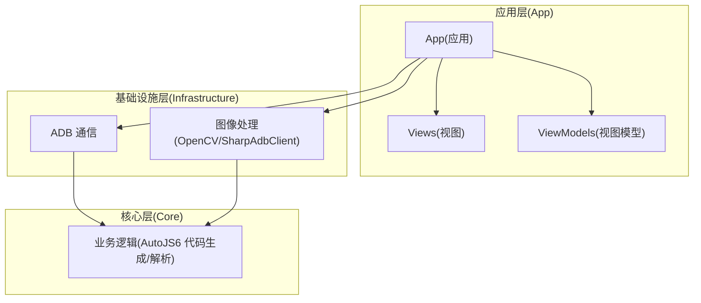
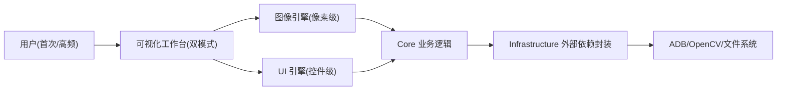
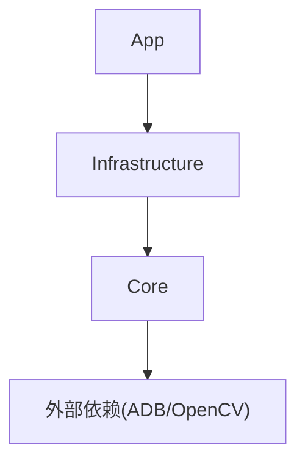

# 用户体验优先原则

<cite>
**本文引用的文件**
- [README.md](file://README.md)
- [README_zh_CN.md](file://README_zh_CN.md)
- [AGENTS.md](file://AGENTS.md)
- [checklist.md](file://checklist.md)
- [manual.md](file://manual.md)
- [App.xaml](file://App/App.xaml)
- [App.xaml.cs](file://App/App.xaml.cs)
- [MainPage.xaml](file://App/Views/MainPage.xaml)
- [App.csproj](file://App/App.csproj)
- [Core.csproj](file://Core/Core.csproj)
</cite>

## 目录
1. [引言](#引言)
2. [项目结构](#项目结构)
3. [核心组件](#核心组件)
4. [架构总览](#架构总览)
5. [详细组件分析](#详细组件分析)
6. [依赖分析](#依赖分析)
7. [性能考量](#性能考量)
8. [故障排查指南](#故障排查指南)
9. [结论](#结论)
10. [附录](#附录)

## 引言
本文件围绕 AutoJS6 可视化开发工具的“用户体验优先原则”展开，结合项目现状与设计约束，系统阐述如何从首次使用者与高频重度使用者两个视角评估设计方案，如何减少操作步骤、等待时间、打断频率、理解难度与出错成本，并明确“用户可见内容必须清晰、直接、可立即理解”的设计原则与“禁止暴露内部实现思路”的限制。同时提供可操作的实施检查清单，覆盖功能易理解性、按钮价值、反馈非阻塞性、结果可用性与界面稳定性等评估标准。

## 项目结构
AutoJS6 工具采用 WinUI 3 桌面应用 + Clean Architecture 分层设计，核心分为三层：
- App 层：WinUI 视图与 MVVM，负责用户交互与界面呈现
- Infrastructure 层：封装外部依赖（ADB、OpenCV、ImageSharp 等）
- Core 层：纯业务逻辑（无 UI 依赖），独立可测试

项目同时强调“双引擎独立”（图像引擎与 UI 引擎完全解耦）与“异步非阻塞”（所有 I/O 异步、UI 流畅）两大工程原则，确保工具在高频调试场景下的稳定性与可用性。

图表来源
- [App.csproj:67-68](file://App/App.csproj#L67-L68)
- [Core.csproj:1-10](file://Core/Core.csproj#L1-L10)

章节来源
- [README.md:264-287](file://README.md#L264-L287)
- [README_zh_CN.md:264-287](file://README_zh_CN.md#L264-L287)
- [App.csproj:67-68](file://App/App.csproj#L67-L68)
- [Core.csproj:1-10](file://Core/Core.csproj#L1-L10)

## 核心组件
- 可视化工作台：双模式（图像模式/控件模式）一体化工作台，支持截图、裁剪、阈值调节、UI 树解析、代码生成与日志反馈
- 双引擎架构：图像引擎（像素级）与 UI 引擎（控件级）严格隔离，渲染与代码生成路径独立
- 异步非阻塞：所有 I/O 操作异步执行，保障 UI 流畅与响应
- 代码生成约束：严格遵循 AutoJS6 运行时约束（Rhino 引擎、OOM 预防、模板裁剪规则等）

章节来源
- [README.md:166-227](file://README.md#L166-L227)
- [README_zh_CN.md:166-227](file://README_zh_CN.md#L166-L227)
- [AGENTS.md:40-95](file://AGENTS.md#L40-L95)

## 架构总览
用户体验优先原则贯穿架构设计：
- 双引擎独立：避免耦合导致的复杂交互与理解成本上升
- 单向依赖：App → Infrastructure → Core，降低模块间相互影响
- 异步优先：减少等待与卡顿，提升连续操作体验
- 界面简洁：用户可见内容清晰、直接、可立即理解，避免暴露内部实现

图表来源
- [AGENTS.md:40-95](file://AGENTS.md#L40-L95)
- [README.md:264-287](file://README.md#L264-L287)

章节来源
- [AGENTS.md:40-95](file://AGENTS.md#L40-L95)
- [README.md:264-287](file://README.md#L264-L287)

## 详细组件分析

### 用户体验优先规则与实施要点
- 双视角评估：每次设计先问“首次使用者能否一眼看懂下一步？”“高频用户能否减少一次点击/等待/打断？”
- 五减原则：减少步骤、等待、打断、猜测、出错成本
- 明确可见：用户看到的内容必须清晰、直接、可立即理解
- 禁止暴露：不得将内部实现思路、开发任务描述或临时指令暴露给用户
- 反馈非阻塞：反馈必须可预期、不打断连续操作
- 结果可用：复制/保存/导出的产物可直接使用，无需二次加工

章节来源
- [AGENTS.md:3-27](file://AGENTS.md#L3-L27)

### 实施检查清单（可直接对照验证）
- 功能易理解性：入口与按钮是否一眼可知用途与收益
- 按钮价值：每个按钮是否带来直接价值，而非制造额外步骤
- 反馈非阻塞性：Toast/状态提示是否频繁遮挡主操作区
- 结果可用性：复制/保存/导出是否可直接使用
- 界面稳定性：是否存在抖动、裁切、卡死、崩溃
- 主流程无阻塞：常见操作是否无明显卡死
- 模式切换：切换后界面状态是否符合预期，不残留上一模式错误状态

章节来源
- [checklist.md:107-126](file://checklist.md#L107-L126)

### 界面与交互设计原则
- 风格与样式：统一的主题样式、按钮风格与字体层级，确保一致性与可读性
- 模式切换：图像模式/控件模式切换直观，状态栏与工具栏随模式动态显示/隐藏
- 操作反馈：状态栏、Toast 与日志面板提供非阻塞性反馈
- 代码预览：代码查看与复制流程顺畅，避免二次跳转

章节来源
- [App.xaml:13-76](file://App/App.xaml#L13-L76)
- [MainPage.xaml:135-166](file://App/Views/MainPage.xaml#L135-L166)
- [MainPage.xaml:641-718](file://App/Views/MainPage.xaml#L641-L718)

### 代码生成与 AutoJS6 约束
- Rhino 引擎约束：循环体内使用 var，避免 const/let 导致的变量不重绑问题
- OOM 预防：单轮单截图、按目标最小化、region 优先、及时回收
- 模板裁剪规则：优先保留文字、图标、固定边框，排除红点、数字、倒计时等动态元素
- 坐标系与对齐：左上角原点，像素坐标与控件坐标直接对应，简化联动逻辑

章节来源
- [AGENTS.md:152-226](file://AGENTS.md#L152-L226)
- [README.md:342-373](file://README.md#L342-L373)
- [README_zh_CN.md:342-373](file://README_zh_CN.md#L342-L373)

### 日志与反馈机制
- 日志面板：可折叠/展开，支持清空、复制、全选
- 状态栏：显示模式、缩放、分辨率、匹配摘要等关键信息
- Toast 反馈：非阻塞性提示，避免打断连续操作

章节来源
- [MainPage.xaml:641-718](file://App/Views/MainPage.xaml#L641-L718)
- [MainPage.xaml:720-741](file://App/Views/MainPage.xaml#L720-L741)

### 可靠性与稳定性
- 连续操作稳定性：连续截图、匹配、生成代码不应出现状态错乱
- 失败场景提示：失败时给出明确提示，不伪造命中结果
- 状态提示清晰：无设备、无截图、无模板、UI 树解析失败等场景提示明确

章节来源
- [checklist.md:88-94](file://checklist.md#L88-L94)
- [checklist.md:107-118](file://checklist.md#L107-L118)

## 依赖分析
- 分层依赖：App → Infrastructure → Core，Core 无 UI 依赖，可独立测试
- 外部依赖封装：ADB、OpenCV、ImageSharp 通过 Infrastructure 封装，隔离技术细节
- 双引擎解耦：图像与 UI 两条路径完全独立，渲染与代码生成互不影响

图表来源
- [AGENTS.md:69-95](file://AGENTS.md#L69-L95)
- [App.csproj:67-68](file://App/App.csproj#L67-L68)

章节来源
- [AGENTS.md:69-95](file://AGENTS.md#L69-L95)
- [App.csproj:67-68](file://App/App.csproj#L67-L68)

## 性能考量
- 异步优先：所有 I/O 操作使用 async/await，UI 线程永不阻塞
- 渲染性能：Win2D GPU 加速，60FPS 流畅渲染，分层渲染仅重绘变化图层
- 内存优化：CanvasBitmap 缓存池、阈值滑动仅重算匹配层、TreeView 虚拟化
- 模块规模：单模块不超过 512 行，超过则拆分，降低维护成本

章节来源
- [AGENTS.md:229-253](file://AGENTS.md#L229-L253)
- [README.md:282-287](file://README.md#L282-L287)
- [README_zh_CN.md:282-287](file://README_zh_CN.md#L282-L287)

## 故障排查指南
- 发版前验证手册：明确 Actions 打包与上传链路验证步骤，确保“能打包—能上传”两阶段验证
- checklist 验证：P0 必过项覆盖安装、ADB 连接、截图与画布、图像/控件主闭环、基础稳定性
- 常见失败点：发布元数据校验、签名证书、便携包/安装包/MSIX 产物生成、Release 上传

章节来源
- [manual.md:1-522](file://manual.md#L1-L522)
- [checklist.md:29-153](file://checklist.md#L29-L153)

## 结论
用户体验优先原则是 AutoJS6 可视化开发工具的核心设计准则。通过双视角评估、五减原则、明确可见与非阻塞性反馈，结合双引擎独立与异步非阻塞架构，工具能够在高频调试场景下显著降低操作成本、等待成本与理解成本，提升整体可用性与稳定性。建议在每次设计与实现前，先对照“实施检查清单”逐项自检，确保方案既“技术可行”，更“用户可用”。

## 附录
- 术语
  - 可视化工作台：图像模式与控件模式一体化工作界面
  - 双引擎：图像引擎（像素级）与 UI 引擎（控件级）独立处理路径
  - 异步非阻塞：所有 I/O 操作异步执行，UI 始终可响应
- 参考
  - 项目说明与功能概览：[README.md:1-490](file://README.md#L1-L490)、[README_zh_CN.md:1-494](file://README_zh_CN.md#L1-L494)
  - 设计约束与原则：[AGENTS.md:1-331](file://AGENTS.md#L1-L331)
  - 功能验证清单：[checklist.md:1-186](file://checklist.md#L1-L186)
  - 发版前验证手册：[manual.md:1-522](file://manual.md#L1-L522)