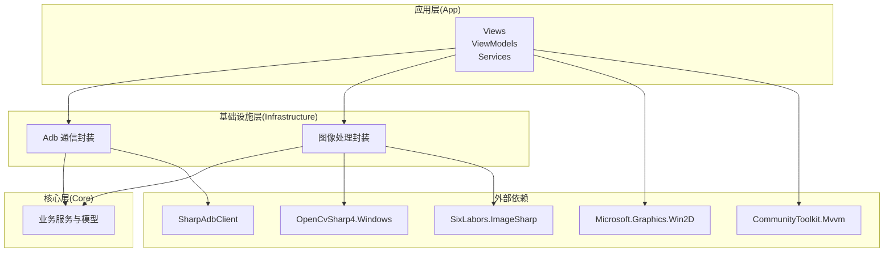
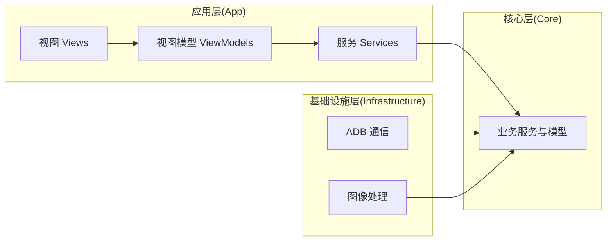
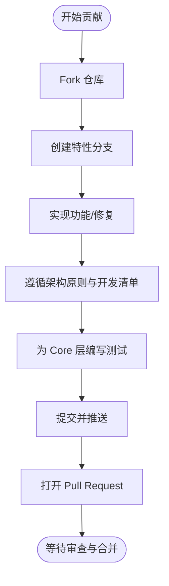
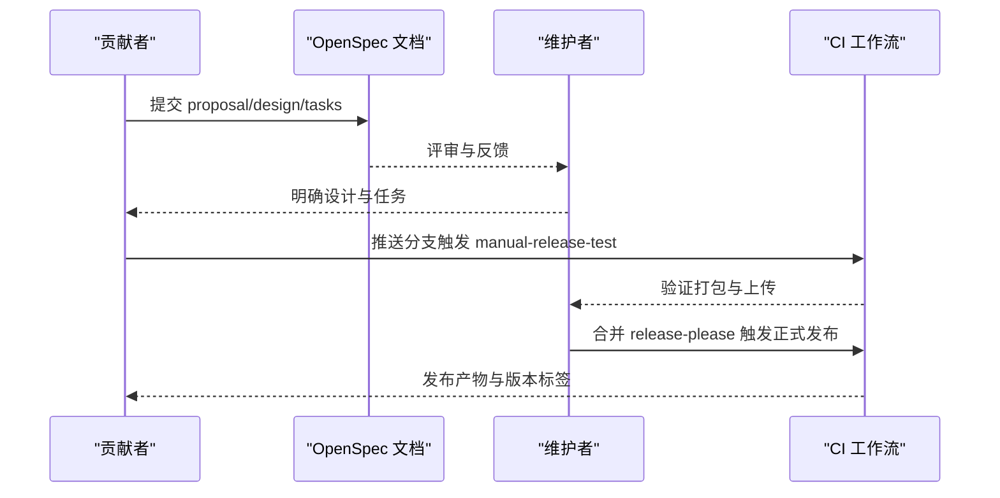
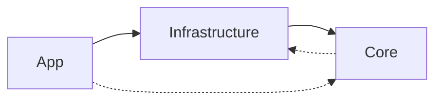
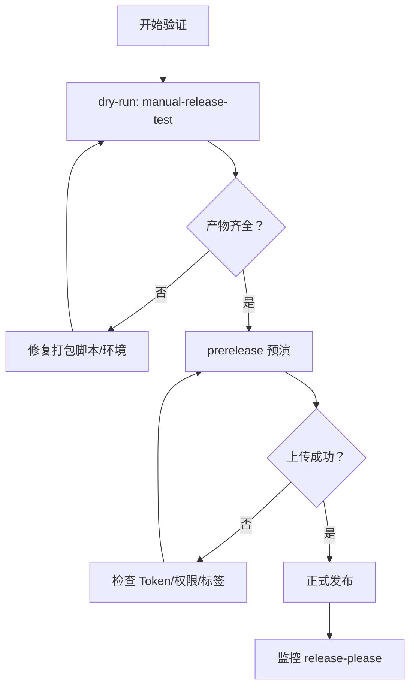

# 社区协作规范

<cite>
**本文引用的文件**
- [LICENSE.txt](file://LICENSE.txt)
- [README.md](file://README.md)
- [README_zh_CN.md](file://README_zh_CN.md)
- [DEVELOPMENT.md](file://DEVELOPMENT.md)
- [AGENTS.md](file://AGENTS.md)
- [checklist.md](file://checklist.md)
- [manual.md](file://manual.md)
- [.github/workflows/manual-release-test.yml](file://.github/workflows/manual-release-test.yml)
- [.github/workflows/release-please.yml](file://.github/workflows/release-please.yml)
- [openspec/config.yaml](file://openspec/config.yaml)
- [openspec/changes/winui3-visual-dev-toolkit/proposal.md](file://openspec/changes/winui3-visual-dev-toolkit/proposal.md)
- [openspec/changes/winui3-visual-dev-toolkit/design.md](file://openspec/changes/winui3-visual-dev-toolkit/design.md)
- [openspec/changes/winui3-visual-dev-toolkit/tasks.md](file://openspec/changes/winui3-visual-dev-toolkit/tasks.md)
</cite>

## 目录
1. [引言](#引言)
2. [项目结构](#项目结构)
3. [核心组件](#核心组件)
4. [架构总览](#架构总览)
5. [详细组件分析](#详细组件分析)
6. [依赖分析](#依赖分析)
7. [性能考量](#性能考量)
8. [故障排查指南](#故障排查指南)
9. [结论](#结论)
10. [附录](#附录)

## 引言
本规范旨在为 AutoJS6 开发工具的社区协作提供清晰、可操作的行为准则与流程指引。内容覆盖开源许可与知识产权、贡献流程、治理与决策机制、沟通与行为准则、新贡献者入门、社区活动与交流渠道等，帮助维护者与贡献者共同营造开放、包容、高效的协作环境。

## 项目结构
AutoJS6 开发工具是一个基于 .NET 8 与 WinUI 3 的 Windows 原生桌面应用，采用 Clean Architecture 分层设计，包含应用层、基础设施层与核心业务层，辅以 OpenSpec 变更提案体系与 GitHub Actions 自动化发布流水线。

**图表来源**
- [README.md: 项目结构与架构原则:230-287](file://README.md#L230-L287)
- [AGENTS.md: 项目层依赖关系硬规则:69-95](file://AGENTS.md#L69-L95)

**章节来源**
- [README.md: 项目结构与架构原则:230-287](file://README.md#L230-L287)
- [AGENTS.md: 项目层依赖关系硬规则:69-95](file://AGENTS.md#L69-L95)

## 核心组件
- 许可证与法律合规
  - 项目采用 MIT 许可证，明确版权归属与使用、复制、修改、分发的权利与义务。
  - 贡献者需确保提交内容不侵犯第三方知识产权，遵守开源许可条款。
- 贡献流程与质量门禁
  - 通过 Fork 与 Pull Request 参与贡献，遵循架构原则与开发清单，提交前完成单元测试与自检。
- 治理与决策机制
  - 采用 OpenSpec 变更提案体系，结合项目上下文与设计文档进行评审与实施。
- 发布与运维
  - 通过 GitHub Actions 的 release-please 与 manual-release-test 工作流实现自动化发布与验证。
- 社区沟通与行为准则
  - 遵循尊重、包容、专业的沟通原则，维护友好协作氛围。

**章节来源**
- [LICENSE.txt: MIT 许可证全文:1-22](file://LICENSE.txt#L1-L22)
- [README.md: 贡献与支持:376-429](file://README.md#L376-L429)
- [AGENTS.md: 项目上下文与约束:1-331](file://AGENTS.md#L1-L331)
- [.github/workflows/release-please.yml: 正式发布工作流:1-207](file://.github/workflows/release-please.yml#L1-L207)
- [.github/workflows/manual-release-test.yml: 发版前验证工作流:1-253](file://.github/workflows/manual-release-test.yml#L1-L253)

## 架构总览
项目采用 Clean Architecture，严格区分应用层、基础设施层与核心层，确保业务逻辑可测试、外部依赖可替换、UI 与业务解耦。

**图表来源**
- [README.md: 架构原则与分层依赖:264-287](file://README.md#L264-L287)
- [AGENTS.md: 项目层依赖关系硬规则:69-95](file://AGENTS.md#L69-L95)

## 详细组件分析

### 开源许可与知识产权
- 许可证
  - 项目采用 MIT 许可证，允许自由使用、复制、修改、合并、出版发行、散布、再授权及销售软件及其文档，需在副本中保留版权与许可声明。
- 知识产权与商标
  - 项目名称与标识为 Terwer Inc. 所有，使用需遵循项目上下文与品牌指南；不得擅自更改产品名称、包标识与发布者信息。
- 贡献者承诺
  - 贡献者需保证对提交内容拥有合法权利，不侵犯第三方权益；项目采用“无明示担保”模式，作者与版权持有人不对使用后果承担责任。

**章节来源**
- [LICENSE.txt: MIT 许可证:1-22](file://LICENSE.txt#L1-L22)
- [DEVELOPMENT.md: 当前发布身份配置:252-261](file://DEVELOPMENT.md#L252-L261)

### 贡献流程与质量门禁
- 基本流程
  - Fork 仓库 → 创建特性分支 → 遵循架构原则与开发清单 → 编写 Core 层测试 → 提交并推送 → 打开 Pull Request。
- 提交前自检
  - 验证分层依赖、双引擎隔离、异步架构、渲染性能与单元测试。
- 代码生成约束
  - 遵守 AutoJS6 运行时约束（Rhino 引擎限制、OOM 预防、模板裁剪规则、坐标系与 regionRef 生成规则）。

**图表来源**
- [README.md: 贡献流程:376-389](file://README.md#L376-L389)
- [AGENTS.md: 代码生成约束与性能要求:152-254](file://AGENTS.md#L152-L254)

**章节来源**
- [README.md: 贡献与开发工作流:303-340](file://README.md#L303-L340)
- [AGENTS.md: 代码生成约束与性能要求:152-254](file://AGENTS.md#L152-L254)

### 治理结构与决策机制
- OpenSpec 变更提案体系
  - 通过 proposal.md、design.md、tasks.md 三段式文档定义背景、目标、设计决策、任务分解与风险权衡，确保变更可追溯、可验证。
- 评审与实施
  - 由维护者与贡献者共同评审，依据项目上下文与约束进行决策，实施阶段严格遵循设计文档与任务清单。
- 发布治理
  - 采用 release-please 与 manual-release-test 双轨工作流，前者负责正式发布，后者用于发版前验证与修复。

**图表来源**
- [openspec/changes/winui3-visual-dev-toolkit/proposal.md: 变更背景与能力:1-70](file://openspec/changes/winui3-visual-dev-toolkit/proposal.md#L1-L70)
- [openspec/changes/winui3-visual-dev-toolkit/design.md: 设计决策与约束:51-153](file://openspec/changes/winui3-visual-dev-toolkit/design.md#L51-L153)
- [openspec/changes/winui3-visual-dev-toolkit/tasks.md: 任务分解与验证:1-260](file://openspec/changes/winui3-visual-dev-toolkit/tasks.md#L1-L260)
- [.github/workflows/manual-release-test.yml: 发版前验证:1-253](file://.github/workflows/manual-release-test.yml#L1-L253)
- [.github/workflows/release-please.yml: 正式发布:1-207](file://.github/workflows/release-please.yml#L1-L207)

**章节来源**
- [openspec/config.yaml: OpenSpec 配置:1-21](file://openspec/config.yaml#L1-L21)
- [openspec/changes/winui3-visual-dev-toolkit/proposal.md: 变更背景与能力:1-70](file://openspec/changes/winui3-visual-dev-toolkit/proposal.md#L1-L70)
- [openspec/changes/winui3-visual-dev-toolkit/design.md: 设计决策与约束:51-153](file://openspec/changes/winui3-visual-dev-toolkit/design.md#L51-L153)
- [openspec/changes/winui3-visual-dev-toolkit/tasks.md: 任务分解与验证:1-260](file://openspec/changes/winui3-visual-dev-toolkit/tasks.md#L1-L260)
- [.github/workflows/manual-release-test.yml: 发版前验证工作流:1-253](file://.github/workflows/manual-release-test.yml#L1-L253)
- [.github/workflows/release-please.yml: 正式发布工作流:1-207](file://.github/workflows/release-please.yml#L1-L207)

### 社区行为准则与沟通指南
- 基本原则
  - 尊重与包容：尊重不同观点与经验水平，避免人身攻击与歧视。
  - 专业与高效：聚焦问题本身，提供可验证的事实与数据，避免情绪化表达。
  - 开放与透明：优先使用公开渠道讨论，便于知识沉淀与社区监督。
- 沟通渠道
  - 文档与问题：使用项目文档与 Issue 追踪问题与需求。
  - 讨论区：使用 Discussions 进行开放式讨论与经验分享。
  - 许可与支持：遵循 MIT 许可，支持与致谢信息见项目文档。

**章节来源**
- [README.md: 支持与沟通渠道:424-429](file://README.md#L424-L429)

### 新贡献者入门指导
- 环境准备
  - Windows 10/11、.NET 8 SDK、Visual Studio 2022/2026（含 WinUI 3 工作负载）、ADB 工具。
- 本地开发
  - 克隆仓库、恢复 NuGet 包、配置环境变量、构建与运行。
- 贡献步骤
  - Fork → 分支 → 实现 → 测试 → 提交 → PR。
- 质量门禁
  - 遵循架构原则、保持双引擎独立、使用异步 I/O、模块规模控制、为 Core 层编写测试。

**章节来源**
- [README.md: 快速开始与开发工作流:110-340](file://README.md#L110-L340)
- [README_zh_CN.md: 快速开始与开发工作流:110-340](file://README_zh_CN.md#L110-L340)

### 社区活动与交流渠道
- 官方文档与支持
  - 文档入口、问题追踪、讨论区。
- 支持与致谢
  - 项目致谢与支持渠道，鼓励社区支持与赞助。

**章节来源**
- [README.md: 支持与致谢:424-475](file://README.md#L424-L475)
- [README_zh_CN.md: 支持与致谢:424-475](file://README_zh_CN.md#L424-L475)

## 依赖分析
项目依赖关系严格遵循 Clean Architecture 的单向依赖与分层隔离原则，确保核心业务逻辑可测试、UI 与外部依赖可替换。

**图表来源**
- [README.md: 架构原则与分层依赖:272-276](file://README.md#L272-L276)
- [AGENTS.md: 项目层依赖关系硬规则:69-95](file://AGENTS.md#L69-L95)

**章节来源**
- [README.md: 架构原则与分层依赖:272-276](file://README.md#L272-L276)
- [AGENTS.md: 项目层依赖关系硬规则:69-95](file://AGENTS.md#L69-L95)

## 性能考量
- 异步优先：所有 I/O 操作（ADB、OpenCV、XML 解析、纹理上传）使用异步与取消令牌，避免 UI 阻塞。
- 渲染优化：Win2D 双图层渲染、GPU 加速、缓存池与按需重绘，确保 60FPS 流畅体验。
- 模块规模：运行时/功能/动作模块行数上限与硬上限，超限需拆分以维持可维护性。

**章节来源**
- [AGENTS.md: 异步架构与内存优化:229-254](file://AGENTS.md#L229-L254)

## 故障排查指南
- 发版前验证
  - 使用 manual-release-test 工作流进行打包与上传链路验证，先 dry-run 再 prerelease 预演，确保产物齐全与可下载。
- 正式发布
  - 通过 release-please 触发正式发布，关注 release_created 条件与产物完整性。
- 常见问题
  - 验证元数据失败：检查 release-please 配置与清单版本格式。
  - 打包失败：检查 .NET SDK、MSBuild、Inno Setup、证书与签名工具。
  - 上传失败：检查 GitHub Token 权限、Release 标签冲突与资产重名。

**图表来源**
- [.github/workflows/manual-release-test.yml: 发版前验证工作流:1-253](file://.github/workflows/manual-release-test.yml#L1-L253)
- [.github/workflows/release-please.yml: 正式发布工作流:1-207](file://.github/workflows/release-please.yml#L1-L207)
- [manual.md: 发版前验证手册:1-522](file://manual.md#L1-L522)

**章节来源**
- [DEVELOPMENT.md: 发布维护路径与建议:5-16](file://DEVELOPMENT.md#L5-L16)
- [manual.md: 发版前验证手册:1-522](file://manual.md#L1-L522)
- [.github/workflows/manual-release-test.yml: 发版前验证工作流:1-253](file://.github/workflows/manual-release-test.yml#L1-L253)
- [.github/workflows/release-please.yml: 正式发布工作流:1-207](file://.github/workflows/release-please.yml#L1-L207)

## 结论
本规范以 MIT 许可为基础，结合 OpenSpec 变更体系与自动化发布流水线，明确了贡献流程、治理机制、行为准则与故障排查路径。建议维护者与贡献者在协作中始终遵循“用户体验优先、双核独立、异步非阻塞、60FPS 流畅”的核心原则，共同推动项目高质量发展。

## 附录
- 贡献清单与验证
  - 使用 checklist.md 进行 P0/P1 验证与风险识别，确保“能装、能开、能连、能截、能裁、能测、能生码”的最小闭环。
- 项目上下文与约束
  - AGENTS.md 提供用户体验优先、双核独立、异步架构、性能与工程要求、坐标系对齐、控件树过滤等最高优先级约束。
- 文档与资源
  - README/README_zh_CN 提供项目说明、功能介绍、开发与发布指南；AGENTS.md 提供设计原则与约束；manual.md 与 DEVELOPMENT.md 提供发版验证与运维细节。

**章节来源**
- [checklist.md: V1 发布验证清单:1-186](file://checklist.md#L1-L186)
- [AGENTS.md: 项目上下文与约束:1-331](file://AGENTS.md#L1-L331)
- [README.md: 项目说明与开发指南:1-490](file://README.md#L1-L490)
- [README_zh_CN.md: 项目说明与开发指南:1-494](file://README_zh_CN.md#L1-L494)
- [DEVELOPMENT.md: 发布与运维指南:1-276](file://DEVELOPMENT.md#L1-L276)
- [manual.md: 发版前验证手册:1-522](file://manual.md#L1-L522)