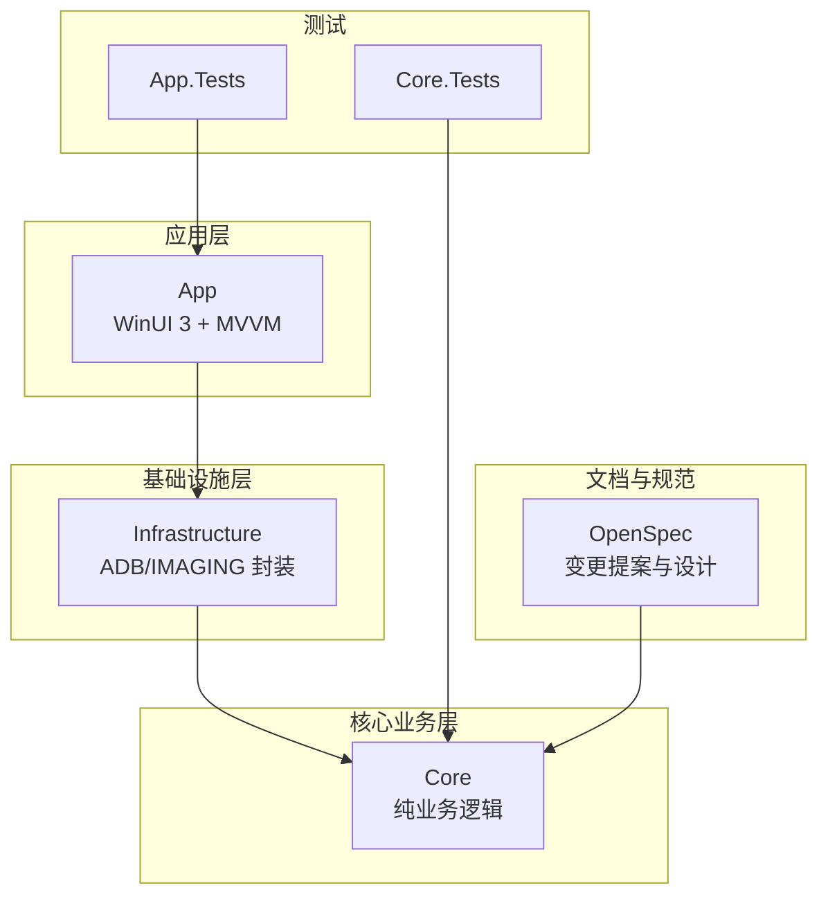
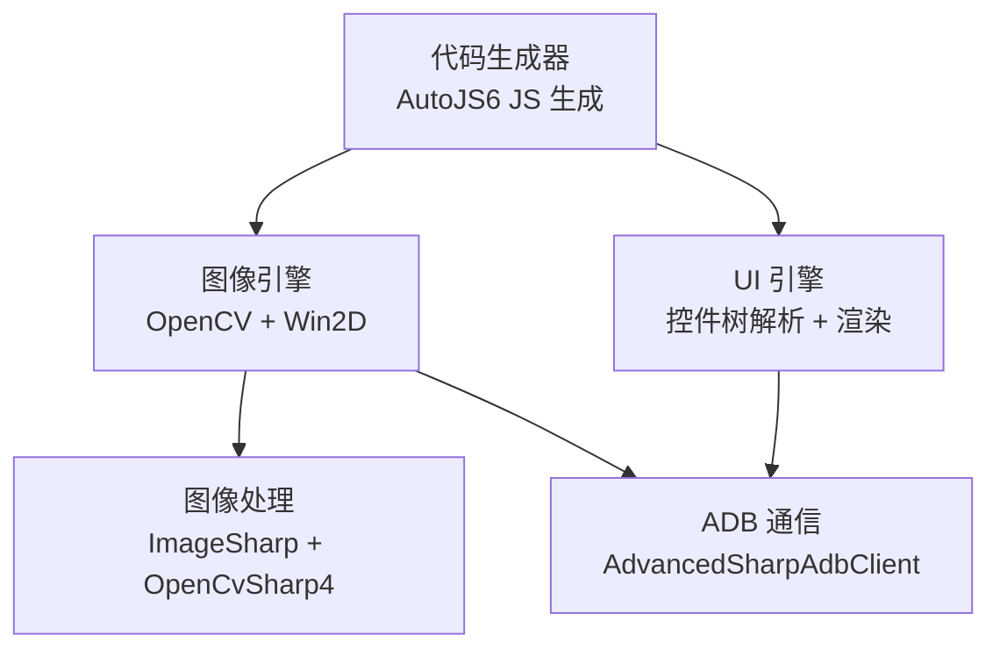
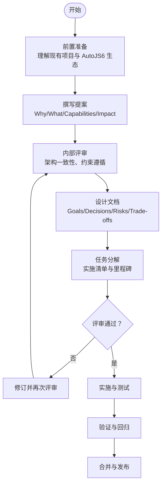
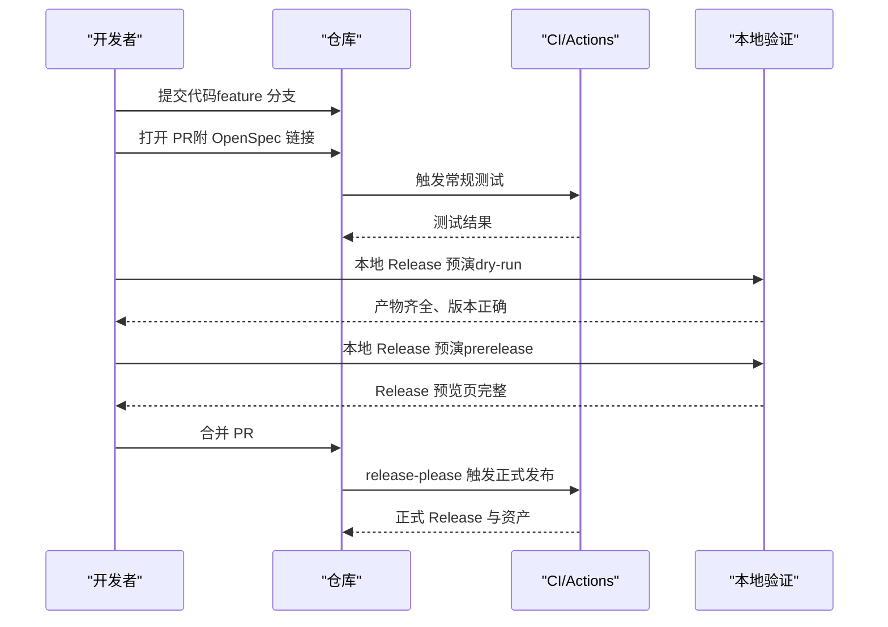
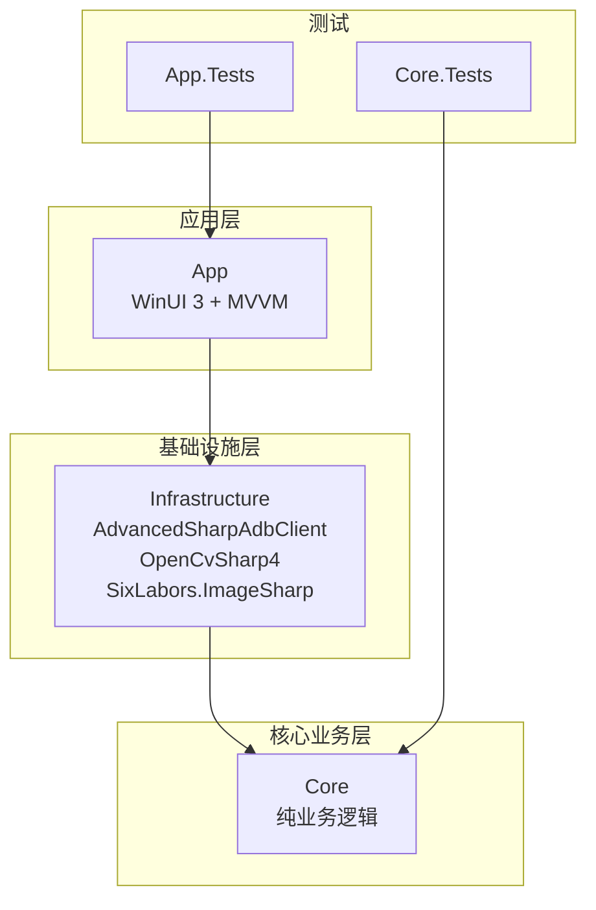

# 贡献指南

<cite>
**本文引用的文件**   
- [README.md](file://README.md)
- [DEVELOPMENT.md](file://DEVELOPMENT.md)
- [AGENTS.md](file://AGENTS.md)
- [checklist.md](file://checklist.md)
- [manual.md](file://manual.md)
- [openspec/config.yaml](file://openspec/config.yaml)
- [openspec/changes/winui3-visual-dev-toolkit/proposal.md](file://openspec/changes/winui3-visual-dev-toolkit/proposal.md)
- [openspec/changes/winui3-visual-dev-toolkit/design.md](file://openspec/changes/winui3-visual-dev-toolkit/design.md)
- [openspec/changes/winui3-visual-dev-toolkit/tasks.md](file://openspec/changes/winui3-visual-dev-toolkit/tasks.md)
- [App/App.csproj](file://App/App.csproj)
- [Core/Core.csproj](file://Core/Core.csproj)
- [Infrastructure/Infrastructure.csproj](file://Infrastructure/Infrastructure.csproj)
- [App.Tests/App.Tests.csproj](file://App.Tests/App.Tests.csproj)
- [Core.Tests/Core.Tests.csproj](file://Core.Tests/Core.Tests.csproj)
</cite>

## 目录
1. [简介](#简介)
2. [项目结构](#项目结构)
3. [核心组件](#核心组件)
4. [架构总览](#架构总览)
5. [详细组件分析](#详细组件分析)
6. [依赖分析](#依赖分析)
7. [性能考虑](#性能考虑)
8. [故障排查指南](#故障排查指南)
9. [结论](#结论)
10. [附录](#附录)

## 简介
本指南面向 AutoJS6 开发工具的贡献者，系统阐述贡献流程、OpenSpec 变更提案规范、开发工作流、代码质量与测试标准、架构原则与设计约束、社区行为准则与沟通指南，以及新贡献者的入门路径。目标是帮助贡献者快速理解项目设计理念与实施边界，高效参与高质量的协作开发。

## 项目结构
项目采用分层架构与双引擎并行设计：
- App：WinUI 3 桌面应用，负责 UI 与 MVVM，不直接依赖外部库
- Infrastructure：封装外部依赖（ADB、OpenCV、ImageSharp），隔离技术细节
- Core：纯业务逻辑层，独立可测试，不含 UI 与外部依赖
- 测试：App.Tests 与 Core.Tests 分别覆盖应用层与核心层
- OpenSpec：变更提案与设计文档，支撑规范化的功能引入与评审

**图表来源**
- [App/App.csproj:1-84](file://App/App.csproj#L1-L84)
- [Infrastructure/Infrastructure.csproj:1-19](file://Infrastructure/Infrastructure.csproj#L1-L19)
- [Core/Core.csproj:1-10](file://Core/Core.csproj#L1-L10)
- [App.Tests/App.Tests.csproj:1-17](file://App.Tests/App.Tests.csproj#L1-L17)
- [Core.Tests/Core.Tests.csproj:1-21](file://Core.Tests/Core.Tests.csproj#L1-L21)
- [openspec/changes/winui3-visual-dev-toolkit/tasks.md:48-57](file://openspec/changes/winui3-visual-dev-toolkit/tasks.md#L48-L57)

**章节来源**
- [README.md:230-260](file://README.md#L230-L260)
- [AGENTS.md:69-95](file://AGENTS.md#L69-L95)

## 核心组件
- 双引擎独立架构：图像处理引擎（像素/位图 + OpenCV）与 UI 分析引擎（控件树 + UiSelector）完全解耦
- 单向依赖：App → Infrastructure → Core ← Infrastructure
- 异步优先：所有 I/O 操作使用 async/await，UI 线程不阻塞
- 代码生成约束：严格遵循 AutoJS6 运行时约束（Rhino 引擎、OOM 预防、模板裁剪规则）

**章节来源**
- [AGENTS.md:40-66](file://AGENTS.md#L40-L66)
- [AGENTS.md:69-95](file://AGENTS.md#L69-L95)
- [AGENTS.md:229-253](file://AGENTS.md#L229-L253)
- [README.md:342-374](file://README.md#L342-L374)

## 架构总览
双引擎并行、分层渲染、异步非阻塞、严格约束的代码生成路径，确保 60FPS 流畅与可维护性。

**图表来源**
- [AGENTS.md:40-66](file://AGENTS.md#L40-L66)
- [openspec/changes/winui3-visual-dev-toolkit/design.md:53-107](file://openspec/changes/winui3-visual-dev-toolkit/design.md#L53-L107)

## 详细组件分析

### 贡献流程与规范
- 代码贡献
  - fork 仓库 → 新建特性分支 → 遵循架构原则与模块规模限制 → 编写 Core 层测试 → 提交与推送 → 打开 PR
  - 参考：[README.md:376-389](file://README.md#L376-L389)
- 问题报告与功能请求
  - 使用 Issue 模板描述问题背景、复现步骤、期望与现状
  - 功能请求建议先在 Discussions 讨论，再形成 OpenSpec 提案
- 分支管理与提交规范
  - 建议使用 feature/* 分支命名，提交信息简洁明确
  - 重要变更请附带 OpenSpec 提案链接
- 代码审查与合并
  - 代码审查需覆盖：双引擎独立性、依赖方向、异步架构、性能与稳定性
  - 合并前需通过单元测试与本地/CI 验证

**章节来源**
- [README.md:376-389](file://README.md#L376-L389)

### OpenSpec 变更提案
OpenSpec 用于规范化引入新功能与重大变更，流程如下：

**图表来源**
- [openspec/changes/winui3-visual-dev-toolkit/proposal.md:1-70](file://openspec/changes/winui3-visual-dev-toolkit/proposal.md#L1-L70)
- [openspec/changes/winui3-visual-dev-toolkit/design.md:36-153](file://openspec/changes/winui3-visual-dev-toolkit/design.md#L36-L153)
- [openspec/changes/winui3-visual-dev-toolkit/tasks.md:1-260](file://openspec/changes/winui3-visual-dev-toolkit/tasks.md#L1-L260)

OpenSpec 规范要点
- 提案结构：Why（动机）、What（变更内容）、Capabilities（新增/修改能力）、Impact（影响与依赖）
- 设计决策：双引擎独立、分层渲染、坐标系对齐、异步架构、依赖关系
- 任务清单：从 0.1 到 260 的完整实施步骤，覆盖接口定义、实现、UI、测试与部署
- 配置：openspec/config.yaml 支持为特定工件设定规则（如字数限制、任务块时长）

**章节来源**
- [openspec/changes/winui3-visual-dev-toolkit/proposal.md:1-70](file://openspec/changes/winui3-visual-dev-toolkit/proposal.md#L1-L70)
- [openspec/changes/winui3-visual-dev-toolkit/design.md:36-153](file://openspec/changes/winui3-visual-dev-toolkit/design.md#L36-L153)
- [openspec/changes/winui3-visual-dev-toolkit/tasks.md:1-260](file://openspec/changes/winui3-visual-dev-toolkit/tasks.md#L1-L260)
- [openspec/config.yaml:1-21](file://openspec/config.yaml#L1-L21)

### 开发工作流
- 开发前：阅读 AGENTS.md 与 openspec 项目清单，理解设计约束与验证规则
- 开发中：坚持双引擎独立、单向依赖、异步架构；模块规模不超过 512 行；优先在 Core 层编写测试
- 提交前：验证三层依赖、双引擎隔离、异步架构、60FPS 渲染性能；运行单元测试
- 发布前：遵循 DEVELOPMENT.md 的本地验证顺序与 manual.md 的 Actions 预演流程

**图表来源**
- [README.md:303-340](file://README.md#L303-L340)
- [DEVELOPMENT.md:1-276](file://DEVELOPMENT.md#L1-L276)
- [manual.md:1-522](file://manual.md#L1-L522)

**章节来源**
- [README.md:303-340](file://README.md#L303-L340)
- [DEVELOPMENT.md:1-276](file://DEVELOPMENT.md#L1-L276)
- [manual.md:1-522](file://manual.md#L1-L522)

### 代码质量与测试标准
- 单元测试
  - Core.Tests：覆盖核心服务（UI 树解析、OpenCV 匹配、代码生成）
  - App.Tests：覆盖应用层 UI 与交互（可选）
- 集成测试与验收
  - checklist.md：P0 必过项（安装/启动、ADB 连接、截图/画布、图像/控件主闭环、稳定性）
  - manual.md：Actions 发版前验证手册，确保打包链与上传链可用
- 覆盖率与质量门槛
  - 建议 Core 层测试用例覆盖关键路径与边界条件
  - 任何影响双引擎独立性、依赖方向或异步架构的变更需有充分测试

**章节来源**
- [Core.Tests/Core.Tests.csproj:1-21](file://Core.Tests/Core.Tests.csproj#L1-L21)
- [App.Tests/App.Tests.csproj:1-17](file://App.Tests/App.Tests.csproj#L1-L17)
- [checklist.md:1-186](file://checklist.md#L1-L186)
- [manual.md:1-522](file://manual.md#L1-L522)

### 架构原则与设计约束
- 双核独立架构：图像引擎与 UI 引擎完全解耦，数据源、处理管线、渲染逻辑与代码生成路径严禁耦合
- 单向依赖：App → Infrastructure → Core ← Infrastructure
- 异步优先：所有 I/O 操作使用 async/await，UI 线程不阻塞
- AutoJS6 代码生成约束：Rhino 引擎循环体内禁止 const/let；OOM 预防（单轮单截图、region 优先、及时回收）
- 模块规模：运行时/feature/action 模块目标上限 255 行，硬上限 512 行
- 坐标系对齐：左上角原点，控件 bounds 与图像坐标直接对应

**章节来源**
- [AGENTS.md:40-66](file://AGENTS.md#L40-L66)
- [AGENTS.md:69-95](file://AGENTS.md#L69-L95)
- [AGENTS.md:229-253](file://AGENTS.md#L229-L253)
- [README.md:342-374](file://README.md#L342-L374)

### 社区行为准则与沟通指南
- 行为准则
  - 以用户体验优先，追求更少步骤、更少等待、更少打断、更少猜测、更低出错成本
  - 禁止将内部实现思路或临时指令直接暴露给用户
  - 禁止设计会阻塞 UI、打断连续操作、造成界面抖动或内容裁切的交互
- 沟通渠道
  - Issues：Bug 报告与功能请求
  - Discussions：需求讨论与设计澄清
  - PR：代码贡献与变更评审
- 文档与资源
  - AGENTS.md：核心设计原则与约束
  - openspec：OpenSpec 变更提案与设计
  - DEVELOPMENT.md：发布与恢复指南

**章节来源**
- [AGENTS.md:3-27](file://AGENTS.md#L3-L27)
- [README.md:424-430](file://README.md#L424-L430)

### 新贡献者入门
- 快速起步
  - 环境：Windows 10/11、.NET 8 SDK、Visual Studio 2022/2026、ADB 在 PATH
  - 克隆与构建：dotnet restore → dotnet build → dotnet run
  - 配置：根据 AGENTS.md 设置本地路径变量
- 学习路径
  - 先读 AGENTS.md 与 README.md 的架构原则与开发流程
  - 阅读 openspec/changes/winui3-visual-dev-toolkit 下的 Proposal/Design/Tasks
  - 查看 Core 与 Infrastructure 的接口与实现，理解双引擎与单向依赖
- 贡献建议
  - 从 Core 层小步快跑，先写测试再写实现
  - 任何变更先在本地 checklist.md 与 manual.md 的验证清单上确认
  - 重大变更务必形成 OpenSpec 提案并通过评审

**章节来源**
- [README.md:110-163](file://README.md#L110-L163)
- [AGENTS.md:1-331](file://AGENTS.md#L1-L331)
- [openspec/changes/winui3-visual-dev-toolkit/proposal.md:1-70](file://openspec/changes/winui3-visual-dev-toolkit/proposal.md#L1-L70)
- [openspec/changes/winui3-visual-dev-toolkit/tasks.md:1-260](file://openspec/changes/winui3-visual-dev-toolkit/tasks.md#L1-L260)

## 依赖分析
项目依赖关系与技术栈如下：

**图表来源**
- [App/App.csproj:60-64](file://App/App.csproj#L60-L64)
- [Infrastructure/Infrastructure.csproj:13-17](file://Infrastructure/Infrastructure.csproj#L13-L17)
- [Core/Core.csproj:1-10](file://Core/Core.csproj#L1-L10)

**章节来源**
- [App/App.csproj:1-84](file://App/App.csproj#L1-L84)
- [Infrastructure/Infrastructure.csproj:1-19](file://Infrastructure/Infrastructure.csproj#L1-L19)
- [Core/Core.csproj:1-10](file://Core/Core.csproj#L1-L10)

## 性能考虑
- 渲染性能：Win2D 分层渲染（图像层 + 叠加层），仅重绘变化图层，确保 60FPS
- 异步架构：ADB 截图、OpenCV 匹配、UI 树解析全部异步，避免 UI 冻结
- 内存优化：CanvasBitmap 缓存池、及时回收 ImageWrapper 对象
- 模块规模：控制单模块行数，降低复杂度与维护成本

**章节来源**
- [AGENTS.md:229-253](file://AGENTS.md#L229-L253)

## 故障排查指南
- 本地构建失败
  - 检查 .NET 8 SDK、MSBuild、Windows SDK、SignTool 是否就绪
  - 确认 App 项目未启用 Trim/ReadyToRun，默认 Release 构建
- MSIX 签名失败
  - 检查证书 Subject 与 App/Package.appxmanifest Publisher 是否一致
  - 确认 signtool.exe 可用，.cer 导入到当前用户的受信任发布者与受信任根
- EXE 安装器失败
  - 检查 Inno Setup 6（ISCC.exe）是否安装
  - 确认发布目录包含构建产物，输出路径可写
- Actions 发布失败
  - 先执行 dry-run（manual-release-test，publish_to_release=false）
  - 再执行 prerelease 预演（publish_to_release=true），验证 Release 页面与资产
  - 若正式 Release 缺失资产，基于已有 tag 修复并重新上传

**章节来源**
- [DEVELOPMENT.md:224-250](file://DEVELOPMENT.md#L224-L250)
- [manual.md:330-407](file://manual.md#L330-L407)

## 结论
本指南提供了从贡献流程、OpenSpec 规范、开发工作流到测试与发布的完整路径。请始终以用户体验优先、双引擎独立、异步非阻塞与 AutoJS6 约束为核心原则开展贡献，借助 checklist 与 Actions 预演保障质量与稳定性。

## 附录
- 参考文档与资源
  - AGENTS.md：核心设计原则与约束
  - openspec/changes/winui3-visual-dev-toolkit：OpenSpec 提案与实施清单
  - DEVELOPMENT.md：发布与恢复指南
  - manual.md：Actions 发版前验证手册
- 项目结构与技术栈
  - App：WinUI 3、Win2D、CommunityToolkit.Mvvm
  - Infrastructure：AdvancedSharpAdbClient、OpenCvSharp4、SixLabors.ImageSharp
  - Core：纯业务逻辑，独立可测试