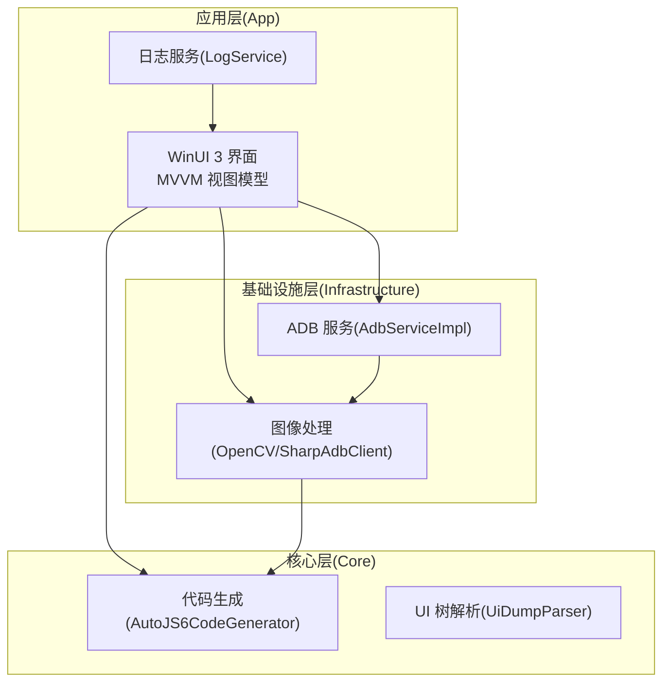
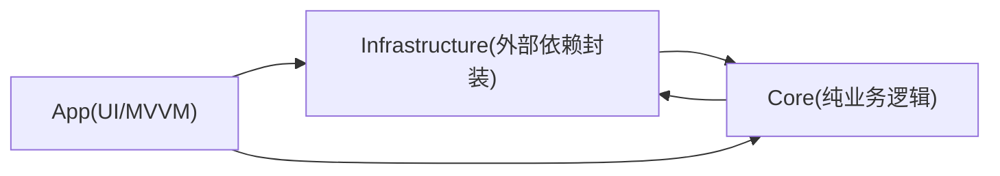
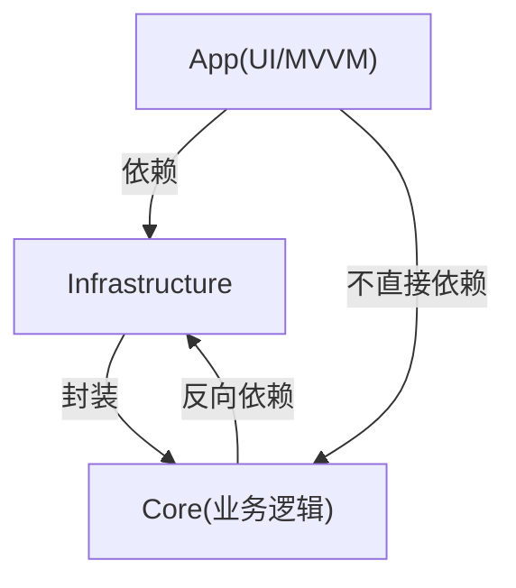

# 问题报告指南

<cite>
**本文引用的文件**
- [README.md](file://README.md)
- [README_zh_CN.md](file://README_zh_CN.md)
- [AGENTS.md](file://AGENTS.md)
- [checklist.md](file://checklist.md)
- [manual.md](file://manual.md)
- [PHASE0_REFERENCE.md](file://openspec/changes/winui3-visual-dev-toolkit/PHASE0_REFERENCE.md)
- [spec.md（图像处理引擎）](file://openspec/changes/winui3-visual-dev-toolkit/specs/image-processing-engine/spec.md)
- [spec.md（代码生成器）](file://openspec/changes/winui3-visual-dev-toolkit/specs/autojs6-code-generator/spec.md)
- [LogService.cs](file://App/Services/LogService.cs)
- [AdbServiceImpl.cs](file://Infrastructure/Adb/AdbServiceImpl.cs)
- [AutoJS6CodeGenerator.cs](file://Core/Services/AutoJS6CodeGenerator.cs)
</cite>

## 目录
1. [简介](#简介)
2. [项目结构](#项目结构)
3. [核心组件](#核心组件)
4. [架构总览](#架构总览)
5. [详细组件分析](#详细组件分析)
6. [依赖分析](#依赖分析)
7. [性能考量](#性能考量)
8. [故障排查指南](#故障排查指南)
9. [结论](#结论)
10. [附录](#附录)

## 简介
本指南面向 AutoJS6 开发工具的使用者与贡献者，提供系统化的问题报告方法，帮助准确分类与优先级划分问题，规范问题描述与证据收集，加速问题定位与修复闭环。文档结合项目实际架构与规范，覆盖性能问题、兼容性问题与功能缺陷三类问题的差异化报告要点，并给出日志采集、自助排查与问题跟踪流程建议。

## 项目结构
AutoJS6 可视化开发工具采用分层架构，分为应用层（App）、基础设施层（Infrastructure）与核心业务层（Core）。应用层负责 UI 与 MVVM；基础设施层封装外部依赖（ADB、OpenCV、ImageSharp 等）；核心层提供纯业务逻辑（如 ADB 服务、UI 树解析、图像匹配、代码生成等）。该分层与双引擎（图像/控件）独立设计，决定了问题分类与排查路径的关键维度。

图表来源
- [AdbServiceImpl.cs:17-237](file://Infrastructure/Adb/AdbServiceImpl.cs#L17-L237)
- [AutoJS6CodeGenerator.cs:11-356](file://Core/Services/AutoJS6CodeGenerator.cs#L11-L356)
- [LogService.cs:9-50](file://App/Services/LogService.cs#L9-L50)

章节来源
- [README.md:230-287](file://README.md#L230-L287)
- [AGENTS.md:69-95](file://AGENTS.md#L69-L95)

## 核心组件
- 日志服务：统一日志入口，支持 UI 订阅与调试输出，便于问题复现与证据留存。
- ADB 服务：负责设备发现、截图拉取、UI 树解析与设备连接（含配对/连接）。
- 代码生成器：根据图像模板与控件节点生成 AutoJS6 代码，严格遵循 Rhino 引擎与 OOM 预防约束。
- 图像处理引擎：基于 OpenCV 的模板匹配与实时阈值调整，支持导出模板与批量测试。
- UI 分析引擎：解析 uiautomator dump，过滤冗余布局容器，渲染控件边界并支持双向联动。

章节来源
- [LogService.cs:9-50](file://App/Services/LogService.cs#L9-L50)
- [AdbServiceImpl.cs:17-237](file://Infrastructure/Adb/AdbServiceImpl.cs#L17-L237)
- [AutoJS6CodeGenerator.cs:11-356](file://Core/Services/AutoJS6CodeGenerator.cs#L11-L356)
- [spec.md（图像处理引擎）:1-121](file://openspec/changes/winui3-visual-dev-toolkit/specs/image-processing-engine/spec.md#L1-L121)
- [spec.md（代码生成器）:1-136](file://openspec/changes/winui3-visual-dev-toolkit/specs/autojs6-code-generator/spec.md#L1-L136)

## 架构总览
双引擎独立、单向依赖、异步优先的架构原则，决定了问题的边界与定位路径。图像引擎与 UI 引擎分别面向像素级与控件级，彼此数据源、处理管线、渲染逻辑与代码生成路径完全解耦。应用层仅依赖基础设施层，基础设施层依赖核心层，形成清晰的依赖链。

图表来源
- [README.md:272-287](file://README.md#L272-L287)
- [AGENTS.md:69-95](file://AGENTS.md#L69-L95)

章节来源
- [README.md:264-287](file://README.md#L264-L287)
- [AGENTS.md:40-95](file://AGENTS.md#L40-L95)

## 详细组件分析

### 日志服务（LogService）
- 统一日志入口，支持 UI 订阅与 Debug 控制台输出，便于问题复现与证据留存。
- 建议在问题报告中附带日志片段，标注时间戳与关键操作节点。

章节来源
- [LogService.cs:9-50](file://App/Services/LogService.cs#L9-L50)

### ADB 服务（AdbServiceImpl）
- 设备发现、截图拉取、UI 树解析、TCP/IP 连接与配对。
- 截图拉取失败、设备不在线、ADB 路径不可用等问题属于 ADB 层面，需优先检查环境变量与设备状态。

章节来源
- [AdbServiceImpl.cs:17-237](file://Infrastructure/Adb/AdbServiceImpl.cs#L17-L237)

### 代码生成器（AutoJS6CodeGenerator）
- 图像模式：生成 requestScreenCapture、images.read/findImage、点击与重试逻辑。
- 控件模式：生成 id()/text()/desc() 选择器链与 click/setText 等操作。
- 严格遵循 Rhino 引擎约束与 OOM 预防规则，避免循环体内 const/let、单轮单截图、region 优先与及时回收。

章节来源
- [AutoJS6CodeGenerator.cs:11-356](file://Core/Services/AutoJS6CodeGenerator.cs#L11-L356)
- [PHASE0_REFERENCE.md:152-226](file://openspec/changes/winui3-visual-dev-toolkit/PHASE0_REFERENCE.md#L152-L226)

### 图像处理引擎
- 支持交互式矩形裁剪、像素坐标拾取、实时阈值调整、OpenCV 模板匹配与导出模板。
- 异步处理避免 UI 阻塞，CanvasBitmap 缓存池优化内存。

章节来源
- [spec.md（图像处理引擎）:1-121](file://openspec/changes/winui3-visual-dev-toolkit/specs/image-processing-engine/spec.md#L1-L121)

### UI 分析引擎
- 解析 uiautomator dump，过滤冗余布局容器，渲染控件边界并支持双向联动。
- 选择器验证与坐标对齐检查，支持批量测试与报告生成。

章节来源
- [spec.md（代码生成器）:35-63](file://openspec/changes/winui3-visual-dev-toolkit/specs/autojs6-code-generator/spec.md#L35-L63)

## 依赖分析
- 依赖方向：App → Infrastructure → Core ← Infrastructure，禁止 Core 依赖 App 或循环依赖。
- 双引擎独立：图像/控件两条路径完全解耦，问题定位需明确所属引擎。
- 异步优先：所有 I/O 操作（ADB、OpenCV、XML 解析、纹理上传）使用 async/await，UI 线程永不阻塞。

图表来源
- [README.md:272-287](file://README.md#L272-L287)
- [AGENTS.md:69-95](file://AGENTS.md#L69-L95)

章节来源
- [README.md:272-287](file://README.md#L272-L287)
- [AGENTS.md:69-95](file://AGENTS.md#L69-L95)

## 性能考量
- 异步架构：ADB 截图拉取与 OpenCV 匹配均需异步执行，避免 UI 冻结。
- 内存优化：CanvasBitmap 缓存池、阈值滑动仅重算匹配层、控件树虚拟化。
- 渲染性能：确保 60FPS 流畅渲染，分层渲染仅重绘变化图层。

章节来源
- [AGENTS.md:229-253](file://AGENTS.md#L229-L253)
- [spec.md（图像处理引擎）:96-121](file://openspec/changes/winui3-visual-dev-toolkit/specs/image-processing-engine/spec.md#L96-L121)

## 故障排查指南

### 通用自助排查清单
- 环境与依赖
  - 确认 Windows 版本、.NET 8、ADB 在 PATH 中。
  - 确认设备已连接并处于在线状态。
- 基础功能验证
  - 截图能否成功加载到画布。
  - 图像模式裁剪与匹配是否正常。
  - 控件模式 UI 树解析与控件点击是否可用。
- 日志与输出
  - 打开日志面板，查看关键步骤输出与错误提示。
  - 复制日志并附带时间戳与操作步骤。

章节来源
- [checklist.md:19-95](file://checklist.md#L19-L95)
- [LogService.cs:9-50](file://App/Services/LogService.cs#L9-L50)

### ADB 相关问题
- 症状：点击截图无响应、设备未发现、提示“请先启动 ADB server”。
- 排查要点：
  - 检查 ADB 路径是否在 PATH 中，或手动指定 adb.exe 路径。
  - 确认设备已授权并处于 Online 状态。
  - 若使用 TCP/IP，确认连接地址与端口正确，必要时进行配对。
- 相关实现参考：
  - ADB 初始化、设备扫描、截图拉取、UI 树解析、连接/配对。

章节来源
- [AdbServiceImpl.cs:17-237](file://Infrastructure/Adb/AdbServiceImpl.cs#L17-L237)
- [checklist.md:40-48](file://checklist.md#L40-L48)

### 图像处理引擎问题
- 症状：匹配结果不准确、阈值调整无效、导出模板失败。
- 排查要点：
  - 确认模板裁剪区域合理，避免动态元素与红点。
  - 调整阈值范围（0.50-0.95），优先使用 region 限定搜索范围。
  - 导出模板时确保已创建裁剪区域。
- 相关实现参考：
  - 交互式裁剪、像素坐标拾取、实时阈值调整、OpenCV 模板匹配。

章节来源
- [spec.md（图像处理引擎）:1-121](file://openspec/changes/winui3-visual-dev-toolkit/specs/image-processing-engine/spec.md#L1-L121)
- [PHASE0_REFERENCE.md:370-401](file://openspec/changes/winui3-visual-dev-toolkit/PHASE0_REFERENCE.md#L370-L401)

### 代码生成器问题
- 症状：生成的代码在 AutoJS6 中报错、Rhino 引擎异常、OOM。
- 排查要点：
  - 循环体内使用 var 而非 const/let。
  - 单轮仅调用一次 captureScreen()，模板匹配优先 region。
  - 及时回收 ImageWrapper 对象。
- 相关实现参考：
  - 图像模式与控件模式代码生成、重试/超时机制、格式化与校验。

章节来源
- [AutoJS6CodeGenerator.cs:11-356](file://Core/Services/AutoJS6CodeGenerator.cs#L11-L356)
- [PHASE0_REFERENCE.md:152-226](file://openspec/changes/winui3-visual-dev-toolkit/PHASE0_REFERENCE.md#L152-L226)

### 性能问题
- 症状：UI 卡顿、截图/匹配耗时过长、内存占用持续增长。
- 排查要点：
  - 确认所有 I/O 操作均为异步，避免阻塞 UI。
  - 使用 CanvasBitmap 缓存池，避免重复创建纹理。
  - 控制匹配范围与模板数量，避免全屏扫描。
- 相关实现参考：
  - 异步架构与内存优化规则。

章节来源
- [AGENTS.md:229-253](file://AGENTS.md#L229-L253)
- [checklist.md:88-95](file://checklist.md#L88-L95)

### 兼容性问题
- 症状：不同分辨率设备坐标不一致、不同 Android 版本 UI 树差异导致选择器失效。
- 排查要点：
  - 使用 boundsInside() 限定控件边界，避免跨分辨率漂移。
  - 优先使用 resource-id，其次 text/desc，最后 className。
  - 验证 UI 树解析与控件边界渲染一致性。
- 相关实现参考：
  - 选择器构建与 boundsInside() 应用。

章节来源
- [spec.md（代码生成器）:35-63](file://openspec/changes/winui3-visual-dev-toolkit/specs/autojs6-code-generator/spec.md#L35-L63)
- [PHASE0_REFERENCE.md:256-270](file://openspec/changes/winui3-visual-dev-toolkit/PHASE0_REFERENCE.md#L256-L270)

## 结论
本指南提供了面向 AutoJS6 开发工具的问题报告与处理方法论：以双引擎独立与单向依赖为边界，结合日志服务与核心组件实现，形成可复现、可定位、可验证的问题闭环。建议在报告中明确问题类型、优先级、重现步骤、预期/实际结果与环境信息，并附带日志与截图，以便快速推进修复与回归验证。

## 附录

### 问题分类与优先级划分
- P0：阻断发布或核心功能不可用（如安装/启动失败、ADB 无法连接、图像/控件主闭环失败）。
- P1：影响使用体验但可绕过（如提示不清、日志不可用、默认保存目录异常）。
- 条件项：仅当本次发布包含对应产物时执行（如 ARM64/MSIX）。

章节来源
- [checklist.md:1-186](file://checklist.md#L1-L186)

### 问题报告模板与必需信息
- 问题标题：简洁描述问题现象
- 问题类型：性能/兼容性/功能缺陷/其他
- 优先级：P0/P1
- 重现步骤：最小化步骤，包含设备信息与操作序列
- 预期结果：期望的行为与输出
- 实际结果：实际行为与错误信息
- 环境信息：Windows 版本、.NET/ADB 版本、设备型号/分辨率/连接方式
- 日志与截图：附带日志片段与关键截图
- 附加信息：是否已尝试自助排查、是否可复现、是否影响多设备

章节来源
- [LogService.cs:9-50](file://App/Services/LogService.cs#L9-L50)
- [checklist.md:156-178](file://checklist.md#L156-L178)

### 日志收集与调试信息提取
- 应用日志：打开日志面板，复制关键步骤与错误提示，标注时间戳。
- 服务日志：ADB 相关错误可通过 ADB 路径与设备状态检查定位。
- 代码生成日志：关注 Rhino 引擎约束与 OOM 预防规则相关的提示。

章节来源
- [LogService.cs:9-50](file://App/Services/LogService.cs#L9-L50)
- [AdbServiceImpl.cs:17-237](file://Infrastructure/Adb/AdbServiceImpl.cs#L17-L237)
- [AutoJS6CodeGenerator.cs:226-258](file://Core/Services/AutoJS6CodeGenerator.cs#L226-L258)

### 常见问题自助排查清单
- 安装与启动：便携包/安装包可正常启动，10 秒内不崩溃。
- ADB 与设备连接：冷启动可发现设备，USB/TCP/IP 连接可用。
- 截图与画布：截图加载成功，缩放/平移流畅，清屏不误清底图。
- 图像模式：裁剪区域创建与保存、匹配测试、代码生成与保存。
- 控件模式：UI 树拉取、控件边界渲染、选择器复制与点击代码生成。
- 基础稳定性：连续截图/匹配/流程切换无崩溃与状态错乱。

章节来源
- [checklist.md:29-143](file://checklist.md#L29-L143)

### 问题跟踪与处理流程
- 提交问题：按模板填写并附带证据
- 分类与优先级：依据影响范围与阻断性判定
- 分配与处理：按组件归属分配给相应维护者
- 复现与验证：维护者复现并提供修复方案
- 回归验证：提交者在目标环境验证修复
- 关闭与归档：确认问题关闭并归档

章节来源
- [manual.md:1-522](file://manual.md#L1-L522)