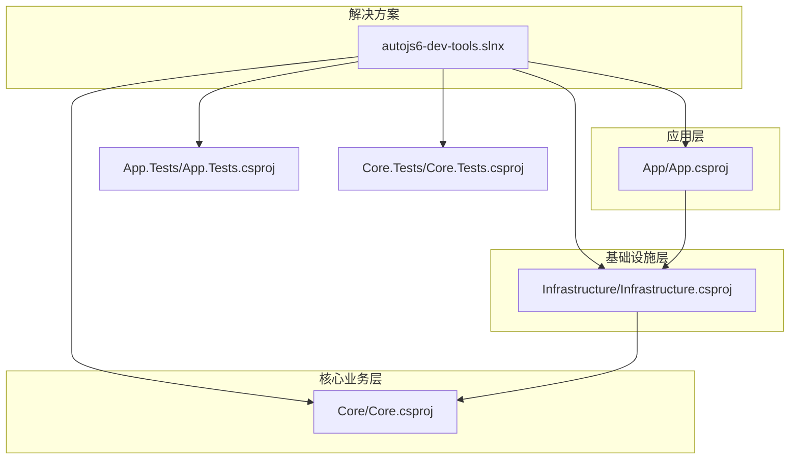
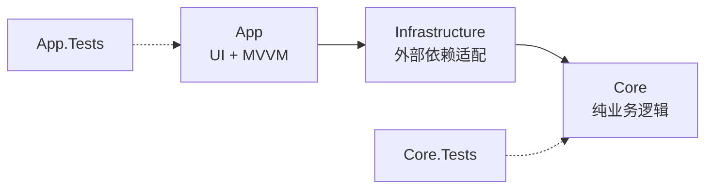
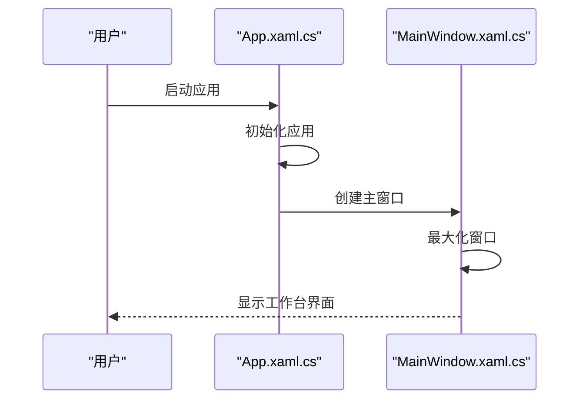
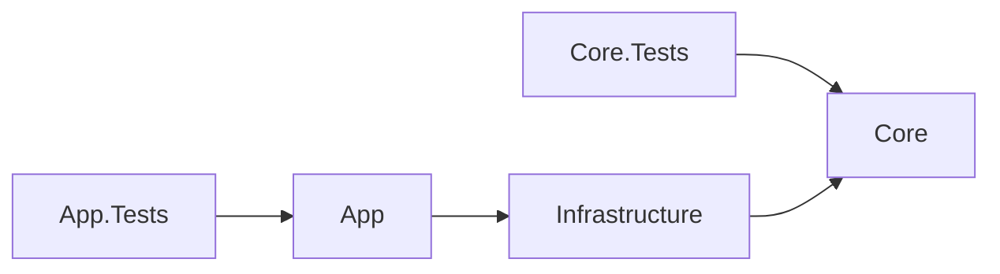

# 快速开始

<cite>
**本文引用的文件**
- [README.md](file://README.md)
- [DEVELOPMENT.md](file://DEVELOPMENT.md)
- [autojs6-dev-tools.slnx](file://autojs6-dev-tools.slnx)
- [App/App.csproj](file://App/App.csproj)
- [Core/Core.csproj](file://Core/Core.csproj)
- [Infrastructure/Infrastructure.csproj](file://Infrastructure/Infrastructure.csproj)
- [App/Properties/launchSettings.json](file://App/Properties/launchSettings.json)
- [App/App.xaml.cs](file://App/App.xaml.cs)
- [App/App.xaml](file://App/App.xaml)
- [App/MainWindow.xaml.cs](file://App/MainWindow.xaml.cs)
- [App/MainWindow.xaml](file://App/MainWindow.xaml)
- [AGENTS.md](file://AGENTS.md)
- [App.Tests/App.Tests.csproj](file://App.Tests/App.Tests.csproj)
- [Core.Tests/Core.Tests.csproj](file://Core.Tests/Core.Tests.csproj)
</cite>

## 目录
1. [简介](#简介)
2. [项目结构](#项目结构)
3. [核心组件](#核心组件)
4. [架构总览](#架构总览)
5. [详细组件分析](#详细组件分析)
6. [依赖分析](#依赖分析)
7. [性能考虑](#性能考虑)
8. [故障排除指南](#故障排除指南)
9. [结论](#结论)
10. [附录](#附录)

## 简介
本指南面向首次接触 AutoJS6 可视化开发工具的开发者，帮助你在 Windows 10/11 上快速完成环境准备、项目克隆、依赖还原、本地路径配置与运行。你将学会：
- 安装系统要求（.NET 8 SDK、Visual Studio 2022/2026、ADB 工具）
- 克隆仓库、还原 NuGet 包、配置本地路径
- 两种运行方式：命令行构建运行、Visual Studio 直接启动
- 常见安装问题的排查与解决

## 项目结构
该项目采用分层架构，核心模块包括：
- App：WinUI 3 应用层，负责 UI 与 MVVM
- Core：纯业务逻辑层，无 UI 依赖，独立可测试
- Infrastructure：封装外部依赖（ADB、OpenCV、ImageSharp）

图表来源
- [autojs6-dev-tools.slnx:1-30](file://autojs6-dev-tools.slnx#L1-L30)
- [App/App.csproj:1-84](file://App/App.csproj#L1-L84)
- [Infrastructure/Infrastructure.csproj:1-19](file://Infrastructure/Infrastructure.csproj#L1-L19)
- [Core/Core.csproj:1-10](file://Core/Core.csproj#L1-L10)
- [App.Tests/App.Tests.csproj:1-17](file://App.Tests/App.Tests.csproj#L1-L17)
- [Core.Tests/Core.Tests.csproj:1-21](file://Core.Tests/Core.Tests.csproj#L1-L21)

章节来源
- [README.md:230-260](file://README.md#L230-L260)
- [autojs6-dev-tools.slnx:1-30](file://autojs6-dev-tools.slnx#L1-L30)

## 核心组件
- 应用层（App）：WinUI 3 + Windows App SDK，启用 MSIX 打包与 Win2D 渲染，支持多平台运行时标识（win-x86/win-x64/win-arm64）
- 基础设施层（Infrastructure）：封装 ADB 通信、OpenCV 图像处理、ImageSharp 图像操作
- 核心业务层（Core）：纯业务逻辑，独立于 UI 与外部依赖，便于单元测试

章节来源
- [App/App.csproj:1-84](file://App/App.csproj#L1-L84)
- [Infrastructure/Infrastructure.csproj:1-19](file://Infrastructure/Infrastructure.csproj#L1-L19)
- [Core/Core.csproj:1-10](file://Core/Core.csproj#L1-L10)

## 架构总览
系统采用 Clean Architecture 分层，单向依赖：App → Infrastructure → Core ← Infrastructure。

图表来源
- [App/App.csproj:67-68](file://App/App.csproj#L67-L68)
- [Infrastructure/Infrastructure.csproj:9-11](file://Infrastructure/Infrastructure.csproj#L9-L11)
- [Core/Core.csproj:1-10](file://Core/Core.csproj#L1-L10)

章节来源
- [README.md:264-287](file://README.md#L264-L287)

## 详细组件分析

### 系统要求与前置条件
- 操作系统：Windows 10/11（建议 Build 22621.0+）
- 运行时：.NET 8 SDK
- 开发工具：Visual Studio 2022/2026（含 WinUI 3 工作负载）
- 设备工具：Android Debug Bridge（ADB）需在 PATH 中
- 可选：MSBuild + SignTool、Inno Setup 6（用于本地打包验证）

章节来源
- [README.md:112-124](file://README.md#L112-L124)

### 安装与配置步骤

#### 步骤一：克隆仓库
- 在终端中执行克隆命令并进入项目目录

章节来源
- [README.md:125-131](file://README.md#L125-L131)

#### 步骤二：安装依赖
- 还原 NuGet 包（推荐先还原解决方案）

章节来源
- [README.md:132-137](file://README.md#L132-L137)

#### 步骤三：配置本地路径
- 编辑 AGENTS.md 文件，设置以下环境变量（按本机路径替换）
  - YXS_DAY_TASK_ROOT
  - AUTOJS6_DOCS_ROOT
  - AUTOJS6_SOURCE_ROOT

章节来源
- [README.md:139-147](file://README.md#L139-L147)
- [AGENTS.md:100-111](file://AGENTS.md#L100-L111)

#### 步骤四：构建与运行
- 方式一：命令行
  - 还原解决方案包
  - 构建解决方案
  - 运行应用项目
- 方式二：Visual Studio
  - 打开解决方案文件，直接启动（F5）

章节来源
- [README.md:149-162](file://README.md#L149-L162)

### 运行方式对比

图表来源
- [README.md:149-162](file://README.md#L149-L162)
- [autojs6-dev-tools.slnx:1-30](file://autojs6-dev-tools.slnx#L1-L30)

章节来源
- [README.md:149-162](file://README.md#L149-L162)

### 应用启动流程（代码级）

图表来源
- [App/App.xaml.cs:49-54](file://App/App.xaml.cs#L49-L54)
- [App/MainWindow.xaml.cs:28-50](file://App/MainWindow.xaml.cs#L28-L50)

章节来源
- [App/App.xaml.cs:1-57](file://App/App.xaml.cs#L1-L57)
- [App/MainWindow.xaml.cs:1-53](file://App/MainWindow.xaml.cs#L1-L53)

## 依赖分析
- App 依赖 Infrastructure
- Infrastructure 依赖 Core
- 测试项目分别依赖 App 与 Core

图表来源
- [App.Tests/App.Tests.csproj:1-17](file://App.Tests/App.Tests.csproj#L1-L17)
- [Core.Tests/Core.Tests.csproj:1-21](file://Core.Tests/Core.Tests.csproj#L1-L21)
- [App/App.csproj:67-68](file://App/App.csproj#L67-L68)
- [Infrastructure/Infrastructure.csproj:9-11](file://Infrastructure/Infrastructure.csproj#L9-L11)

章节来源
- [App.Tests/App.Tests.csproj:1-17](file://App.Tests/App.Tests.csproj#L1-L17)
- [Core.Tests/Core.Tests.csproj:1-21](file://Core.Tests/Core.Tests.csproj#L1-L21)
- [App/App.csproj:67-68](file://App/App.csproj#L67-L68)
- [Infrastructure/Infrastructure.csproj:9-11](file://Infrastructure/Infrastructure.csproj#L9-L11)

## 性能考虑
- 异步优先：所有 I/O 操作（ADB、OpenCV、XML 解析、纹理上传）使用异步模型，避免 UI 阻塞
- 渲染优化：Win2D 双层渲染（图像层 + 覆盖层），阈值滑动仅重算匹配层，不重建图像纹理
- 平台配置：针对 win-x86/win-x64/win-arm64 设置明确的运行时标识，避免 AnyCPU 回退

章节来源
- [AGENTS.md:231-247](file://AGENTS.md#L231-L247)
- [App/App.csproj:13-18](file://App/App.csproj#L13-L18)

## 故障排除指南
- 无法找到 ADB
  - 确认 ADB 工具已安装并加入系统 PATH
- Visual Studio 缺失 WinUI 3 工作负载
  - 通过 Visual Studio Installer 安装 WinUI 3 工作负载
- .NET 8 SDK 未安装或版本不匹配
  - 安装 .NET 8 SDK 并确认版本
- 还原/构建失败
  - 先执行 dotnet restore，再执行 dotnet build
- MSIX 打包签名失败
  - 确认证书主题与发布清单中的 Publisher 一致，导入证书到受信任发布者与受信任根证书颁发机构存储
- EXE 安装器构建失败
  - 确认 Inno Setup 6 的 ISCC.exe 可用，输出目录可写

章节来源
- [README.md:112-124](file://README.md#L112-L124)
- [DEVELOPMENT.md:35-44](file://DEVELOPMENT.md#L35-L44)
- [DEVELOPMENT.md:224-249](file://DEVELOPMENT.md#L224-L249)

## 结论
按照本指南完成系统要求、克隆仓库、还原依赖、配置本地路径与运行方式后，你将能在 Windows 上顺利启动 AutoJS6 可视化开发工具，体验图像模式与控件模式的核心功能，并基于此进行二次开发与扩展。

## 附录

### 快速命令清单
- 克隆与进入目录
- 还原解决方案包
- 构建解决方案
- 运行应用项目
- 打开解决方案并在 Visual Studio 中启动

章节来源
- [README.md:125-162](file://README.md#L125-L162)