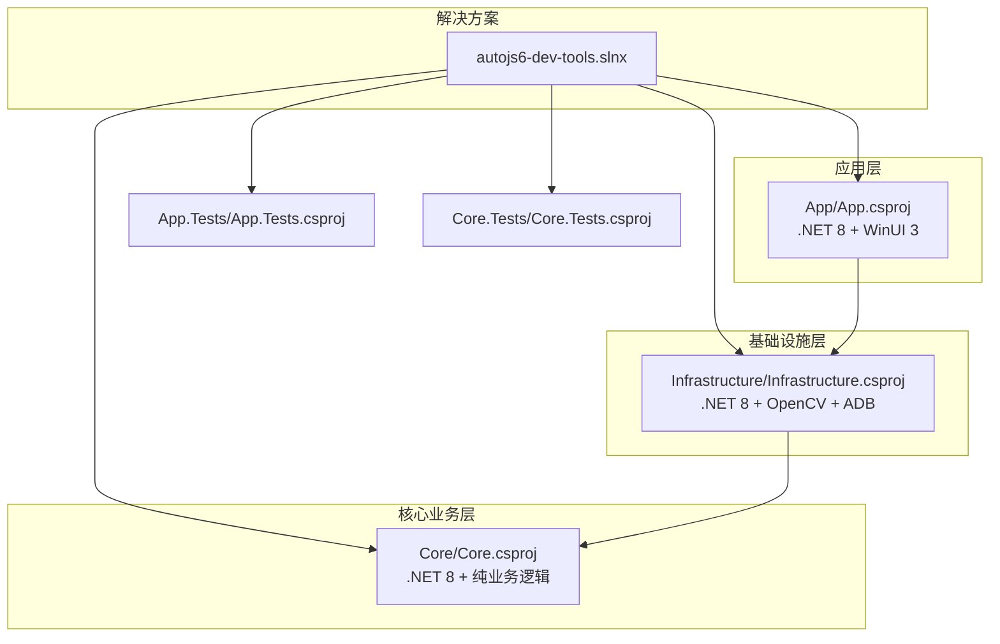
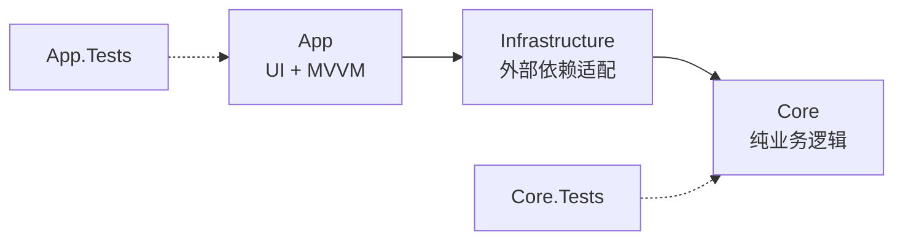
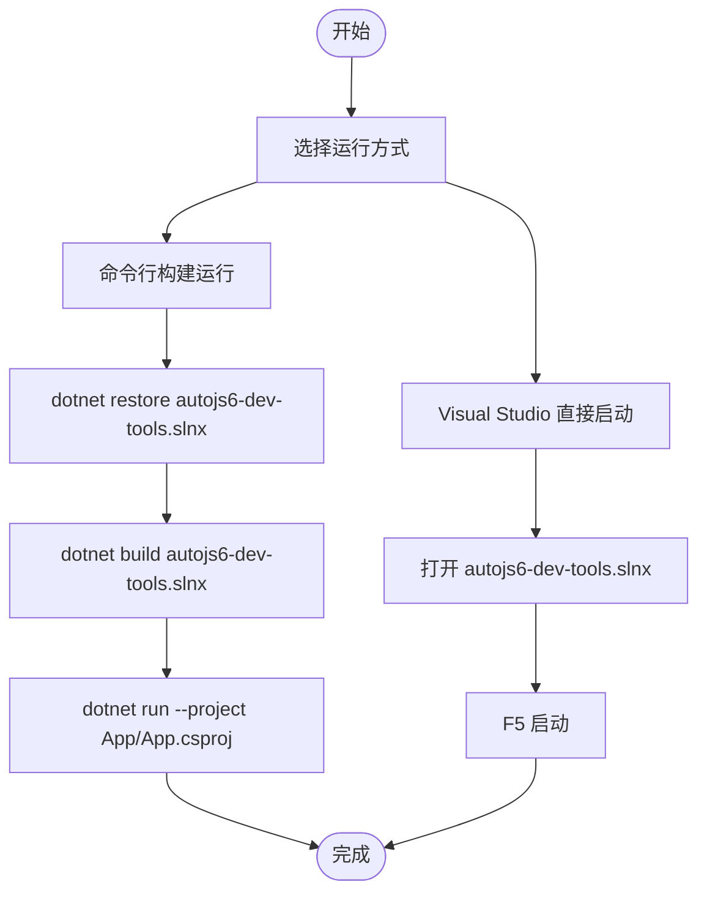
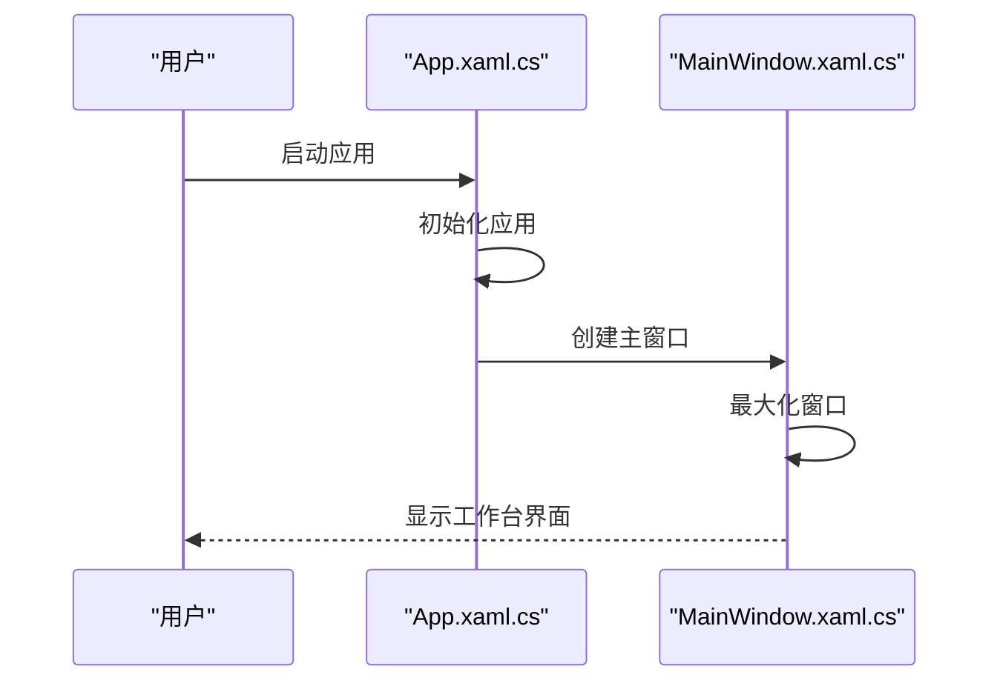
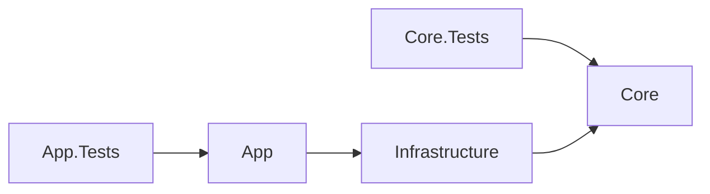

# 快速开始

<cite>
**本文引用的文件**
- [README.md](file://README.md)
- [DEVELOPMENT.md](file://DEVELOPMENT.md)
- [autojs6-dev-tools.slnx](file://autojs6-dev-tools.slnx)
- [App/App.csproj](file://App/App.csproj)
- [Core/Core.csproj](file://Core/Core.csproj)
- [Infrastructure/Infrastructure.csproj](file://Infrastructure/Infrastructure.csproj)
- [App/Properties/launchSettings.json](file://App/Properties/launchSettings.json)
- [App/App.xaml.cs](file://App/App.xaml.cs)
- [App/App.xaml](file://App/App.xaml)
- [App/MainWindow.xaml.cs](file://App/MainWindow.xaml.cs)
- [App/MainWindow.xaml](file://App/MainWindow.xaml)
- [AGENTS.md](file://AGENTS.md)
- [openspec/project.md](file://openspec/project.md)
- [App.Tests/App.Tests.csproj](file://App.Tests/App.Tests.csproj)
- [Core.Tests/Core.Tests.csproj](file://Core.Tests/Core.Tests.csproj)
</cite>

## 更新摘要
**变更内容**
- 新增.NET 8安装要求的明确说明和重要性强调
- 增强工具动机说明，详细解释使用AutoJS6可视化开发工具的价值和痛点
- 更新系统要求部分，突出.NET 8 SDK作为必备前置条件
- 完善环境变量配置说明，聚焦于AUTOJS6相关的两个核心环境变量

## 目录
1. [简介](#简介)
2. [项目结构](#项目结构)
3. [核心组件](#核心组件)
4. [架构总览](#架构总览)
5. [详细组件分析](#详细组件分析)
6. [依赖分析](#依赖分析)
7. [性能考虑](#性能考虑)
8. [故障排除指南](#故障排除指南)
9. [结论](#结论)
10. [附录](#附录)

## 简介
本指南面向首次接触 AutoJS6 可视化开发工具的开发者，帮助你在 Windows 10/11 上快速完成环境准备、项目克隆、依赖还原、本地路径配置与运行。该工具专为解决AutoJS6脚本开发中的痛点而设计，能够显著提升开发效率和质量。

**为什么你需要这个工具？**
- **图像识别调试困难**：模板匹配经常失败，需要多次试错才能找到合适阈值
- **坐标定位不准**：手动猜测坐标，经常出现偏差导致点击失败
- **跨设备兼容性差**：不同分辨率设备上脚本表现不一致
- **开发流程繁琐**：截图→裁剪→写代码→设备测试→反复调试的循环

**工具如何解决这些问题？**
- 实时模板匹配预览，支持阈值实时调节
- 可视化坐标拾取，精确到像素级别的定位
- 自动代码生成，一键生成可运行的AutoJS6脚本
- 多分辨率测试支持，一次调试多设备适配

## 项目结构
该项目采用分层架构，核心模块包括：
- App：WinUI 3 应用层，负责 UI 与 MVVM
- Core：纯业务逻辑层，无 UI 依赖，独立可测试
- Infrastructure：封装外部依赖（ADB、OpenCV、ImageSharp）

**图表来源**
- [autojs6-dev-tools.slnx:1-34](file://autojs6-dev-tools.slnx#L1-L34)
- [App/App.csproj:1-88](file://App/App.csproj#L1-L88)
- [Infrastructure/Infrastructure.csproj:1-19](file://Infrastructure/Infrastructure.csproj#L1-L19)
- [Core/Core.csproj:1-10](file://Core/Core.csproj#L1-L10)
- [App.Tests/App.Tests.csproj:1-17](file://App.Tests/App.Tests.csproj#L1-L17)
- [Core.Tests/Core.Tests.csproj:1-21](file://Core.Tests/Core.Tests.csproj#L1-L21)

**章节来源**
- [README.md:262-292](file://README.md#L262-L292)
- [autojs6-dev-tools.slnx:1-34](file://autojs6-dev-tools.slnx#L1-L34)

## 核心组件
- 应用层（App）：WinUI 3 + Windows App SDK，启用 MSIX 打包与 Win2D 渲染，支持多平台运行时标识（win-x86/win-x64/win-arm64）
- 基础设施层（Infrastructure）：封装 ADB 通信、OpenCV 图像处理、ImageSharp 图像操作
- 核心业务层（Core）：纯业务逻辑，独立于 UI 与外部依赖，便于单元测试

**章节来源**
- [App/App.csproj:1-88](file://App/App.csproj#L1-L88)
- [Infrastructure/Infrastructure.csproj:1-19](file://Infrastructure/Infrastructure.csproj#L1-L19)
- [Core/Core.csproj:1-10](file://Core/Core.csproj#L1-L10)

## 架构总览
系统采用 Clean Architecture 分层，单向依赖：App → Infrastructure → Core ← Infrastructure。

**图表来源**
- [App/App.csproj:67-68](file://App/App.csproj#L67-L68)
- [Infrastructure/Infrastructure.csproj:9-11](file://Infrastructure/Infrastructure.csproj#L9-L11)
- [Core/Core.csproj:1-10](file://Core/Core.csproj#L1-L10)

**章节来源**
- [README.md:296-320](file://README.md#L296-L320)

## 详细组件分析

### 系统要求与前置条件

**⚠️ 重要前置条件：.NET 8 SDK 必须先安装**
> 在尝试运行之前，请先安装 .NET 8 SDK  
> 下载地址：https://dotnet.microsoft.com/zh-cn/download/dotnet/8.0  
> 缺少 .NET 8 可能导致应用无法正常启动或在某些机器上运行异常

- **操作系统**：Windows 10/11（建议 Build 22621.0+）
- **运行时**：.NET 8 SDK（**必备**）
- **开发工具**：Visual Studio 2022/2026（含 WinUI 3 工作负载）
- **设备工具**：Android Debug Bridge（ADB）需在 PATH 中
- **可选**：MSBuild + SignTool、Inno Setup 6（用于本地打包验证）

**为什么需要.NET 8？**
- 项目使用 .NET 8 作为目标框架（App.csproj:4）
- WinUI 3 需要 .NET 8 运行时支持
- 确保与 Windows App SDK 的兼容性
- 提供更好的性能和稳定性

**章节来源**
- [README.md:11-13](file://README.md#L11-L13)
- [README.md:129-135](file://README.md#L129-L135)
- [App/App.csproj:4](file://App/App.csproj#L4)

### 安装与配置步骤

#### 步骤一：克隆仓库
- 在终端中执行克隆命令并进入项目目录

**章节来源**
- [README.md:158-163](file://README.md#L158-L163)

#### 步骤二：安装依赖
- 还原 NuGet 包（推荐先还原解决方案）

**章节来源**
- [README.md:165-170](file://README.md#L165-L170)

#### 步骤三：配置本地路径
- 编辑 AGENTS.md 文件，设置以下环境变量（按本机路径替换）
  - AUTOJS6_DOCS_ROOT：AutoJS6 文档根目录
  - AUTOJS6_SOURCE_ROOT：AutoJS6 源码根目录

**更新** 删除了 YXS_DAY_TASK_ROOT 环境变量配置说明，仅保留当前项目所需的 AUTOJS6 环境变量

**章节来源**
- [README.md:172-179](file://README.md#L172-L179)
- [AGENTS.md:99-107](file://AGENTS.md#L99-L107)
- [openspec/project.md:32-39](file://openspec/project.md#L32-L39)

#### 步骤四：构建与运行
- 方式一：命令行
  - 还原解决方案包
  - 构建解决方案
  - 运行应用项目
- 方式二：Visual Studio
  - 打开解决方案文件，直接启动（F5）

**章节来源**
- [README.md:181-194](file://README.md#L181-L194)

### 运行方式对比

**图表来源**
- [README.md:181-194](file://README.md#L181-L194)
- [autojs6-dev-tools.slnx:1-34](file://autojs6-dev-tools.slnx#L1-L34)

**章节来源**
- [README.md:181-194](file://README.md#L181-L194)

### 应用启动流程（代码级）

**图表来源**
- [App/App.xaml.cs:49-54](file://App/App.xaml.cs#L49-L54)
- [App/MainWindow.xaml.cs:28-50](file://App/MainWindow.xaml.cs#L28-L50)

**章节来源**
- [App/App.xaml.cs:1-57](file://App/App.xaml.cs#L1-L57)
- [App/MainWindow.xaml.cs:1-53](file://App/MainWindow.xaml.cs#L1-L53)

## 依赖分析
- App 依赖 Infrastructure
- Infrastructure 依赖 Core
- 测试项目分别依赖 App 与 Core

**图表来源**
- [App.Tests/App.Tests.csproj:1-17](file://App.Tests/App.Tests.csproj#L1-L17)
- [Core.Tests/Core.Tests.csproj:1-21](file://Core.Tests/Core.Tests.csproj#L1-L21)
- [App/App.csproj:71](file://App/App.csproj#L71)
- [Infrastructure/Infrastructure.csproj:9-11](file://Infrastructure/Infrastructure.csproj#L9-L11)

**章节来源**
- [App.Tests/App.Tests.csproj:1-17](file://App.Tests/App.Tests.csproj#L1-L17)
- [Core.Tests/Core.Tests.csproj:1-21](file://Core.Tests/Core.Tests.csproj#L1-L21)
- [App/App.csproj:71](file://App/App.csproj#L71)
- [Infrastructure/Infrastructure.csproj:9-11](file://Infrastructure/Infrastructure.csproj#L9-L11)

## 性能考虑
- 异步优先：所有 I/O 操作（ADB、OpenCV、XML 解析、纹理上传）使用异步模型，避免 UI 阻塞
- 渲染优化：Win2D 双层渲染（图像层 + 覆盖层），阈值滑动仅重算匹配层，不重建图像纹理
- 平台配置：针对 win-x86/win-x64/win-arm64 设置明确的运行时标识，避免 AnyCPU 回退

**章节来源**
- [AGENTS.md:209-233](file://AGENTS.md#L209-L233)
- [App/App.csproj:13-18](file://App/App.csproj#L13-L18)

## 故障排除指南
- **.NET 8 SDK 未安装或版本不匹配**
  - 安装 .NET 8 SDK 并确认版本
  - 重启开发环境使新安装生效
- **无法找到 ADB**
  - 确认 ADB 工具已安装并加入系统 PATH
- **Visual Studio 缺失 WinUI 3 工作负载**
  - 通过 Visual Studio Installer 安装 WinUI 3 工作负载
- **还原/构建失败**
  - 先执行 dotnet restore，再执行 dotnet build
- **MSIX 打包签名失败**
  - 确认证书主题与发布清单中的 Publisher 一致，导入证书到受信任发布者与受信任根证书颁发机构存储
- **EXE 安装器构建失败**
  - 确认 Inno Setup 6 的 ISCC.exe 可用，输出目录可写

**章节来源**
- [README.md:129-135](file://README.md#L129-L135)
- [DEVELOPMENT.md:118-127](file://DEVELOPMENT.md#L118-L127)
- [DEVELOPMENT.md:390-416](file://DEVELOPMENT.md#L390-L416)

## 结论
按照本指南完成系统要求（特别是.NET 8 SDK的安装）、克隆仓库、还原依赖、配置本地路径与运行方式后，你将能在 Windows 上顺利启动 AutoJS6 可视化开发工具。该工具能够显著提升你的开发效率，解决AutoJS6脚本开发中的常见痛点，让你专注于业务逻辑而非繁琐的调试过程。

## 附录

### 快速命令清单
- 克隆与进入目录
- 还原解决方案包
- 构建解决方案
- 运行应用项目
- 打开解决方案并在 Visual Studio 中启动

**章节来源**
- [README.md:158-194](file://README.md#L158-L194)

### 环境变量配置详解

#### AUTOJS6 环境变量说明
项目当前仅需要以下两个环境变量来支持本地 AutoJS6 API 和源码查找：

- **AUTOJS6_DOCS_ROOT**：指向 AutoJS6 文档根目录的本地路径
  - 用途：API 发现、引用和辅助阅读
  - 路径结构：`$AUTOJS6_DOCS_ROOT/json/`（API 发现）、`$AUTOJS6_DOCS_ROOT/api/`（API 引用）、`$AUTOJS6_DOCS_ROOT/docs/`（辅助阅读）

- **AUTOJS6_SOURCE_ROOT**：指向 AutoJS6 源码根目录的本地路径
  - 用途：最终 API 定义和实现参考
  - 关键源码位置：
    - `app/src/main/java/org/autojs/autojs/runtime/api/augment/`：API 实现
    - `app/src/main/java/org/autojs/autojs/core/accessibility/`：无障碍桥接层
    - `app/src/main/java/org/autojs/autojs/core/activity/`：前台应用检测

**更新** 删除了 YXS_DAY_TASK_ROOT 环境变量配置，仅保留当前项目所需的 AUTOJS6 环境变量

**章节来源**
- [AGENTS.md:99-107](file://AGENTS.md#L99-L107)
- [openspec/project.md:32-39](file://openspec/project.md#L32-L39)

### 工具价值与使用场景

**适用场景：**
- 需要频繁进行图像识别和模板匹配的AutoJS6开发者
- 需要在多设备间进行兼容性测试的脚本作者
- 希望提升开发效率，减少调试时间的自动化工程师
- 需要可视化工具辅助进行UI元素定位和交互的测试人员

**核心价值：**
- **效率提升**：从"试错式"开发转变为"可视化"开发
- **质量保证**：实时预览匹配结果，避免重复调试
- **跨设备兼容**：支持多分辨率测试，一次调试多设备适配
- **代码质量**：自动生成符合AutoJS6规范的代码，避免常见错误