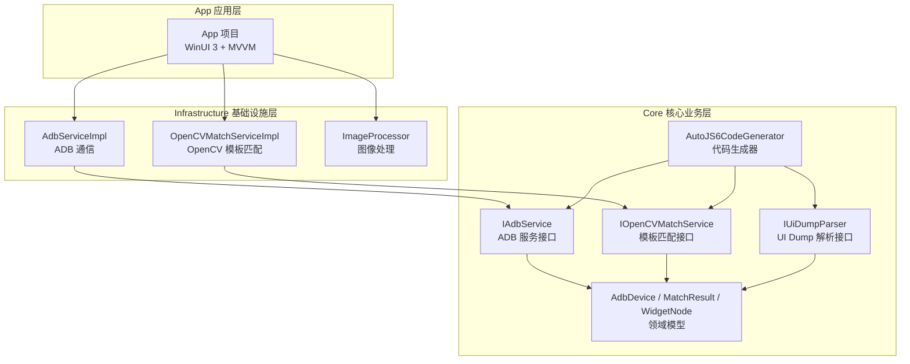
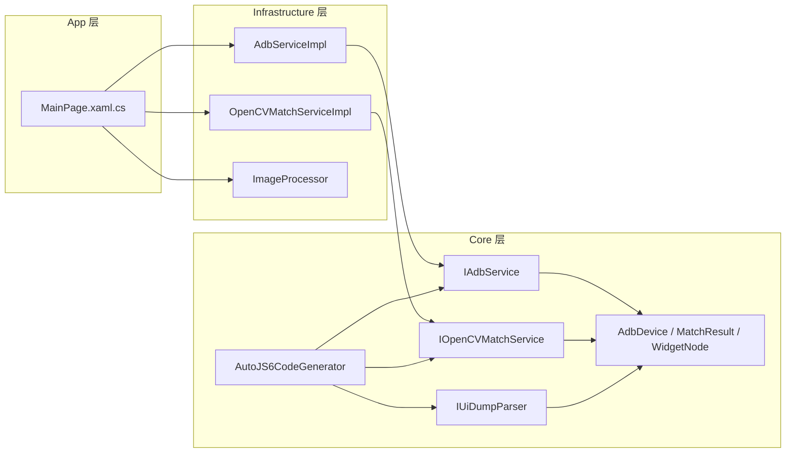
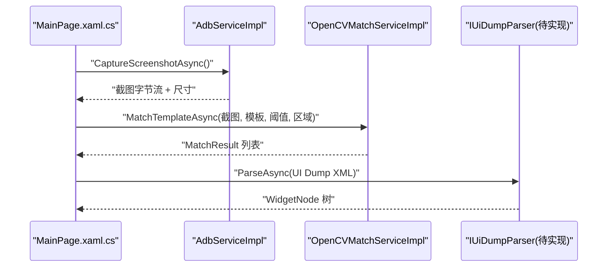
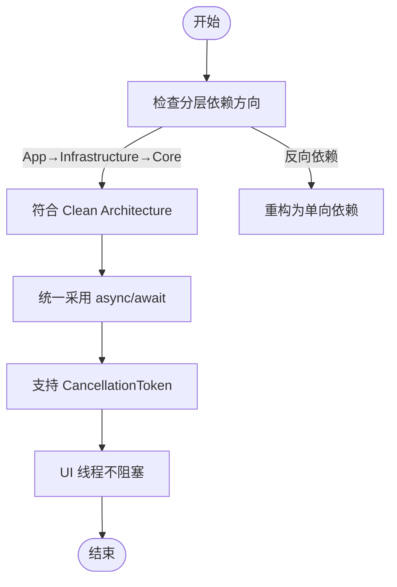
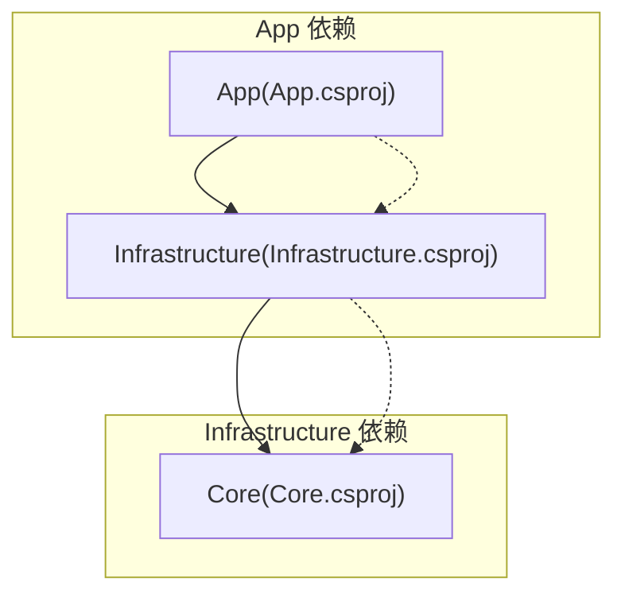

# 技术架构概览

<cite>
**本文引用的文件**
- [README.md](file://README.md)
- [App.csproj](file://App/App.csproj)
- [Core.csproj](file://Core/Core.csproj)
- [Infrastructure.csproj](file://Infrastructure/Infrastructure.csproj)
- [App.xaml.cs](file://App/App.xaml.cs)
- [MainWindow.xaml.cs](file://App/MainWindow.xaml.cs)
- [IAdbService.cs](file://Core/Abstractions/IAdbService.cs)
- [IOpenCVMatchService.cs](file://Core/Abstractions/IOpenCVMatchService.cs)
- [IUiDumpParser.cs](file://Core/Abstractions/IUiDumpParser.cs)
- [AdbServiceImpl.cs](file://Infrastructure/Adb/AdbServiceImpl.cs)
- [OpenCVMatchServiceImpl.cs](file://Infrastructure/Imaging/OpenCVMatchServiceImpl.cs)
- [AutoJS6CodeGenerator.cs](file://Core/Services/AutoJS6CodeGenerator.cs)
- [AdbDevice.cs](file://Core/Models/AdbDevice.cs)
- [MatchResult.cs](file://Core/Models/MatchResult.cs)
- [WidgetNode.cs](file://Core/Models/WidgetNode.cs)
- [MainPage.xaml.cs](file://App/Views/MainPage.xaml.cs)
</cite>

## 目录
1. [引言](#引言)
2. [项目结构](#项目结构)
3. [核心组件](#核心组件)
4. [架构总览](#架构总览)
5. [详细组件分析](#详细组件分析)
6. [依赖分析](#依赖分析)
7. [性能考虑](#性能考虑)
8. [故障排查指南](#故障排查指南)
9. [结论](#结论)
10. [附录](#附录)

## 引言
本文件面向 AutoJS6 可视化开发工具的架构设计与实现，系统性阐述 Clean Architecture 分层架构在本项目中的落地方式，重点说明三层分层（App/UI 层、Infrastructure 基础设施层、Core 核心业务层）的职责边界与协作关系；深入解析"双引擎独立性"（图像引擎与控件引擎完全解耦）的设计思想与实现路径；阐明"单向依赖原则"（App → Infrastructure → Core）如何提升可维护性与可测试性；介绍"异步优先"架构的设计理念与实践；并结合 WinUI 3、OpenCvSharp4、SharpAdbClient 等关键技术栈，给出架构图表与组件关系说明，帮助开发者快速理解系统整体设计。

## 项目结构
项目采用解决方案级分层组织，包含三层模块与测试层：
- App：WinUI 3 应用层，负责 UI 与 MVVM 绑定，不直接依赖外部库。
- Infrastructure：基础设施层，封装外部依赖（ADB、OpenCV、ImageSharp），向上提供 Core 接口。
- Core：核心业务层，定义纯业务抽象与领域模型，无 UI 与外部依赖，便于单元测试。
- 测试：App.Tests 与 Core.Tests 分别覆盖应用层与核心层。

**图表来源**
- [App.csproj:67-68](file://App/App.csproj#L67-L68)
- [Infrastructure.csproj:9-11](file://Infrastructure/Infrastructure.csproj#L9-L11)
- [Core.csproj:1-10](file://Core/Core.csproj#L1-L10)

**章节来源**
- [README.md: 249-279:249-279](file://README.md#L249-L279)
- [App.csproj: 67-68:67-68](file://App/App.csproj#L67-L68)
- [Infrastructure.csproj: 9-11:9-11](file://Infrastructure/Infrastructure.csproj#L9-L11)
- [Core.csproj: 1-10:1-10](file://Core/Core.csproj#L1-L10)

## 核心组件
- 应用入口与窗口
  - App.xaml.cs：应用启动，创建并激活 MainWindow。
  - MainWindow.xaml.cs：窗口初始化与最大化逻辑。
- 视图与交互
  - MainPage.xaml.cs：工作台主界面，聚合设备管理、截图、模板匹配、UI 树解析、代码生成等能力。
- 核心接口与模型
  - IAdbService：设备扫描、截图捕获、UI 层次结构拉取、设备连接/配对等。
  - IOpenCVMatchService：模板匹配（单个/多个）、相似度计算、模板有效性校验。
  - IUiDumpParser：UI Dump 解析、节点过滤、坐标查询、UiSelector 代码生成。
  - AdbDevice、MatchResult、WidgetNode：跨层共享的领域模型。
- 基础设施实现
  - AdbServiceImpl：基于 SharpAdbClient 的 ADB 服务实现，含帧缓冲区处理、PNG 编码、设备发现与连接。
  - OpenCVMatchServiceImpl：基于 OpenCvSharp4 的模板匹配实现，支持区域搜索与多结果返回。
- 代码生成器
  - AutoJS6CodeGenerator：根据选项生成图像模式与控件模式的 AutoJS6 脚本，并进行 Rhino 引擎约束校验。

**章节来源**
- [App.xaml.cs: 49-54:49-54](file://App/App.xaml.cs#L49-L54)
- [MainWindow.xaml.cs: 28-50:28-50](file://App/MainWindow.xaml.cs#L28-L50)
- [MainPage.xaml.cs: 43-60:43-60](file://App/Views/MainPage.xaml.cs#L43-L60)
- [IAdbService.cs: 8-56:8-56](file://Core/Abstractions/IAdbService.cs#L8-L56)
- [IOpenCVMatchService.cs: 8-56:8-56](file://Core/Abstractions/IOpenCVMatchService.cs#L8-L56)
- [IUiDumpParser.cs: 8-55:8-55](file://Core/Abstractions/IUiDumpParser.cs#L8-L55)
- [AdbDevice.cs: 6-37:6-37](file://Core/Models/AdbDevice.cs#L6-L37)
- [MatchResult.cs: 6-62:6-62](file://Core/Models/MatchResult.cs#L6-L62)
- [WidgetNode.cs: 6-92:6-92](file://Core/Models/WidgetNode.cs#L6-L92)
- [AdbServiceImpl.cs: 17-237:17-237](file://Infrastructure/Adb/AdbServiceImpl.cs#L17-L237)
- [OpenCVMatchServiceImpl.cs: 11-203:11-203](file://Infrastructure/Imaging/OpenCVMatchServiceImpl.cs#L11-L203)
- [AutoJS6CodeGenerator.cs: 11-356:11-356](file://Core/Services/AutoJS6CodeGenerator.cs#L11-L356)

## 架构总览
Clean Architecture 在本项目中的体现：
- 分层边界清晰：App 不依赖 Infrastructure/Core；Infrastructure 仅依赖 Core 接口；Core 保持纯业务与模型。
- 双引擎独立：图像引擎（OpenCVMatchServiceImpl + ImageProcessor）与控件引擎（UiDumpParser + WidgetNode）完全隔离，数据与处理流程互不耦合。
- 单向依赖：App → Infrastructure → Core，保证控制流自顶向下，降低反向依赖导致的复杂性。
- 异步优先：所有 I/O（ADB、OpenCV、XML 解析、纹理上传）均采用 async/await，避免阻塞 UI 线程。
- 可测试性：Core 层接口与模型可被单元测试直接消费，Infrastructure 通过接口注入替换实现。

**图表来源**
- [MainPage.xaml.cs: 19-50:19-50](file://App/Views/MainPage.xaml.cs#L19-L50)
- [AdbServiceImpl.cs: 17-28:17-28](file://Infrastructure/Adb/AdbServiceImpl.cs#L17-L28)
- [OpenCVMatchServiceImpl.cs: 11-18:11-18](file://Infrastructure/Imaging/OpenCVMatchServiceImpl.cs#L11-L18)
- [IAdbService.cs: 8-56:8-56](file://Core/Abstractions/IAdbService.cs#L8-L56)
- [IOpenCVMatchService.cs: 8-56:8-56](file://Core/Abstractions/IOpenCVMatchService.cs#L8-L56)
- [IUiDumpParser.cs: 8-55:8-55](file://Core/Abstractions/IUiDumpParser.cs#L8-L55)
- [AdbDevice.cs: 6-37:6-37](file://Core/Models/AdbDevice.cs#L6-L37)
- [MatchResult.cs: 6-62:6-62](file://Core/Models/MatchResult.cs#L6-L62)
- [WidgetNode.cs: 6-92:6-92](file://Core/Models/WidgetNode.cs#L6-L92)
- [AutoJS6CodeGenerator.cs: 11-11:11-11](file://Core/Services/AutoJS6CodeGenerator.cs#L11-L11)

## 详细组件分析

### 双引擎独立性设计与实现
- 图像引擎职责
  - 输入：设备截图（PNG 字节流）与模板图像（PNG 字节流）。
  - 处理：OpenCV 模板匹配（单个最佳/多个结果）、相似度计算、模板有效性校验。
  - 输出：MatchResult 结果集，包含置信度、坐标与耗时。
- 控件引擎职责
  - 输入：设备 UI Dump XML。
  - 处理：解析 XML 为 WidgetNode 树，过滤冗余布局容器，按属性或坐标查找节点，生成 UiSelector 代码。
  - 输出：WidgetNode 列表与对应的 UiSelector 字符串。
- 解耦策略
  - 接口隔离：图像与控件分别由 IOpenCVMatchService 与 IUiDumpParser 管理，App 层通过接口调用，不关心具体实现。
  - 数据隔离：图像引擎返回 MatchResult，控件引擎返回 WidgetNode，两者不互相依赖。
  - 独立渲染：MainPage 同时承载图像画布与 UI 树面板，但内部通过状态机与事件解耦两套管线。

**图表来源**
- [MainPage.xaml.cs: 147-178:147-178](file://App/Views/MainPage.xaml.cs#L147-L178)
- [AdbServiceImpl.cs: 72-118:72-118](file://Infrastructure/Adb/AdbServiceImpl.cs#L72-L118)
- [OpenCVMatchServiceImpl.cs: 13-60:13-60](file://Infrastructure/Imaging/OpenCVMatchServiceImpl.cs#L13-L60)
- [IUiDumpParser.cs: 8-55:8-55](file://Core/Abstractions/IUiDumpParser.cs#L8-L55)

**章节来源**
- [README.md: 285-289:285-289](file://README.md#L285-L289)
- [MainPage.xaml.cs: 43-60:43-60](file://App/Views/MainPage.xaml.cs#L43-L60)
- [OpenCVMatchServiceImpl.cs: 11-203:11-203](file://Infrastructure/Imaging/OpenCVMatchServiceImpl.cs#L11-L203)
- [IUiDumpParser.cs: 8-55:8-55](file://Core/Abstractions/IUiDumpParser.cs#L8-L55)

### 单向依赖原则与异步优先
- 单向依赖
  - App 仅依赖 Infrastructure 接口，不直接依赖 Core 或第三方库。
  - Infrastructure 仅依赖 Core 接口，向上提供具体实现。
  - Core 保持纯业务与模型，不依赖 UI 与外部库。
- 异步优先
  - 所有 I/O 操作均以 Task/async/await 形式暴露，支持 CancellationToken。
  - UI 线程永不阻塞，后台任务通过 UI 状态反馈与日志服务通知用户。

**图表来源**
- [README.md: 291-295:291-295](file://README.md#L291-L295)
- [App.csproj: 67-68:67-68](file://App/App.csproj#L67-L68)
- [Infrastructure.csproj: 9-11:9-11](file://Infrastructure/Infrastructure.csproj#L9-L11)

**章节来源**
- [README.md: 291-295:291-295](file://README.md#L291-L295)
- [App.xaml.cs: 49-54:49-54](file://App/App.xaml.cs#L49-L54)
- [MainWindow.xaml.cs: 28-50:28-50](file://App/MainWindow.xaml.cs#L28-L50)

### 关键技术选型与作用
- WinUI 3 + Windows App SDK：提供原生 Windows 桌面 UI 与窗口管理能力。
- Microsoft.Graphics.Win2D：GPU 加速 2D 画布，支撑高帧率渲染与辅助工具。
- OpenCvSharp4 + SixLabors.ImageSharp：OpenCV 模板匹配与图像编解码，满足像素级识别需求。
- SharpAdbClient：ADB 通信与设备控制，提供截图、UI Dump、连接/配对等能力。
- CommunityToolkit.Mvvm：MVVM 框架，简化命令与绑定。

**章节来源**
- [README.md: 309-318:309-318](file://README.md#L309-L318)
- [App.csproj: 60-64:60-64](file://App/App.csproj#L60-L64)
- [Infrastructure.csproj: 13-17:13-17](file://Infrastructure/Infrastructure.csproj#L13-L17)

## 依赖分析
- 项目引用关系
  - App 依赖 Infrastructure。
  - Infrastructure 依赖 Core。
- 接口与实现
  - App 通过 IAdbService、IOpenCVMatchService、IUiDumpParser 调用功能。
  - Infrastructure 提供具体实现，Core 提供抽象与模型。
- 循环依赖规避
  - 严格禁止 App → Core 或 Infrastructure → App 的依赖，确保单向依赖链路。

**图表来源**
- [App.csproj: 67-68:67-68](file://App/App.csproj#L67-L68)
- [Infrastructure.csproj: 9-11:9-11](file://Infrastructure/Infrastructure.csproj#L9-L11)
- [Core.csproj: 1-10:1-10](file://Core/Core.csproj#L1-10)

**章节来源**
- [App.csproj: 67-68:67-68](file://App/App.csproj#L67-L68)
- [Infrastructure.csproj: 9-11:9-11](file://Infrastructure/Infrastructure.csproj#L9-L11)
- [Core.csproj: 1-10:1-10](file://Core/Core.csproj#L1-10)

## 性能考虑
- 渲染性能
  - Win2D 双层 GPU 加速画布，支持 60 FPS，配合缩放与惯性平移，满足实时预览需求。
- 匹配性能
  - OpenCV 模板匹配在后台线程执行，支持区域裁剪与阈值调节，减少无效搜索范围。
- I/O 优化
  - ADB 帧缓冲区去填充、PNG 编码在内存流中完成，降低磁盘 IO。
- 异步与取消
  - 所有长时间操作支持 CancellationToken，避免 UI 卡顿与资源泄漏。

**章节来源**
- [README.md: 184-189:184-189](file://README.md#L184-L189)
- [README.md: 282-286:282-286](file://README.md#L282-L286)
- [AdbServiceImpl.cs: 80-118:80-118](file://Infrastructure/Adb/AdbServiceImpl.cs#L80-L118)
- [OpenCVMatchServiceImpl.cs: 19-59:19-59](file://Infrastructure/Imaging/OpenCVMatchServiceImpl.cs#L19-L59)

## 故障排查指南
- ADB 连接问题
  - 确认 ADB 可执行文件路径可被自动发现或显式配置；检查设备在线状态与连接类型（USB/TCP）。
  - 参考：AdbServiceImpl.InitializeAsync、ConnectDeviceAsync、PairDeviceAsync。
- 截图失败
  - 检查设备状态、权限与帧缓冲区尺寸；确认 PNG 编码流程正常。
  - 参考：CaptureScreenshotAsync。
- 模板匹配异常
  - 确认模板有效性与区域设置；调整阈值与搜索区域；查看匹配耗时与置信度。
  - 参考：IOpenCVMatchService、MatchTemplateAsync、CalculateSimilarityAsync。
- UI 树解析异常
  - 确认 UI Dump 成功拉取且 XML 结构完整；检查节点过滤与坐标映射。
  - 参考：IUiDumpParser。
- 代码生成约束
  - 避免在循环体内使用 const/let；注意回收 ImageWrapper 对象；限制每轮循环内截图次数。
  - 参考：AutoJS6CodeGenerator.ValidateCode、FormatCode。

**章节来源**
- [AdbServiceImpl.cs: 33-49:33-49](file://Infrastructure/Adb/AdbServiceImpl.cs#L33-L49)
- [AdbServiceImpl.cs: 150-179:150-179](file://Infrastructure/Adb/AdbServiceImpl.cs#L150-L179)
- [AdbServiceImpl.cs: 72-118:72-118](file://Infrastructure/Adb/AdbServiceImpl.cs#L72-L118)
- [IOpenCVMatchService.cs: 8-56:8-56](file://Core/Abstractions/IOpenCVMatchService.cs#L8-L56)
- [OpenCVMatchServiceImpl.cs: 13-148:13-148](file://Infrastructure/Imaging/OpenCVMatchServiceImpl.cs#L13-L148)
- [IUiDumpParser.cs: 8-55:8-55](file://Core/Abstractions/IUiDumpParser.cs#L8-L55)
- [AutoJS6CodeGenerator.cs: 226-258:226-258](file://Core/Services/AutoJS6CodeGenerator.cs#L226-L258)

## 结论
本项目以 Clean Architecture 为核心指导，通过"双引擎独立性"与"单向依赖原则"，实现了图像识别与控件解析两条主线的解耦；借助"异步优先"与"接口驱动"，在保证 UI 流畅的同时提升了可维护性与可测试性。WinUI 3、OpenCvSharp4、SharpAdbClient 等技术栈的选择与组合，使系统在桌面端具备高性能、易扩展的可视化开发体验。

## 附录
- 开发与运行要点
  - 先恢复包，再构建与运行；确保 ADB 在 PATH 中或正确配置。
  - 遵循分层依赖与模块大小限制，提交前验证双引擎隔离与异步架构。
- 参考文件
  - README.md：总体架构原则、特性与技术选型。
  - App/Infrastructure/Core：分层项目文件与依赖关系。

**章节来源**
- [README.md: 110-162:110-162](file://README.md#L110-L162)
- [README.md: 303-340:303-340](file://README.md#L303-L340)