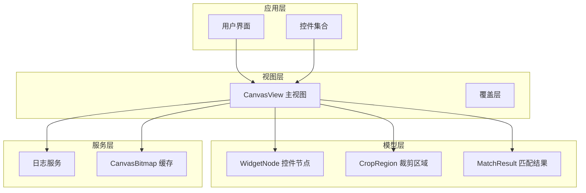
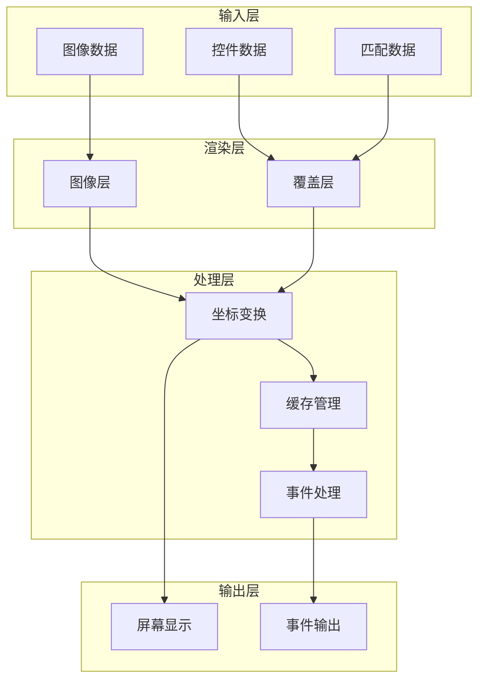
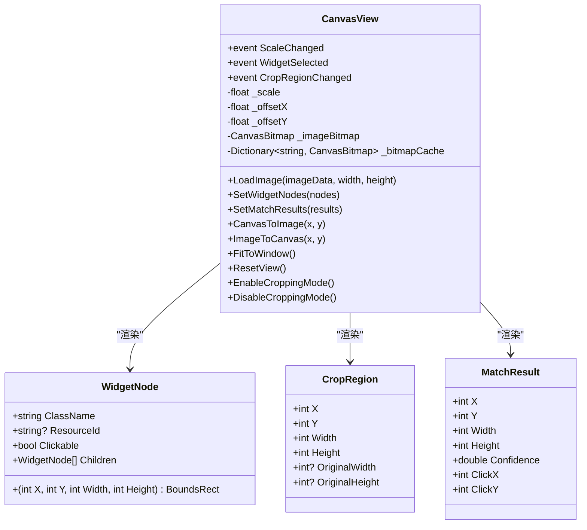
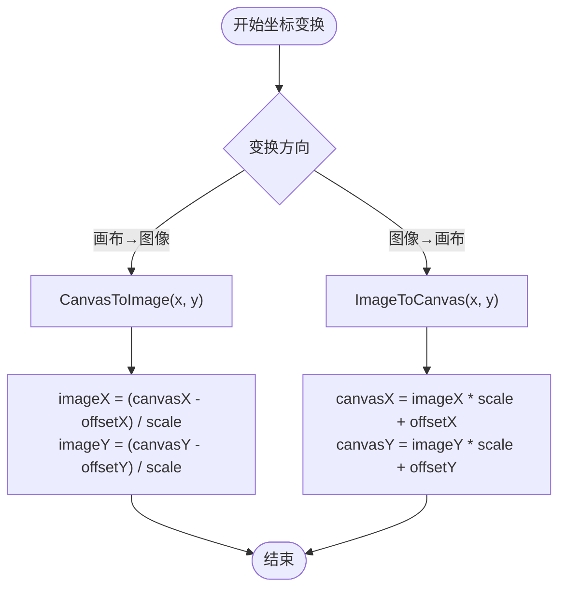
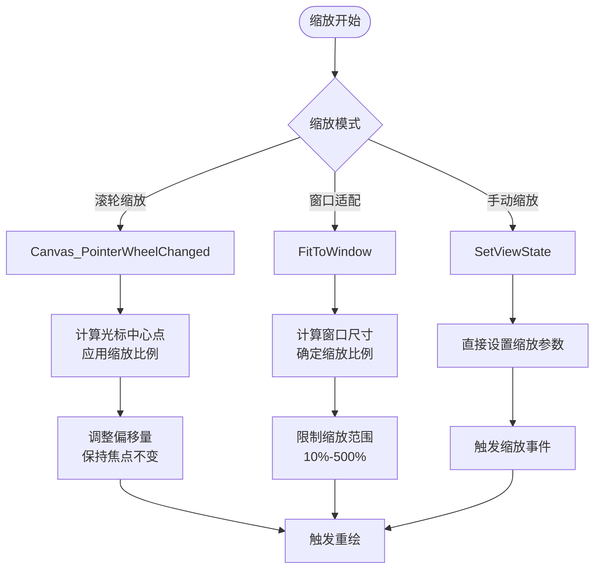
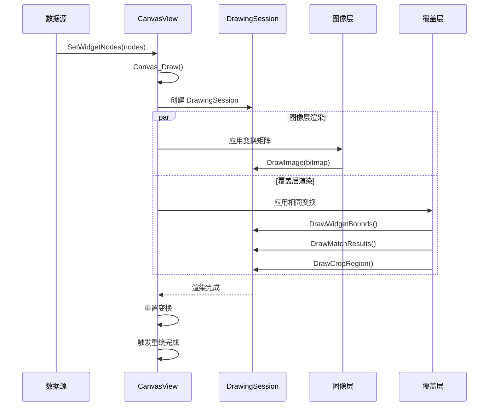
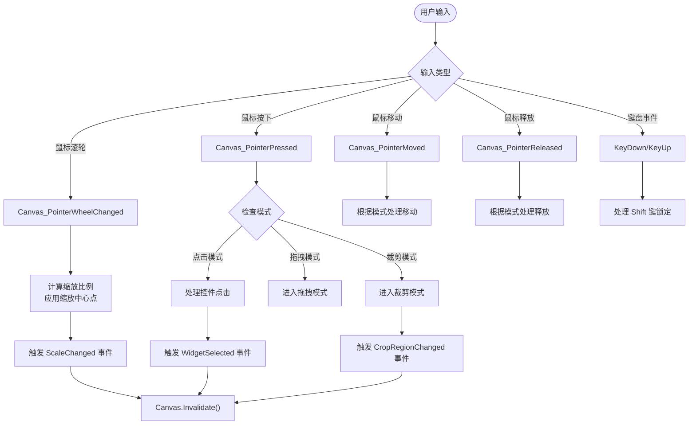
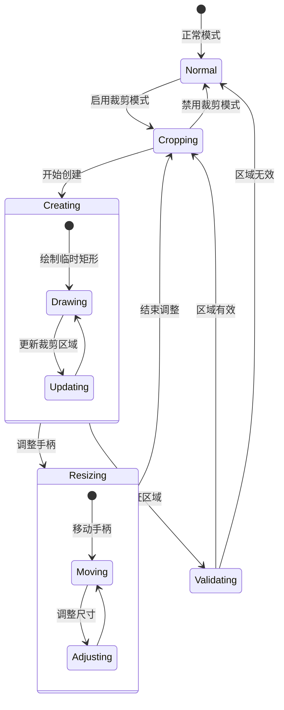
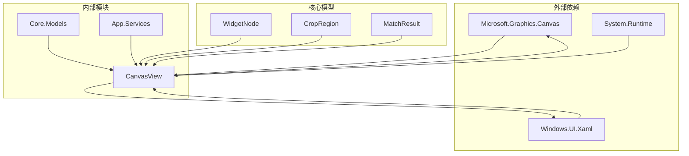
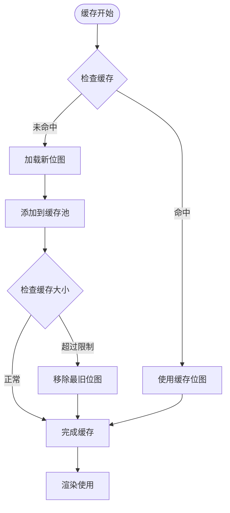

# Canvas 渲染系统

<cite>
**本文档引用的文件**
- [CanvasView.xaml](file://App/Views/CanvasView.xaml)
- [CanvasView.xaml.cs](file://App/Views/CanvasView.xaml.cs)
- [WidgetNode.cs](file://Core/Models/WidgetNode.cs)
- [CropRegion.cs](file://Core/Models/CropRegion.cs)
- [MatchResult.cs](file://Core/Models/MatchResult.cs)
- [LogService.cs](file://App/Services/LogService.cs)
- [MainPage.xaml.cs](file://App/Views/MainPage.xaml.cs)
</cite>

## 目录
1. [简介](#简介)
2. [项目结构](#项目结构)
3. [核心组件](#核心组件)
4. [架构概览](#架构概览)
5. [详细组件分析](#详细组件分析)
6. [依赖关系分析](#依赖关系分析)
7. [性能考虑](#性能考虑)
8. [故障排除指南](#故障排除指南)
9. [结论](#结论)
10. [附录](#附录)

## 简介
Canvas 渲染系统是基于 Microsoft Graphics Canvas (Win2D) 构建的高性能 UI 控件可视化工具。该系统实现了完整的图像渲染管道，支持控件边界高亮显示、坐标变换、缩放适配、交互响应处理等功能。系统采用分层渲染架构，将图像层和覆盖层分离，提供流畅的用户体验和丰富的可视化功能。

## 项目结构
Canvas 渲染系统位于应用程序的 Views 和 Models 层中，采用清晰的分层架构设计：



**图表来源**
- [CanvasView.xaml.cs:1-1307](file://App/Views/CanvasView.xaml.cs#L1-L1307)
- [WidgetNode.cs:1-93](file://Core/Models/WidgetNode.cs#L1-L93)
- [CropRegion.cs:1-53](file://Core/Models/CropRegion.cs#L1-L53)
- [MatchResult.cs:1-63](file://Core/Models/MatchResult.cs#L1-L63)

**章节来源**
- [CanvasView.xaml:1-21](file://App/Views/CanvasView.xaml#L1-L21)
- [CanvasView.xaml.cs:1-1307](file://App/Views/CanvasView.xaml.cs#L1-L1307)

## 核心组件
Canvas 渲染系统由多个核心组件构成，每个组件都有明确的职责和功能：

### CanvasView 主视图
CanvasView 是整个渲染系统的核心控制器，负责：
- 图像加载和缓存管理
- 分层渲染管道执行
- 用户交互事件处理
- 坐标变换算法实现
- 缩放适配和视图控制

### 数据模型层
系统包含三个关键的数据模型：
- **WidgetNode**: UI 控件节点信息，包含边界框、属性和层次关系
- **CropRegion**: 裁剪区域定义，支持矩形区域选择和调整
- **MatchResult**: 模板匹配结果，包含位置、置信度和点击坐标

### 渲染服务
- **CanvasBitmap 缓存**: 高效的位图资源管理，避免重复创建
- **日志服务**: 统一的日志记录和事件通知机制

**章节来源**
- [CanvasView.xaml.cs:24-116](file://App/Views/CanvasView.xaml.cs#L24-L116)
- [WidgetNode.cs:6-92](file://Core/Models/WidgetNode.cs#L6-L92)
- [CropRegion.cs:6-52](file://Core/Models/CropRegion.cs#L6-L52)
- [MatchResult.cs:6-62](file://Core/Models/MatchResult.cs#L6-L62)

## 架构概览
Canvas 渲染系统采用分层渲染架构，实现了清晰的职责分离和高效的渲染管道：



**图表来源**
- [CanvasView.xaml.cs:572-627](file://App/Views/CanvasView.xaml.cs#L572-L627)
- [CanvasView.xaml.cs:578-594](file://App/Views/CanvasView.xaml.cs#L578-L594)

系统的核心渲染流程包括以下步骤：
1. **图像层渲染**: 绘制底图，应用缩放和平移变换
2. **覆盖层渲染**: 绘制控件边界、匹配结果和裁剪区域
3. **坐标变换**: 实现画布坐标与图像坐标的双向转换
4. **事件处理**: 响应用户交互，触发相应的事件

**章节来源**
- [CanvasView.xaml.cs:568-627](file://App/Views/CanvasView.xaml.cs#L568-L627)

## 详细组件分析

### CanvasView 类分析
CanvasView 是系统的核心类，实现了完整的渲染和交互功能：



**图表来源**
- [CanvasView.xaml.cs:24-116](file://App/Views/CanvasView.xaml.cs#L24-L116)
- [WidgetNode.cs:6-92](file://Core/Models/WidgetNode.cs#L6-L92)
- [CropRegion.cs:6-52](file://Core/Models/CropRegion.cs#L6-L52)
- [MatchResult.cs:6-62](file://Core/Models/MatchResult.cs#L6-L62)

#### 坐标变换算法
系统实现了精确的坐标变换算法，支持画布坐标与图像坐标的双向转换：



**图表来源**
- [CanvasView.xaml.cs:548-566](file://App/Views/CanvasView.xaml.cs#L548-L566)

#### 缩放适配机制
系统提供了多种缩放适配策略：



**图表来源**
- [CanvasView.xaml.cs:802-827](file://App/Views/CanvasView.xaml.cs#L802-L827)
- [CanvasView.xaml.cs:472-510](file://App/Views/CanvasView.xaml.cs#L472-L510)
- [CanvasView.xaml.cs:538-545](file://App/Views/CanvasView.xaml.cs#L538-L545)

**章节来源**
- [CanvasView.xaml.cs:548-566](file://App/Views/CanvasView.xaml.cs#L548-L566)
- [CanvasView.xaml.cs:802-827](file://App/Views/CanvasView.xaml.cs#L802-L827)
- [CanvasView.xaml.cs:472-510](file://App/Views/CanvasView.xaml.cs#L472-L510)

### 渲染管线工作流程
渲染管线是系统的核心，实现了从数据到视觉呈现的完整过程：



**图表来源**
- [CanvasView.xaml.cs:572-627](file://App/Views/CanvasView.xaml.cs#L572-L627)
- [CanvasView.xaml.cs:632-704](file://App/Views/CanvasView.xaml.cs#L632-L704)

#### 绘制命令详解
系统使用多种绘制命令实现不同的视觉效果：

| 绘制命令 | 功能 | 参数说明 | 透明度控制 |
|---------|------|----------|-----------|
| DrawRectangle | 绘制矩形边界框 | x, y, width, height, color, strokeWidth | 通过 ARGB Alpha 值 |
| FillRectangle | 填充矩形区域 | x, y, width, height, color | 通过 ARGB Alpha 值 |
| DrawCircle | 绘制圆形 | centerX, centerY, radius, color | 通过 ARGB Alpha 值 |
| FillCircle | 填充圆形 | centerX, centerY, radius, color | 通过 ARGB Alpha 值 |
| DrawText | 绘制文本标签 | text, x, y, color | 通过 ARGB Alpha 值 |

**章节来源**
- [CanvasView.xaml.cs:632-704](file://App/Views/CanvasView.xaml.cs#L632-L704)

### 交互响应处理机制
系统实现了完整的用户交互处理机制，支持多种输入方式：



**图表来源**
- [CanvasView.xaml.cs:833-1023](file://App/Views/CanvasView.xaml.cs#L833-L1023)
- [CanvasView.xaml.cs:1028-1057](file://App/Views/CanvasView.xaml.cs#L1028-L1057)

#### 裁剪交互实现
裁剪功能提供了完整的区域选择和调整能力：



**图表来源**
- [CanvasView.xaml.cs:840-883](file://App/Views/CanvasView.xaml.cs#L840-L883)
- [CanvasView.xaml.cs:1097-1137](file://App/Views/CanvasView.xaml.cs#L1097-L1137)

**章节来源**
- [CanvasView.xaml.cs:833-1023](file://App/Views/CanvasView.xaml.cs#L833-L1023)
- [CanvasView.xaml.cs:1097-1137](file://App/Views/CanvasView.xaml.cs#L1097-L1137)

## 依赖关系分析



**图表来源**
- [CanvasView.xaml.cs:1-16](file://App/Views/CanvasView.xaml.cs#L1-L16)
- [WidgetNode.cs:1-1](file://Core/Models/WidgetNode.cs#L1-L1)
- [CropRegion.cs:1-1](file://Core/Models/CropRegion.cs#L1-L1)
- [MatchResult.cs:1-1](file://Core/Models/MatchResult.cs#L1-L1)

系统的主要依赖关系：
- **Microsoft.Graphics.Canvas**: Win2D 图形渲染引擎
- **Windows.UI.Xaml**: UWP 平台 UI 框架
- **System.Runtime**: .NET 运行时基础库

**章节来源**
- [CanvasView.xaml.cs:1-16](file://App/Views/CanvasView.xaml.cs#L1-L16)

## 性能考虑

### 缓存策略
系统实现了多层次的缓存机制来优化性能：



**图表来源**
- [CanvasView.xaml.cs:368-417](file://App/Views/CanvasView.xaml.cs#L368-L417)

### 重绘优化
系统采用了多种重绘优化技术：

1. **增量重绘**: 只在必要时触发重绘，避免不必要的刷新
2. **变换矩阵复用**: 在同一帧中复用相同的变换矩阵
3. **条件渲染**: 根据显示状态决定是否渲染特定元素
4. **对象池**: 复用 CanvasDrawingSession 对象

### 大屏幕适配方案
系统提供了完善的屏幕适配机制：

- **自适应缩放**: 自动计算适合窗口大小的缩放比例
- **边界约束**: 限制缩放范围，防止过度放大或缩小
- **居中显示**: 自动计算偏移量，确保内容在窗口中居中
- **高 DPI 支持**: 自动处理不同 DPI 设置下的显示问题

**章节来源**
- [CanvasView.xaml.cs:368-417](file://App/Views/CanvasView.xaml.cs#L368-L417)
- [CanvasView.xaml.cs:472-510](file://App/Views/CanvasView.xaml.cs#L472-L510)

## 故障排除指南

### 常见问题及解决方案

#### 图像渲染问题
**问题**: 图像无法正确显示
**可能原因**:
- CanvasBitmap 加载失败
- 缓存损坏
- 内存不足

**解决方法**:
1. 检查图像数据格式和完整性
2. 清理 CanvasBitmap 缓存
3. 监控内存使用情况

#### 坐标转换错误
**问题**: 点击位置与实际控件不匹配
**可能原因**:
- 缩放状态不一致
- 偏移量计算错误
- 坐标系混淆

**解决方法**:
1. 验证当前缩放比例
2. 检查偏移量设置
3. 使用调试日志跟踪坐标变换

#### 交互响应延迟
**问题**: 用户操作响应迟缓
**可能原因**:
- 重绘频率过高
- 事件处理逻辑复杂
- 资源竞争

**解决方法**:
1. 优化重绘触发条件
2. 简化事件处理逻辑
3. 使用异步处理大量数据

### 调试方法
系统提供了全面的调试支持：

1. **日志记录**: 使用统一的日志服务记录关键操作
2. **状态监控**: 实时显示缩放比例、偏移量等状态信息
3. **事件追踪**: 监控各种事件的触发和处理过程
4. **性能分析**: 监控渲染时间和内存使用情况

**章节来源**
- [LogService.cs:39-49](file://App/Services/LogService.cs#L39-L49)
- [CanvasView.xaml.cs:576](file://App/Views/CanvasView.xaml.cs#L576)

## 结论
Canvas 渲染系统是一个功能完整、性能优异的 UI 可视化工具。系统通过分层渲染架构、精确的坐标变换算法、高效的缓存机制和完善的交互处理，为用户提供流畅的图像和控件可视化体验。

主要优势包括：
- **高性能渲染**: 采用 Win2D 引擎，支持硬件加速
- **精确控制**: 提供完整的坐标变换和缩放适配
- **丰富功能**: 支持控件边界高亮、匹配结果展示、裁剪区域编辑
- **良好扩展性**: 模块化设计，易于功能扩展和维护

## 附录

### 使用示例

#### 基本初始化
```csharp
// 创建 CanvasView 实例
var canvasView = new CanvasView();

// 设置图像数据
canvasView.LoadImage(imageData, width, height);

// 设置控件节点
canvasView.SetWidgetNodes(widgetNodes);

// 启用控件边界显示
canvasView.ToggleWidgetBounds(true);
```

#### 交互处理
```csharp
// 处理缩放变化
canvasView.ScaleChanged += (sender, scale) => {
    Console.WriteLine($"缩放比例: {scale:P0}");
};

// 处理控件选择
canvasView.WidgetSelected += (sender, widget) => {
    Console.WriteLine($"选择了控件: {widget.ClassName}");
};
```

#### 高级功能
```csharp
// 启用裁剪模式
if (canvasView.EnableCroppingMode()) {
    // 进入裁剪交互
}

// 导出裁剪区域
await canvasView.SaveCropRegionAsync(cropRegion, outputPath);
```

### 性能优化建议

1. **合理使用缓存**: 根据内存使用情况调整缓存大小
2. **控制重绘频率**: 避免频繁触发 Canvas.Invalidate()
3. **优化数据结构**: 使用高效的数据结构存储控件信息
4. **异步处理**: 将耗时操作放到后台线程执行
5. **内存管理**: 及时释放不再使用的资源