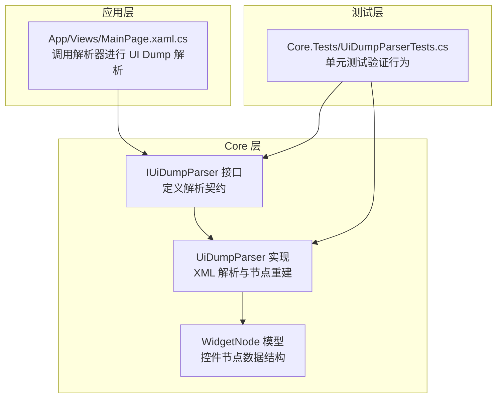
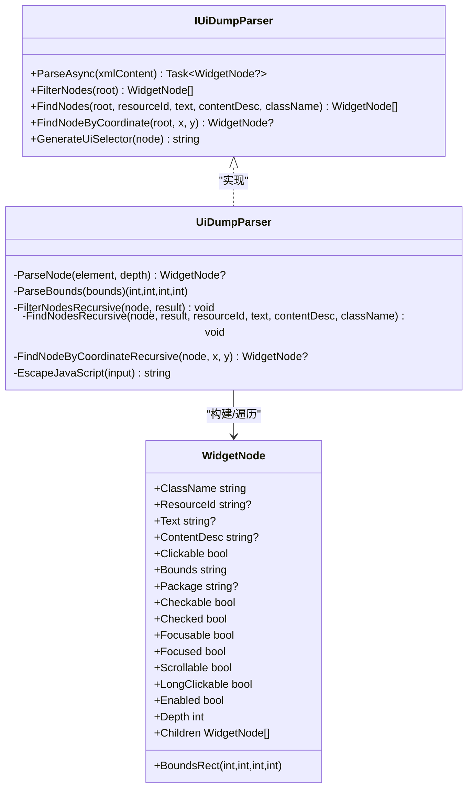
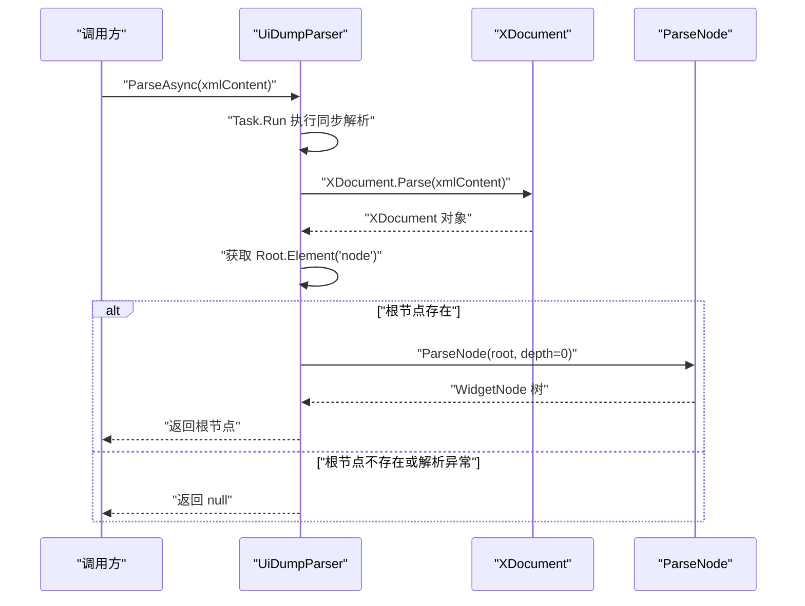
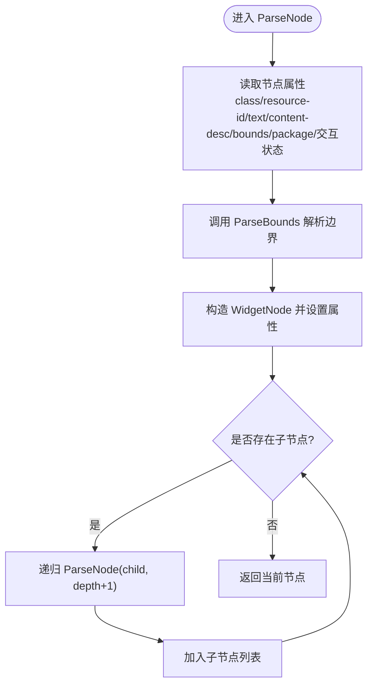
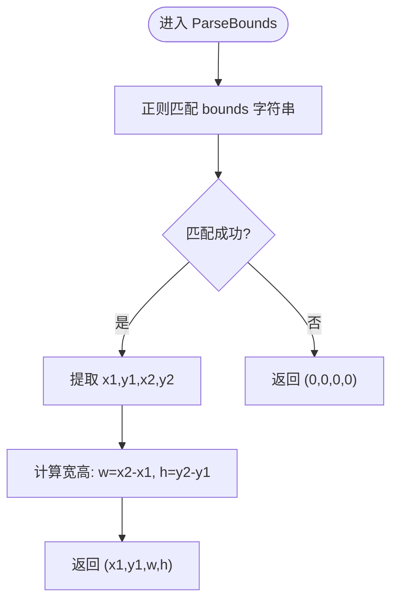
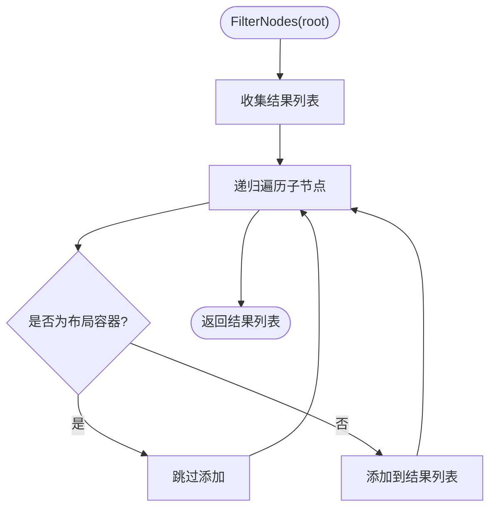
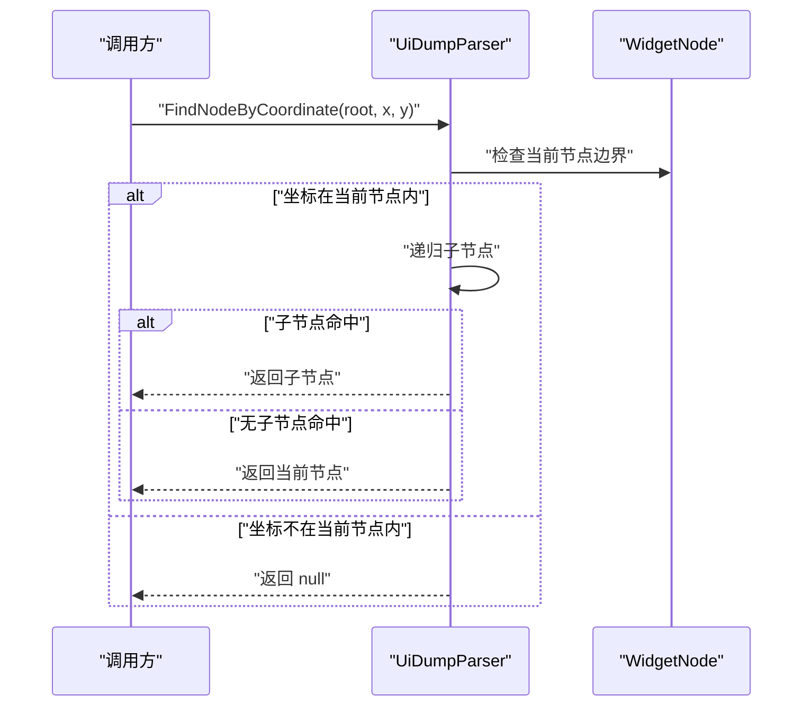
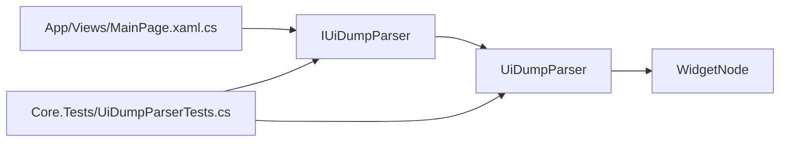

# UI Dump 解析器

<cite>
**本文引用的文件**
- [UiDumpParser.cs](file://Core/Services/UiDumpParser.cs)
- [IUiDumpParser.cs](file://Core/Abstractions/IUiDumpParser.cs)
- [WidgetNode.cs](file://Core/Models/WidgetNode.cs)
- [UiDumpParserTests.cs](file://Core.Tests/UiDumpParserTests.cs)
- [MainPage.xaml.cs](file://App/Views/MainPage.xaml.cs)
- [Core.csproj](file://Core/Core.csproj)
</cite>

## 目录
1. [简介](#简介)
2. [项目结构](#项目结构)
3. [核心组件](#核心组件)
4. [架构总览](#架构总览)
5. [详细组件分析](#详细组件分析)
6. [依赖分析](#依赖分析)
7. [性能考虑](#性能考虑)
8. [故障排查指南](#故障排查指南)
9. [结论](#结论)
10. [附录](#附录)

## 简介
本技术文档围绕 UI Dump 解析器展开，系统性阐述 UiDumpParser 类的实现细节与使用方式，重点覆盖：
- XML 文档解析与节点递归解析
- 属性提取与层级关系重建
- 异步解析方法 ParseAsync 的工作流程
- 递归解析方法 ParseNode 的实现逻辑
- 边界解析 ParseBounds 的正则表达式处理机制
- IUiDumpParser 接口的设计理念与抽象方法定义
- 完整使用示例：Android UI Dump XML 解析、异常处理与 WidgetNode 树结构获取
- 性能优化建议与错误处理最佳实践

## 项目结构
UI Dump 解析器位于 Core 层，采用接口与实现分离的设计，便于替换与扩展；模型层提供跨层共享的数据结构；测试层验证核心行为；上层应用通过接口调用解析器以完成 UI Dump 的解析与后续处理。

**图表来源**
- [IUiDumpParser.cs:8-55](file://Core/Abstractions/IUiDumpParser.cs#L8-L55)
- [UiDumpParser.cs:12-35](file://Core/Services/UiDumpParser.cs#L12-L35)
- [WidgetNode.cs:6-92](file://Core/Models/WidgetNode.cs#L6-L92)
- [MainPage.xaml.cs:205-233](file://App/Views/MainPage.xaml.cs#L205-L233)
- [UiDumpParserTests.cs:9-72](file://Core.Tests/UiDumpParserTests.cs#L9-L72)

**章节来源**
- [Core.csproj:1-10](file://Core/Core.csproj#L1-L10)

## 核心组件
- IUiDumpParser 接口：定义解析器的契约，包括异步解析、节点过滤、节点查找、坐标定位与 UiSelector 生成等能力。
- UiDumpParser 实现：基于 XML 解析与正则表达式，完成节点属性提取、边界解析与树形结构重建，并提供辅助查询与生成工具。
- WidgetNode 模型：承载控件节点的所有属性，包括类名、资源 ID、文本、内容描述、可交互状态、边界信息、包名、层级深度及子节点集合。

**章节来源**
- [IUiDumpParser.cs:8-55](file://Core/Abstractions/IUiDumpParser.cs#L8-L55)
- [UiDumpParser.cs:12-35](file://Core/Services/UiDumpParser.cs#L12-L35)
- [WidgetNode.cs:6-92](file://Core/Models/WidgetNode.cs#L6-L92)

## 架构总览
UI Dump 解析器遵循“接口隔离 + 具体实现”的分层设计，应用层通过接口注入解析器，测试层对契约与实现进行验证，模型层提供跨层共享的数据载体。

**图表来源**
- [IUiDumpParser.cs:8-55](file://Core/Abstractions/IUiDumpParser.cs#L8-L55)
- [UiDumpParser.cs:12-262](file://Core/Services/UiDumpParser.cs#L12-L262)
- [WidgetNode.cs:6-92](file://Core/Models/WidgetNode.cs#L6-L92)

## 详细组件分析

### IUiDumpParser 接口设计
- 设计理念：通过接口抽象出解析器的职责边界，使上层应用不依赖具体实现，便于替换与扩展。
- 抽象方法：
  - ParseAsync：异步解析 UI Dump XML，返回根节点或空。
  - FilterNodes：过滤冗余布局容器，返回扁平化的控件列表。
  - FindNodes：按资源 ID、文本、内容描述、类名等条件查找控件。
  - FindNodeByCoordinate：根据坐标返回最深层匹配的控件。
  - GenerateUiSelector：生成 Auto.js UiSelector 代码片段。

**章节来源**
- [IUiDumpParser.cs:8-55](file://Core/Abstractions/IUiDumpParser.cs#L8-L55)

### UiDumpParser 实现详解

#### ParseAsync 异步解析流程
- 工作流程：
  - 使用线程池执行同步解析逻辑，避免阻塞 UI 线程。
  - 尝试解析 XML 文档，定位根节点元素。
  - 若根节点存在，则递归解析为 WidgetNode 树；否则返回空。
  - 捕获异常并返回空，保证调用方的健壮性。
- 关键点：
  - 使用异步包装与同步解析结合，兼顾性能与稳定性。
  - 对无效 XML 返回空，便于上层判断与提示。

**图表来源**
- [UiDumpParser.cs:14-35](file://Core/Services/UiDumpParser.cs#L14-L35)

**章节来源**
- [UiDumpParser.cs:14-35](file://Core/Services/UiDumpParser.cs#L14-L35)

#### ParseNode 递归解析逻辑
- 属性提取：从 XML 节点读取类名、资源 ID、文本、内容描述、可交互状态、边界字符串、包名等。
- 边界解析：委托 ParseBounds 将边界字符串转换为矩形坐标。
- 树形重建：递归遍历子节点，构建父子关系，设置深度。
- 返回值：成功时返回 WidgetNode，失败时返回空。

**图表来源**
- [UiDumpParser.cs:103-154](file://Core/Services/UiDumpParser.cs#L103-L154)

**章节来源**
- [UiDumpParser.cs:103-154](file://Core/Services/UiDumpParser.cs#L103-L154)

#### ParseBounds 边界解析与正则处理
- 输入格式：Android UI Dump 中的 bounds 字符串，例如 "[x1,y1][x2,y2]"。
- 正则匹配：使用预编译的正则表达式提取四个坐标值。
- 计算矩形：返回 (x1, y1, x2-x1, y2-y1)，即左上角坐标与宽高。
- 失败回退：若匹配失败，返回 (0,0,0,0)。

**图表来源**
- [UiDumpParser.cs:160-172](file://Core/Services/UiDumpParser.cs#L160-L172)

**章节来源**
- [UiDumpParser.cs:160-172](file://Core/Services/UiDumpParser.cs#L160-L172)

#### 节点过滤与查找
- FilterNodes：递归过滤布局容器（如无资源 ID、文本、内容描述且不可点击），保留有效控件。
- FindNodes：按资源 ID、文本、内容描述、类名进行精确匹配，支持多条件组合。
- FindNodeByCoordinate：按坐标命中规则，优先返回最深层匹配的节点。

**图表来源**
- [UiDumpParser.cs:178-197](file://Core/Services/UiDumpParser.cs#L178-L197)

**章节来源**
- [UiDumpParser.cs:178-227](file://Core/Services/UiDumpParser.cs#L178-L227)

#### 坐标定位与 UiSelector 生成
- FindNodeByCoordinate：自顶向下递归，命中后优先深入子节点，最终返回最深层匹配节点。
- GenerateUiSelector：优先使用资源 ID，其次文本、内容描述，补充类名与边界范围，生成 Auto.js UiSelector 代码。

**图表来源**
- [UiDumpParser.cs:229-251](file://Core/Services/UiDumpParser.cs#L229-L251)

**章节来源**
- [UiDumpParser.cs:229-261](file://Core/Services/UiDumpParser.cs#L229-L261)

### WidgetNode 数据模型
- 字段覆盖：类名、资源 ID、文本、内容描述、可交互状态、边界字符串与矩形、包名、可选中/已选中、可聚焦/已聚焦、可滚动、可长按、启用状态、深度、子节点集合。
- 设计要点：字段可初始化，Children 默认为空列表，便于直接使用。

**章节来源**
- [WidgetNode.cs:6-92](file://Core/Models/WidgetNode.cs#L6-L92)

## 依赖分析
- 组件耦合：
  - UiDumpParser 依赖 IUiDumpParser 接口与 WidgetNode 模型，保持低耦合。
  - 应用层通过接口调用解析器，避免直接依赖具体实现。
- 外部依赖：
  - System.Xml.Linq：XML 解析。
  - System.Text.RegularExpressions：边界字符串正则解析。
- 测试依赖：
  - 单元测试验证解析、过滤、坐标定位与异常处理。

**图表来源**
- [MainPage.xaml.cs:205-233](file://App/Views/MainPage.xaml.cs#L205-L233)
- [IUiDumpParser.cs:8-55](file://Core/Abstractions/IUiDumpParser.cs#L8-L55)
- [UiDumpParser.cs:12-35](file://Core/Services/UiDumpParser.cs#L12-L35)
- [WidgetNode.cs:6-92](file://Core/Models/WidgetNode.cs#L6-L92)
- [UiDumpParserTests.cs:9-72](file://Core.Tests/UiDumpParserTests.cs#L9-L72)

**章节来源**
- [MainPage.xaml.cs:205-233](file://App/Views/MainPage.xaml.cs#L205-L233)
- [UiDumpParserTests.cs:9-72](file://Core.Tests/UiDumpParserTests.cs#L9-L72)

## 性能考虑
- 异步解析：ParseAsync 使用 Task.Run 将同步解析放入线程池，避免阻塞 UI 线程，适合在主线程中调用。
- 递归深度：XML UI 树可能较深，注意避免过深递归导致栈溢出风险；当前实现通过深度参数记录层级，建议在上层控制最大深度。
- 正则匹配：边界解析使用正则，建议确保输入格式稳定，避免频繁格式变化导致性能波动。
- 过滤策略：FilterNodes 在渲染前剔除冗余布局容器，减少显示节点数量，提升 UI 渲染效率。
- 内存占用：WidgetNode 树规模随 UI 层级增长，建议在不需要时及时释放引用，避免内存泄漏。

[本节为通用性能建议，无需特定文件来源]

## 故障排查指南
- 解析失败返回空：
  - 现象：ParseAsync 返回 null。
  - 可能原因：XML 不合法、根节点缺失、解析异常。
  - 处理建议：捕获异常、记录日志、提示用户重试或检查输入。
- 坐标定位不准确：
  - 现象：FindNodeByCoordinate 返回空或非预期节点。
  - 可能原因：边界信息缺失或格式异常、坐标超出范围。
  - 处理建议：检查边界解析结果、确认坐标系与缩放比例。
- 过滤结果异常：
  - 现象：FilterNodes 未正确剔除布局容器。
  - 可能原因：类名判断逻辑与实际 UI 不一致。
  - 处理建议：调整过滤规则或增加调试输出。
- 测试验证：
  - 单元测试覆盖了无效 XML、坐标定位与布局容器过滤等场景，可参考测试用例定位问题。

**章节来源**
- [UiDumpParser.cs:14-35](file://Core/Services/UiDumpParser.cs#L14-L35)
- [UiDumpParserTests.cs:65-72](file://Core.Tests/UiDumpParserTests.cs#L65-L72)

## 结论
UiDumpParser 通过清晰的接口设计与稳健的实现，提供了 Android UI Dump XML 的解析能力，涵盖属性提取、边界解析、树形重建、节点过滤与坐标定位等功能。配合单元测试与应用层调用示例，能够满足 UI 分析与自动化脚本生成的需求。建议在生产环境中结合异步调用、异常处理与性能监控，持续优化解析与渲染体验。

[本节为总结性内容，无需特定文件来源]

## 附录

### 使用示例：解析 Android UI Dump XML
- 步骤概览：
  - 从设备或服务获取 UI Dump XML 字符串。
  - 创建解析器实例并调用异步解析方法。
  - 处理解析结果：若为空则提示失败；否则统计节点数并进行过滤或坐标定位。
  - 可选：生成 UiSelector 代码用于自动化脚本。
- 示例路径：
  - 应用层调用示例：[MainPage.xaml.cs:205-233](file://App/Views/MainPage.xaml.cs#L205-L233)
  - 单元测试示例：[UiDumpParserTests.cs:10-36](file://Core.Tests/UiDumpParserTests.cs#L10-L36)

**章节来源**
- [MainPage.xaml.cs:205-233](file://App/Views/MainPage.xaml.cs#L205-L233)
- [UiDumpParserTests.cs:10-36](file://Core.Tests/UiDumpParserTests.cs#L10-L36)

### 错误处理最佳实践
- 明确异常边界：在 ParseAsync 中捕获异常并返回空，避免异常冒泡影响调用方。
- 上层容错：当解析结果为空时，清空 UI 显示并提示用户。
- 日志记录：在应用层记录 XML 长度与异常信息，便于诊断。
- 测试驱动：通过单元测试覆盖异常场景，确保行为可预期。

**章节来源**
- [UiDumpParser.cs:14-35](file://Core/Services/UiDumpParser.cs#L14-L35)
- [MainPage.xaml.cs:205-247](file://App/Views/MainPage.xaml.cs#L205-L247)
- [UiDumpParserTests.cs:65-72](file://Core.Tests/UiDumpParserTests.cs#L65-L72)