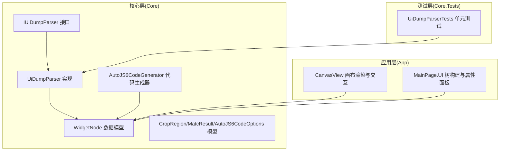
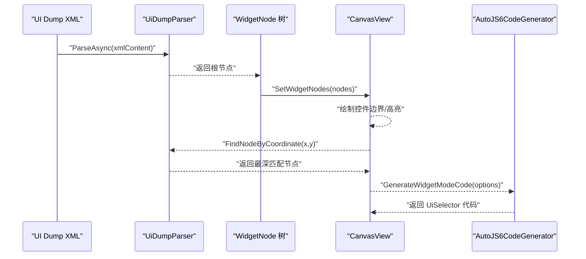
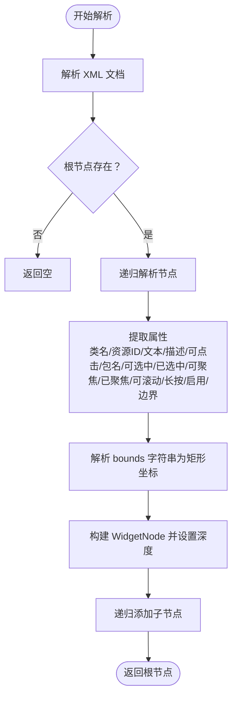
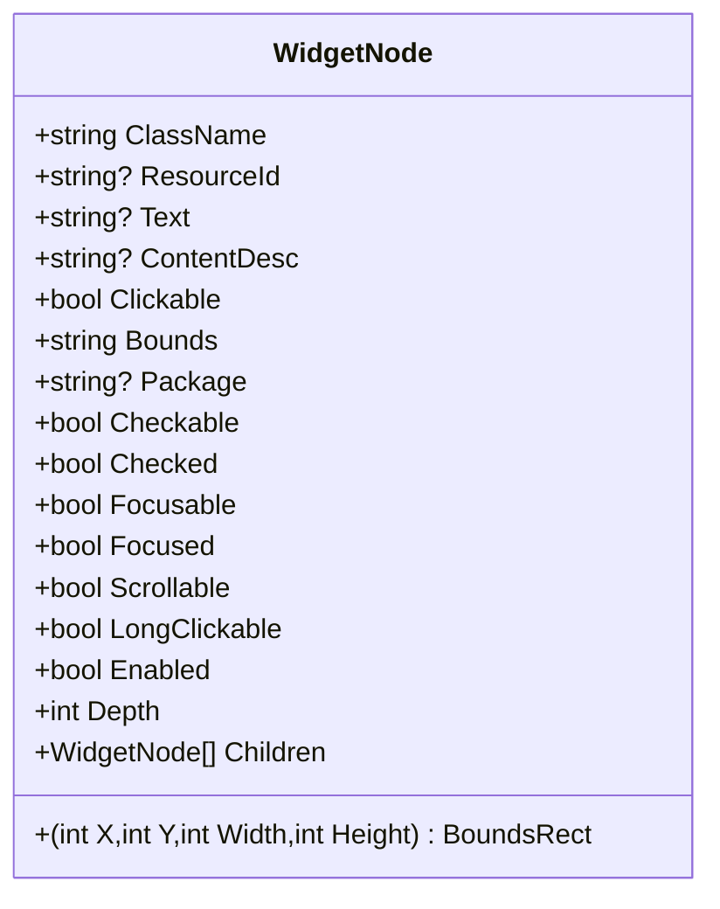
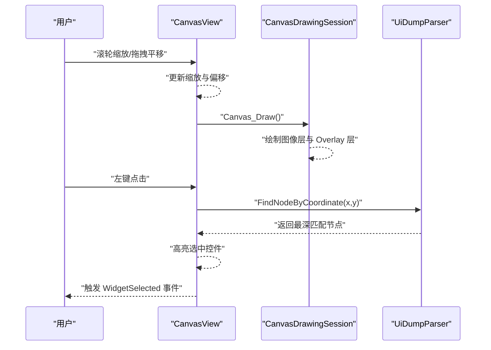
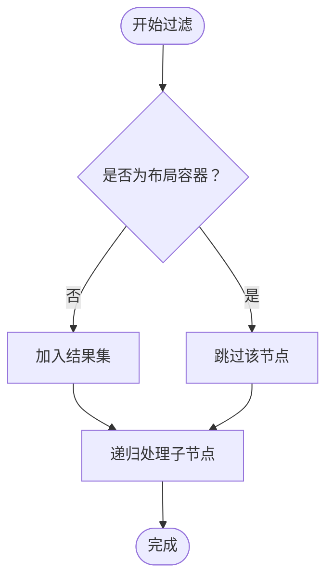
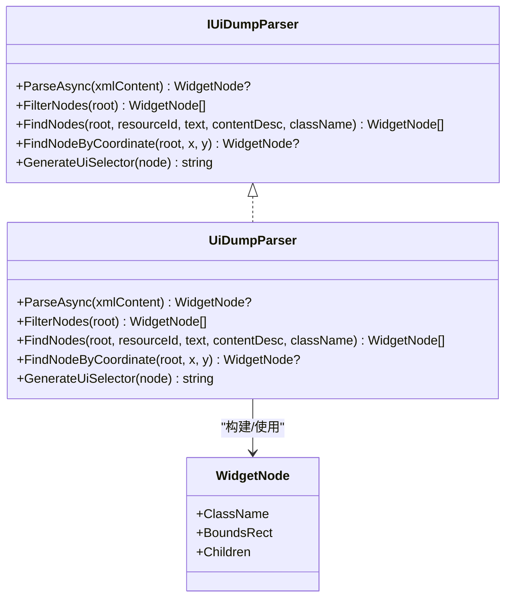

# UI 分析引擎

<cite>
**本文档引用的文件**
- [UiDumpParser.cs](file://Core/Services/UiDumpParser.cs)
- [WidgetNode.cs](file://Core/Models/WidgetNode.cs)
- [CanvasView.xaml.cs](file://App/Views/CanvasView.xaml.cs)
- [IUiDumpParser.cs](file://Core/Abstractions/IUiDumpParser.cs)
- [CropRegion.cs](file://Core/Models/CropRegion.cs)
- [MatchResult.cs](file://Core/Models/MatchResult.cs)
- [MainPage.UiTree.cs](file://App/Views/MainPage.UiTree.cs)
- [UiDumpParserTests.cs](file://Core.Tests/UiDumpParserTests.cs)
- [AutoJS6CodeGenerator.cs](file://Core/Services/AutoJS6CodeGenerator.cs)
- [AutoJS6CodeOptions.cs](file://Core/Models/AutoJS6CodeOptions.cs)
</cite>

## 目录
1. [简介](#简介)
2. [项目结构](#项目结构)
3. [核心组件](#核心组件)
4. [架构总览](#架构总览)
5. [详细组件分析](#详细组件分析)
6. [依赖关系分析](#依赖关系分析)
7. [性能考量](#性能考量)
8. [故障排查指南](#故障排查指南)
9. [结论](#结论)
10. [附录](#附录)

## 简介
本文件面向 AutoJS6 UI 分析引擎，系统性阐述 UI 树解析、数据模型设计、控件边界渲染、智能布局过滤与交互响应等关键技术。重点覆盖：
- UiDumpParser 的 Android UI 树解析实现：XML 解析、节点提取、属性解析、层级关系重建
- WidgetNode 数据模型：控件属性映射、边界坐标计算、可见性判断、层级遍历
- CanvasView 控件边界渲染：高亮显示、坐标变换、缩放适配、交互响应
- 智能布局过滤算法：布局容器过滤、可见性检测、重复控件过滤、布局层级优化
- 使用示例：解析 UI 树、提取控件信息、生成 UiSelector 选择器、异常处理最佳实践

## 项目结构
项目采用分层架构，核心逻辑位于 Core 层，界面交互位于 App 层，测试位于 Core.Tests/App.Tests。UI 分析引擎的关键模块如下：
- Core/Abstractions：定义 IUiDumpParser 接口
- Core/Services：实现 UiDumpParser、AutoJS6CodeGenerator
- Core/Models：定义 WidgetNode、CropRegion、MatchResult、AutoJS6CodeOptions 等数据模型
- App/Views：实现 CanvasView（Win2D 画布渲染与交互）、MainPage（UI 树构建与属性面板）
- Core.Tests：单元测试，验证解析与过滤行为

图表来源
- [IUiDumpParser.cs:8-55](file://Core/Abstractions/IUiDumpParser.cs#L8-L55)
- [UiDumpParser.cs:12-35](file://Core/Services/UiDumpParser.cs#L12-L35)
- [WidgetNode.cs:6-92](file://Core/Models/WidgetNode.cs#L6-L92)
- [AutoJS6CodeGenerator.cs:11-164](file://Core/Services/AutoJS6CodeGenerator.cs#L11-L164)
- [CropRegion.cs:6-52](file://Core/Models/CropRegion.cs#L6-L52)
- [MatchResult.cs:6-62](file://Core/Models/MatchResult.cs#L6-L62)
- [CanvasView.xaml.cs:24-116](file://App/Views/CanvasView.xaml.cs#L24-L116)
- [MainPage.UiTree.cs:9-190](file://App/Views/MainPage.UiTree.cs#L9-L190)
- [UiDumpParserTests.cs:7-73](file://Core.Tests/UiDumpParserTests.cs#L7-L73)

章节来源
- [IUiDumpParser.cs:8-55](file://Core/Abstractions/IUiDumpParser.cs#L8-L55)
- [UiDumpParser.cs:12-35](file://Core/Services/UiDumpParser.cs#L12-L35)
- [WidgetNode.cs:6-92](file://Core/Models/WidgetNode.cs#L6-L92)
- [CanvasView.xaml.cs:24-116](file://App/Views/CanvasView.xaml.cs#L24-L116)
- [MainPage.UiTree.cs:9-190](file://App/Views/MainPage.UiTree.cs#L9-L190)
- [UiDumpParserTests.cs:7-73](file://Core.Tests/UiDumpParserTests.cs#L7-L73)

## 核心组件
- UiDumpParser：负责解析 Android UI Dump XML，构建 WidgetNode 树，支持过滤、查询、坐标定位与 UiSelector 生成
- WidgetNode：承载控件属性与边界信息，支持层级遍历与可视化渲染
- CanvasView：基于 Win2D 的画布渲染，支持图像层与 Overlay 层叠加、缩放平移、控件边界高亮、裁剪区域交互
- AutoJS6CodeGenerator：根据 WidgetNode 生成 AutoJS6 UiSelector 代码，包含主选择器与回退策略

章节来源
- [UiDumpParser.cs:14-97](file://Core/Services/UiDumpParser.cs#L14-L97)
- [WidgetNode.cs:6-92](file://Core/Models/WidgetNode.cs#L6-L92)
- [CanvasView.xaml.cs:143-160](file://App/Views/CanvasView.xaml.cs#L143-L160)
- [AutoJS6CodeGenerator.cs:104-164](file://Core/Services/AutoJS6CodeGenerator.cs#L104-L164)

## 架构总览
UI 分析引擎围绕“解析—建模—渲染—交互—生成”的闭环展开。解析阶段由 UiDumpParser 将 XML 转为 WidgetNode 树；渲染阶段由 CanvasView 将控件边界叠加在图像上；交互阶段通过 CanvasView 的输入事件驱动控件选择与裁剪区域管理；最终由 AutoJS6CodeGenerator 将选定控件转换为可执行的 UiSelector 代码。

图表来源
- [UiDumpParser.cs:14-59](file://Core/Services/UiDumpParser.cs#L14-L59)
- [CanvasView.xaml.cs:143-160](file://App/Views/CanvasView.xaml.cs#L143-L160)
- [AutoJS6CodeGenerator.cs:104-164](file://Core/Services/AutoJS6CodeGenerator.cs#L104-L164)

## 详细组件分析

### UiDumpParser：Android UI 树解析与选择器生成
- XML 解析与节点提取
  - 使用 LINQ to XML 解析根节点，递归提取子节点，构建 WidgetNode 树
  - 提取关键属性：类名、资源 ID、文本、内容描述、可点击、包名、可选中、已选中、可聚焦、已聚焦、可滚动、长按、启用状态、边界字符串与边界矩形
- 属性解析与边界坐标计算
  - 通过正则解析 bounds 字符串，计算 (x, y, width, height)，存储于 BoundsRect
- 层级关系重建
  - 通过递归遍历 XML node 节点，建立父子关系，Depth 记录层级
- 智能布局过滤算法
  - 布局容器过滤：当控件类名包含 Layout 且无资源 ID、文本、内容描述、不可点击时，判定为布局容器并跳过
  - 递归过滤：对每个节点应用过滤规则，保留非布局容器节点
- 查询与定位
  - 支持按资源 ID、文本、内容描述、类名进行过滤查询
  - 坐标定位：根据点坐标在控件边界内进行最深匹配（优先子节点）
- UiSelector 生成
  - 优先级：resource-id -> text -> content-desc -> className -> boundsInside
  - 对文本进行 JavaScript 转义，保证生成代码安全

图表来源
- [UiDumpParser.cs:103-154](file://Core/Services/UiDumpParser.cs#L103-L154)
- [UiDumpParser.cs:160-172](file://Core/Services/UiDumpParser.cs#L160-L172)

章节来源
- [UiDumpParser.cs:14-97](file://Core/Services/UiDumpParser.cs#L14-L97)
- [UiDumpParser.cs:178-197](file://Core/Services/UiDumpParser.cs#L178-L197)
- [UiDumpParser.cs:199-227](file://Core/Services/UiDumpParser.cs#L199-L227)
- [UiDumpParser.cs:229-251](file://Core/Services/UiDumpParser.cs#L229-L251)
- [UiDumpParser.cs:253-261](file://Core/Services/UiDumpParser.cs#L253-L261)

### WidgetNode 数据模型：控件属性映射与边界计算
- 属性字段
  - 必填：ClassName、Bounds、Depth
  - 可选：ResourceId、Text、ContentDesc、Package、Children
  - 布尔属性：Clickable、Checkable、Checked、Focusable、Focused、Scrollable、LongClickable、Enabled
  - 边界：BoundsRect（x, y, width, height）
- 设计理念
  - 以 Android UI Dump 属性为核心映射，便于直接复用解析结果
  - 通过 BoundsRect 提供统一的边界计算与渲染接口
  - Children 支持层级遍历，便于 UI 树构建与过滤

图表来源
- [WidgetNode.cs:6-92](file://Core/Models/WidgetNode.cs#L6-L92)

章节来源
- [WidgetNode.cs:6-92](file://Core/Models/WidgetNode.cs#L6-L92)

### CanvasView：控件边界渲染与交互响应
- 分层渲染
  - 图像层：CanvasBitmap，应用缩放与平移矩阵后绘制
  - Overlay 层：绘制控件边界框、匹配结果、裁剪区域与调整手柄
- 坐标变换与缩放适配
  - 提供 CanvasToImage 与 ImageToCanvas 双向坐标转换
  - 缩放范围限制（10%-500%），滚轮缩放以指针为中心
  - 自动适配窗口 FitToWindow，居中显示
- 控件边界高亮
  - 按控件类型着色（Text/Button/Image/其他）
  - 选中控件高亮：半透明填充 + 蓝色描边
- 交互响应
  - 拖拽平移、惯性滑动、点击选择、裁剪模式（创建/调整）
  - 裁剪区域：虚线矩形 + 8 个调整手柄，支持 Shift 键锁定宽高比
- 性能优化
  - CanvasBitmap 缓存池（最多 10 个），避免重复创建纹理
  - 日志记录与状态事件（ScaleChanged、WidgetSelected、CropRegionChanged）

图表来源
- [CanvasView.xaml.cs:572-627](file://App/Views/CanvasView.xaml.cs#L572-L627)
- [CanvasView.xaml.cs:802-827](file://App/Views/CanvasView.xaml.cs#L802-L827)
- [CanvasView.xaml.cs:833-947](file://App/Views/CanvasView.xaml.cs#L833-L947)
- [CanvasView.xaml.cs:1028-1057](file://App/Views/CanvasView.xaml.cs#L1028-L1057)
- [UiDumpParser.cs:56-59](file://Core/Services/UiDumpParser.cs#L56-L59)

章节来源
- [CanvasView.xaml.cs:143-160](file://App/Views/CanvasView.xaml.cs#L143-L160)
- [CanvasView.xaml.cs:358-426](file://App/Views/CanvasView.xaml.cs#L358-L426)
- [CanvasView.xaml.cs:472-510](file://App/Views/CanvasView.xaml.cs#L472-L510)
- [CanvasView.xaml.cs:548-566](file://App/Views/CanvasView.xaml.cs#L548-L566)
- [CanvasView.xaml.cs:629-676](file://App/Views/CanvasView.xaml.cs#L629-L676)
- [CanvasView.xaml.cs:678-704](file://App/Views/CanvasView.xaml.cs#L678-L704)
- [CanvasView.xaml.cs:706-738](file://App/Views/CanvasView.xaml.cs#L706-L738)
- [CanvasView.xaml.cs:786-796](file://App/Views/CanvasView.xaml.cs#L786-L796)
- [CanvasView.xaml.cs:802-827](file://App/Views/CanvasView.xaml.cs#L802-L827)
- [CanvasView.xaml.cs:833-947](file://App/Views/CanvasView.xaml.cs#L833-L947)
- [CanvasView.xaml.cs:1028-1057](file://App/Views/CanvasView.xaml.cs#L1028-L1057)
- [CanvasView.xaml.cs:1094-1137](file://App/Views/CanvasView.xaml.cs#L1094-L1137)
- [CanvasView.xaml.cs:1140-1172](file://App/Views/CanvasView.xaml.cs#L1140-L1172)
- [CanvasView.xaml.cs:1177-1305](file://App/Views/CanvasView.xaml.cs#L1177-L1305)

### 智能布局过滤算法：可见性检测与层级优化
- 布局容器识别
  - 类名包含 Layout 且无资源 ID、文本、内容描述、不可点击
- 过滤策略
  - 递归遍历节点，跳过布局容器，保留业务控件
  - 与 UI 树构建配合，仅显示有意义节点，提升可读性
- 与 UI 树构建的协作
  - MainPage 中的 IsBusinessNode 与 MatchesTreeQuery 进一步筛选显示节点

图表来源
- [UiDumpParser.cs:178-197](file://Core/Services/UiDumpParser.cs#L178-L197)
- [MainPage.UiTree.cs:116-127](file://App/Views/MainPage.UiTree.cs#L116-L127)

章节来源
- [UiDumpParser.cs:178-197](file://Core/Services/UiDumpParser.cs#L178-L197)
- [MainPage.UiTree.cs:116-127](file://App/Views/MainPage.UiTree.cs#L116-L127)

### 使用示例：解析 UI 树、提取控件、生成 UiSelector
- 解析 UI 树
  - 调用 ParseAsync(xmlContent)，返回根节点
  - 若解析失败返回空，需进行异常处理
- 过滤与查询
  - FilterNodes(root) 返回业务控件列表
  - FindNodes(root, resourceId/text/contentDesc/className) 进行条件查询
  - FindNodeByCoordinate(root, x, y) 获取点击位置对应控件
- 生成 UiSelector
  - GenerateUiSelector(node) 生成 AutoJS6 可执行的 UiSelector 代码
  - AutoJS6CodeGenerator.GenerateWidgetModeCode(options) 生成完整脚本
- 异常处理最佳实践
  - 解析失败返回空，调用方应检查空值并提示用户
  - 坐标定位可能无匹配，需回退到父节点或提示用户重新点击
  - 生成代码前进行有效性校验，避免 Rhino 引擎约束导致运行时错误

章节来源
- [UiDumpParser.cs:14-97](file://Core/Services/UiDumpParser.cs#L14-L97)
- [UiDumpParserTests.cs:9-73](file://Core.Tests/UiDumpParserTests.cs#L9-L73)
- [AutoJS6CodeGenerator.cs:104-164](file://Core/Services/AutoJS6CodeGenerator.cs#L104-L164)
- [AutoJS6CodeGenerator.cs:226-258](file://Core/Services/AutoJS6CodeGenerator.cs#L226-L258)

## 依赖关系分析
- 接口与实现
  - IUiDumpParser 定义解析能力，UiDumpParser 提供具体实现
- 数据模型依赖
  - CanvasView 依赖 WidgetNode 进行边界绘制
  - AutoJS6CodeGenerator 依赖 WidgetNode 生成 UiSelector
- 测试验证
  - UiDumpParserTests 验证解析、过滤、坐标定位与异常处理

图表来源
- [IUiDumpParser.cs:8-55](file://Core/Abstractions/IUiDumpParser.cs#L8-L55)
- [UiDumpParser.cs:12-35](file://Core/Services/UiDumpParser.cs#L12-L35)
- [WidgetNode.cs:6-92](file://Core/Models/WidgetNode.cs#L6-L92)

章节来源
- [IUiDumpParser.cs:8-55](file://Core/Abstractions/IUiDumpParser.cs#L8-L55)
- [UiDumpParser.cs:12-35](file://Core/Services/UiDumpParser.cs#L12-L35)
- [WidgetNode.cs:6-92](file://Core/Models/WidgetNode.cs#L6-L92)

## 性能考量
- 解析性能
  - 使用 LINQ to XML，复杂度 O(N)（N 为节点数）
  - 正则解析 bounds，建议缓存正则表达式以减少重复编译
- 渲染性能
  - CanvasBitmap 缓存池限制数量，避免内存膨胀
  - Overlay 层仅在需要时绘制（控件边界/匹配结果/裁剪区域）
  - 缩放与平移矩阵一次性应用，减少多次变换开销
- 交互性能
  - 惯性滑动定时器频率约 60 FPS，衰减系数与速度阈值平衡流畅度与能耗
  - 裁剪区域调整时仅更新必要状态，避免频繁重绘

## 故障排查指南
- 解析失败
  - 现象：ParseAsync 返回空
  - 排查：确认 XML 结构正确，根节点存在；捕获异常并记录日志
- 坐标定位无匹配
  - 现象：FindNodeByCoordinate 返回空
  - 排查：确认坐标为图像坐标而非画布坐标；检查控件边界是否有效；考虑控件层级遮挡
- 生成代码运行报错
  - 现象：Rhino 引擎报错
  - 排查：循环体内禁止使用 const/let；检查转义字符；确认 UiSelector 语法正确
- 裁剪区域无效
  - 现象：导出失败或区域为空
  - 排查：确认缩放为 1:1；裁剪区域宽高大于阈值；坐标在图像范围内

章节来源
- [UiDumpParser.cs:18-34](file://Core/Services/UiDumpParser.cs#L18-L34)
- [CanvasView.xaml.cs:213-276](file://App/Views/CanvasView.xaml.cs#L213-L276)
- [AutoJS6CodeGenerator.cs:226-258](file://Core/Services/AutoJS6CodeGenerator.cs#L226-L258)

## 结论
AutoJS6 UI 分析引擎通过清晰的分层设计与稳健的数据模型，实现了从 Android UI Dump 到可执行代码的完整链路。UiDumpParser 提供可靠的解析与过滤能力，CanvasView 提供直观的可视化与交互体验，AutoJS6CodeGenerator 将控件信息转化为可运行的 UiSelector 代码。整体架构具备良好的扩展性与可维护性，适合在实际开发中持续演进。

## 附录
- 关键 API 速览
  - IUiDumpParser：ParseAsync、FilterNodes、FindNodes、FindNodeByCoordinate、GenerateUiSelector
  - CanvasView：LoadImage、SetWidgetNodes、SetSelectedWidget、FitToWindow、CanvasToImage/ImageToCanvas、EnableCroppingMode/SetCropRegion
  - AutoJS6CodeGenerator：GenerateWidgetModeCode、FormatCode、ValidateCode

章节来源
- [IUiDumpParser.cs:8-55](file://Core/Abstractions/IUiDumpParser.cs#L8-L55)
- [CanvasView.xaml.cs:358-426](file://App/Views/CanvasView.xaml.cs#L358-L426)
- [CanvasView.xaml.cs:548-566](file://App/Views/CanvasView.xaml.cs#L548-L566)
- [CanvasView.xaml.cs:281-305](file://App/Views/CanvasView.xaml.cs#L281-L305)
- [CanvasView.xaml.cs:198-203](file://App/Views/CanvasView.xaml.cs#L198-L203)
- [AutoJS6CodeGenerator.cs:104-164](file://Core/Services/AutoJS6CodeGenerator.cs#L104-L164)
- [AutoJS6CodeGenerator.cs:191-224](file://Core/Services/AutoJS6CodeGenerator.cs#L191-L224)
- [AutoJS6CodeGenerator.cs:226-258](file://Core/Services/AutoJS6CodeGenerator.cs#L226-L258)