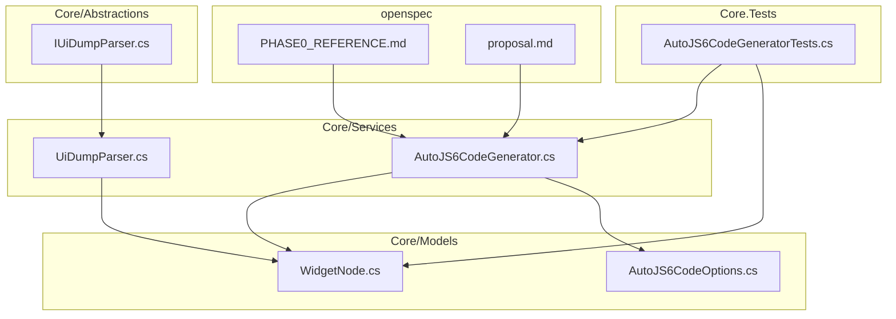
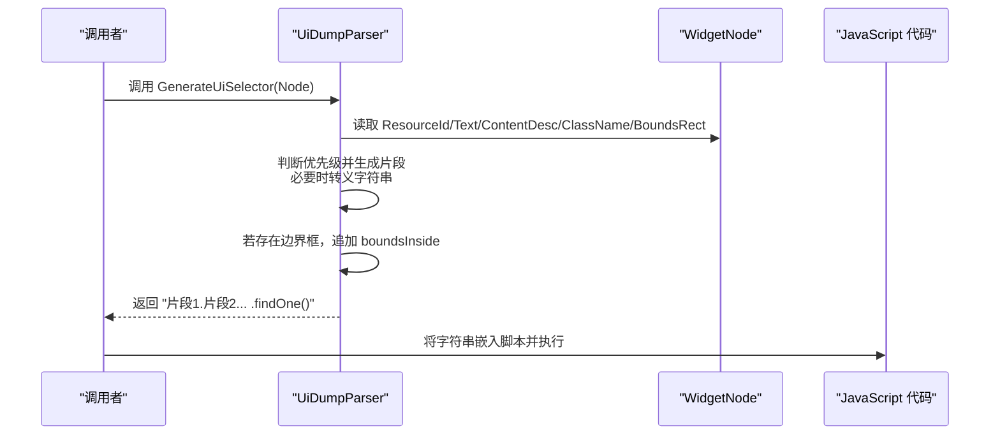
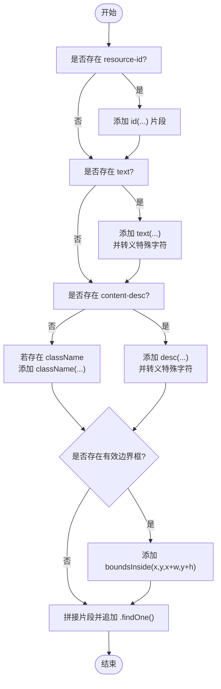
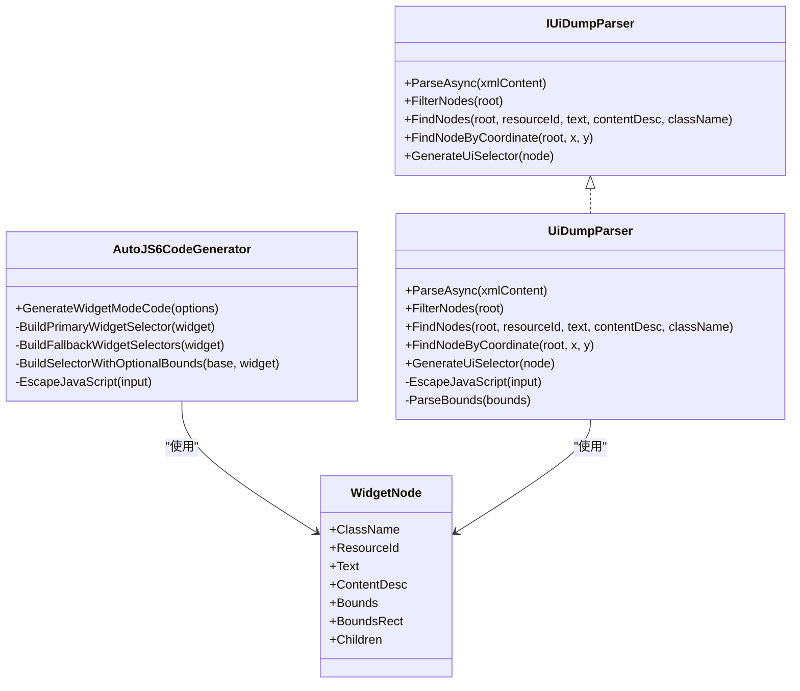

# UiSelector 选择器生成

<cite>
**本文引用的文件**
- [UiDumpParser.cs](file://Core/Services/UiDumpParser.cs)
- [AutoJS6CodeGenerator.cs](file://Core/Services/AutoJS6CodeGenerator.cs)
- [WidgetNode.cs](file://Core/Models/WidgetNode.cs)
- [IUiDumpParser.cs](file://Core/Abstractions/IUiDumpParser.cs)
- [AutoJS6CodeOptions.cs](file://Core/Models/AutoJS6CodeOptions.cs)
- [AutoJS6CodeGeneratorTests.cs](file://Core.Tests/AutoJS6CodeGeneratorTests.cs)
- [PHASE0_REFERENCE.md](file://openspec/changes/winui3-visual-dev-toolkit/PHASE0_REFERENCE.md)
- [proposal.md](file://openspec/changes/winui3-visual-dev-toolkit/proposal.md)
</cite>

## 目录
1. [简介](#简介)
2. [项目结构](#项目结构)
3. [核心组件](#核心组件)
4. [架构总览](#架构总览)
5. [详细组件分析](#详细组件分析)
6. [依赖关系分析](#依赖关系分析)
7. [性能考量](#性能考量)
8. [故障排查指南](#故障排查指南)
9. [结论](#结论)
10. [附录](#附录)

## 简介
本文件面向 UiSelector 选择器生成系统，围绕 GenerateUiSelector 方法的实现原理展开，系统性阐述：
- 优先级策略：resource-id > text > content-desc > className
- JavaScript 字符串转义处理
- UiSelector 语法构建与组合
- 降级机制：首选属性不可用时的替代方案
- boundsInside 边界条件添加逻辑与坐标转换规则
- 完整的 UiSelector 语法参考与 findOne() 查询方法使用
- 实际应用场景与示例路径，覆盖不同控件类型与特殊字符、边界情况

## 项目结构
该系统位于 Core 项目中，核心文件包括：
- 选择器生成与解析：UiDumpParser.cs、IUiDumpParser.cs
- 代码生成器：AutoJS6CodeGenerator.cs
- 数据模型：WidgetNode.cs、AutoJS6CodeOptions.cs
- 测试与参考：AutoJS6CodeGeneratorTests.cs、PHASE0_REFERENCE.md、proposal.md

图表来源
- [UiDumpParser.cs:1-263](file://Core/Services/UiDumpParser.cs#L1-L263)
- [AutoJS6CodeGenerator.cs:1-357](file://Core/Services/AutoJS6CodeGenerator.cs#L1-L357)
- [WidgetNode.cs:1-93](file://Core/Models/WidgetNode.cs#L1-L93)
- [AutoJS6CodeOptions.cs:1-89](file://Core/Models/AutoJS6CodeOptions.cs#L1-L89)
- [IUiDumpParser.cs:1-56](file://Core/Abstractions/IUiDumpParser.cs#L1-L56)
- [AutoJS6CodeGeneratorTests.cs:1-80](file://Core.Tests/AutoJS6CodeGeneratorTests.cs#L1-L80)
- [PHASE0_REFERENCE.md:1-521](file://openspec/changes/winui3-visual-dev-toolkit/PHASE0_REFERENCE.md#L1-L521)
- [proposal.md:1-70](file://openspec/changes/winui3-visual-dev-toolkit/proposal.md#L1-L70)

章节来源
- [UiDumpParser.cs:1-263](file://Core/Services/UiDumpParser.cs#L1-L263)
- [AutoJS6CodeGenerator.cs:1-357](file://Core/Services/AutoJS6CodeGenerator.cs#L1-L357)
- [WidgetNode.cs:1-93](file://Core/Models/WidgetNode.cs#L1-L93)
- [AutoJS6CodeOptions.cs:1-89](file://Core/Models/AutoJS6CodeOptions.cs#L1-L89)
- [IUiDumpParser.cs:1-56](file://Core/Abstractions/IUiDumpParser.cs#L1-L56)
- [AutoJS6CodeGeneratorTests.cs:1-80](file://Core.Tests/AutoJS6CodeGeneratorTests.cs#L1-L80)
- [PHASE0_REFERENCE.md:1-521](file://openspec/changes/winui3-visual-dev-toolkit/PHASE0_REFERENCE.md#L1-L521)
- [proposal.md:1-70](file://openspec/changes/winui3-visual-dev-toolkit/proposal.md#L1-L70)

## 核心组件
- 选择器生成器（UiDumpParser）：负责根据 WidgetNode 构建 UiSelector 字符串，包含优先级策略、降级机制与 boundsInside 添加逻辑。
- 代码生成器（AutoJS6CodeGenerator）：在控件模式下生成完整的 JavaScript 脚本，包含主选择器与降级选择器的重试逻辑，并对字符串进行转义。
- 数据模型（WidgetNode）：承载控件的属性（类名、资源 ID、文本、内容描述、边界框等）。
- 接口（IUiDumpParser）：定义选择器生成与节点操作的契约。
- 测试（AutoJS6CodeGeneratorTests）：验证选择器优先级与 boundsInside 的正确性。
- 参考（PHASE0_REFERENCE.md、proposal.md）：提供 AutoJS6 API 约束与 Rhino 引擎限制，确保生成代码符合规范。

章节来源
- [UiDumpParser.cs:61-97](file://Core/Services/UiDumpParser.cs#L61-L97)
- [AutoJS6CodeGenerator.cs:290-356](file://Core/Services/AutoJS6CodeGenerator.cs#L290-L356)
- [WidgetNode.cs:6-92](file://Core/Models/WidgetNode.cs#L6-L92)
- [IUiDumpParser.cs:8-55](file://Core/Abstractions/IUiDumpParser.cs#L8-L55)
- [AutoJS6CodeGeneratorTests.cs:42-79](file://Core.Tests/AutoJS6CodeGeneratorTests.cs#L42-L79)
- [PHASE0_REFERENCE.md:258-320](file://openspec/changes/winui3-visual-dev-toolkit/PHASE0_REFERENCE.md#L258-L320)

## 架构总览
UiSelector 选择器生成的整体流程如下：
- 输入：WidgetNode（包含控件属性与边界框）
- 处理：根据优先级策略生成选择器片段，必要时追加 boundsInside
- 输出：拼接后的 UiSelector 字符串，末尾附加 findOne()

图表来源
- [UiDumpParser.cs:61-97](file://Core/Services/UiDumpParser.cs#L61-L97)
- [WidgetNode.cs:6-92](file://Core/Models/WidgetNode.cs#L6-L92)

## 详细组件分析

### GenerateUiSelector 方法实现原理
- 优先级策略
  - 首选：resource-id（id(...)）
  - 降级：text（text(...)）
  - 再降级：content-desc（desc(...)）
  - 补充：className（className(...)）
- JavaScript 字符串转义
  - 对引号、换行、回车、制表符进行转义，确保生成的字符串在 JavaScript 中合法
- boundsInside 边界条件
  - 当控件具备有效边界框时，追加 boundsInside(x, y, x+w, y+h)，用于限定查找范围，提高稳定性与性能
- 组合与结尾
  - 将各片段以点号连接，最终追加 .findOne()，形成可执行的 UiSelector

图表来源
- [UiDumpParser.cs:61-97](file://Core/Services/UiDumpParser.cs#L61-L97)
- [UiDumpParser.cs:253-261](file://Core/Services/UiDumpParser.cs#L253-L261)

章节来源
- [UiDumpParser.cs:61-97](file://Core/Services/UiDumpParser.cs#L61-L97)
- [UiDumpParser.cs:253-261](file://Core/Services/UiDumpParser.cs#L253-L261)

### 降级机制与替代方案
- 当首选属性不可用时，系统按优先级依次尝试降级属性
- 降级顺序：resource-id → text → content-desc → className
- 通过组合多个条件（如 className 补充）增强唯一性
- 测试用例验证了降级顺序与 boundsInside 的正确性

章节来源
- [AutoJS6CodeGeneratorTests.cs:42-79](file://Core.Tests/AutoJS6CodeGeneratorTests.cs#L42-L79)
- [AutoJS6CodeGenerator.cs:314-334](file://Core/Services/AutoJS6CodeGenerator.cs#L314-L334)

### JavaScript 字符串转义处理
- 转义规则：反斜杠、双引号、换行、回车、制表符
- 作用：保证生成的字符串在 JavaScript 中合法，避免语法错误
- 位置：选择器生成与代码生成器均包含转义逻辑

章节来源
- [UiDumpParser.cs:253-261](file://Core/Services/UiDumpParser.cs#L253-L261)
- [AutoJS6CodeGenerator.cs:347-355](file://Core/Services/AutoJS6CodeGenerator.cs#L347-L355)

### boundsInside 边界条件与坐标转换
- 坐标来源：控件的边界框字符串解析为 (x, y, width, height)
- 坐标转换：左上角原点，x 轴向右，y 轴向下
- 添加逻辑：当存在有效边界框时，追加 boundsInside(x, y, x+w, y+h)
- 与 API 约束一致：PHASE0_REFERENCE.md 明确了坐标系统与 UiSelector 的 boundsInside 用法

章节来源
- [UiDumpParser.cs:160-172](file://Core/Services/UiDumpParser.cs#L160-L172)
- [UiDumpParser.cs:89-94](file://Core/Services/UiDumpParser.cs#L89-L94)
- [PHASE0_REFERENCE.md:350-365](file://openspec/changes/winui3-visual-dev-toolkit/PHASE0_REFERENCE.md#L350-L365)

### UiSelector 语法参考与 findOne() 使用
- 基本属性匹配
  - id(str)：资源 ID 匹配
  - text(str) / desc(str)：文本与内容描述匹配
  - className(str)：类名匹配
- 组合条件：可通过点号连接多个条件，形成复合选择器
- 查找方法
  - findOne(timeout?)：阻塞查找，返回第一个匹配控件或抛出异常
  - findOnce(i?)：立即查找，返回第 i+1 个匹配控件
  - find()：返回所有匹配控件集合
- 重试与降级：代码生成器在控件模式下提供主选择器与降级选择器的重试逻辑

章节来源
- [PHASE0_REFERENCE.md:258-320](file://openspec/changes/winui3-visual-dev-toolkit/PHASE0_REFERENCE.md#L258-L320)
- [AutoJS6CodeGenerator.cs:104-164](file://Core/Services/AutoJS6CodeGenerator.cs#L104-L164)

### 实际应用场景与示例路径
- 为不同类型的控件生成最优选择器
  - 资源 ID 可用：优先 id(...)
  - 无资源 ID 但有文本：使用 text(...) 并转义
  - 无资源 ID 且无文本但有内容描述：使用 desc(...)
  - 无上述属性：使用 className(...) 补充
- 特殊字符与边界情况
  - 文本包含换行、引号等：通过转义处理
  - 控件无有效边界框：不添加 boundsInside
  - 控件位于复杂布局：结合 className 与 boundsInside 提升稳定性
- 示例路径（不展示具体代码内容）
  - 选择器生成：[GenerateUiSelector:61-97](file://Core/Services/UiDumpParser.cs#L61-L97)
  - 主/降级选择器构建：[BuildPrimaryWidgetSelector / BuildFallbackWidgetSelectors:290-334](file://Core/Services/AutoJS6CodeGenerator.cs#L290-L334)
  - 重试与降级逻辑：[GenerateWidgetModeCode:104-164](file://Core/Services/AutoJS6CodeGenerator.cs#L104-L164)
  - 测试用例验证：[AutoJS6CodeGeneratorTests:42-79](file://Core.Tests/AutoJS6CodeGeneratorTests.cs#L42-L79)

章节来源
- [UiDumpParser.cs:61-97](file://Core/Services/UiDumpParser.cs#L61-L97)
- [AutoJS6CodeGenerator.cs:290-334](file://Core/Services/AutoJS6CodeGenerator.cs#L290-L334)
- [AutoJS6CodeGenerator.cs:104-164](file://Core/Services/AutoJS6CodeGenerator.cs#L104-L164)
- [AutoJS6CodeGeneratorTests.cs:42-79](file://Core.Tests/AutoJS6CodeGeneratorTests.cs#L42-L79)

## 依赖关系分析
- UiDumpParser 依赖 WidgetNode 的属性与边界框信息
- AutoJS6CodeGenerator 依赖 WidgetNode 与 AutoJS6CodeOptions，生成完整脚本并处理重试与降级
- IUiDumpParser 为 UiDumpParser 提供接口契约
- 测试用例依赖 AutoJS6CodeGenerator 与 WidgetNode 验证生成逻辑
- 参考文档 PHASE0_REFERENCE.md 与 proposal.md 为实现提供 API 约束与优先级依据

图表来源
- [IUiDumpParser.cs:8-55](file://Core/Abstractions/IUiDumpParser.cs#L8-L55)
- [UiDumpParser.cs:12-263](file://Core/Services/UiDumpParser.cs#L12-L263)
- [AutoJS6CodeGenerator.cs:11-357](file://Core/Services/AutoJS6CodeGenerator.cs#L11-L357)
- [WidgetNode.cs:6-92](file://Core/Models/WidgetNode.cs#L6-L92)

章节来源
- [IUiDumpParser.cs:8-55](file://Core/Abstractions/IUiDumpParser.cs#L8-L55)
- [UiDumpParser.cs:12-263](file://Core/Services/UiDumpParser.cs#L12-L263)
- [AutoJS6CodeGenerator.cs:11-357](file://Core/Services/AutoJS6CodeGenerator.cs#L11-L357)
- [WidgetNode.cs:6-92](file://Core/Models/WidgetNode.cs#L6-L92)

## 性能考量
- 优先使用 resource-id：资源 ID 是最稳定的定位方式，减少遍历范围
- 结合 className：在资源 ID 不可用时，通过类名缩小范围
- boundsInside：在复杂布局中限定查找区域，降低匹配成本
- 降级策略：避免一次性尝试过多条件，先易后难，提升成功率与性能
- Rhino 引擎限制：生成代码需满足引擎约束，避免在循环体内使用 const/let

章节来源
- [PHASE0_REFERENCE.md:453-464](file://openspec/changes/winui3-visual-dev-toolkit/PHASE0_REFERENCE.md#L453-L464)
- [proposal.md:60-63](file://openspec/changes/winui3-visual-dev-toolkit/proposal.md#L60-L63)

## 故障排查指南
- 生成的字符串在 JavaScript 中报错
  - 检查是否正确转义了引号、换行、回车、制表符
  - 参考：[EscapeJavaScript:253-261](file://Core/Services/UiDumpParser.cs#L253-L261)、[EscapeJavaScript:347-355](file://Core/Services/AutoJS6CodeGenerator.cs#L347-L355)
- 选择器无法匹配控件
  - 确认控件属性是否为空，优先级是否合理
  - 在复杂布局中添加 className 与 boundsInside
  - 参考：[GenerateUiSelector:61-97](file://Core/Services/UiDumpParser.cs#L61-L97)
- 重试逻辑无效
  - 检查 options.GenerateRetryLogic 与主/降级选择器构建
  - 参考：[GenerateWidgetModeCode:104-164](file://Core/Services/AutoJS6CodeGenerator.cs#L104-L164)
- Rhino 引擎报错
  - 确保循环体内使用 var，而非 const/let
  - 参考：[ValidateCode:226-258](file://Core/Services/AutoJS6CodeGenerator.cs#L226-L258)、[PHASE0_REFERENCE.md:453-464](file://openspec/changes/winui3-visual-dev-toolkit/PHASE0_REFERENCE.md#L453-L464)

章节来源
- [UiDumpParser.cs:253-261](file://Core/Services/UiDumpParser.cs#L253-L261)
- [AutoJS6CodeGenerator.cs:347-355](file://Core/Services/AutoJS6CodeGenerator.cs#L347-L355)
- [UiDumpParser.cs:61-97](file://Core/Services/UiDumpParser.cs#L61-L97)
- [AutoJS6CodeGenerator.cs:104-164](file://Core/Services/AutoJS6CodeGenerator.cs#L104-L164)
- [AutoJS6CodeGenerator.cs:226-258](file://Core/Services/AutoJS6CodeGenerator.cs#L226-L258)
- [PHASE0_REFERENCE.md:453-464](file://openspec/changes/winui3-visual-dev-toolkit/PHASE0_REFERENCE.md#L453-L464)

## 结论
UiSelector 选择器生成系统通过明确的优先级策略、严谨的字符串转义与边界条件添加，实现了稳定高效的控件定位。结合降级机制与 boundsInside，能够在复杂布局中提升匹配精度与性能。配合 AutoJS6 API 约束与 Rhino 引擎限制，生成的代码既可靠又合规。建议在实际应用中：
- 优先使用资源 ID；若不可用再依次尝试文本、内容描述与类名
- 在复杂布局中添加 className 与 boundsInside
- 注意字符串转义与引擎约束
- 使用测试用例验证生成逻辑

## 附录
- 选择器生成方法路径：[GenerateUiSelector:61-97](file://Core/Services/UiDumpParser.cs#L61-L97)
- 主/降级选择器构建路径：[BuildPrimaryWidgetSelector / BuildFallbackWidgetSelectors:290-334](file://Core/Services/AutoJS6CodeGenerator.cs#L290-L334)
- 重试与降级逻辑路径：[GenerateWidgetModeCode:104-164](file://Core/Services/AutoJS6CodeGenerator.cs#L104-L164)
- 测试用例路径：[AutoJS6CodeGeneratorTests:42-79](file://Core.Tests/AutoJS6CodeGeneratorTests.cs#L42-L79)
- API 约束参考：[PHASE0_REFERENCE.md:258-320](file://openspec/changes/winui3-visual-dev-toolkit/PHASE0_REFERENCE.md#L258-L320)
- 引擎限制参考：[proposal.md:60-63](file://openspec/changes/winui3-visual-dev-toolkit/proposal.md#L60-L63)