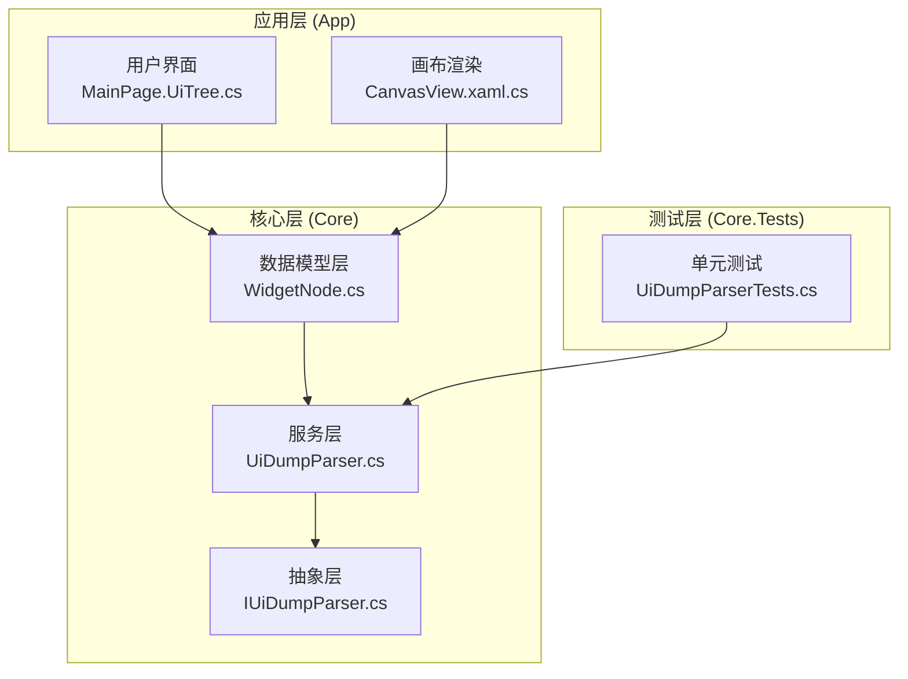
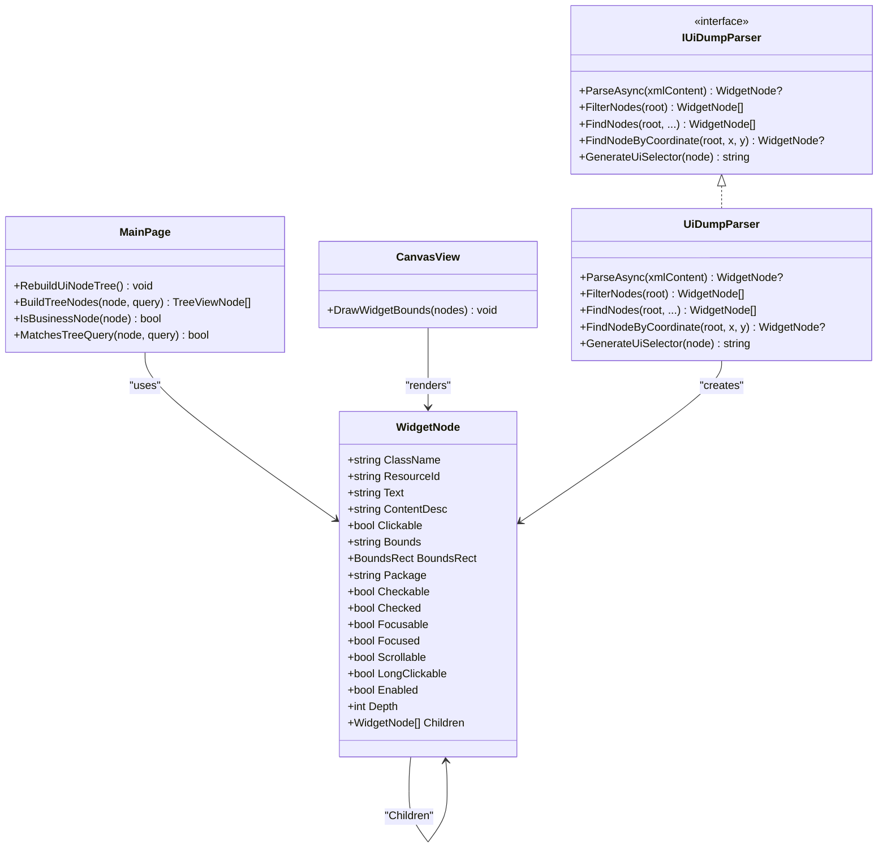
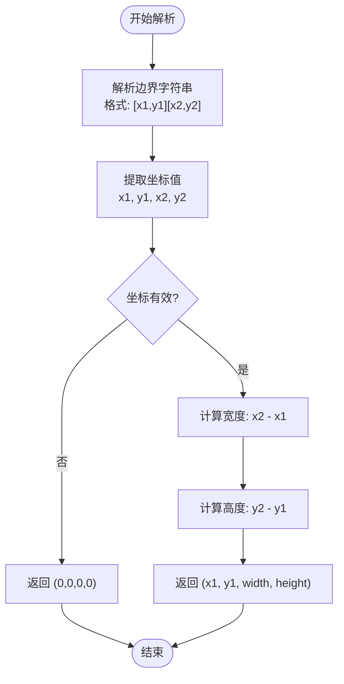
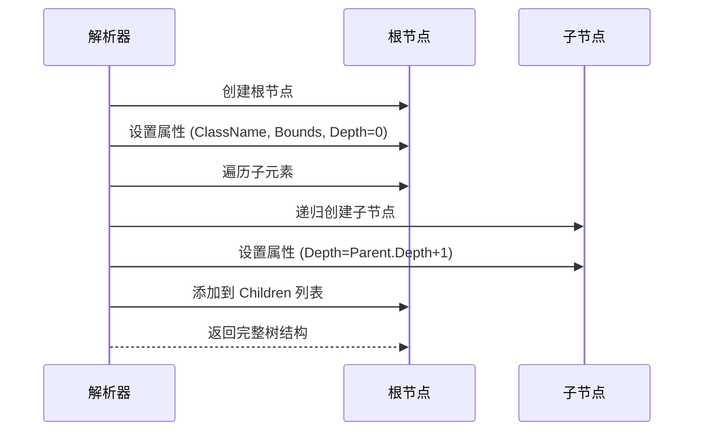
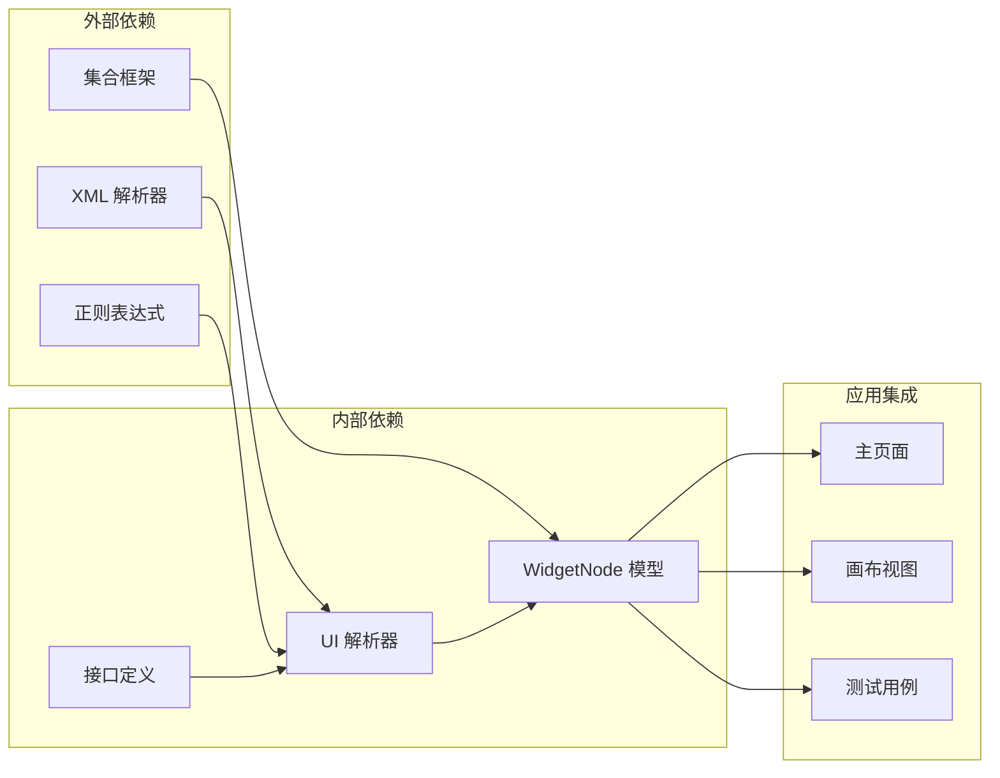

# WidgetNode 数据模型

<cite>
**本文档引用的文件**
- [WidgetNode.cs](file://Core/Models/WidgetNode.cs)
- [UiDumpParser.cs](file://Core/Services/UiDumpParser.cs)
- [IUiDumpParser.cs](file://Core/Abstractions/IUiDumpParser.cs)
- [UiDumpParserTests.cs](file://Core.Tests/UiDumpParserTests.cs)
- [MainPage.UiTree.cs](file://App/Views/MainPage.UiTree.cs)
- [CanvasView.xaml.cs](file://App/Views/CanvasView.xaml.cs)
</cite>

## 目录
1. [简介](#简介)
2. [项目结构](#项目结构)
3. [核心组件](#核心组件)
4. [架构概览](#架构概览)
5. [详细组件分析](#详细组件分析)
6. [依赖关系分析](#依赖关系分析)
7. [性能考虑](#性能考虑)
8. [故障排除指南](#故障排除指南)
9. [结论](#结论)
10. [附录](#附录)

## 简介

WidgetNode 是本项目中用于表示 Android UI 控件节点的核心数据模型。它承载了完整的 UI 控件信息，包括控件属性、几何信息和交互状态，并支持复杂的树形结构操作。该模型在 UI 分析引擎中发挥着至关重要的作用，为界面元素的解析、过滤、查询和可视化提供了统一的数据结构基础。

## 项目结构

该项目采用分层架构设计，WidgetNode 作为核心数据模型位于 Core 层，与 UI 解析服务、前端界面展示和测试用例形成清晰的层次关系：



**图表来源**
- [WidgetNode.cs:1-93](file://Core/Models/WidgetNode.cs#L1-L93)
- [UiDumpParser.cs:1-263](file://Core/Services/UiDumpParser.cs#L1-L263)
- [IUiDumpParser.cs:1-56](file://Core/Abstractions/IUiDumpParser.cs#L1-L56)

**章节来源**
- [WidgetNode.cs:1-93](file://Core/Models/WidgetNode.cs#L1-L93)
- [UiDumpParser.cs:1-263](file://Core/Services/UiDumpParser.cs#L1-L263)

## 核心组件

WidgetNode 数据模型包含以下主要组件：

### 控件属性字段
- **ClassName**: 控件类名（如 android.widget.TextView）
- **ResourceId**: 资源 ID（如 com.example:id/button）
- **Text**: 文本内容
- **ContentDesc**: 内容描述（content-desc）
- **Package**: 应用包名

### 几何信息属性
- **Bounds**: 边界框字符串（如 "[0,0][100,50]"）
- **BoundsRect**: 边界框矩形（x, y, width, height）
- **Depth**: 节点深度（用于 TreeView 渲染）

### 交互状态属性
- **Clickable**: 是否可点击
- **Enabled**: 是否已启用
- **Focused**: 是否已聚焦
- **Focusable**: 是否可聚焦
- **Checkable**: 是否可选中
- **Checked**: 是否已选中
- **Scrollable**: 是否可滚动
- **LongClickable**: 是否可长按

### 结构关系
- **Children**: 子节点列表，支持树形结构遍历

**章节来源**
- [WidgetNode.cs:8-92](file://Core/Models/WidgetNode.cs#L8-L92)

## 架构概览

WidgetNode 在整个系统中的架构位置如下：



**图表来源**
- [WidgetNode.cs:6-92](file://Core/Models/WidgetNode.cs#L6-L92)
- [IUiDumpParser.cs:8-55](file://Core/Abstractions/IUiDumpParser.cs#L8-L55)
- [UiDumpParser.cs:12-59](file://Core/Services/UiDumpParser.cs#L12-L59)
- [MainPage.UiTree.cs:9-168](file://App/Views/MainPage.UiTree.cs#L9-L168)
- [CanvasView.xaml.cs:636-662](file://App/Views/CanvasView.xaml.cs#L636-L662)

## 详细组件分析

### 控件属性字段详解

WidgetNode 的控件属性字段提供了完整的 UI 元素标识信息：

#### 基础标识属性
- **ClassName**: 完整的类名路径，用于识别控件类型
- **ResourceId**: 资源标识符，支持精确查找
- **Text**: 显示文本内容，用于用户可见的标签识别
- **ContentDesc**: 内容描述，支持无障碍访问场景

#### 应用信息
- **Package**: 应用包名，用于区分不同应用的控件

**章节来源**
- [WidgetNode.cs:10-46](file://Core/Models/WidgetNode.cs#L10-L46)

### 几何信息属性详解

几何信息是 WidgetNode 的核心功能之一，提供了精确的控件位置和尺寸信息。

#### 边界框解析逻辑
边界框字符串格式为 "[x1,y1][x2,y2]"，解析过程如下：



**图表来源**
- [UiDumpParser.cs:160-172](file://Core/Services/UiDumpParser.cs#L160-L172)

#### 层级深度维护机制
深度属性用于 TreeView 渲染和 UI 树的层次展示：
- 根节点深度为 0
- 每向下一层，深度递增 1
- 影响 TreeView 的展开/折叠行为

**章节来源**
- [WidgetNode.cs:84-86](file://Core/Models/WidgetNode.cs#L84-L86)
- [UiDumpParser.cs:103-154](file://Core/Services/UiDumpParser.cs#L103-L154)

### 交互状态属性详解

交互状态属性反映了控件的可操作性和当前状态：

#### 可操作性状态
- **Clickable**: 控件是否可点击
- **Enabled**: 控件是否已启用
- **Focusable**: 控件是否可聚焦
- **LongClickable**: 控件是否可长按

#### 选择状态
- **Checkable**: 控件是否可选中
- **Checked**: 控件是否已选中

#### 导航状态
- **Scrollable**: 控件是否可滚动
- **Focused**: 控件是否已聚焦

**章节来源**
- [WidgetNode.cs:28-81](file://Core/Models/WidgetNode.cs#L28-L81)

### 父子节点关系管理

WidgetNode 支持完整的树形结构操作：

#### 子节点管理
- **Children**: List<WidgetNode> 类型，存储直接子节点
- **递归遍历**: 支持深度优先遍历所有后代节点
- **层级维护**: 自动维护节点的深度信息

#### 树形结构构建流程


**图表来源**
- [UiDumpParser.cs:103-154](file://Core/Services/UiDumpParser.cs#L103-L154)

**章节来源**
- [WidgetNode.cs:88-92](file://Core/Models/WidgetNode.cs#L88-L92)
- [UiDumpParser.cs:143-151](file://Core/Services/UiDumpParser.cs#L143-L151)

### UI 分析引擎集成

WidgetNode 在 UI 分析引擎中承担多重角色：

#### 节点遍历支持
- **深度优先遍历**: 支持完整的树形结构遍历
- **条件筛选**: 支持基于属性的节点筛选
- **坐标查询**: 支持基于屏幕坐标的节点定位

#### 过滤机制
布局容器过滤规则：
- 仅包含具有意义内容的节点
- 排除空的布局容器
- 保持有用的 UI 结构

**章节来源**
- [UiDumpParser.cs:178-197](file://Core/Services/UiDumpParser.cs#L178-L197)
- [MainPage.UiTree.cs:116-127](file://App/Views/MainPage.UiTree.cs#L116-L127)

## 依赖关系分析

WidgetNode 的依赖关系体现了清晰的分层架构：



**图表来源**
- [UiDumpParser.cs:1-5](file://Core/Services/UiDumpParser.cs#L1-L5)
- [WidgetNode.cs:1](file://Core/Models/WidgetNode.cs#L1)

**章节来源**
- [IUiDumpParser.cs:1-56](file://Core/Abstractions/IUiDumpParser.cs#L1-L56)
- [UiDumpParser.cs:1-263](file://Core/Services/UiDumpParser.cs#L1-L263)

## 性能考虑

### 内存优化策略
- **只读属性**: 大多数属性使用 init 访问器，避免不必要的内存分配
- **延迟计算**: BoundsRect 属性支持延迟计算，减少重复解析开销
- **集合优化**: Children 使用 List<WidgetNode>，支持动态扩展

### 时间复杂度分析
- **边界解析**: O(1) - 正则表达式匹配固定模式
- **树遍历**: O(n) - n 为节点总数
- **节点查找**: O(n) - 最坏情况下需要遍历所有节点
- **坐标查询**: O(h) - h 为树的高度，通常远小于 n

### 内存使用模式
- 每个 WidgetNode 约占用 200-300 字节
- 树形结构内存使用与节点数量成正比
- 建议及时释放不需要的节点引用

## 故障排除指南

### 常见问题及解决方案

#### 边界解析失败
**症状**: BoundsRect 为 (0,0,0,0)
**原因**: 边界字符串格式不正确
**解决**: 检查 XML 中的 bounds 属性格式

#### 空树结构
**症状**: 解析后返回 null
**原因**: XML 格式错误或缺少根节点
**解决**: 验证 XML 结构完整性

#### 查询结果为空
**症状**: FindNodes 返回空列表
**原因**: 条件过于严格或节点不存在
**解决**: 放宽查询条件或检查节点属性

**章节来源**
- [UiDumpParserTests.cs:65-72](file://Core.Tests/UiDumpParserTests.cs#L65-L72)

### 调试技巧
- 使用日志记录边界解析结果
- 验证树形结构的完整性
- 检查节点深度与预期不符的情况

## 结论

WidgetNode 数据模型通过精心设计的属性结构和完善的树形操作支持，为 UI 分析引擎提供了强大的数据基础。其模块化的架构设计、清晰的职责分离和高效的性能表现，使其成为 Android UI 测试和自动化工具链中的核心组件。

该模型不仅满足了基本的 UI 元素表示需求，还通过丰富的交互状态属性和几何信息支持，为高级的 UI 分析和可视化功能奠定了坚实的基础。

## 附录

### 使用示例

#### 创建节点实例
```csharp
// 基本节点创建
var node = new WidgetNode
{
    ClassName = "android.widget.Button",
    ResourceId = "com.example:id/button",
    Text = "确定",
    Bounds = "[300,400][520,500]",
    BoundsRect = (300, 400, 220, 100),
    Clickable = true,
    Enabled = true,
    Depth = 0
};
```

#### 访问属性信息
```csharp
// 获取控件类型
string className = node.ClassName;

// 检查可点击状态
bool isClickable = node.Clickable;

// 获取边界信息
(int x, int y, int width, int height) = node.BoundsRect;
```

#### 节点操作最佳实践
- 使用深度优先遍历处理树形结构
- 在查询前验证节点属性的有效性
- 合理使用缓存机制提高查询性能
- 注意内存管理，及时释放不需要的节点引用