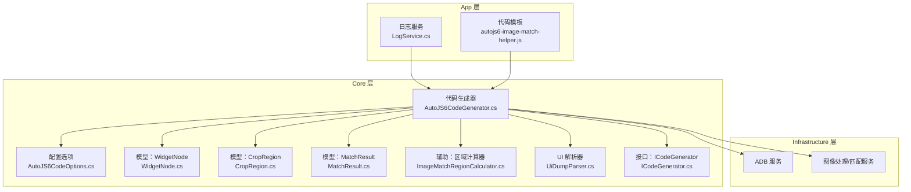
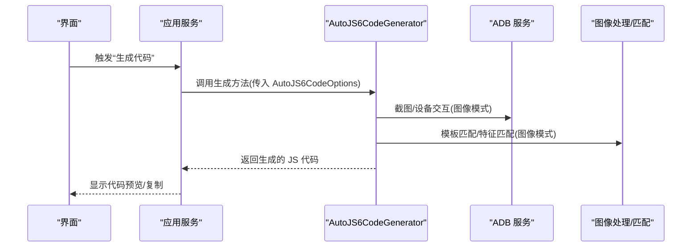
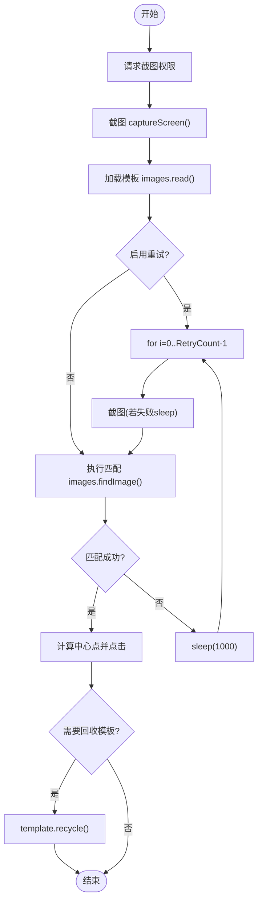
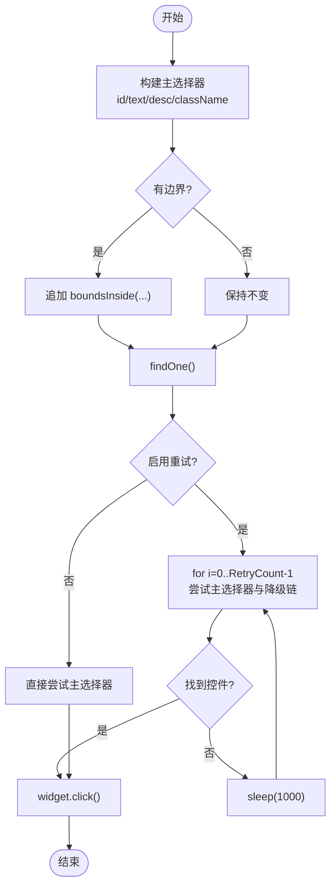
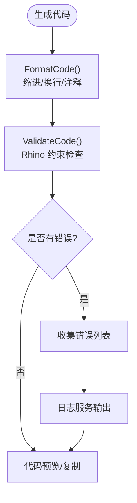
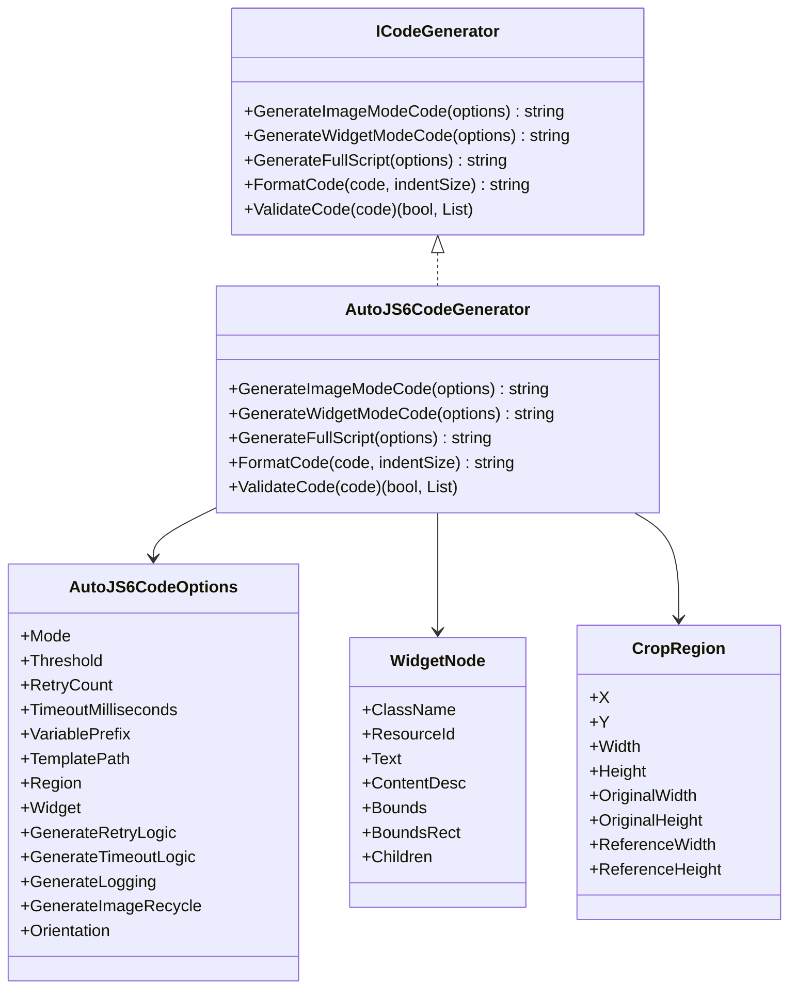

# 代码生成器

<cite>
**本文引用的文件**
- [AutoJS6CodeGenerator.cs](file://Core/Services/AutoJS6CodeGenerator.cs)
- [AutoJS6CodeOptions.cs](file://Core/Models/AutoJS6CodeOptions.cs)
- [ICodeGenerator.cs](file://Core/Abstractions/ICodeGenerator.cs)
- [LogService.cs](file://App/Services/LogService.cs)
- [autojs6-image-match-helper.js](file://App/CodeTemplates/image/autojs6-image-match-helper.js)
- [WidgetNode.cs](file://Core/Models/WidgetNode.cs)
- [CropRegion.cs](file://Core/Models/CropRegion.cs)
- [MatchResult.cs](file://Core/Models/MatchResult.cs)
- [ImageMatchRegionCalculator.cs](file://Core/Helpers/ImageMatchRegionCalculator.cs)
- [UiDumpParser.cs](file://Core/Services/UiDumpParser.cs)
- [AutoJS6CodeGeneratorTests.cs](file://Core.Tests/AutoJS6CodeGeneratorTests.cs)
- [spec.md](file://openspec/changes/winui3-visual-dev-toolkit/specs/autojs6-code-generator/spec.md)
- [PHASE0_REFERENCE.md](file://openspec/changes/winui3-visual-dev-toolkit/PHASE0_REFERENCE.md)
- [README.md](file://README.md)
</cite>

## 目录
1. [简介](#简介)
2. [项目结构](#项目结构)
3. [核心组件](#核心组件)
4. [架构总览](#架构总览)
5. [详细组件分析](#详细组件分析)
6. [依赖分析](#依赖分析)
7. [性能考量](#性能考量)
8. [故障排查指南](#故障排查指南)
9. [结论](#结论)
10. [附录](#附录)

## 简介
本文件面向 AutoJS6 代码生成器的实现，围绕 AutoJS6CodeGenerator 的核心逻辑展开，涵盖图像模式与控件模式的代码生成、代码模板系统、语法验证与格式化、以及配置选项 AutoJS6CodeOptions 的设计与影响。同时结合模板辅助脚本与测试用例，给出可操作的使用建议与最佳实践。

## 项目结构
- Core 层提供纯业务逻辑，包含接口、模型与服务实现，避免 UI 依赖，便于单元测试与跨平台移植。
- App 层提供 UI 与应用服务（如日志服务），并与 Core 通过接口解耦。
- Infrastructure 层封装外部依赖（ADB、图像处理等），为 Core 提供适配器。
- openspec 目录提供需求规格与 API 参考，指导生成器的约束与行为。

图表来源
- [AutoJS6CodeGenerator.cs:11-357](file://Core/Services/AutoJS6CodeGenerator.cs#L11-L357)
- [AutoJS6CodeOptions.cs:6-89](file://Core/Models/AutoJS6CodeOptions.cs#L6-L89)
- [ICodeGenerator.cs:8-46](file://Core/Abstractions/ICodeGenerator.cs#L8-L46)
- [LogService.cs:9-51](file://App/Services/LogService.cs#L9-L51)
- [autojs6-image-match-helper.js:18-160](file://App/CodeTemplates/image/autojs6-image-match-helper.js#L18-L160)
- [WidgetNode.cs:6-93](file://Core/Models/WidgetNode.cs#L6-L93)
- [CropRegion.cs:6-53](file://Core/Models/CropRegion.cs#L6-L53)
- [MatchResult.cs:6-63](file://Core/Models/MatchResult.cs#L6-L63)
- [ImageMatchRegionCalculator.cs:35-99](file://Core/Helpers/ImageMatchRegionCalculator.cs#L35-L99)
- [UiDumpParser.cs:12-263](file://Core/Services/UiDumpParser.cs#L12-L263)

章节来源
- [README.md:230-288](file://README.md#L230-L288)

## 核心组件
- AutoJS6CodeGenerator：实现 ICodeGenerator 接口，负责图像模式与控件模式的代码生成、完整脚本拼装、代码格式化与基础语法验证。
- AutoJS6CodeOptions：集中定义生成行为的配置项，包括匹配阈值、重试次数、超时、变量前缀、模板路径、区域、控件节点、开关项等。
- ICodeGenerator：定义生成器对外契约，包含图像/控件模式生成、完整脚本生成、格式化与验证。
- 辅助模板与工具：autojs6-image-match-helper.js 提供高级匹配能力；ImageMatchRegionCalculator 提供 regionRef 与参考分辨率映射；UiDumpParser 提供 UI 树解析与选择器生成。
- 日志服务：统一日志入口，便于 UI 订阅与调试。

章节来源
- [AutoJS6CodeGenerator.cs:11-357](file://Core/Services/AutoJS6CodeGenerator.cs#L11-L357)
- [AutoJS6CodeOptions.cs:6-89](file://Core/Models/AutoJS6CodeOptions.cs#L6-L89)
- [ICodeGenerator.cs:8-46](file://Core/Abstractions/ICodeGenerator.cs#L8-L46)
- [autojs6-image-match-helper.js:18-160](file://App/CodeTemplates/image/autojs6-image-match-helper.js#L18-L160)
- [ImageMatchRegionCalculator.cs:35-99](file://Core/Helpers/ImageMatchRegionCalculator.cs#L35-L99)
- [UiDumpParser.cs:12-263](file://Core/Services/UiDumpParser.cs#L12-L263)
- [LogService.cs:9-51](file://App/Services/LogService.cs#L9-L51)

## 架构总览
生成器遵循“接口隔离 + 分层解耦”的 Clean Architecture 设计：
- App 层仅负责 UI 与应用服务，不直接参与业务逻辑。
- Core 层包含纯业务逻辑与模型，独立可测试。
- Infrastructure 层封装外部依赖，Core 通过接口消费。

图表来源
- [AutoJS6CodeGenerator.cs:13-102](file://Core/Services/AutoJS6CodeGenerator.cs#L13-L102)
- [PHASE0_REFERENCE.md:422-451](file://openspec/changes/winui3-visual-dev-toolkit/PHASE0_REFERENCE.md#L422-L451)

## 详细组件分析

### AutoJS6CodeGenerator：图像模式代码生成
- 主要流程
  - 权限与截图：先请求截图权限，再捕获屏幕。
  - 模板加载：读取模板图像，失败则退出。
  - 可选重试：循环多次尝试，每次截图后执行匹配，命中则跳出。
  - 区域与阈值：支持指定 region 与 threshold 参数。
  - 点击坐标：以模板中心点为目标坐标，执行点击。
  - 资源回收：可选回收模板图像。
  - 结果判定：未命中则提示并退出。
- 关键实现要点
  - 重试逻辑与睡眠间隔：通过 for 循环与 sleep 控制重试节奏。
  - 区域参数传递：当存在 CropRegion 时，将 [x, y, w, h] 注入 findImage 的 options。
  - 变量前缀：通过 options.VariablePrefix 控制变量命名，便于多模板场景。
  - 生成策略：单次匹配与重试两种分支，分别对应 GenerateRetryLogic 开关。
- 代码片段路径
  - [图像模式主流程:13-102](file://Core/Services/AutoJS6CodeGenerator.cs#L13-L102)
  - [重试循环与匹配调用:38-99](file://Core/Services/AutoJS6CodeGenerator.cs#L38-L99)
  - [区域与阈值注入:260-288](file://Core/Services/AutoJS6CodeGenerator.cs#L260-L288)

图表来源
- [AutoJS6CodeGenerator.cs:13-102](file://Core/Services/AutoJS6CodeGenerator.cs#L13-L102)
- [AutoJS6CodeGenerator.cs:260-288](file://Core/Services/AutoJS6CodeGenerator.cs#L260-L288)

章节来源
- [AutoJS6CodeGenerator.cs:13-102](file://Core/Services/AutoJS6CodeGenerator.cs#L13-L102)
- [AutoJS6CodeGenerator.cs:260-288](file://Core/Services/AutoJS6CodeGenerator.cs#L260-L288)

### AutoJS6CodeGenerator：控件模式代码生成
- 主要流程
  - 构建主选择器：优先资源 ID，其次文本，再次内容描述，最后类名；可选加入 boundsInside。
  - 可选回退链：若主选择器未命中，则依次尝试 text/desc 等降级选择器。
  - 可选重试：循环多次尝试，命中则跳出。
  - 点击操作：若找到控件则执行点击。
- 关键实现要点
  - BuildPrimaryWidgetSelector：按优先级生成主选择器链。
  - BuildFallbackWidgetSelectors：根据已有属性生成降级链。
  - BuildSelectorWithOptionalBounds：在有边界时追加 boundsInside 并 findOne。
  - 重试与超时：通过 GenerateRetryLogic 控制循环次数与 sleep 间隔。
- 代码片段路径
  - [控件模式主流程:104-164](file://Core/Services/AutoJS6CodeGenerator.cs#L104-L164)
  - [主选择器构建:290-312](file://Core/Services/AutoJS6CodeGenerator.cs#L290-L312)
  - [降级选择器构建:314-334](file://Core/Services/AutoJS6CodeGenerator.cs#L314-L334)
  - [边界选择器拼接:336-345](file://Core/Services/AutoJS6CodeGenerator.cs#L336-L345)

图表来源
- [AutoJS6CodeGenerator.cs:104-164](file://Core/Services/AutoJS6CodeGenerator.cs#L104-L164)
- [AutoJS6CodeGenerator.cs:290-345](file://Core/Services/AutoJS6CodeGenerator.cs#L290-L345)

章节来源
- [AutoJS6CodeGenerator.cs:104-164](file://Core/Services/AutoJS6CodeGenerator.cs#L104-L164)
- [AutoJS6CodeGenerator.cs:290-345](file://Core/Services/AutoJS6CodeGenerator.cs#L290-L345)

### AutoJS6CodeOptions：配置选项设计与影响
- 作用域与默认值
  - Mode：图像/控件模式枚举，默认图像模式。
  - Threshold：模板匹配阈值，默认 0.8，范围 0.0-1.0。
  - RetryCount：重试次数，默认 3。
  - TimeoutMilliseconds：超时时间（毫秒），默认 5000。
  - VariablePrefix：变量名前缀，默认 "target"。
  - TemplatePath：模板文件路径（图像模式）。
  - Region：裁剪区域 CropRegion（图像模式）。
  - Widget：WidgetNode（控件模式）。
  - GenerateRetryLogic/GenerateTimeoutLogic/GenerateLogging/GenerateImageRecycle：各类生成开关。
  - Orientation：横竖屏方向字符串（如 "landscape"/"portrait"）。
- 影响范围
  - 图像模式：Threshold 与 Region 直接影响 findImage 的匹配参数；RetryCount 控制循环次数；VariablePrefix 控制变量命名；GenerateImageRecycle 控制模板回收。
  - 控件模式：Widget 的属性决定选择器优先级与降级链；GenerateRetryLogic 控制重试与 sleep。
  - 通用：GenerateLogging 控制是否输出日志；TimeoutMilliseconds 与 GenerateTimeoutLogic 为扩展预留。
- 代码片段路径
  - [配置选项定义:6-89](file://Core/Models/AutoJS6CodeOptions.cs#L6-L89)

章节来源
- [AutoJS6CodeOptions.cs:6-89](file://Core/Models/AutoJS6CodeOptions.cs#L6-L89)

### 代码模板系统：加载、变量替换与条件分支
- 模板加载
  - 图像模式模板：通过 images.read() 读取 TemplatePath 指定的模板文件。
  - 辅助模板：autojs6-image-match-helper.js 提供高级匹配函数（如 matchReferenceTemplate），支持方向、缩放、区域映射与特征匹配回退。
- 变量替换
  - VariablePrefix 用于生成变量名（如 targetTemplate），便于多模板场景区分。
  - Region 通过 [x, y, w, h] 注入到 options.region。
- 条件分支与循环
  - 图像模式：根据 GenerateRetryLogic 决定是否生成 for 循环与 sleep。
  - 控件模式：根据 Widget 属性生成主/降级选择器链，并可选重试。
- 代码片段路径
  - [模板读取与区域注入:31-36](file://Core/Services/AutoJS6CodeGenerator.cs#L31-L36)
  - [模板辅助函数:18-160](file://App/CodeTemplates/image/autojs6-image-match-helper.js#L18-L160)

章节来源
- [AutoJS6CodeGenerator.cs:31-36](file://Core/Services/AutoJS6CodeGenerator.cs#L31-L36)
- [autojs6-image-match-helper.js:18-160](file://App/CodeTemplates/image/autojs6-image-match-helper.js#L18-L160)

### 代码预览与验证机制：格式化、语法检查与调试支持
- 格式化
  - 简单缩进：根据大括号匹配动态增减缩进，支持空行保留。
- 语法验证
  - Rhino 引擎约束：检测循环体内是否使用 const/let，要求改用 var，避免变量绑定问题。
- 调试支持
  - 日志服务：统一日志入口，支持 UI 订阅与控制台输出。
  - 测试断言：单元测试覆盖图像/控件模式的关键行为与变量替换。
- 代码片段路径
  - [格式化实现:191-224](file://Core/Services/AutoJS6CodeGenerator.cs#L191-L224)
  - [语法验证实现:226-258](file://Core/Services/AutoJS6CodeGenerator.cs#L226-L258)
  - [日志服务:9-51](file://App/Services/LogService.cs#L9-L51)
  - [单元测试:10-79](file://Core.Tests/AutoJS6CodeGeneratorTests.cs#L10-L79)

图表来源
- [AutoJS6CodeGenerator.cs:191-258](file://Core/Services/AutoJS6CodeGenerator.cs#L191-L258)
- [LogService.cs:9-51](file://App/Services/LogService.cs#L9-L51)

章节来源
- [AutoJS6CodeGenerator.cs:191-258](file://Core/Services/AutoJS6CodeGenerator.cs#L191-L258)
- [LogService.cs:9-51](file://App/Services/LogService.cs#L9-L51)
- [AutoJS6CodeGeneratorTests.cs:10-79](file://Core.Tests/AutoJS6CodeGeneratorTests.cs#L10-L79)

### 图像匹配区域计算器：regionRef 与参考分辨率映射
- 目标
  - 基于参考矩形与 padding 计算搜索区域，并生成 regionRef（相对于参考分辨率的比例坐标）。
- 关键点
  - 屏幕方向判断（横屏/竖屏），确定参考分辨率（1280x720 或 720x1280）。
  - 计算 widthRatio/heightRatio，将搜索区域坐标映射到参考坐标系。
  - 生成 regionRef 数组 [x, y, width, height]。
- 代码片段路径
  - [区域上下文定义:9-30](file://Core/Helpers/ImageMatchRegionCalculator.cs#L9-L30)
  - [区域计算器实现:40-99](file://Core/Helpers/ImageMatchRegionCalculator.cs#L40-L99)

章节来源
- [ImageMatchRegionCalculator.cs:9-30](file://Core/Helpers/ImageMatchRegionCalculator.cs#L9-L30)
- [ImageMatchRegionCalculator.cs:40-99](file://Core/Helpers/ImageMatchRegionCalculator.cs#L40-L99)

### UI 解析与选择器生成：UiDumpParser
- 目标
  - 解析 uiautomator dump XML，构建 WidgetNode 树，生成 UiSelector 选择器链。
- 关键点
  - 优先使用 resource-id，其次 text/content-desc，最后 className。
  - 若存在边界框，追加 boundsInside(...)。
  - 提供过滤与查找工具方法，支持按属性筛选与坐标定位。
- 代码片段路径
  - [选择器生成:61-97](file://Core/Services/UiDumpParser.cs#L61-L97)
  - [XML 解析与节点构建:103-154](file://Core/Services/UiDumpParser.cs#L103-L154)

章节来源
- [UiDumpParser.cs:61-97](file://Core/Services/UiDumpParser.cs#L61-L97)
- [UiDumpParser.cs:103-154](file://Core/Services/UiDumpParser.cs#L103-L154)

## 依赖分析
- 组件耦合与内聚
  - AutoJS6CodeGenerator 依赖 ICodeGenerator 接口，内聚于生成逻辑，降低与 UI 的耦合。
  - 通过模型（WidgetNode、CropRegion、MatchResult）与辅助工具（ImageMatchRegionCalculator、UiDumpParser）解耦具体数据结构与算法。
- 外部依赖
  - ADB 与图像处理服务通过接口抽象，Core 层不直接依赖具体实现。
- 循环依赖
  - 未见循环依赖迹象，分层清晰。

图表来源
- [ICodeGenerator.cs:8-46](file://Core/Abstractions/ICodeGenerator.cs#L8-L46)
- [AutoJS6CodeGenerator.cs:11-357](file://Core/Services/AutoJS6CodeGenerator.cs#L11-L357)
- [AutoJS6CodeOptions.cs:6-89](file://Core/Models/AutoJS6CodeOptions.cs#L6-L89)
- [WidgetNode.cs:6-93](file://Core/Models/WidgetNode.cs#L6-L93)
- [CropRegion.cs:6-53](file://Core/Models/CropRegion.cs#L6-L53)

章节来源
- [ICodeGenerator.cs:8-46](file://Core/Abstractions/ICodeGenerator.cs#L8-L46)
- [AutoJS6CodeGenerator.cs:11-357](file://Core/Services/AutoJS6CodeGenerator.cs#L11-L357)
- [AutoJS6CodeOptions.cs:6-89](file://Core/Models/AutoJS6CodeOptions.cs#L6-L89)
- [WidgetNode.cs:6-93](file://Core/Models/WidgetNode.cs#L6-L93)
- [CropRegion.cs:6-53](file://Core/Models/CropRegion.cs#L6-L53)

## 性能考量
- 截图与内存
  - 单次迭代只调用一次 captureScreen()，避免重复截图带来的开销。
  - 模板图像使用后及时回收，减少内存占用与 OOM 风险。
- 匹配范围
  - 优先使用 region 限定搜索范围，缩小匹配窗口，提高性能。
- 重试策略
  - 合理设置 RetryCount 与 sleep 间隔，避免频繁轮询导致卡顿。
- 代码生成
  - 生成的代码遵循 Rhino 引擎约束，避免循环体内 const/let 导致的变量绑定问题。

章节来源
- [README.md:342-374](file://README.md#L342-L374)
- [AutoJS6CodeGenerator.cs:38-99](file://Core/Services/AutoJS6CodeGenerator.cs#L38-L99)
- [AutoJS6CodeGenerator.cs:226-258](file://Core/Services/AutoJS6CodeGenerator.cs#L226-L258)

## 故障排查指南
- 常见问题
  - 截图失败：确认已请求截图权限且设备方向正确；检查 ADB 连接状态。
  - 模板未找到：调整阈值 Threshold 与区域 Region；确认模板质量与对比度。
  - 控件未找到：检查 WidgetNode 属性是否齐全；确认降级选择器链顺序。
  - Rhino 引擎报错：确保循环体内使用 var 替代 const/let。
- 调试建议
  - 使用日志服务输出关键步骤与变量值。
  - 通过单元测试快速验证生成逻辑与变量替换。
- 代码片段路径
  - [日志服务:9-51](file://App/Services/LogService.cs#L9-L51)
  - [语法验证:226-258](file://Core/Services/AutoJS6CodeGenerator.cs#L226-L258)
  - [单元测试:10-79](file://Core.Tests/AutoJS6CodeGeneratorTests.cs#L10-L79)

章节来源
- [LogService.cs:9-51](file://App/Services/LogService.cs#L9-L51)
- [AutoJS6CodeGenerator.cs:226-258](file://Core/Services/AutoJS6CodeGenerator.cs#L226-L258)
- [AutoJS6CodeGeneratorTests.cs:10-79](file://Core.Tests/AutoJS6CodeGeneratorTests.cs#L10-L79)

## 结论
AutoJS6CodeGenerator 以清晰的接口与分层架构实现了图像模式与控件模式的代码生成，结合 AutoJS6 API 约束与模板辅助脚本，提供了稳定、可维护且可测试的生成能力。通过 AutoJS6CodeOptions 的灵活配置与 ImageMatchRegionCalculator 的区域映射，生成器能够适配多分辨率与多场景需求。配合格式化与语法验证，进一步提升了代码质量与可读性。

## 附录

### 代码生成示例（路径指引）
- 图像模式：点击操作
  - [示例路径:194-207](file://README.md#L194-L207)
- 控件模式：点击操作
  - [示例路径:210-219](file://README.md#L210-L219)
- 高级匹配辅助函数
  - [函数定义:18-160](file://App/CodeTemplates/image/autojs6-image-match-helper.js#L18-L160)

### 配置选项速查
- 图像模式关键参数
  - Threshold、Region、TemplatePath、VariablePrefix、GenerateRetryLogic、GenerateImageRecycle
  - [参数定义:14-66](file://Core/Models/AutoJS6CodeOptions.cs#L14-L66)
- 控件模式关键参数
  - Widget（包含 ClassName、ResourceId、Text、ContentDesc、BoundsRect 等）
  - [参数定义:44-46](file://Core/Models/AutoJS6CodeOptions.cs#L44-L46)
- 区域映射
  - [计算器实现:40-99](file://Core/Helpers/ImageMatchRegionCalculator.cs#L40-L99)

章节来源
- [README.md:194-219](file://README.md#L194-L219)
- [autojs6-image-match-helper.js:18-160](file://App/CodeTemplates/image/autojs6-image-match-helper.js#L18-L160)
- [AutoJS6CodeOptions.cs:14-66](file://Core/Models/AutoJS6CodeOptions.cs#L14-L66)
- [ImageMatchRegionCalculator.cs:40-99](file://Core/Helpers/ImageMatchRegionCalculator.cs#L40-L99)