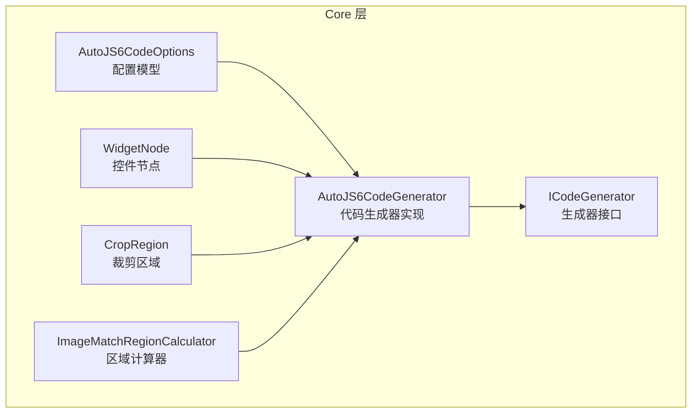
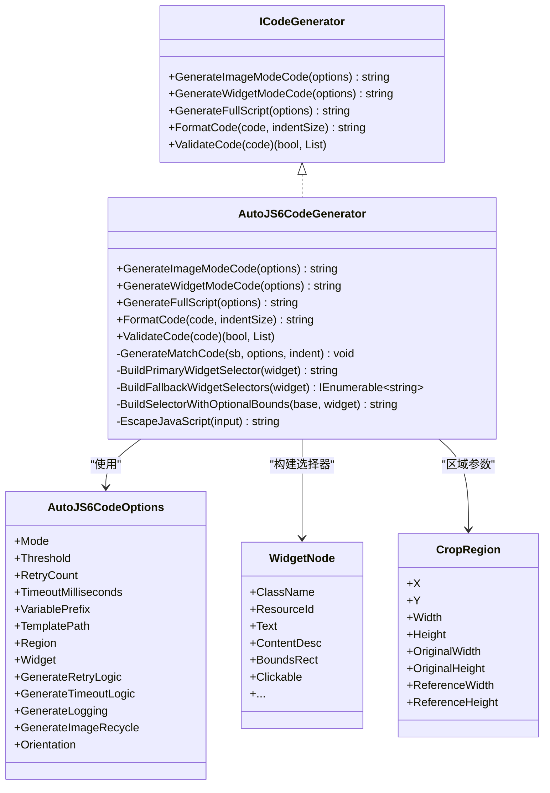
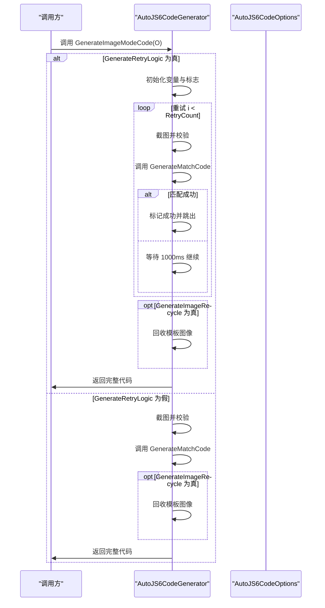
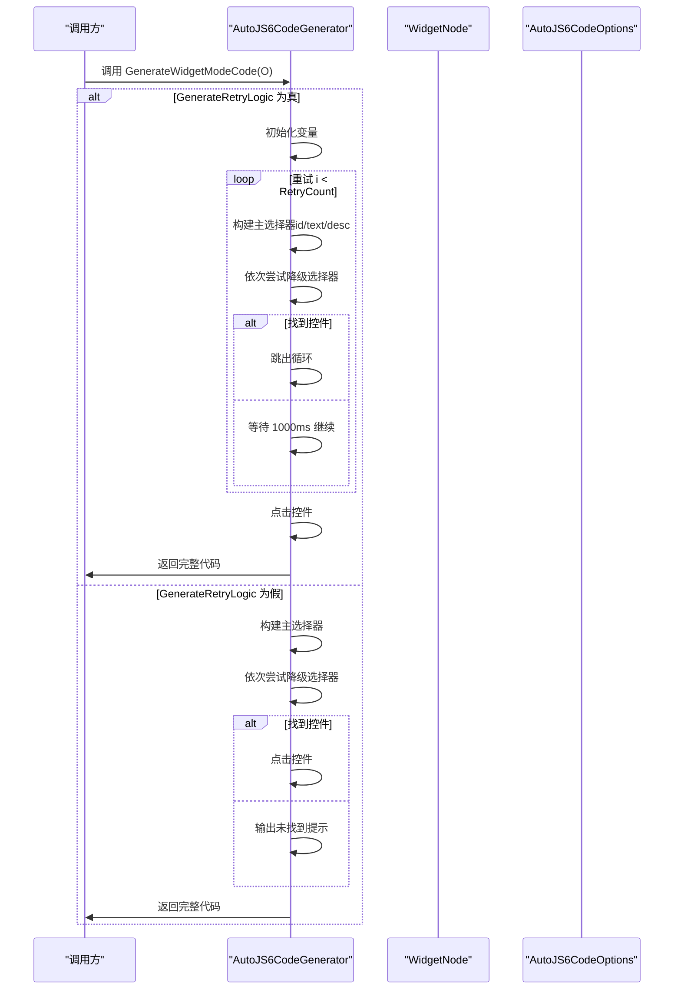
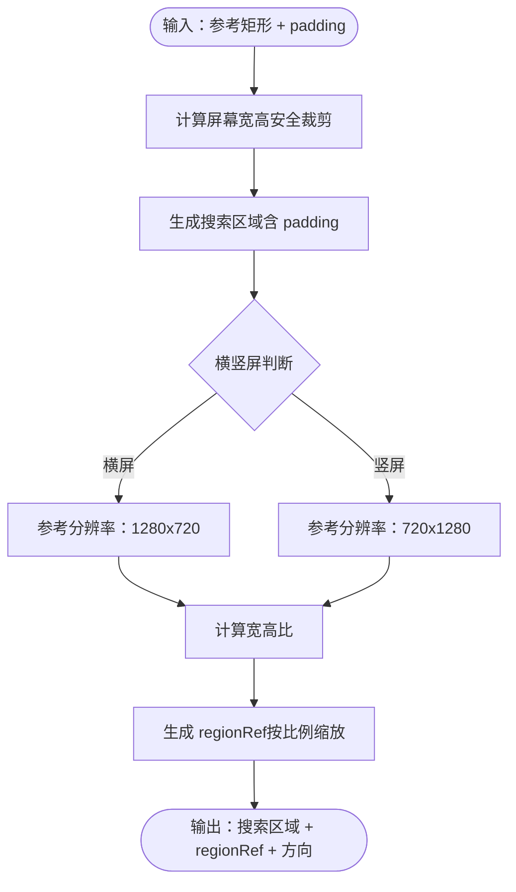
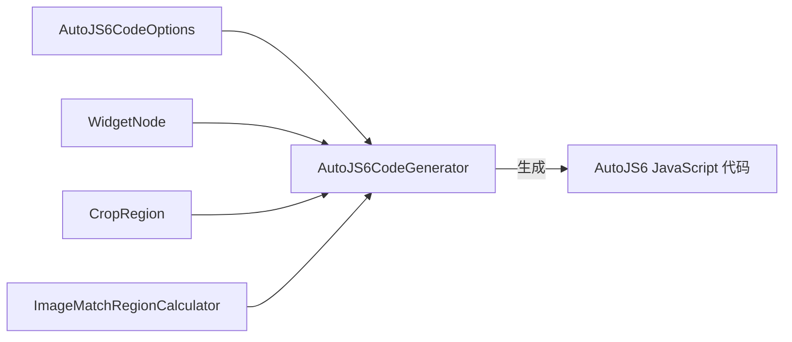

# 代码生成配置选项

<cite>
**本文档引用的文件**
- [AutoJS6CodeOptions.cs](file://Core/Models/AutoJS6CodeOptions.cs)
- [AutoJS6CodeGenerator.cs](file://Core/Services/AutoJS6CodeGenerator.cs)
- [ICodeGenerator.cs](file://Core/Abstractions/ICodeGenerator.cs)
- [WidgetNode.cs](file://Core/Models/WidgetNode.cs)
- [CropRegion.cs](file://Core/Models/CropRegion.cs)
- [ImageMatchRegionCalculator.cs](file://Core/Helpers/ImageMatchRegionCalculator.cs)
- [AutoJS6CodeGeneratorTests.cs](file://Core.Tests/AutoJS6CodeGeneratorTests.cs)
- [PHASE0_REFERENCE.md](file://openspec/changes/winui3-visual-dev-toolkit/PHASE0_REFERENCE.md)
- [spec.md](file://openspec/changes/winui3-visual-dev-toolkit/specs/autojs6-code-generator/spec.md)
- [README_zh_CN.md](file://README_zh_CN.md)
- [AGENTS.md](file://AGENTS.md)
</cite>

## 目录
1. [简介](#简介)
2. [项目结构](#项目结构)
3. [核心组件](#核心组件)
4. [架构总览](#架构总览)
5. [详细组件分析](#详细组件分析)
6. [依赖关系分析](#依赖关系分析)
7. [性能考量](#性能考量)
8. [故障排查指南](#故障排查指南)
9. [结论](#结论)
10. [附录](#附录)

## 简介
本文件面向 AutoJS6 代码生成配置选项系统，围绕 Core 层的 AutoJS6CodeOptions 类展开，系统性阐述各配置属性的语义、行为与相互约束，并结合生成器实现与规范文档，给出配置组合对代码质量、性能与可靠性的综合影响评估，以及面向不同使用场景的最佳实践建议。

## 项目结构
AutoJS6 代码生成配置选项系统位于 Core 层，采用“模型 + 服务 + 接口”的分层组织：
- 模型层：AutoJS6CodeOptions、WidgetNode、CropRegion
- 服务层：AutoJS6CodeGenerator（实现 ICodeGenerator）
- 规范与测试：PHASE0_REFERENCE.md、spec.md、AGENTS.md、单元测试

图表来源
- [AutoJS6CodeOptions.cs:6-72](file://Core/Models/AutoJS6CodeOptions.cs#L6-L72)
- [AutoJS6CodeGenerator.cs:11-189](file://Core/Services/AutoJS6CodeGenerator.cs#L11-L189)
- [ICodeGenerator.cs:8-45](file://Core/Abstractions/ICodeGenerator.cs#L8-L45)
- [WidgetNode.cs:6-92](file://Core/Models/WidgetNode.cs#L6-L92)
- [CropRegion.cs:6-52](file://Core/Models/CropRegion.cs#L6-L52)
- [ImageMatchRegionCalculator.cs:35-98](file://Core/Helpers/ImageMatchRegionCalculator.cs#L35-L98)

章节来源
- [AutoJS6CodeOptions.cs:1-89](file://Core/Models/AutoJS6CodeOptions.cs#L1-L89)
- [AutoJS6CodeGenerator.cs:1-357](file://Core/Services/AutoJS6CodeGenerator.cs#L1-L357)
- [ICodeGenerator.cs:1-46](file://Core/Abstractions/ICodeGenerator.cs#L1-L46)
- [WidgetNode.cs:1-93](file://Core/Models/WidgetNode.cs#L1-L93)
- [CropRegion.cs:1-53](file://Core/Models/CropRegion.cs#L1-L53)
- [ImageMatchRegionCalculator.cs:1-99](file://Core/Helpers/ImageMatchRegionCalculator.cs#L1-L99)

## 核心组件
本节聚焦 AutoJS6CodeOptions 的全部配置属性，逐项说明其含义、默认值、取值范围、与生成器实现的映射关系，以及与其他属性的约束与交互。

- Mode（代码生成模式）
  - 作用：选择图像模式（基于模板匹配）或控件模式（基于 UiSelector）
  - 默认值：未设置（required）
  - 约束：与 Widget、TemplatePath、Region 等属性存在互斥/必填关系
  - 生成器行为：决定进入 GenerateImageModeCode 或 GenerateWidgetModeCode

- Threshold（模板匹配阈值）
  - 作用：控制 images.findImage 的相似度阈值，范围通常为 0.0~1.0
  - 默认值：0.8
  - 生成器行为：注入到生成的 images.findImage 调用中
  - 影响：阈值越高越严格，误检率下降但漏检风险上升；反之则相反

- RetryCount（重试次数）
  - 作用：图像模式下重试抓取与匹配的最大次数
  - 默认值：3
  - 生成器行为：用于 for 循环上限；每次重试间隔固定（实现中为 1000ms）
  - 影响：提高稳定性但增加执行时间；与 GenerateRetryLogic 联动

- TimeoutMilliseconds（超时时间）
  - 作用：控件模式下 findOne() 的超时参数（来自接口定义）
  - 默认值：5000
  - 生成器行为：控件模式代码生成中使用该值（接口定义存在，具体实现中未见直接使用）
  - 影响：影响控件查找的最长等待时间

- VariablePrefix（变量名前缀）
  - 作用：生成代码中变量命名的统一前缀，便于区分与复用
  - 默认值：target
  - 生成器行为：模板变量、结果变量、控件变量均以此前缀命名
  - 影响：提升可读性与可维护性

- TemplatePath（模板文件路径）
  - 作用：图像模式下模板图像的读取路径
  - 默认值：null
  - 约束：图像模式下必填；控件模式下无意义
  - 生成器行为：注入到 images.read()

- Region（区域裁剪）
  - 作用：限制模板匹配的搜索区域，提升性能与准确性
  - 默认值：null
  - 约束：与 Orientation、ReferenceWidth/Height 存在间接关联（通过区域计算器）
  - 生成器行为：注入到 images.findImage 的 region 参数

- Widget（控件节点）
  - 作用：控件模式下的选择器构建依据
  - 默认值：null
  - 约束：控件模式下必填；否则抛出异常
  - 生成器行为：构建 id()/text()/desc() 选择器链，必要时加入 boundsInside()

- GenerateRetryLogic（重试逻辑开关）
  - 作用：是否生成 for 循环重试与 sleep 间隔
  - 默认值：true
  - 生成器行为：控制图像/控件模式的重试分支
  - 影响：增强鲁棒性，但增加时间与资源消耗

- GenerateTimeoutLogic（超时逻辑开关）
  - 作用：是否生成超时控制代码
  - 默认值：true
  - 生成器行为：接口定义存在，当前实现中未见直接使用
  - 影响：预留扩展点，当前不参与生成

- GenerateLogging（日志输出开关）
  - 作用：是否生成 toast 日志提示
  - 默认值：false
  - 生成器行为：当前实现未使用该开关
  - 影响：可按需开启调试输出

- GenerateImageRecycle（图像回收开关）
  - 作用：是否生成模板图像回收代码
  - 默认值：true
  - 生成器行为：图像模式下在适当时机调用 recycle()
  - 影响：防止内存泄漏，提升长期运行稳定性

- Orientation（横竖屏方向）
  - 作用：横竖屏方向（landscape/portrait）
  - 默认值：null
  - 约束：与区域计算器的参考分辨率与 regionRef 生成相关
  - 生成器行为：当前实现未直接使用该字段

章节来源
- [AutoJS6CodeOptions.cs:6-72](file://Core/Models/AutoJS6CodeOptions.cs#L6-L72)
- [ICodeGenerator.cs:8-45](file://Core/Abstractions/ICodeGenerator.cs#L8-L45)
- [AutoJS6CodeGenerator.cs:13-102](file://Core/Services/AutoJS6CodeGenerator.cs#L13-L102)
- [AutoJS6CodeGenerator.cs:104-164](file://Core/Services/AutoJS6CodeGenerator.cs#L104-L164)

## 架构总览
AutoJS6 代码生成器遵循“接口 + 实现 + 模型”的分层设计，生成器根据 Mode 切换到不同生成路径，并依据各配置项生成对应的 JavaScript 代码。生成的代码需满足 AutoJS6 运行时约束（如 Rhino 引擎限制、图像生命周期管理等）。

图表来源
- [ICodeGenerator.cs:8-45](file://Core/Abstractions/ICodeGenerator.cs#L8-L45)
- [AutoJS6CodeGenerator.cs:11-357](file://Core/Services/AutoJS6CodeGenerator.cs#L11-L357)
- [AutoJS6CodeOptions.cs:6-72](file://Core/Models/AutoJS6CodeOptions.cs#L6-L72)
- [WidgetNode.cs:6-92](file://Core/Models/WidgetNode.cs#L6-L92)
- [CropRegion.cs:6-52](file://Core/Models/CropRegion.cs#L6-L52)

## 详细组件分析

### AutoJS6CodeOptions 配置属性详解
- Mode
  - 与 Widget/TemplatePath/Region 的关系：图像模式需要 TemplatePath 与可选 Region；控件模式需要 Widget
  - 与 GenerateRetryLogic/GenerateTimeoutLogic 的关系：两者共同决定重试与超时分支
  - 与 GenerateImageRecycle 的关系：图像模式下通常需要回收模板图像
- Threshold
  - 与 Region 的关系：配合区域裁剪可显著提升匹配精度与性能
  - 与 RetryCount 的关系：阈值过低可能导致多次重试
- RetryCount
  - 与 GenerateRetryLogic 的关系：开关为真时生效
  - 与 TimeoutMilliseconds 的关系：控件模式下由 findOne() 的超时参数控制
- VariablePrefix
  - 与 TemplatePath/Widget 的关系：统一变量命名，便于维护
- TemplatePath
  - 与 GenerateImageRecycle 的关系：读取后需回收
  - 与 Region 的关系：结合区域可减少计算范围
- Region
  - 与 Orientation 的关系：区域计算器会根据屏幕方向与参考分辨率生成 regionRef
  - 与 Threshold 的关系：区域越小，阈值可适当放宽
- Widget
  - 与 BoundsRect 的关系：可选 boundsInside 约束提升匹配稳定性
  - 与 GenerateRetryLogic 的关系：重试有助于应对界面延迟
- GenerateRetryLogic/GenerateTimeoutLogic/GenerateLogging/GenerateImageRecycle
  - 与性能的关系：重试与回收会增加 CPU/IO；日志输出会增加 I/O
  - 与可靠性关系：重试与超时提升鲁棒性；回收防止 OOM

章节来源
- [AutoJS6CodeOptions.cs:6-72](file://Core/Models/AutoJS6CodeOptions.cs#L6-L72)
- [AutoJS6CodeGenerator.cs:13-102](file://Core/Services/AutoJS6CodeGenerator.cs#L13-L102)
- [AutoJS6CodeGenerator.cs:104-164](file://Core/Services/AutoJS6CodeGenerator.cs#L104-L164)
- [ImageMatchRegionCalculator.cs:35-98](file://Core/Helpers/ImageMatchRegionCalculator.cs#L35-L98)

### 图像模式代码生成流程

图表来源
- [AutoJS6CodeGenerator.cs:13-102](file://Core/Services/AutoJS6CodeGenerator.cs#L13-L102)
- [AutoJS6CodeGenerator.cs:260-288](file://Core/Services/AutoJS6CodeGenerator.cs#L260-L288)

### 控件模式代码生成流程

图表来源
- [AutoJS6CodeGenerator.cs:104-164](file://Core/Services/AutoJS6CodeGenerator.cs#L104-L164)
- [AutoJS6CodeGenerator.cs:290-355](file://Core/Services/AutoJS6CodeGenerator.cs#L290-L355)

### 区域裁剪与坐标对齐
- 区域计算器根据参考矩形与 padding 生成安全搜索区域，并计算 regionRef（按参考分辨率缩放）
- Orientation 会影响参考分辨率与宽高比，从而影响 regionRef 的生成
- Region 与 Threshold 的组合使用可显著提升匹配性能与稳定性

图表来源
- [ImageMatchRegionCalculator.cs:40-97](file://Core/Helpers/ImageMatchRegionCalculator.cs#L40-L97)

章节来源
- [ImageMatchRegionCalculator.cs:9-30](file://Core/Helpers/ImageMatchRegionCalculator.cs#L9-L30)
- [ImageMatchRegionCalculator.cs:35-98](file://Core/Helpers/ImageMatchRegionCalculator.cs#L35-L98)

## 依赖关系分析
- AutoJS6CodeGenerator 依赖 AutoJS6CodeOptions 提供的配置，按 Mode 分派到图像或控件生成路径
- 控件生成依赖 WidgetNode 构建选择器链，支持主选择器与降级选择器
- 区域裁剪依赖 CropRegion 与 ImageMatchRegionCalculator 生成 regionRef
- 生成器实现遵循 PHASE0_REFERENCE.md 的 API 约束（如 Rhino 引擎限制、图像生命周期管理）

图表来源
- [AutoJS6CodeGenerator.cs:11-189](file://Core/Services/AutoJS6CodeGenerator.cs#L11-L189)
- [WidgetNode.cs:6-92](file://Core/Models/WidgetNode.cs#L6-L92)
- [CropRegion.cs:6-52](file://Core/Models/CropRegion.cs#L6-L52)
- [ImageMatchRegionCalculator.cs:35-98](file://Core/Helpers/ImageMatchRegionCalculator.cs#L35-L98)

章节来源
- [AutoJS6CodeGenerator.cs:11-189](file://Core/Services/AutoJS6CodeGenerator.cs#L11-L189)
- [ICodeGenerator.cs:8-45](file://Core/Abstractions/ICodeGenerator.cs#L8-L45)

## 性能考量
- 重试与超时
  - RetryCount 增加会线性延长执行时间；建议在弱网络/弱设备场景适度提高
  - GenerateTimeoutLogic 当前未在控件模式直接使用，若启用可进一步限制最长等待
- 区域裁剪
  - Region 越小，计算量越少；与阈值配合可减少误匹配
- 图像回收
  - GenerateImageRecycle 为真时可避免 OOM；在长时间运行或大量模板场景尤为重要
- Rhino 引擎限制
  - 循环体内必须使用 var，避免 const/let；生成器已内置校验逻辑，确保合规

章节来源
- [AutoJS6CodeGenerator.cs:226-258](file://Core/Services/AutoJS6CodeGenerator.cs#L226-L258)
- [PHASE0_REFERENCE.md:453-464](file://openspec/changes/winui3-visual-dev-toolkit/PHASE0_REFERENCE.md#L453-L464)

## 故障排查指南
- 生成代码包含 const/let（Rhino 引擎错误）
  - 现象：循环体内出现 const/let
  - 处理：确保 GenerateRetryLogic 为真时生成器仍使用 var；可通过 ValidateCode 检测
- 未找到目标/控件
  - 检查：Threshold 是否过高；Region 是否过大/过小；RetryCount 是否足够
  - 处理：适当降低阈值、缩小区域、提高重试次数
- 截图失败或模板读取失败
  - 检查：TemplatePath 是否正确；GenerateImageRecycle 是否在合适时机回收
- 控件模式 Widget 为空
  - 现象：抛出 ArgumentException
  - 处理：确保控件模式下提供有效的 WidgetNode

章节来源
- [AutoJS6CodeGenerator.cs:106-109](file://Core/Services/AutoJS6CodeGenerator.cs#L106-L109)
- [AutoJS6CodeGenerator.cs:226-258](file://Core/Services/AutoJS6CodeGenerator.cs#L226-L258)
- [AutoJS6CodeGeneratorTests.cs:10-39](file://Core.Tests/AutoJS6CodeGeneratorTests.cs#L10-L39)

## 结论
AutoJS6CodeOptions 通过一组明确的配置项，将“模式选择、匹配参数、重试/超时、变量命名、资源回收”等关键要素统一抽象，使生成器能够在不同场景下稳定地输出符合 AutoJS6 运行时约束的 JavaScript 代码。合理配置这些选项，可在性能、可靠性与可维护性之间取得平衡。

## 附录

### 配置最佳实践指南
- 图像模式（TemplatePath 必填）
  - 阈值（Threshold）：默认 0.8；复杂背景可降至 0.75，简单静态界面可提升至 0.9
  - 区域裁剪（Region）：优先提供精确区域，减少计算范围
  - 重试（RetryCount）：弱网/弱设备设为 5~10；强网设为 2~3
  - 回收（GenerateImageRecycle）：始终开启，避免 OOM
  - 变量前缀（VariablePrefix）：使用语义化前缀，便于维护
- 控件模式（Widget 必填）
  - 主选择器优先级：id > text > desc > className + boundsInside
  - 重试（RetryCount）：弱界面响应场景设为 5；强响应设为 2
  - 超时（TimeoutMilliseconds）：根据界面加载时间设定（接口定义存在）
- 通用建议
  - 严格遵守 Rhino 引擎限制（循环体内使用 var）
  - 通过 ValidateCode 校验生成代码的合规性
  - 在长时间运行场景下，开启图像回收与适度重试

章节来源
- [spec.md:15-62](file://openspec/changes/winui3-visual-dev-toolkit/specs/autojs6-code-generator/spec.md#L15-L62)
- [PHASE0_REFERENCE.md:453-464](file://openspec/changes/winui3-visual-dev-toolkit/PHASE0_REFERENCE.md#L453-L464)
- [AGENTS.md:125-171](file://AGENTS.md#L125-L171)
- [README_zh_CN.md:342-360](file://README_zh_CN.md#L342-L360)