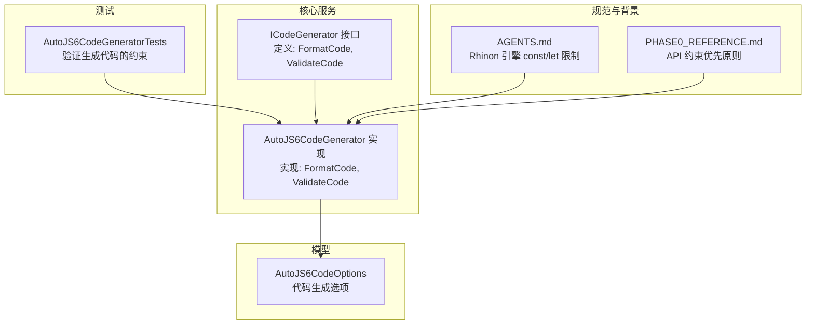
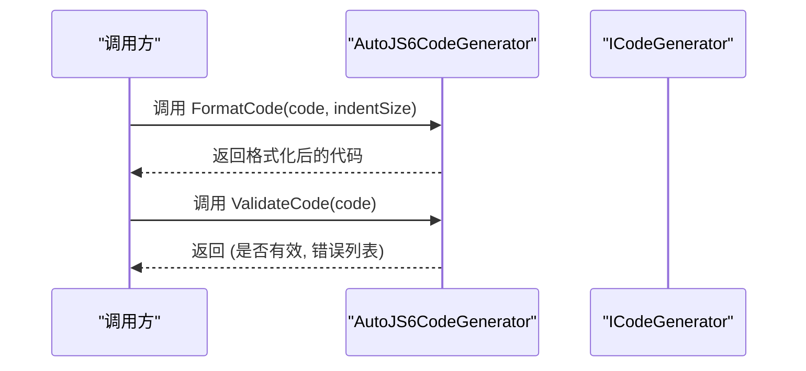
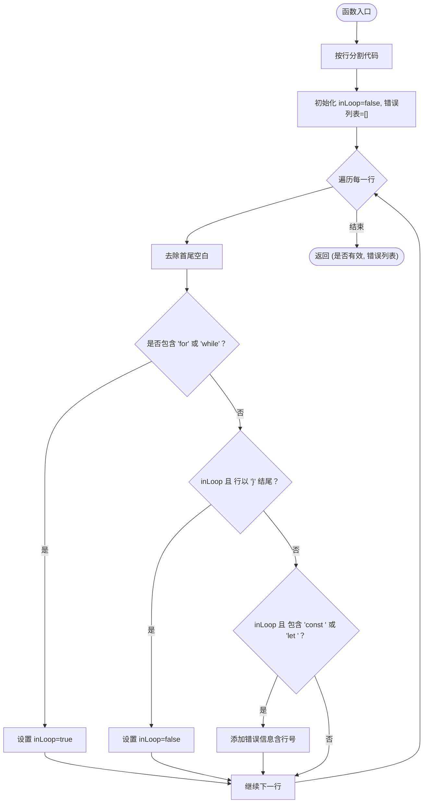
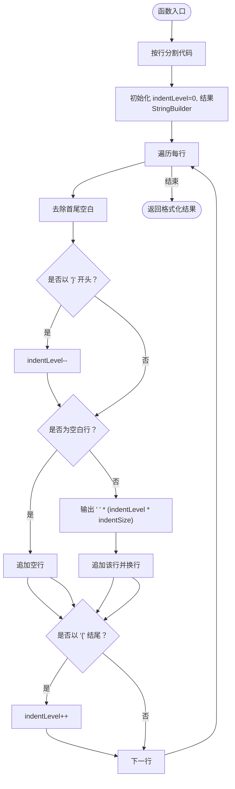
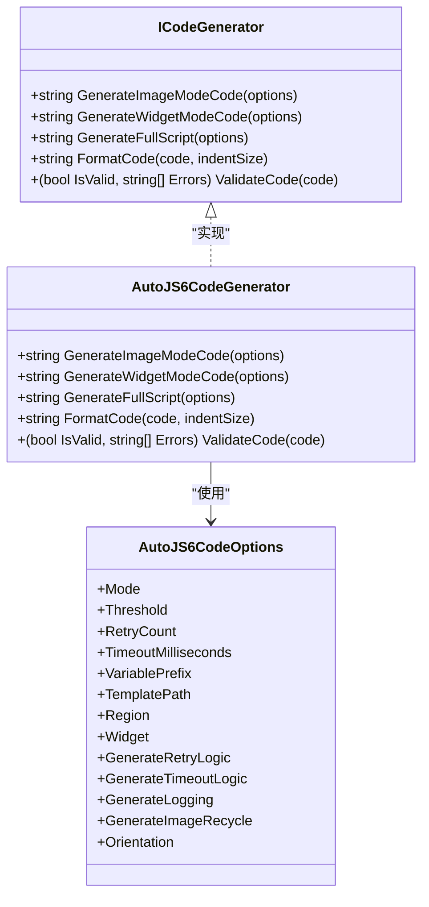
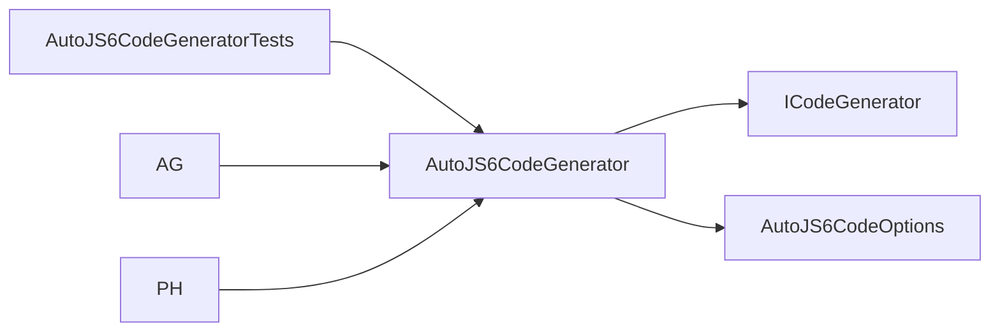

# 代码验证与格式化

<cite>
**本文档引用的文件**
- [AutoJS6CodeGenerator.cs](file://Core/Services/AutoJS6CodeGenerator.cs)
- [ICodeGenerator.cs](file://Core/Abstractions/ICodeGenerator.cs)
- [AutoJS6CodeOptions.cs](file://Core/Models/AutoJS6CodeOptions.cs)
- [AutoJS6CodeGeneratorTests.cs](file://Core.Tests/AutoJS6CodeGeneratorTests.cs)
- [AGENTS.md](file://AGENTS.md)
- [PHASE0_REFERENCE.md](file://openspec/changes/winui3-visual-dev-toolkit/PHASE0_REFERENCE.md)
</cite>

## 目录
1. [简介](#简介)
2. [项目结构](#项目结构)
3. [核心组件](#核心组件)
4. [架构总览](#架构总览)
5. [详细组件分析](#详细组件分析)
6. [依赖关系分析](#依赖关系分析)
7. [性能考量](#性能考量)
8. [故障排除指南](#故障排除指南)
9. [结论](#结论)
10. [附录](#附录)

## 简介
本文件聚焦于代码验证与格式化功能，围绕以下两个核心方法展开：
- ValidateCode 方法：基于 Rhino 引擎约束的语法验证，重点检查循环体内是否使用 const/let 等现代 ES6 语法，以及 JavaScript 语法层面的简单检查。
- FormatCode 方法：对 JavaScript 代码进行基础格式化，包括缩进控制、代码块识别与匹配、空白行处理等。

文档同时解释验证规则的设计原理（为何在循环体内禁止 const/let），并给出格式化算法的工作流程与优化建议。最后提供使用示例，帮助开发者在实际项目中提升代码质量与可读性。

## 项目结构
与验证和格式化功能直接相关的文件组织如下：
- 接口定义：Core/Abstractions/ICodeGenerator.cs
- 实现类：Core/Services/AutoJS6CodeGenerator.cs
- 代码生成选项模型：Core/Models/AutoJS6CodeOptions.cs
- 测试用例：Core.Tests/AutoJS6CodeGeneratorTests.cs
- 约束与背景知识：AGENTS.md、openspec/.../PHASE0_REFERENCE.md

图表来源
- [ICodeGenerator.cs:1-46](file://Core/Abstractions/ICodeGenerator.cs#L1-L46)
- [AutoJS6CodeGenerator.cs:11-357](file://Core/Services/AutoJS6CodeGenerator.cs#L11-L357)
- [AutoJS6CodeOptions.cs:1-89](file://Core/Models/AutoJS6CodeOptions.cs#L1-L89)
- [AutoJS6CodeGeneratorTests.cs:1-80](file://Core.Tests/AutoJS6CodeGeneratorTests.cs#L1-L80)
- [AGENTS.md:152-171](file://AGENTS.md#L152-L171)
- [PHASE0_REFERENCE.md:60-70](file://openspec/changes/winui3-visual-dev-toolkit/PHASE0_REFERENCE.md#L60-L70)

章节来源
- [ICodeGenerator.cs:1-46](file://Core/Abstractions/ICodeGenerator.cs#L1-L46)
- [AutoJS6CodeGenerator.cs:11-357](file://Core/Services/AutoJS6CodeGenerator.cs#L11-L357)
- [AutoJS6CodeOptions.cs:1-89](file://Core/Models/AutoJS6CodeOptions.cs#L1-L89)
- [AutoJS6CodeGeneratorTests.cs:1-80](file://Core.Tests/AutoJS6CodeGeneratorTests.cs#L1-L80)
- [AGENTS.md:152-171](file://AGENTS.md#L152-L171)
- [PHASE0_REFERENCE.md:60-70](file://openspec/changes/winui3-visual-dev-toolkit/PHASE0_REFERENCE.md#L60-L70)

## 核心组件
- ICodeGenerator 接口：定义了代码生成器的统一契约，包括生成图像/控件模式代码、生成完整脚本、格式化代码、验证代码等能力。
- AutoJS6CodeGenerator：具体实现，提供 FormatCode 与 ValidateCode 的逻辑。
- AutoJS6CodeOptions：代码生成的配置项，影响生成的代码内容与风格。
- AutoJS6CodeGeneratorTests：验证生成代码是否满足约束（如不包含 const/let）。

章节来源
- [ICodeGenerator.cs:8-45](file://Core/Abstractions/ICodeGenerator.cs#L8-L45)
- [AutoJS6CodeGenerator.cs:11-357](file://Core/Services/AutoJS6CodeGenerator.cs#L11-L357)
- [AutoJS6CodeOptions.cs:6-89](file://Core/Models/AutoJS6CodeOptions.cs#L6-L89)
- [AutoJS6CodeGeneratorTests.cs:10-79](file://Core.Tests/AutoJS6CodeGeneratorTests.cs#L10-L79)

## 架构总览
验证与格式化功能在系统中的位置如下：

图表来源
- [ICodeGenerator.cs:31-44](file://Core/Abstractions/ICodeGenerator.cs#L31-L44)
- [AutoJS6CodeGenerator.cs:191-258](file://Core/Services/AutoJS6CodeGenerator.cs#L191-L258)

## 详细组件分析

### ValidateCode 方法：语法验证机制
ValidateCode 的职责是根据 AutoJS6 的技术约束（尤其是 Rhino 引擎对 const/let 的限制）对代码进行静态检查。其核心逻辑如下：
- 将代码按行分割，逐行扫描。
- 维护一个布尔标志 inLoop，用于跟踪当前是否处于循环体内（for/while 开始，遇到 } 结束）。
- 在循环体内，若检测到 const 或 let 关键字，则记录一条错误信息，包含行号与提示。
- 返回元组：(是否有效, 错误列表)。

图表来源
- [AutoJS6CodeGenerator.cs:226-258](file://Core/Services/AutoJS6CodeGenerator.cs#L226-L258)

章节来源
- [AutoJS6CodeGenerator.cs:226-258](file://Core/Services/AutoJS6CodeGenerator.cs#L226-L258)
- [AGENTS.md:156-171](file://AGENTS.md#L156-L171)
- [PHASE0_REFERENCE.md:60-69](file://openspec/changes/winui3-visual-dev-toolkit/PHASE0_REFERENCE.md#L60-L69)

#### 设计原理与约束说明
- Rhino 引擎对 const/let 的支持不完整，尤其在循环体内使用时可能导致变量状态异常（如变量值在多次迭代间未正确重置）。因此，AutoJS6 强制要求循环体内使用 var。
- 函数顶层与模块顶层允许使用 const/let；仅循环体内禁止。
- 该约束属于 API 技术边界，必须优先遵守，业务逻辑需要适配。

章节来源
- [AGENTS.md:156-171](file://AGENTS.md#L156-L171)
- [PHASE0_REFERENCE.md:60-69](file://openspec/changes/winui3-visual-dev-toolkit/PHASE0_REFERENCE.md#L60-L69)

### FormatCode 方法：代码格式化实现
FormatCode 提供基础的 JavaScript 代码格式化能力，核心思路如下：
- 将代码按行拆分，维护一个缩进层级 indentLevel。
- 遍历每一行：
  - 若行以 } 开头，表示即将退出一个代码块，先减少缩进层级。
  - 若该行非空白，先输出缩进（indentLevel * indentSize 个空格），再输出该行，最后换行。
  - 若该行为空白行，直接输出空行。
  - 若该行以 { 结尾，表示进入一个新的代码块，随后增加缩进层级。
- 返回格式化后的字符串。

图表来源
- [AutoJS6CodeGenerator.cs:191-224](file://Core/Services/AutoJS6CodeGenerator.cs#L191-L224)

章节来源
- [AutoJS6CodeGenerator.cs:191-224](file://Core/Services/AutoJS6CodeGenerator.cs#L191-L224)

#### 缩进层级计算与代码块匹配
- 通过检测 { 与 } 的出现位置来判断代码块的进入与退出，从而精确控制缩进层级。
- 对于嵌套代码块，缩进层级会相应增加/减少，保证多层嵌套也能正确对齐。
- 空白行会被保留，有助于提升可读性。

章节来源
- [AutoJS6CodeGenerator.cs:198-221](file://Core/Services/AutoJS6CodeGenerator.cs#L198-L221)

#### 格式化规则与扩展建议
- 当前行的缩进由当前 indentLevel 与 indentSize 决定，indentSize 默认为 4。
- 该实现为线性扫描，时间复杂度 O(n)，空间复杂度 O(n)（n 为字符数）。
- 可扩展方向：
  - 支持注释与字符串内的 { } 识别，避免误判。
  - 支持多语言（如 JSX/TSX）的更复杂语法树解析。
  - 支持自定义规则（如最大行长、语句分隔符对齐等）。

章节来源
- [AutoJS6CodeGenerator.cs:191-224](file://Core/Services/AutoJS6CodeGenerator.cs#L191-L224)

### 类关系与接口契约

图表来源
- [ICodeGenerator.cs:8-45](file://Core/Abstractions/ICodeGenerator.cs#L8-L45)
- [AutoJS6CodeGenerator.cs:11-357](file://Core/Services/AutoJS6CodeGenerator.cs#L11-L357)
- [AutoJS6CodeOptions.cs:6-89](file://Core/Models/AutoJS6CodeOptions.cs#L6-L89)

章节来源
- [ICodeGenerator.cs:8-45](file://Core/Abstractions/ICodeGenerator.cs#L8-L45)
- [AutoJS6CodeGenerator.cs:11-357](file://Core/Services/AutoJS6CodeGenerator.cs#L11-L357)
- [AutoJS6CodeOptions.cs:6-89](file://Core/Models/AutoJS6CodeOptions.cs#L6-L89)

## 依赖关系分析
- AutoJS6CodeGenerator 依赖 ICodeGenerator 接口，确保上层调用者不直接耦合具体实现。
- AutoJS6CodeGenerator 使用 AutoJS6CodeOptions 来决定生成逻辑与变量命名等。
- 测试用例通过断言生成代码不包含 const/let，间接验证 ValidateCode 的约束生效。

图表来源
- [AutoJS6CodeGeneratorTests.cs:10-79](file://Core.Tests/AutoJS6CodeGeneratorTests.cs#L10-L79)
- [AutoJS6CodeGenerator.cs:11-357](file://Core/Services/AutoJS6CodeGenerator.cs#L11-L357)
- [ICodeGenerator.cs:8-45](file://Core/Abstractions/ICodeGenerator.cs#L8-L45)
- [AutoJS6CodeOptions.cs:6-89](file://Core/Models/AutoJS6CodeOptions.cs#L6-L89)
- [AGENTS.md:156-171](file://AGENTS.md#L156-L171)
- [PHASE0_REFERENCE.md:60-69](file://openspec/changes/winui3-visual-dev-toolkit/PHASE0_REFERENCE.md#L60-L69)

章节来源
- [AutoJS6CodeGeneratorTests.cs:10-79](file://Core.Tests/AutoJS6CodeGeneratorTests.cs#L10-L79)
- [AutoJS6CodeGenerator.cs:11-357](file://Core/Services/AutoJS6CodeGenerator.cs#L11-L357)
- [ICodeGenerator.cs:8-45](file://Core/Abstractions/ICodeGenerator.cs#L8-L45)
- [AutoJS6CodeOptions.cs:6-89](file://Core/Models/AutoJS6CodeOptions.cs#L6-L89)
- [AGENTS.md:156-171](file://AGENTS.md#L156-L171)
- [PHASE0_REFERENCE.md:60-69](file://openspec/changes/winui3-visual-dev-toolkit/PHASE0_REFERENCE.md#L60-L69)

## 性能考量
- 时间复杂度：FormatCode 与 ValidateCode 均为 O(n) 线性扫描，适合处理中等规模的 JavaScript 代码。
- 空间复杂度：两者均使用 StringBuilder 与行数组，整体 O(n)。
- 优化建议：
  - 对于大型脚本，可考虑分段处理或并行化（需谨慎处理跨段上下文）。
  - ValidateCode 可引入正则表达式以减少字符串包含判断的开销，但要注意正则编译成本与可读性平衡。
  - FormatCode 可加入缓存机制（如上次缩进层级与最近几行的 { } 情况），减少重复计算。

## 故障排除指南
- 验证失败（循环体内使用 const/let）：
  - 现象：ValidateCode 返回错误列表，包含具体行号与提示。
  - 处理：将 const/let 替换为 var，或将变量声明移出循环体。
  - 参考：[AGENTS.md:156-171](file://AGENTS.md#L156-L171)
- 格式化结果不符合预期：
  - 现象：缩进层级不正确或空行缺失。
  - 排查：确认代码中 { } 的配对是否正确；检查是否存在未转义的字符串或注释导致误判。
  - 建议：在调用 FormatCode 前先进行基本的语法检查（如 ValidateCode）。
- 生成的代码不符合约束：
  - 现象：测试断言失败，生成代码包含 const/let。
  - 处理：在生成阶段强制使用 var；确保生成逻辑不引入现代 ES6 语法。
  - 参考：[AutoJS6CodeGeneratorTests.cs:33-39](file://Core.Tests/AutoJS6CodeGeneratorTests.cs#L33-L39)

章节来源
- [AGENTS.md:156-171](file://AGENTS.md#L156-L171)
- [AutoJS6CodeGeneratorTests.cs:33-39](file://Core.Tests/AutoJS6CodeGeneratorTests.cs#L33-L39)

## 结论
- ValidateCode 严格遵循 AutoJS6 的技术约束，确保在 Rhino 引擎环境下代码的正确性与稳定性。
- FormatCode 提供简洁高效的缩进控制与代码块匹配，满足日常格式化需求。
- 在实际开发中，建议在生成代码后立即调用 ValidateCode 进行约束检查，并使用 FormatCode 进行格式化，以提升代码质量与可读性。

## 附录

### 使用示例（概念性说明）
- 验证代码：
  - 输入：一段可能包含循环体内 const/let 的 JavaScript 代码。
  - 调用：调用 ValidateCode(code)。
  - 输出：(是否有效, 错误列表)。若包含错误，逐条修复后再重新验证。
- 格式化代码：
  - 输入：任意 JavaScript 代码。
  - 调用：调用 FormatCode(code, indentSize)。
  - 输出：格式化后的代码字符串，缩进层级与代码块匹配正确。
- 在生成流程中集成：
  - 生成完整脚本后，先 ValidateCode，再 FormatCode，最后输出给用户或写入文件。

章节来源
- [ICodeGenerator.cs:31-44](file://Core/Abstractions/ICodeGenerator.cs#L31-L44)
- [AutoJS6CodeGenerator.cs:191-258](file://Core/Services/AutoJS6CodeGenerator.cs#L191-L258)
- [AutoJS6CodeGeneratorTests.cs:33-39](file://Core.Tests/AutoJS6CodeGeneratorTests.cs#L33-L39)