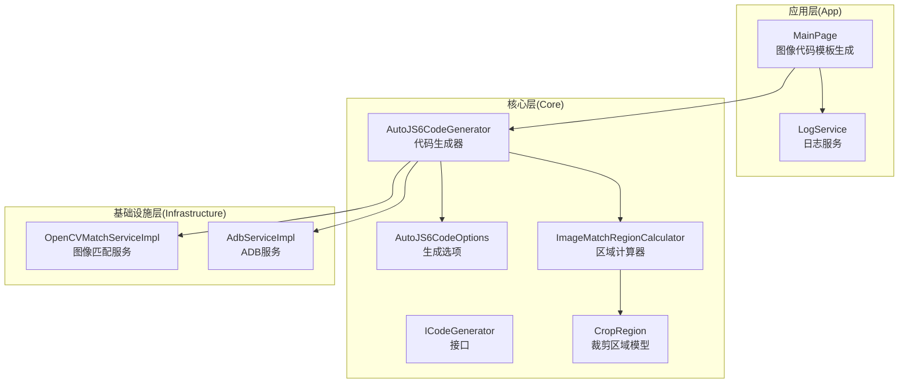
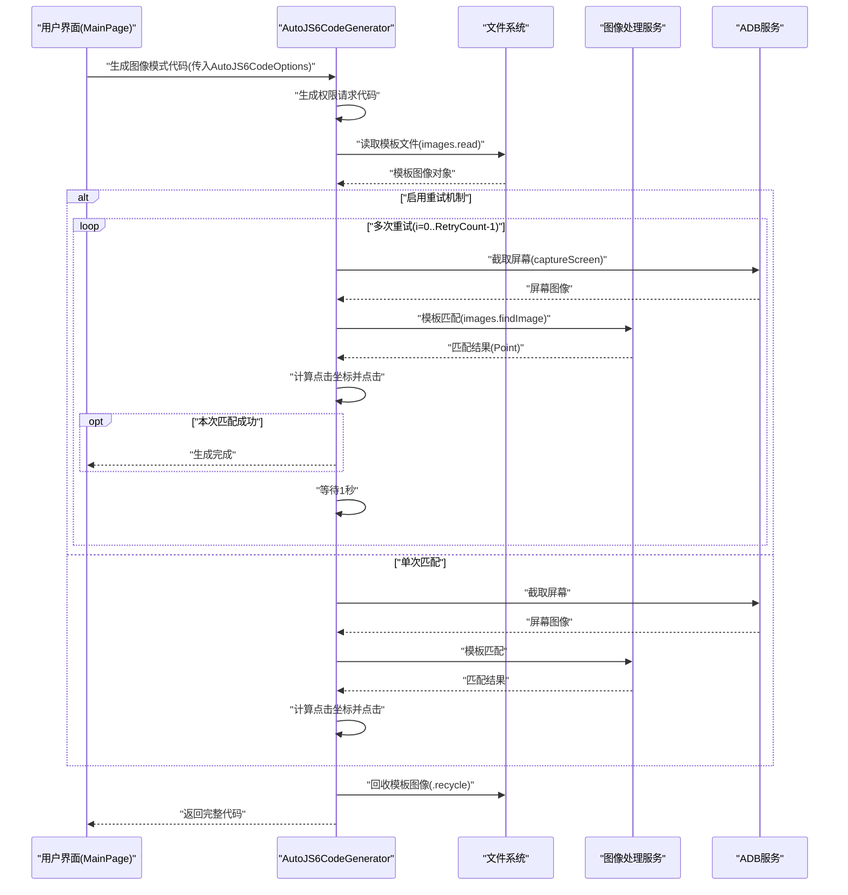
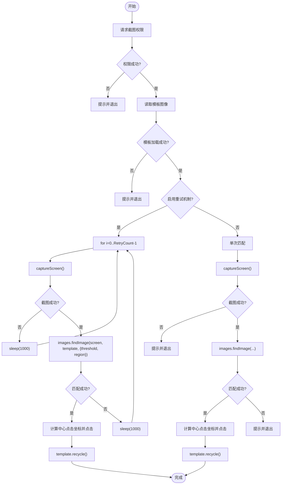
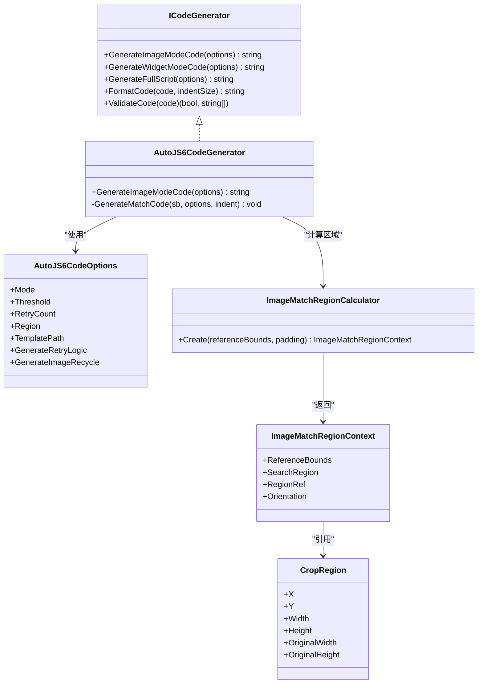

# 图像模式代码生成

<cite>
**本文档引用的文件**
- [AutoJS6CodeGenerator.cs](file://Core/Services/AutoJS6CodeGenerator.cs)
- [ICodeGenerator.cs](file://Core/Abstractions/ICodeGenerator.cs)
- [AutoJS6CodeOptions.cs](file://Core/Models/AutoJS6CodeOptions.cs)
- [ImageMatchRegionCalculator.cs](file://Core/Helpers/ImageMatchRegionCalculator.cs)
- [CropRegion.cs](file://Core/Models/CropRegion.cs)
- [MainPage.ImageCodeTemplates.NativeMatchTemplate.cs](file://App/Views/MainPage.ImageCodeTemplates.NativeMatchTemplate.cs)
- [MainPage.ImageCodeTemplates.Shared.cs](file://App/Views/MainPage.ImageCodeTemplates.Shared.cs)
- [MainPage.ImageCodeTemplates.cs](file://App/Views/MainPage.ImageCodeTemplates.cs)
- [autojs6-image-match-helper.js](file://App/CodeTemplates/image/autojs6-image-match-helper.js)
- [PHASE0_REFERENCE.md](file://openspec/changes/winui3-visual-dev-toolkit/PHASE0_REFERENCE.md)
- [spec.md](file://openspec/changes/winui3-visual-dev-toolkit/specs/autojs6-code-generator/spec.md)
- [LogService.cs](file://App/Services/LogService.cs)
</cite>

## 目录
1. [简介](#简介)
2. [项目结构](#项目结构)
3. [核心组件](#核心组件)
4. [架构总览](#架构总览)
5. [详细组件分析](#详细组件分析)
6. [依赖关系分析](#依赖关系分析)
7. [性能考量](#性能考量)
8. [故障排查指南](#故障排查指南)
9. [结论](#结论)
10. [附录](#附录)

## 简介
本文件面向图像模式代码生成功能，围绕 GenerateImageModeCode 方法展开，系统性阐述其在截图权限请求、模板图像加载、重试机制、模板回收等关键步骤上的实现逻辑，并深入解析图像匹配代码的生成过程（images.findImage 调用、阈值设置、区域裁剪、坐标计算）。同时对比单次匹配与重试匹配两种模式在循环控制、错误处理与性能优化方面的差异，提供多种配置场景下的完整代码生成示例路径，帮助开发者快速生成稳定可靠的 AutoJS6 图像识别脚本。

## 项目结构
该功能涉及三层架构中的核心层与应用层协作：
- 核心层（Core）：负责代码生成的核心逻辑与模型定义，包括 ICodeGenerator 接口、AutoJS6CodeGenerator 实现、AutoJS6CodeOptions 配置模型、ImageMatchRegionCalculator 区域计算器等。
- 应用层（App）：负责 UI 交互与模板生成，包括 MainPage 中的图像代码模板生成逻辑、共享辅助方法以及模板资源加载。
- 基础设施层（Infrastructure）：提供图像处理与 ADB 通信能力，支撑截图与模板匹配。

**图表来源**
- [AutoJS6CodeGenerator.cs:11-102](file://Core/Services/AutoJS6CodeGenerator.cs#L11-L102)
- [ICodeGenerator.cs:8-45](file://Core/Abstractions/ICodeGenerator.cs#L8-L45)
- [AutoJS6CodeOptions.cs:6-72](file://Core/Models/AutoJS6CodeOptions.cs#L6-L72)
- [ImageMatchRegionCalculator.cs:35-97](file://Core/Helpers/ImageMatchRegionCalculator.cs#L35-L97)
- [MainPage.ImageCodeTemplates.cs:200-240](file://App/Views/MainPage.ImageCodeTemplates.cs#L200-L240)

**章节来源**
- [AutoJS6CodeGenerator.cs:1-102](file://Core/Services/AutoJS6CodeGenerator.cs#L1-L102)
- [MainPage.ImageCodeTemplates.cs:1-255](file://App/Views/MainPage.ImageCodeTemplates.cs#L1-L255)

## 核心组件
- ICodeGenerator 接口：定义图像模式与控件模式的代码生成方法，以及脚本格式化与校验能力。
- AutoJS6CodeGenerator：实现 ICodeGenerator，提供 GenerateImageModeCode 的具体逻辑，涵盖权限请求、模板加载、匹配代码生成、重试与回收等。
- AutoJS6CodeOptions：承载生成选项，包括阈值、重试次数、区域、模板路径、变量前缀、是否生成重试/超时/日志/回收等标志位。
- ImageMatchRegionCalculator：根据参考区域与填充边距生成搜索区域上下文，支持横竖屏方向与 regionRef 的归一化映射。
- CropRegion：描述裁剪区域的几何信息，包含原始宽高与参考分辨率字段，用于坐标转换与区域映射。
- MainPage 图像模板生成：提供多种模板风格（封装版、图像匹配、特征匹配），并负责模板路径与区域文本的规范化。

**章节来源**
- [ICodeGenerator.cs:8-45](file://Core/Abstractions/ICodeGenerator.cs#L8-L45)
- [AutoJS6CodeGenerator.cs:11-102](file://Core/Services/AutoJS6CodeGenerator.cs#L11-L102)
- [AutoJS6CodeOptions.cs:6-72](file://Core/Models/AutoJS6CodeOptions.cs#L6-L72)
- [ImageMatchRegionCalculator.cs:35-97](file://Core/Helpers/ImageMatchRegionCalculator.cs#L35-L97)
- [CropRegion.cs:6-52](file://Core/Models/CropRegion.cs#L6-L52)
- [MainPage.ImageCodeTemplates.NativeMatchTemplate.cs:7-32](file://App/Views/MainPage.ImageCodeTemplates.NativeMatchTemplate.cs#L7-L32)
- [MainPage.ImageCodeTemplates.Shared.cs:16-84](file://App/Views/MainPage.ImageCodeTemplates.Shared.cs#L16-L84)

## 架构总览
图像模式代码生成的端到端流程如下：

**图表来源**
- [AutoJS6CodeGenerator.cs:13-102](file://Core/Services/AutoJS6CodeGenerator.cs#L13-L102)
- [PHASE0_REFERENCE.md:29-79](file://openspec/changes/winui3-visual-dev-toolkit/PHASE0_REFERENCE.md#L29-L79)

## 详细组件分析

### GenerateImageModeCode 方法实现详解
该方法是图像模式代码生成的核心，遵循 PHASE0_REFERENCE.md 的 API 约束，严格控制 Rhino 引擎限制与内存回收要求。

- 截图权限请求
  - 通过 requestScreenCapture() 申请截图权限，首次调用会弹出系统权限提示，成功后方可进行截图。
  - 若权限申请失败，脚本会弹出提示并退出，避免后续空指针或异常。

- 模板图像加载
  - 使用 images.read() 读取模板文件，若加载失败则提示并退出。
  - 模板路径支持 assets 相对路径与绝对路径，生成时会进行规范化处理。

- 匹配代码生成（images.findImage）
  - 支持阈值参数 threshold，范围通常在 0.50-0.95，推荐默认 0.80。
  - 支持区域裁剪 region: [x, y, w, h]，通过 ImageMatchRegionCalculator 计算安全边界与归一化 regionRef。
  - 匹配成功后计算点击坐标：点击中心点 clickX = result.x + template.width / 2；clickY = result.y + template.height / 2。

- 重试机制
  - 当 GenerateRetryLogic 为 true 时，生成 for 循环重试，循环次数为 RetryCount，每次间隔 sleep(1000)。
  - 每次迭代先 captureScreen() 获取最新屏幕快照，若截图失败则跳过本次并继续等待。
  - 一旦某次匹配成功，立即设置 Found 标志并 break，避免多余轮次。

- 模板回收
  - 生成完成后调用 template.recycle() 回收模板图像，防止内存泄漏。
  - 该步骤受 GenerateImageRecycle 标志控制，确保在需要时执行。

- 单次匹配分支
  - 当 GenerateRetryLogic 为 false 时，直接 captureScreen() 一次，执行一次匹配，匹配失败则提示并退出。

- 错误处理与健壮性
  - 对模板加载失败、截图失败、未找到目标等情况分别给出明确提示并退出。
  - 严格遵守 Rhino 引擎约束：循环体内使用 var，避免 const/let。

**图表来源**
- [AutoJS6CodeGenerator.cs:13-102](file://Core/Services/AutoJS6CodeGenerator.cs#L13-L102)
- [PHASE0_REFERENCE.md:29-79](file://openspec/changes/winui3-visual-dev-toolkit/PHASE0_REFERENCE.md#L29-L79)

**章节来源**
- [AutoJS6CodeGenerator.cs:13-102](file://Core/Services/AutoJS6CodeGenerator.cs#L13-L102)
- [PHASE0_REFERENCE.md:29-79](file://openspec/changes/winui3-visual-dev-toolkit/PHASE0_REFERENCE.md#L29-L79)

### 图像匹配代码生成细节
- images.findImage 调用
  - 必填参数：screen、template。
  - 可选参数：threshold（阈值）、region（区域数组）。
  - 返回 Point 对象，包含 x、y 坐标，未找到返回 null。

- 阈值设置
  - AutoJS6 默认阈值为 0.9，但实际项目中常用 0.80-0.85。
  - 生成代码中使用固定两位小数格式化，确保可读性与一致性。

- 区域裁剪
  - 通过 ImageMatchRegionCalculator.Create(referenceBounds, padding) 计算安全搜索区域。
  - 支持横竖屏方向归一化，生成 regionRef 用于跨设备适配。

- 坐标计算
  - 点击坐标为中心点：clickX = result.x + template.width / 2；clickY = result.y + template.height / 2。
  - 严格遵循左上角原点的坐标系，与 AutoJS6 文档一致。

- 代码生成策略
  - 单次匹配：直接 captureScreen() 并执行一次匹配。
  - 重试匹配：for 循环 + sleep(1000)，截图失败时跳过本轮。
  - 区域匹配：当 options.Region 非空时，注入 region 参数；否则使用全屏匹配。

**章节来源**
- [AutoJS6CodeGenerator.cs:260-288](file://Core/Services/AutoJS6CodeGenerator.cs#L260-L288)
- [ImageMatchRegionCalculator.cs:40-97](file://Core/Helpers/ImageMatchRegionCalculator.cs#L40-L97)
- [PHASE0_REFERENCE.md:61-79](file://openspec/changes/winui3-visual-dev-toolkit/PHASE0_REFERENCE.md#L61-L79)

### 单次匹配 vs 重试匹配
- 单次匹配
  - 优点：逻辑简单、执行速度快、内存占用低。
  - 适用场景：稳定性高、模板清晰、设备分辨率一致的环境。
  - 缺点：对动态变化（如动画、遮挡）敏感，成功率较低。

- 重试匹配
  - 优点：提高成功率，容忍短暂的不稳定因素。
  - 适用场景：界面存在动画、网络波动、多分辨率设备。
  - 循环控制：i=0..RetryCount-1，每轮 sleep(1000)。
  - 错误处理：截图失败时跳过本轮，避免阻塞；匹配成功后立即 break。
  - 性能优化：只在必要时进行截图与匹配，减少 CPU/GPU 开销。

**章节来源**
- [AutoJS6CodeGenerator.cs:38-99](file://Core/Services/AutoJS6CodeGenerator.cs#L38-L99)
- [PHASE0_REFERENCE.md:46-57](file://openspec/changes/winui3-visual-dev-toolkit/PHASE0_REFERENCE.md#L46-L57)

### 代码生成示例（路径指引）
以下为不同配置场景下的代码生成示例路径，便于开发者快速定位与复制使用：

- 基本匹配（无区域限制，阈值默认 0.80）
  - 生成入口：[GenerateImageModeCode:13-102](file://Core/Services/AutoJS6CodeGenerator.cs#L13-L102)
  - 匹配代码生成：[GenerateMatchCode:260-288](file://Core/Services/AutoJS6CodeGenerator.cs#L260-L288)
  - 选项模型：[AutoJS6CodeOptions:6-72](file://Core/Models/AutoJS6CodeOptions.cs#L6-L72)

- 区域匹配（带 region 参数）
  - 区域计算器：[ImageMatchRegionCalculator.Create:40-97](file://Core/Helpers/ImageMatchRegionCalculator.cs#L40-L97)
  - 生成逻辑：[GenerateMatchCode 注入 region:264-277](file://Core/Services/AutoJS6CodeGenerator.cs#L264-L277)

- 带重试的匹配（循环 + sleep）
  - 重试循环：[GenerateImageModeCode 重试分支:38-69](file://Core/Services/AutoJS6CodeGenerator.cs#L38-L69)
  - 截图与匹配：[GenerateMatchCode:260-288](file://Core/Services/AutoJS6CodeGenerator.cs#L260-L288)

- 封装版模板（引用 helper 文件）
  - 模板生成：[GenerateNativeMatchTemplateCode:7-32](file://App/Views/MainPage.ImageCodeTemplates.NativeMatchTemplate.cs#L7-L32)
  - 辅助方法：[Shared 工具:16-84](file://App/Views/MainPage.ImageCodeTemplates.Shared.cs#L16-L84)
  - 模板清单：[GenerateImageModeCodePreviewItems:200-240](file://App/Views/MainPage.ImageCodeTemplates.cs#L200-L240)

- 特征匹配（fallback）
  - Helper 函数：[matchReferenceTemplate:18-160](file://App/CodeTemplates/image/autojs6-image-match-helper.js#L18-L160)
  - 特征检测与匹配：[runMatchFeaturesFallback:333-395](file://App/CodeTemplates/image/autojs6-image-match-helper.js#L333-L395)

**章节来源**
- [AutoJS6CodeGenerator.cs:13-102](file://Core/Services/AutoJS6CodeGenerator.cs#L13-L102)
- [ImageMatchRegionCalculator.cs:40-97](file://Core/Helpers/ImageMatchRegionCalculator.cs#L40-L97)
- [MainPage.ImageCodeTemplates.NativeMatchTemplate.cs:7-32](file://App/Views/MainPage.ImageCodeTemplates.NativeMatchTemplate.cs#L7-L32)
- [MainPage.ImageCodeTemplates.Shared.cs:16-84](file://App/Views/MainPage.ImageCodeTemplates.Shared.cs#L16-L84)
- [MainPage.ImageCodeTemplates.cs:200-240](file://App/Views/MainPage.ImageCodeTemplates.cs#L200-L240)
- [autojs6-image-match-helper.js:18-160](file://App/CodeTemplates/image/autojs6-image-match-helper.js#L18-L160)

## 依赖关系分析
- 组件耦合
  - AutoJS6CodeGenerator 依赖 AutoJS6CodeOptions 与 ImageMatchRegionCalculator，保持高内聚、低耦合。
  - MainPage 通过模板生成方法与 Shared 工具类协作，形成 UI 层与核心层的清晰边界。

- 外部依赖
  - 图像处理：OpenCVMatchServiceImpl（FindImage/MatcTemplate/DetectFeatures/MatchFeatures）。
  - 截图与 ADB：AdbServiceImpl（CaptureScreen/DumpUiHierarchy）。
  - 资源加载：App 层的模板资源加载与路径规范化。

**图表来源**
- [ICodeGenerator.cs:8-45](file://Core/Abstractions/ICodeGenerator.cs#L8-L45)
- [AutoJS6CodeGenerator.cs:11-102](file://Core/Services/AutoJS6CodeGenerator.cs#L11-L102)
- [AutoJS6CodeOptions.cs:6-72](file://Core/Models/AutoJS6CodeOptions.cs#L6-L72)
- [ImageMatchRegionCalculator.cs:35-97](file://Core/Helpers/ImageMatchRegionCalculator.cs#L35-L97)

**章节来源**
- [ICodeGenerator.cs:8-45](file://Core/Abstractions/ICodeGenerator.cs#L8-L45)
- [AutoJS6CodeGenerator.cs:11-102](file://Core/Services/AutoJS6CodeGenerator.cs#L11-L102)
- [AutoJS6CodeOptions.cs:6-72](file://Core/Models/AutoJS6CodeOptions.cs#L6-L72)
- [ImageMatchRegionCalculator.cs:35-97](file://Core/Helpers/ImageMatchRegionCalculator.cs#L35-L97)

## 性能考量
- 截图成本
  - captureScreen() 为轻量级操作，但频繁截图会增加 CPU/GPU 压力。重试匹配应控制轮数与间隔。
- 匹配范围
  - 使用 region 参数缩小搜索范围，显著降低匹配耗时与误检概率。
- 阈值选择
  - 阈值过高导致漏检，过低导致误检。建议在 0.80-0.85 之间调试，结合实际场景微调。
- 内存管理
  - 模板图像需及时回收，避免 OOM。Helper 中提供了安全回收函数 safeRecycleImage/safeRecycleFeatures。
- 设备适配
  - 使用 regionRef 与方向归一化，确保跨设备稳定性。

**章节来源**
- [PHASE0_REFERENCE.md:370-401](file://openspec/changes/winui3-visual-dev-toolkit/PHASE0_REFERENCE.md#L370-L401)
- [autojs6-image-match-helper.js:501-523](file://App/CodeTemplates/image/autojs6-image-match-helper.js#L501-L523)

## 故障排查指南
- 截图权限失败
  - 现象：requestScreenCapture() 返回 false。
  - 处理：检查权限弹窗是否被遮挡，重新运行应用；确保在本软件界面运行以避免黑屏。

- 模板图像加载失败
  - 现象：images.read() 返回 null。
  - 处理：确认模板路径正确，检查文件是否存在且可读；使用 assets 相对路径或绝对路径均可。

- 截图失败
  - 现象：captureScreen() 返回空。
  - 处理：等待权限生效（数百毫秒）后再尝试；检查设备状态与 ADB 连接。

- 未找到目标
  - 现象：images.findImage() 返回 null。
  - 处理：降低阈值、扩大区域、检查模板质量；使用实时匹配预览验证参数。

- Rhino 引擎限制
  - 现象：循环体内使用 const/let 报错。
  - 处理：将循环体内的 const/let 改为 var，确保代码通过 ValidateCode 校验。

- 日志与追踪
  - 使用 LogService 订阅日志事件，记录模板路径与输出路径，便于问题定位。

**章节来源**
- [AutoJS6CodeGenerator.cs:23-26](file://Core/Services/AutoJS6CodeGenerator.cs#L23-L26)
- [AutoJS6CodeGenerator.cs:30-35](file://Core/Services/AutoJS6CodeGenerator.cs#L30-L35)
- [AutoJS6CodeGenerator.cs:78-83](file://Core/Services/AutoJS6CodeGenerator.cs#L78-L83)
- [AutoJS6CodeGenerator.cs:226-258](file://Core/Services/AutoJS6CodeGenerator.cs#L226-L258)
- [LogService.cs:32-49](file://App/Services/LogService.cs#L32-L49)

## 结论
GenerateImageModeCode 方法通过严谨的权限请求、模板加载、匹配生成、重试与回收机制，实现了稳定高效的 AutoJS6 图像识别脚本生成。结合区域裁剪与阈值调优，可在多设备环境下获得更高的成功率与更低的误检率。开发者可根据场景选择单次匹配或重试匹配，并利用封装版 helper 模板进一步简化集成与维护。

## 附录
- AutoJS6 API 参考要点
  - 截图与权限：requestScreenCapture()、captureScreen()。
  - 模板匹配：images.findImage()、images.matchTemplate()。
  - 图像处理：images.read()、images.clip()、images.resize()。
  - 特征匹配：images.detectAndComputeFeatures()、images.matchFeatures()。
  - 坐标系统：左上角原点，x 轴向右，y 轴向下。
  - Rhino 引擎约束：循环体内禁止 const/let，必须使用 var。

- 生成规范与约束
  - 生成代码需通过 ValidateCode 校验，确保符合 Rhino 引擎限制。
  - 模板图像需在使用后回收，防止内存泄漏。
  - 重试匹配应控制轮数与间隔，避免过度消耗资源。

**章节来源**
- [PHASE0_REFERENCE.md:9-171](file://openspec/changes/winui3-visual-dev-toolkit/PHASE0_REFERENCE.md#L9-L171)
- [spec.md:1-136](file://openspec/changes/winui3-visual-dev-toolkit/specs/autojs6-code-generator/spec.md#L1-L136)