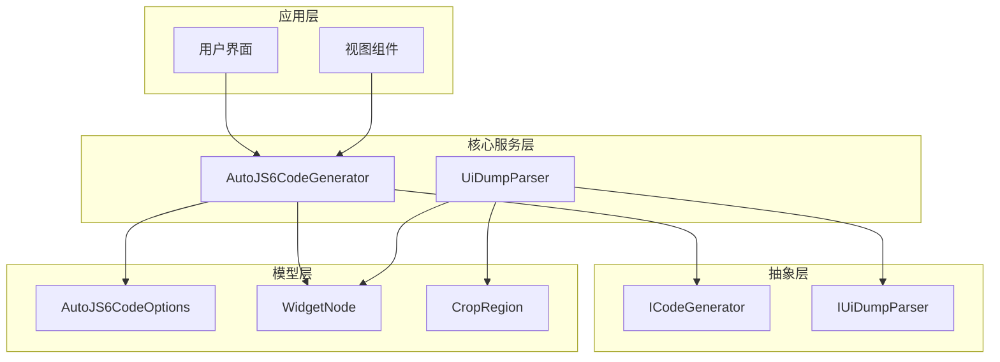
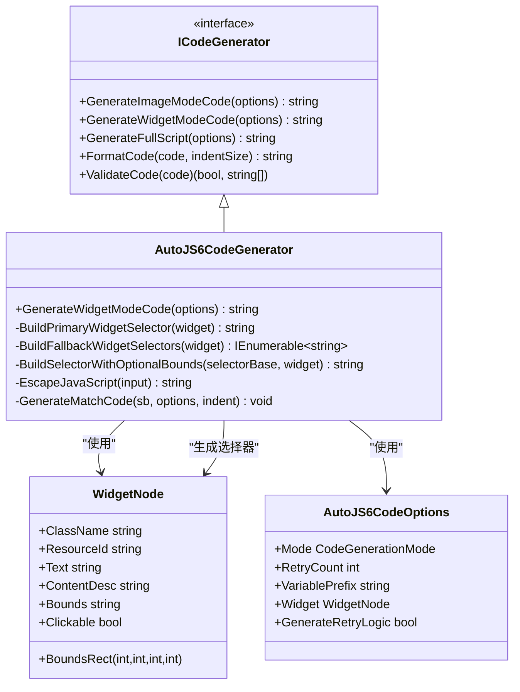
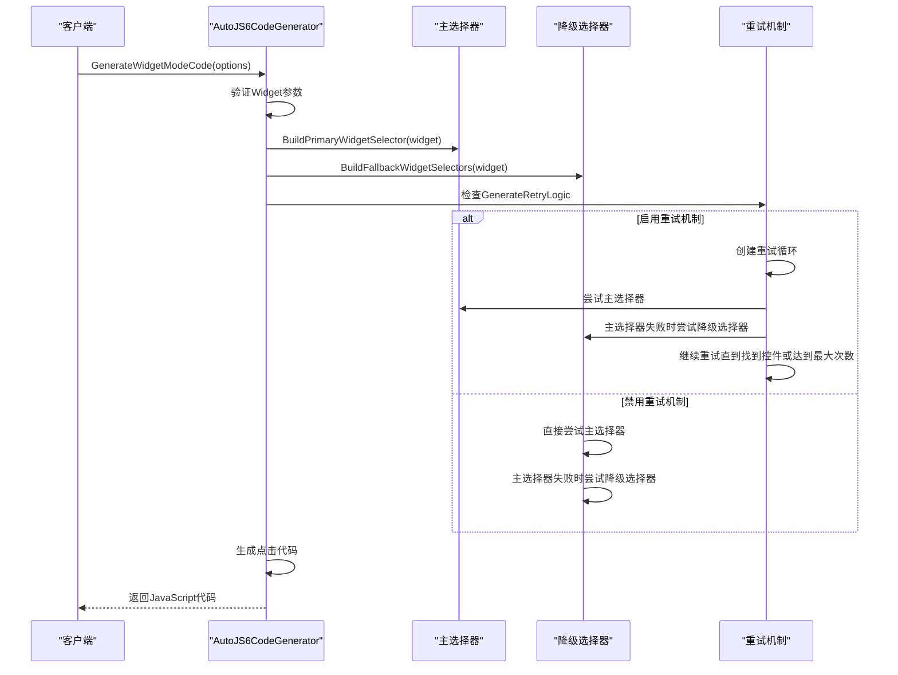
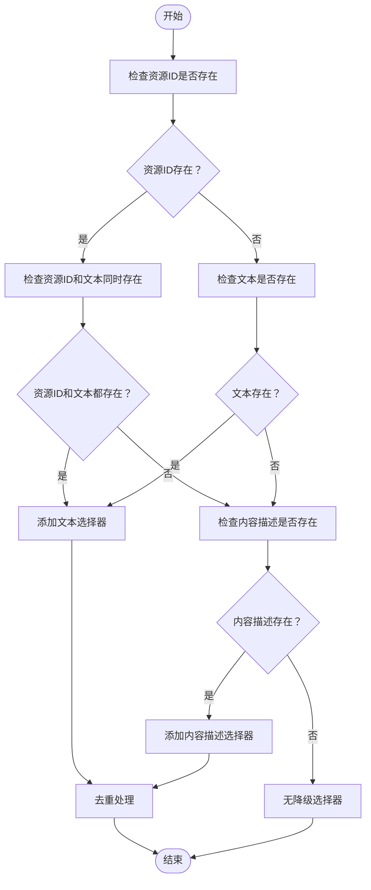
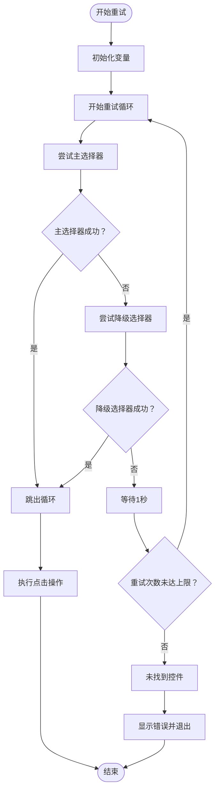
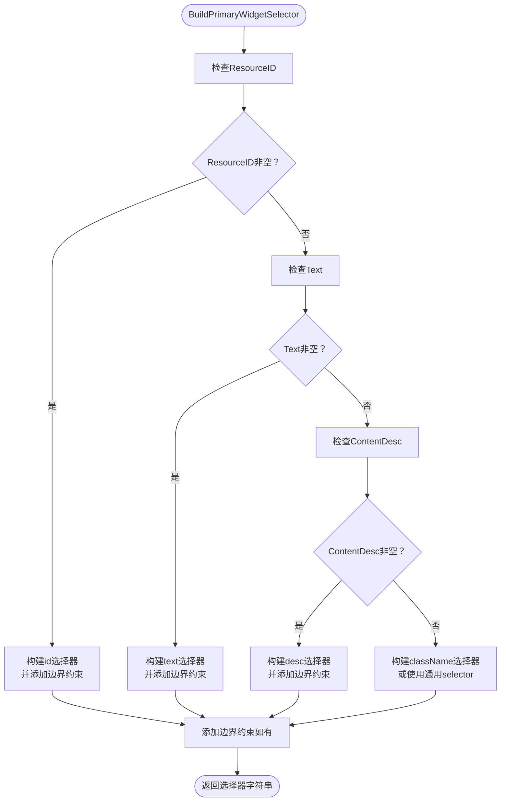
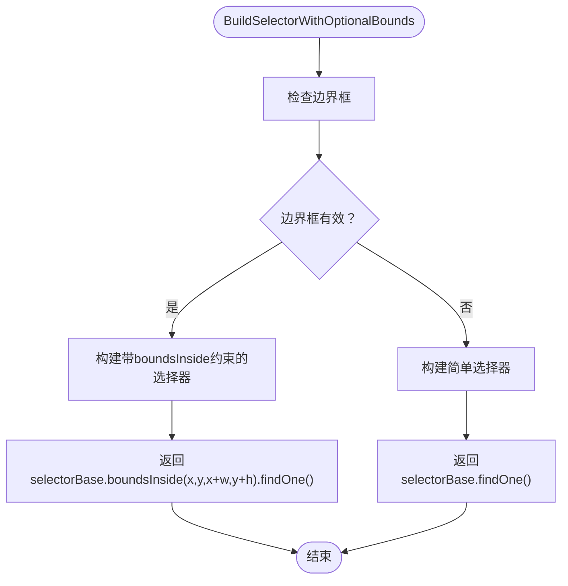
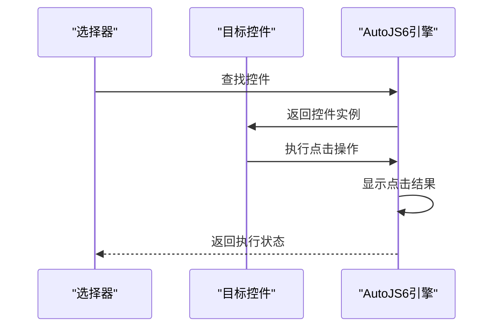
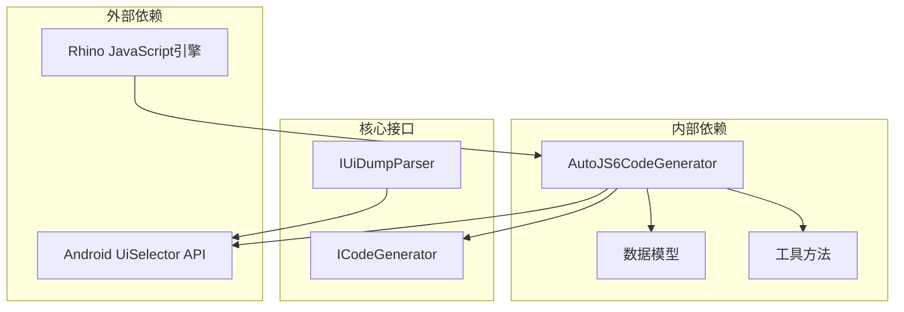

# 控件模式代码生成

<cite>
**本文档引用的文件**
- [AutoJS6CodeGenerator.cs](file://Core/Services/AutoJS6CodeGenerator.cs)
- [WidgetNode.cs](file://Core/Models/WidgetNode.cs)
- [AutoJS6CodeOptions.cs](file://Core/Models/AutoJS6CodeOptions.cs)
- [ICodeGenerator.cs](file://Core/Abstractions/ICodeGenerator.cs)
- [UiDumpParser.cs](file://Core/Services/UiDumpParser.cs)
- [IUiDumpParser.cs](file://Core/Abstractions/IUiDumpParser.cs)
- [AutoJS6CodeGeneratorTests.cs](file://Core.Tests/AutoJS6CodeGeneratorTests.cs)
- [CropRegion.cs](file://Core/Models/CropRegion.cs)
</cite>

## 目录
1. [简介](#简介)
2. [项目结构](#项目结构)
3. [核心组件](#核心组件)
4. [架构概览](#架构概览)
5. [详细组件分析](#详细组件分析)
6. [依赖关系分析](#依赖关系分析)
7. [性能考虑](#性能考虑)
8. [故障排除指南](#故障排除指南)
9. [结论](#结论)

## 简介

本文档深入分析AutoJS6开发工具中的控件模式代码生成功能，重点解释`GenerateWidgetModeCode`方法的实现原理。该功能基于Android UiSelector API，通过智能选择器构建策略和降级机制，为不同类型的Android控件生成可靠的点击代码。

控件模式代码生成器采用"主选择器优先，降级选择器跟随"的设计理念，确保在各种复杂场景下都能准确定位目标控件。系统支持多种选择器类型，包括资源ID、文本、内容描述、类名等，并通过边界框约束进一步提高选择精度。

## 项目结构

AutoJS6开发工具采用分层架构设计，核心代码生成功能位于Core服务层：

**图表来源**
- [AutoJS6CodeGenerator.cs:1-357](file://Core/Services/AutoJS6CodeGenerator.cs#L1-L357)
- [UiDumpParser.cs:1-263](file://Core/Services/UiDumpParser.cs#L1-L263)

**章节来源**
- [AutoJS6CodeGenerator.cs:1-357](file://Core/Services/AutoJS6CodeGenerator.cs#L1-L357)
- [ICodeGenerator.cs:1-46](file://Core/Abstractions/ICodeGenerator.cs#L1-L46)

## 核心组件

### AutoJS6CodeGenerator 类

`AutoJS6CodeGenerator`是控件模式代码生成的核心实现类，实现了`ICodeGenerator`接口。该类提供了完整的代码生成功能，包括主选择器构建、降级选择器生成、重试机制等核心逻辑。

主要职责：
- 生成控件模式JavaScript代码
- 构建主选择器和降级选择器
- 实现重试和超时机制
- 验证生成代码的兼容性

### WidgetNode 数据模型

`WidgetNode`代表Android UI控件节点信息，包含了控件的所有关键属性：

- **ClassName**: 控件类名（如android.widget.TextView）
- **ResourceId**: 资源ID（如com.example:id/button）
- **Text**: 文本内容
- **ContentDesc**: 内容描述（content-desc）
- **Bounds**: 边界框字符串
- **BoundsRect**: 边界框矩形坐标
- **Clickable**: 是否可点击
- **其他状态属性**: Checkable、Checked、Focusable等

### AutoJS6CodeOptions 配置选项

`AutoJS6CodeOptions`提供了灵活的代码生成配置：

- **Mode**: 代码生成模式（Image/Widget）
- **RetryCount**: 重试次数
- **TimeoutMilliseconds**: 超时时间
- **VariablePrefix**: 变量名前缀
- **GenerateRetryLogic**: 是否生成重试逻辑
- **GenerateTimeoutLogic**: 是否生成超时逻辑

**章节来源**
- [WidgetNode.cs:1-93](file://Core/Models/WidgetNode.cs#L1-L93)
- [AutoJS6CodeOptions.cs:1-89](file://Core/Models/AutoJS6CodeOptions.cs#L1-L89)

## 架构概览

控件模式代码生成系统采用分层架构，各组件职责明确：

**图表来源**
- [ICodeGenerator.cs:1-46](file://Core/Abstractions/ICodeGenerator.cs#L1-L46)
- [AutoJS6CodeGenerator.cs:11-357](file://Core/Services/AutoJS6CodeGenerator.cs#L11-L357)
- [WidgetNode.cs:6-92](file://Core/Models/WidgetNode.cs#L6-L92)
- [AutoJS6CodeOptions.cs:6-89](file://Core/Models/AutoJS6CodeOptions.cs#L6-L89)

## 详细组件分析

### GenerateWidgetModeCode 方法实现

`GenerateWidgetModeCode`是控件模式代码生成的核心方法，实现了完整的控件查找和点击流程：

**图表来源**
- [AutoJS6CodeGenerator.cs:104-164](file://Core/Services/AutoJS6CodeGenerator.cs#L104-L164)

#### 主选择器构建策略

主选择器构建遵循严格的优先级顺序：

1. **资源ID优先**: `id("resourceId")`
2. **文本内容**: `text("textContent")`
3. **内容描述**: `desc("contentDescription")`
4. **类名**: `className("className")`

如果控件具有边界框信息，会自动添加`boundsInside`约束来提高选择精度。

#### 降级选择器生成规则

降级选择器生成遵循以下规则：

**图表来源**
- [AutoJS6CodeGenerator.cs:314-334](file://Core/Services/AutoJS6CodeGenerator.cs#L314-L334)

#### 重试机制实现

重试机制提供了灵活的控件查找策略：

**图表来源**
- [AutoJS6CodeGenerator.cs:119-161](file://Core/Services/AutoJS6CodeGenerator.cs#L119-L161)

### 选择器构建方法详解

#### BuildPrimaryWidgetSelector 方法

该方法实现了主选择器的智能构建逻辑：

**图表来源**
- [AutoJS6CodeGenerator.cs:290-312](file://Core/Services/AutoJS6CodeGenerator.cs#L290-L312)

#### BuildFallbackWidgetSelectors 方法

降级选择器构建遵循特定的优先级和组合规则：

1. **资源ID+文本组合**: 当资源ID和文本都存在时，优先使用文本作为降级选择器
2. **内容描述选择器**: 当存在内容描述时，始终添加为降级选择器
3. **文本降级**: 当没有其他降级选择器且存在文本时，使用文本作为最后的降级选择器

所有降级选择器都会经过去重处理，确保不会生成重复的选择器代码。

#### BuildSelectorWithOptionalBounds 方法

该方法负责为选择器添加可选的边界约束：

**图表来源**
- [AutoJS6CodeGenerator.cs:336-345](file://Core/Services/AutoJS6CodeGenerator.cs#L336-L345)

### 控件点击操作生成逻辑

控件点击操作的生成遵循以下步骤：

1. **控件查找**: 使用构建的选择器查找目标控件
2. **点击执行**: 调用控件的click()方法
3. **结果反馈**: 根据查找结果生成相应的提示信息

**图表来源**
- [AutoJS6CodeGenerator.cs:144-161](file://Core/Services/AutoJS6CodeGenerator.cs#L144-L161)

## 依赖关系分析

控件模式代码生成器的依赖关系清晰明确：

**图表来源**
- [AutoJS6CodeGenerator.cs:1-357](file://Core/Services/AutoJS6CodeGenerator.cs#L1-L357)
- [ICodeGenerator.cs:1-46](file://Core/Abstractions/ICodeGenerator.cs#L1-L46)

### 关键依赖关系

1. **ICodeGenerator接口**: 定义了代码生成的标准接口规范
2. **WidgetNode模型**: 提供控件属性的数据结构
3. **AutoJS6CodeOptions配置**: 支持灵活的代码生成配置
4. **Rhino引擎约束**: 代码生成必须符合JavaScript引擎的技术限制

**章节来源**
- [ICodeGenerator.cs:8-46](file://Core/Abstractions/ICodeGenerator.cs#L8-L46)
- [AutoJS6CodeGenerator.cs:11-164](file://Core/Services/AutoJS6CodeGenerator.cs#L11-L164)

## 性能考虑

控件模式代码生成器在设计时充分考虑了性能优化：

### 选择器优化策略

1. **优先级排序**: 资源ID优先选择器，因为其唯一性和精确性最高
2. **边界约束**: 自动添加边界框约束，减少不必要的搜索范围
3. **降级策略**: 合理的降级顺序避免重复的控件查找操作

### 内存管理

1. **字符串构建**: 使用StringBuilder进行高效的字符串拼接
2. **去重处理**: 对降级选择器进行去重，避免重复的代码生成
3. **边界框缓存**: WidgetNode直接提供解析后的边界框信息

### 执行效率

1. **最小化重试次数**: 默认3次重试，可根据需要调整
2. **智能超时控制**: 支持超时机制防止无限等待
3. **条件编译**: 可根据需要选择是否生成重试和超时逻辑

## 故障排除指南

### 常见问题及解决方案

#### 1. 控件未找到

**可能原因**:
- 资源ID不存在或格式错误
- 文本内容不匹配
- 内容描述缺失
- 边界框信息不准确

**解决方法**:
- 检查WidgetNode属性的准确性
- 验证控件的实际属性
- 调整选择器优先级
- 添加更精确的边界约束

#### 2. 重试机制失效

**可能原因**:
- 重试次数设置过少
- 网络延迟或设备响应慢
- 代码生成选项配置错误

**解决方法**:
- 增加重试次数
- 调整超时时间
- 检查GenerateRetryLogic选项

#### 3. JavaScript引擎错误

**可能原因**:
- 循环体内使用了const/let
- 代码不符合Rhino引擎要求

**解决方法**:
- 确保使用var而不是const/let
- 检查代码验证结果
- 使用FormatCode方法格式化代码

**章节来源**
- [AutoJS6CodeGenerator.cs:226-258](file://Core/Services/AutoJS6CodeGenerator.cs#L226-L258)

## 结论

控件模式代码生成器通过智能的选择器构建策略和完善的降级机制，为Android控件的自动化操作提供了可靠的技术支撑。系统的设计充分考虑了实际应用场景的复杂性，通过严格的优先级排序、合理的降级策略和灵活的配置选项，确保了代码生成的准确性和可靠性。

该系统的架构设计体现了良好的分层思想和接口抽象，为后续的功能扩展和维护提供了便利。通过对选择器构建、重试机制、边界约束等核心功能的深入分析，我们可以看到开发者在用户体验和技术实现之间找到了很好的平衡点。

未来可以考虑的方向包括：
- 支持更多的选择器类型和组合策略
- 增强错误诊断和调试功能
- 优化性能表现，特别是在复杂UI层次结构中的查找效率
- 提供更丰富的配置选项和自定义能力