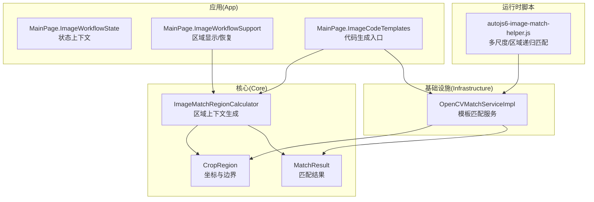
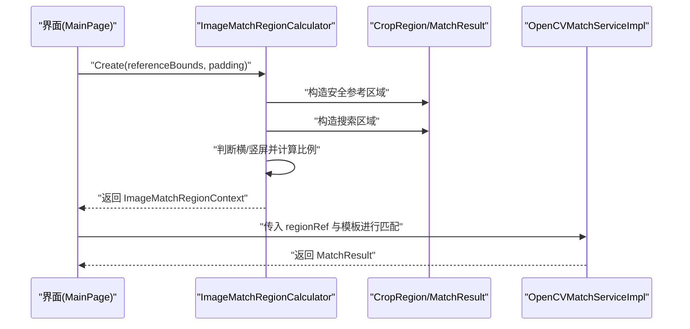
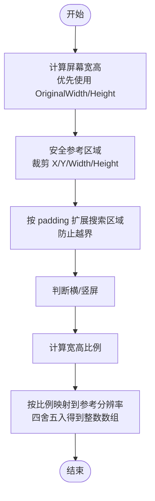
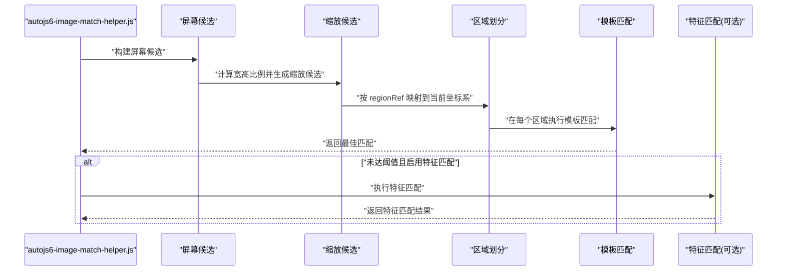
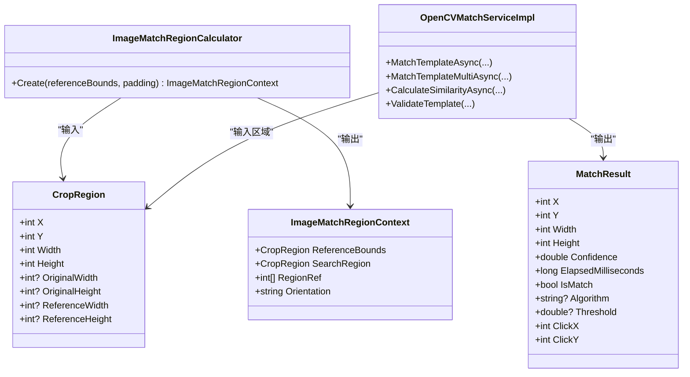

# 区域计算与定位

<cite>
**本文引用的文件**
- [ImageMatchRegionCalculator.cs](file://Core/Helpers/ImageMatchRegionCalculator.cs)
- [CropRegion.cs](file://Core/Models/CropRegion.cs)
- [MatchResult.cs](file://Core/Models/MatchResult.cs)
- [WidgetNode.cs](file://Core/Models/WidgetNode.cs)
- [ImageMatchRegionCalculatorTests.cs](file://Core.Tests/ImageMatchRegionCalculatorTests.cs)
- [OpenCVMatchServiceImpl.cs](file://Infrastructure/Imaging/OpenCVMatchServiceImpl.cs)
- [MainPage.ImageWorkflowState.cs](file://App/Views/MainPage.ImageWorkflowState.cs)
- [MainPage.ImageWorkflowSupport.cs](file://App/Views/MainPage.ImageWorkflowSupport.cs)
- [MainPage.ImageCodeTemplates.cs](file://App/Views/MainPage.ImageCodeTemplates.cs)
- [autojs6-image-match-helper.js](file://App/CodeTemplates/image/autojs6-image-match-helper.js)
</cite>

## 目录
1. [简介](#简介)
2. [项目结构](#项目结构)
3. [核心组件](#核心组件)
4. [架构总览](#架构总览)
5. [详细组件分析](#详细组件分析)
6. [依赖关系分析](#依赖关系分析)
7. [性能考量](#性能考量)
8. [故障排查指南](#故障排查指南)
9. [结论](#结论)
10. [附录](#附录)

## 简介
本技术文档围绕“区域计算与定位”能力展开，重点解释以下内容：
- ImageMatchRegionCalculator 的区域计算算法：参考区域边界确定、搜索区域扩展、方向约定与归一化映射。
- CropRegion 模型设计：坐标系统、边界约束、有效性验证与跨分辨率映射。
- 区域安全检查机制：边界裁剪、尺寸验证、坐标转换逻辑。
- 多尺度匹配中的区域递归计算与性能优化：缩放候选、区域划分、模板尺寸校验。
- 实际使用示例：如何在复杂场景下组合区域、嵌套处理与生成定位代码。
- 数学原理、算法复杂度分析与实践注意事项。

## 项目结构
该功能横跨三层：
- 核心模型与算法：Core 层的 CropRegion、MatchResult、ImageMatchRegionCalculator。
- 应用层集成：App 层对区域上下文的解析与代码生成。
- 匹配引擎：Infrastructure 层的 OpenCV 模板匹配服务，负责在指定区域内执行匹配。

图表来源
- [ImageMatchRegionCalculator.cs:35-98](file://Core/Helpers/ImageMatchRegionCalculator.cs#L35-L98)
- [CropRegion.cs:6-52](file://Core/Models/CropRegion.cs#L6-L52)
- [MatchResult.cs:6-62](file://Core/Models/MatchResult.cs#L6-L62)
- [OpenCVMatchServiceImpl.cs:11-203](file://Infrastructure/Imaging/OpenCVMatchServiceImpl.cs#L11-L203)
- [MainPage.ImageWorkflowState.cs:6-81](file://App/Views/MainPage.ImageWorkflowState.cs#L6-L81)
- [MainPage.ImageWorkflowSupport.cs:65-88](file://App/Views/MainPage.ImageWorkflowSupport.cs#L65-L88)
- [MainPage.ImageCodeTemplates.cs:172-198](file://App/Views/MainPage.ImageCodeTemplates.cs#L172-L198)
- [autojs6-image-match-helper.js:18-160](file://App/CodeTemplates/image/autojs6-image-match-helper.js#L18-L160)

章节来源
- [ImageMatchRegionCalculator.cs:1-99](file://Core/Helpers/ImageMatchRegionCalculator.cs#L1-L99)
- [CropRegion.cs:1-53](file://Core/Models/CropRegion.cs#L1-L53)
- [MatchResult.cs:1-63](file://Core/Models/MatchResult.cs#L1-L63)
- [OpenCVMatchServiceImpl.cs:1-204](file://Infrastructure/Imaging/OpenCVMatchServiceImpl.cs#L1-L204)
- [MainPage.ImageWorkflowState.cs:1-81](file://App/Views/MainPage.ImageWorkflowState.cs#L1-L81)
- [MainPage.ImageWorkflowSupport.cs:1-367](file://App/Views/MainPage.ImageWorkflowSupport.cs#L1-L367)
- [MainPage.ImageCodeTemplates.cs:1-255](file://App/Views/MainPage.ImageCodeTemplates.cs#L1-L255)
- [autojs6-image-match-helper.js:1-528](file://App/CodeTemplates/image/autojs6-image-match-helper.js#L1-L528)

## 核心组件
- CropRegion：定义矩形区域的坐标与尺寸，并携带原始分辨率与参考分辨率字段，用于跨设备坐标映射。
- MatchResult：封装单次匹配的结果，包含置信度、耗时、是否命中以及点击中心点等。
- ImageMatchRegionCalculator：根据参考区域与内边距生成安全的搜索区域，并输出面向参考分辨率的归一化区域数组与方向约定。
- OpenCVMatchServiceImpl：在指定区域内执行模板匹配，返回 MatchResult；支持多结果扫描与相似度计算。
- 应用层状态与代码生成：MainPage 将区域上下文传递给代码生成器，结合模板生成 AutoJS6 脚本。

章节来源
- [CropRegion.cs:6-52](file://Core/Models/CropRegion.cs#L6-L52)
- [MatchResult.cs:6-62](file://Core/Models/MatchResult.cs#L6-L62)
- [ImageMatchRegionCalculator.cs:35-98](file://Core/Helpers/ImageMatchRegionCalculator.cs#L35-L98)
- [OpenCVMatchServiceImpl.cs:11-203](file://Infrastructure/Imaging/OpenCVMatchServiceImpl.cs#L11-L203)
- [MainPage.ImageCodeTemplates.cs:172-198](file://App/Views/MainPage.ImageCodeTemplates.cs#L172-L198)

## 架构总览
区域计算与定位的整体流程如下：
- 输入：参考区域 CropRegion（含原始分辨率）与内边距 padding。
- 步骤：
  1) 计算屏幕宽高（优先使用原始分辨率，否则从参考区域推导）。
  2) 对参考区域进行边界裁剪与最小尺寸约束，得到安全参考区域。
  3) 基于安全参考区域与 padding 扩展搜索区域，确保不越界。
  4) 判断横屏/竖屏，选择参考分辨率（1280x720 或 720x1280），计算宽高比例。
  5) 将搜索区域按比例映射到参考分辨率坐标系，得到 regionRef。
  6) 输出 ImageMatchRegionContext（包含 ReferenceBounds、SearchRegion、RegionRef、Orientation）。
- 应用层：将该上下文用于生成 AutoJS6 匹配代码，或直接调用 OpenCV 进行匹配。

图表来源
- [ImageMatchRegionCalculator.cs:40-97](file://Core/Helpers/ImageMatchRegionCalculator.cs#L40-L97)
- [OpenCVMatchServiceImpl.cs:13-60](file://Infrastructure/Imaging/OpenCVMatchServiceImpl.cs#L13-L60)
- [MainPage.ImageCodeTemplates.cs:172-198](file://App/Views/MainPage.ImageCodeTemplates.cs#L172-L198)

## 详细组件分析

### ImageMatchRegionCalculator：区域计算与归一化
- 输入参数
  - referenceBounds：参考区域 CropRegion，需包含 X/Y/Width/Height，以及可选的 OriginalWidth/OriginalHeight。
  - padding：向外扩展搜索区域的像素距离。
- 关键步骤
  1) 屏幕宽高计算：若未提供原始分辨率，则以参考区域右下角推导最大可能分辨率。
  2) 安全参考区域：对 X/Y 进行下限 0 上限 (screen - 1)，对 Width/Height 进行下限 1 上限 screen，避免无效区域。
  3) 搜索区域扩展：以安全参考区域为中心，向外扩展 padding，同时保证不越界。
  4) 方向约定：宽 >= 高 视为横屏，否则竖屏。
  5) 参考分辨率映射：横屏使用 1280x720，竖屏使用 720x1280；分别计算 widthRatio/heightRatio，将搜索区域坐标按比例映射到参考分辨率，四舍五入得到整数数组 [x,y,width,height]。
- 输出
  - ReferenceBounds：安全后的参考区域。
  - SearchRegion：扩展后的搜索区域。
  - RegionRef：参考分辨率坐标系下的区域数组。
  - Orientation：方向约定字符串。

图表来源
- [ImageMatchRegionCalculator.cs:42-96](file://Core/Helpers/ImageMatchRegionCalculator.cs#L42-L96)

章节来源
- [ImageMatchRegionCalculator.cs:35-98](file://Core/Helpers/ImageMatchRegionCalculator.cs#L35-L98)
- [ImageMatchRegionCalculatorTests.cs:10-58](file://Core.Tests/ImageMatchRegionCalculatorTests.cs#L10-L58)

### CropRegion：坐标系统、边界约束与有效性验证
- 坐标系统
  - X/Y 表示左上角坐标，单位为像素。
  - Width/Height 表示区域尺寸，至少为 1。
- 边界约束
  - X/Y 最小为 0，最大不超过屏幕宽度/高度减 1。
  - Width/Height 最小为 1，且 X+Width ≤ 屏幕宽度，Y+Height ≤ 屏幕高度。
- 有效性验证
  - OriginalWidth/OriginalHeight 用于坐标转换与比例计算。
  - ReferenceWidth/ReferenceHeight 用于 regionRef 的参考分辨率映射。
- 用途
  - 作为参考区域输入给区域计算器。
  - 作为匹配区域输入给 OpenCV 引擎。
  - 作为点击中心点计算的基础（配合 MatchResult）。

章节来源
- [CropRegion.cs:6-52](file://Core/Models/CropRegion.cs#L6-L52)

### MatchResult：匹配结果与点击中心点
- 字段
  - X/Y：匹配到的左上角坐标。
  - Width/Height：模板尺寸。
  - Confidence：置信度（0.0-1.0）。
  - ElapsedMilliseconds：匹配耗时。
  - IsMatch：是否满足阈值。
  - Algorithm/Threshold：使用的算法与阈值。
  - ClickX/ClickY：模板中心点坐标（由 X/Y/Width/Height 推导）。
- 作用
  - 作为 OpenCV 匹配的输出。
  - 作为生成 AutoJS6 点击命令的依据。

章节来源
- [MatchResult.cs:6-62](file://Core/Models/MatchResult.cs#L6-L62)

### 区域安全检查机制
- 边界裁剪
  - 在区域计算器与 OpenCV 匹配服务中均使用 Math.Clamp 对 X/Y/Width/Height 进行裁剪，确保不越界。
- 尺寸验证
  - 搜索区域的 Width/Height 至少为 1。
  - 模板尺寸必须小于等于搜索区域尺寸，否则跳过该区域。
- 坐标转换逻辑
  - 通过 widthRatio/heightRatio 将当前屏幕坐标映射到参考分辨率坐标系，用于生成 regionRef。
  - OpenCV 匹配服务内部也进行偏移补偿（OffsetX/OffsetY），将局部匹配结果还原到全局坐标。

章节来源
- [ImageMatchRegionCalculator.cs:49-76](file://Core/Helpers/ImageMatchRegionCalculator.cs#L49-L76)
- [OpenCVMatchServiceImpl.cs:163-177](file://Infrastructure/Imaging/OpenCVMatchServiceImpl.cs#L163-L177)

### 多尺度匹配中的区域递归计算与性能优化
- 缩放候选
  - 根据当前屏幕候选与参考分辨率的比例，生成有限的缩放候选集，逐个尝试以提升鲁棒性。
- 区域划分
  - 支持传入 regionRef（参考分辨率坐标系），将其按比例映射回当前屏幕坐标系，形成多个子区域进行递归匹配。
- 模板尺寸校验
  - 在每次缩放后，检查模板尺寸是否小于等于当前区域尺寸，否则跳过该组合。
- 性能优化
  - 仅在必要时进行模板缩放（scale 与 1 的差值超过阈值才缩放）。
  - 限制最大匹配数量（options.max），减少后续处理开销。
  - 透明遮罩（useTransparentMask）可降低误匹配风险，但会增加计算量。
  - 若基础模板匹配未达阈值，可降级为特征匹配（enableMatchFeatures），平衡准确率与速度。

图表来源
- [autojs6-image-match-helper.js:55-147](file://App/CodeTemplates/image/autojs6-image-match-helper.js#L55-L147)

章节来源
- [autojs6-image-match-helper.js:18-160](file://App/CodeTemplates/image/autojs6-image-match-helper.js#L18-L160)

### 具体使用示例：精确图像定位
- 场景一：基于裁剪区域生成代码
  - 步骤：在画布上选择 CropRegion，调用 ImageMatchRegionCalculator.Create 获取 ImageMatchRegionContext，随后调用代码生成器生成 AutoJS6 匹配代码。
  - 关键路径：[MainPage.ImageCodeTemplates.cs:172-198](file://App/Views/MainPage.ImageCodeTemplates.cs#L172-L198) -> [ImageMatchRegionCalculator.cs:40-97](file://Core/Helpers/ImageMatchRegionCalculator.cs#L40-L97)
- 场景二：外部模板首次匹配后复用
  - 步骤：完成一次成功匹配后，保存 SuccessfulImageMatchContext；后续生成代码时优先复用该上下文，避免重复计算。
  - 关键路径：[MainPage.ImageWorkflowState.cs:14-29](file://App/Views/MainPage.ImageWorkflowState.cs#L14-L29) -> [MainPage.ImageCodeTemplates.cs:176-187](file://App/Views/MainPage.ImageCodeTemplates.cs#L176-L187)
- 场景三：复杂区域组合与嵌套处理
  - 步骤：传入 regionRef（参考分辨率坐标系），脚本自动映射到当前屏幕坐标系，按比例生成多个区域进行递归匹配，最终返回最佳匹配。
  - 关键路径：[autojs6-image-match-helper.js:66-68](file://App/CodeTemplates/image/autojs6-image-match-helper.js#L66-L68) -> [autojs6-image-match-helper.js:70-126](file://App/CodeTemplates/image/autojs6-image-match-helper.js#L70-L126)

章节来源
- [MainPage.ImageCodeTemplates.cs:172-198](file://App/Views/MainPage.ImageCodeTemplates.cs#L172-L198)
- [MainPage.ImageWorkflowState.cs:14-29](file://App/Views/MainPage.ImageWorkflowState.cs#L14-L29)
- [autojs6-image-match-helper.js:66-126](file://App/CodeTemplates/image/autojs6-image-match-helper.js#L66-L126)

## 依赖关系分析
- 组件耦合
  - ImageMatchRegionCalculator 依赖 CropRegion，输出 ImageMatchRegionContext。
  - OpenCVMatchServiceImpl 依赖 CropRegion 与 MatchResult，负责在指定区域内执行匹配。
  - 应用层 MainPage 通过 ImageCodeTemplates 与 ImageWorkflowSupport 解析区域上下文并生成代码。
- 外部依赖
  - OpenCVMatchServiceImpl 依赖 OpenCvSharp 进行模板匹配。
  - AutoJS6 脚本依赖 images.matchTemplate 与 images.resize 等 API。
- 循环依赖
  - 无循环依赖，模块职责清晰。

图表来源
- [ImageMatchRegionCalculator.cs:9-30](file://Core/Helpers/ImageMatchRegionCalculator.cs#L9-L30)
- [CropRegion.cs:6-52](file://Core/Models/CropRegion.cs#L6-L52)
- [MatchResult.cs:6-62](file://Core/Models/MatchResult.cs#L6-L62)
- [OpenCVMatchServiceImpl.cs:11-203](file://Infrastructure/Imaging/OpenCVMatchServiceImpl.cs#L11-L203)

章节来源
- [ImageMatchRegionCalculator.cs:35-98](file://Core/Helpers/ImageMatchRegionCalculator.cs#L35-L98)
- [OpenCVMatchServiceImpl.cs:11-203](file://Infrastructure/Imaging/OpenCVMatchServiceImpl.cs#L11-L203)

## 性能考量
- 时间复杂度
  - 单区域模板匹配：O(HW·hw)（H/W 为搜索区域尺寸，h/w 为模板尺寸），模板匹配通常为线性复杂度。
  - 多区域/多尺度：在区域数 R 与缩放候选数 S 下，整体复杂度约为 O(R·S·HW·hw)。
- 空间复杂度
  - 主要取决于 OpenCV 内部矩阵与中间结果，通常为 O(HW + hw)。
- 优化策略
  - 仅在必要时缩放模板，避免不必要的 resize。
  - 限制最大匹配数量（max），减少后续处理。
  - 使用 regionRef 减少搜索空间，提高命中概率。
  - 合理设置阈值，避免过多候选导致的二次扫描。
  - 透明遮罩与特征匹配仅在需要时启用，平衡准确率与性能。

[本节为通用性能讨论，无需特定文件来源]

## 故障排查指南
- 匹配不到目标
  - 检查 regionRef 是否正确传入，且与当前屏幕分辨率一致。
  - 确认模板尺寸小于等于区域尺寸，否则会被跳过。
  - 调整阈值（matchThreshold/acceptThreshold），或启用特征匹配降级。
- 区域越界或为空
  - 确保 CropRegion 的 X/Y/Width/Height 在有效范围内。
  - 使用 ImageMatchRegionCalculator 的安全裁剪逻辑，避免非法输入。
- 坐标错位
  - 确认 OriginalWidth/OriginalHeight 设置正确，以便比例映射。
  - 检查 Orientation 判定是否符合预期（横屏/竖屏）。
- 性能过慢
  - 减少 regionRef 数量与缩放候选数。
  - 降低模板尺寸或使用更小的搜索区域。
  - 关闭透明遮罩与特征匹配，除非必要。

章节来源
- [OpenCVMatchServiceImpl.cs:163-177](file://Infrastructure/Imaging/OpenCVMatchServiceImpl.cs#L163-L177)
- [autojs6-image-match-helper.js:457-494](file://App/CodeTemplates/image/autojs6-image-match-helper.js#L457-L494)

## 结论
ImageMatchRegionCalculator 提供了稳定可靠的区域计算与归一化映射能力，结合 CropRegion 的边界约束与 MatchResult 的结果封装，形成了从区域生成到匹配定位的完整链路。应用层通过代码生成器将区域上下文转化为 AutoJS6 脚本，实现了跨设备、多尺度的精准定位。配合 OpenCV 匹配服务与脚本侧的多尺度/区域递归策略，能够在复杂场景下兼顾准确性与性能。

[本节为总结性内容，无需特定文件来源]

## 附录
- 测试用例要点
  - 横屏参考区域应正确裁剪并生成 regionRef。
  - 竖屏参考区域应按 720x1280 参考分辨率映射。
  - 参考路径：[ImageMatchRegionCalculatorTests.cs:10-58](file://Core.Tests/ImageMatchRegionCalculatorTests.cs#L10-L58)

章节来源
- [ImageMatchRegionCalculatorTests.cs:10-58](file://Core.Tests/ImageMatchRegionCalculatorTests.cs#L10-L58)