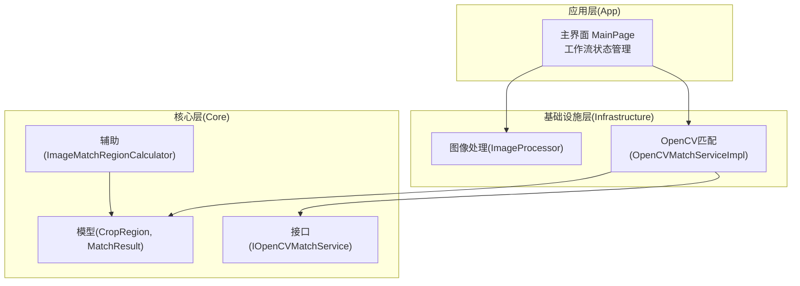
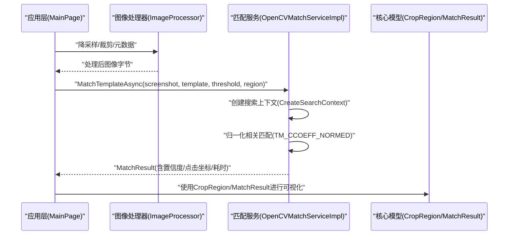
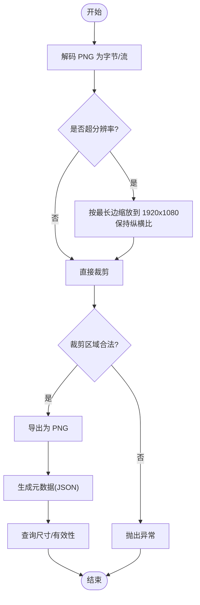
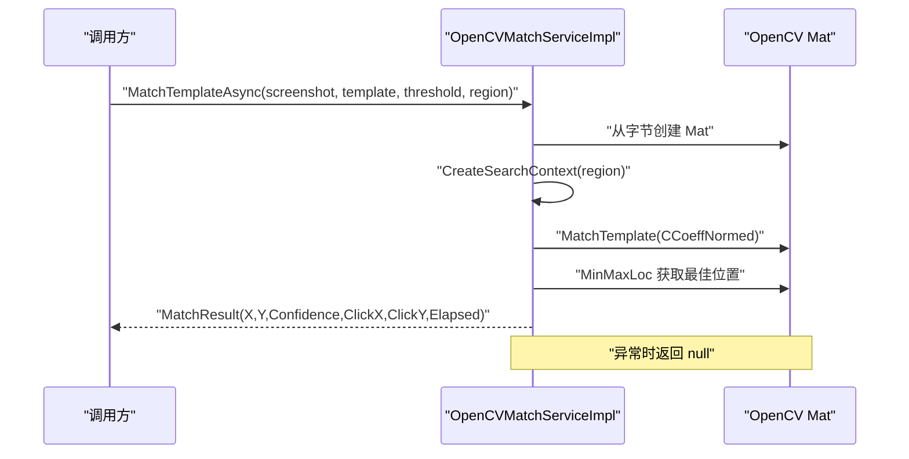
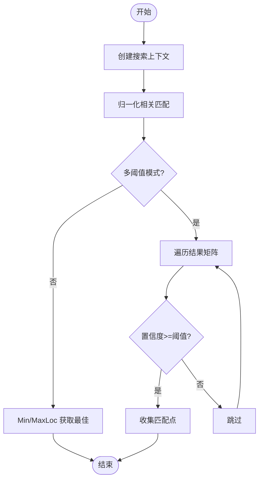
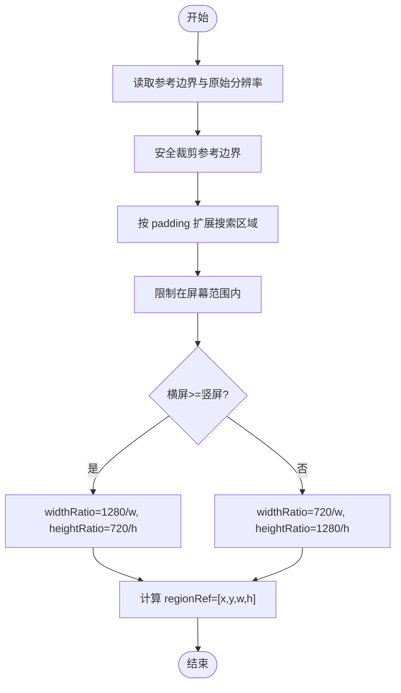
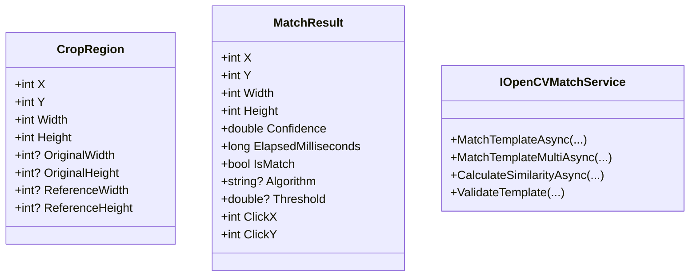
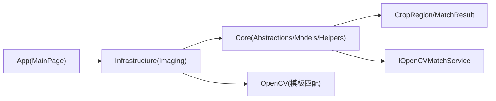

# 图像处理引擎

<cite>
**本文引用的文件**
- [ImageProcessor.cs](file://Infrastructure/Imaging/ImageProcessor.cs)
- [OpenCVMatchServiceImpl.cs](file://Infrastructure/Imaging/OpenCVMatchServiceImpl.cs)
- [IOpenCVMatchService.cs](file://Core/Abstractions/IOpenCVMatchService.cs)
- [ImageMatchRegionCalculator.cs](file://Core/Helpers/ImageMatchRegionCalculator.cs)
- [CropRegion.cs](file://Core/Models/CropRegion.cs)
- [MatchResult.cs](file://Core/Models/MatchResult.cs)
- [MainPage.xaml.cs](file://App/Views/MainPage.xaml.cs)
- [MainPage.ImageWorkflowState.cs](file://App/Views/MainPage.ImageWorkflowState.cs)
- [autojs6-image-match-helper.js](file://App/CodeTemplates/image/autojs6-image-match-helper.js)
- [README.md](file://README.md)
</cite>

## 目录
1. [简介](#简介)
2. [项目结构](#项目结构)
3. [核心组件](#核心组件)
4. [架构总览](#架构总览)
5. [详细组件分析](#详细组件分析)
6. [依赖关系分析](#依赖关系分析)
7. [性能考量](#性能考量)
8. [故障排查指南](#故障排查指南)
9. [结论](#结论)
10. [附录](#附录)

## 简介
本文件面向 AutoJS6 图像处理引擎，聚焦基于 OpenCV 的像素级模板匹配实现，系统性阐述以下能力：
- 图像预处理与模板裁剪：PNG 解码、降采样、裁剪、元数据生成与尺寸查询
- 匹配算法实现：归一化相关匹配、多尺度匹配、阈值筛选与区域限制
- 区域计算：参考区域边界确定、搜索区域扩展、方向与分辨率映射
- 结果可视化与交互：匹配结果结构化输出、点击坐标计算、性能计时
- 使用示例与最佳实践：参数配置、性能优化、错误处理

该引擎通过清晰的分层设计（App → Infrastructure → Core），将 UI、外部依赖适配与纯业务逻辑解耦，既保证了开发效率，又便于单元测试与跨平台迁移。

## 项目结构
项目采用 Clean Architecture 分层，图像处理引擎位于 Infrastructure 层，核心业务模型与辅助工具位于 Core 层，应用层负责用户交互与工作流编排。

图表来源
- [MainPage.xaml.cs:43-60](file://App/Views/MainPage.xaml.cs#L43-L60)
- [ImageProcessor.cs:13-162](file://Infrastructure/Imaging/ImageProcessor.cs#L13-L162)
- [OpenCVMatchServiceImpl.cs:11-204](file://Infrastructure/Imaging/OpenCVMatchServiceImpl.cs#L11-L204)
- [IOpenCVMatchService.cs:8-57](file://Core/Abstractions/IOpenCVMatchService.cs#L8-L57)
- [ImageMatchRegionCalculator.cs:35-99](file://Core/Helpers/ImageMatchRegionCalculator.cs#L35-L99)
- [CropRegion.cs:6-53](file://Core/Models/CropRegion.cs#L6-L53)
- [MatchResult.cs:6-63](file://Core/Models/MatchResult.cs#L6-L63)

章节来源
- [README.md:230-260](file://README.md#L230-L260)
- [README.md:264-287](file://README.md#L264-L287)

## 核心组件
- ImageProcessor：负责 PNG 解码、降采样、裁剪、元数据生成与尺寸查询，确保输入图像符合后续匹配的性能与一致性要求。
- OpenCVMatchServiceImpl：实现基于 OpenCV 的模板匹配，支持单次最佳匹配、全图阈值筛选匹配、相似度计算与模板有效性校验，并提供搜索区域上下文封装。
- ImageMatchRegionCalculator：根据参考区域与内边距生成搜索区域与归一化 regionRef，支持横竖屏方向映射。
- 模型与接口：CropRegion 描述裁剪区域与原始分辨率；MatchResult 描述匹配结果与点击坐标；IOpenCVMatchService 定义匹配服务契约。

章节来源
- [ImageProcessor.cs:13-162](file://Infrastructure/Imaging/ImageProcessor.cs#L13-L162)
- [OpenCVMatchServiceImpl.cs:11-204](file://Infrastructure/Imaging/OpenCVMatchServiceImpl.cs#L11-L204)
- [ImageMatchRegionCalculator.cs:35-99](file://Core/Helpers/ImageMatchRegionCalculator.cs#L35-L99)
- [CropRegion.cs:6-53](file://Core/Models/CropRegion.cs#L6-L53)
- [MatchResult.cs:6-63](file://Core/Models/MatchResult.cs#L6-L63)
- [IOpenCVMatchService.cs:8-57](file://Core/Abstractions/IOpenCVMatchService.cs#L8-L57)

## 架构总览
图像处理引擎的调用链路如下：应用层触发匹配请求，经由匹配服务执行 OpenCV 模板匹配，最终返回结构化结果；区域计算器为匹配提供搜索区域与归一化映射；图像处理器负责输入图像的预处理与元数据生成。

图表来源
- [MainPage.xaml.cs:43-60](file://App/Views/MainPage.xaml.cs#L43-L60)
- [OpenCVMatchServiceImpl.cs:13-60](file://Infrastructure/Imaging/OpenCVMatchServiceImpl.cs#L13-L60)
- [OpenCVMatchServiceImpl.cs:163-177](file://Infrastructure/Imaging/OpenCVMatchServiceImpl.cs#L163-L177)
- [CropRegion.cs:6-53](file://Core/Models/CropRegion.cs#L6-L53)
- [MatchResult.cs:6-63](file://Core/Models/MatchResult.cs#L6-L63)

## 详细组件分析

### ImageProcessor 组件分析
职责与流程
- PNG 解码：将字节流解码为 RGBA 像素数组，便于后续处理。
- 降采样：对超分辨率图像按最大 1920×1080 保持纵横比缩放，降低匹配成本。
- 裁剪：对指定区域进行裁剪并导出为 PNG，同时进行边界校验。
- 元数据：生成包含原始尺寸、裁剪区域与时间戳的 JSON 元数据，便于回溯与调试。
- 尺寸查询与有效性验证：异步获取图像尺寸与基本有效性检查。

图表来源
- [ImageProcessor.cs:21-100](file://Infrastructure/Imaging/ImageProcessor.cs#L21-L100)
- [ImageProcessor.cs:105-144](file://Infrastructure/Imaging/ImageProcessor.cs#L105-L144)

章节来源
- [ImageProcessor.cs:13-162](file://Infrastructure/Imaging/ImageProcessor.cs#L13-L162)

### OpenCVMatchServiceImpl 组件分析
职责与流程
- 单次最佳匹配：在指定区域内执行归一化相关匹配，返回最高置信度位置与结果。
- 多阈值匹配：遍历结果矩阵，收集所有高于阈值的匹配点，适合批量检测。
- 相似度计算：对两张同尺寸图像执行模板匹配并返回最大相关系数。
- 模板校验：判断模板是否为空或尺寸非法。
- 搜索上下文：根据 CropRegion 生成安全矩形与偏移，避免越界访问。

图表来源
- [OpenCVMatchServiceImpl.cs:13-60](file://Infrastructure/Imaging/OpenCVMatchServiceImpl.cs#L13-L60)
- [OpenCVMatchServiceImpl.cs:163-177](file://Infrastructure/Imaging/OpenCVMatchServiceImpl.cs#L163-L177)

图表来源
- [OpenCVMatchServiceImpl.cs:62-122](file://Infrastructure/Imaging/OpenCVMatchServiceImpl.cs#L62-L122)
- [OpenCVMatchServiceImpl.cs:124-148](file://Infrastructure/Imaging/OpenCVMatchServiceImpl.cs#L124-L148)

章节来源
- [OpenCVMatchServiceImpl.cs:11-204](file://Infrastructure/Imaging/OpenCVMatchServiceImpl.cs#L11-L204)
- [IOpenCVMatchService.cs:8-57](file://Core/Abstractions/IOpenCVMatchService.cs#L8-L57)

### ImageMatchRegionCalculator 组件分析
职责与流程
- 输入：参考边界 CropRegion 与内边距 padding。
- 输出：包含参考边界、搜索区域、归一化 regionRef 与方向字符串的上下文对象。
- 关键逻辑：
  - 对参考边界进行安全裁剪，防止越界。
  - 基于 padding 扩展搜索区域，同时限制在屏幕范围内。
  - 根据横竖屏选择参考分辨率（1280×720 或 720×1280），计算 widthRatio/heightRatio 并生成 regionRef。

图表来源
- [ImageMatchRegionCalculator.cs:40-97](file://Core/Helpers/ImageMatchRegionCalculator.cs#L40-L97)

章节来源
- [ImageMatchRegionCalculator.cs:35-99](file://Core/Helpers/ImageMatchRegionCalculator.cs#L35-L99)
- [CropRegion.cs:6-53](file://Core/Models/CropRegion.cs#L6-L53)

### 数据模型与接口
- CropRegion：描述裁剪区域的 X/Y/Width/Height，以及 OriginalWidth/OriginalHeight 与 ReferenceWidth/ReferenceHeight（用于坐标转换与 regionRef 生成）。
- MatchResult：描述匹配结果的 X/Y/Width/Height、置信度、耗时、是否匹配、算法与阈值，并提供 ClickX/ClickY 中心点坐标。
- IOpenCVMatchService：定义匹配服务接口，包括单次匹配、多阈值匹配、相似度计算与模板校验。

图表来源
- [CropRegion.cs:6-53](file://Core/Models/CropRegion.cs#L6-L53)
- [MatchResult.cs:6-63](file://Core/Models/MatchResult.cs#L6-L63)
- [IOpenCVMatchService.cs:8-57](file://Core/Abstractions/IOpenCVMatchService.cs#L8-L57)

章节来源
- [CropRegion.cs:6-53](file://Core/Models/CropRegion.cs#L6-L53)
- [MatchResult.cs:6-63](file://Core/Models/MatchResult.cs#L6-L63)
- [IOpenCVMatchService.cs:8-57](file://Core/Abstractions/IOpenCVMatchService.cs#L8-L57)

## 依赖关系分析
- 应用层依赖基础设施层提供的图像处理与匹配服务。
- 基础设施层依赖 Core 层的模型与接口契约。
- 匹配服务内部使用 OpenCV 进行模板匹配，返回 Core 层的 MatchResult。

图表来源
- [MainPage.xaml.cs:43-60](file://App/Views/MainPage.xaml.cs#L43-L60)
- [OpenCVMatchServiceImpl.cs:11-204](file://Infrastructure/Imaging/OpenCVMatchServiceImpl.cs#L11-L204)
- [IOpenCVMatchService.cs:8-57](file://Core/Abstractions/IOpenCVMatchService.cs#L8-L57)

章节来源
- [README.md:264-287](file://README.md#L264-L287)

## 性能考量
- 降采样策略：优先对超分辨率图像进行降采样，控制到最大 1920×1080，显著降低匹配计算量。
- 区域限制：通过 CropRegion 限定搜索范围，减少无关区域的匹配开销。
- 多阈值匹配：在需要批量检测时使用多阈值模式，但需注意遍历结果矩阵的时间复杂度。
- 异步与取消：所有 I/O 与计算均采用异步与取消令牌，避免阻塞 UI 线程。
- 相似度计算：相似度计算仅在图像尺寸一致时有效，避免无效比较带来的开销。

## 故障排查指南
常见问题与处理建议
- 匹配结果为空
  - 检查模板是否有效（尺寸与非空）。
  - 调整阈值或缩小搜索区域。
  - 确认截图与模板分辨率差异过大，考虑降采样或缩放。
- 裁剪区域越界
  - 使用 ImageMatchRegionCalculator 生成安全的搜索区域。
  - 在裁剪前进行边界校验。
- 性能过慢
  - 启用降采样与区域限制。
  - 避免在全屏范围内进行多阈值匹配。
- 异常返回 null
  - 捕获异常并回退到默认行为或提示用户重新设置参数。

章节来源
- [OpenCVMatchServiceImpl.cs:20-60](file://Infrastructure/Imaging/OpenCVMatchServiceImpl.cs#L20-L60)
- [ImageProcessor.cs:87-91](file://Infrastructure/Imaging/ImageProcessor.cs#L87-L91)

## 结论
AutoJS6 图像处理引擎以 Clean Architecture 为核心，结合 ImageProcessor 的预处理能力、OpenCVMatchServiceImpl 的高效匹配算法与 ImageMatchRegionCalculator 的区域映射，实现了从模板裁剪、实时阈值调整到匹配结果可视化的完整闭环。通过合理的降采样、区域限制与异步架构，系统在保证准确率的同时兼顾了性能与用户体验。

## 附录

### 使用示例与最佳实践
- 参数配置
  - 截图与模板：优先使用降采样后的图像，确保分辨率一致或在运行时进行缩放。
  - 阈值：根据模板质量与环境光照调整，建议从 0.7 起步逐步提升。
  - 搜索区域：使用 ImageMatchRegionCalculator 生成 regionRef，避免全屏扫描。
- 性能优化
  - 优先使用单次最佳匹配，仅在需要批量检测时启用多阈值模式。
  - 缩小模板尺寸，去除动态元素，保留稳定特征。
  - 合理设置 padding，平衡召回与性能。
- 错误处理
  - 捕获匹配服务异常，回退到默认阈值或提示用户调整模板。
  - 对裁剪区域进行边界校验，避免越界异常。
- AutoJS6 侧集成
  - 可参考自动匹配助手脚本中的多尺度候选与区域映射策略，结合 regionRef 实现跨分辨率适配。

章节来源
- [MainPage.xaml.cs:43-60](file://App/Views/MainPage.xaml.cs#L43-L60)
- [OpenCVMatchServiceImpl.cs:13-60](file://Infrastructure/Imaging/OpenCVMatchServiceImpl.cs#L13-L60)
- [ImageMatchRegionCalculator.cs:40-97](file://Core/Helpers/ImageMatchRegionCalculator.cs#L40-L97)
- [autojs6-image-match-helper.js:18-160](file://App/CodeTemplates/image/autojs6-image-match-helper.js#L18-L160)