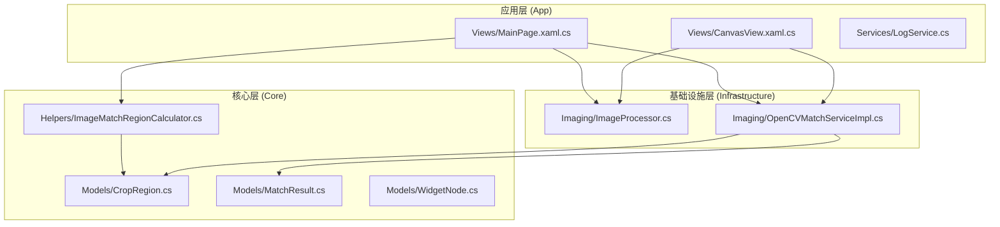
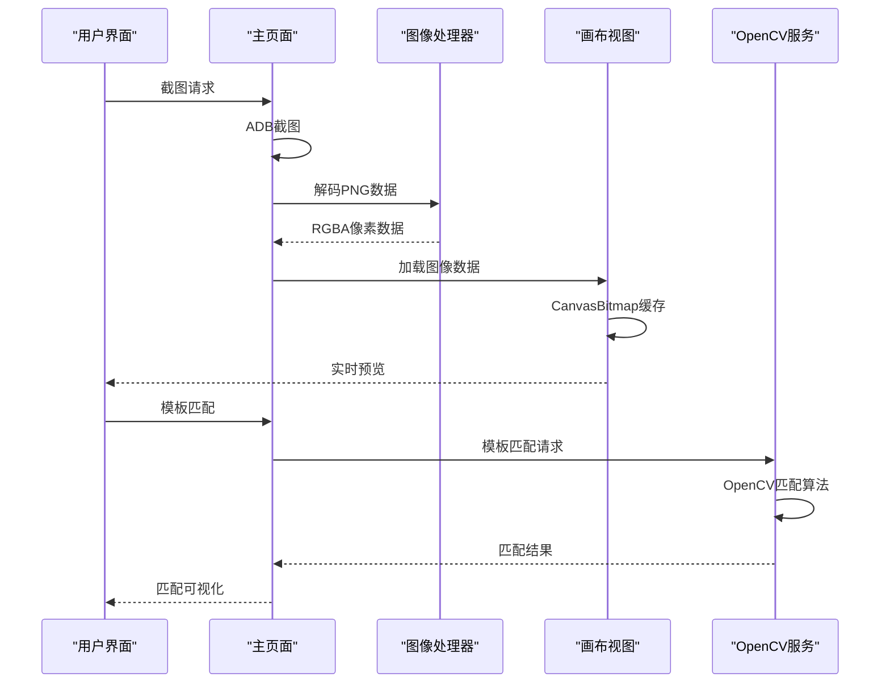
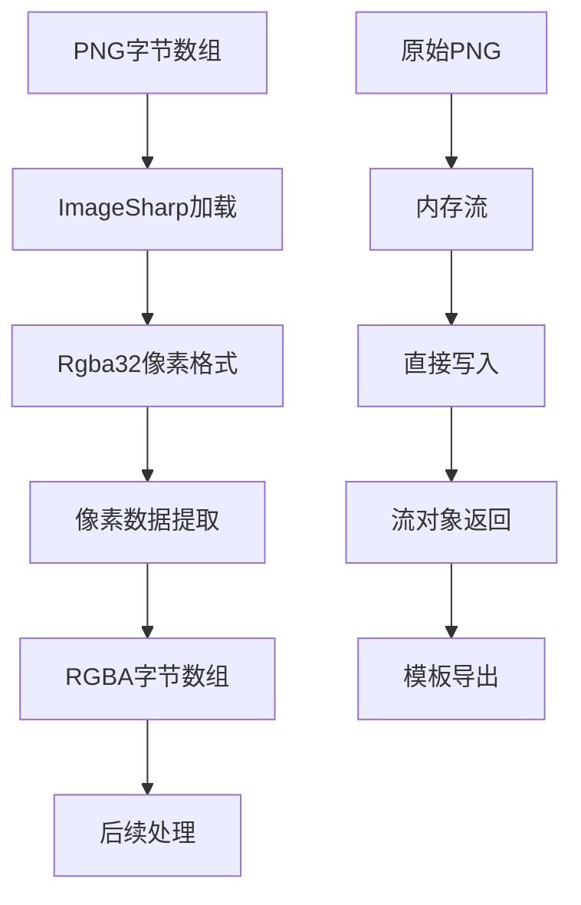
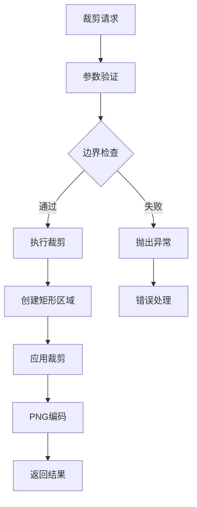
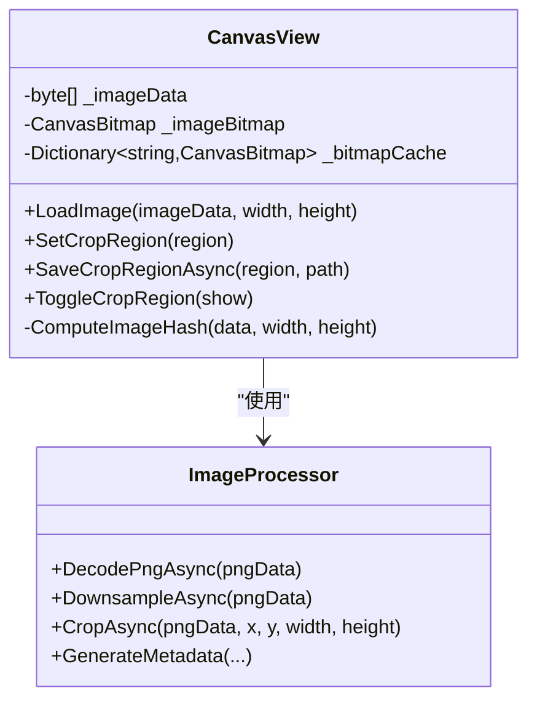
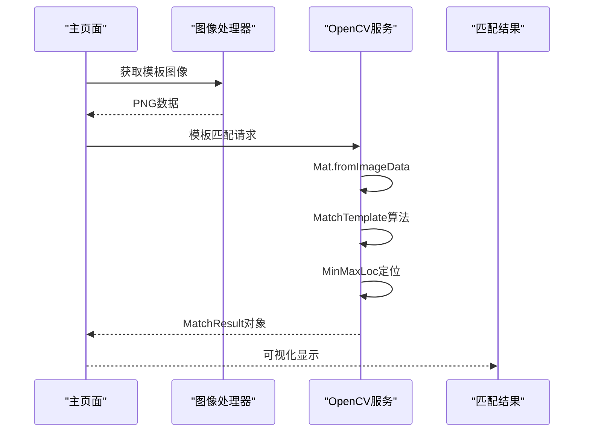
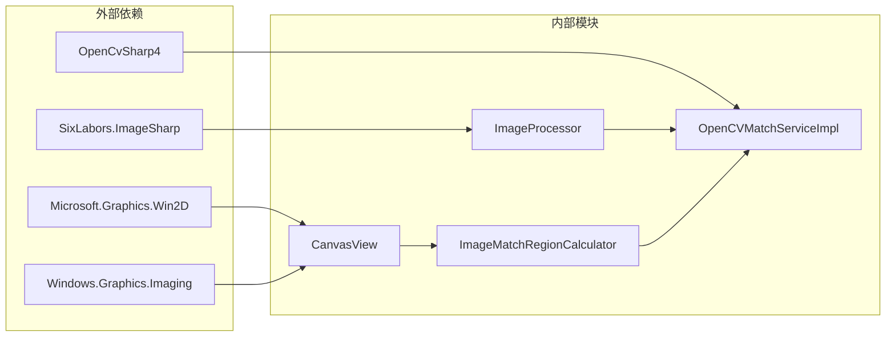
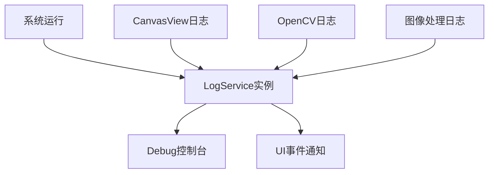

# 图像预处理流程

<cite>
**本文档引用的文件**
- [ImageProcessor.cs](file://Infrastructure/Imaging/ImageProcessor.cs)
- [OpenCVMatchServiceImpl.cs](file://Infrastructure/Imaging/OpenCVMatchServiceImpl.cs)
- [CanvasView.xaml.cs](file://App/Views/CanvasView.xaml.cs)
- [MainPage.xaml.cs](file://App/Views/MainPage.xaml.cs)
- [ImageMatchRegionCalculator.cs](file://Core/Helpers/ImageMatchRegionCalculator.cs)
- [CropRegion.cs](file://Core/Models/CropRegion.cs)
- [MatchResult.cs](file://Core/Models/MatchResult.cs)
- [WidgetNode.cs](file://Core/Models/WidgetNode.cs)
- [LogService.cs](file://App/Services/LogService.cs)
- [README.md](file://README.md)
</cite>

## 目录
1. [简介](#简介)
2. [项目结构](#项目结构)
3. [核心组件](#核心组件)
4. [架构概览](#架构概览)
5. [详细组件分析](#详细组件分析)
6. [依赖关系分析](#依赖关系分析)
7. [性能考虑](#性能考虑)
8. [故障排除指南](#故障排除指南)
9. [结论](#结论)
10. [附录](#附录)

## 简介

本技术文档深入解析了 AutoJS6 可视化开发工具包中的图像预处理流程，重点围绕 ImageProcessor 类构建的图像处理管道。该管道涵盖从 PNG 解码到降采样、裁剪、元数据生成的完整流程，并与 CanvasView 和 OpenCV 模板匹配服务无缝集成。

项目采用 Clean Architecture 分层设计，将纯业务逻辑（Core）与外部依赖（Infrastructure）和用户界面（App）严格分离，确保模块间的低耦合和高内聚。图像处理引擎基于 SixLabors.ImageSharp 进行像素级操作，结合 OpenCvSharp4 实现高性能模板匹配，支持实时预览和批量处理场景。

## 项目结构

该项目采用分层架构，主要包含以下核心模块：



**图表来源**
- [README.md: 230-260:230-260](file://README.md#L230-L260)
- [CanvasView.xaml.cs: 1-100:1-100](file://App/Views/CanvasView.xaml.cs#L1-L100)
- [MainPage.xaml.cs: 17-60:17-60](file://App/Views/MainPage.xaml.cs#L17-L60)

**章节来源**
- [README.md: 230-287:230-287](file://README.md#L230-L287)

## 核心组件

### ImageProcessor 类

ImageProcessor 是图像预处理的核心组件，提供完整的 PNG 处理流水线：

- **PNG 解码**：支持将 PNG 数据解码为 RGBA32 像素格式
- **降采样**：自动检测并处理高分辨率图像（最大 1920x1080）
- **裁剪**：精确的区域裁剪功能，包含边界验证
- **元数据生成**：为模板导出生成 JSON 元数据
- **图像验证**：基础的图像有效性检查

### CanvasView 画布视图

CanvasView 实现了高性能的 Win2D 画布渲染，支持：
- 分层渲染：图像层（底层）+ Overlay 层（上层）
- 实时缩放和平移（10%-500%，鼠标滚轮中心缩放）
- 惯性滑动效果
- 裁剪模式交互（Shift 键锁定宽高比）
- CanvasBitmap 缓存池管理

### OpenCV 模板匹配服务

OpenCVMatchServiceImpl 提供高性能的模板匹配能力：
- TM_CCOEFF_NORMED 算法实现
- 支持单次匹配和多次匹配
- 区域搜索优化
- 相似度计算

**章节来源**
- [ImageProcessor.cs: 13-161:13-161](file://Infrastructure/Imaging/ImageProcessor.cs#L13-L161)
- [CanvasView.xaml.cs: 24-116:24-116](file://App/Views/CanvasView.xaml.cs#L24-L116)
- [OpenCVMatchServiceImpl.cs: 11-204:11-204](file://Infrastructure/Imaging/OpenCVMatchServiceImpl.cs#L11-L204)

## 架构概览

图像预处理系统采用异步优先的设计原则，确保 UI 线程不被阻塞：



**图表来源**
- [MainPage.xaml.cs: 147-178:147-178](file://App/Views/MainPage.xaml.cs#L147-L178)
- [CanvasView.xaml.cs: 358-426:358-426](file://App/Views/CanvasView.xaml.cs#L358-L426)
- [OpenCVMatchServiceImpl.cs: 13-60:13-60](file://Infrastructure/Imaging/OpenCVMatchServiceImpl.cs#L13-L60)

## 详细组件分析

### 图像格式转换与性能优化

#### PNG ↔ RGBA 像素数据转换

ImageProcessor 提供高效的图像格式转换机制：



**图表来源**
- [ImageProcessor.cs: 21-42:21-42](file://Infrastructure/Imaging/ImageProcessor.cs#L21-L42)

**性能优化策略**：
1. **内存复用**：预先分配固定大小的像素缓冲区
2. **异步处理**：所有 I/O 操作使用 async/await
3. **流式处理**：避免不必要的数据拷贝
4. **条件降采样**：仅在必要时进行图像缩放

#### 降采样算法实现

降采样采用智能比例计算策略：

```mermaid
flowchart TD
A[输入图像] --> B{检查尺寸}
B --> |≤1920x1080| C[直接返回]
B --> |>1920x1080| D[计算缩放比例]
D --> E[scaleX = 1920/width]
D --> F[scaleY = 1080/height]
D --> G[scale = min(scaleX, scaleY)]
G --> H[新尺寸计算]
H --> I[图像重采样]
I --> J[PNG编码]
J --> K[返回结果]
```

**图表来源**
- [ImageProcessor.cs: 47-72:47-72](file://Infrastructure/Imaging/ImageProcessor.cs#L47-L72)

### 图像裁剪与边界处理

裁剪功能提供精确的区域选择和边界验证：



**图表来源**
- [ImageProcessor.cs: 77-100:77-100](file://Infrastructure/Imaging/ImageProcessor.cs#L77-L100)

**边界处理逻辑**：
- 坐标范围验证（x≥0, y≥0）
- 宽度和高度边界检查
- 超界自动裁剪到有效范围
- 异常情况下的清晰错误信息

### CanvasView 集成实现

CanvasView 实现了完整的图像预处理集成方案：

#### 实时预览实现



**图表来源**
- [CanvasView.xaml.cs: 40-116:40-116](file://App/Views/CanvasView.xaml.cs#L40-L116)
- [ImageProcessor.cs: 13-161:13-161](file://Infrastructure/Imaging/ImageProcessor.cs#L13-L161)

#### 批量处理方案

CanvasView 提供高效的批量处理能力：

1. **CanvasBitmap 缓存池**：最多缓存 10 个位图实例
2. **智能哈希计算**：基于尺寸和数据前缀的组合哈希
3. **内存管理**：自动清理超出限制的缓存项
4. **线程安全**：避免多线程访问冲突

**章节来源**
- [CanvasView.xaml.cs: 358-456:358-456](file://App/Views/CanvasView.xaml.cs#L358-L456)
- [ImageProcessor.cs: 47-100:47-100](file://Infrastructure/Imaging/ImageProcessor.cs#L47-L100)

### OpenCV 模板匹配集成

模板匹配服务与图像预处理的无缝集成：



**图表来源**
- [OpenCVMatchServiceImpl.cs: 13-60:13-60](file://Infrastructure/Imaging/OpenCVMatchServiceImpl.cs#L13-L60)
- [MainPage.xaml.cs: 147-178:147-178](file://App/Views/MainPage.xaml.cs#L147-L178)

**匹配算法特性**：
- TM_CCOEFF_NORMED 标准算法
- 支持区域限制搜索
- 多结果匹配模式
- 性能计时和统计

**章节来源**
- [OpenCVMatchServiceImpl.cs: 13-122:13-122](file://Infrastructure/Imaging/OpenCVMatchServiceImpl.cs#L13-L122)
- [MatchResult.cs: 6-62:6-62](file://Core/Models/MatchResult.cs#L6-L62)

## 依赖关系分析

### 核心依赖关系



**图表来源**
- [README.md: 290-299:290-299](file://README.md#L290-L299)
- [ImageProcessor.cs: 1-6:1-6](file://Infrastructure/Imaging/ImageProcessor.cs#L1-L6)

### 模块间耦合度分析

| 模块 | 依赖外部库 | 对其他模块依赖 | 耦合度 | 复杂度 |
|------|------------|----------------|--------|--------|
| ImageProcessor | SixLabors.ImageSharp | 无 | 低 | 简单 |
| OpenCVMatchServiceImpl | OpenCvSharp4 | Core.Models | 中等 | 中等 |
| CanvasView | Win2D, Windows.Graphics | Core.Models | 中等 | 复杂 |
| ImageMatchRegionCalculator | 无 | Core.Models | 低 | 简单 |

**章节来源**
- [README.md: 264-287:264-287](file://README.md#L264-L287)

## 性能考虑

### 内存优化策略

1. **CanvasBitmap 缓存管理**
   - 最大缓存 10 个位图实例
   - 自动清理最旧的缓存项
   - 哈希键基于尺寸和数据前缀

2. **图像数据处理**
   - 预分配像素缓冲区
   - 避免不必要的数据拷贝
   - 条件降采样减少内存占用

3. **异步处理**
   - 所有 I/O 操作异步执行
   - CancellationToken 支持取消操作
   - 避免 UI 线程阻塞

### 渲染性能优化

1. **Win2D GPU 加速**
   - 双层渲染架构（图像层 + Overlay 层）
   - 变换矩阵统一应用
   - 惯性滑动优化（60 FPS）

2. **坐标转换优化**
   - 简化的坐标转换公式
   - 本地变量副本避免竞态条件
   - 条件日志输出减少开销

### 模板匹配性能

1. **OpenCV 优化**
   - 单线程 CPU 密集型任务
   - 直接内存访问减少拷贝
   - 区域限制减少搜索空间

2. **阈值调优**
   - 动态阈值范围（0.50-0.95）
   - 实时反馈机制
   - 批量测试支持

## 故障排除指南

### 常见问题诊断

#### 图像加载失败

**症状**：CanvasView 抛出异常或显示空白

**可能原因**：
1. PNG 数据损坏或格式不正确
2. 内存不足导致 CanvasBitmap 创建失败
3. 缓存池溢出

**解决方案**：
1. 验证 PNG 数据完整性
2. 检查可用内存
3. 清理缓存池

#### 模板匹配失败

**症状**：OpenCV 模板匹配返回空结果

**可能原因**：
1. 模板图像尺寸过大
2. 阈值设置不当
3. 匹配区域超出图像边界

**解决方案**：
1. 使用 ImageProcessor 进行降采样
2. 调整阈值范围
3. 验证匹配区域参数

#### 性能问题

**症状**：界面卡顿或响应缓慢

**可能原因**：
1. 缓存池过大
2. 频繁的 CanvasBitmap 创建
3. 大量的日志输出

**解决方案**：
1. 调整缓存池大小
2. 优化 CanvasBitmap 生命周期
3. 减少调试日志输出

### 调试工具使用

#### 日志服务集成



**图表来源**
- [LogService.cs: 9-50:9-50](file://App/Services/LogService.cs#L9-L50)

**章节来源**
- [LogService.cs: 9-50:9-50](file://App/Services/LogService.cs#L9-L50)

## 结论

本图像预处理流程实现了高效、可靠的图像处理管道，具备以下优势：

1. **模块化设计**：严格的分层架构确保了良好的可维护性
2. **性能优化**：多层缓存和异步处理保证了流畅的用户体验
3. **功能完整**：从解码到匹配的完整处理链路
4. **扩展性强**：清晰的接口设计便于功能扩展

建议在实际部署中重点关注内存管理和性能监控，根据具体应用场景调整缓存策略和处理参数。

## 附录

### 关键配置参数

| 参数 | 默认值 | 说明 |
|------|--------|------|
| 最大宽度 | 1920 | 降采样目标宽度 |
| 最大高度 | 1080 | 降采样目标高度 |
| 缓存池大小 | 10 | CanvasBitmap 最大缓存数量 |
| 缩放范围 | 10%-500% | 用户可调整的缩放范围 |
| 阈值范围 | 0.50-0.95 | 模板匹配阈值范围 |

### 最佳实践建议

1. **图像预处理**：始终使用 ImageProcessor 进行标准化处理
2. **内存管理**：定期清理缓存池，监控内存使用情况
3. **性能监控**：启用必要的日志输出，及时发现性能瓶颈
4. **错误处理**：完善的异常捕获和用户友好的错误提示
5. **测试验证**：建立完整的单元测试和集成测试体系