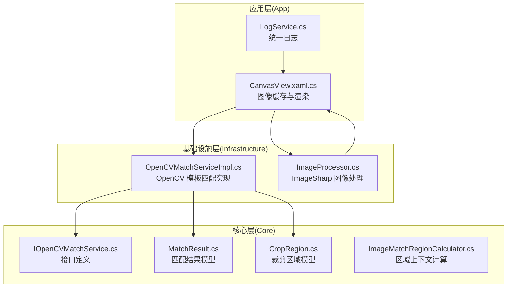
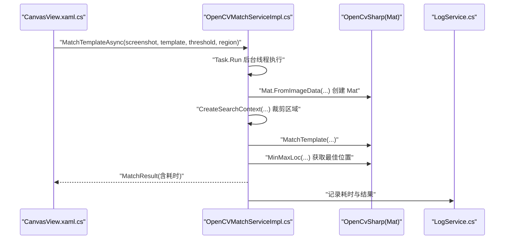
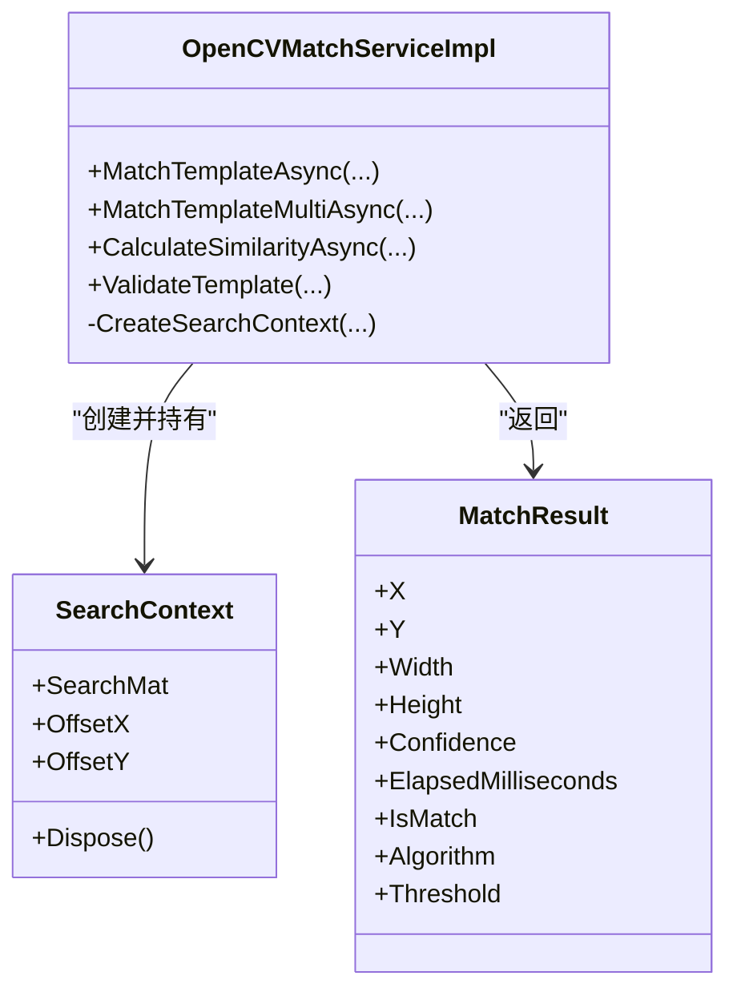
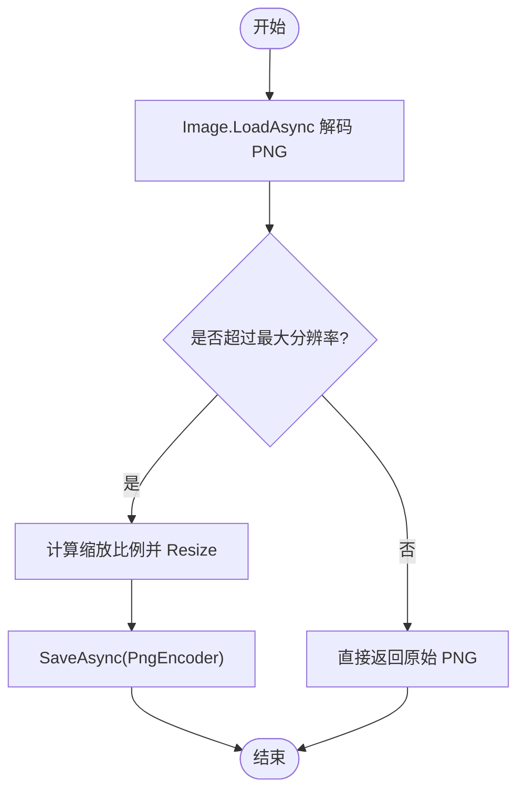
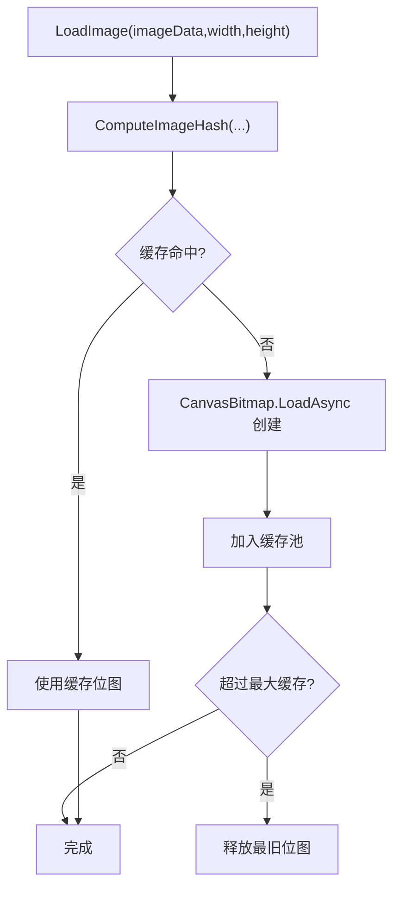
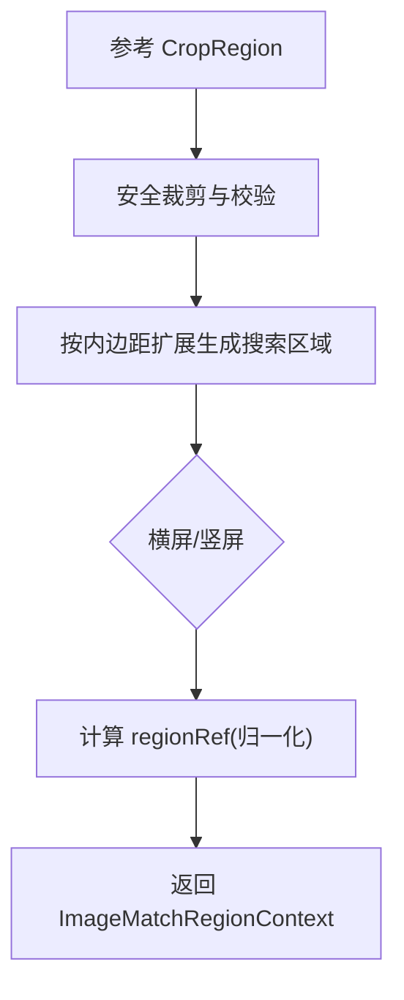
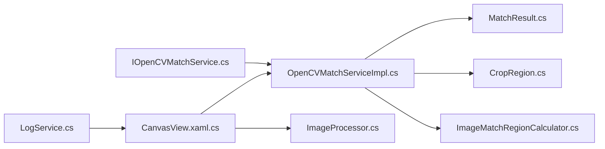

# 性能优化与内存管理

<cite>
**本文引用的文件**
- [OpenCVMatchServiceImpl.cs](file://Infrastructure/Imaging/OpenCVMatchServiceImpl.cs)
- [IOpenCVMatchService.cs](file://Core/Abstractions/IOpenCVMatchService.cs)
- [MatchResult.cs](file://Core/Models/MatchResult.cs)
- [CropRegion.cs](file://Core/Models/CropRegion.cs)
- [ImageMatchRegionCalculator.cs](file://Core/Helpers/ImageMatchRegionCalculator.cs)
- [ImageProcessor.cs](file://Infrastructure/Imaging/ImageProcessor.cs)
- [CanvasView.xaml.cs](file://App/Views/CanvasView.xaml.cs)
- [LogService.cs](file://App/Services/LogService.cs)
- [autojs6-image-match-helper.js](file://App/CodeTemplates/image/autojs6-image-match-helper.js)
- [AGENTS.md](file://AGENTS.md)
- [tasks.md](file://openspec/changes/winui3-visual-dev-toolkit/tasks.md)
</cite>

## 目录
1. [简介](#简介)
2. [项目结构](#项目结构)
3. [核心组件](#核心组件)
4. [架构总览](#架构总览)
5. [详细组件分析](#详细组件分析)
6. [依赖关系分析](#依赖关系分析)
7. [性能考量](#性能考量)
8. [故障排除指南](#故障排除指南)
9. [结论](#结论)
10. [附录](#附录)

## 简介
本技术文档聚焦于图像处理引擎的性能优化与内存管理，围绕以下主题展开：
- 异步处理机制与线程池配置：重点剖析 MatchTemplateAsync 的并发策略与后台线程调度。
- OpenCV Mat 生命周期与内存释放：系统性说明 IDisposable 模式与资源释放最佳实践。
- 图像数据缓存与重复计算规避：结合 CanvasBitmap 缓存池与阈值滑动优化。
- 性能监控与瓶颈分析：基于 Stopwatch 的计时与性能指标采集。
- 大图像处理、批量匹配与实时预览的优化策略与示例路径。
- 内存泄漏防护、垃圾回收优化与资源清理的工程实践。
- 不同硬件配置下的调优建议与故障排除。

## 项目结构
该仓库采用分层架构：
- Core 层：抽象接口、模型与辅助工具（如区域计算器）。
- Infrastructure 层：具体实现（OpenCV 模板匹配、ImageSharp 图像处理）。
- App 层：UI 视图、服务与代码模板（AutoJS 脚本生成与图像回收）。

图表来源
- [OpenCVMatchServiceImpl.cs:11-204](file://Infrastructure/Imaging/OpenCVMatchServiceImpl.cs#L11-L204)
- [IOpenCVMatchService.cs:8-56](file://Core/Abstractions/IOpenCVMatchService.cs#L8-L56)
- [MatchResult.cs:6-62](file://Core/Models/MatchResult.cs#L6-L62)
- [CropRegion.cs:6-52](file://Core/Models/CropRegion.cs#L6-L52)
- [ImageMatchRegionCalculator.cs:35-98](file://Core/Helpers/ImageMatchRegionCalculator.cs#L35-L98)
- [ImageProcessor.cs:13-161](file://Infrastructure/Imaging/ImageProcessor.cs#L13-L161)
- [CanvasView.xaml.cs:358-456](file://App/Views/CanvasView.xaml.cs#L358-L456)
- [LogService.cs:9-50](file://App/Services/LogService.cs#L9-L50)

章节来源
- [OpenCVMatchServiceImpl.cs:11-204](file://Infrastructure/Imaging/OpenCVMatchServiceImpl.cs#L11-L204)
- [IOpenCVMatchService.cs:8-56](file://Core/Abstractions/IOpenCVMatchService.cs#L8-L56)
- [ImageProcessor.cs:13-161](file://Infrastructure/Imaging/ImageProcessor.cs#L13-L161)
- [CanvasView.xaml.cs:358-456](file://App/Views/CanvasView.xaml.cs#L358-L456)

## 核心组件
- OpenCV 模板匹配服务：提供单次最佳匹配、多匹配与相似度计算，并内置区域裁剪与计时。
- 图像处理器：提供 PNG 解码、降采样、裁剪与元数据生成等能力。
- Canvas 图像缓存：基于 CanvasBitmap 的缓存池与哈希键管理，避免重复纹理创建。
- 日志服务：统一日志入口，便于性能与错误追踪。
- AutoJS 脚本模板：提供图像回收的安全函数，防止脚本侧内存泄漏。

章节来源
- [OpenCVMatchServiceImpl.cs:13-148](file://Infrastructure/Imaging/OpenCVMatchServiceImpl.cs#L13-L148)
- [ImageProcessor.cs:21-161](file://Infrastructure/Imaging/ImageProcessor.cs#L21-L161)
- [CanvasView.xaml.cs:358-456](file://App/Views/CanvasView.xaml.cs#L358-L456)
- [LogService.cs:9-50](file://App/Services/LogService.cs#L9-L50)
- [autojs6-image-match-helper.js:501-523](file://App/CodeTemplates/image/autojs6-image-match-helper.js#L501-L523)

## 架构总览
下图展示了从 UI 到图像处理与 OpenCV 计算的整体流程，以及关键的异步与资源管理点。

图表来源
- [OpenCVMatchServiceImpl.cs:20-60](file://Infrastructure/Imaging/OpenCVMatchServiceImpl.cs#L20-L60)
- [CanvasView.xaml.cs:358-426](file://App/Views/CanvasView.xaml.cs#L358-L426)
- [LogService.cs:39-49](file://App/Services/LogService.cs#L39-L49)

## 详细组件分析

### OpenCV 模板匹配服务（并发与内存）
- 并发策略
  - 使用 Task.Run 将 CPU 密集型 OpenCV 计算迁移至线程池后台线程，避免阻塞 UI。
  - 支持 CancellationToken 以响应取消请求。
- 内存管理
  - 所有 Mat 对象均通过 using 语句或显式 Dispose 管理生命周期，确保非托管内存及时释放。
  - SearchContext 实现 IDisposable，在拥有 Mat 时负责释放底层 Mat。
- 计时与指标
  - 使用 Stopwatch 记录匹配耗时，并写入 MatchResult.ElapsedMilliseconds。
- 区域裁剪
  - CreateSearchContext 对输入区域进行安全裁剪，必要时创建子 Mat 并记录偏移，保证坐标转换正确。

图表来源
- [OpenCVMatchServiceImpl.cs:11-204](file://Infrastructure/Imaging/OpenCVMatchServiceImpl.cs#L11-L204)
- [MatchResult.cs:6-62](file://Core/Models/MatchResult.cs#L6-L62)

章节来源
- [OpenCVMatchServiceImpl.cs:13-148](file://Infrastructure/Imaging/OpenCVMatchServiceImpl.cs#L13-L148)
- [MatchResult.cs:6-62](file://Core/Models/MatchResult.cs#L6-L62)

### 图像处理与降采样（内存与 I/O）
- 解码与像素数据提取：使用 ImageSharp 异步解码 PNG，CopyPixelData 提取像素数组。
- 降采样：根据最大分辨率阈值（1920x1080）按比例缩放，保持宽高比。
- 裁剪：验证边界后裁剪并重新编码为 PNG。
- 元数据生成：序列化包含原始尺寸、裁剪区域与时间戳的 JSON。

图表来源
- [ImageProcessor.cs:47-72](file://Infrastructure/Imaging/ImageProcessor.cs#L47-L72)

章节来源
- [ImageProcessor.cs:21-161](file://Infrastructure/Imaging/ImageProcessor.cs#L21-L161)

### Canvas 图像缓存与渲染（GPU 纹理复用）
- 缓存键：基于宽度、高度、数据长度与前若干字节的组合生成哈希。
- 缓存池：命中则复用 CanvasBitmap，未命中则创建并加入缓存，超过容量时逐出最旧项。
- 资源释放：旧位图若不再被缓存引用则主动 Dispose，避免内存堆积。
- 预览与交互：支持缩放、平移与自适应窗口，减少不必要的重绘。

图表来源
- [CanvasView.xaml.cs:358-426](file://App/Views/CanvasView.xaml.cs#L358-L426)
- [CanvasView.xaml.cs:448-456](file://App/Views/CanvasView.xaml.cs#L448-L456)

章节来源
- [CanvasView.xaml.cs:358-456](file://App/Views/CanvasView.xaml.cs#L358-L456)

### 匹配区域上下文与阈值滑动优化
- 区域上下文：根据参考矩形与内边距生成搜索区域，并计算 regionRef（归一化）。
- 阈值滑动：仅重算匹配层，不重建图像纹理，降低 GPU/CPU 开销。
- 坐标一致性：统一左上角原点，简化 UI 与图像坐标的映射。

图表来源
- [ImageMatchRegionCalculator.cs:40-97](file://Core/Helpers/ImageMatchRegionCalculator.cs#L40-L97)

章节来源
- [ImageMatchRegionCalculator.cs:35-98](file://Core/Helpers/ImageMatchRegionCalculator.cs#L35-L98)
- [AGENTS.md:229-247](file://AGENTS.md#L229-L247)

### AutoJS 脚本中的图像回收
- 提供 safeRecycleImage 与 safeRecycleFeatures 函数，避免重复回收与异常。
- 建议在脚本侧主动回收不再使用的图像对象，配合前端缓存策略形成闭环。

章节来源
- [autojs6-image-match-helper.js:501-523](file://App/CodeTemplates/image/autojs6-image-match-helper.js#L501-L523)

## 依赖关系分析
- 接口与实现分离：IOpenCVMatchService 定义异步匹配契约，OpenCVMatchServiceImpl 提供具体实现。
- 模型与工具：MatchResult、CropRegion 作为跨层数据载体；ImageMatchRegionCalculator 提供区域计算。
- UI 与服务：CanvasView 依赖 OpenCV 与 ImageSharp 进行图像加载与缓存；LogService 作为统一日志入口。

图表来源
- [IOpenCVMatchService.cs:8-56](file://Core/Abstractions/IOpenCVMatchService.cs#L8-L56)
- [OpenCVMatchServiceImpl.cs:11-204](file://Infrastructure/Imaging/OpenCVMatchServiceImpl.cs#L11-L204)
- [MatchResult.cs:6-62](file://Core/Models/MatchResult.cs#L6-L62)
- [CropRegion.cs:6-52](file://Core/Models/CropRegion.cs#L6-L52)
- [ImageMatchRegionCalculator.cs:35-98](file://Core/Helpers/ImageMatchRegionCalculator.cs#L35-L98)
- [ImageProcessor.cs:13-161](file://Infrastructure/Imaging/ImageProcessor.cs#L13-L161)
- [CanvasView.xaml.cs:358-456](file://App/Views/CanvasView.xaml.cs#L358-L456)
- [LogService.cs:9-50](file://App/Services/LogService.cs#L9-L50)

章节来源
- [IOpenCVMatchService.cs:8-56](file://Core/Abstractions/IOpenCVMatchService.cs#L8-L56)
- [OpenCVMatchServiceImpl.cs:11-204](file://Infrastructure/Imaging/OpenCVMatchServiceImpl.cs#L11-L204)
- [CanvasView.xaml.cs:358-456](file://App/Views/CanvasView.xaml.cs#L358-L456)

## 性能考量

### 异步处理与线程池配置
- MatchTemplateAsync 通过 Task.Run 将 OpenCV 计算放入线程池，避免阻塞 UI。
- 建议：
  - 使用 ConfigureAwait(false) 于非 UI 上下文，减少上下文切换开销。
  - 对高频调用场景，考虑外部线程池或信号量限制并发数，避免过度抢占。
  - 为长耗时任务提供取消令牌，保障用户体验。

章节来源
- [OpenCVMatchServiceImpl.cs:20-60](file://Infrastructure/Imaging/OpenCVMatchServiceImpl.cs#L20-L60)
- [AGENTS.md:231-237](file://AGENTS.md#L231-L237)

### OpenCV Mat 生命周期与内存释放
- 关键原则：
  - 所有 Mat 对象在创建后尽快进入 using 或显式 Dispose。
  - SearchContext 在拥有 Mat 时负责释放，避免悬挂引用。
  - 大图像处理时优先使用区域裁剪，缩小 Mat 尺寸。
- 最佳实践：
  - 避免在 UI 线程中直接构造/销毁 Mat。
  - 对临时中间结果（如 MatchTemplate 结果 Mat）立即释放。

章节来源
- [OpenCVMatchServiceImpl.cs:179-202](file://Infrastructure/Imaging/OpenCVMatchServiceImpl.cs#L179-L202)

### 图像数据缓存与重复计算规避
- CanvasBitmap 缓存池：
  - 基于图像哈希键缓存纹理，命中则直接复用。
  - 超限时逐出最旧项，避免无限增长。
- 阈值滑动优化：
  - 仅重算匹配层，不重建图像纹理，显著降低 GPU/CPU 压力。
- I/O 与解码：
  - 使用 ImageSharp 异步解码与编码，避免阻塞主线程。

章节来源
- [CanvasView.xaml.cs:358-456](file://App/Views/CanvasView.xaml.cs#L358-L456)
- [ImageProcessor.cs:21-72](file://Infrastructure/Imaging/ImageProcessor.cs#L21-L72)
- [AGENTS.md:240-247](file://AGENTS.md#L240-L247)

### 性能监控与瓶颈分析
- 计时与指标：
  - 使用 Stopwatch 记录匹配耗时，并写入 MatchResult.ElapsedMilliseconds。
  - 通过 LogService 输出统一日志，便于聚合分析。
- 建议指标：
  - 单次匹配耗时分布、缓存命中率、CPU/内存峰值、UI 帧率。
- 工具与方法：
  - 使用性能分析器定位热点函数（如 MatchTemplate）。
  - 对高频调用进行采样统计，识别异常波动。

章节来源
- [OpenCVMatchServiceImpl.cs:24-53](file://Infrastructure/Imaging/OpenCVMatchServiceImpl.cs#L24-L53)
- [LogService.cs:39-49](file://App/Services/LogService.cs#L39-L49)

### 大图像处理、批量匹配与实时预览优化
- 大图像处理：
  - 优先降采样至目标分辨率以内（1920x1080），减少计算复杂度。
  - 使用区域裁剪（CropRegion）限定搜索范围。
- 批量匹配：
  - 使用 MatchTemplateMultiAsync 返回所有高于阈值的结果，避免多次全图扫描。
  - 对结果进行去重与排序，提升后续处理效率。
- 实时预览：
  - 阈值滑动仅重算匹配层，不重建图像纹理。
  - 使用 CanvasBitmap 缓存池，避免重复纹理创建。

章节来源
- [ImageProcessor.cs:47-72](file://Infrastructure/Imaging/ImageProcessor.cs#L47-L72)
- [OpenCVMatchServiceImpl.cs:62-122](file://Infrastructure/Imaging/OpenCVMatchServiceImpl.cs#L62-L122)
- [AGENTS.md:244-247](file://AGENTS.md#L244-L247)

### 内存泄漏防护、GC 优化与资源清理
- 泄漏防护：
  - 所有 Mat 与 CanvasBitmap 均需显式释放或进入 using。
  - AutoJS 脚本侧使用 safeRecycleImage/safeRecycleFeatures 回收图像。
- GC 优化：
  - 避免频繁小对象分配，尽量复用缓冲区与集合。
  - 控制缓存大小，定期清理最旧项。
- 资源清理：
  - UI 离开时调用 ClearBitmapCache，释放所有缓存位图。
  - 日志与定时器等资源在合适时机停止与释放。

章节来源
- [CanvasView.xaml.cs:448-456](file://App/Views/CanvasView.xaml.cs#L448-L456)
- [autojs6-image-match-helper.js:501-523](file://App/CodeTemplates/image/autojs6-image-match-helper.js#L501-L523)

### 不同硬件配置下的调优建议
- 低性能设备：
  - 降低目标分辨率（小于 1920x1080），提高降采样阈值。
  - 限制并发匹配任务数量，使用信号量控制。
  - 增大区域裁剪内边距，减少搜索空间。
- 高性能设备：
  - 适当放宽阈值，提升召回率。
  - 启用更复杂的匹配算法（如多模板匹配）以提升鲁棒性。
  - 优化 UI 渲染，启用虚拟化与分层渲染。

章节来源
- [ImageProcessor.cs:15-16](file://Infrastructure/Imaging/ImageProcessor.cs#L15-L16)
- [AGENTS.md:229-247](file://AGENTS.md#L229-L247)

## 故障排除指南
- 匹配结果为空或异常：
  - 检查输入图像是否为空或尺寸不一致。
  - 确认区域裁剪参数合法，避免越界。
  - 查看日志输出，定位耗时异常的任务。
- UI 卡顿或掉帧：
  - 确认 OpenCV 计算已在后台线程执行。
  - 检查 CanvasBitmap 缓存是否过大，必要时降低缓存上限。
- 内存持续上涨：
  - 确认 Mat 与 CanvasBitmap 是否正确释放。
  - 检查 AutoJS 脚本侧是否遗漏图像回收。
- 性能波动：
  - 使用 Stopwatch 与日志统计耗时分布，识别异常峰值。
  - 对高频调用进行采样与回归测试，定位回归点。

章节来源
- [OpenCVMatchServiceImpl.cs:29-32](file://Infrastructure/Imaging/OpenCVMatchServiceImpl.cs#L29-L32)
- [CanvasView.xaml.cs:358-456](file://App/Views/CanvasView.xaml.cs#L358-L456)
- [LogService.cs:39-49](file://App/Services/LogService.cs#L39-L49)

## 结论
本项目通过“异步 + 线程池 + 缓存 + 计时”的组合策略，在保证 UI 流畅的同时实现了高效的图像匹配与渲染。OpenCV Mat 的严格生命周期管理与 CanvasBitmap 缓存池有效降低了内存与 GPU 压力。建议在实际部署中结合硬件配置与业务场景，进一步细化并发控制、缓存策略与日志监控，以获得更稳定的性能表现。

## 附录
- 示例路径（不展示代码内容，仅提供定位）：
  - [异步模板匹配实现:20-60](file://Infrastructure/Imaging/OpenCVMatchServiceImpl.cs#L20-L60)
  - [多匹配实现:69-122](file://Infrastructure/Imaging/OpenCVMatchServiceImpl.cs#L69-L122)
  - [相似度计算:126-147](file://Infrastructure/Imaging/OpenCVMatchServiceImpl.cs#L126-L147)
  - [区域裁剪与偏移:163-177](file://Infrastructure/Imaging/OpenCVMatchServiceImpl.cs#L163-L177)
  - [Canvas 图像缓存:358-456](file://App/Views/CanvasView.xaml.cs#L358-L456)
  - [日志服务:39-49](file://App/Services/LogService.cs#L39-L49)
  - [AutoJS 图像回收:501-523](file://App/CodeTemplates/image/autojs6-image-match-helper.js#L501-L523)