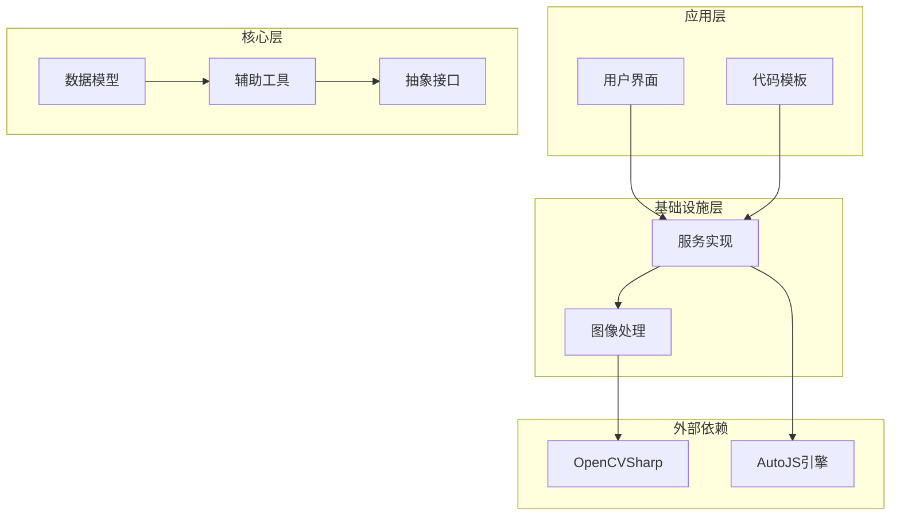
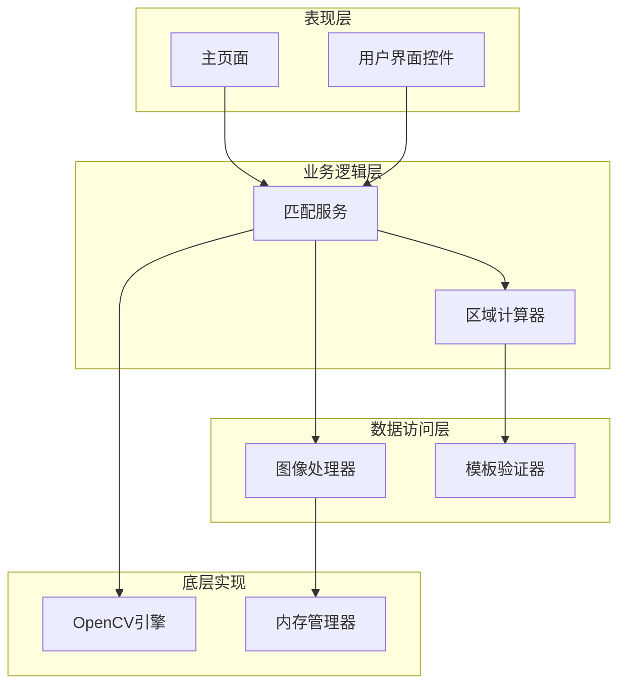
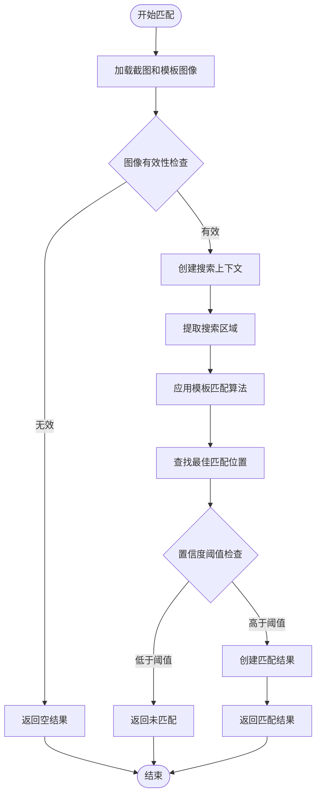
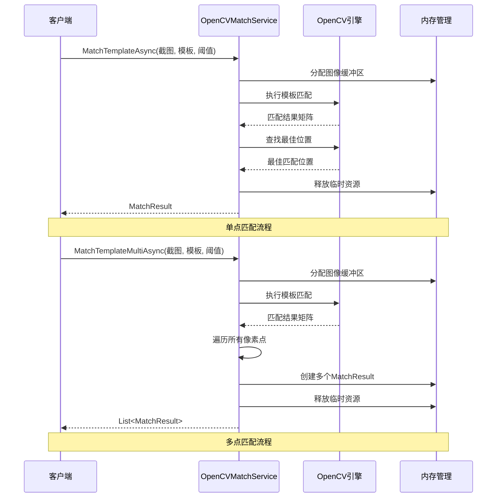
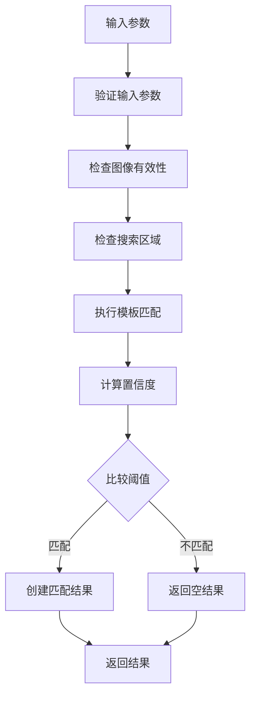
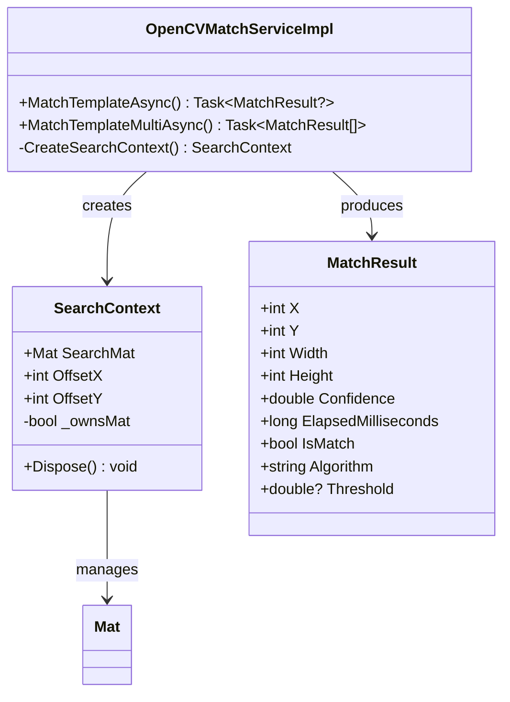
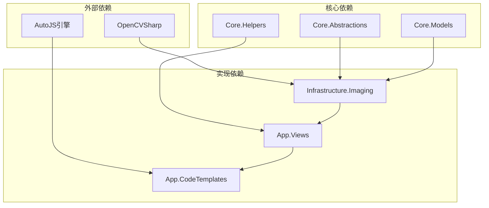
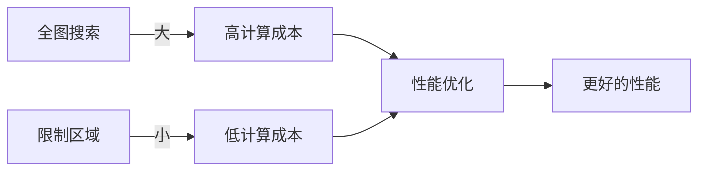
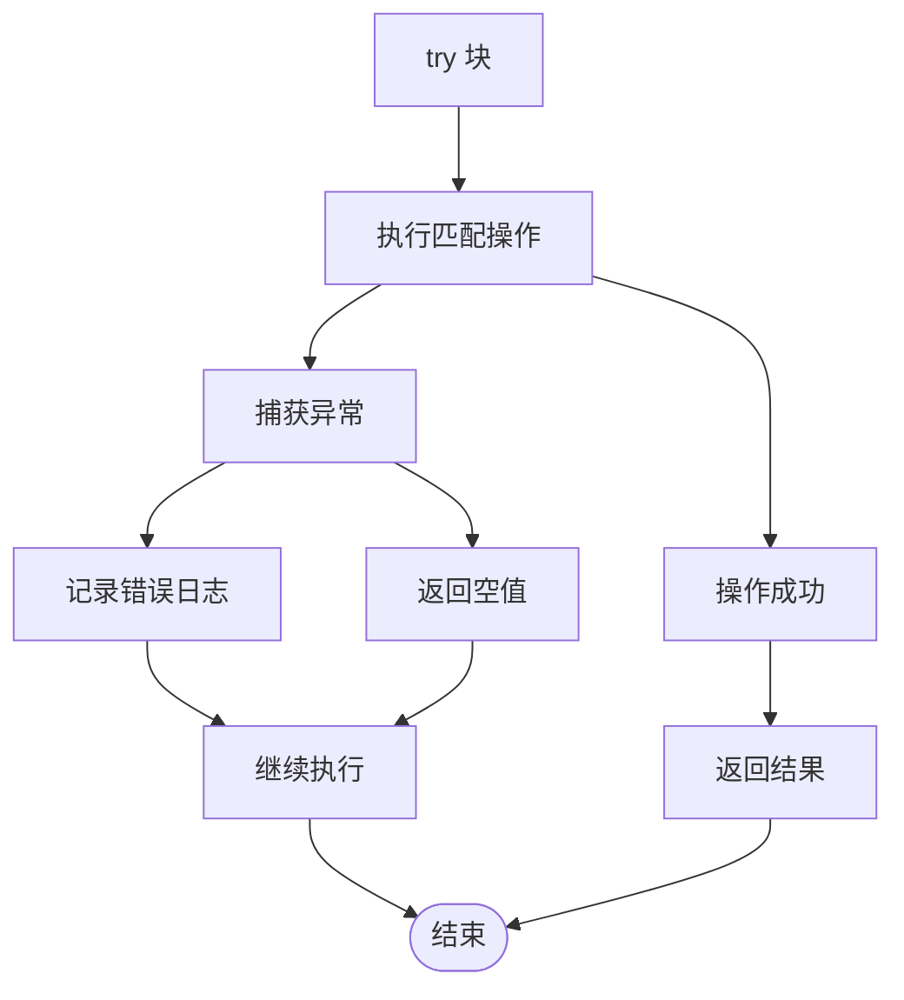

# 模板匹配算法实现

<cite>
**本文档引用的文件**
- [OpenCVMatchServiceImpl.cs](file://Infrastructure/Imaging/OpenCVMatchServiceImpl.cs)
- [IOpenCVMatchService.cs](file://Core/Abstractions/IOpenCVMatchService.cs)
- [MatchResult.cs](file://Core/Models/MatchResult.cs)
- [CropRegion.cs](file://Core/Models/CropRegion.cs)
- [ImageMatchRegionCalculator.cs](file://Core/Helpers/ImageMatchRegionCalculator.cs)
- [MainPage.Match.cs](file://App/Views/MainPage.Match.cs)
- [MainPage.ImageCodeTemplates.NativeMatchTemplate.cs](file://App/Views/MainPage.ImageCodeTemplates.NativeMatchTemplate.cs)
- [autojs6-image-match-helper.js](file://App/CodeTemplates/image/autojs6-image-match-helper.js)
- [UnitTests.cs](file://App.Tests/UnitTests.cs)
</cite>

## 目录
1. [简介](#简介)
2. [项目结构](#项目结构)
3. [核心组件](#核心组件)
4. [架构概览](#架构概览)
5. [详细组件分析](#详细组件分析)
6. [依赖关系分析](#依赖关系分析)
7. [性能考虑](#性能考虑)
8. [故障排除指南](#故障排除指南)
9. [结论](#结论)
10. [附录](#附录)

## 简介

本文件为模板匹配算法实现的技术文档，重点解析 OpenCVMatchServiceImpl 中的像素级模板匹配算法，特别是归一化相关匹配（TM_CCOEFF_NORMED）的数学原理和实现细节。文档详细说明 MatchTemplateAsync 和 MatchTemplateMultiAsync 方法的区别和使用场景，包括单点匹配和多点匹配的性能考虑。阐述阈值筛选机制、置信度计算和匹配结果处理逻辑。解释搜索上下文（SearchContext）的设计理念和内存管理策略。提供具体的代码示例展示如何配置匹配参数、处理异常情况和优化匹配性能。包含算法复杂度分析和实际应用场景的最佳实践。

## 项目结构

该项目采用分层架构设计，主要分为以下层次：

**图表来源**
- [OpenCVMatchServiceImpl.cs:1-204](file://Infrastructure/Imaging/OpenCVMatchServiceImpl.cs#L1-L204)
- [IOpenCVMatchService.cs:1-57](file://Core/Abstractions/IOpenCVMatchService.cs#L1-L57)

**章节来源**
- [OpenCVMatchServiceImpl.cs:1-204](file://Infrastructure/Imaging/OpenCVMatchServiceImpl.cs#L1-L204)
- [IOpenCVMatchService.cs:1-57](file://Core/Abstractions/IOpenCVMatchService.cs#L1-L57)

## 核心组件

### OpenCVMatchServiceImpl 类

OpenCVMatchServiceImpl 是模板匹配算法的核心实现类，提供了完整的图像模板匹配功能。该类实现了 IOpenCVMatchService 接口，包含以下关键方法：

#### 主要方法概述

1. **MatchTemplateAsync**: 异步执行单个最佳匹配
2. **MatchTemplateMultiAsync**: 异步执行多点匹配
3. **CalculateSimilarityAsync**: 计算两张图片的相似度
4. **ValidateTemplate**: 验证模板的有效性

#### 关键特性

- 使用异步编程模型，避免阻塞主线程
- 支持区域搜索和全图搜索
- 提供多种匹配算法支持
- 内存管理优化，使用 using 语句确保资源释放

**章节来源**
- [OpenCVMatchServiceImpl.cs:11-204](file://Infrastructure/Imaging/OpenCVMatchServiceImpl.cs#L11-L204)
- [IOpenCVMatchService.cs:8-56](file://Core/Abstractions/IOpenCVMatchService.cs#L8-L56)

## 架构概览

模板匹配系统采用分层架构，各层职责明确：

**图表来源**
- [OpenCVMatchServiceImpl.cs:163-202](file://Infrastructure/Imaging/OpenCVMatchServiceImpl.cs#L163-L202)
- [ImageMatchRegionCalculator.cs:35-99](file://Core/Helpers/ImageMatchRegionCalculator.cs#L35-L99)

## 详细组件分析

### 归一化相关匹配算法（TM_CCOEFF_NORMED）

#### 数学原理

归一化相关匹配（TM_CCOEFF_NORMED）是OpenCV中最常用的模板匹配算法之一。其数学原理基于皮尔逊相关系数的归一化形式：

1. **匹配公式**: 对于每个可能的位置 (x,y)，计算模板与图像块的相关系数
2. **归一化处理**: 将匹配结果除以标准差，使结果范围限定在 [-1, 1]
3. **相似度评估**: 结果越接近 1 表示匹配度越高，结果越接近 -1 表示匹配度越低

#### 实现细节

**图表来源**
- [OpenCVMatchServiceImpl.cs:20-60](file://Infrastructure/Imaging/OpenCVMatchServiceImpl.cs#L20-L60)
- [OpenCVMatchServiceImpl.cs:37-53](file://Infrastructure/Imaging/OpenCVMatchServiceImpl.cs#L37-L53)

#### 算法步骤详解

1. **图像加载**: 使用 Mat.FromImageData 将字节数组转换为OpenCV矩阵
2. **搜索区域创建**: 通过 CreateSearchContext 方法创建搜索上下文
3. **模板匹配**: 调用 Cv2.MatchTemplate 执行匹配操作
4. **最佳匹配定位**: 使用 Cv2.MinMaxLoc 获取最大值位置
5. **结果封装**: 创建 MatchResult 对象返回给调用方

**章节来源**
- [OpenCVMatchServiceImpl.cs:20-60](file://Infrastructure/Imaging/OpenCVMatchServiceImpl.cs#L20-L60)
- [OpenCVMatchServiceImpl.cs:37-53](file://Infrastructure/Imaging/OpenCVMatchServiceImpl.cs#L37-L53)

### MatchTemplateAsync vs MatchTemplateMultiAsync

#### 单点匹配（MatchTemplateAsync）

单点匹配方法适用于只需要找到最佳匹配位置的场景：

**特点**:
- 返回单个最佳匹配结果
- 性能最优，计算量最小
- 适合精确目标定位
- 内存占用最少

**使用场景**:
- 精确按钮点击定位
- 唯一标识符检测
- 状态图标识别

#### 多点匹配（MatchTemplateMultiAsync）

多点匹配方法适用于需要发现所有符合条件的匹配位置：

**特点**:
- 返回所有超过阈值的匹配结果
- 计算量较大，遍历整个结果矩阵
- 适合重复元素检测
- 内存占用相对较高

**使用场景**:
- 列表项批量检测
- 多个相同图标识别
- 游戏界面元素扫描

**图表来源**
- [OpenCVMatchServiceImpl.cs:13-60](file://Infrastructure/Imaging/OpenCVMatchServiceImpl.cs#L13-L60)
- [OpenCVMatchServiceImpl.cs:62-122](file://Infrastructure/Imaging/OpenCVMatchServiceImpl.cs#L62-L122)

**章节来源**
- [OpenCVMatchServiceImpl.cs:13-122](file://Infrastructure/Imaging/OpenCVMatchServiceImpl.cs#L13-L122)

### 阈值筛选机制与置信度计算

#### 置信度阈值设计

置信度阈值是模板匹配中的关键参数，直接影响匹配的准确性和鲁棒性：

**阈值范围**: 0.0 - 1.0
- **高阈值 (0.9-1.0)**: 严格匹配，误检率低，漏检率高
- **中等阈值 (0.7-0.9)**: 平衡匹配精度和召回率
- **低阈值 (0.5-0.7)**: 宽松匹配，召回率高，误检率增加

#### 置信度计算逻辑

**图表来源**
- [OpenCVMatchServiceImpl.cs:22-58](file://Infrastructure/Imaging/OpenCVMatchServiceImpl.cs#L22-L58)
- [OpenCVMatchServiceImpl.cs:94-98](file://Infrastructure/Imaging/OpenCVMatchServiceImpl.cs#L94-L98)

**章节来源**
- [OpenCVMatchServiceImpl.cs:22-58](file://Infrastructure/Imaging/OpenCVMatchServiceImpl.cs#L22-L58)
- [OpenCVMatchServiceImpl.cs:94-98](file://Infrastructure/Imaging/OpenCVMatchServiceImpl.cs#L94-L98)

### 搜索上下文（SearchContext）设计理念

#### 设计目标

SearchContext 类的设计旨在解决模板匹配中的区域搜索问题，提供灵活的搜索区域管理和内存优化：

**核心功能**:
- 区域边界安全检查
- 坐标偏移计算
- 内存所有权管理
- 资源自动释放

#### 内存管理策略

**图表来源**
- [OpenCVMatchServiceImpl.cs:179-202](file://Infrastructure/Imaging/OpenCVMatchServiceImpl.cs#L179-L202)
- [OpenCVMatchServiceImpl.cs:163-177](file://Infrastructure/Imaging/OpenCVMatchServiceImpl.cs#L163-L177)

#### 坐标系统转换

SearchContext 处理了从搜索区域坐标到完整图像坐标的转换：

**转换公式**:
- 完整图像 X = 搜索区域 X + OffsetX
- 完整图像 Y = 搜索区域 Y + OffsetY

**章节来源**
- [OpenCVMatchServiceImpl.cs:179-202](file://Infrastructure/Imaging/OpenCVMatchServiceImpl.cs#L179-L202)
- [OpenCVMatchServiceImpl.cs:163-177](file://Infrastructure/Imaging/OpenCVMatchServiceImpl.cs#L163-L177)

### 数据模型设计

#### MatchResult 数据结构

MatchResult 类定义了模板匹配的结果数据结构：

**关键属性**:
- **位置信息**: X, Y, Width, Height
- **质量指标**: Confidence, ElapsedMilliseconds
- **判定结果**: IsMatch, Algorithm, Threshold
- **便捷计算**: ClickX, ClickY (点击坐标)

#### CropRegion 数据结构

CropRegion 类描述了图像的裁剪区域信息：

**属性说明**:
- **几何信息**: X, Y, Width, Height
- **元数据**: Name, OriginalWidth, OriginalHeight
- **参考信息**: ReferenceWidth, ReferenceHeight

**章节来源**
- [MatchResult.cs:6-62](file://Core/Models/MatchResult.cs#L6-L62)
- [CropRegion.cs:6-52](file://Core/Models/CropRegion.cs#L6-L52)

## 依赖关系分析

### 组件依赖图

**图表来源**
- [OpenCVMatchServiceImpl.cs:1-5](file://Infrastructure/Imaging/OpenCVMatchServiceImpl.cs#L1-L5)
- [IOpenCVMatchService.cs:1](file://Core/Abstractions/IOpenCVMatchService.cs#L1)

### 外部依赖管理

#### OpenCVSharp 集成

OpenCVSharp 是 .NET 版本的 OpenCV 库，提供了丰富的图像处理功能：

**集成方式**:
- 使用 Mat 类进行图像数据表示
- 通过 Cv2 命名空间访问 OpenCV 功能
- 自动内存管理，减少内存泄漏风险

**章节来源**
- [OpenCVMatchServiceImpl.cs:1-5](file://Infrastructure/Imaging/OpenCVMatchServiceImpl.cs#L1-L5)

## 性能考虑

### 算法复杂度分析

#### 时间复杂度

对于模板大小为 (T_w × T_h)，搜索区域大小为 (S_w × S_h) 的匹配操作：

- **单点匹配**: O((S_w - T_w + 1) × (S_h - T_h + 1) × T_w × T_h)
- **多点匹配**: O((S_w - T_w + 1) × (S_h - T_h + 1) × T_w × T_h)

#### 空间复杂度

- **结果存储**: O(1) 对于单点匹配，O(k) 对于多点匹配（k为匹配数量）
- **中间矩阵**: O(S_w × S_h)
- **总空间**: O(S_w × S_h + k)

### 性能优化策略

#### 1. 区域限制优化

通过限制搜索区域可以显著减少计算量：

#### 2. 阈值调优

合理的阈值设置可以在准确性和性能之间取得平衡：

**阈值选择建议**:
- **高精度场景**: 0.85-0.95
- **一般场景**: 0.7-0.85
- **宽松场景**: 0.5-0.7

#### 3. 模板预处理

对模板进行预处理可以提高匹配效率：

**预处理技术**:
- 模板尺寸标准化
- 边缘增强处理
- 亮度对比度调整

## 故障排除指南

### 常见问题及解决方案

#### 1. 匹配结果为空

**可能原因**:
- 模板图像无效或损坏
- 截图图像格式不支持
- 搜索区域超出图像边界
- 阈值设置过高

**诊断步骤**:
1. 验证模板图像有效性
2. 检查图像格式兼容性
3. 确认搜索区域边界
4. 调整阈值参数

#### 2. 性能问题

**优化措施**:
1. 限制搜索区域范围
2. 降低模板分辨率
3. 调整匹配算法
4. 使用多线程处理

#### 3. 内存泄漏

**预防措施**:
1. 确保使用 using 语句
2. 及时释放 OpenCV 对象
3. 监控内存使用情况

**章节来源**
- [OpenCVMatchServiceImpl.cs:22-58](file://Infrastructure/Imaging/OpenCVMatchServiceImpl.cs#L22-L58)
- [OpenCVMatchServiceImpl.cs:73-83](file://Infrastructure/Imaging/OpenCVMatchServiceImpl.cs#L73-L83)

### 异常处理机制

#### 错误捕获策略

系统采用多层次的异常处理机制：

**图表来源**
- [OpenCVMatchServiceImpl.cs:55-58](file://Infrastructure/Imaging/OpenCVMatchServiceImpl.cs#L55-L58)
- [OpenCVMatchServiceImpl.cs:115-118](file://Infrastructure/Imaging/OpenCVMatchServiceImpl.cs#L115-L118)

**章节来源**
- [OpenCVMatchServiceImpl.cs:55-58](file://Infrastructure/Imaging/OpenCVMatchServiceImpl.cs#L55-L58)
- [OpenCVMatchServiceImpl.cs:115-118](file://Infrastructure/Imaging/OpenCVMatchServiceImpl.cs#L115-L118)

## 结论

模板匹配算法实现通过 OpenCVMatchServiceImpl 提供了高效、可靠的图像匹配功能。该实现具有以下优势：

1. **算法成熟**: 采用经过验证的 TM_CCOEFF_NORMED 算法
2. **性能优化**: 支持异步处理和区域限制
3. **内存安全**: 完善的资源管理和异常处理
4. **扩展性强**: 清晰的接口设计和模块化架构

通过合理配置阈值参数、优化搜索区域和采用适当的预处理技术，可以在保证匹配精度的同时获得良好的性能表现。该系统为自动化测试、图像识别和用户界面交互提供了坚实的技术基础。

## 附录

### 实际应用场景

#### 1. 自动化测试

在自动化测试中，模板匹配主要用于：
- 元素定位和点击
- 界面状态检测
- 功能验证

#### 2. 用户界面分析

用于分析用户界面的：
- 控件识别
- 布局分析
- 交互行为追踪

#### 3. 游戏开发

在游戏开发中的应用：
- 触发器检测
- 状态监控
- 自动化脚本

### 最佳实践建议

#### 1. 参数配置

**模板选择**:
- 选择清晰、对比度高的模板
- 确保模板尺寸适中
- 避免包含动态内容

**阈值设置**:
- 根据具体场景调整阈值
- 考虑光照变化的影响
- 测试不同条件下的稳定性

#### 2. 性能优化

**图像预处理**:
- 统一图像格式和尺寸
- 进行必要的滤波处理
- 优化图像质量

**算法选择**:
- 根据需求选择合适的匹配算法
- 考虑实时性要求
- 平衡准确性和速度

#### 3. 错误处理

**健壮性设计**:
- 实现完善的异常处理
- 提供详细的错误信息
- 建立监控和日志机制

**资源管理**:
- 确保及时释放资源
- 监控内存使用情况
- 避免内存泄漏