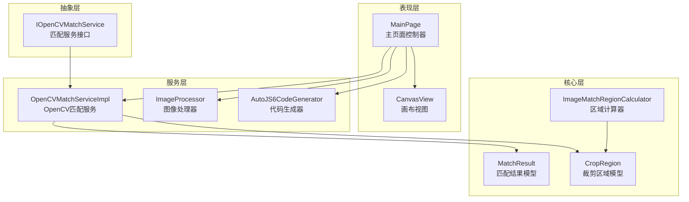
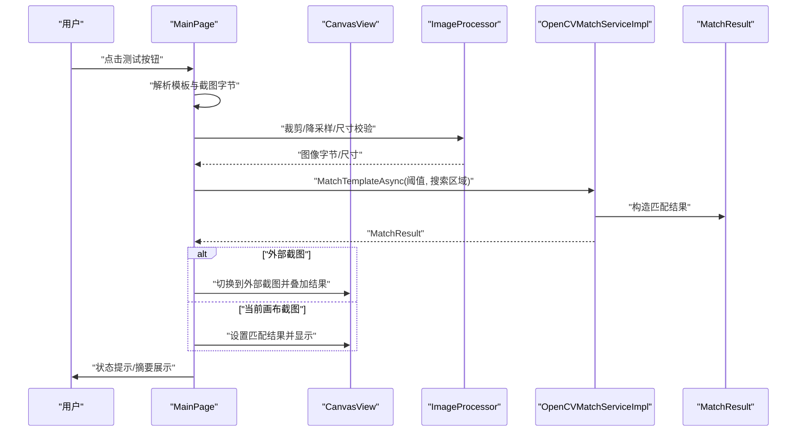
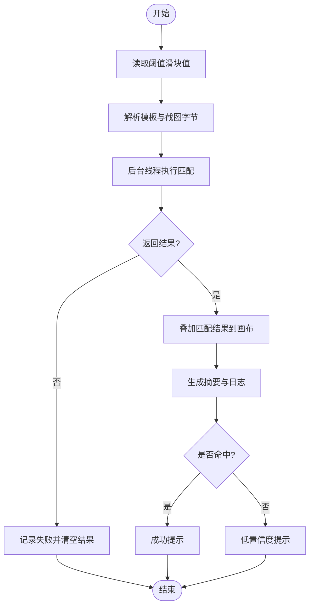
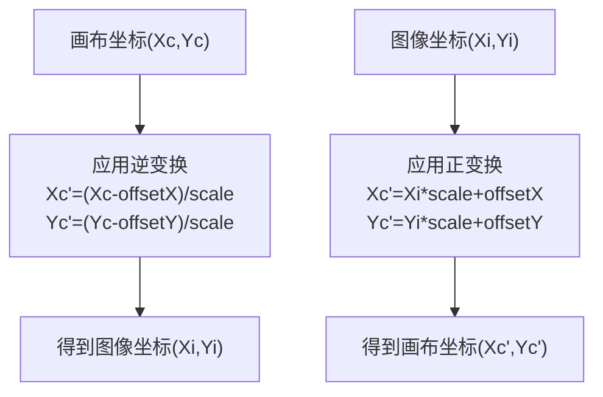
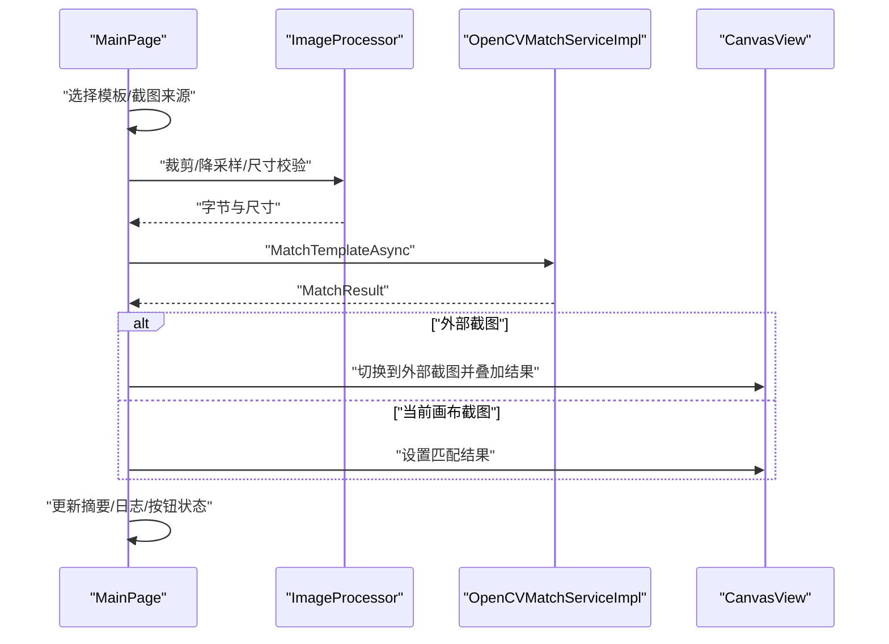
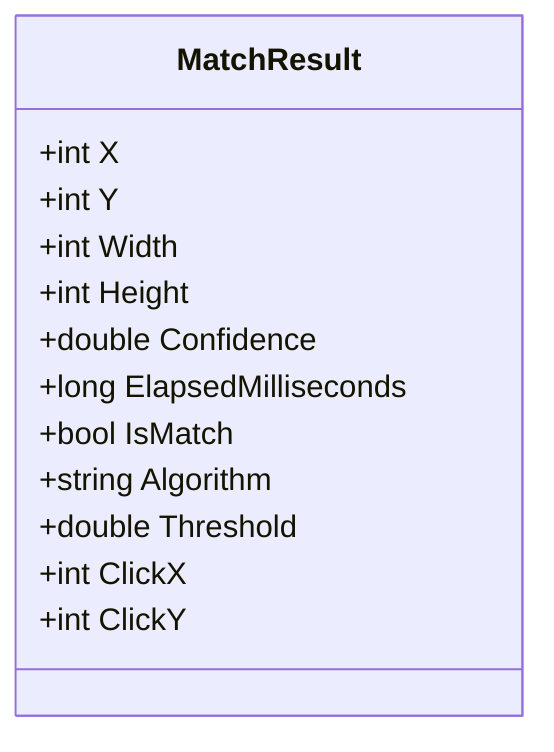
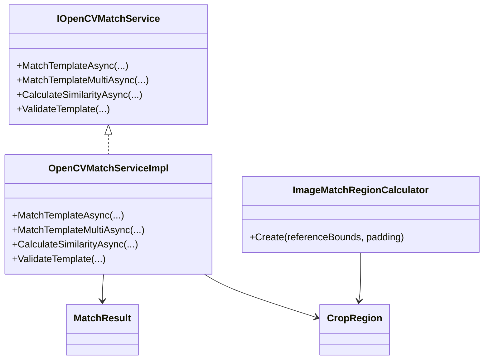
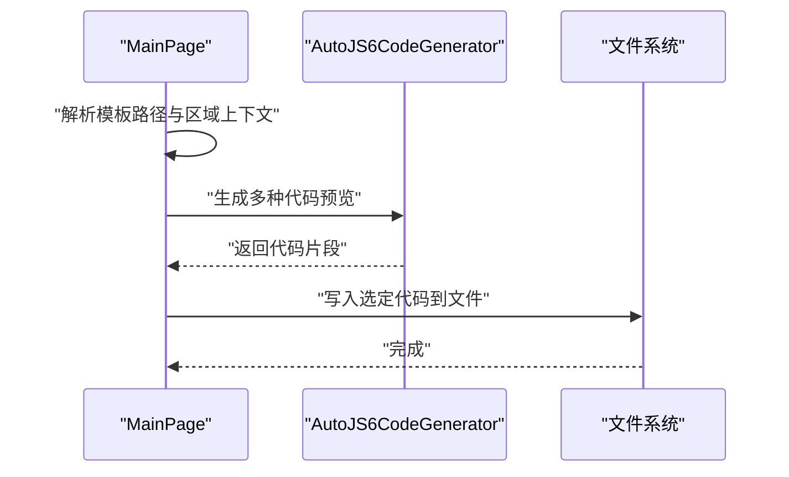
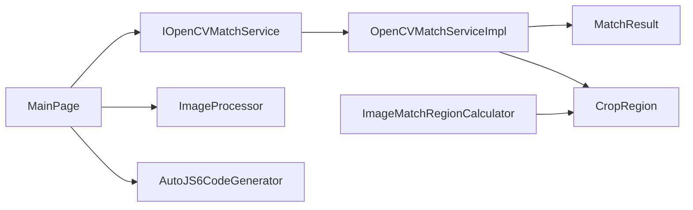

# 实时匹配测试

<cite>
**本文档引用的文件**
- [App/Views/MainPage.xaml.cs](file://App/Views/MainPage.xaml.cs)
- [App/Views/MainPage.Match.cs](file://App/Views/MainPage.Match.cs)
- [App/Views/MainPage.ImageWorkflowState.cs](file://App/Views/MainPage.ImageWorkflowState.cs)
- [App/Views/MainPage.ImageCodeTemplates.cs](file://App/Views/MainPage.ImageCodeTemplates.cs)
- [App/Views/CanvasView.xaml.cs](file://App/Views/CanvasView.xaml.cs)
- [Core/Models/MatchResult.cs](file://Core/Models/MatchResult.cs)
- [Core/Models/CropRegion.cs](file://Core/Models/CropRegion.cs)
- [Core/Models/AutoJS6CodeOptions.cs](file://Core/Models/AutoJS6CodeOptions.cs)
- [Core/Helpers/ImageMatchRegionCalculator.cs](file://Core/Helpers/ImageMatchRegionCalculator.cs)
- [Core/Abstractions/IOpenCVMatchService.cs](file://Core/Abstractions/IOpenCVMatchService.cs)
- [Infrastructure/Imaging/OpenCVMatchServiceImpl.cs](file://Infrastructure/Imaging/OpenCVMatchServiceImpl.cs)
- [Infrastructure/Imaging/ImageProcessor.cs](file://Infrastructure/Imaging/ImageProcessor.cs)
- [Core/Services/AutoJS6CodeGenerator.cs](file://Core/Services/AutoJS6CodeGenerator.cs)
</cite>

## 目录
1. [简介](#简介)
2. [项目结构](#项目结构)
3. [核心组件](#核心组件)
4. [架构总览](#架构总览)
5. [详细组件分析](#详细组件分析)
6. [依赖关系分析](#依赖关系分析)
7. [性能考虑](#性能考虑)
8. [故障排查指南](#故障排查指南)
9. [结论](#结论)
10. [附录](#附录)

## 简介
本文件面向 AutoJS6 实时匹配测试系统，围绕“动态阈值调整机制”“坐标对齐检查”“实时测试流程”“MatchResult 数据模型设计”以及“使用指南”展开，帮助开发者与测试人员高效完成模板匹配的调试与落地。

## 项目结构
系统采用分层架构：
- 表现层（App/Views）：主界面、画布视图、交互逻辑
- 核心模型与工具（Core/Models、Core/Helpers）：匹配结果、裁剪区域、区域计算器
- 业务服务（Core/Services）：代码生成器
- 基础设施（Infrastructure/Imaging）：图像处理、OpenCV 匹配服务
- 抽象接口（Core/Abstractions）：匹配服务接口定义

**图表来源**
- [App/Views/MainPage.xaml.cs:1-409](file://App/Views/MainPage.xaml.cs#L1-L409)
- [App/Views/CanvasView.xaml.cs:1-800](file://App/Views/CanvasView.xaml.cs#L1-L800)
- [Core/Models/MatchResult.cs:1-63](file://Core/Models/MatchResult.cs#L1-L63)
- [Core/Models/CropRegion.cs:1-53](file://Core/Models/CropRegion.cs#L1-L53)
- [Core/Helpers/ImageMatchRegionCalculator.cs:1-99](file://Core/Helpers/ImageMatchRegionCalculator.cs#L1-L99)
- [Infrastructure/Imaging/OpenCVMatchServiceImpl.cs:1-204](file://Infrastructure/Imaging/OpenCVMatchServiceImpl.cs#L1-L204)
- [Infrastructure/Imaging/ImageProcessor.cs:1-162](file://Infrastructure/Imaging/ImageProcessor.cs#L1-L162)
- [Core/Services/AutoJS6CodeGenerator.cs:1-357](file://Core/Services/AutoJS6CodeGenerator.cs#L1-L357)
- [Core/Abstractions/IOpenCVMatchService.cs:1-57](file://Core/Abstractions/IOpenCVMatchService.cs#L1-L57)

**章节来源**
- [App/Views/MainPage.xaml.cs:1-409](file://App/Views/MainPage.xaml.cs#L1-L409)
- [App/Views/CanvasView.xaml.cs:1-800](file://App/Views/CanvasView.xaml.cs#L1-L800)

## 核心组件
- 动态阈值调整：通过滑块实时更新阈值，配合“实时预览更新”与“匹配结果反馈”，形成闭环。
- 坐标对齐检查：提供屏幕坐标与 UI 坐标转换、缩放比例适配、偏移量校正、精度验证。
- 实时测试流程：截图加载、模板匹配执行、结果可视化、状态反馈。
- MatchResult 数据模型：记录匹配分数、位置坐标、置信度、时间戳、是否命中等关键信息。
- 代码生成：根据匹配结果生成 AutoJS6 图像模式代码，支持多种模板与重试策略。

**章节来源**
- [App/Views/MainPage.Match.cs:1-229](file://App/Views/MainPage.Match.cs#L1-L229)
- [Core/Models/MatchResult.cs:1-63](file://Core/Models/MatchResult.cs#L1-L63)
- [Core/Helpers/ImageMatchRegionCalculator.cs:1-99](file://Core/Helpers/ImageMatchRegionCalculator.cs#L1-L99)
- [Infrastructure/Imaging/OpenCVMatchServiceImpl.cs:1-204](file://Infrastructure/Imaging/OpenCVMatchServiceImpl.cs#L1-L204)
- [Core/Services/AutoJS6CodeGenerator.cs:1-357](file://Core/Services/AutoJS6CodeGenerator.cs#L1-L357)

## 架构总览
实时匹配测试从用户交互出发，经由主页面控制器协调，调用图像处理与匹配服务，最终在画布上呈现结果，并可生成可运行的 AutoJS6 代码。

**图表来源**
- [App/Views/MainPage.Match.cs:12-83](file://App/Views/MainPage.Match.cs#L12-L83)
- [App/Views/CanvasView.xaml.cs:140-176](file://App/Views/CanvasView.xaml.cs#L140-L176)
- [Infrastructure/Imaging/ImageProcessor.cs:47-100](file://Infrastructure/Imaging/ImageProcessor.cs#L47-L100)
- [Infrastructure/Imaging/OpenCVMatchServiceImpl.cs:13-60](file://Infrastructure/Imaging/OpenCVMatchServiceImpl.cs#L13-L60)

## 详细组件分析

### 动态阈值调整机制
- 阈值滑块控制：滑块值变更时即时更新 UI 文本，作为后续匹配的阈值输入。
- 实时预览更新：每次测试后，将 MatchResult 叠加到画布 Overlay 层，直观显示命中框与点击点。
- 匹配结果反馈：根据是否命中与置信度给出状态提示；未命中时提示最佳置信度。
- 性能优化：匹配在后台线程执行，避免阻塞 UI；画布渲染采用缓存与变换矩阵，减少重绘成本。

**图表来源**
- [App/Views/MainPage.Match.cs:12-83](file://App/Views/MainPage.Match.cs#L12-L83)
- [App/Views/CanvasView.xaml.cs:140-176](file://App/Views/CanvasView.xaml.cs#L140-L176)

**章节来源**
- [App/Views/MainPage.xaml.cs:333-339](file://App/Views/MainPage.xaml.cs#L333-L339)
- [App/Views/MainPage.Match.cs:12-83](file://App/Views/MainPage.Match.cs#L12-L83)
- [App/Views/CanvasView.xaml.cs:140-176](file://App/Views/CanvasView.xaml.cs#L140-L176)

### 坐标对齐检查与屏幕坐标转换
- 屏幕坐标与 UI 坐标转换：提供 CanvasToImage 与 ImageToCanvas 方法，基于缩放与偏移进行双向转换。
- 缩放比例适配：画布支持自适应窗口与 1:1 模式，缩放范围与居中策略保证完整显示。
- 偏移量校正：Overlay 层与图像层使用同一变换矩阵，确保叠加元素与底图精确对齐。
- 精度验证：匹配结果在 Overlay 层按置信度着色，点击点与坐标标注辅助定位。

**图表来源**
- [App/Views/CanvasView.xaml.cs:548-566](file://App/Views/CanvasView.xaml.cs#L548-L566)

**章节来源**
- [App/Views/CanvasView.xaml.cs:472-566](file://App/Views/CanvasView.xaml.cs#L472-L566)
- [App/Views/CanvasView.xaml.cs:678-704](file://App/Views/CanvasView.xaml.cs#L678-L704)

### 实时测试流程
- 测试截图加载：支持设备截图、本地文件截图；外部截图可临时预览并恢复现场。
- 模板匹配执行：根据模板来源（文件或当前裁剪）与截图来源（当前画布或外部文件）解析字节与尺寸。
- 结果可视化：在 Overlay 层绘制匹配框、点击点与置信度文本；支持裁剪区域与控件边界框叠加。
- 状态反馈：根据匹配结果与阈值给出成功/警告/错误提示，并记录日志。

**图表来源**
- [App/Views/MainPage.Match.cs:85-146](file://App/Views/MainPage.Match.cs#L85-L146)
- [Infrastructure/Imaging/ImageProcessor.cs:47-100](file://Infrastructure/Imaging/ImageProcessor.cs#L47-L100)
- [Infrastructure/Imaging/OpenCVMatchServiceImpl.cs:13-60](file://Infrastructure/Imaging/OpenCVMatchServiceImpl.cs#L13-L60)
- [App/Views/CanvasView.xaml.cs:140-176](file://App/Views/CanvasView.xaml.cs#L140-L176)

**章节来源**
- [App/Views/MainPage.Match.cs:12-146](file://App/Views/MainPage.Match.cs#L12-L146)
- [App/Views/CanvasView.xaml.cs:140-176](file://App/Views/CanvasView.xaml.cs#L140-L176)

### MatchResult 数据模型设计
- 关键字段：左上角坐标、宽高、置信度、耗时、是否命中、算法、阈值、点击中心点。
- 语义化属性：ClickX/ClickY 基于 X/Y 与宽高计算，便于直接用于点击。
- 用途：作为匹配结果的统一载体，驱动 UI 叠加与代码生成。

**图表来源**
- [Core/Models/MatchResult.cs:6-62](file://Core/Models/MatchResult.cs#L6-L62)

**章节来源**
- [Core/Models/MatchResult.cs:1-63](file://Core/Models/MatchResult.cs#L1-L63)

### 匹配服务与区域计算器
- 匹配服务接口：定义单次与多次匹配、相似度计算、模板校验等能力。
- OpenCV 实现：使用归一化相关匹配算法，支持裁剪搜索区域与偏移还原。
- 区域计算器：基于参考矩形扩展 padding，生成搜索区域与 regionRef 数组，适配横竖屏。

**图表来源**
- [Core/Abstractions/IOpenCVMatchService.cs:8-56](file://Core/Abstractions/IOpenCVMatchService.cs#L8-L56)
- [Infrastructure/Imaging/OpenCVMatchServiceImpl.cs:11-204](file://Infrastructure/Imaging/OpenCVMatchServiceImpl.cs#L11-L204)
- [Core/Helpers/ImageMatchRegionCalculator.cs:35-99](file://Core/Helpers/ImageMatchRegionCalculator.cs#L35-L99)

**章节来源**
- [Core/Abstractions/IOpenCVMatchService.cs:1-57](file://Core/Abstractions/IOpenCVMatchService.cs#L1-L57)
- [Infrastructure/Imaging/OpenCVMatchServiceImpl.cs:1-204](file://Infrastructure/Imaging/OpenCVMatchServiceImpl.cs#L1-L204)
- [Core/Helpers/ImageMatchRegionCalculator.cs:1-99](file://Core/Helpers/ImageMatchRegionCalculator.cs#L1-L99)

### 代码生成与模板管理
- 代码生成：根据模板路径、regionRef、阈值与重试策略生成 AutoJS6 图像模式代码。
- 模板保存：支持将当前裁剪区域保存为模板文件，或另存外部模板。
- 预览与选择：提供多种代码模板预览，便于选择合适的实现风格。

**图表来源**
- [App/Views/MainPage.ImageCodeTemplates.cs:35-77](file://App/Views/MainPage.ImageCodeTemplates.cs#L35-L77)
- [Core/Services/AutoJS6CodeGenerator.cs:13-102](file://Core/Services/AutoJS6CodeGenerator.cs#L13-L102)

**章节来源**
- [App/Views/MainPage.ImageCodeTemplates.cs:1-255](file://App/Views/MainPage.ImageCodeTemplates.cs#L1-L255)
- [Core/Services/AutoJS6CodeGenerator.cs:1-357](file://Core/Services/AutoJS6CodeGenerator.cs#L1-L357)

## 依赖关系分析
- 松耦合：主页面通过接口 IOpenCVMatchService 调用匹配服务，便于替换实现。
- 可扩展：新增匹配算法只需实现接口；区域计算器可扩展更多适配策略。
- 可维护：数据模型与服务分离，UI 与业务逻辑解耦。

**图表来源**
- [App/Views/MainPage.xaml.cs:48-50](file://App/Views/MainPage.xaml.cs#L48-L50)
- [Core/Abstractions/IOpenCVMatchService.cs:8-56](file://Core/Abstractions/IOpenCVMatchService.cs#L8-L56)
- [Infrastructure/Imaging/OpenCVMatchServiceImpl.cs:11-204](file://Infrastructure/Imaging/OpenCVMatchServiceImpl.cs#L11-L204)
- [Core/Helpers/ImageMatchRegionCalculator.cs:35-99](file://Core/Helpers/ImageMatchRegionCalculator.cs#L35-L99)

**章节来源**
- [App/Views/MainPage.xaml.cs:48-50](file://App/Views/MainPage.xaml.cs#L48-L50)
- [Core/Abstractions/IOpenCVMatchService.cs:1-57](file://Core/Abstractions/IOpenCVMatchService.cs#L1-L57)

## 性能考虑
- 后台匹配：匹配在后台线程执行，避免 UI 卡顿。
- 图像降采样：对高分辨率图像进行降采样，控制内存占用与匹配耗时。
- 画布缓存：CanvasBitmap 缓存池限制数量，避免频繁纹理创建。
- 变换矩阵：统一应用缩放与平移，减少重复计算。
- 搜索区域限定：通过区域计算器生成合理搜索范围，降低匹配复杂度。

**章节来源**
- [Infrastructure/Imaging/OpenCVMatchServiceImpl.cs:19-60](file://Infrastructure/Imaging/OpenCVMatchServiceImpl.cs#L19-L60)
- [Infrastructure/Imaging/ImageProcessor.cs:47-72](file://Infrastructure/Imaging/ImageProcessor.cs#L47-L72)
- [App/Views/CanvasView.xaml.cs:358-426](file://App/Views/CanvasView.xaml.cs#L358-L426)

## 故障排查指南
- 截图失败：检查设备连接与权限；确认截图尺寸日志；尝试重新捕获。
- UI 树拉取失败：确认设备状态与 ADB 权限；检查 XML 内容长度与解析结果。
- 模板无效：验证模板尺寸与格式；使用模板校验接口；确保模板非空且有效。
- 匹配未命中：降低阈值或缩小搜索区域；检查模板与截图一致性；确认坐标转换正确。
- 画布渲染异常：检查缩放与偏移状态；确认缓存未被释放；查看日志中的变换参数。

**章节来源**
- [App/Views/MainPage.xaml.cs:147-178](file://App/Views/MainPage.xaml.cs#L147-L178)
- [App/Views/MainPage.xaml.cs:180-248](file://App/Views/MainPage.xaml.cs#L180-L248)
- [Infrastructure/Imaging/OpenCVMatchServiceImpl.cs:150-161](file://Infrastructure/Imaging/OpenCVMatchServiceImpl.cs#L150-L161)
- [App/Views/CanvasView.xaml.cs:572-627](file://App/Views/CanvasView.xaml.cs#L572-L627)

## 结论
该系统通过清晰的分层设计与完善的匹配链路，实现了从“动态阈值调整”到“实时结果反馈”的闭环。结合坐标转换、区域计算器与代码生成，能够高效支撑 AutoJS6 的模板匹配落地，适合在多机型、多分辨率场景下进行稳定可靠的自动化测试。

## 附录

### 使用指南与最佳实践
- 实时测试
  - 准备截图：优先使用设备截图，或选择本地测试截图。
  - 选择模板：可使用外部文件模板，或从当前画布裁剪区域生成模板。
  - 调整阈值：通过滑块微调阈值，观察置信度与命中情况。
  - 查看结果：关注 Overlay 层的匹配框、点击点与置信度文本。
- 参数调优
  - 阈值：根据图像质量与相似度设定，建议从 0.8 起步逐步调整。
  - 搜索区域：优先使用区域搜索，减少误匹配与提升性能。
  - 模板质量：确保模板清晰、无模糊与光照差异过大。
- 结果解读
  - 命中：置信度接近 1.0，点击点准确，耗时较短。
  - 未命中：降低阈值或缩小区域；检查模板与截图一致性。
  - 外部截图：可临时预览并恢复现场，便于对比分析。

**章节来源**
- [App/Views/MainPage.Match.cs:12-83](file://App/Views/MainPage.Match.cs#L12-L83)
- [App/Views/MainPage.xaml.cs:333-339](file://App/Views/MainPage.xaml.cs#L333-L339)
- [App/Views/CanvasView.xaml.cs:678-704](file://App/Views/CanvasView.xaml.cs#L678-L704)