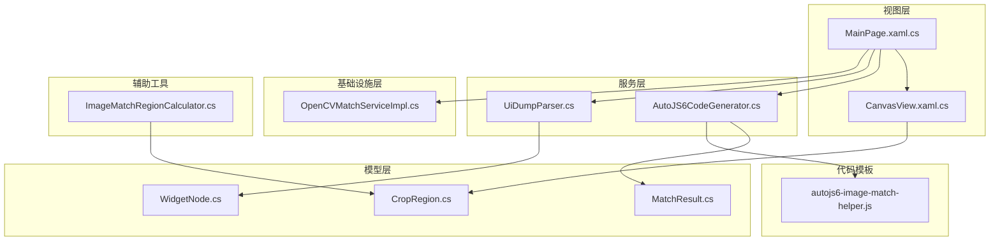
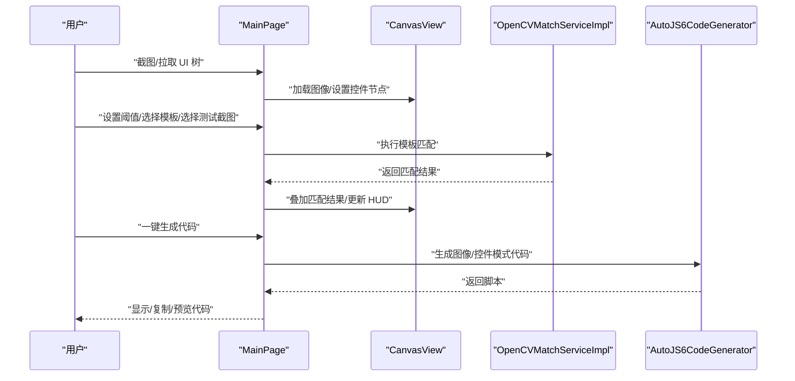
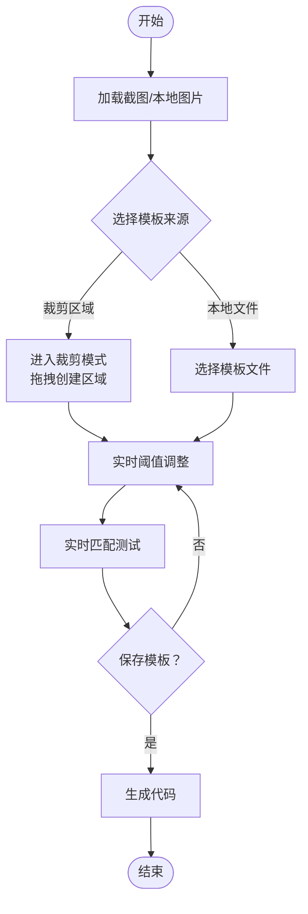
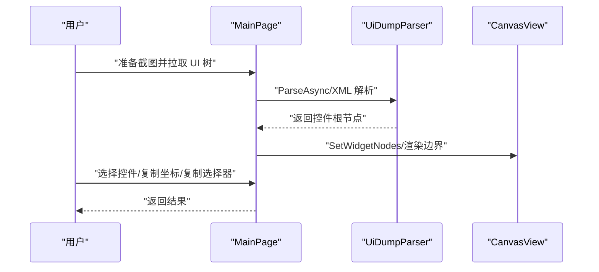
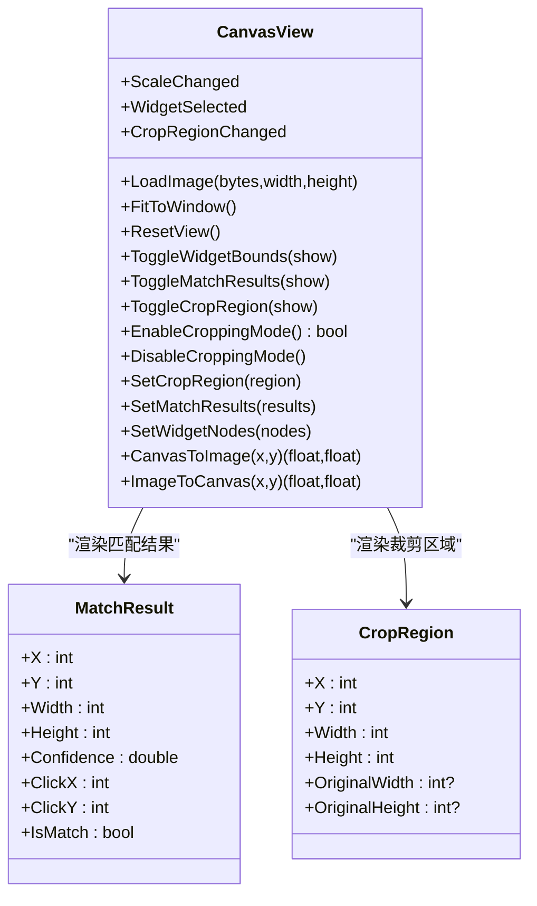
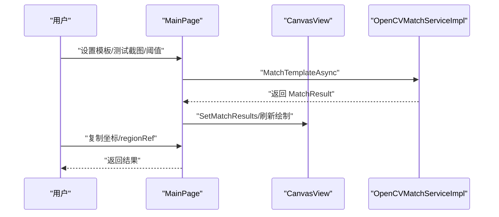
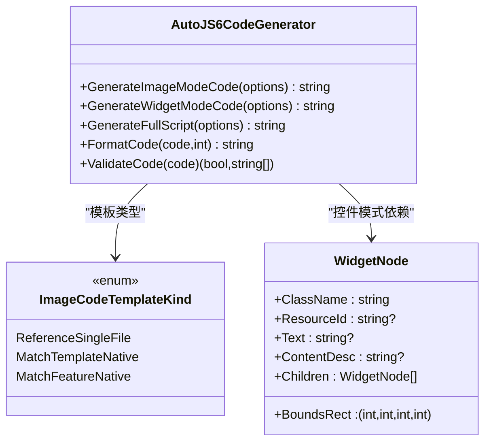
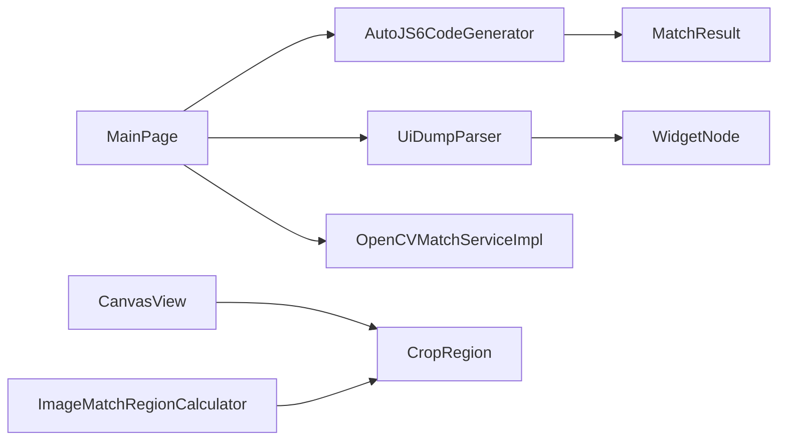

# 核心功能特性

<cite>
**本文档引用的文件**
- [App/Views/MainPage.xaml.cs](file://App/Views/MainPage.xaml.cs)
- [App/Views/CanvasView.xaml.cs](file://App/Views/CanvasView.xaml.cs)
- [Core/Services/AutoJS6CodeGenerator.cs](file://Core/Services/AutoJS6CodeGenerator.cs)
- [Infrastructure/Imaging/OpenCVMatchServiceImpl.cs](file://Infrastructure/Imaging/OpenCVMatchServiceImpl.cs)
- [Core/Services/UiDumpParser.cs](file://Core/Services/UiDumpParser.cs)
- [App/Views/MainPage.ImageWorkflowState.cs](file://App/Views/MainPage.ImageWorkflowState.cs)
- [App/Views/MainPage.ImageWorkflowSupport.cs](file://App/Views/MainPage.ImageWorkflowSupport.cs)
- [App/Views/MainPage.UiTree.cs](file://App/Views/MainPage.UiTree.cs)
- [App/Views/MainPage.Workbench.cs](file://App/Views/MainPage.Workbench.cs)
- [App/CodeTemplates/image/autojs6-image-match-helper.js](file://App/CodeTemplates/image/autojs6-image-match-helper.js)
- [Core/Helpers/ImageMatchRegionCalculator.cs](file://Core/Helpers/ImageMatchRegionCalculator.cs)
- [Core/Models/WidgetNode.cs](file://Core/Models/WidgetNode.cs)
- [Core/Models/CropRegion.cs](file://Core/Models/CropRegion.cs)
- [Core/Models/MatchResult.cs](file://Core/Models/MatchResult.cs)
- [App/Models/ImageCodeTemplateKind.cs](file://App/Models/ImageCodeTemplateKind.cs)
</cite>

## 目录
1. [简介](#简介)
2. [项目结构](#项目结构)
3. [核心组件](#核心组件)
4. [架构总览](#架构总览)
5. [详细组件分析](#详细组件分析)
6. [依赖关系分析](#依赖关系分析)
7. [性能考量](#性能考量)
8. [故障排查指南](#故障排查指南)
9. [结论](#结论)
10. [附录](#附录)

## 简介
本文件面向 AutoJS6 可视化开发工具的核心功能特性，围绕两大工作空间进行系统化说明：
- 图像模式：提供像素级模板匹配、实时阈值调整、区域裁剪与一键代码生成能力，支持参考模板与区域映射，适配不同设备方向与分辨率。
- 控件模式：提供 UI 树解析、控件边界渲染、选择器生成与智能布局过滤，支持坐标复制、选择器复制与控件片段预览。

同时，文档深入解释高性能画布系统（Win2D GPU 加速渲染、60 FPS 帧率保证、缩放平移交互）与实时匹配测试系统（动态阈值、UiSelector 验证、坐标对齐检查）的技术实现与使用价值，并给出每个功能的操作流程与最佳实践建议。

## 项目结构
该工具采用分层架构：
- 视图层（App/Views）：主界面、画布视图、属性面板、工作台模式切换与状态管理。
- 服务层（Core/Services）：代码生成器、UI 树解析器。
- 基础设施层（Infrastructure/Imaging）：OpenCV 模板匹配服务。
- 模型层（Core/Models）：控件节点、裁剪区域、匹配结果等数据模型。
- 辅助工具（Core/Helpers）：图像匹配区域计算器。
- 代码模板（App/CodeTemplates）：AutoJS6 图像匹配辅助脚本。

**图表来源**
- [App/Views/MainPage.xaml.cs:1-409](file://App/Views/MainPage.xaml.cs#L1-L409)
- [App/Views/CanvasView.xaml.cs:1-800](file://App/Views/CanvasView.xaml.cs#L1-L800)
- [Core/Services/AutoJS6CodeGenerator.cs:1-357](file://Core/Services/AutoJS6CodeGenerator.cs#L1-L357)
- [Infrastructure/Imaging/OpenCVMatchServiceImpl.cs:1-204](file://Infrastructure/Imaging/OpenCVMatchServiceImpl.cs#L1-L204)
- [Core/Services/UiDumpParser.cs:1-263](file://Core/Services/UiDumpParser.cs#L1-L263)
- [Core/Helpers/ImageMatchRegionCalculator.cs:1-99](file://Core/Helpers/ImageMatchRegionCalculator.cs#L1-L99)
- [Core/Models/WidgetNode.cs:1-93](file://Core/Models/WidgetNode.cs#L1-L93)
- [Core/Models/CropRegion.cs:1-53](file://Core/Models/CropRegion.cs#L1-L53)
- [Core/Models/MatchResult.cs:1-63](file://Core/Models/MatchResult.cs#L1-L63)
- [App/CodeTemplates/image/autojs6-image-match-helper.js:1-528](file://App/CodeTemplates/image/autojs6-image-match-helper.js#L1-L528)

**章节来源**
- [App/Views/MainPage.xaml.cs:1-409](file://App/Views/MainPage.xaml.cs#L1-L409)
- [App/Views/CanvasView.xaml.cs:1-800](file://App/Views/CanvasView.xaml.cs#L1-L800)

## 核心组件
- 主页面控制器（MainPage）：负责设备连接、截图、UI 树拉取、工作台模式切换、按钮状态控制、日志输出与交互提示。
- 画布视图（CanvasView）：基于 Win2D 的高性能渲染引擎，支持缩放、平移、惯性滑动、裁剪模式、控件边界与匹配结果叠加绘制。
- 代码生成器（AutoJS6CodeGenerator）：根据图像模式或控件模式选项生成 AutoJS6 脚本，包含重试逻辑、回收策略与语法校验。
- OpenCV 模板匹配服务（OpenCVMatchServiceImpl）：提供单点与多点模板匹配、相似度计算与模板有效性验证。
- UI 树解析器（UiDumpParser）：解析 Android UI Dump XML，生成控件树，支持过滤布局容器、坐标查询与选择器生成。
- 区域计算器（ImageMatchRegionCalculator）：将参考命中框转换为搜索区域与 regionRef，适配不同分辨率与方向。
- 数据模型：WidgetNode、CropRegion、MatchResult 提供稳定的跨层数据契约。

**章节来源**
- [Core/Services/AutoJS6CodeGenerator.cs:1-357](file://Core/Services/AutoJS6CodeGenerator.cs#L1-L357)
- [Infrastructure/Imaging/OpenCVMatchServiceImpl.cs:1-204](file://Infrastructure/Imaging/OpenCVMatchServiceImpl.cs#L1-L204)
- [Core/Services/UiDumpParser.cs:1-263](file://Core/Services/UiDumpParser.cs#L1-L263)
- [Core/Helpers/ImageMatchRegionCalculator.cs:1-99](file://Core/Helpers/ImageMatchRegionCalculator.cs#L1-L99)
- [Core/Models/WidgetNode.cs:1-93](file://Core/Models/WidgetNode.cs#L1-L93)
- [Core/Models/CropRegion.cs:1-53](file://Core/Models/CropRegion.cs#L1-L53)
- [Core/Models/MatchResult.cs:1-63](file://Core/Models/MatchResult.cs#L1-L63)

## 架构总览
系统通过“视图层-服务层-基础设施层”的分层设计实现清晰职责分离。视图层负责用户交互与状态管理，服务层封装业务逻辑，基础设施层提供高性能图像处理能力，模型层统一数据结构。

**图表来源**
- [App/Views/MainPage.xaml.cs:147-248](file://App/Views/MainPage.xaml.cs#L147-L248)
- [App/Views/CanvasView.xaml.cs:572-627](file://App/Views/CanvasView.xaml.cs#L572-L627)
- [Infrastructure/Imaging/OpenCVMatchServiceImpl.cs:13-60](file://Infrastructure/Imaging/OpenCVMatchServiceImpl.cs#L13-L60)
- [Core/Services/AutoJS6CodeGenerator.cs:13-102](file://Core/Services/AutoJS6CodeGenerator.cs#L13-L102)

## 详细组件分析

### 图像模式：像素级模板匹配与一键代码生成
- 功能要点
  - 模板来源：支持“裁剪区域”与“本地文件”两种来源，自动同步匹配上下文。
  - 实时阈值调整：滑块驱动阈值变更，即时反馈置信度与匹配框。
  - 区域裁剪：仅在 1:1 视图下启用，支持拖拽创建、调整手柄与宽高比锁定。
  - 一键代码生成：自动生成 AutoJS6 图像匹配脚本，支持重试与资源回收。
  - 参考模板与 regionRef：基于参考命中框推导搜索区域与 regionRef，适配不同分辨率与方向。
- 关键流程
  - 截图或载入本地图片 → 设置模板来源 → 实时测试匹配 → 保存模板 → 生成代码。
- 最佳实践
  - 优先使用“裁剪区域”来源，便于快速迭代；模板保存后方可生成代码。
  - 在 1:1 视图下进行裁剪，确保 regionRef 与模板尺寸映射准确。
  - 合理设置阈值，结合置信度与点击坐标进行人工复核。

**图表来源**
- [App/Views/MainPage.xaml.cs:147-178](file://App/Views/MainPage.xaml.cs#L147-L178)
- [App/Views/CanvasView.xaml.cs:281-305](file://App/Views/CanvasView.xaml.cs#L281-L305)
- [App/Views/MainPage.ImageWorkflowSupport.cs:315-365](file://App/Views/MainPage.ImageWorkflowSupport.cs#L315-L365)
- [Core/Helpers/ImageMatchRegionCalculator.cs:40-97](file://Core/Helpers/ImageMatchRegionCalculator.cs#L40-L97)

**章节来源**
- [App/Views/MainPage.xaml.cs:147-248](file://App/Views/MainPage.xaml.cs#L147-L248)
- [App/Views/CanvasView.xaml.cs:281-305](file://App/Views/CanvasView.xaml.cs#L281-L305)
- [App/Views/MainPage.ImageWorkflowSupport.cs:315-365](file://App/Views/MainPage.ImageWorkflowSupport.cs#L315-L365)
- [Core/Helpers/ImageMatchRegionCalculator.cs:40-97](file://Core/Helpers/ImageMatchRegionCalculator.cs#L40-L97)
- [Core/Models/MatchResult.cs:1-63](file://Core/Models/MatchResult.cs#L1-L63)

### 控件模式：UI 树解析、边界渲染与选择器生成
- 功能要点
  - UI 树解析：从设备拉取 XML 并解析为控件树，过滤布局容器，仅展示业务节点。
  - 边界渲染：在画布上绘制控件边界框，支持高亮选中控件与透明度调节。
  - 选择器生成：优先使用 resource-id，其次 text/content-desc，最后 className，补充 boundsInside。
  - 智能布局过滤：自动过滤无意义的布局容器，提升节点树可读性。
  - 交互能力：支持节点树搜索、坐标复制、选择器复制与控件片段预览。
- 关键流程
  - 准备截图 → 拉取 UI 树 → 过滤并重建节点树 → 选择控件 → 复制坐标/选择器/预览片段。
- 最佳实践
  - 使用节点树搜索快速定位控件，结合边界渲染确认可视范围。
  - 优先使用 resource-id 作为主选择器，必要时添加 boundsInside 精确限定。

**图表来源**
- [App/Views/MainPage.xaml.cs:180-248](file://App/Views/MainPage.xaml.cs#L180-L248)
- [Core/Services/UiDumpParser.cs:14-35](file://Core/Services/UiDumpParser.cs#L14-L35)
- [App/Views/MainPage.UiTree.cs:49-80](file://App/Views/MainPage.UiTree.cs#L49-L80)
- [App/Views/CanvasView.xaml.cs:632-676](file://App/Views/CanvasView.xaml.cs#L632-L676)

**章节来源**
- [App/Views/MainPage.xaml.cs:180-248](file://App/Views/MainPage.xaml.cs#L180-L248)
- [Core/Services/UiDumpParser.cs:37-97](file://Core/Services/UiDumpParser.cs#L37-L97)
- [App/Views/MainPage.UiTree.cs:116-140](file://App/Views/MainPage.UiTree.cs#L116-L140)
- [App/Views/CanvasView.xaml.cs:632-676](file://App/Views/CanvasView.xaml.cs#L632-L676)

### 高性能画布系统：Win2D GPU 加速与 60 FPS 交互
- 技术实现
  - 分层渲染：底层图像层 + 上层 Overlay 层，分别绘制底图与叠加元素。
  - 坐标系转换：提供画布坐标与图像坐标的双向转换，确保叠加元素与底图精确对齐。
  - 缓存优化：CanvasBitmap 缓存池，避免重复创建纹理，限制最大缓存数量。
  - 交互优化：惯性滑动（DispatcherTimer 16ms tick，约 60 FPS），平滑缩放与拖拽体验。
  - 裁剪模式：仅在 1:1 视图下启用，支持虚线矩形与 8 个调整手柄。
- 性能特征
  - GPU 加速：Win2D CanvasBitmap 与 DrawingSession 提供硬件加速。
  - 帧率保障：定时器周期 16ms，目标 60 FPS；速度衰减与最小速度阈值确保快速停止。
  - 内存管理：缓存淘汰与显式释放，防止内存泄漏。
- 最佳实践
  - 在需要精细交互时保持 1:1 视图，启用裁剪模式进行精确区域选择。
  - 合理设置 Overlay 透明度，平衡可视化与性能。

**图表来源**
- [App/Views/CanvasView.xaml.cs:24-116](file://App/Views/CanvasView.xaml.cs#L24-L116)
- [Core/Models/MatchResult.cs:1-63](file://Core/Models/MatchResult.cs#L1-L63)
- [Core/Models/CropRegion.cs:1-53](file://Core/Models/CropRegion.cs#L1-L53)

**章节来源**
- [App/Views/CanvasView.xaml.cs:102-138](file://App/Views/CanvasView.xaml.cs#L102-L138)
- [App/Views/CanvasView.xaml.cs:358-426](file://App/Views/CanvasView.xaml.cs#L358-L426)
- [App/Views/CanvasView.xaml.cs:472-510](file://App/Views/CanvasView.xaml.cs#L472-L510)
- [App/Views/CanvasView.xaml.cs:572-627](file://App/Views/CanvasView.xaml.cs#L572-L627)

### 实时匹配测试系统：动态阈值与坐标对齐
- 功能价值
  - 动态阈值调整：滑块驱动阈值变化，实时观察匹配结果与置信度变化。
  - 匹配结果可视化：绘制矩形框、点击圆点与置信度文本，支持多结果叠加。
  - 坐标对齐检查：通过点击圆点与中心坐标计算，验证匹配位置与期望点击点一致。
  - 测试截图预览：支持将测试截图作为叠加层临时预览，便于对比与回溯。
- 关键流程
  - 选择模板与测试截图 → 调整阈值 → 查看匹配结果 → 复制坐标/regionRef → 保存模板 → 生成代码。
- 最佳实践
  - 使用“测试截图预览”功能对比不同阈值下的匹配效果，确保稳定性。
  - 结合 regionRef 与方向约定，验证不同分辨率下的适配性。

**图表来源**
- [App/Views/MainPage.xaml.cs:333-339](file://App/Views/MainPage.xaml.cs#L333-L339)
- [Infrastructure/Imaging/OpenCVMatchServiceImpl.cs:13-60](file://Infrastructure/Imaging/OpenCVMatchServiceImpl.cs#L13-L60)
- [App/Views/CanvasView.xaml.cs:156-168](file://App/Views/CanvasView.xaml.cs#L156-L168)
- [Core/Models/MatchResult.cs:1-63](file://Core/Models/MatchResult.cs#L1-L63)

**章节来源**
- [App/Views/MainPage.xaml.cs:333-339](file://App/Views/MainPage.xaml.cs#L333-L339)
- [Infrastructure/Imaging/OpenCVMatchServiceImpl.cs:62-122](file://Infrastructure/Imaging/OpenCVMatchServiceImpl.cs#L62-L122)
- [App/Views/CanvasView.xaml.cs:681-704](file://App/Views/CanvasView.xaml.cs#L681-L704)

### 代码生成与模板支持
- 图像模式代码生成
  - 支持重试逻辑、模板回收、阈值参数化与 regionRef 注入。
  - 自动拼接 captureScreen、findImage、click 等调用序列。
- 控件模式代码生成
  - 生成主选择器与回退选择器，支持重试与点击动作。
  - 自动转义特殊字符，确保 JavaScript 语法安全。
- 代码模板与辅助函数
  - 提供 AutoJS6 图像匹配辅助脚本，支持参考模板、方向、缩放候选与特征匹配回退。

**图表来源**
- [Core/Services/AutoJS6CodeGenerator.cs:11-164](file://Core/Services/AutoJS6CodeGenerator.cs#L11-L164)
- [App/Models/ImageCodeTemplateKind.cs:1-9](file://App/Models/ImageCodeTemplateKind.cs#L1-L9)
- [Core/Models/WidgetNode.cs:1-93](file://Core/Models/WidgetNode.cs#L1-L93)

**章节来源**
- [Core/Services/AutoJS6CodeGenerator.cs:13-102](file://Core/Services/AutoJS6CodeGenerator.cs#L13-L102)
- [Core/Services/AutoJS6CodeGenerator.cs:104-164](file://Core/Services/AutoJS6CodeGenerator.cs#L104-L164)
- [App/CodeTemplates/image/autojs6-image-match-helper.js:18-160](file://App/CodeTemplates/image/autojs6-image-match-helper.js#L18-L160)

## 依赖关系分析
- 视图层依赖服务层与基础设施层，通过接口抽象解耦。
- 服务层依赖模型层数据结构，确保跨模块一致性。
- 基础设施层依赖第三方库（OpenCV），提供高性能图像处理。
- 代码模板与生成器配合，形成“可视化配置 → 代码生成 → 脚本落地”的闭环。

**图表来源**
- [App/Views/MainPage.xaml.cs:19-50](file://App/Views/MainPage.xaml.cs#L19-L50)
- [Core/Services/AutoJS6CodeGenerator.cs:1-12](file://Core/Services/AutoJS6CodeGenerator.cs#L1-L12)
- [Core/Services/UiDumpParser.cs:1-12](file://Core/Services/UiDumpParser.cs#L1-L12)
- [Infrastructure/Imaging/OpenCVMatchServiceImpl.cs:1-12](file://Infrastructure/Imaging/OpenCVMatchServiceImpl.cs#L1-L12)
- [Core/Helpers/ImageMatchRegionCalculator.cs:1-35](file://Core/Helpers/ImageMatchRegionCalculator.cs#L1-L35)

**章节来源**
- [App/Views/MainPage.xaml.cs:19-50](file://App/Views/MainPage.xaml.cs#L19-L50)
- [Core/Services/AutoJS6CodeGenerator.cs:1-12](file://Core/Services/AutoJS6CodeGenerator.cs#L1-L12)
- [Core/Services/UiDumpParser.cs:1-12](file://Core/Services/UiDumpParser.cs#L1-L12)
- [Infrastructure/Imaging/OpenCVMatchServiceImpl.cs:1-12](file://Infrastructure/Imaging/OpenCVMatchServiceImpl.cs#L1-L12)
- [Core/Helpers/ImageMatchRegionCalculator.cs:1-35](file://Core/Helpers/ImageMatchRegionCalculator.cs#L1-L35)

## 性能考量
- 渲染性能
  - Win2D GPU 加速与分层渲染减少 CPU/GPU 争用，Overlay 透明度与缓存池进一步优化。
  - 60 FPS 惯性滑动通过固定周期定时器实现，速度衰减与阈值控制确保自然停止。
- 匹配性能
  - OpenCV 模板匹配采用 CCoeffNormed 算法，支持区域裁剪与多点匹配，显著降低搜索范围。
  - 缓存与上下文管理避免重复计算，RegionRef 推导减少不必要的重复匹配。
- 内存管理
  - CanvasBitmap 缓存池限制最大容量，及时释放不再使用的位图。
  - 生成器与模板脚本均提供资源回收逻辑，避免内存泄漏。

[本节为通用性能指导，不直接分析具体文件]

## 故障排查指南
- 截图失败
  - 检查设备连接状态与权限请求；查看日志输出与状态提示。
  - 参考路径：[App/Views/MainPage.xaml.cs:147-178](file://App/Views/MainPage.xaml.cs#L147-L178)
- UI 树解析失败
  - 确认已准备截图且设备连接正常；查看日志异常堆栈。
  - 参考路径：[App/Views/MainPage.xaml.cs:180-248](file://App/Views/MainPage.xaml.cs#L180-L248)
- 裁剪模式不可用
  - 仅在 1:1 视图下启用；检查缩放状态与提示信息。
  - 参考路径：[App/Views/CanvasView.xaml.cs:281-293](file://App/Views/CanvasView.xaml.cs#L281-L293)
- 匹配结果为空
  - 调整阈值、缩小搜索区域或更换模板；检查 regionRef 与方向约定。
  - 参考路径：[Infrastructure/Imaging/OpenCVMatchServiceImpl.cs:13-60](file://Infrastructure/Imaging/OpenCVMatchServiceImpl.cs#L13-L60)
- 代码生成失败
  - 检查模板保存状态与最后一次成功匹配上下文；确认生成目录权限。
  - 参考路径：[App/Views/MainPage.ImageWorkflowSupport.cs:37-52](file://App/Views/MainPage.ImageWorkflowSupport.cs#L37-L52)

**章节来源**
- [App/Views/MainPage.xaml.cs:147-178](file://App/Views/MainPage.xaml.cs#L147-L178)
- [App/Views/MainPage.xaml.cs:180-248](file://App/Views/MainPage.xaml.cs#L180-L248)
- [App/Views/CanvasView.xaml.cs:281-293](file://App/Views/CanvasView.xaml.cs#L281-L293)
- [Infrastructure/Imaging/OpenCVMatchServiceImpl.cs:13-60](file://Infrastructure/Imaging/OpenCVMatchServiceImpl.cs#L13-L60)
- [App/Views/MainPage.ImageWorkflowSupport.cs:37-52](file://App/Views/MainPage.ImageWorkflowSupport.cs#L37-L52)

## 结论
AutoJS6 可视化开发工具通过“图像模式 + 控件模式”的双通道设计，结合高性能画布系统与实时匹配测试系统，为自动化脚本开发提供了从“可视化配置到一键生成”的完整链路。Win2D GPU 加速与 60 FPS 交互体验确保了流畅的开发过程；OpenCV 模板匹配与智能 UI 解析提升了识别精度与可维护性。配合完善的区域映射与代码生成机制，开发者可以快速、稳定地构建高质量的 AutoJS6 脚本。

[本节为总结性内容，不直接分析具体文件]

## 附录
- 使用场景与操作流程
  - 图像模式：适合图标/按钮/界面元素识别，典型流程为“截图 → 裁剪模板 → 调整阈值 → 保存模板 → 生成代码”。
  - 控件模式：适合基于资源 ID/text 的控件定位，典型流程为“准备截图 → 拉取 UI 树 → 选择控件 → 复制坐标/选择器 → 生成代码”。
- 最佳实践
  - 图像模式优先使用裁剪区域来源，结合 regionRef 与方向约定；合理设置阈值并进行多截图验证。
  - 控件模式优先使用 resource-id，必要时补充 boundsInside；利用节点树搜索与边界渲染提升定位效率。
- 代码示例与截图
  - 代码示例路径：[Core/Services/AutoJS6CodeGenerator.cs:13-102](file://Core/Services/AutoJS6CodeGenerator.cs#L13-L102)、[Core/Services/AutoJS6CodeGenerator.cs:104-164](file://Core/Services/AutoJS6CodeGenerator.cs#L104-L164)
  - 匹配结果可视化：[App/Views/CanvasView.xaml.cs:681-704](file://App/Views/CanvasView.xaml.cs#L681-L704)
  - UI 树解析与过滤：[Core/Services/UiDumpParser.cs:37-97](file://Core/Services/UiDumpParser.cs#L37-L97)

**章节来源**
- [Core/Services/AutoJS6CodeGenerator.cs:13-102](file://Core/Services/AutoJS6CodeGenerator.cs#L13-L102)
- [Core/Services/AutoJS6CodeGenerator.cs:104-164](file://Core/Services/AutoJS6CodeGenerator.cs#L104-L164)
- [App/Views/CanvasView.xaml.cs:681-704](file://App/Views/CanvasView.xaml.cs#L681-L704)
- [Core/Services/UiDumpParser.cs:37-97](file://Core/Services/UiDumpParser.cs#L37-L97)