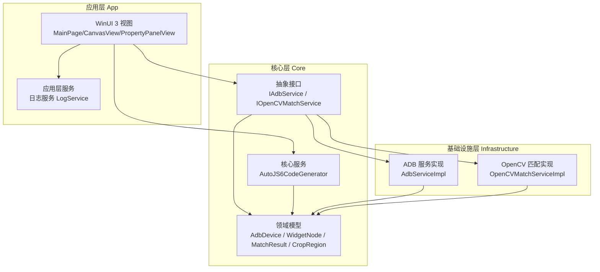
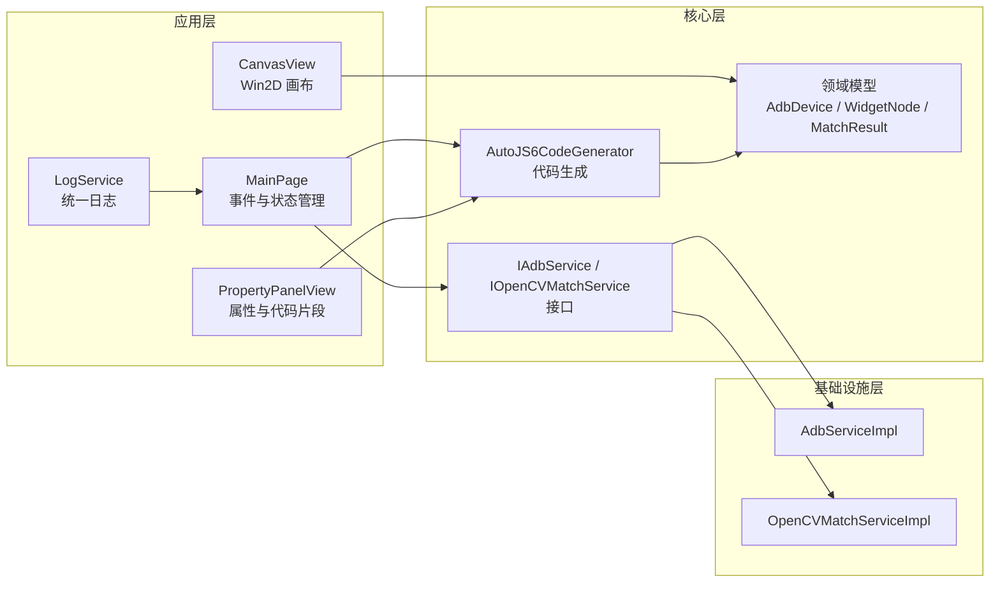
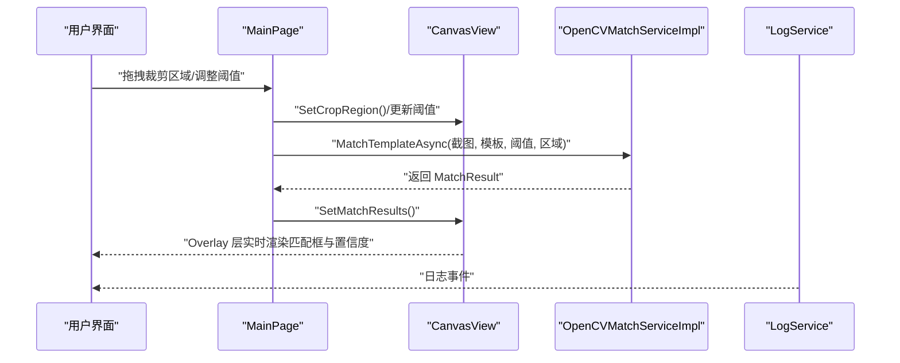
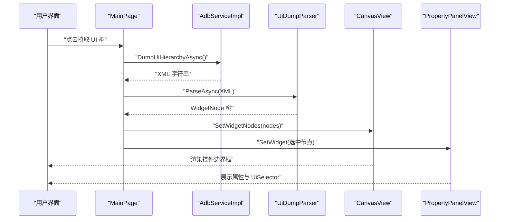
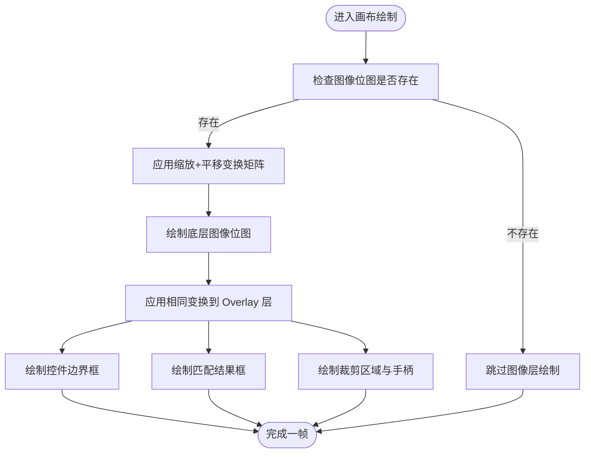
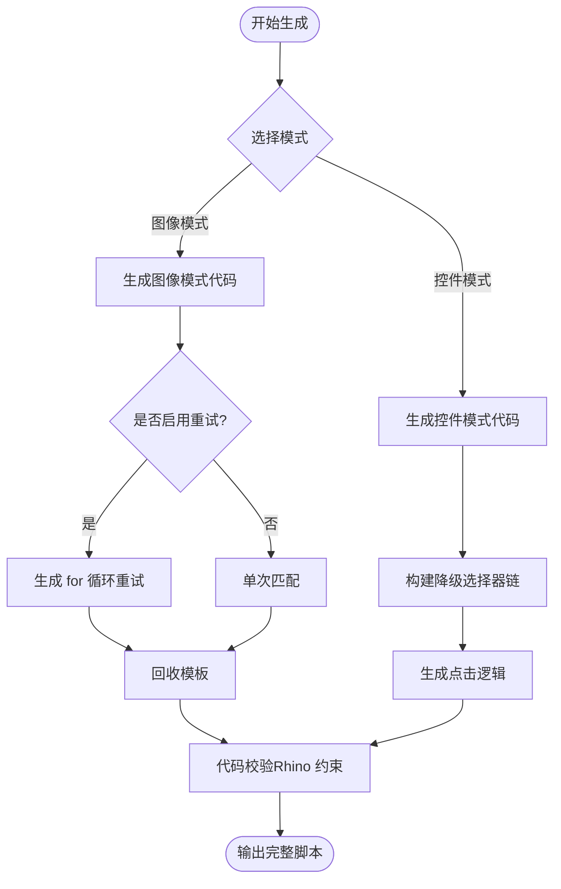
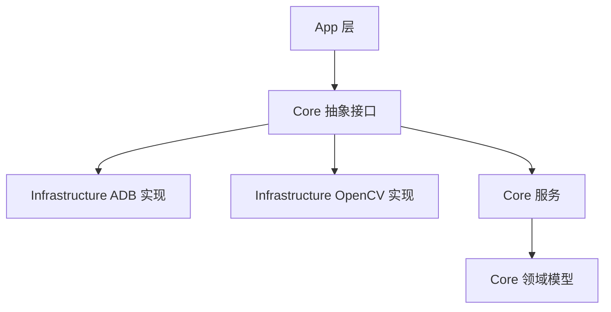

# 项目介绍

<cite>
**本文引用的文件**
- [README.md](file://README.md)
- [README_zh_CN.md](file://README_zh_CN.md)
- [App.xaml.cs](file://App/App.xaml.cs)
- [MainWindow.xaml.cs](file://App/MainWindow.xaml.cs)
- [MainPage.xaml.cs](file://App/Views/MainPage.xaml.cs)
- [CanvasView.xaml.cs](file://App/Views/CanvasView.xaml.cs)
- [PropertyPanelView.xaml.cs](file://App/Views/PropertyPanelView.xaml.cs)
- [LogService.cs](file://App/Services/LogService.cs)
- [Core.csproj](file://Core/Core.csproj)
- [AutoJS6CodeGenerator.cs](file://Core/Services/AutoJS6CodeGenerator.cs)
- [IAdbService.cs](file://Core/Abstractions/IAdbService.cs)
- [IOpenCVMatchService.cs](file://Core/Abstractions/IOpenCVMatchService.cs)
- [AdbServiceImpl.cs](file://Infrastructure/Adb/AdbServiceImpl.cs)
- [OpenCVMatchServiceImpl.cs](file://Infrastructure/Imaging/OpenCVMatchServiceImpl.cs)
</cite>

## 目录
1. [引言](#引言)
2. [项目结构](#项目结构)
3. [核心组件](#核心组件)
4. [架构总览](#架构总览)
5. [详细组件分析](#详细组件分析)
6. [依赖分析](#依赖分析)
7. [性能考量](#性能考量)
8. [故障排查指南](#故障排查指南)
9. [结论](#结论)

## 引言
AutoJS6 可视化开发工具旨在彻底改变 AutoJS6 脚本开发体验。它将“截图分析、控件树解析、图像匹配预览、AutoJS6 代码生成”整合到一个原生 Windows 工作台中，帮助开发者告别“截图 → 手动裁剪 → 写代码 → 真机试错”的低效循环，实现“所见即所得”的高效开发。

- 针对痛点：反复调试模板、手动计算坐标、跨设备适配困难、阈值调优无从下手、UI 树查找繁琐等
- 双工作区理念：图像模式（基于像素的模板匹配）与控件模式（基于 UiSelector 的控件定位）
- 技术亮点：实时匹配预览、可视化阈值与区域调整、一键生成 AutoJS6 代码、60 FPS GPU 加速画布、异步优先架构

## 项目结构
项目采用 Clean Architecture 分层，严格解耦 UI、核心业务与基础设施：

- App：WinUI 3 桌面应用，包含视图、视图模型、服务与资源
- Core：纯业务逻辑层，不含 UI 依赖，独立可测试
- Infrastructure：外部依赖适配层（ADB 通信、OpenCV 图像处理）
- App.Tests / Core.Tests：应用与核心单元测试

图表来源
- [App.xaml.cs:27-54](file://App/App.xaml.cs#L27-L54)
- [MainWindow.xaml.cs:26-50](file://App/MainWindow.xaml.cs#L26-L50)
- [MainPage.xaml.cs:17-60](file://App/Views/MainPage.xaml.cs#L17-L60)
- [Core.csproj:1-10](file://Core/Core.csproj#L1-L10)

章节来源
- [README.md:230-260](file://README.md#L230-L260)
- [README_zh_CN.md:230-260](file://README_zh_CN.md#L230-L260)

## 核心组件
- 双工作区界面
  - 图像模式：实时截图、交互式裁剪、阈值滑条、OpenCV 匹配预览、模板导出
  - 控件模式：UI 树解析、智能布局过滤、控件边界渲染、双向同步、属性面板
- 高性能画布
  - Win2D GPU 加速双层渲染（图像层 + Overlay 层）
  - 缩放/平移/惯性滚动、旋转支持、辅助工具（标尺、网格、十字准星）
- 代码生成器
  - 图像模式：基于 images.findImage 的完整脚本
  - 控件模式：基于 UiSelector 的降级链与点击逻辑
- ADB 与 OpenCV
  - ADB：设备扫描、截图帧缓冲读取、UI 层次结构拉取
  - OpenCV：模板匹配（TM_CCOEFF_NORMED）、相似度计算、区域搜索

章节来源
- [README.md:166-227](file://README.md#L166-L227)
- [README_zh_CN.md:166-227](file://README_zh_CN.md#L166-L227)
- [CanvasView.xaml.cs:24-116](file://App/Views/CanvasView.xaml.cs#L24-L116)
- [AutoJS6CodeGenerator.cs:11-189](file://Core/Services/AutoJS6CodeGenerator.cs#L11-L189)
- [AdbServiceImpl.cs:17-138](file://Infrastructure/Adb/AdbServiceImpl.cs#L17-L138)
- [OpenCVMatchServiceImpl.cs:11-60](file://Infrastructure/Imaging/OpenCVMatchServiceImpl.cs#L11-L60)

## 架构总览
- 双引擎独立：图像引擎（像素坐标）与 UI 引擎（UiSelector 链）完全解耦
- 单向依赖：App → Infrastructure → Core ← Infrastructure
- 异步优先：所有 I/O（ADB、OpenCV、XML、纹理上传）均使用 async/await，UI 线程永不阻塞

图表来源
- [MainPage.xaml.cs:17-60](file://App/Views/MainPage.xaml.cs#L17-L60)
- [CanvasView.xaml.cs:24-116](file://App/Views/CanvasView.xaml.cs#L24-L116)
- [PropertyPanelView.xaml.cs:12-31](file://App/Views/PropertyPanelView.xaml.cs#L12-L31)
- [LogService.cs:9-49](file://App/Services/LogService.cs#L9-L49)
- [IAdbService.cs:8-56](file://Core/Abstractions/IAdbService.cs#L8-L56)
- [IOpenCVMatchService.cs:8-56](file://Core/Abstractions/IOpenCVMatchService.cs#L8-L56)
- [AdbServiceImpl.cs:17-49](file://Infrastructure/Adb/AdbServiceImpl.cs#L17-L49)
- [OpenCVMatchServiceImpl.cs:11-20](file://Infrastructure/Imaging/OpenCVMatchServiceImpl.cs#L11-L20)

章节来源
- [README.md:264-287](file://README.md#L264-L287)
- [README_zh_CN.md:264-287](file://README_zh_CN.md#L264-L287)

## 详细组件分析

### 图像处理引擎（像素级）
- 功能要点
  - 实时截图捕获（ADB 帧缓冲读取 + PNG 转换）
  - 交互式裁剪（拖拽顶点/边，Shift 锁定宽高比）
  - OpenCV 模板匹配（TM_CCOEFF_NORMED，阈值 0.50-0.95）
  - 模板导出（PNG + 偏移元数据）
- 关键流程（实时阈值与匹配）

图表来源
- [MainPage.xaml.cs:87-110](file://App/Views/MainPage.xaml.cs#L87-L110)
- [CanvasView.xaml.cs:156-168](file://App/Views/CanvasView.xaml.cs#L156-L168)
- [OpenCVMatchServiceImpl.cs:13-60](file://Infrastructure/Imaging/OpenCVMatchServiceImpl.cs#L13-L60)

章节来源
- [README.md:168-175](file://README.md#L168-L175)
- [README_zh_CN.md:168-175](file://README_zh_CN.md#L168-L175)
- [OpenCVMatchServiceImpl.cs:11-60](file://Infrastructure/Imaging/OpenCVMatchServiceImpl.cs#L11-L60)
- [CanvasView.xaml.cs:709-738](file://App/Views/CanvasView.xaml.cs#L709-L738)

### UI 层分析引擎（控件级）
- 功能要点
  - 拉取并解析 uiautomator dump（XML）
  - 智能布局过滤（移除冗余容器）
  - 控件边界渲染（按类型着色）
  - 双向同步（TreeView 与画布联动）
  - 属性面板（坐标、文本、UiSelector、一键复制）
- 关键流程（UI 树拉取与渲染）

图表来源
- [MainPage.xaml.cs:180-248](file://App/Views/MainPage.xaml.cs#L180-L248)
- [AdbServiceImpl.cs:120-138](file://Infrastructure/Adb/AdbServiceImpl.cs#L120-L138)
- [CanvasView.xaml.cs:143-151](file://App/Views/CanvasView.xaml.cs#L143-L151)
- [PropertyPanelView.xaml.cs:24-51](file://App/Views/PropertyPanelView.xaml.cs#L24-L51)

章节来源
- [README.md:176-183](file://README.md#L176-L183)
- [README_zh_CN.md:176-183](file://README_zh_CN.md#L176-L183)
- [PropertyPanelView.xaml.cs:12-31](file://App/Views/PropertyPanelView.xaml.cs#L12-L31)

### 高性能画布（Win2D 双层渲染）
- 功能要点
  - 分层渲染：图像层（底层位图）+ Overlay 层（控件边界/匹配框/裁剪框）
  - 60 FPS：DispatcherTimer 驱动惯性滚动与重绘
  - 缩放/平移/旋转：矩阵变换，坐标系保持一致
  - 缓存优化：CanvasBitmap 缓存池，避免重复纹理创建
- 关键流程（缩放与平移）

图表来源
- [CanvasView.xaml.cs:572-627](file://App/Views/CanvasView.xaml.cs#L572-L627)
- [CanvasView.xaml.cs:578-626](file://App/Views/CanvasView.xaml.cs#L578-L626)

章节来源
- [README.md:184-190](file://README.md#L184-L190)
- [README_zh_CN.md:184-190](file://README_zh_CN.md#L184-L190)
- [CanvasView.xaml.cs:24-116](file://App/Views/CanvasView.xaml.cs#L24-L116)

### AutoJS6 代码生成器
- 功能要点
  - 图像模式：生成 images.findImage 脚本，支持重试与回收
  - 控件模式：生成 UiSelector 降级链与点击逻辑
  - 代码校验：Rhino 引擎约束检查（循环体内禁止 const/let）
- 关键流程（生成与校验）

图表来源
- [AutoJS6CodeGenerator.cs:13-102](file://Core/Services/AutoJS6CodeGenerator.cs#L13-L102)
- [AutoJS6CodeGenerator.cs:104-164](file://Core/Services/AutoJS6CodeGenerator.cs#L104-L164)
- [AutoJS6CodeGenerator.cs:226-258](file://Core/Services/AutoJS6CodeGenerator.cs#L226-L258)

章节来源
- [README.md:191-220](file://README.md#L191-L220)
- [README_zh_CN.md:191-220](file://README_zh_CN.md#L191-L220)
- [AutoJS6CodeGenerator.cs:11-189](file://Core/Services/AutoJS6CodeGenerator.cs#L11-L189)

### ADB 服务与 OpenCV 匹配服务
- ADB 服务
  - 设备扫描、连接/配对网络设备、截图帧缓冲读取、UI 层次结构拉取
  - 帧缓冲行填充处理、PNG 编码
- OpenCV 服务
  - 单/多模板匹配、相似度计算、模板有效性校验
  - 搜索区域上下文与偏移处理

章节来源
- [AdbServiceImpl.cs:17-238](file://Infrastructure/Adb/AdbServiceImpl.cs#L17-L238)
- [OpenCVMatchServiceImpl.cs:11-204](file://Infrastructure/Imaging/OpenCVMatchServiceImpl.cs#L11-L204)
- [IAdbService.cs:8-56](file://Core/Abstractions/IAdbService.cs#L8-L56)
- [IOpenCVMatchService.cs:8-56](file://Core/Abstractions/IOpenCVMatchService.cs#L8-L56)

## 依赖分析
- 层间依赖
  - App 仅依赖 Core 抽象接口，不直接依赖具体实现
  - Core 依赖基础设施接口，不依赖 UI
  - Infrastructure 实现具体适配（ADB、OpenCV）
- 耦合度
  - 双引擎严格隔离：图像与 UI 引擎数据与处理路径完全解耦
  - 事件驱动：CanvasView 与 MainPage 通过事件解耦交互

图表来源
- [README.md:266-287](file://README.md#L266-L287)
- [README_zh_CN.md:266-287](file://README_zh_CN.md#L266-L287)
- [Core.csproj:1-10](file://Core/Core.csproj#L1-L10)

章节来源
- [README.md:264-287](file://README.md#L264-L287)
- [README_zh_CN.md:264-287](file://README_zh_CN.md#L264-L287)

## 性能考量
- 渲染性能
  - Win2D 双层渲染 + CanvasBitmap 缓存池，避免重复纹理创建
  - 60 FPS 定时器驱动惯性滚动与重绘
- I/O 与 CPU
  - 所有 I/O 操作（ADB、OpenCV、XML、纹理上传）使用 async/await
  - OpenCV 匹配在后台线程执行，主线程不阻塞
- 内存与稳定性
  - 模板图像及时回收（recycle）
  - 帧缓冲行填充检测与去填充，避免内存异常
  - 代码生成器内置 Rhino 引擎约束校验，减少运行时错误

## 故障排查指南
- 截图失败
  - 检查设备连接状态与 ADB 服务初始化
  - 确认帧缓冲数据长度与像素格式
- 匹配结果异常
  - 调整阈值范围（0.50-0.95），缩小搜索区域
  - 检查模板有效性与裁剪区域
- UI 树解析失败
  - 确认设备在线且支持 dump
  - 检查 XML 内容长度与解析结果
- 日志与调试
  - 使用统一日志服务输出调试信息
  - 通过事件订阅在 UI 中查看日志

章节来源
- [AdbServiceImpl.cs:33-49](file://Infrastructure/Adb/AdbServiceImpl.cs#L33-L49)
- [AdbServiceImpl.cs:72-118](file://Infrastructure/Adb/AdbServiceImpl.cs#L72-L118)
- [OpenCVMatchServiceImpl.cs:13-60](file://Infrastructure/Imaging/OpenCVMatchServiceImpl.cs#L13-L60)
- [LogService.cs:9-49](file://App/Services/LogService.cs#L9-L49)

## 结论
AutoJS6 可视化开发工具通过“双工作区 + 实时预览 + 一键代码生成”的组合拳，系统性地解决了传统开发方式中的反复调试、坐标猜测、跨设备适配与 UI 树查找等痛点。其 Clean Architecture 分层设计、Win2D 高性能渲染、以及严格的异步与解耦策略，既保证了开发体验，也为长期演进提供了坚实基础。对于 AutoJS6 脚本开发者而言，这不仅是一个工具，更是提升效率与稳定性的关键抓手。