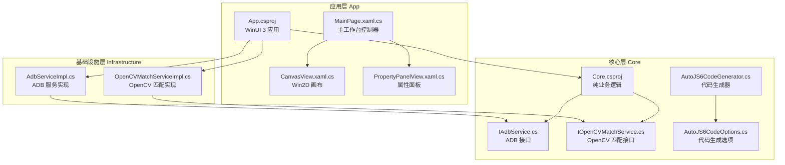
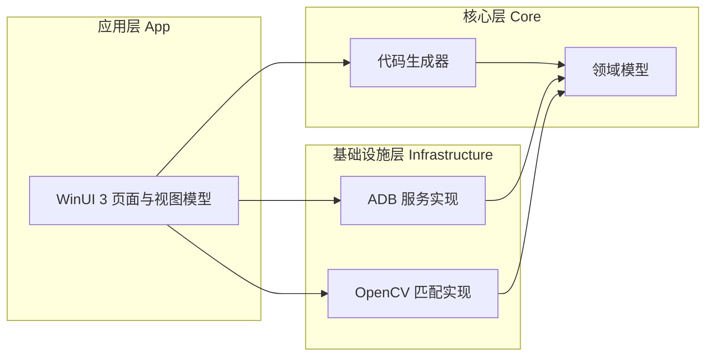
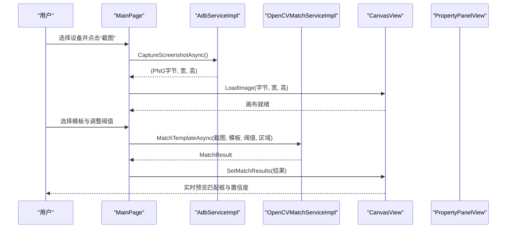
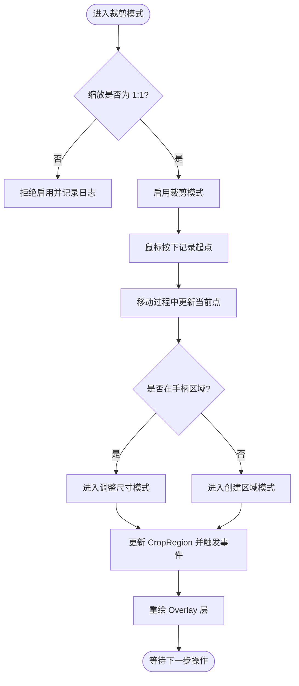
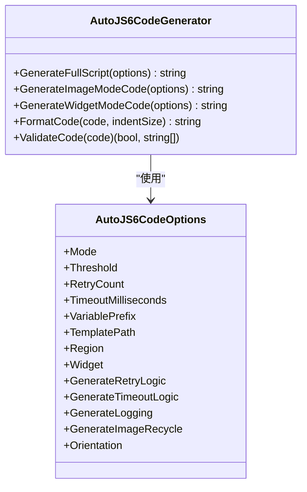
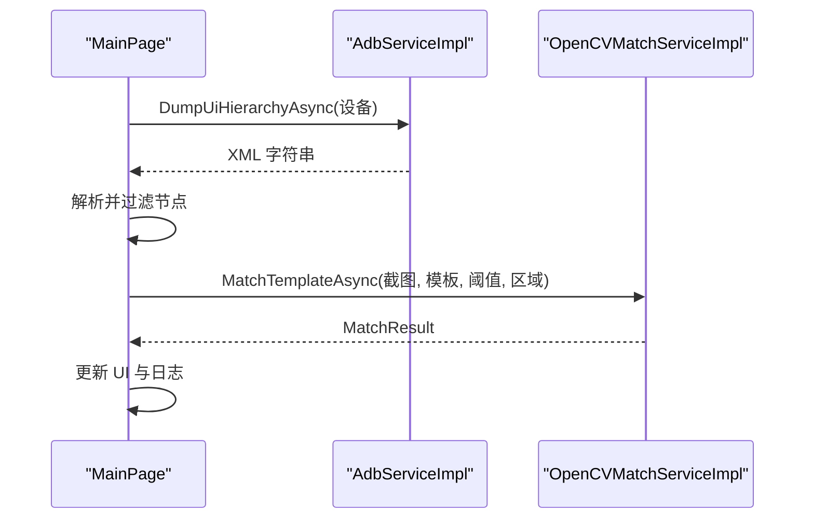
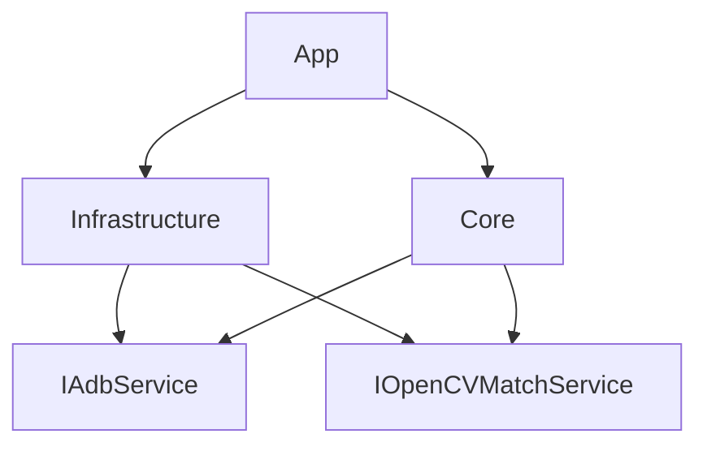

# 项目概述

<cite>
**本文引用的文件**
- [README.md](file://README.md)
- [README_zh_CN.md](file://README_zh_CN.md)
- [App\App.xaml.cs](file://App\App.xaml.cs)
- [App\App.csproj](file://App\App.csproj)
- [App\Views\MainPage.xaml.cs](file://App\Views\MainPage.xaml.cs)
- [App\Views\CanvasView.xaml.cs](file://App\Views\CanvasView.xaml.cs)
- [App\Views\PropertyPanelView.xaml.cs](file://App\Views\PropertyPanelView.xaml.cs)
- [Core\Core.csproj](file://Core\Core.csproj)
- [Core\Services\AutoJS6CodeGenerator.cs](file://Core\Services\AutoJS6CodeGenerator.cs)
- [Core\Abstractions\IAdbService.cs](file://Core\Abstractions\IAdbService.cs)
- [Core\Abstractions\IOpenCVMatchService.cs](file://Core\Abstractions\IOpenCVMatchService.cs)
- [Core\Models\AutoJS6CodeOptions.cs](file://Core\Models\AutoJS6CodeOptions.cs)
- [Infrastructure\Adb\AdbServiceImpl.cs](file://Infrastructure\Adb\AdbServiceImpl.cs)
- [Infrastructure\Imaging\OpenCVMatchServiceImpl.cs](file://Infrastructure\Imaging\OpenCVMatchServiceImpl.cs)
</cite>

## 目录
1. [引言](#引言)
2. [项目结构](#项目结构)
3. [核心组件](#核心组件)
4. [架构总览](#架构总览)
5. [详细组件分析](#详细组件分析)
6. [依赖分析](#依赖分析)
7. [性能考量](#性能考量)
8. [故障排查指南](#故障排查指南)
9. [结论](#结论)
10. [附录](#附录)

## 引言
AutoJS6 可视化开发工具旨在显著降低 AutoJS6 脚本开发的试错成本与重复劳动，聚焦解决以下痛点：
- 图像模板匹配调试困难：反复“截图→写代码→跑设备→失败→调整→再跑”，耗时且易错
- 坐标计算误差大：靠猜测坐标，点击偏差导致反复修正
- 多设备适配复杂：不同分辨率与设备差异导致模板在一台机好用另一台就失效
- UI 层定位繁琐：手动在大量 UI 节点中寻找控件属性，效率低下

本工具通过“双工作区”设计（图像模式与控件模式）与“所见即所得”的可视化能力，将上述问题转化为“所见即所得”的高效开发流程：在本地即可实时预览匹配结果、可视化调整阈值与区域、一键生成 AutoJS6 代码，并支持批量测试与多分辨率验证。

## 项目结构
项目采用 Clean Architecture 分层与 WinUI 3 桌面应用架构，分为三层：
- App：WinUI 3 应用层，负责 UI、MVVM 与用户交互
- Core：纯业务逻辑层，不含 UI 依赖，独立可测试
- Infrastructure：外部依赖适配层，封装 ADB、OpenCV 等第三方能力

图表来源
- [App\App.csproj:1-84](file://App\App.csproj#L1-L84)
- [Core\Core.csproj:1-10](file://Core\Core.csproj#L1-L10)
- [Infrastructure\Adb\AdbServiceImpl.cs:1-238](file://Infrastructure\Adb\AdbServiceImpl.cs#L1-L238)
- [Infrastructure\Imaging\OpenCVMatchServiceImpl.cs:1-204](file://Infrastructure\Imaging\OpenCVMatchServiceImpl.cs#L1-L204)
- [Core\Services\AutoJS6CodeGenerator.cs:1-357](file://Core\Services\AutoJS6CodeGenerator.cs#L1-L357)
- [Core\Abstractions\IAdbService.cs:1-57](file://Core\Abstractions\IAdbService.cs#L1-L57)
- [Core\Abstractions\IOpenCVMatchService.cs:1-57](file://Core\Abstractions\IOpenCVMatchService.cs#L1-L57)
- [Core\Models\AutoJS6CodeOptions.cs:1-89](file://Core\Models\AutoJS6CodeOptions.cs#L1-L89)
- [App\Views\MainPage.xaml.cs:1-409](file://App\Views\MainPage.xaml.cs#L1-L409)
- [App\Views\CanvasView.xaml.cs:1-800](file://App\Views\CanvasView.xaml.cs#L1-L800)
- [App\Views\PropertyPanelView.xaml.cs:1-155](file://App\Views\PropertyPanelView.xaml.cs#L1-L155)

章节来源
- [README.md:230-260](file://README.md#L230-L260)
- [README_zh_CN.md:230-260](file://README_zh_CN.md#L230-L260)

## 核心组件
- 双工作区设计
  - 图像模式：基于像素级模板匹配，支持实时阈值调整、区域裁剪与匹配结果可视化，一键生成 images.findImage() 代码
  - 控件模式：基于 UiSelector 的控件树解析与高亮，支持双向联动（点击树节点高亮画布、点击画布节点展开树），一键生成 UiSelector 代码
- 高性能画布与交互
  - Win2D GPU 加速双图层渲染，60 FPS；支持缩放（10%-500%）、平移、惯性滚动、旋转（90° 步进）、辅助网格与十字准星
  - 交互式裁剪：拖拽顶点/边调整，Shift 锁定宽高比；像素坐标拾取与区域 [x,y,w,h] 自动计算
- ADB 与 OpenCV 能力
  - 一键截图、UI 树拉取、网络设备连接/配对
  - OpenCV TM_CCOEFF_NORMED 模板匹配，支持区域限定与批量匹配
- 代码生成与约束
  - 自动生成 AutoJS6 脚本，严格遵循 Rhino 引擎约束与 OOM 防护建议，支持重试与超时机制

章节来源
- [README.md:166-228](file://README.md#L166-L228)
- [README_zh_CN.md:166-228](file://README_zh_CN.md#L166-L228)

## 架构总览
- 双引擎独立：图像引擎（像素坐标）与 UI 引擎（UiSelector 链）完全解耦，数据源、处理管线、渲染与代码生成路径相互独立
- 单向依赖：App → Infrastructure → Core ← Infrastructure，Core 无 UI 依赖，独立可测试
- 异步优先：所有 I/O（ADB、OpenCV、XML 解析、纹理上传）均采用 async/await，UI 线程永不阻塞

图表来源
- [README.md:264-287](file://README.md#L264-L287)
- [README_zh_CN.md:264-287](file://README_zh_CN.md#L264-L287)

## 详细组件分析

### 组件一：主工作台（MainPage）
- 职责：统一调度设备管理、截图、UI 树解析、画布渲染、属性面板与代码生成
- 关键交互：
  - 设备选择与状态反馈
  - 截图捕获与画布加载
  - UI 树拉取与智能过滤
  - 裁剪模式启停与区域变更
  - 阈值滑条与匹配结果展示
  - 代码生成与日志输出

图表来源
- [App\Views\MainPage.xaml.cs:147-178](file://App\Views\MainPage.xaml.cs#L147-L178)
- [Infrastructure\Adb\AdbServiceImpl.cs:72-118](file://Infrastructure\Adb\AdbServiceImpl.cs#L72-L118)
- [Infrastructure\Imaging\OpenCVMatchServiceImpl.cs:13-60](file://Infrastructure\Imaging\OpenCVMatchServiceImpl.cs#L13-L60)
- [App\Views\CanvasView.xaml.cs:156-160](file://App\Views\CanvasView.xaml.cs#L156-L160)

章节来源
- [App\Views\MainPage.xaml.cs:147-248](file://App\Views\MainPage.xaml.cs#L147-L248)

### 组件二：画布与交互（CanvasView）
- 职责：Win2D 双图层渲染（图像层 + Overlay 层），支持缩放、平移、惯性滚动、裁剪交互、控件边界与匹配结果绘制
- 关键特性：
  - CanvasBitmap 缓存池，避免重复纹理创建
  - 画布坐标与图像坐标的双向转换
  - 裁剪模式：8 个调整手柄、Shift 锁定宽高比、实时区域更新
  - Overlay 透明度与可见性控制

图表来源
- [App\Views\CanvasView.xaml.cs:281-315](file://App\Views\CanvasView.xaml.cs#L281-L315)
- [App\Views\CanvasView.xaml.cs:709-738](file://App\Views\CanvasView.xaml.cs#L709-L738)
- [App\Views\CanvasView.xaml.cs:548-566](file://App\Views\CanvasView.xaml.cs#L548-L566)

章节来源
- [App\Views\CanvasView.xaml.cs:281-315](file://App\Views\CanvasView.xaml.cs#L281-L315)
- [App\Views\CanvasView.xaml.cs:548-566](file://App\Views\CanvasView.xaml.cs#L548-L566)
- [App\Views\CanvasView.xaml.cs:709-738](file://App\Views\CanvasView.xaml.cs#L709-L738)

### 组件三：代码生成器（AutoJS6CodeGenerator）
- 职责：根据图像模式或控件模式生成 AutoJS6 脚本，内置 Rhino 引擎约束校验与 OOM 防护建议
- 图像模式：生成 images.findImage() 代码，支持 region 限定与模板回收
- 控件模式：生成 UiSelector 链（id/text/desc 降级），支持 boundsInside 与点击
- 选项：阈值、重试次数、超时、变量前缀、是否生成日志与回收语句

图表来源
- [Core\Services\AutoJS6CodeGenerator.cs:11-189](file://Core\Services\AutoJS6CodeGenerator.cs#L11-L189)
- [Core\Models\AutoJS6CodeOptions.cs:6-89](file://Core\Models\AutoJS6CodeOptions.cs#L6-L89)

章节来源
- [Core\Services\AutoJS6CodeGenerator.cs:11-357](file://Core\Services\AutoJS6CodeGenerator.cs#L11-L357)
- [Core\Models\AutoJS6CodeOptions.cs:6-89](file://Core\Models\AutoJS6CodeOptions.cs#L6-L89)

### 组件四：ADB 与 OpenCV 服务
- ADB 服务：设备扫描、截图帧缓冲解析、UI 树 XML 拉取、网络设备连接/配对、ADB 路径发现
- OpenCV 服务：模板匹配（单个最佳与全部匹配）、相似度计算、模板有效性校验

图表来源
- [Infrastructure\Adb\AdbServiceImpl.cs:120-138](file://Infrastructure\Adb\AdbServiceImpl.cs#L120-L138)
- [Infrastructure\Imaging\OpenCVMatchServiceImpl.cs:13-60](file://Infrastructure\Imaging\OpenCVMatchServiceImpl.cs#L13-L60)

章节来源
- [Core\Abstractions\IAdbService.cs:8-56](file://Core\Abstractions\IAdbService.cs#L8-L56)
- [Core\Abstractions\IOpenCVMatchService.cs:8-56](file://Core\Abstractions\IOpenCVMatchService.cs#L8-L56)
- [Infrastructure\Adb\AdbServiceImpl.cs:17-238](file://Infrastructure\Adb\AdbServiceImpl.cs#L17-L238)
- [Infrastructure\Imaging\OpenCVMatchServiceImpl.cs:11-204](file://Infrastructure\Imaging\OpenCVMatchServiceImpl.cs#L11-L204)

## 依赖分析
- 项目依赖关系
  - App 依赖 Infrastructure（ADB、OpenCV）
  - App 依赖 Core（代码生成、模型）
  - Core 通过接口抽象对外部依赖进行解耦
- 双引擎隔离
  - 图像引擎与 UI 引擎的数据与处理路径完全独立，互不影响
- 异步与性能
  - 所有 I/O 操作均采用 async/await，配合 Win2D 60 FPS 渲染与 CanvasBitmap 缓存，保证流畅体验

图表来源
- [README.md:272-276](file://README.md#L272-L276)
- [README_zh_CN.md:272-276](file://README_zh_CN.md#L272-L276)

章节来源
- [README.md:264-287](file://README.md#L264-L287)
- [README_zh_CN.md:264-287](file://README_zh_CN.md#L264-L287)

## 性能考量
- 渲染性能
  - Win2D 双图层渲染，CanvasBitmap 缓存池，避免重复纹理创建
  - 60 FPS 定时器驱动的惯性滚动与缩放，保证交互顺滑
- 匹配性能
  - OpenCV TM_CCOEFF_NORMED 算法，支持区域限定与批量匹配，减少不必要的全屏扫描
- I/O 与内存
  - 异步 I/O 与 CancellationToken 支持，避免 UI 阻塞
  - 严格遵循 OOM 防护建议：单轮单截图、最小化检测范围、region 限定、及时回收图像对象

章节来源
- [README.md:184-190](file://README.md#L184-L190)
- [README.md:362-368](file://README.md#L362-L368)
- [README_zh_CN.md:184-190](file://README_zh_CN.md#L184-L190)
- [README_zh_CN.md:362-368](file://README_zh_CN.md#L362-L368)

## 故障排查指南
- ADB 相关
  - ADB 路径未找到：确认 PATH 或 ANDROID_HOME 环境变量包含 adb.exe
  - 设备未在线：检查 USB 调试、驱动与设备状态
  - 连接/配对失败：核对地址与配对码，必要时使用 ConnectDeviceAsync/PareDeviceAsync
- OpenCV 匹配
  - 模板无效：ValidateTemplate 返回 false，需重新裁剪或更换模板
  - 匹配结果为空：降低阈值或缩小 region，检查模板是否与截图内容一致
- 画布渲染
  - 位图释放异常：确保 CanvasBitmap 缓存池与生命周期管理正确
  - 缩放/平移异常：检查视图状态与坐标转换函数
- 代码生成
  - Rhino 引擎约束：循环体内禁止使用 const/let，应使用 var
  - OOM 风险：避免在循环内重复 captureScreen，合理设置 region 与模板回收

章节来源
- [Infrastructure\Adb\AdbServiceImpl.cs:190-236](file://Infrastructure\Adb\AdbServiceImpl.cs#L190-L236)
- [Infrastructure\Imaging\OpenCVMatchServiceImpl.cs:150-161](file://Infrastructure\Imaging\OpenCVMatchServiceImpl.cs#L150-L161)
- [App\Views\CanvasView.xaml.cs:448-456](file://App\Views\CanvasView.xaml.cs#L448-L456)
- [Core\Services\AutoJS6CodeGenerator.cs:226-258](file://Core\Services\AutoJS6CodeGenerator.cs#L226-L258)

## 结论
AutoJS6 可视化开发工具通过“双工作区”与“所见即所得”的可视化能力，系统性地解决了图像模板匹配调试、坐标计算误差与多设备适配等长期痛点。依托 Clean Architecture 的分层设计与 WinUI 3 + Win2D 的高性能渲染，项目在功能完整性与工程可维护性之间取得了良好平衡。对于初学者，工具提供了清晰的快速开始流程与直观的界面；对于有经验的开发者，严格的接口抽象、异步架构与代码生成约束则保障了扩展与演进空间。

## 附录

### 快速开始
- 系统要求
  - Windows 10/11（构建号 22621.0+）
  - .NET 8 SDK
  - Visual Studio 2022/2026（含 WinUI 3 工作负载）
  - Android Debug Bridge (ADB) 在 PATH 中
- 安装步骤
  - 克隆仓库并恢复 NuGet 包
  - 配置环境变量（如需）
  - 构建并运行应用
- 基本使用流程
  - 图像模式：截图 → 交互式裁剪 → 实时阈值调整 → 预览匹配 → 导出代码
  - 控件模式：截图 → 拉取 UI 树 → 高亮控件边界 → 选择控件 → 生成 UiSelector 代码

章节来源
- [README.md:110-163](file://README.md#L110-L163)
- [README_zh_CN.md:110-163](file://README_zh_CN.md#L110-L163)