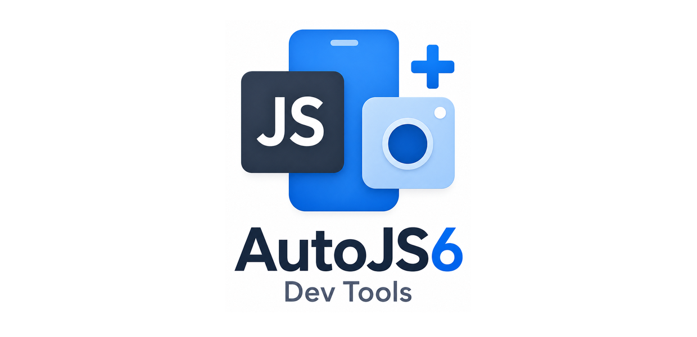
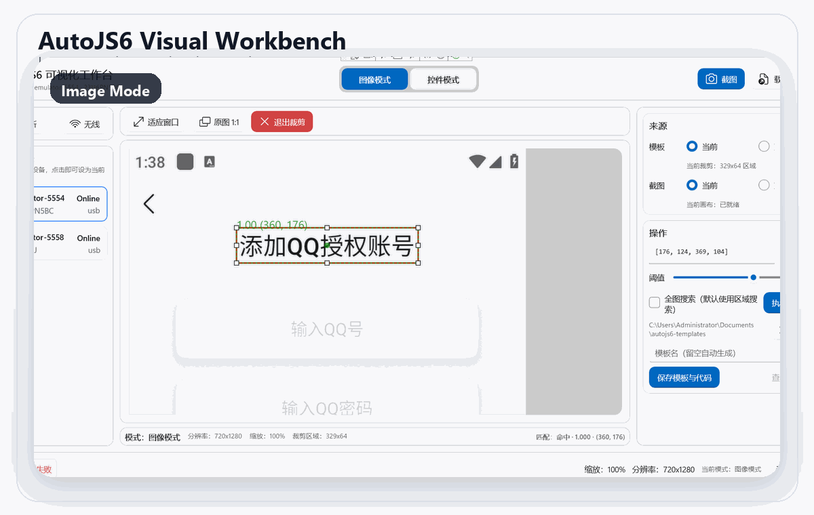
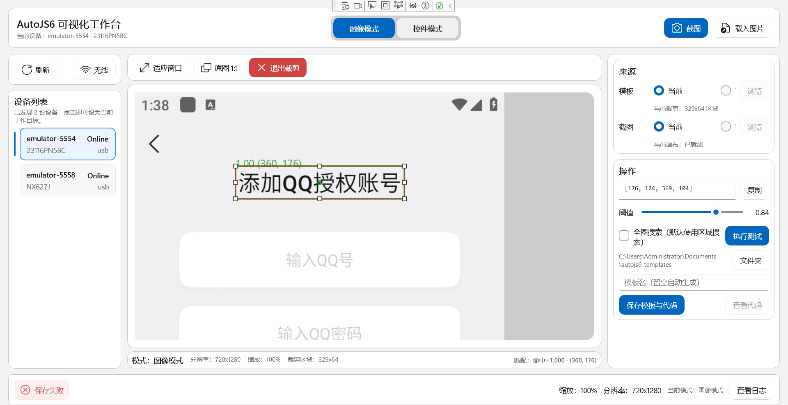
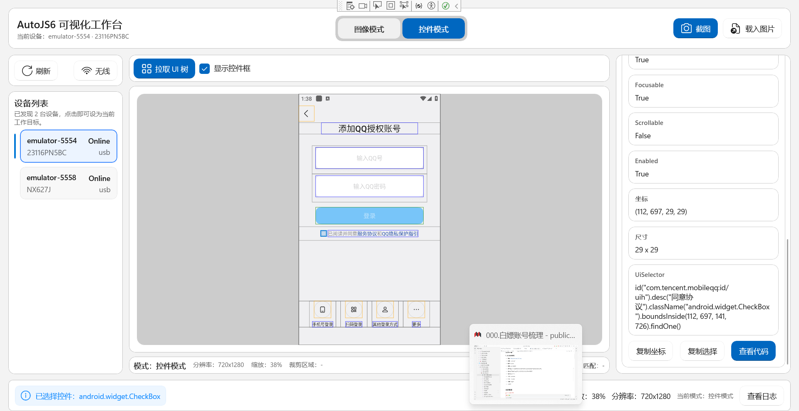

# AutoJS6 可视化开发工具包

[English](README.md) | [简体中文](README_zh_CN.md)

<p align="center">
  
</p>

🎯 AutoJS6 脚本开发辅助工具，提供可视化截图分析、UI 控件解析、图像匹配预览和 AutoJS6 脚本代码生成。

> **选择适合你平台策略的版本**  
> `autojs6-dev-tools` 是 Windows 原生高性能版。  
> 如果你需要跨平台增强版，请参阅 [`autojs6-dev-tools-plus`](https://github.com/terwer/autojs6-dev-tools-plus)。  
> 两个项目都由我原创设计并持续维护，作为同一 AutoJS6 工具体系下、面向不同平台目标的产品。

> **图像识别调试 20 次才跑通？换台设备又失效？**  
> 用这个工具：实时预览匹配结果 • 可视化调整阈值和区域 • 自动生成 AutoJS6 代码

[](https://dotnet.microsoft.com/)
[](https://microsoft.github.io/microsoft-ui-xaml/)
[](LICENSE.txt)

---

## ⚡ 一眼看懂这个工具

把截图分析、控件树检查和 AutoJS6 代码生成收进同一个 Windows 原生工作台。你可以直接可视化调整匹配区域与阈值、验证当前 UI 树上的选择器，并导出可粘贴的 AutoJS6 代码，不再在截图软件、终端和真机试错之间来回切换。

<p align="center">
  
</p>

<p align="center">
  <sub>模板裁剪 · 阈值调节 · 控件边界查看 · AutoJS6 代码生成</sub>
</p>

## 🖥️ 双工作区界面

<table>
  <tr>
    <td width="50%" align="center" valign="top">
      <br/>
      <sub><b>图像模式</b> · 用于模板裁剪、OpenCV 匹配预览与基于 <code>images.findImage()</code> 的 AutoJS6 代码导出。</sub>
    </td>
    <td width="50%" align="center" valign="top">
      <br/>
      <sub><b>控件模式</b> · 用于解析 Android UI 树、查看控件边界，并生成基于 UiSelector 的 AutoJS6 交互代码。</sub>
    </td>
  </tr>
</table>

---

## 😫 你肯定经历过的痛苦

**没有这个工具开发 AutoJS6 脚本时：**

1. 📸 截图 → 手动裁剪模板 → 保存 → 写代码 → 跑真机测试
2. 📝 猜坐标（x: 500？520？540？）→ 写代码 → 跑真机测试
3. ❌ 模板没找到 → 调整裁剪 2 像素 → 再跑一次
4. 🔄 重复 20 次直到能用
5. 📱 换台设备测试 → 分辨率不同 → 从头再来
6. 🤔 阈值设 0.8 还是 0.85？→ 一个个在真机上试
7. 🌲 需要 resource-id？→ 在 5000 个 UI 节点里手动翻
8. 💥 点击偏了 10 像素 → 重新算偏移量 → 再跑一次

**每天浪费几小时。天天如此。**

---

## ✨ 这个工具实际能做什么

**在真机运行之前就能看到模板匹配结果：**
- 拖拽裁剪模板 → 立即看到匹配置信度（0.95？0.62？）
- 调节阈值滑块 → 实时看到匹配结果出现/消失
- 裁剪不对？调整 2 像素 → 立即看到结果
- 不再需要"跑 → 失败 → 调整 → 再跑"的循环

**用鼠标拾取坐标，不用猜：**
- 鼠标悬停截图 → 看到精确像素坐标（x: 523, y: 187）
- 点击标记 → 坐标自动复制到剪贴板
- 拖拽矩形 → 自动获取区域 [x, y, w, h]
- 不再需要"试试 x+10... 不对，试试 x+15..."

**自动生成 AutoJS6 代码：**
- 选择模板 → 点击"生成代码" → 得到完整脚本
- 图像模式：`images.findImage()` 带正确的阈值和区域
- 控件模式：`id().text().findOne()` 带降级选择器
- 复制粘贴即用，不用手写

**无需真机测试多分辨率：**
- 加载 3 台设备的截图 → 在所有截图上测试模板
- 看到哪个分辨率失败 → 调整一次裁剪 → 全部通过
- 不再"我手机能用但用户手机不行"

---

## 💡 谁需要这个工具？

**你需要这个工具，如果：**
- ✅ 每天花 >30 分钟裁剪截图和调整坐标
- ✅ 在多台不同分辨率的 Android 设备上测试脚本
- ✅ 频繁使用图像识别功能
- ✅ 需要手动搜索 UI 树找控件属性
- ✅ 想在不跑真机的情况下预览匹配结果

**你不需要这个工具，如果：**
- ❌ 只用简单的固定坐标点击
- ❌ 从不使用图像匹配或控件选择器
- ❌ 享受每个功能手动调试 20 次的乐趣

---

## 🚀 快速开始

### 前置要求

- **💻 操作系统**：Windows 10/11（Build 22621.0+）
- **⚙️ 运行时**：.NET 8 SDK
- **🛠️ IDE**：Visual Studio 2022/2026 带 WinUI 3 工作负载
- **📱 工具**：Android Debug Bridge (ADB) 在 PATH 中

### 本地 release 验包额外依赖

- **MSBuild + SignTool**：安装 Visual Studio 2022/2026 或带 Windows 10/11 SDK 的 Build Tools
- **Inno Setup 6**：生成 EXE 安装器时需要 `ISCC.exe`
- **说明**：本地 release 脚本现在会自动探测 `ISCC.exe`、`msbuild.exe`、`signtool.exe`，缺失时会直接给出清晰提示

### GitHub / 代理说明（如无法访问 GitHub）

如果你所在网络环境无法直接访问 GitHub，建议先阅读：

- [`PROXY_zh_CN.md`](PROXY_zh_CN.md)

否则以下操作都可能失败：

- `git clone`
- `git push`
- 把 `.github/workflows/*` 推到 GitHub 后再验证 Actions

> 特别注意：  
> 如果 `origin` 仍然是 `git@github.com:...` 这种 SSH 远端，仅设置 `HTTP_PROXY` / `HTTPS_PROXY` 往往**不够**。  
> 最省事的默认方案通常是：**改成 HTTPS 远端，再给 Git 配代理。**

### 1️⃣ 克隆仓库

```bash
git clone https://github.com/terwer/autojs6-dev-tools.git
cd autojs6-dev-tools
```

### 2️⃣ 安装依赖

```bash
# 恢复 NuGet 包
dotnet restore
```

### 3️⃣ 配置可选参考路径

如需本地查阅 AutoJS6 API/源码，可编辑 `AGENTS.md` 设置本地路径：

```bash
AUTOJS6_DOCS_ROOT="C:\path\to\AutoJs6-Documentation"
AUTOJS6_SOURCE_ROOT="C:\path\to\AutoJs6"
```

### 4️⃣ 构建并运行

```bash
# 恢复解决方案依赖
dotnet restore autojs6-dev-tools.slnx

# 构建解决方案
dotnet build autojs6-dev-tools.slnx

# 运行应用
dotnet run --project App/App.csproj
```

或在 Visual Studio 中打开 `autojs6-dev-tools.slnx` 并按 F5。

---

## ✨ 核心功能

### 🖼️ 图像处理引擎（像素级）

- **📸 实时截图捕获**：一键通过 ADB 拉取设备截图
- **✂️ 交互式裁剪**：拖拽顶点/边调整，Shift 锁定宽高比
- **🎯 像素坐标拾取**：鼠标悬停显示精确坐标，Ctrl 十字准线锁定
- **🔍 OpenCV 模板匹配**：TM_CCOEFF_NORMED 算法，可调阈值（0.50-0.95）
- **💾 模板导出**：保存裁剪区域为 PNG，附带偏移量元数据

### 🌲 UI 图层分析引擎（控件级）

- **📱 Android UI 树解析**：拉取并解析 uiautomator dump 数据
- **🧹 智能布局过滤**：自动移除 70%+ 冗余布局容器
- **🎨 控件边界框渲染**：按类型着色（蓝色=文本，绿色=按钮，橙色=图片）
- **🔗 双向同步**：点击 TreeView → 高亮画布，点击画布 → 展开 TreeView
- **📋 属性面板**：一键复制坐标、文本或 XPath 表达式

### 🎨 高性能画布

- **⚡ 60 FPS 渲染**：Win2D GPU 加速双图层架构
- **🔍 缩放与平移**：鼠标滚轮缩放（10%-500%，以光标为中心），拖拽平移带惯性
- **🔄 旋转支持**：90° 步进旋转，坐标系保持一致
- **📏 辅助工具**：像素标尺、10x10 网格、十字准线锁定

### 🤖 AutoJS6 代码生成器

**图像模式**（基于像素匹配）
```javascript
// 自动生成的 AutoJS6 代码
requestScreenCapture();
var template = images.read("./assets/login_button.png");
var result = images.findImage(screen, template, {
    threshold: 0.85,
    region: [100, 200, 300, 400]
});
if (result) {
    click(result.x + 150, result.y + 25);
    log("点击登录按钮");
}
template.recycle();
```

**控件模式**（基于选择器）
```javascript
// 自动生成的 AutoJS6 代码
var widget = id("com.example:id/login_button").findOne();
if (!widget) widget = text("登录").findOne();
if (!widget) widget = desc("登录按钮").findOne();
if (widget) {
    widget.click();
    log("点击登录按钮");
}
```

### ⚡ 实时匹配测试

- **🎚️ 实时阈值调节**：滑块（0.50-0.95）带即时视觉反馈
- **✅ UiSelector 验证**：对当前 UI 树测试选择器
- **📐 坐标对齐检查**：验证控件边界与截图像素是否匹配
- **📊 批量测试**：加载多个模板，生成汇总报告

---

## 📁 项目结构

```
autojs6-dev-tools/
├── App/                        # WinUI 3 桌面应用
│   ├── Views/                  # 页面与自定义控件
│   ├── ViewModels/             # MVVM 视图模型
│   ├── Services/               # 应用层编排服务
│   ├── Models/                 # 面向 UI 的模型
│   ├── Resources/              # 样式与资源字典
│   ├── CodeTemplates/          # AutoJS6 代码模板
│   └── App.csproj
├── Core/                       # 纯业务逻辑（无 UI 依赖）
│   ├── Abstractions/           # 服务接口
│   ├── Models/                 # 领域模型
│   ├── Services/               # 核心业务服务
│   ├── Helpers/                # 工具类
│   └── Core.csproj
├── Infrastructure/             # 外部依赖适配层
│   ├── Adb/                    # ADB 通信
│   ├── Imaging/                # OpenCV / 图像处理封装
│   └── Infrastructure.csproj
├── App.Tests/                  # 应用/UI 测试
├── Core.Tests/                 # Core 单元测试
├── docs/
│   └── images/                 # README 截图与演示资源
├── openspec/                   # OpenSpec 变更提案
├── AGENTS.md                   # 核心设计原则（AI agent 上下文）
├── autojs6-dev-tools.slnx      # 解决方案入口
└── README.md                   # 本文件
```

---

## 🏗️ 架构原则

### 🔀 双引擎独立（严格隔离）

- **🖼️ 图像引擎**：像素/位图 → 绝对像素坐标 (x, y, w, h)
- **🌲 UI 引擎**：控件树 → UiSelector 链 (id().text().findOne())
- **🚫 零耦合**：数据源、处理管线、渲染逻辑、代码生成路径完全解耦

### ⬇️ 单向依赖

```
App → Infrastructure → Core ← Infrastructure
```

- **🎯 Core**：纯业务逻辑，无 UI 依赖，可独立测试
- **🔌 Infrastructure**：外部依赖封装（SharpAdbClient、OpenCvSharp4）
- **🎨 App**：仅 UI 与 MVVM

### ⚡ 异步优先架构

- 所有 I/O 操作（ADB、OpenCV、XML 解析、纹理上传）使用 `async/await`
- UI 线程永不阻塞
- 后台操作支持 `CancellationToken`

---

## 🛠️ 关键技术

| 组件 | 技术 | 用途 |
|-----------|-----------|---------|
| 🎨 UI 框架 | WinUI 3 + Windows App SDK 1.5+ | 原生 Windows 桌面 UI |
| 🖼️ 渲染 | Microsoft.Graphics.Win2D | 60 FPS GPU 加速画布 |
| 🔍 图像处理 | OpenCvSharp4.Windows + SixLabors.ImageSharp | 模板匹配与图像处理 |
| 📱 ADB 通信 | SharpAdbClient | Android 设备控制 |
| 🔗 MVVM | CommunityToolkit.Mvvm | 视图模型绑定与命令 |
| 🏗️ 架构 | Clean Architecture | 分层关注点分离 |

---

## 👨‍💻 开发工作流

### 📖 实施前

1. 阅读 `AGENTS.md` 了解核心设计原则
2. 阅读 `openspec/project.md` 了解开发清单
3. 查阅当前仓库实现、测试和代码模板
4. 查阅 AutoJS6 文档和源码

### 💻 实施中

- ✅ 保持双引擎独立
- ✅ 遵循单向依赖规则
- ✅ 所有 I/O 操作使用 async/await
- ✅ 模块保持在 512 行以内
- ✅ 为 Core 层编写测试

### ✔️ 提交前

- ✅ 验证项目层依赖关系（App → Infrastructure → Core）
- ✅ 验证双引擎隔离
- ✅ 验证异步架构
- ✅ 验证 60 FPS 渲染性能
- ✅ 运行单元测试

### 🚢 发布前自检清单

- ✅ 先运行 `dotnet build autojs6-dev-tools.slnx -c Release`
- ✅ 再运行 `dotnet test autojs6-dev-tools.slnx -c Release`
- ✅ 合并 release PR 之前，先运行 `manual-release-test`，并保持不上传到 GitHub Release
- ✅ 本地至少先对 `win-x64` 便携版做一次冒烟启动检查
- ✅ 确认 `win-x64` 和 `win-arm64` 都能产出 ZIP、安装器 EXE
- ✅ 在尽量干净的 Windows 环境里先冒烟验证 ZIP 或 EXE 能正常运行
- ✅ 确认生成出来的产品名、包标识、发布者都正确
- ✅ 如果正式 Release 已创建但发包失败，优先用 `manual-release-test` 重打并补传资产，不要凭感觉硬修
- ✅ 如果正式包有问题，优先修复代码并发下一个 patch 版本，不要直接改写已发布正式 tag

---

## ⚠️ AutoJS6 代码生成约束

生成的代码必须符合 AutoJS6 运行时约束：

### 🐛 Rhino 引擎限制

```javascript
// ❌ 错误：循环体内用 const/let（Rhino bug - 变量不会重新绑定）
while (true) {
    const result = computeSomething();
    process(result);  // result 保持第一次迭代的值！
}

// ✅ 正确：循环体内用 var
while (true) {
    var result = computeSomething();
    process(result);  // result 每次迭代正确更新
}
```

### 💾 OOM 预防

- **📸 单轮单截图**：永远不要在一个循环里多次调用 `captureScreen()`
- **🎯 最小化场景检测范围**：不要每次迭代扫描所有模板
- **📐 优先基于区域匹配**：使用 `region: [x, y, w, h]` 而不是全屏
- **♻️ 回收 ImageWrapper 对象**：使用后立即调用 `.recycle()`

### ✂️ 模板裁剪规则

**✅ 包含**：文字、图标、固定边框  
**❌ 排除**：红点、数字、倒计时、动态数值

---

## 🤝 贡献

欢迎贡献！请：

1. 🍴 Fork 仓库
2. 🌿 创建功能分支（`git checkout -b feature/amazing-feature`）
3. 📖 仔细阅读 `AGENTS.md` 和 `openspec/project.md`
4. 🏗️ 遵循架构原则
5. ✅ 为 Core 层变更编写测试
6. 💬 清晰的提交信息（`git commit -m 'add amazing feature'`）
7. 🚀 推送到你的分支（`git push origin feature/amazing-feature`）
8. 🔀 打开 Pull Request

---

## 🎯 目标用户

本工具包面向需要可视化截图分析、控件检查、模板匹配和代码生成的 AutoJS6 开发者。

---

## 📚 文档

- **📘 AGENTS.md**：核心设计原则与约束（优先阅读）
- **📗 openspec/project.md**：开发清单与验证规则
- **📙 DEVELOPMENT.md**：发布自动化、手动测试发包、修复与回退说明（英文）
- **📕 DEVELOPMENT_zh_CN.md**：发布自动化、手动测试发包、修复与回退说明（中文）
- **📂 openspec/changes/**：OpenSpec 变更提案

---

## 📚 发版测试文档入口

如果你现在关心的是 **发版测试 / GitHub Actions / 验包 / 补包**，请直接先看：

- [`RELEASE_TEST_zh_CN.md`](RELEASE_TEST_zh_CN.md)

它会告诉你接下来应该看：

- `manual.md`
- `checklist.md`
- `PROXY_zh_CN.md`
- `DEVELOPMENT_zh_CN.md`

---

## 📄 许可证

本项目采用 MIT 许可证 - 详见 [LICENSE.txt](LICENSE.txt) 文件。

---

## 🙏 致谢

- [AutoJS6](https://github.com/SuperMonster003/AutoJs6) - Android 自动化框架
- [WinUI 3](https://microsoft.github.io/microsoft-ui-xaml/) - 现代 Windows UI 框架
- [Win2D](https://github.com/microsoft/Win2D) - GPU 加速 2D 图形
- [OpenCvSharp](https://github.com/shimat/opencvsharp) - .NET 的 OpenCV 封装

---

## 💬 支持

- 📖 [文档](openspec/)
- 🐛 [问题追踪](https://github.com/terwer/autojs6-dev-tools/issues)
- 💬 [讨论区](https://github.com/terwer/autojs6-dev-tools/discussions)

---

## ☕ 请我喝杯咖啡

如果这个工具为你节省了数小时的重复劳动，请考虑请我喝杯咖啡！你的支持让这个项目持续更新，帮助我投入更多时间开发新功能。

**支持方式：**

<table>
  <tr>
    <td align="center">
      <br/>
      <b>微信支付</b><br/>
      <br/>
      <sub>扫码赞助</sub>
    </td>
    <td align="center">
      <br/>
      <b>支付宝</b><br/>
        <br/>
      <sub>扫码赞助</sub>
    </td>
    <td align="center">
      <br/>
      <b>爱发电</b><br/>
      <a href="https://afdian.net/@terwer">
        
      </a><br/>
      <sub>月度赞助</sub>
    </td>
  </tr>
</table>

**你的支持将用于：**
- ⚡ 持续开发与维护
- 🎯 基于社区反馈开发新功能
- 📚 专业文档与视频教程
- 🛠️ 长期稳定性与更新

**赞助者专享：**
- 🌟 项目致谢名单
- 💬 直接沟通渠道
- 🚀 新功能抢先体验

每一份贡献都很重要。感谢！🙏

### 💖 赞助者

虚位以待

---

**用 ❤️ 为 AutoJS6 开发者打造**
